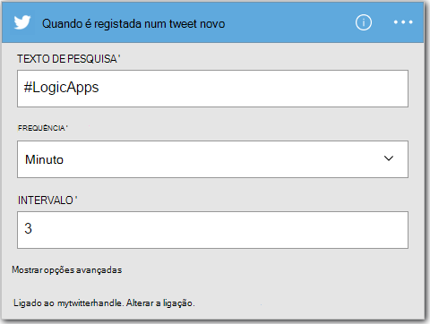
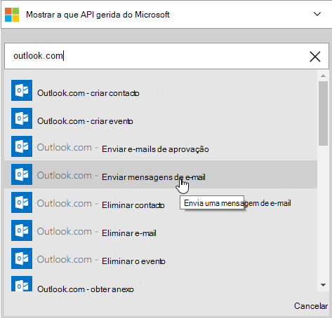
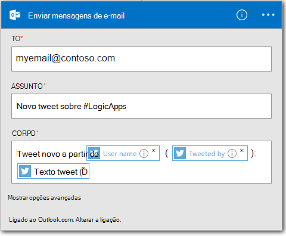

<properties
    pageTitle="Criar uma aplicação de lógica | Microsoft Azure"
    description="Saiba como criar uma aplicação de lógica ligar SaaS serviços"
    authors="jeffhollan"
    manager="dwrede"
    editor=""
    services="logic-apps"
    documentationCenter=""/>

<tags
    ms.service="logic-apps"
    ms.workload="na"
    ms.tgt_pltfrm="na"
    ms.devlang="na"
    ms.topic="get-started-article"
    ms.date="10/18/2016"
    ms.author="jehollan"/>

# Criar uma nova aplicação de lógica ligar SaaS serviços

Este tópico demonstra como, em apenas alguns minutos, pode começar a trabalhar com [Aplicações do Azure lógica](app-service-logic-what-are-logic-apps.md). Explicaremos através de um fluxo de trabalho simple que permite-lhe enviar tweets interessantes ao seu e-mail.

Para utilizar este cenário, é necessário:

- Uma subscrição do Azure
- Uma conta do Twitter
- Um Outlook.com ou alojada caixa de correio do Office 365

## Criar uma nova aplicação de lógica para enviar por e-mail tweets

1. No [dashboard de portal Azure](https://portal.azure.com), selecione **Novo**. 
2. Na barra de pesquisa, procure ' lógica ' e, em seguida, selecione a **Aplicação de lógica**. Também pode selecionar **Novo**, **Web + Mobile**e selecione **A aplicação de lógica**. 
3. Introduza um nome para a sua aplicação de lógica, selecione uma localização, grupo de recursos e selecione **Criar**.  Se selecionar **Afixar ao Dashboard** a aplicação de lógica serão abertos automaticamente uma vez implementado.  
4. Depois de abrir a sua aplicação de lógica pela primeira vez pode selecionar a partir de um modelo para começar.  Por agora, clique em **Aplicação lógica vazia** para criar este de raiz. 
1. O primeiro item que tem de criar é o accionador.  Este é o evento que comece a sua aplicação de lógica.  Procure o **twitter** na caixa de pesquisa de accionador e selecione.
7. Agora irá escreva num termo de pesquisa acionado no.  A **frequência** e o **intervalo** vai determinar com que frequência Verifique a aplicação de lógica tweets novos (e devolvido intervalo específico de tempo de todos os tweets durante que).
    

5. Selecione o botão de **novo passo** e, em seguida, selecione **Adicionar uma ação** ou **Adicionar uma condição**
6. Quando seleciona **uma ação de adicionar**, pode procurar a partir do [conectores disponíveis](../connectors/apis-list.md) para escolher uma ação. Por exemplo, pode selecionar **Outlook.com - enviar correio eletrónico** para enviar e-mails a partir de um endereço de outlook.com:  
    

7. Agora tem de preencher os parâmetros para o e-mail que pretende:  

8. Por fim, selecione **Guardar** para tornar a sua aplicação de lógica live.

## Gerir a sua aplicação de lógica após a criação

Agora a sua aplicação de lógica está a trabalhar. -Lo irá verificar periodicamente para tweets com o termo de pesquisa introduzido. Quando encontrar um tweet correspondente,-enviar-lhe uma mensagem de e-mail. Por fim, irá ver como desativar a aplicação ou consulte o artigo como está a fazer.

1. Aceda ao [Portal do Azure](https://portal.azure.com)

1. Clique em **Procurar** no lado esquerdo do ecrã e selecione **Aplicações lógica**.

2. Clique na aplicação de lógica nova que acabou de criar para ver o estado atual e as informações gerais.

3. Para editar a nova aplicação de lógica, clique em **Editar**.

5. Para desativar a aplicação, clique em **desativar** na barra de comandos.

1. Vista de executar e acionar históricos para monitorizar quando a aplicação de lógica está em execução.  Pode clicar em **Atualizar** para ver os dados mais recentes.

Em menos de 5 minutos foram conseguir configurar uma aplicação de lógica simples a ser executada em nuvem. Para saber mais sobre como utilizar funcionalidades de lógica aplicações, consulte o artigo [utilizar funcionalidades de aplicação de lógica]. Para saber mais sobre as definições de aplicação de lógica eles próprios, consulte o artigo [definições de aplicação de lógica de autor](app-service-logic-author-definitions.md).

<!-- Shared links -->
[Azure portal]: https://portal.azure.com
[Utilizar funcionalidades de aplicação de lógica]: app-service-logic-create-a-logic-app.md
