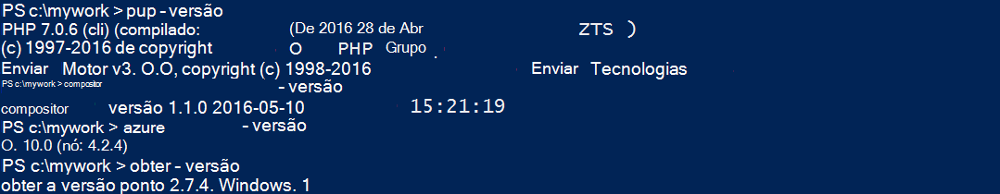
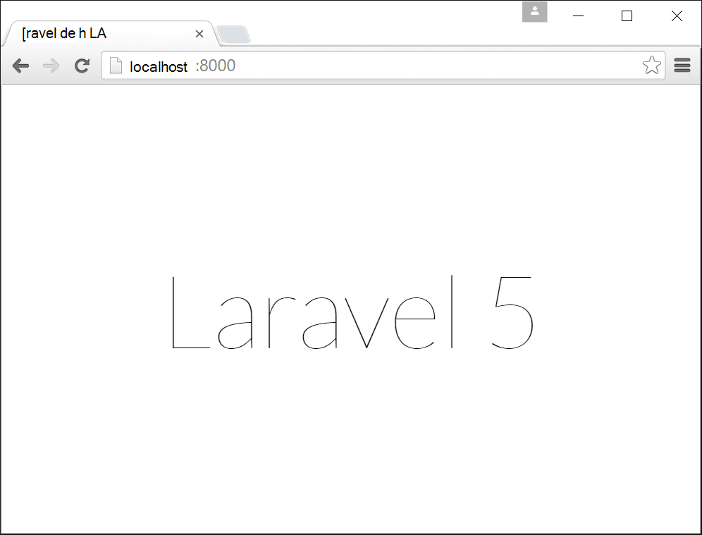
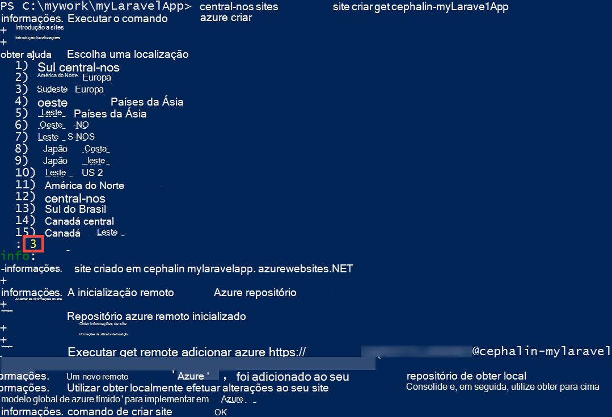
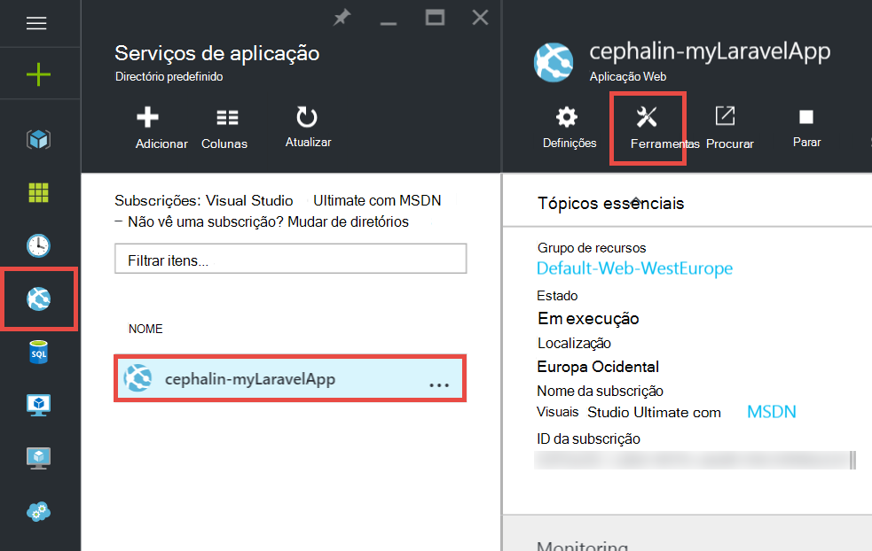
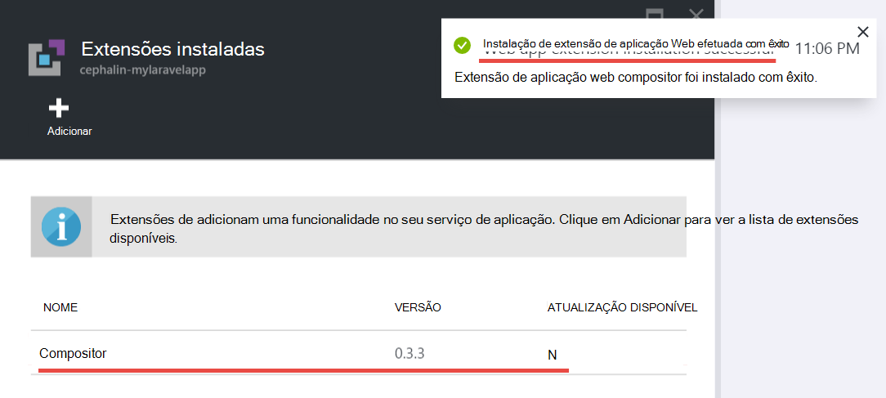
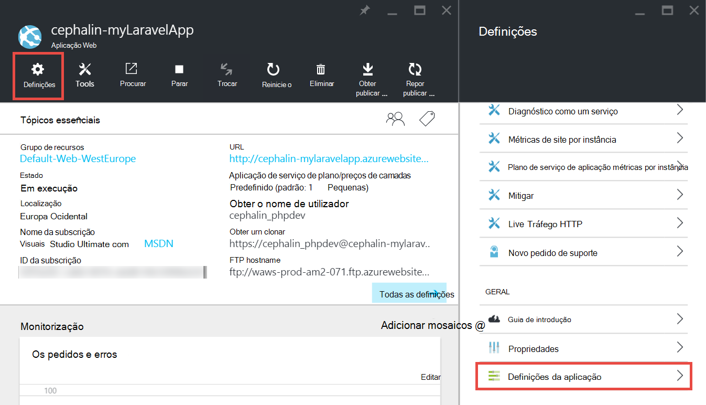
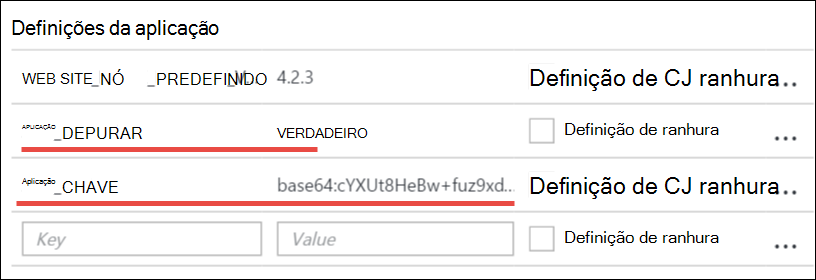
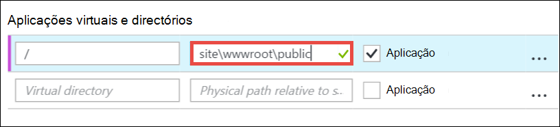
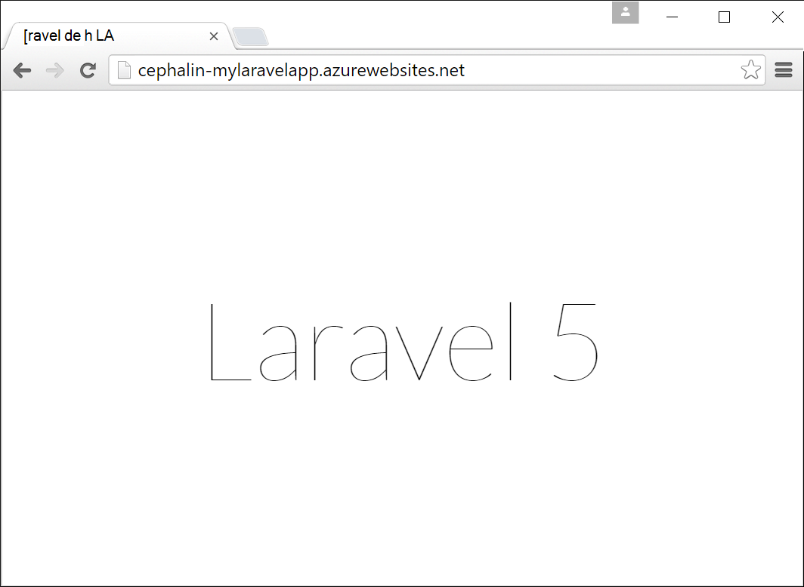
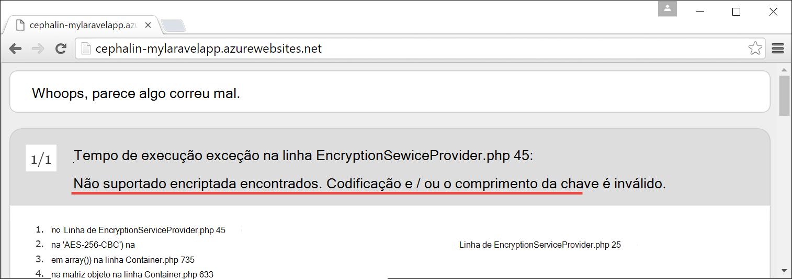

<properties
    pageTitle="Criar, configurar e implementar uma aplicação web do PHP Azure"
    description="Tutorial que mostra como fazer uma aplicação web do PHP (Laravel) executar na aplicação de serviço de Azure. Saiba como configurar o serviço de aplicação do Azure para cumprir os requisitos do quadro PHP que escolher."
    services="app-service\web"
    documentationCenter="php"
    authors="cephalin"
    manager="wpickett"
    editor=""
    tags="mysql"/>

<tags
    ms.service="app-service-web"
    ms.workload="web"
    ms.tgt_pltfrm="na"
    ms.devlang="PHP"
    ms.topic="article"
    ms.date="06/03/2016" 
    ms.author="cephalin"/>

# Criar, configurar e implementar uma aplicação web do PHP Azure

[AZURE.INCLUDE [tabs](../../includes/app-service-web-get-started-nav-tabs.md)]

Este tutorial mostra-lhe como criar, configurar e implementar uma aplicação web do PHP para Azure e como configurar o serviço de aplicação do Azure para cumprir os requisitos da sua aplicação web do PHP. No final do tutorial, terá uma [Laravel](https://www.laravel.com/) web app em execução direto na [Aplicação de serviço de Azure](../app-service/app-service-value-prop-what-is.md)a funcionar.

Como um programador PHP, pode trazer com os seus framework PHP favorito para Azure. Neste tutorial utiliza Laravel simplesmente como um exemplo de aplicação betão. Vai aprender: 

- Implementar utilizando Git
- Versão do conjunto de PHP
- Utilizar um ficheiro de início que não está no directório da aplicação de raiz
- Variáveis de específicas do ambiente de acesso
- Atualizar a sua aplicação no Azure

Pode aplicar o que aprendeu aqui às outras aplicações web PHP que implemente Azure.

>[AZURE.INCLUDE [app-service-linux](../../includes/app-service-linux.md)] 

## Pré-requisitos

- Instalar [PHP 5.6.x](http://php.net/downloads.php) (PHP 7 suporte é beta)
- Instalar [Compositor](https://getcomposer.org/download/)
- Instalar o [clip Azure](../xplat-cli-install.md)
- Instalar [Git](http://www.git-scm.com/downloads)
- Obter uma conta do Microsoft Azure. Se não tiver uma conta, pode [Inscrever-se para uma avaliação gratuita](/pricing/free-trial/?WT.mc_id=A261C142F) ou [Ativar os benefícios da sua Visual Studio subscritor](/pricing/member-offers/msdn-benefits-details/?WT.mc_id=A261C142F).

>[AZURE.NOTE] Consulte o artigo uma aplicação web em ação. [Experimente aplicação de serviço de](http://go.microsoft.com/fwlink/?LinkId=523751) imediatamente e criar uma aplicação starter curto — sem cartão de crédito obrigatório, sem compromissos.

## Criar uma aplicação PHP (Laravel) no seu computador Dev Center

1. Abra uma nova linha de comandos do Windows, janela PowerShell, Linux shell ou terminal dos X. Execute os seguintes comandos para verificar as ferramentas necessárias estão correctamente instaladas no seu computador. 

        php --version
        composer --version
        azure --version
        git --version

    

    Se ainda não tiver instalado as ferramentas, consulte [Pré-requisitos](#Prerequisites) para ligações de transferência.
    
2. Instalar Laravel desta forma:

        composer global require "laravel/installer

3. `CD`para um diretório de trabalho e criar uma nova aplicação Laravel desta forma:

        cd <working_directory>
        laravel new <app_name>

4. `CD`para recentemente criado `<app_name>` diretório e teste a aplicação desta forma:

        cd <app_name>
        php artisan serve
        
    Deverá conseguir navegar para http://localhost:8000 num browser agora e ver o ecrã inicial do Laravel.
    
    
    
Por isso, até ao momento, apenas o fluxo de trabalho normal Laravel e não está a aqui para <a href="https://laravel.com/docs/5.2" rel="nofollow">saber Laravel</a>. Por isso, vamos mover.

## Criar uma aplicação web do Azure e configurar a implementação de Git

>[AZURE.NOTE] "Aguarde! E se quiser implementar com FTP?" Existe um [FTP tutorial](web-sites-php-mysql-deploy-use-ftp.md) para as suas necessidades. 

Com o clip Azure, pode criar uma aplicação web na aplicação de serviço de Azure e configurá-la para implementação Git com uma única linha de comandos. Vamos fazê-lo.

1. Alterar o modo de ASM e iniciar sessão no Azure:

        azure config mode asm
        azure login
    
    Seguir a mensagem de ajuda para continuar o processo de início de sessão.
    
    

4. Execute o comando para criar a aplicação Azure web com Git implementação. Quando lhe for pedido, especifique o número da região pretendida.

        azure site create --git <app_name>
    
    
    
    >[AZURE.NOTE] Se nunca configurou credenciais de implementação para a sua subscrição Azure, será solicitado criá-los. Estas credenciais, não as credenciais da conta Azure, são utilizadas pelo serviço de aplicação apenas para implementações Git e inícios de sessão de FTP. 
    
    Este comando cria um novo repositório de Git no diretório atual (com `git init`) e liga-lo para o repositório no Azure como um controlo remoto Git (com `git remote add`).

<a name="configure"/>
## Configurar a aplicação web do Azure

Para a sua aplicação Laravel trabalhar no Azure, tem de prestar atenção às várias coisas. O que irá fazer este exercício semelhante para o seu framework PHP à escolha.

- Configurar PHP 5.5.9 ou acima. Consulte o artigo [Requisitos do servidor de 5.2 Laravel mais recente](https://laravel.com/docs/5.2#server-requirements) para toda a lista de requisitos do servidor. O resto da lista são as extensões de que já estão ativados para as instalações do PHP do Azure. 
- Definir as variáveis de ambiente sua aplicação necessita. Laravel utiliza o `.env` ficheiro para fácil definição de variáveis de ambiente. No entanto, uma vez que não é suposto para consolidada no controlo de origem (consulte [Configuração de ambiente de Laravel](https://laravel.com/docs/5.2/configuration#environment-configuration), irá configurar as definições de aplicação da sua aplicação Azure web em vez disso.
- Certifique-se de que ponto de entrada a aplicação Laravel, `public/index.php`, é carregado pela primeira vez. Consulte o artigo [Descrição geral de Laravel ciclo de vida](https://laravel.com/docs/5.2/lifecycle#lifecycle-overview). Por outras palavras, tem de definir o URL de raiz do web app para apontarem para o `public` diretório.
- Active a extensão de compositor no Azure, uma vez que tem um composer.json. Desta forma, pode permitir que o compositor se preocupe sobre como obter o seu pacotes necessários quando implementar com `git push`. É uma questão de conveniência. Se não ativar automatização compositor, que precise de remover `/vendor` a partir do `.gitignore` de ficheiro, de modo a que inclui Git ("un-ignora") tudo na `vendor` directório quando consolidar e implementar o código.

Vamos configurar estas tarefas sequencialmente.

4. Defina a versão PHP que requer a sua aplicação Laravel.

        azure site set --php-version 5.6

    Já está a configurar a versão PHP! 
    
4. Gerar um novo `APP_KEY` para o Azure web app e defini-lo como uma definição de aplicação para a sua aplicação Azure web.

        php artisan key:generate --show
        azure site appsetting add APP_KEY="<output_of_php_artisan_key:generate_--show>"

4. Além disso, ativar Laravel depuração para poder têm precedência sobre qualquer críptica `Whoops, looks like something went wrong.` página.

        azure site appsetting add APP_DEBUG=true

    Já está! variáveis de ambiente de definição
    
    >[AZURE.NOTE] Aguarde, vamos desacelerar um pouco e explicam o que faz Laravel e o Azure que aqui. Laravel utiliza o `.env` ficheiro no diretório de raiz para fornecer variáveis de ambiente para a aplicação, onde pode encontrar na linha `APP_DEBUG=true` (e também `APP_KEY=...`). Esta variável é acedida no `config/app.php` pelo código     `'debug' => env('APP_DEBUG', false),`. [env()](https://laravel.com/docs/5.2/helpers#method-env) é um método de ajuda Laravel que utiliza o PHP [getenv()](http://php.net/manual/en/function.getenv.php) nas folhas de rosto.
    >
    >No entanto, `.env` é ignorado pelo Git porque é realçado `.gitignore` ficheiro no diretório de raiz. Resumindo, `.env`  
 no seu Git local repositório não seguia para Azure com o resto dos ficheiros. Obviamente, pode remover apenas nessa linha a partir do `.gitignore`, mas recomendamos tenha já foram estabelecidas que consolidar este ficheiro para o controlo de origem não é recomendado. No entanto, necessitar de uma forma para especificar estas variáveis de ambiente no Azure. 
    >
    >A boa notícia é que as definições da aplicação na aplicação de serviço de Azure suporta [getenv()](http://php.net/manual/en/function.getenv.php)  
 no PHP. Por isso, apesar de poder utilizar FTP ou outros meios para carregar manualmente uma `.env` ficheiro para o Azure, apenas pode especificar as variáveis que pretende como as definições da aplicação Azure sem um `.env` no Azure, tal como é que acabou de fazer. Além disso, se for uma variável em ambas as um `.env` ficheiro e em definições de aplicação Azure, a definição de aplicação Azure wins.     

4. As dois últimos tarefas (configurar o directório virtual e ativar compositor) requer o [Azure portal](https://portal.azure.com), por isso, inicie a sessão [portal](https://portal.azure.com) com a sua conta Azure.

4. A partir do menu à esquerda, clique em **Serviços de aplicação** > **&lt;nome_apl >** > **Ferramentas**.

    
    
    >[AZURE.TIP] Se clicar em **Definições** , em vez de **Ferramentas**, poderá aceder às **Definições da aplicação**  
 pá, que permite-lhe definir versões PHP, as definições da aplicação, e directórios virtuais como acabou de fazer. 
    
4. Clique em **extensões** > **Adicionar** para adicionar uma extensão.

4. Selecione **Compositor** na **extensão escolher** [pá](../azure-portal-overview.md) (*pá*: uma página do portal que é apresentada horizontalmente).

4. Clique em **OK** na pá a **Aceitar legais termos** . 

5. Clique em **OK** na pá a **Adicionar extensão** .

    Quando terminar Azure adicionar a extensão, deverá ver uma mensagem de pop-up amigável no canto, bem como  **Compositor** listados na pá **extensões** .

    

    Já está! compositor activação
    
4. Novamente na pá da sua aplicação web, clique em **Definições** > **Definições da aplicação**.

    

    No pá **Definições da aplicação** , tenha em atenção a versão PHP que definiu anteriormente:

    

    e as definições de aplicação que adicionou:
    
    

4. Desloque-se para o fim da pá e altere o diretório virtual de raiz para apontar para **site\wwwroot\public** em vez de **site\wwwroot**.

    

4. Clique em **Guardar** no topo da pá.

    Já está a definir o directório virtual! 

## Implementar a aplicação web com Git (e definir variáveis de ambiente)

Está pronto para implementar o seu código agora. O que vai fazer neste novamente na sua linha de comandos ou terminal.

4. Consolidar todas as suas alterações e implementar o seu código para a aplicação Azure web tal como faria com qualquer repositório Git:

        git add .
        git commit -m "Hurray! My first commit for my Azure app!"
        git push azure master 

    Quando a ser executado `git push`, lhe-á ser pedido para fornecer a sua palavra-passe de implementação do Git. Se lhe pedido para criar de credenciais de implementação na `azure site create` versões anteriores, escreva a palavra-passe que utilizou.
    
5. Vamos ver executar no browser ao executar este comando:

        azure site browse

    O browser deve mostrar o ecrã inicial do Laravel.
    
    
    
    Parabéns, agora está a utilizar uma aplicação web do Laravel no Azure.
             
## Resolver erros comuns

Aqui estão algumas os erros que podem ocorrer ao seguir este tutorial:

- [Clip Azure mostra "'site' não é um comando azure"](#clierror)
- [Aplicação Web apresenta o erro de HTTP 403](#http403)
- [Aplicação Web mostra "Whoops, o seguinte aspeto como algo correu mal."](#whoops)
- [Aplicação Web mostra "Não suportado EncDec encontrado."](#encryptor)

### Clip Azure mostra "'site' não é um comando azure"

Quando a ser executado `azure site *` no terminal da linha de comandos, verá o erro`error:   'site' is not an azure command. See 'azure help'.` 

Este nome costuma um resultado de mudança no modo "Braço" (Gestor de recursos do Azure). Para resolver esta questão, mude para o modo de "ASM" (gestão de serviço do Azure) ao executar `azure config mode asm`.

### Aplicação Web apresenta o erro de HTTP 403

Tenha implementado a aplicação web do Azure com êxito, mas quando navega para a sua aplicação Azure web, pode obter um `HTTP 403` ou`You do not have permission to view this directory or page.`

Isto é provavelmente, porque a aplicação web não consegue localizar o ponto de entrada para a aplicação Laravel. Certifique-se de que alterou o diretório virtual de raiz para apontar para `site\wwwroot\public`, onde do Laravel `index.php` é (consulte o artigo [Configurar a aplicação Azure web](#configure)).

### Aplicação Web mostra "Whoops, o seguinte aspeto como algo correu mal."

Tenha implementado a aplicação web do Azure com êxito, mas quando navega para a sua aplicação Azure web, obtém a mensagem críptica`Whoops, looks like something went wrong.`

Para obter um erro mais descritivo, ativar Laravel depuração definindo `APP_DEBUG` variável de ambiente `true` (consulte o artigo [Configurar a aplicação Azure web](#configure)).

### Aplicação Web mostra "Não suportado EncDec encontrado."

Tenha implementado a aplicação web do Azure com êxito, mas quando navega para a sua aplicação Azure web, obtém a mensagem de erro abaixo:

    
Que é um erro método confuso, mas, pelo menos, não é críptica desde que foi activado Laravel depuração. Uma pesquisa superficial da cadeia de erro nos fóruns Laravel irá mostrar-lhe que é devido a não definição a APP_KEY numa `.env`, ou no seu caso, não está a ter `.env` no Azure sequer. Pode corrigir este problema ao adicionar definição `APP_KEY` como uma aplicação do Azure definição (consulte o artigo [Configurar a aplicação Azure web](#configure)).
    
## Próximos passos

Saiba como adicionar dados para a sua aplicação através da [criação de uma base de dados do MySQL no Azure](../store-php-create-mysql-database.md). Além disso, consulte o artigo ligações mais úteis para PHP no Azure abaixo:

- [Centro de programadores do PHP](/develop/php/).
- [Criar uma aplicação web do Azure Marketplace](app-service-web-create-web-app-from-marketplace.md)
- [Configurar PHP no Azure de aplicação de serviço Web Apps](web-sites-php-configure.md)
- [Converter WordPress Multisite no Azure de aplicação de serviço](web-sites-php-convert-wordpress-multisite.md)
- [WordPress de classe empresarial Azure de aplicação de serviço](web-sites-php-enterprise-wordpress.md)
