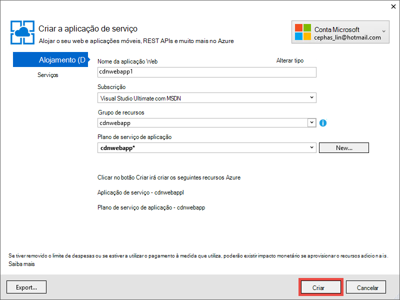

<properties 
    pageTitle="Utilize Azure CDN no Azure de aplicação de serviço" 
    description="Um tutorial que lhe ensina implementar uma aplicação web Azure aplicação de serviço que serve de conteúdos a partir de um extremo Azure CDN integrado" 
    services="app-service\web,cdn" 
    documentationCenter=".net" 
    authors="cephalin" 
    manager="wpickett" 
    editor="jimbe"/>

<tags 
    ms.service="app-service" 
    ms.workload="tbd" 
    ms.tgt_pltfrm="na" 
    ms.devlang="dotnet" 
    ms.topic="article" 
    ms.date="07/01/2016" 
    ms.author="cephalin"/>


# <a name="use-azure-cdn-in-azure-app-service"></a>Utilize Azure CDN no Azure de aplicação de serviço

[Aplicação de serviço](http://go.microsoft.com/fwlink/?LinkId=529714) pode ser integrado com o [Azure CDN](/services/cdn/), adicionando às capacidades de dimensionamento globais inerentes a [Aplicação de serviço Web Apps](http://go.microsoft.com/fwlink/?LinkId=529714) ao funcionar o conteúdo da aplicação web globalmente a partir de nós de servidor perto os seus clientes (uma lista de todas as localizações nó atual actualizada pode ser encontrada [aqui](http://msdn.microsoft.com/library/azure/gg680302.aspx)). Em cenários como funcionar imagens estáticas, esta integração pode aumentar substancialmente o desempenho das suas aplicações Web do Azure aplicação de serviço e significativamente melhora a experiência de utilizador do web app em todo o mundo. 

Integrar Web Apps com o Azure CDN dá-lhe as seguintes vantagens:

- Integrar a implementação de conteúdos (imagens, scripts e folhas de estilo) como parte do processo de [implementação contínua](app-service-continuous-deployment.md) da sua aplicação web
- Atualizar facilmente os pacotes de NuGet na sua aplicação web no serviço de aplicação do Azure, tal como jQuery ou versões de arranque do sistema 
- Gerir a aplicação Web e o seu conteúdo servida CDN a partir da mesma interface do Visual Studio
- Integrar ASP.NET Unir e minification Azure CDN

[AZURE.INCLUDE [app-service-web-to-api-and-mobile](../../includes/app-service-web-to-api-and-mobile.md)] 

## <a name="what-you-will-build"></a>O que irá criar ##

Será implementar uma aplicação web ao serviço de aplicação do Azure utilizando o modelo de ASP.NET MVC predefinido no Visual Studio, adicionar código para servir o conteúdo a partir de uma CDN Azure integrada, como uma imagem, os resultados de ação do controlador e a predefinição JavaScript e ficheiros CSS e também escrever código para configurar o dispositivo contingência de conjuntos servida se que a CDN está offline.

## <a name="what-you-will-need"></a>O que irá precisar ##

Neste tutorial tem os pré-requisitos seguintes:

-   Uma [conta do Microsoft Azure](/account/) de ativos
-   Visual Studio 2015, com o [Azure SDK para .NET](http://go.microsoft.com/fwlink/p/?linkid=323510&clcid=0x409). Se utilizar o Visual Studio, os passos podem variar.

> [AZURE.NOTE] Precisa de uma conta Azure para concluir este tutorial:
> + Pode [Abrir uma conta Azure gratuitamente](/pricing/free-trial/) - obtém créditos pode utilizar para experimentar o nosso pagos serviços Azure e mesmo depois de que está a ser utilizados para cima pode manter a conta e utilização livre Azure serviços, como Web Apps.
> + Pode [Ativar benefícios de subscritor do Visual Studio](/pricing/member-offers/msdn-benefits-details/) - subscrição o Visual Studio fornece-lhe créditos todos os meses que pode utilizar para serviços Azure pagos.
>
> Se pretender começar a aplicação de serviço de Azure antes de inscrever-se para uma conta do Azure, aceda ao [Tentar aplicação de serviço](http://go.microsoft.com/fwlink/?LinkId=523751), onde imediatamente pode criar uma aplicação web do starter curto na aplicação de serviço. Sem cartões de crédito necessários; sem compromissos.

## <a name="deploy-a-web-app-to-azure-with-an-integrated-cdn-endpoint"></a>Implementar uma aplicação web Azure com um extremo CDN integrado ##

Nesta secção, irá implementar o modelo de aplicação de ASP.NET MVC no Visual Studio 2015 predefinido para a aplicação de serviço e, em seguida, integrá-lo com um novo ponto final CDN. Siga as instruções abaixo:

1. No Visual Studio 2015, criar uma nova aplicação de web do ASP.NET a partir da barra de menu ao aceder a **ficheiro > novo > projeto > Web > aplicação Web do ASP.NET**. Atribua um nome e clique em **OK**.

    

3. Selecione **MVC** e clique em **OK**.

    

4. Se ainda não iniciou para a sua conta Azure ainda, clique no ícone de conta no canto superior direito e siga a caixa de diálogo para iniciar sessão na sua conta Azure. Quando terminar, configure a sua aplicação conforme apresentado abaixo, em seguida, clique em **Novo** para criar um novo plano de serviço de aplicação para a sua aplicação.  

    

5. Configurar um novo plano de serviço de aplicação na caixa de diálogo, conforme apresentado abaixo e clique em **OK**. 

    

8. Clique em **Criar** para criar a aplicação web.

    

9. Assim que a sua aplicação do ASP.NET é criada, publique-o Azure no painel de atividade de serviço de aplicação do Azure ao clicar em **publicar `<app name>` para esta aplicação Web agora**. Clique em **Publicar** para concluir o processo.

    

    Irá ver a sua aplicação web publicada no browser quando publicação estiver concluída. 

1. Para criar um ponto final de CDN, inicie sessão no [portal do Azure](https://portal.azure.com). 
2. Clique em **+ Novo** > **multimédia + CDN** > **CDN**.

    

3. Especificar a **CDN**, **localização**, **grupo de recursos**, **níveis de preços**, em seguida, clique em **Criar**

       

4. No **Perfil de CDN** pá clique no botão **+ ponto final** . Atribua um nome, selecione **Web App** no menu pendente **Tipo de origem** e a aplicação web na lista pendente **origem hostname** e, em seguida, clique em **Adicionar**.  

    


    > [AZURE.NOTE] Quando o ponto final de CDN estiver criado, pá o **ponto final** irá apresentar o URL de CDN e o domínio de origem que está integrado. No entanto, pode demorar algum tempo para o novo CDN da configuração de ponto final ser totalmente propagadas para todas as localizações CDN nó. 

3. Novamente na pá **ponto final** , clique no nome do ponto final CDN que acabou de criar.

    

3. Clique no botão de **Configurar** . No pá **Configurar** , selecione **todos os URL exclusivo em Cache** na lista pendente de **Colocação em cache comportamento de cadeia de consulta** , em seguida, clique no botão **Guardar** .


    

Depois de activar esta opção, a mesma ligação acedida com cadeias de consulta diferentes vai ser colocada em cache como entradas separadas.

>[AZURE.NOTE] Enquanto ativar a cadeia de consulta não é necessário para esta secção tutorial, que pretende fazer isto, tal como o mais cedo possível para sua comodidade desde a qualquer alteração aqui vai demorar tempo a serem propagadas para todos os nós CDN e não pretende que o qualquer conteúdo que não sejam consulta-cadeia-preparados para entupir para cima a cache CDN (a atualização conteúdo CDN será abordado mais tarde).

2. Agora, navegue para o endereço de ponto final CDN. Se o ponto final estiver pronto, deverá ver a sua aplicação web apresentada. Se obtiver um erro **HTTP 404** , o ponto final de CDN não está pronto. Poderá ter de esperar para cima até uma hora para a configuração de CDN ser propagadas para todos os nós do limite. 

    

1. Em seguida, tente aceder ao ficheiro **~/Content/bootstrap.css** no projeto ASP.NET. Na janela do browser, navegue para * *http://*&lt;cdnName >*.azureedge.net/Content/bootstrap.css**. Na minha configuração, este URL é:

        http://az673227.azureedge.net/Content/bootstrap.css

    Que corresponde ao seguinte URL de origem no ponto final CDN:

        http://cdnwebapp.azurewebsites.net/Content/bootstrap.css

    Quando navega para * *http://*&lt;cdnName >*.azureedge.net/Content/bootstrap.css**, irão ser pedido para transferir o bootstrap.css que veio incluída da sua aplicação web no Azure. 

    

Pode aceder de forma semelhante a qualquer acessível publicamente URL na * *http://*&lt;serviceName >*.cloudapp.net/**, diretamente a partir do seu ponto final de CDN. Por exemplo:

-   Um ficheiro. js do caminho /Script
-   Qualquer ficheiro de conteúdo a partir de/o conteúdo caminho
-   Qualquer controlador/acção 
-   Se a cadeia de consulta estiver ativada na sua endpoint CDN, qualquer URL com cadeias de consulta
-   A aplicação web Azure completa, se todo o conteúdo for público

Tenha em atenção que poderá não ser sempre uma boa ideia (ou geralmente uma boa ideia) para servir de uma aplicação web Azure completa através de Azure CDN. Alguns dos avisos são:

-   Esta abordagem requer todo o site para ser público, porque o Azure CDN não é possível servir qualquer conteúdo privado.
-   Se o ponto final de CDN ficar offline por qualquer motivo, se manutenção agendada ou erros do utilizador, a aplicação web inteira fica offline, a menos que os clientes podem ser redireccionados para o URL de origem * *http://*&lt;nome do site >*.azurewebsites.net/**. 
-   Mesmo com as definições de Cache controlo personalizadas (consulte o artigo [Configurar opções de cache para ficheiros estáticos na sua aplicação Azure web](#configure-caching-options-for-static-files-in-your-azure-web-app)), um ponto final de CDN não melhorar o desempenho do conteúdo dinâmico altamente. Se tiver tentado carregar a home page a partir do seu ponto final de CDN como demonstrado acima, repare que demorou pelo menos 5 segundos a carregar a home page predefinida na primeira vez, é uma página bastante simple. Imagine que iria acontecer para a experiência do cliente se esta página contém conteúdo dinâmico que terá de actualizar minuto. Servir conteúdo dinâmico a partir de um ponto final de CDN necessita de expiração de cache curtas, que corresponde a cache frequente falhas no ponto final CDN função. Isto hurts o desempenho da sua aplicação web do Azure e destrói a finalidade de uma CDN.

A alternativa é determinar que conteúdo para servir a partir do Azure CDN no caso a caso de na aplicação Azure web do. Para o efeito, que já viu como aceder aos ficheiros individuais de conteúdo a partir do ponto final de CDN. Posso irá mostrar-lhe como servir uma ação de controlador de específico através do ponto final de CDN no [servir conteúdo a partir de ações de controlador através de Azure CDN](#serve-content-from-controller-actions-through-azure-cdn).

## <a name="configure-caching-options-for-static-files-in-your-azure-web-app"></a>Configurar opções de colocação em cache para ficheiros estáticos na sua aplicação web do Azure ##

Com a integração do Azure CDN na sua aplicação Azure web, pode especificar como pretende que sejam colocadas em cache no ponto final de CDN em conteúdo estático. Para executar esta tarefa, abra a *Web. config* a partir do seu projeto do ASP.NET (por exemplo, **cdnwebapp**) e adicione uma `<staticContent>` elemento a `<system.webServer>`. XML abaixo configura a cache de expirar em 3 dias.  

    <system.webServer>
      <staticContent>
        <clientCache cacheControlMode="UseMaxAge" cacheControlMaxAge="3.00:00:00"/>
      </staticContent>
      ...
    </system.webServer>

Depois de fazer isto, todos os ficheiros estáticos na sua aplicação Azure web irão observar a mesma regra na cache do CDN. Para um controlo mais granular das definições de cache, adicione um ficheiro de *Web. config* para uma pasta e adicione as definições de aí. Por exemplo, adicionar um ficheiro de *Web. config* para a pasta *\Content* e substitua o conteúdo XML seguinte:

    <?xml version="1.0"?>
    <configuration>
      <system.webServer>
        <staticContent>
          <clientCache cacheControlMode="UseMaxAge" cacheControlMaxAge="15.00:00:00"/>
        </staticContent>
      </system.webServer>
    </configuration>

Esta definição faz com que todos os ficheiros estáticos a partir da pasta *\Content* para ser colocadas em cache para 15 dias.

Para obter mais informações sobre como configurar o `<clientCache>` elemento, consulte o artigo [Cache de cliente &lt;clientCache >](http://www.iis.net/configreference/system.webserver/staticcontent/clientcache).

Na secção seguinte, posso também mostrar-lhe como pode configurar definições de cache para os resultados de ação de controlador na cache de CDN.

## <a name="serve-content-from-controller-actions-through-azure-cdn"></a>Servir conteúdo a partir de ações de controlador através do Azure CDN ##

Ao integrar Web Apps com o Azure CDN, é relativamente fácil servir o conteúdo de acções do controlador através de CDN Azure. Novamente, se decidir servir da aplicação web Azure completa através da sua CDN, não precisa de fazer isto em todos os vez que todas as ações de controlador acessíveis através de CDN já estão. Mas por razões de que já indicada no [Implementar uma aplicação Azure web com um extremo CDN integrada](#deploy-a-web-app-to-azure-with-an-integrated-cdn-endpoint), pode decidir contra esta situação e escolher como alternativa selecionar a ação de controlador que pretende para servir a partir do Azure CDN. [Martinho Balliauw](https://twitter.com/maartenballiauw) mostra-lhe como fazê-lo com um controlador de MemeGenerator [reduzir latência na web com a CDN Azure](http://channel9.msdn.com/events/TechDays/Techdays-2014-the-Netherlands/Reducing-latency-on-the-web-with-the-Windows-Azure-CDN)divertido. Posso irá simplesmente reproduza-lo aqui.

Suponha que na sua aplicação web que pretende gerar memes com base numa jovens Chuck Norris imagem (fotografia pela [Guilherme luz](http://www.flickr.com/photos/alan-light/218493788/)) da seguinte forma:


Tiver uma alteração simples `Index` ação que permite que os clientes especificar os superlativos na imagem, em seguida, gera a meme depois de publicar a ação. Uma vez que é Chuck Norris, seria esperado esta página para se tornar aumentar ou diminuir significativamente populares globalmente. Este é um bom exemplo de servir conteúdo dinâmico semiestruturados com Azure CDN. 

Siga os passos acima para esta ação do controlador de configuração:

1. Na pasta *\Controllers* , crie um novo ficheiro. cs denominado *MemeGeneratorController.cs* e substituir o conteúdo com o código seguinte. Substituir o caminho do ficheiro para `~/Content/chuck.bmp` e o seu nome CDN para `yourCDNName`.


        using System;
        using System.Collections.Generic;
        using System.Diagnostics;
        using System.Drawing;
        using System.IO;
        using System.Net;
        using System.Web.Hosting;
        using System.Web.Mvc;
        using System.Web.UI;

        namespace cdnwebapp.Controllers
        {
          public class MemeGeneratorController : Controller
          {
            static readonly Dictionary<string, Tuple<string ,string>> Memes = new Dictionary<string, Tuple<string, string>>();

            public ActionResult Index()
            {
              return View();
            }

            [HttpPost, ActionName("Index")]
            public ActionResult Index_Post(string top, string bottom)
            {
              var identifier = Guid.NewGuid().ToString();
              if (!Memes.ContainsKey(identifier))
              {
                Memes.Add(identifier, new Tuple<string, string>(top, bottom));
              }

              return Content("<a href=\"" + Url.Action("Show", new {id = identifier}) + "\">here's your meme</a>");
            }

            [OutputCache(VaryByParam = "*", Duration = 1, Location = OutputCacheLocation.Downstream)]
            public ActionResult Show(string id)
            {
              Tuple<string, string> data = null;
              if (!Memes.TryGetValue(id, out data))
              {
                return new HttpStatusCodeResult(HttpStatusCode.NotFound);
              }

              if (Debugger.IsAttached) // Preserve the debug experience
              {
                return Redirect(string.Format("/MemeGenerator/Generate?top={0}&bottom={1}", data.Item1, data.Item2));
              }
              else // Get content from Azure CDN
              {
                return Redirect(string.Format("http://<yourCDNName>.azureedge.net/MemeGenerator/Generate?top={0}&bottom={1}", data.Item1, data.Item2));
              }
            }

            [OutputCache(VaryByParam = "*", Duration = 3600, Location = OutputCacheLocation.Downstream)]
            public ActionResult Generate(string top, string bottom)
            {
              string imageFilePath = HostingEnvironment.MapPath("~/Content/chuck.bmp");
              Bitmap bitmap = (Bitmap)Image.FromFile(imageFilePath);

              using (Graphics graphics = Graphics.FromImage(bitmap))
              {
                SizeF size = new SizeF();
                using (Font arialFont = FindBestFitFont(bitmap, graphics, top.ToUpperInvariant(), new Font("Arial Narrow", 100), out size))
                {
                    graphics.DrawString(top.ToUpperInvariant(), arialFont, Brushes.White, new PointF(((bitmap.Width - size.Width) / 2), 10f));
                }
                using (Font arialFont = FindBestFitFont(bitmap, graphics, bottom.ToUpperInvariant(), new Font("Arial Narrow", 100), out size))
                {
                    graphics.DrawString(bottom.ToUpperInvariant(), arialFont, Brushes.White, new PointF(((bitmap.Width - size.Width) / 2), bitmap.Height - 10f - arialFont.Height));
                }
              }
              MemoryStream ms = new MemoryStream();
              bitmap.Save(ms, System.Drawing.Imaging.ImageFormat.Png);
              return File(ms.ToArray(), "image/png");
            }

            private Font FindBestFitFont(Image i, Graphics g, String text, Font font, out SizeF size)
            {
              // Compute actual size, shrink if needed
              while (true)
              {
                size = g.MeasureString(text, font);

                // It fits, back out
                if (size.Height < i.Height &&
                     size.Width < i.Width) { return font; }

                // Try a smaller font (90% of old size)
                Font oldFont = font;
                font = new Font(font.Name, (float)(font.Size * .9), font.Style);
                oldFont.Dispose();
              }
            }
          }
        }

2. Com o botão direito na predefinida `Index()` acção e selecione **Adicionar vista**.

    

3.  Aceite as definições abaixo e clique em **Adicionar**.

    

4. Abra o novo *Views\MemeGenerator\Index.cshtml* e substitua o conteúdo HTML seguinte simple para submeter os superlativos:

        <h2>Meme Generator</h2>
        
        <form action="" method="post">
            <input type="text" name="top" placeholder="Enter top text here" />
            <br />
            <input type="text" name="bottom" placeholder="Enter bottom text here" />
            <br />
            <input class="btn" type="submit" value="Generate meme" />
        </form>

5. Publique novamente a aplicação web do Azure e navegue para * *http://*&lt;serviceName >*.cloudapp.net/MemeGenerator/Index** no seu browser. 

Quando submeter os valores de formulário para `/MemeGenerator/Index`, o `Index_Post` ação método devolve uma ligação para o `Show` método de ação com o respetivos identificador de entrada. Quando clicar na ligação, chegar o seguinte código:  

    [OutputCache(VaryByParam = "*", Duration = 1, Location = OutputCacheLocation.Downstream)]
    public ActionResult Show(string id)
    {
      Tuple<string, string> data = null;
      if (!Memes.TryGetValue(id, out data))
      {
        return new HttpStatusCodeResult(HttpStatusCode.NotFound);
      }

      if (Debugger.IsAttached) // Preserve the debug experience
      {
        return Redirect(string.Format("/MemeGenerator/Generate?top={0}&bottom={1}", data.Item1, data.Item2));
      }
      else // Get content from Azure CDN
      {
        return Redirect(string.Format("http://<yourCDNName>.azureedge.net/MemeGenerator/Generate?top={0}&bottom={1}", data.Item1, data.Item2));
      }
    }

Se estiver ligado a sua depurador local, em seguida, obterá a experiência de depuração normal com um redirecionamento local. Se estiver em execução no Azure web app, em seguida, irá redirecioná para:

    http://<yourCDNName>.azureedge.net/MemeGenerator/Generate?top=<formInput>&bottom=<formInput>

Que corresponde ao seguinte URL de origem no seu ponto final CDN:

    http://<yourSiteName>.azurewebsites.net/cdn/MemeGenerator/Generate?top=<formInput>&bottom=<formInput>

Depois de URL reescrever regra aplicada anteriormente, o ficheiro real que recebe em cache para o ponto final CDN é:

    http://<yourSiteName>.azurewebsites.net/MemeGenerator/Generate?top=<formInput>&bottom=<formInput>

Em seguida, pode utilizar o `OutputCacheAttribute` atributo na `Generate` método para especificar como o resultado de ação deve ser colocadas em cache, que irão respeitar as Azure CDN. O código abaixo especifique uma expiração da cache de 1 hora (3600 segundos).

    [OutputCache(VaryByParam = "*", Duration = 3600, Location = OutputCacheLocation.Downstream)]

Da mesma forma, pode servir o conteúdo a partir de qualquer ação controlador na sua aplicação Azure web através do seu CDN Azure, com a opção de colocação em cache pretendida.

Na secção seguinte, posso irá mostrar-lhe como servir os scripts integrados e minified e o CSS através de Azure CDN. 

## <a name="integrate-aspnet-bundling-and-minification-with-azure-cdn"></a>Integrar ASP.NET Unir e minification Azure CDN ##

Folhas de estilo de scripts e CSS altere com pouca frequência e são prime candidatos para a cache de Azure CDN. Funcionar da aplicação web completa através da sua CDN Azure é a forma mais fácil de integrar Unir e minification Azure CDN. No entanto, tal como poderá eleger contra esta abordagem para razões descritas em [integrar um ponto final Azure CDN com o Azure web app e servir em conteúdo estático nas suas páginas Web a partir do Azure CDN](#deploy-a-web-app-to-azure-with-an-integrated-cdn-endpoint), posso irá mostrar-lhe como fazê-lo preservando a experiência de develper pretendida dos ASP.NET Unir e minification, tais como:

-   Depurar excelente experiência de modo
-   Implementação simplificada
-   Atualizações de imediatas a clientes para actualizações de versão script/CSS
-   Mecanismo contingência quando o seu ponto final de CDN falha
-   Minimizar a modificação de código

No projeto ASP.NET que criou no [integrar um ponto final Azure CDN com o Azure web app e servir em conteúdo estático nas suas páginas Web a partir do Azure CDN](#deploy-a-web-app-to-azure-with-an-integrated-cdn-endpoint), abra *App_Start\BundleConfig.cs* e veja o `bundles.Add()` método chamadas.

    public static void RegisterBundles(BundleCollection bundles)
    {
        bundles.Add(new ScriptBundle("~/bundles/jquery").Include(
                    "~/Scripts/jquery-{version}.js"));
        ...
    }

O primeiro `bundles.Add()` declaração adiciona um pacote de script no diretório virtual `~/bundles/jquery`. Em seguida, abra *Views\Shared\_Layout.cshtml* para ver como a etiqueta do pacote de script é composta. Deverá conseguir localizar a linha de código do Razor seguinte:

    @Scripts.Render("~/bundles/jquery")

Quando este código Razor é executado no Azure web app, serão compostas um `<script>` etiqueta para o pacote de script semelhante ao seguinte: 

    <script src="/bundles/jquery?v=FVs3ACwOLIVInrAl5sdzR2jrCDmVOWFbZMY6g6Q0ulE1"></script>

No entanto, quando esta é executada no Visual Studio escrevendo `F5`, serão compostas cada ficheiro de script no pacote individualmente (neste caso, apenas um ficheiro de script está no pacote):

    <script src="/Scripts/jquery-1.10.2.js"></script>

Permite-lhe o código JavaScript no seu ambiente de desenvolvimento de depuração enquanto estiver reduzindo ligações de cliente em simultâneo (unir) e melhorar o ficheiro de transferência de desempenho (minification) de produção. É uma excelente funcionalidade preservar com a integração do Azure CDN. Além disso, uma vez que o pacote composta já contenha uma cadeia de versão gerados automaticamente, que pretende criar uma réplica essa funcionalidade para que sempre que atualiza a sua versão de jQuery através de NuGet, pode ser atualizado no lado do cliente mais cedo possível.

Siga os passos abaixo para unir ASP.NET de integração e minification com o seu ponto final de CDN.

1. Novamente na *App_Start\BundleConfig.cs*, modificar o `bundles.Add()` métodos para utilizar um diferentes [construtor do pacote](http://msdn.microsoft.com/library/jj646464.aspx), que especifica um endereço CDN. Para executar esta tarefa, substitua a `RegisterBundles` definição método com o seguinte código:  
    
        public static void RegisterBundles(BundleCollection bundles)
        {
          bundles.UseCdn = true;
          var version = System.Reflection.Assembly.GetAssembly(typeof(Controllers.HomeController))
            .GetName().Version.ToString();
          var cdnUrl = "http://<yourCDNName>.azureedge.net/{0}?" + version;

          bundles.Add(new ScriptBundle("~/bundles/jquery", string.Format(cdnUrl, "bundles/jquery")).Include(
                "~/Scripts/jquery-{version}.js"));

          bundles.Add(new ScriptBundle("~/bundles/jqueryval", string.Format(cdnUrl, "bundles/jqueryval")).Include(
                "~/Scripts/jquery.validate*"));

          // Use the development version of Modernizr to develop with and learn from. Then, when you're
          // ready for production, use the build tool at http://modernizr.com to pick only the tests you need.
          bundles.Add(new ScriptBundle("~/bundles/modernizr", string.Format(cdnUrl, "bundles/modernizr")).Include(
                "~/Scripts/modernizr-*"));

          bundles.Add(new ScriptBundle("~/bundles/bootstrap", string.Format(cdnUrl, "bundles/bootstrap")).Include(
                "~/Scripts/bootstrap.js",
                "~/Scripts/respond.js"));

          bundles.Add(new StyleBundle("~/Content/css", string.Format(cdnUrl, "Content/css")).Include(
                "~/Content/bootstrap.css",
                "~/Content/site.css"));
        }


    Certifique-se de que substituir `<yourCDNName>` com o nome do seu CDN Azure.

    Em palavras simples, esteja a definir `bundles.UseCdn = true` e adicionado um URL de CDN redigida para cada pacote. Por exemplo, o construtor primeiro o código:

        new ScriptBundle("~/bundles/jquery", string.Format(cdnUrl, "bundles/jquery"))

    é o mesmo que: 

        new ScriptBundle("~/bundles/jquery", string.Format(cdnUrl, "http://<yourCDNName>.azureedge.net/bundles/jquery?<W.X.Y.Z>"))

    Este construtor indica-ASP.NET Unir e minification para compor ficheiros de script individuais quando depurado localmente, mas utilizar o endereço CDN especificado para aceder ao script em questão. No entanto, tenha em atenção duas características importantes com este URL CDN redigida:
    
    - A origem para este URL CDN é `http://<yourSiteName>.azurewebsites.net/bundles/jquery?<W.X.Y.Z>`, que é realmente o directório virtual do pacote script na sua aplicação Web.
    - Uma vez que está a utilizar o construtor CDN, a etiqueta de script CDN para o pacote já não contém a cadeia da versão gerados automaticamente no URL composta. Tem de gerar manualmente uma cadeia de versão exclusivo sempre que o pacote de script é modificado para forçar uma falha de cache no seu CDN Azure. Ao mesmo tempo, esta cadeia de versão exclusivo tem que permaneçam constante através de vida de implementação para maximizar acertos na sua CDN Azure depois do pacote é implementada.

3. A cadeia de consulta `<W.X.Y.Z>` obtém do *Properties\AssemblyInfo.cs* no projeto ASP.NET. Pode ter um fluxo de trabalho de implementação que inclui incrementar a versão de assemblagem sempre que publicar no Azure. Ou, apenas pode modificar *Properties\AssemblyInfo.cs* no seu projeto para incrementar automaticamente a cadeia de versão sempre que criar, utilizar o caráter universal ' *'. Por exemplo, alterar `AssemblyVersion` conforme apresentado abaixo:
    
        [assembly: AssemblyVersion("1.0.0.*")]
    
    Qualquer outra estratégia para simplificar a gerar uma cadeia exclusiva para a duração de uma implementação irá funcionar aqui.

3. Voltar a publicar a aplicação do ASP.NET e aceder à home page.
 
4. Visualiza o código HTML para a página. Deverá conseguir ver o URL de CDN composto por uma cadeia de versão exclusivo sempre que publicar novamente alterações para a sua aplicação Azure web. Por exemplo:  
    
        ...
        <link href="http://az673227.azureedge.net/Content/css?1.0.0.25449" rel="stylesheet"/>
        <script src="http://az673227.azureedge.net/bundles/modernizer?1.0.0.25449"></script>
        ...
        <script src="http://az673227.azureedge.net/bundles/jquery?1.0.0.25449"></script>
        <script src="http://az673227.azureedge.net/bundles/bootstrap?1.0.0.25449"></script>
        ...

5. No Visual Studio, depurar a aplicação de ASP.NET no Visual Studio escrevendo `F5`., 

6. Visualiza o código HTML para a página. Utilizador continua a ver cada ficheiro de script individualmente processado para que possa ter uma experiência no Visual Studio de depuração consistente.  
    
        ...
        <link href="/Content/bootstrap.css" rel="stylesheet"/>
        <link href="/Content/site.css" rel="stylesheet"/>
        <script src="/Scripts/modernizr-2.6.2.js"></script>
        ...
        <script src="/Scripts/jquery-1.10.2.js"></script>
        <script src="/Scripts/bootstrap.js"></script>
        <script src="/Scripts/respond.js"></script>
        ...    

## <a name="fallback-mechanism-for-cdn-urls"></a>Mecanismo contingência para URLs de CDN ##

Quando o seu ponto final Azure CDN falha por qualquer motivo, pretender que a página Web para ser inteligentes o suficiente para aceder ao seu servidor de Web origem como opção de contingência para o carregamento de arranque ou JavaScript. É grave perder imagens na sua aplicação web devido a indisponibilidade CDN, mas muito mais extremas para perder funcionalidade de página cruciais fornecida pelo seu scripts e folhas de estilo.

A classe de [pacote](http://msdn.microsoft.com/library/system.web.optimization.bundle.aspx) contém uma propriedade denominada [CdnFallbackExpression](http://msdn.microsoft.com/library/system.web.optimization.bundle.cdnfallbackexpression.aspx) permite-lhe configurar dispositivo contingência de falha CDN. Para utilizar esta propriedade, siga os passos abaixo:

1. No seu projeto do ASP.NET, abra *App_Start\BundleConfig.cs*, onde adicionou um URL de CDN no cada [construtor do pacote](http://msdn.microsoft.com/library/jj646464.aspx)e adicione `CdnFallbackExpression` código numa quatro casas, conforme mostrado para adicionar um mecanismo contingência para os conjuntos de predefinido.  
    
        public static void RegisterBundles(BundleCollection bundles)
        {
          var version = System.Reflection.Assembly.GetAssembly(typeof(BundleConfig))
            .GetName().Version.ToString();
          var cdnUrl = "http://cdnurl.azureedge.net/.../{0}?" + version;
          bundles.UseCdn = true;

          bundles.Add(new ScriptBundle("~/bundles/jquery", string.Format(cdnUrl, "bundles/jquery")) 
                { CdnFallbackExpression = "window.jquery" }
                .Include("~/Scripts/jquery-{version}.js"));

          bundles.Add(new ScriptBundle("~/bundles/jqueryval", string.Format(cdnUrl, "bundles/jqueryval")) 
                { CdnFallbackExpression = "$.validator" }
                .Include("~/Scripts/jquery.validate*"));

          // Use the development version of Modernizr to develop with and learn from. Then, when you're
          // ready for production, use the build tool at http://modernizr.com to pick only the tests you need.
          bundles.Add(new ScriptBundle("~/bundles/modernizr", string.Format(cdnUrl, "bundles/modernizer")) 
                { CdnFallbackExpression = "window.Modernizr" }
                .Include("~/Scripts/modernizr-*"));

          bundles.Add(new ScriptBundle("~/bundles/bootstrap", string.Format(cdnUrl, "bundles/bootstrap"))     
                { CdnFallbackExpression = "$.fn.modal" }
                .Include(
                        "~/Scripts/bootstrap.js",
                        "~/Scripts/respond.js"));

          bundles.Add(new StyleBundle("~/Content/css", string.Format(cdnUrl, "Content/css")).Include(
                "~/Content/bootstrap.css",
                "~/Content/site.css"));
        }

    Quando `CdnFallbackExpression` é não é nulo, script é inserido para o código HTML para verificar se o pacote é carregado com êxito e, caso não esteja, aceder o pacote diretamente a partir do servidor Web de origem. Esta propriedade tem de ser definidas como uma expressão de JavaScript que testa se o pacote CDN respetivos é carregado corretamente. Expressão necessário para testar a cada pacote difere o conteúdo. Para conjuntos predefinidos acima:
    
    - `window.jquery`é definida na. js jquery-{versão}
    - `$.validator`é definida na jquery.validate.js
    - `window.Modernizr`é definida na. js modernizer-{versão}
    - `$.fn.modal`é definida na bootstrap.js
    
    Poderá provavelmente, reparou não tiver definido CdnFallbackExpression para o `~/Cointent/css` pacote. Este é porque existe um [erro no System.Web.Optimization](https://aspnetoptimization.codeplex.com/workitem/104) injete atualmente um `<script>` etiqueta para o CSS de contingência em vez do esperado `<link>` etiqueta.
    
    No entanto, existe uma boa [Estilo pacote contingência](https://github.com/EmberConsultingGroup/StyleBundleFallback) oferecidos pelo [Ember Consulting grupo](https://github.com/EmberConsultingGroup). 

2. Para utilizar a solução CSS, criar um novo ficheiro. cs na pasta de *App_Start* do seu projeto ASP.NET chamada *StyleBundleExtensions.cs*e substituir o respetivo conteúdo com o [código de GitHub](https://github.com/EmberConsultingGroup/StyleBundleFallback/blob/master/Website/App_Start/StyleBundleExtensions.cs). 

4. Na *App_Start\StyleFundleExtensions.cs*, mudar o nome do espaço de nomes para o espaço de nomes de aplicação do ASP.NET (por exemplo, **cdnwebapp**). 

3. Voltar para a `App_Start\BundleConfig.cs` e substituir o último `bundles.Add` declaração com o seguinte código:  

        bundles.Add(new StyleBundle("~/Content/css", string.Format(cdnUrl, "Content/css"))
          .IncludeFallback("~/Content/css", "sr-only", "width", "1px")
          .Include(
            "~/Content/bootstrap.css",
            "~/Content/site.css"));

    Este novo método de extensão utiliza a mesma ideia para introduzir script no HTML para verificar o DOM para a um nome de classe correspondentes, o nome da regra e o valor de regra definida no pacote CSS e classifica o servidor Web de origem, se não conseguir encontrar a correspondência.

4. Publicar novamente para a sua aplicação web do Azure e aceder à home page. 
5. Visualiza o código HTML para a página. Deve encontrar scripts introduzidos semelhante ao seguinte:    
    
    ```
    ...
    <link href="http://az673227.azureedge.net/Content/css?1.0.0.25474" rel="stylesheet"/>
<script>(function() {
                var loadFallback,
                    len = document.styleSheets.length;
                for (var i = 0; i < len; i++) {
                    var sheet = document.styleSheets[i];
                    if (sheet.href.indexOf('http://az673227.azureedge.net/Content/css?1.0.0.25474') !== -1) {
                        var meta = document.createElement('meta');
                        meta.className = 'sr-only';
                        document.head.appendChild(meta);
                        var value = window.getComputedStyle(meta).getPropertyValue('width');
                        document.head.removeChild(meta);
                        if (value !== '1px') {
                            document.write('<link href="/Content/css" rel="stylesheet" type="text/css" />');
                        }
                    }
                }
                return true;
            }())||document.write('<script src="/Content/css"><\/script>');</script>

    <script src="http://az673227.azureedge.net/bundles/modernizer?1.0.0.25474"></script>
    <script>(window.Modernizr)||document.write('<script src="/bundles/modernizr"><\/script>');</script>
    ... 
    <script src="http://az673227.azureedge.net/bundles/jquery?1.0.0.25474"></script>
    <script>(window.jquery)||document.write('<script src="/bundles/jquery"><\/script>');</script>

    <script src="http://az673227.azureedge.net/bundles/bootstrap?1.0.0.25474"></script>
    <script>($.fn.modal)||document.write('<script src="/bundles/bootstrap"><\/script>');</script>
    ...
    ```

    Repare que o script introduzido para o pacote CSS contém ainda a remnant com falhas a partir do `CdnFallbackExpression` propriedade na linha:

        }())||document.write('<script src="/Content/css"><\/script>');</script>

    Mas desde a primeira parte da | | expressão sempre irá devolver verdadeira (na linha diretamente acima dessa), a função document.write() nunca será executado.

6. Para testar o script de contingência está a funcionar, regresse à pá do seu ponto final CDN e clique em **Parar**.

    

7. Atualize a janela do browser para a aplicação Azure web. Agora deverá ver que todos os scripts e folhas de estilo corretamente são carregadas.

## <a name="more-information"></a>Obter mais informações 
- [Descrição geral da rede de entrega de conteúdos Azure (CDN)](../cdn/cdn-overview.md)
- [Utilizar o Azure CDN](../cdn/cdn-create-new-endpoint.md)
- [Integrar um serviço na nuvem Azure CDN](../cdn/cdn-cloud-service-with-cdn.md)
- [Unir ASP.NET e Minification](http://www.asp.net/mvc/tutorials/mvc-4/bundling-and-minification)

