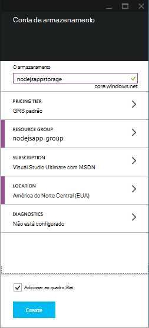
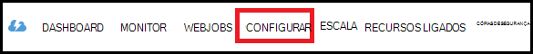
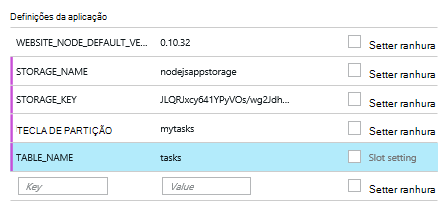

<properties
    pageTitle="NODE.js web app utilizando o serviço de tabela do Azure"
    description="Neste tutorial ensina-o utilizar o serviço de tabela do Azure para armazenar dados a partir de uma aplicação de Node.js que está alojado no Azure aplicação de serviço Web Apps."
    tags="azure-portal"
    services="app-service\web, storage"
    documentationCenter="nodejs"
    authors="rmcmurray"
    manager="wpickett"
    editor=""/>

<tags
    ms.service="storage"
    ms.workload="storage"
    ms.tgt_pltfrm="na"
    ms.devlang="nodejs"
    ms.topic="article"
    ms.date="08/11/2016"
    ms.author="robmcm"/>

# NODE.js web app utilizando o serviço de tabela do Azure

## Descrição geral

Este tutorial mostra-lhe como utilizar o serviço de tabela fornecido pela gestão de dados do Azure para armazenar e aceder aos dados a partir de uma aplicação de [nó] alojada no [Azure aplicação de serviço](http://go.microsoft.com/fwlink/?LinkId=529714) Web Apps. Neste tutorial assume que tem alguma experiência prévia utilizando nó e [Git].

Vai aprender:

* Como utilizar npm (Gestor de pacote nó) para instalar os módulos nó

* Como trabalhar com o serviço de tabela do Azure

* Como utilizar o clip do Azure para criar uma aplicação web.

Ao seguir este tutorial, irá criar um simples baseados na web e aplicação de "lista de acções a fazer" que lhe permite criar, retrieving e concluir as tarefas. As tarefas são armazenadas no serviço de tabela.

Segue-se a aplicação concluída:

![Página web que apresenta uma lista de tarefas vazia][node-table-finished]

>[AZURE.NOTE] Se pretender começar a aplicação de serviço de Azure antes de inscrever-se para uma conta do Azure, aceda ao [Tentar aplicação de serviço](http://go.microsoft.com/fwlink/?LinkId=523751), onde imediatamente pode criar uma aplicação web do starter curto na aplicação de serviço. Sem cartões de crédito necessários; sem compromissos.

## Pré-requisitos

Antes de seguir as instruções neste artigo, certifique-se de que tem os seguintes componentes instalados:

* versão [nó] 0.10.24 ou superior

* [Git]

[AZURE.INCLUDE [create-account-and-websites-note](../../includes/create-account-and-websites-note.md)]

## Criar uma conta de armazenamento

Crie uma conta de armazenamento Azure. A aplicação irá utilizar esta conta para armazenar itens a fazer.

1.  Iniciar sessão no [Portal do Azure](https://portal.azure.com/).

2. Clique no ícone de **Novo** na parte inferior esquerda do portal, em seguida, clique em **dados + armazenamento** > **armazenamento**. Dê um nome exclusivo à conta de armazenamento e criar um novo [grupo de recursos](../azure-resource-manager/resource-group-overview.md) para a mesma.

    

    Quando a conta de armazenamento ter sido criada, o botão de **notificações** passará a verde **SUCESSO** e pá a conta de armazenamento está aberta para mostrar a que pertence o novo grupo de recursos que criou.

5. No pá a conta de armazenamento, clique em **Definições** > **teclas**. Copie a chave primária acesso à área de transferência.

    ![Tecla de acesso][portal-storage-access-keys]

##Instalar módulos e gerar andaimes

Nesta secção que irá criar uma nova aplicação de nó e utilizar npm para adicionar pacotes de módulo. Para esta aplicação irá utilizar os módulos [Express] e [Azure] . O módulo Express fornece um quadro de controlador de vista de modelo para nó, enquanto os Azure módulos fornece uma ligação para o serviço de tabela.

### Instalar o express e gerar andaimes

1. A partir da linha de comandos, crie um novo directório denominado **lista de tarefas** e mudar para esse directório.  

2. Introduza o seguinte comando para instalar o módulo Express.

        npm install express-generator@4.2.0 -g

    Consoante o sistema operativo, poderá ter de colocar sudo antes do comando:

        sudo npm install express-generator@4.2.0 -g

    O resultado é apresentada semelhante ao exemplo seguinte:

        express-generator@4.2.0 /usr/local/lib/node_modules/express-generator
        ├── mkdirp@0.3.5
        └── commander@1.3.2 (keypress@0.1.0)

    > [AZURE.NOTE] O '-g' parâmetro instala o módulo globalmente. Desta forma, pode utilizamos **express** para gerar andaimes de aplicação web sem ter de escrever no informações adicionais de caminho.

4. Para criar andaime para a aplicação, introduza o comando **express** :

        express

    O resultado deste comando aparece semelhante ao exemplo seguinte:

           create : .
           create : ./package.json
           create : ./app.js
           create : ./public
           create : ./public/images
           create : ./routes
           create : ./routes/index.js
           create : ./routes/users.js
           create : ./public/stylesheets
           create : ./public/stylesheets/style.css
           create : ./views
           create : ./views/index.jade
           create : ./views/layout.jade
           create : ./views/error.jade
           create : ./public/javascripts
           create : ./bin
           create : ./bin/www

           install dependencies:
             $ cd . && npm install

           run the app:
             $ DEBUG=my-application ./bin/www

    Agora tem vários novos diretórios e ficheiros no directório de **lista de tarefas** .

### Instalar módulos adicionais

Um dos ficheiros que **express** cria é **package.json**. Este ficheiro contém uma lista de dependências de módulo. Mais tarde, quando implementar a aplicação a aplicação de serviço Web Apps, este ficheiro determina a forma que módulos têm de ser instalados no Azure.

A partir da linha de comandos, introduza o seguinte comando para instalar os módulos descritos no ficheiro **package.json** . Poderá ter utilizar 'sudo'.

    npm install

O resultado deste comando aparece semelhante ao exemplo seguinte:

    debug@0.7.4 node_modules\debug

    cookie-parser@1.0.1 node_modules\cookie-parser
    ├── cookie-signature@1.0.3
    └── cookie@0.1.0

    [...]

Em seguida, introduza o seguinte comando para instalar os módulos [azure], [nó uuid], [nconf] e [assíncrona] :

    npm install azure-storage node-uuid async nconf --save

O **– Guardar** sinalizador Adiciona entradas para estes módulos para o ficheiro de **package.json** .

O resultado deste comando aparece semelhante ao exemplo seguinte:

    async@0.9.0 node_modules\async

    node-uuid@1.4.1 node_modules\node-uuid

    nconf@0.6.9 node_modules\nconf
    ├── ini@1.2.1
    ├── async@0.2.9
    └── optimist@0.6.0 (wordwrap@0.0.2, minimist@0.0.10)

    [...]

## Criar a aplicação

Agora podemos está prontos criar a aplicação.

### Criar um modelo

Um *modelo* é um objeto que representa os dados na sua aplicação. Para a aplicação, o modelo apenas é um objeto de tarefa, que representa um item na lista de acções a fazer. Tarefas irão tem os seguintes campos:

- PartitionKey
- RowKey
- nome (cadeia)
- categoria (cadeia)
- concluído (booleano)

**PartitionKey** e **RowKey** são utilizados pelo serviço tabela como chaves tabela. Para mais informações, consulte o artigo [Compreender o modelo de dados do serviço de tabela](https://msdn.microsoft.com/library/azure/dd179338.aspx).

1. No diretório a **lista de tarefas** , crie um novo directório denominado **modelos**.

2. No directório de **modelos** , crie um novo ficheiro chamado **task.js**. Este ficheiro irá conter o modelo para as tarefas criados pela aplicação.

3. No início do ficheiro **task.js** , adicione o seguinte código para fazer referência a bibliotecas necessárias:

        var azure = require('azure-storage');
        var uuid = require('node-uuid');
        var entityGen = azure.TableUtilities.entityGenerator;

4. Adicione o seguinte código definir e exportar o objeto de tarefa. Este objeto é responsável por ligar-se para a tabela.

        module.exports = Task;

        function Task(storageClient, tableName, partitionKey) {
          this.storageClient = storageClient;
          this.tableName = tableName;
          this.partitionKey = partitionKey;
          this.storageClient.createTableIfNotExists(tableName, function tableCreated(error) {
            if(error) {
              throw error;
            }
          });
        };

5. Adicione o seguinte código para definir métodos adicionais no objeto tarefa, que permitem interações com dados armazenados na tabela:

        Task.prototype = {
          find: function(query, callback) {
            self = this;
            self.storageClient.queryEntities(this.tableName, query, null, function entitiesQueried(error, result) {
              if(error) {
                callback(error);
              } else {
                callback(null, result.entries);
              }
            });
          },

          addItem: function(item, callback) {
            self = this;
            // use entityGenerator to set types
            // NOTE: RowKey must be a string type, even though
            // it contains a GUID in this example.
            var itemDescriptor = {
              PartitionKey: entityGen.String(self.partitionKey),
              RowKey: entityGen.String(uuid()),
              name: entityGen.String(item.name),
              category: entityGen.String(item.category),
              completed: entityGen.Boolean(false)
            };
            self.storageClient.insertEntity(self.tableName, itemDescriptor, function entityInserted(error) {
              if(error){  
                callback(error);
              }
              callback(null);
            });
          },

          updateItem: function(rKey, callback) {
            self = this;
            self.storageClient.retrieveEntity(self.tableName, self.partitionKey, rKey, function entityQueried(error, entity) {
              if(error) {
                callback(error);
              }
              entity.completed._ = true;
              self.storageClient.updateEntity(self.tableName, entity, function entityUpdated(error) {
                if(error) {
                  callback(error);
                }
                callback(null);
              });
            });
          }
        }

6. Guarde e feche o ficheiro **task.js** .

### Criar um controlador de

Um *controlador* processa pedidos HTTP e compõe a resposta HTML.

1. No diretório a **lista de tarefas/rotas** , crie um novo ficheiro chamado **tasklist.js** e abra-o num editor de texto.

2. Adicione o seguinte código para **tasklist.js**. Este procedimento carrega a azure e assíncrona módulos, quais são utilizados pelo **tasklist.js**. Isto também define a função de **lista de tarefas** , que lhe é transmitida uma instância do objeto **tarefa** definido anteriormente:

        var azure = require('azure-storage');
        var async = require('async');

        module.exports = TaskList;

3. Defina um objeto de **lista de tarefas** .

        function TaskList(task) {
          this.task = task;
        }

4. Adicione os seguintes métodos à **lista de tarefas**:

        TaskList.prototype = {
          showTasks: function(req, res) {
            self = this;
            var query = new azure.TableQuery()
              .where('completed eq ?', false);
            self.task.find(query, function itemsFound(error, items) {
              res.render('index',{title: 'My ToDo List ', tasks: items});
            });
          },

          addTask: function(req,res) {
            var self = this;
            var item = req.body.item;
            self.task.addItem(item, function itemAdded(error) {
              if(error) {
                throw error;
              }
              res.redirect('/');
            });
          },

          completeTask: function(req,res) {
            var self = this;
            var completedTasks = Object.keys(req.body);
            async.forEach(completedTasks, function taskIterator(completedTask, callback) {
              self.task.updateItem(completedTask, function itemsUpdated(error) {
                if(error){
                  callback(error);
                } else {
                  callback(null);
                }
              });
            }, function goHome(error){
              if(error) {
                throw error;
              } else {
               res.redirect('/');
              }
            });
          }
        }

### Modificar app.js

1. A partir do diretório de **lista de tarefas** , abra o ficheiro **app.js** . Este ficheiro foi criado anteriormente ao executar o comando **express** .

2. No início do ficheiro, adicione o seguinte procedimento para carregar o módulo azure, definir o nome da tabela, chave partição e definir as credenciais de armazenamento utilizadas neste exemplo:

        var azure = require('azure-storage');
        var nconf = require('nconf');
        nconf.env()
             .file({ file: 'config.json', search: true });
        var tableName = nconf.get("TABLE_NAME");
        var partitionKey = nconf.get("PARTITION_KEY");
        var accountName = nconf.get("STORAGE_NAME");
        var accountKey = nconf.get("STORAGE_KEY");

    > [AZURE.NOTE] nconf irá carregar os valores de configuração de variáveis de ambiente ou o ficheiro de **config.json** , criamos mais tarde.

3. No ficheiro de app.js, desloque-se para baixo até onde ver a linha seguinte:

        app.use('/', routes);
        app.use('/users', users);

    Substitua as linhas acima com o código mostrado abaixo. Isto irá iniciar uma instância de <strong>tarefa</strong> com uma ligação à sua conta de armazenamento. Isto é transmitido para a <strong>lista de tarefas</strong>, que irá utilizá-lo para comunicar com o serviço de tabela:

        var TaskList = require('./routes/tasklist');
        var Task = require('./models/task');
        var task = new Task(azure.createTableService(accountName, accountKey), tableName, partitionKey);
        var taskList = new TaskList(task);

        app.get('/', taskList.showTasks.bind(taskList));
        app.post('/addtask', taskList.addTask.bind(taskList));
        app.post('/completetask', taskList.completeTask.bind(taskList));

4. Guarde o ficheiro **app.js** .

### Modificar a vista de índice remissivo

1. Abra o ficheiro **tasklist/views/index.jade** num editor de texto.

2. Substitua o seguinte código de todo o conteúdo do ficheiro. Isto define uma vista que apresenta as tarefas existentes e inclui um formulário para adicionar novas tarefas e já existentes de marcar como concluída.

        extends layout

        block content
          h1= title
          br

          form(action="/completetask", method="post")
            table.table.table-striped.table-bordered
              tr
                td Name
                td Category
                td Date
                td Complete
              if (typeof tasks === "undefined")
                tr
                  td
              else
                each task in tasks
                  tr
                    td #{task.name._}
                    td #{task.category._}
                    - var day   = task.Timestamp._.getDate();
                    - var month = task.Timestamp._.getMonth() + 1;
                    - var year  = task.Timestamp._.getFullYear();
                    td #{month + "/" + day + "/" + year}
                    td
                      input(type="checkbox", name="#{task.RowKey._}", value="#{!task.completed._}", checked=task.completed._)
            button.btn(type="submit") Update tasks
          hr
          form.well(action="/addtask", method="post")
            label Item Name:
            input(name="item[name]", type="textbox")
            label Item Category:
            input(name="item[category]", type="textbox")
            br
            button.btn(type="submit") Add item

3. Guarde e feche o ficheiro **index.jade** .

### Modificar o esquema global

O ficheiro **layout.jade** no diretório **vistas** é um modelo global para outros ficheiros **.jade** . Neste passo será modificá-lo para utilizar o [Arranque Twitter](https://github.com/twbs/bootstrap), que é um toolkit que torna mais fácil estruturar um boa apelativa do web app.

Transfira e extrair os ficheiros para [Twitter arranque](http://getbootstrap.com/). Copie o ficheiro **bootstrap.min.css** a partir da pasta de arranque **css** para o diretório **público/folhas de estilo** da sua aplicação.

A partir da pasta de **vistas** , abra **layout.jade** e substituir a totalidade do conteúdo com o seguinte:

    doctype html
    html
      head
        title= title
        link(rel='stylesheet', href='/stylesheets/bootstrap.min.css')
        link(rel='stylesheet', href='/stylesheets/style.css')
      body.app
        nav.navbar.navbar-default
          div.navbar-header
          a.navbar-brand(href='/') My Tasks
        block content

### Criar um ficheiro de configuração

Para executar a aplicação localmente, podemos irá colocar credenciais de armazenamento do Windows Azure para um ficheiro de configuração. Crie um ficheiro denominado * *config.json* *com JSON o seguinte:

    {
        "STORAGE_NAME": "<storage account name>",
        "STORAGE_KEY": "<storage access key>",
        "PARTITION_KEY": "mytasks",
        "TABLE_NAME": "tasks"
    }

Substitua o **nome da conta de armazenamento** com o nome da conta de armazenamento que criou anteriormente e substituir a **chave de armazenamento do access** com a chave primária de acesso para a sua conta de armazenamento. Por exemplo:

    {
        "STORAGE_NAME": "nodejsappstorage",
        "STORAGE_KEY": "KG0oDd..."
        "PARTITION_KEY": "mytasks",
        "TABLE_NAME": "tasks"
    }

Guarde este ficheiro *de um diretório nível superior* que o diretório de **lista de tarefas** , da seguinte forma:

    parent/
      |-- config.json
      |-- tasklist/

O motivo para este procedimento é para evitar dar o ficheiro de configuração no controlo de origem, onde poderá ficar público. Quando podemos implementar a aplicação Azure, podemos irá utilizar variáveis de ambiente em vez de um ficheiro de configuração.

## Executar a aplicação localmente

Para testar a aplicação no seu computador local, execute os seguintes passos:

1. A partir da linha de comandos, altere diretórios para o diretório de **lista de tarefas** .

2. Utilize o seguinte comando para iniciar a aplicação localmente:

        npm start

3. Abra um browser e navegue para http://127.0.0.1:3000.

    É apresentada uma página web semelhante ao exemplo seguinte.

    ![Numa página Web apresentar uma lista de tarefas vazia][node-table-finished]

4. Para criar um novo item de acções a fazer, introduza um nome e uma categoria e clique em **Adicionar Item**. 

6. Para marcar uma tarefa como concluída, selecione **concluída** e clique em **Atualizar tarefas**.

    ![Uma imagem do novo item na lista de tarefas][node-table-list-items]

Apesar da aplicação estiver em execução localmente, que está a armazenar os dados no serviço de tabela do Azure.

## Implementar a aplicação para Azure

Os passos nesta secção utilizam as ferramentas de linha de comandos Azure para criar uma nova aplicação web na aplicação de serviço e, em seguida, utilizam Git para implementar a aplicação. Para executar estes passos tem de ter uma subscrição do Azure.

> [AZURE.NOTE] Também podem ser realizados estes passos utilizando o [Portal do Azure](https://portal.azure.com/). Consulte o artigo [criar e implementar uma aplicação web do Node.js na aplicação de serviço de Azure].
>
> Se esta é a aplicação web primeira que ter criado, tem de utilizar o Portal do Azure para implementar esta aplicação.

Para começar a utilizar, instale o [Clip do Azure] introduzindo o seguinte comando na linha de comandos:

    npm install azure-cli -g

### Importar definições de publicação

Neste passo, que irá transferir um ficheiro que contenha informações acerca da sua subscrição.

1. Introduza o seguinte comando:

        azure account download

    Este comando inicia num browser e navega à página de transferência. Se lhe for solicitado, inicie sessão com a conta associada à sua subscrição Azure.

    <!-- ![The download page][download-publishing-settings] -->

    A transferência do ficheiro é iniciada automaticamente; Se não tiver, pode clicar na ligação no início da página para transferir manualmente o ficheiro. Guardar o ficheiro e anote o caminho do ficheiro.

2. Introduza o seguinte comando para importar as definições:

        azure account import <path-to-file>

    Especifique o caminho e nome de ficheiro o publicação do ficheiro de definições que transferiu no passo anterior.

3. Depois de importar as definições, elimine o ficheiro de definições de publicar. Já não é necessária e contém informações confidenciais em relação à sua subscrição do Azure.

### Criar uma aplicação do serviço de aplicação web

1. A partir da linha de comandos, altere diretórios para o diretório de **lista de tarefas** .

2. Utilize o seguinte comando para criar uma nova aplicação web.

        azure site create --git

    Será pedido para o nome da aplicação web e a localização. Atribua um nome exclusivo e selecione a mesma localização geográfica como a sua conta de armazenamento do Windows Azure.

    O `--git` parâmetro cria um repositório de Git Azure para esta aplicação web. É também inicializado um repositório de Git no diretório atual se nenhum existir e adiciona um [Git remoto] com o nome 'azure', que é utilizado para publicar a aplicação para Azure. Por fim, que cria um ficheiro de **Web. config** , que contém as definições utilizadas pelo Azure das aplicações de nó do anfitrião. Se omitir o `--git` o parâmetro mas diretório contém um repositório de Git, o comando ainda criarão o azure remoto.

    Assim que terminar este comando, irá ver saída semelhante ao seguinte. Repare que o início da linha com o **Web site criado no** contém o URL para a aplicação web.

        info:   Executing command site create
        help:   Need a site name
        Name: TableTasklist
        info:   Using location southcentraluswebspace
        info:   Executing `git init`
        info:   Creating default .gitignore file
        info:   Creating a new web site
        info:   Created web site at  tabletasklist.azurewebsites.net
        info:   Initializing repository
        info:   Repository initialized
        info:   Executing `git remote add azure https://username@tabletasklist.azurewebsites.net/TableTasklist.git`
        info:   site create command OK

    > [AZURE.NOTE] Se esta for o primeira aplicação de serviço do web app para a sua subscrição, receberá instruções para utilizar o Portal do Azure para criar a aplicação web. Para mais informações, consulte o artigo [criar e implementar uma aplicação web do Node.js na aplicação de serviço de Azure].

### Variáveis de ambiente de conjunto

Neste passo, irá adicionar variáveis de ambiente para a sua configuração da aplicação web no Azure.
Na linha de comandos, introduza o seguinte:

    azure site appsetting add
        STORAGE_NAME=<storage account name>;STORAGE_KEY=<storage access key>;PARTITION_KEY=mytasks;TABLE_NAME=tasks

Substituir **<storage account name>** com o nome do armazenamento de conta que criou anteriormente e substituir **<storage access key>** com a chave primária de acesso para a sua conta de armazenamento. (Utilize os mesmos valores que o ficheiro de config.json que criou anteriormente.)

Em alternativa, pode definir variáveis de ambiente no [Portal do Azure](https://portal.azure.com/):

1.  Abrir pá a aplicação web ao clicar em **Procurar** > **Web Apps** > o nome da aplicação web.

1.  No pá da sua aplicação web, clique em **Todas as definições de** > **Definições da aplicação**.

    <!--  -->

1.  Desloque para baixo até à secção **definições de aplicação** e adicione os pares valor/chave.

    

1. Clique em **Guardar**.

### Publicar a aplicação

Para publicar a aplicação, consolidar os ficheiros de código para Git e, em seguida, emissão azure/modelo global.

1. Defina as suas credenciais de implementação.

        azure site deployment user set <name> <password>

2. Adicione e consolidar os seus ficheiros de aplicação.

        git add .
        git commit -m "adding files"

3. Notificações push a consolidação para o aplicação de serviço web app:

        git push azure master

    Utilize **principal** como o ramo de destino. No final da implementação, verá uma instrução semelhante ao exemplo seguinte:

        To https://username@tabletasklist.azurewebsites.net/TableTasklist.git
         * [new branch]      master -> master

4. Assim que foi concluída a operação de emissão, navegue para o URL da aplicação web devolvido anteriormente pelo `azure create site` comando para ver a sua aplicação.

## Próximos passos

Enquanto os passos neste artigo descrevem utilizando o serviço de tabela para armazenar informações, também pode utilizar [MongoDB](https://mlab.com/azure/). 

## Recursos adicionais

[Clip Azure]

## O que é alterado
* Para um guia para a alteração de Web sites para a aplicação de serviço Consulte o artigo: [aplicação de serviço de Azure e respectivo impacto na existente dos serviços do Azure](http://go.microsoft.com/fwlink/?LinkId=529714)

<!-- URLs -->

[Criar e implementar uma aplicação web do Node.js na aplicação de serviço do Azure]: web-sites-nodejs-develop-deploy-mac.md
[Azure Developer Center]: /develop/nodejs/

[nó]: http://nodejs.org
[Git]: http://git-scm.com
[Express]: http://expressjs.com
[for free]: http://windowsazure.com
[Git remoto]: http://git-scm.com/docs/git-remote

[Clip Azure]: ../xplat-cli-install.md

[Azure]: https://github.com/Azure/azure-sdk-for-node
[nó uuid]: https://www.npmjs.com/package/node-uuid
[nconf]: https://www.npmjs.com/package/nconf
[assíncrona]: https://www.npmjs.com/package/async

[Azure Portal]: https://portal.azure.com

[Create and deploy a Node.js application to an Azure Web Site]: web-sites-nodejs-develop-deploy-mac.md
 
<!-- Image References -->

[node-table-finished]: ./media/storage-nodejs-use-table-storage-web-site/table_todo_empty.png
[node-table-list-items]: ./media/storage-nodejs-use-table-storage-web-site/table_todo_list.png
[download-publishing-settings]: ./media/storage-nodejs-use-table-storage-web-site/azure-account-download-cli.png
[portal-new]: ./media/storage-nodejs-use-table-storage-web-site/plus-new.png
[portal-storage-account]: ./media/storage-nodejs-use-table-storage-web-site/new-storage.png
[portal-quick-create-storage]: ./media/storage-nodejs-use-table-storage-web-site/quick-storage.png
[portal-storage-access-keys]: ./media/storage-nodejs-use-table-storage-web-site/manage-access-keys.png
[go-to-dashboard]: ./media/storage-nodejs-use-table-storage-web-site/go_to_dashboard.png
[web-configure]: ./media/storage-nodejs-use-table-storage-web-site/sql-task-configure.png
[app-settings-save]: ./media/storage-nodejs-use-table-storage-web-site/savebutton.png
[app-settings]: ./media/storage-nodejs-use-table-storage-web-site/storage-tasks-appsettings.png
