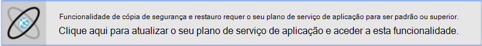
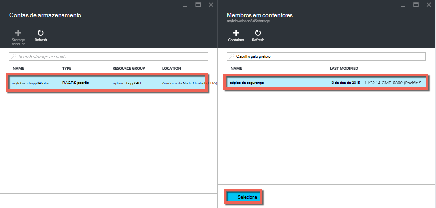
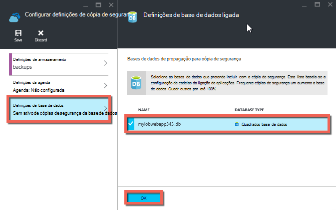
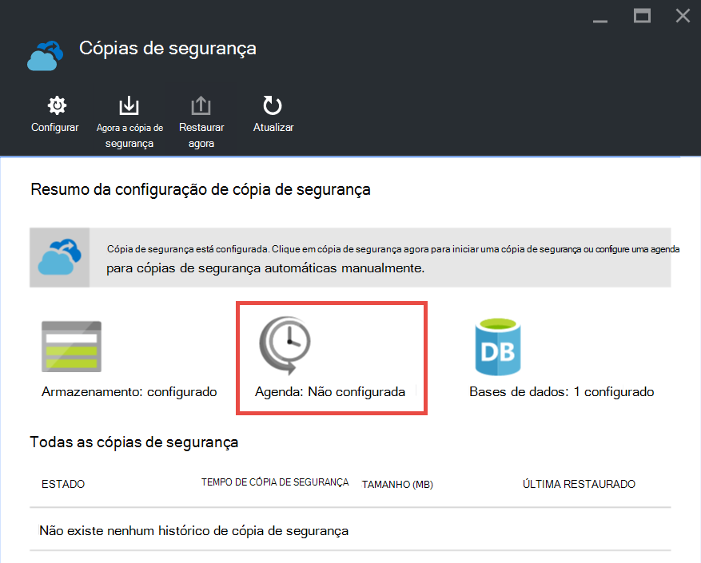

<properties 
    pageTitle="Agregar a sua aplicação no Azure" 
    description="Saiba como criar cópias de segurança das suas aplicações na aplicação de serviço de Azure." 
    services="app-service" 
    documentationCenter="" 
    authors="cephalin" 
    manager="wpickett" 
    editor="jimbe"/>

<tags 
    ms.service="app-service" 
    ms.workload="na" 
    ms.tgt_pltfrm="na" 
    ms.devlang="na" 
    ms.topic="article" 
    ms.date="07/06/2016" 
    ms.author="cephalin"/>

# Agregar a sua aplicação no Azure

A funcionalidade de cópia de segurança e restauro na [Aplicação de serviço de Azure](../app-service/app-service-value-prop-what-is.md) permite-lhe criar facilmente cópias de segurança da aplicação automaticamente ou manualmente. Pode restaurar a sua aplicação para um estado anterior ou criar uma nova aplicação com base das cópias de segurança da sua aplicação original. 

Para obter informações sobre como restaurar uma aplicação a partir de cópia de segurança, consulte o artigo [Restaurar uma aplicação no Azure](web-sites-restore.md).

## O que obtém cópias de segurança 
Aplicação de serviço pode agregar as seguintes informações:

* Configuração da aplicação
* Conteúdo do ficheiro
* Quaisquer bases de dados do SQL Azure ou bases de dados do MySQL Azure (ClearDB) ligados à sua aplicação (pode escolher quais pretende incluir na cópia de segurança)

Esta informação é cópia de segurança para a conta de armazenamento Azure e o contentor que especificar. 

> [AZURE.NOTE] Cada cópia de segurança é uma cópia offline completa da sua aplicação, não uma atualização utilizarão.

## Requisitos e restrições

* A funcionalidade de cópia de segurança e restauro requer o plano de serviço de aplicação para ser na camada **padrão** ou superior. Para mais informações sobre dimensionamento o seu plano de serviço de aplicação para utilizar uma camada superior, consulte o artigo [Dimensionar para cima de uma aplicação no Azure](web-sites-scale.md). Tenha em atenção que **Premium** camada permite que um número de cópias de segurança diárias superior camada **padrão** .
* Precisa de uma conta de armazenamento Azure e contentor na mesma subscrição como a aplicação que pretende fazer cópia de segurança. Para mais informações sobre contas do Azure armazenamento, consulte as [ligações](#moreaboutstorage) no final deste artigo.
* Cópias de segurança podem ser até 10GB de conteúdo de aplicação e base de dados. Obterá um erro se o tamanho da cópia de segurança exceder este limite. 

## Criar uma cópia de segurança manual

2. No [Portal do Azure](https://portal.azure.com), navegue até ao pá da sua aplicação, selecione **Definições**e, em seguida **cópias de segurança**. Será apresentado o pá **cópias de segurança** .
    
    ![Página de cópias de segurança][ChooseBackupsPage]

    >[AZURE.NOTE]Se vir a mensagem abaixo, clique na mesma para atualizar o seu plano de serviço de aplicação antes de poder continuar com cópias de segurança.
Para obter mais informações, consulte a [Dimensionar para cima de uma aplicação no Azure](web-sites-scale.md) .  
    >

3. No pá **cópias de segurança** , clique em **armazenamento: não configurado** para configurar uma conta de armazenamento.

    ![Selecione a conta de armazenamento][ChooseStorageAccount]
    
4. Escolha o destino da cópia de segurança ao selecionar uma **Conta de armazenamento** e **contentor**. A conta de armazenamento tem de pertencer à mesma subscrição do como a aplicação que pretende fazer cópia de segurança. Se pretender, pode criar uma nova conta de armazenamento ou um novo contentor nas respetivas lâminas. Quando tiver terminado, clique em **Selecionar**.
    
    
    
5. No pá de **Configurar definições de cópia de segurança** que ainda falta aberta, clique em **Definições de base de dados**, em seguida, selecione as bases de dados que pretende incluir nas cópias de segurança (base de dados SQL ou MySQL), em seguida, clique em **OK**.  

    

    > [AZURE.NOTE]  Para uma base de dados seja apresentado nesta lista, tem de existir sua cadeia de ligação na secção de **cadeias de ligação** da pá **definições da aplicação** para a sua aplicação.

6. Na pá **Configurar definições de cópia de segurança** , clique em **Guardar**.  

7. Na barra de comando do pá **cópias de segurança** , clique em **Cópia de segurança agora**.
    
    ![Botão BackUpNow][BackUpNow]
    
    Verá uma mensagem de progresso durante o processo de cópia de segurança.

Depois de ter configurado uma conta de armazenamento e contentor para cópias de segurança, pode fazer um manual de cópia de segurança em qualquer altura.  

## Configurar as cópias de segurança automatizadas

1. No pá **cópias de segurança** , clique em **agenda: não configurado**. 

    
    
1. Pá **Definições da agenda cópia de segurança** , definir **Agendada cópia de segurança** para **no**, em seguida, configure a agenda de cópia de segurança como pretendido e clique em **OK**.
    
    ![Ativar as cópias de segurança automatizadas][SetAutomatedBackupOn]
    
4. No pá de **Configurar definições de cópia de segurança** que ainda falta aberta, clique em **Definições do armazenamento**, em seguida, escolher o destino da cópia de segurança ao selecionar uma **Conta de armazenamento** e **contentor**. A conta de armazenamento tem de pertencer à mesma subscrição do como a aplicação que pretende fazer cópia de segurança. Se pretender, pode criar uma nova conta de armazenamento ou um novo contentor nas respetivas lâminas. Quando tiver terminado, clique em **Selecionar**.
    
    
    
5. No pá **Configurar definições de cópia de segurança** , clique em **Definições de base de dados**, em seguida, selecione as bases de dados que pretende incluir nas cópias de segurança (base de dados SQL ou MySQL), em seguida, clique em **OK**.  

    

    > [AZURE.NOTE]  Para uma base de dados seja apresentado nesta lista, tem de existir sua cadeia de ligação na secção de **cadeias de ligação** da pá **definições da aplicação** para a sua aplicação.

6. Na pá **Configurar definições de cópia de segurança** , clique em **Guardar**.  

## Cópia de segurança apenas uma parte da sua aplicação

Por vezes, que não pretende fazer cópia de segurança tudo na sua aplicação. Eis alguns exemplos:

-   Pode [configurar o semanais cópias de segurança](web-sites-backup.md#configure-automated-backups) da sua aplicação que contém conteúdos estático que nunca é alterado, tais como mensagens no blogue antigo ou imagens.
-   A aplicação tem mais de 10GB de conteúdo (que é o valor máximo que pode fazer cópia de segurança uma vez).
-   Não pretende agregar os ficheiros de registo.

Cópias de segurança parciais permitirá que escolher exatamente os ficheiros que pretende fazer cópia de segurança.

### Excluir ficheiros da cópia de segurança

Para excluir os ficheiros e pastas a partir do seu cópias de segurança, criar uma `_backup.filter` ficheiro na pasta D:\home\site\wwwroot da sua aplicação e especificar a lista de ficheiros e pastas que pretende excluir no mesmo. Uma forma fácil de aceder a esta é através da [Consola de Kudu](https://github.com/projectkudu/kudu/wiki/Kudu-console). 

Suponha que tem uma aplicação que contém os ficheiros de registo e imagens estáticas de anos anteriores que nunca mais vai alterar. Já tem uma cópia de segurança completa da aplicação que inclui as imagens antigas. Agora que pretende fazer cópia de segurança a aplicação diariamente, mas não pretende pagar para armazenar ficheiros de registo ou os ficheiros de imagem estática que nunca alterar.

![Pasta de registos][LogsFolder]
![imagens da pasta][ImagesFolder]
    
A seguir passos mostram como seria excluir estes ficheiros da cópia de segurança.

1. Aceda a `http://{yourapp}.scm.azurewebsites.net/DebugConsole` e identificar as pastas que pretende excluir da sua cópias de segurança. Neste exemplo, que seria que pretende excluir os seguintes ficheiros e pastas apresentadas na IU do que:

        D:\home\site\wwwroot\Logs
        D:\home\LogFiles
        D:\home\site\wwwroot\Images\2013
        D:\home\site\wwwroot\Images\2014
        D:\home\site\wwwroot\Images\brand.png

    [AZURE.NOTE] A última linha mostra que pode excluir ficheiros individuais, bem como as pastas.

2. Criar um ficheiro denominado `_backup.filter` e colocar lista acima no ficheiro, mas remover `D:\home`. Lista de um diretório ou ficheiro por linha. Por isso, deve ser o conteúdo do ficheiro:

    \site\wwwroot\Logs \LogFiles \site\wwwroot\Images\2013 \site\wwwroot\Images\2014 \site\wwwroot\Images\brand.png

3. Carregar este ficheiro para o `D:\home\site\wwwroot\` directório do seu site utilizando [ftp](web-sites-deploy.md#ftp) ou qualquer outro método. Se pretender, pode criar o ficheiro diretamente em `http://{yourapp}.scm.azurewebsites.net/DebugConsole` e inserir o conteúdo aí.

4. Execute cópias de segurança da mesma forma que faria normalmente-lo, [manual](#create-a-manual-backup) ou [automaticamente](#configure-automated-backups).

Agora, todos os ficheiros e pastas que são especificadas no `_backup.filter` serão excluídos da cópia de segurança. Neste exemplo, os ficheiros de registo e os ficheiros de imagem 2013 e 2014 irão já não ser cópia de segurança, assim como brand.png.

>[AZURE.NOTE] Restaurar parciais cópias de segurança do seu site da mesma forma que faria para [Restaurar uma cópia de segurança regular](web-sites-restore.md). O processo de restauro irá desempenham à direita.
>
>Quando for restaurada uma cópia de segurança completa, todo o conteúdo no site é substituído por qualquer que seja a cópia de segurança. Se é um ficheiro no site, mas não na cópia de segurança é eliminado. Mas quando uma cópia de segurança parcial for restaurada, qualquer conteúdo que encontra-se um dos directórios existentes na lista negra ou qualquer ficheiro existentes na lista negra, é deixado tal como está.

## Como são armazenadas cópias de segurança

Depois de efetuar um ou mais cópias de segurança para a sua aplicação, as cópias de segurança estarão visíveis na pá **contentores** da sua conta de armazenamento, bem como a sua aplicação. Na conta de armazenamento, cada cópia de segurança é composta por um ficheiro. zip que contém os dados de cópia de segurança e um ficheiro. XML que contenha um manifesto do conteúdo do ficheiro. zip. Pode deszipar e procure estes ficheiros se pretender aceder as cópias de segurança sem realmente efetuar restaurar uma aplicação.

A cópia de segurança da base de dados para a aplicação é armazenada na raiz do ficheiro. zip. Para uma base de dados do SQL, este é um ficheiro BACPAC (sem extensão de ficheiro) e pode ser importado. Para criar uma base de dados do SQL novo com base na exportação BACPAC, consulte o artigo [Importar um ficheiro de BACPAC para criar uma nova base de dados de utilizador](http://technet.microsoft.com/library/hh710052.aspx).

> [AZURE.WARNING] Alterar qualquer um dos ficheiros no seu contentor **websitebackups** pode causar a cópia de segurança para se tornar inválidos e, consequentemente, não restaurável.

## Próximos passos
Para obter informações sobre como restaurar uma aplicação a partir de uma cópia de segurança, consulte o artigo [Restaurar uma aplicação no Azure](web-sites-restore.md). Também pode fazer cópia de segurança e restaurar as aplicações de serviço de aplicação utilizar REST API (consulte o artigo [Utilizar resto para fazer cópia de segurança e restaurar a aplicação de serviço de aplicações](websites-csm-backup.md)).

>[AZURE.NOTE] Se pretender começar a aplicação de serviço de Azure antes de inscrever-se para uma conta do Azure, aceda ao [Tentar aplicação de serviço](http://go.microsoft.com/fwlink/?LinkId=523751), onde imediatamente pode criar uma aplicação web do starter curto na aplicação de serviço. Sem cartões de crédito necessários; sem compromissos.

<!-- IMAGES -->
[ChooseBackupsPage]: ./media/web-sites-backup/01ChooseBackupsPage.png
[ChooseStorageAccount]: ./media/web-sites-backup/02ChooseStorageAccount.png
[IncludedDatabases]: ./media/web-sites-backup/03IncludedDatabases.png
[BackUpNow]: ./media/web-sites-backup/04BackUpNow.png
[BackupProgress]: ./media/web-sites-backup/05BackupProgress.png
[SetAutomatedBackupOn]: ./media/web-sites-backup/06SetAutomatedBackupOn.png
[Frequency]: ./media/web-sites-backup/07Frequency.png
[StartDate]: ./media/web-sites-backup/08StartDate.png
[StartTime]: ./media/web-sites-backup/09StartTime.png
[SaveIcon]: ./media/web-sites-backup/10SaveIcon.png
[ImagesFolder]: ./media/web-sites-backup/11Images.png
[LogsFolder]: ./media/web-sites-backup/12Logs.png
[GhostUpgradeWarning]: ./media/web-sites-backup/13GhostUpgradeWarning.png
 
