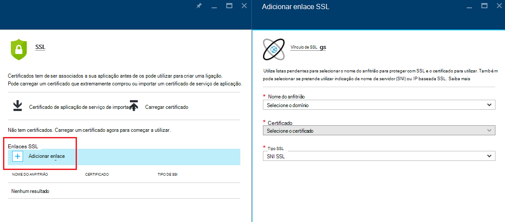
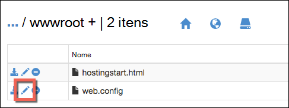

<properties
    pageTitle="Proteger o domínio personalizado da sua aplicação com HTTPS | Microsoft Azure"
    description="Saiba como seguro o nome de domínio personalizado para a sua aplicação na aplicação de serviço de Azure ao configurar uma ligação de certificado SSL. Também irá Saiba como obter um certificado SSL de várias ferramentas."
    services="app-service"
    documentationCenter=".net"
    authors="cephalin"
    manager="wpickett"
    editor="jimbe"
    tags="top-support-issue"/>

<tags
    ms.service="app-service"
    ms.workload="na"
    ms.tgt_pltfrm="na"
    ms.devlang="na"
    ms.topic="article"
    ms.date="08/08/2016"
    ms.author="cephalin"/>

# Proteger o domínio personalizado da sua aplicação com HTTPS

> [AZURE.SELECTOR]
- [Comprar o certificado SSL no Azure](web-sites-purchase-ssl-web-site.md)
- [Utilizar SSL orientação do diapositivo notas a partir de qualquer outro lugar](web-sites-configure-ssl-certificate.md)

Este artigo mostra-lhe como pode ativar HTTPS para uma aplicação web, um aplicação móvel do back-end ou uma aplicação do API na [Aplicação de serviço de Azure](../app-service/app-service-value-prop-what-is.md) que utiliza um nome de domínio personalizado. Cobrir autenticação apenas de servidor. Se precisar de autenticação comum (incluindo a autenticação de cliente), consulte [Como para configurar TLS comum autenticação para a aplicação de serviço.](app-service-web-configure-tls-mutual-auth.md)

Para proteger com HTTPS uma aplicação que tem um nome de domínio personalizado, adicione um certificado para esse nome de domínio. Por predefinição, o Azure protege a ** \*. azurewebsites.net** universais domínio com um único certificado SSL, para que os seus clientes já podem aceder à sua aplicação na * *https://*&lt;nome >*. azurewebsites.net**. Mas se quiser utilizar um domínio personalizado, como **contoso.com**, **www.contoso.com**, e ** \*. contoso.com**, o certificado predefinido não é possível seguro que. Além disso, como todos os [certificados de caracteres universais](https://casecurity.org/2014/02/26/pros-and-cons-of-single-domain-multi-domain-and-wildcard-certificates/), o certificado predefinido não é tão seguro como utilizar um domínio personalizado e um certificado para esse domínio personalizado.   

>[AZURE.NOTE] Pode obter ajuda a partir do Azure especialistas em qualquer altura nos [fóruns do Azure](https://azure.microsoft.com/support/forums/). Para obter suporte mais personalizado, vá para [Suportar o Azure](https://azure.microsoft.com/support/options/) e clique em **Obter suporte**.

## O que precisa
Para proteger o seu nome de domínio personalizado com HTTPS, vincular um certificado SSL personalizado para esse domínio personalizado no Azure. Antes de a vincular um certificado personalizado, tem de efetue o seguinte procedimento:

- **Configurar o domínio personalizado** - aplicação de serviço só permite adicionar um certificado para um nome de domínio que já esteja configurado na sua aplicação. Para obter instruções, consulte o artigo [mapear um nome de domínio personalizado para uma aplicação do Azure](web-sites-custom-domain-name.md). 
- **Dimensionar para cima, para a camada básica ou superior** Planos do serviço de aplicação em camadas comparar inferiores não suportam os certificados SSL personalizados. Para obter instruções, consulte o artigo [Dimensionar para cima de uma aplicação no Azure](web-sites-scale.md). 
- **Obter um certificado SSL** - se de que ainda não tem um, necessitará de obter um partir de uma [autoridade de certificação](http://en.wikipedia.org/wiki/Certificate_authority) (AC) fidedigna. O certificado tem de cumprir os seguintes requisitos:

    - Está assinado por uma AC fidedigna (sem servidores AC privados).
    - Contém uma chave privada.
    - É criada para troca de chaves e exportado para um. Ficheiro PFX.
    - Utiliza um mínimo de encriptação de 2048-bit.
    - O nome de assunto corresponde ao domínio personalizado que necessita para seguro. Para proteger vários domínios com um certificado, tem de utilizar um nome de caracteres universais (por exemplo, ** \*. contoso.com**) ou especificar valores subjectAltName.
    - Intercalada com todos os **[certificados intermédios](http://en.wikipedia.org/wiki/Intermediate_certificate_authorities)** utilizado pelo seu AC. Caso contrário, poderá deparado com problemas de interoperabilidade irreproducible alguns clientes.

        >[AZURE.NOTE] A forma mais fácil de obter um certificado SSL que cumpre todos os requisitos é comprar         [um no portal Azure diretamente](web-sites-purchase-ssl-web-site.md). Este artigo mostra-lhe como fazê-lo manualmente e, em seguida, ligá-la para o seu domínio personalizado no serviço de aplicação.
        >   
        > **Certificados elíptica curva em forma de criptografia ECC ()** pode trabalhar com a aplicação de serviço, mas fora do âmbito deste artigo. Trabalhe com a sua AC nos passos exatos para criar os certificados ECC.

## Passo 1. Obter um certificado SSL

Uma vez que AC fornecem os vários tipos de certificado SSL momentos preço diferente, deverá começar por decidir qual o tipo de certificado SSL para comprar. Para proteger um nome de domínio simples (**www.contoso.com**), que precise um certificado básico. Para proteger múltiplos nomes de domínio (**contoso.com** *e* **www.contoso.com** 
*e* **mail.contoso.com**), necessita de um [certificado de caracteres universais](http://en.wikipedia.org/wiki/Wildcard_certificate) ou um certificado com [Nome alternativo de assunto](http://en.wikipedia.org/wiki/SubjectAltName) (`subjectAltName`).

Quando já souber qual o certificado SSL para comprar, submeter um certificado de assinatura pedir (CSR) por uma AC. Quando voltar a receber certificado pedido do AC, em seguida, gerar um ficheiro. pfx a partir do certificado. Pode executar estes passos utilizando a ferramenta da sua escolha. Seguem-se as instruções para as ferramentas de comuns:

- [Passos Certreq.exe](#bkmk_certreq) - o utilitário do Windows para a criação de pedidos de certificados. Foi parte do Windows desde o Windows XP/Windows Server 2000.
- [Gestor de IIS passos](#bkmk_iismgr) - a ferramenta de escolha se já estiver familiarizado com o mesmo.
- [Passos OpenSSL](#bkmk_openssl) - uma [ferramenta de origem de abrir, em diferentes plataformas](https://www.openssl.org). Utilizá-lo para o ajudar a obter um certificado SSL de qualquer plataforma.
- passos para obter [passos de subjectAltName utilizando OpenSSL](#bkmk_subjectaltname) - a `subjectAltName` certificados.

Se pretender testar a configuração na aplicação de serviço antes de comprar um certificado, pode gerar um [certificado autoassinado](https://en.wikipedia.org/wiki/Self-signed_certificate). Neste tutorial dá-lhe duas formas de gerá-lo:

- [Certificado autoassinado, Certreq.exe passos](#bkmk_sscertreq)
- [Certificado autoassinado, OpenSSL passos](#bkmk_ssopenssl)

### Obter um certificado utilizando Certreq.exe

1. Criar um ficheiro (por exemplo, a **myrequest.txt**) e copie para o mesmo o seguinte texto e guarde-o no directório de trabalho. Substituir o `<your-domain>` marcador de posição com o nome de domínio personalizado da sua aplicação.

        [NewRequest]
        Subject = "CN=<your-domain>"  ; E.g. "CN=www.contoso.com", or "CN=*.contoso.com" for a wildcard certificate
        Exportable = TRUE
        KeyLength = 2048              ; Required minimum is 2048
        KeySpec = 1
        KeyUsage = 0xA0
        MachineKeySet = True
        ProviderName = "Microsoft RSA SChannel Cryptographic Provider"
        ProviderType = 12
        HashAlgorithm = SHA256

        [EnhancedKeyUsageExtension]
        OID=1.3.6.1.5.5.7.3.1         ; Server Authentication

    Para mais informações sobre as opções de CSR e outras opções disponíveis, consulte a [documentação de referência Certreq](https://technet.microsoft.com/library/dn296456.aspx).

4. Na linha de comandos, `CD` no seu diretório de trabalho e executar o seguinte comando para criar o representante de suporte:

        certreq -new myrequest.txt myrequest.csr

    **myrequest.CSR** agora é criada no diretório do seu trabalho atual.

5. Submeta **myrequest.csr** por uma AC para obter um certificado SSL. Que carregue o ficheiro ou copie o respetivo conteúdo a partir de um editor de texto para um formulário web.

    Para obter uma lista das AC fidedignas pela Microsoft, consulte o artigo [Microsoft fidedigna Root Certificate Program: participantes][cas].

6. Assim que a AC respondeu a com um certificado (. Ficheiro CER), guardá-lo no seu diretório de trabalho. Em seguida, execute o seguinte comando para concluir o CSR pendente.

        certreq -accept -user <certificate-name>.cer

    Este comando armazena o terminado certificado no arquivo de certificados Windows.

6. Se a sua AC utiliza certificados intermédios, instale-os antes de continuar. Normalmente provêm como uma transferência separada a partir do seu AC e em vários formatos para tipos de servidor web diferente. Selecione a versão para IIS da Microsoft.

    Assim que tiver transferido os certificados, com o botão direito cada um no Explorador do Windows e selecione  **Instalar certificado**. Utilizar os valores predefinidos no **Assistente de importação de certificado**e continue a selecionar **seguinte** até que tenha concluída a importação.

7. Para exportar o certificado SSL do arquivo de certificados, prima `Win` + `R` e executar **certmgr** para iniciar o Gestor de certificados. Selecione **pessoal** > **certificados**. Na coluna **Emitido para** , deverá ver uma entrada com o seu nome de domínio personalizado e a AC utilizadas para gerar o certificado na coluna **Emitido por** .

    ![Inserir imagem do Gestor de orientação do diapositivo notas aqui][certmgr]

9. Botão direito do rato no certificado e selecione **Todas as tarefas** > **Exportar**. No **Assistente de exportação do certificado**, clique em **seguinte**, em seguida, selecione **Sim, exporte a chave privada**e, em seguida, clique novamente em **seguinte** .

    ![Exportar a chave privada][certwiz1]

10. Selecione **Intercâmbio de informações pessoais - PKCS #12**, **incluir todos os certificados no caminho de certificados, se possível**e **Exportar todas as propriedades expandidas**. Em seguida, clique em **seguinte**.

    ![incluir todos os certificados e propriedades expandidas][certwiz2]

11. Selecione a **palavra-passe**e, em seguida, introduza e confirme a palavra-passe. Clique em **seguinte**.

    ![especificar uma palavra-passe][certwiz3]

12. Fornece um caminho e o nome de ficheiro para o certificado exportado, com a extensão **. pfx**. Clique em **seguinte** para concluir.

    ![fornecer um caminho de ficheiro][certwiz4]

Agora está pronto para carregar o ficheiro exportado do PFX para a aplicação de serviço. Consulte o artigo [passo 2. Carregar e vincular o certificado SSL personalizado](#bkmk_configuressl).

### Obter um certificado utilizando o Gestor do IIS

1. Gera um representante de suporte com o Gestor de IIS para enviar para a AC. Para mais informações sobre a gerar um representante de suporte, consulte o artigo [Pedir um certificado de servidor de Internet (IIS 7)][iiscsr].

3. Submeta o seu representante de suporte para uma AC para obter um certificado SSL. Para obter uma lista das AC fidedignas pela Microsoft, consulte o artigo [Microsoft fidedigna Root Certificate Program: participantes][cas].

3. Conclua o CSR com o certificado que envia a AC novamente para si. Para mais informações sobre a concluir o representante de suporte, consulte o artigo [instalar um certificado de servidor de Internet (IIS 7)][installcertiis].

4. Se a sua AC utiliza certificados intermédios, instale-os antes de continuar. Normalmente provêm como uma transferência separada a partir do seu AC e em vários formatos para tipos de servidor web diferente. Selecione a versão para IIS da Microsoft.

    Assim que tiver transferido os certificados, com o botão direito cada um no Explorador do Windows e selecione **Instalar certificado**. 
    Utilizar os valores predefinidos no **Assistente de importação de certificado**e continue a selecionar **seguinte** até que tenha concluída a importação.

4. Exporte o certificado SSL a partir do Gestor de IIS. Para obter mais informações sobre como exportar o certificado, consulte o artigo [Exportar um certificado de servidor (IIS 7)][exportcertiis]. 

    >[AZURE.IMPORTANT] No **Assistente de exportação do certificado**, certifique-se de que seleciona **Sim, exporte a chave privada**  
    >
    >![Exportar a chave privada][certwiz1]  
    >
    > e selecione também **Intercâmbio de informações pessoais - PKCS #12**, **incluir todos os certificados no caminho de certificados, se possível**e     **Exportar todas as propriedades expandidas**.
    >
    >![incluir todos os certificados e propriedades expandidas][certwiz2]

Agora está pronto para carregar o ficheiro exportado do PFX para a aplicação de serviço. Consulte o artigo [passo 2. Carregar e vincular o certificado SSL personalizado](#bkmk_configuressl).

### Obter um certificado utilizando OpenSSL

1. No terminal linha de comandos, `CD` para um diretório de trabalho gerar uma chave privada e CSR executando o seguinte comando:

        openssl req -sha256 -new -nodes -keyout myserver.key -out server.csr -newkey rsa:2048

2. Quando lhe for pedido, introduza as informações adequadas. Por exemplo:

        Country Name (2 letter code)
        State or Province Name (full name) []: Washington
        Locality Name (eg, city) []: Redmond
        Organization Name (eg, company) []: Microsoft
        Organizational Unit Name (eg, section) []: Azure
        Common Name (eg, YOUR name) []: www.microsoft.com
        Email Address []:

        Please enter the following 'extra' attributes to be sent with your certificate request

        A challenge password []:

    Quando tiver terminado, o que deve ter dois ficheiros no seu diretório de trabalho: **myserver.key** e **server.csr**. 
    O **server.csr** contém o CSR e necessite **myserver.key** mais tarde.

3. Submeta o seu representante de suporte para uma AC para obter um certificado SSL. Para obter uma lista das AC fidedignas pela Microsoft, consulte o artigo [Microsoft fidedigna Root Certificate Program: participantes][cas].

4. Assim que a AC envia o certificado pedido, guardá-lo num ficheiro denominado **myserver.crt** no diretório do seu trabalho. Se a sua AC fornece-o num formato de texto, simplesmente copiar o conteúdo para **myserver.crt** num editor de texto e guardá-lo. O ficheiro deve ter o seguinte aspeto:

        -----BEGIN CERTIFICATE-----
        MIIDJDCCAgwCCQCpCY4o1LBQuzANBgkqhkiG9w0BAQUFADBUMQswCQYDVQQGEwJV
        UzELMAkGA1UECBMCV0ExEDAOBgNVBAcTB1JlZG1vbmQxEDAOBgNVBAsTB0NvbnRv
        c28xFDASBgNVBAMTC2NvbnRvc28uY29tMB4XDTE0MDExNjE1MzIyM1oXDTE1MDEx
        NjE1MzIyM1owVDELMAkGA1UEBhMCVVMxCzAJBgNVBAgTAldBMRAwDgYDVQQHEwdS
        ZWRtb25kMRAwDgYDVQQLEwdDb250b3NvMRQwEgYDVQQDEwtjb250b3NvLmNvbTCC
        ASIwDQYJKoZIhvcNAQEBBQADggEPADCCAQoCggEBAN96hBX5EDgULtWkCRK7DMM3
        enae1LT9fXqGlbA7ScFvFivGvOLEqEPD//eLGsf15OYHFOQHK1hwgyfXa9sEDPMT
        3AsF3iWyF7FiEoR/qV6LdKjeQicJ2cXjGwf3G5vPoIaYifI5r0lhgOUqBxzaBDZ4
        xMgCh2yv7NavI17BHlWyQo90gS2X5glYGRhzY/fGp10BeUEgIs3Se0kQfBQOFUYb
        ktA6802lod5K0OxlQy4Oc8kfxTDf8AF2SPQ6BL7xxWrNl/Q2DuEEemjuMnLNxmeA
        Ik2+6Z6+WdvJoRxqHhleoL8ftOpWR20ToiZXCPo+fcmLod4ejsG5qjBlztVY4qsC
        AwEAATANBgkqhkiG9w0BAQUFAAOCAQEAVcM9AeeNFv2li69qBZLGDuK0NDHD3zhK
        Y0nDkqucgjE2QKUuvVSPodz8qwHnKoPwnSrTn8CRjW1gFq5qWEO50dGWgyLR8Wy1
        F69DYsEzodG+shv/G+vHJZg9QzutsJTB/Q8OoUCSnQS1PSPZP7RbvDV9b7Gx+gtg
        7kQ55j3A5vOrpI8N9CwdPuimtu6X8Ylw9ejWZsnyy0FMeOPpK3WTkDMxwwGxkU3Y
        lCRTzkv6vnHrlYQxyBLOSafCB1RWinN/slcWSLHADB6R+HeMiVKkFpooT+ghtii1
        A9PdUQIhK9bdaFicXPBYZ6AgNVuGtfwyuS5V6ucm7RE6+qf+QjXNFg==
        -----END CERTIFICATE-----

5. No terminal da linha de comandos, execute o seguinte comando para exportar **myserver.pfx** do **myserver.key** e **myserver.crt**:

        openssl pkcs12 -export -out myserver.pfx -inkey myserver.key -in myserver.crt

    Quando lhe for pedido, defina uma palavra-passe para proteger o ficheiro. pfx.

    > [AZURE.NOTE] Se a sua AC utiliza certificados intermédios, tem de inclui-los com o `-certfile` parâmetro. Normalmente provêm como uma transferência separada a partir do seu AC e em vários formatos para tipos de servidor web diferente. Selecione a versão com o `.pem` extensão.
    >
    > O `openssl -export` comando deverá ter um aspeto semelhante ao exemplo seguinte, que cria um ficheiro. pfx que inclui os certificados intermédios do ficheiro **intermédio cets.pem** :
    >  
    > `openssl pkcs12 -chain -export -out myserver.pfx -inkey myserver.key -in myserver.crt -certfile intermediate-cets.pem`

Agora está pronto para carregar o ficheiro exportado do PFX para a aplicação de serviço. Consulte o artigo [passo 2. Carregar e vincular o certificado SSL personalizado](#bkmk_configuressl).

### Obter um certificado de SubjectAltName utilizando OpenSSL

1. Criar um ficheiro denominado **sancert.cnf**, copie o seguinte texto na mesma e guarde-o no directório de trabalho:

        # -------------- BEGIN custom sancert.cnf -----
        HOME = .
        oid_section = new_oids
        [ new_oids ]
        [ req ]
        default_days = 730
        distinguished_name = req_distinguished_name
        encrypt_key = no
        string_mask = nombstr
        req_extensions = v3_req # Extensions to add to certificate request
        [ req_distinguished_name ]
        countryName = Country Name (2 letter code)
        countryName_default =
        stateOrProvinceName = State or Province Name (full name)
        stateOrProvinceName_default =
        localityName = Locality Name (eg, city)
        localityName_default =
        organizationalUnitName  = Organizational Unit Name (eg, section)
        organizationalUnitName_default  =
        commonName              = Your common name (eg, domain name)
        commonName_default      = www.mydomain.com
        commonName_max = 64
        [ v3_req ]
        subjectAltName=DNS:ftp.mydomain.com,DNS:blog.mydomain.com,DNS:*.mydomain.com
        # -------------- END custom sancert.cnf -----

    Na linha que começa com `subjectAltName`, substitua o valor com todos os nomes de domínio que pretende proteger (para além  `commonName`). Por exemplo:

        subjectAltName=DNS:sales.contoso.com,DNS:support.contoso.com,DNS:fabrikam.com

    Não precisar de alterar qualquer outro campo, incluindo `commonName`. Será pedido ao especificá-las nos próximos alguns passos.

1. No terminal linha de comandos, `CD` no seu diretório de trabalho e executar o seguinte comando:

        openssl req -sha256 -new -nodes -keyout myserver.key -out server.csr -newkey rsa:2048 -config sancert.cnf

2. Quando lhe for pedido, introduza as informações adequadas. Por exemplo:

        Country Name (2 letter code) []: US
        State or Province Name (full name) []: Washington
        Locality Name (eg, city) []: Redmond
        Organizational Unit Name (eg, section) []: Azure
        Your common name (eg, domain name) []: www.microsoft.com

    Assim que tiver terminado, o que deve ter dois ficheiros no seu diretório de trabalho: **myserver.key** e **server.csr**. 
    O **server.csr** contém o CSR e necessite **myserver.key** mais tarde.

3. Submeta o seu representante de suporte para uma AC para obter um certificado SSL. Para obter uma lista das AC fidedignas pela Microsoft, consulte o artigo [Microsoft fidedigna Root Certificate Program: participantes][cas].

4. Assim que a AC envia o certificado pedido, guardá-lo num ficheiro denominado **myserver.crt**. Se a sua AC fornece-o num formato de texto, simplesmente copiar o conteúdo para **myserver.crt** num editor de texto e guardá-lo. O ficheiro deve ter o seguinte aspeto:

        -----BEGIN CERTIFICATE-----
        MIIDJDCCAgwCCQCpCY4o1LBQuzANBgkqhkiG9w0BAQUFADBUMQswCQYDVQQGEwJV
        UzELMAkGA1UECBMCV0ExEDAOBgNVBAcTB1JlZG1vbmQxEDAOBgNVBAsTB0NvbnRv
        c28xFDASBgNVBAMTC2NvbnRvc28uY29tMB4XDTE0MDExNjE1MzIyM1oXDTE1MDEx
        NjE1MzIyM1owVDELMAkGA1UEBhMCVVMxCzAJBgNVBAgTAldBMRAwDgYDVQQHEwdS
        ZWRtb25kMRAwDgYDVQQLEwdDb250b3NvMRQwEgYDVQQDEwtjb250b3NvLmNvbTCC
        ASIwDQYJKoZIhvcNAQEBBQADggEPADCCAQoCggEBAN96hBX5EDgULtWkCRK7DMM3
        enae1LT9fXqGlbA7ScFvFivGvOLEqEPD//eLGsf15OYHFOQHK1hwgyfXa9sEDPMT
        3AsF3iWyF7FiEoR/qV6LdKjeQicJ2cXjGwf3G5vPoIaYifI5r0lhgOUqBxzaBDZ4
        xMgCh2yv7NavI17BHlWyQo90gS2X5glYGRhzY/fGp10BeUEgIs3Se0kQfBQOFUYb
        ktA6802lod5K0OxlQy4Oc8kfxTDf8AF2SPQ6BL7xxWrNl/Q2DuEEemjuMnLNxmeA
        Ik2+6Z6+WdvJoRxqHhleoL8ftOpWR20ToiZXCPo+fcmLod4ejsG5qjBlztVY4qsC
        AwEAATANBgkqhkiG9w0BAQUFAAOCAQEAVcM9AeeNFv2li69qBZLGDuK0NDHD3zhK
        Y0nDkqucgjE2QKUuvVSPodz8qwHnKoPwnSrTn8CRjW1gFq5qWEO50dGWgyLR8Wy1
        F69DYsEzodG+shv/G+vHJZg9QzutsJTB/Q8OoUCSnQS1PSPZP7RbvDV9b7Gx+gtg
        7kQ55j3A5vOrpI8N9CwdPuimtu6X8Ylw9ejWZsnyy0FMeOPpK3WTkDMxwwGxkU3Y
        lCRTzkv6vnHrlYQxyBLOSafCB1RWinN/slcWSLHADB6R+HeMiVKkFpooT+ghtii1
        A9PdUQIhK9bdaFicXPBYZ6AgNVuGtfwyuS5V6ucm7RE6+qf+QjXNFg==
        -----END CERTIFICATE-----

5. No terminal da linha de comandos, execute o seguinte comando para exportar **myserver.pfx** do **myserver.key** e **myserver.crt**:

        openssl pkcs12 -export -out myserver.pfx -inkey myserver.key -in myserver.crt

    Quando lhe for pedido, defina uma palavra-passe para proteger o ficheiro. pfx.

    > [AZURE.NOTE] Se a sua AC utiliza certificados intermédios, tem de inclui-los com o `-certfile` parâmetro. Normalmente provêm como uma transferência separada a partir do seu AC e em vários formatos para tipos de servidor web diferente. Selecione a versão com o `.pem` extensão).
    >
    > O `openssl -export` comando deverá ter um aspeto semelhante ao exemplo seguinte, que cria um ficheiro. pfx que inclui os certificados intermédios do ficheiro **intermédio cets.pem** :
    >  
    > `openssl pkcs12 -chain -export -out myserver.pfx -inkey myserver.key -in myserver.crt -certfile intermediate-cets.pem`

Agora está pronto para carregar o ficheiro exportado do PFX para a aplicação de serviço. Consulte o artigo [passo 2. Carregar e vincular o certificado SSL personalizado](#bkmk_configuressl).

### Gerar um certificado autoassinado utilizando Certreq.exe ###

>[AZURE.IMPORTANT] Os certificados autoassinados são teste apenas para fins de. A maioria dos browsers devolvem erros ao visitar um Web site que está protegido por um certificado autoassinado. Alguns browsers, ainda podem recusar navegar para o site. 

1. Criar um ficheiro de texto (por exemplo, **mycert.txt**), copie para o mesmo o seguinte texto e guardar o ficheiro no directório de trabalho. Substituir o `<your-domain>` marcador de posição com o nome de domínio personalizado da sua aplicação.

        [NewRequest]
        Subject = "CN=<your-domain>"  ; E.g. "CN=www.contoso.com", or "CN=*.contoso.com" for a wildcard certificate
        Exportable = TRUE
        KeyLength = 2048              ; KeyLength can be 2048, 4096, 8192, or 16384 (required minimum is 2048)
        KeySpec = 1
        KeyUsage = 0xA0
        MachineKeySet = True
        ProviderName = "Microsoft RSA SChannel Cryptographic Provider"
        ProviderType = 12
        HashAlgorithm = SHA256
        RequestType = Cert            ; Self-signed certificate
        ValidityPeriod = Years
        ValidityPeriodUnits = 1

        [EnhancedKeyUsageExtension]
        OID=1.3.6.1.5.5.7.3.1         ; Server Authentication

    O parâmetro importante é `RequestType = Cert`, que especifica um certificado autoassinado. 
    Para mais informações sobre as opções de CSR e outras opções disponíveis, consulte a [documentação de referência Certreq](https://technet.microsoft.com/library/dn296456.aspx).

4. Na linha de comandos, `CD` ao seu directório de trabalho e executar o seguinte comando:

        certreq -new mycert.txt mycert.crt
    
    O novo certificado autoassinado está agora instalado no arquivo de certificados.

7. Para exportar o certificado no arquivo de certificados, prima `Win` + `R` e executar **certmgr** para iniciar o Gestor de certificados. Selecione **pessoal** > **certificados**. Na coluna **Emitido para** , deverá ver uma entrada com o seu nome de domínio personalizado e a AC utilizadas para gerar o certificado na coluna **Emitido por** .

    ![Inserir imagem do Gestor de orientação do diapositivo notas aqui][certmgr]

9. Botão direito do rato no certificado e selecione **Todas as tarefas** > **Exportar**. No **Assistente de exportação do certificado**, clique em **seguinte**, em seguida, selecione **Sim, exporte a chave privada**e, em seguida, clique novamente em **seguinte** .

    ![Exportar a chave privada][certwiz1]

10. Selecione **Intercâmbio de informações pessoais - PKCS #12**, **incluir todos os certificados no caminho de certificados, se possível**e **Exportar todas as propriedades expandidas**. Em seguida, clique em **seguinte**.

    ![incluir todos os certificados e propriedades expandidas][certwiz2]

11. Selecione a **palavra-passe**e, em seguida, introduza e confirme a palavra-passe. Clique em **seguinte**.

    ![especificar uma palavra-passe][certwiz3]

12. Fornece um caminho e o nome de ficheiro para o certificado exportado, com a extensão **. pfx**. Clique em **seguinte** para concluir.

    ![fornecer um caminho de ficheiro][certwiz4]

Agora está pronto para carregar o ficheiro exportado do PFX para a aplicação de serviço. Consulte o artigo [passo 2. Carregar e vincular o certificado SSL personalizado](#bkmk_configuressl).

###Gerar um certificado autoassinado utilizando OpenSSL ###

>[AZURE.IMPORTANT] Os certificados autoassinados são teste apenas para fins de. A maioria dos browsers devolvem erros ao visitar um Web site que está protegido por um certificado autoassinado. Alguns browsers, ainda podem recusar navegar para o site. 

1. Criar um ficheiro de texto com o nome **serverauth.cnf**, em seguida, copie o seguinte conteúdo na mesma e, em seguida, guarde-o no directório de trabalho:

        [ req ]
        default_bits           = 2048
        default_keyfile        = privkey.pem
        distinguished_name     = req_distinguished_name
        attributes             = req_attributes
        x509_extensions        = v3_ca

        [ req_distinguished_name ]
        countryName         = Country Name (2 letter code)
        countryName_min         = 2
        countryName_max         = 2
        stateOrProvinceName     = State or Province Name (full name)
        localityName            = Locality Name (eg, city)
        0.organizationName      = Organization Name (eg, company)
        organizationalUnitName      = Organizational Unit Name (eg, section)
        commonName          = Common Name (eg, your app's domain name)
        commonName_max          = 64
        emailAddress            = Email Address
        emailAddress_max        = 40

        [ req_attributes ]
        challengePassword       = A challenge password
        challengePassword_min       = 4
        challengePassword_max       = 20

        [ v3_ca ]
         subjectKeyIdentifier=hash
         authorityKeyIdentifier=keyid:always,issuer:always
         basicConstraints = CA:false
         keyUsage=nonRepudiation, digitalSignature, keyEncipherment
         extendedKeyUsage = serverAuth

2. No terminal linha de comandos, `CD` no seu diretório de trabalho e executar o seguinte comando:

        openssl req -sha256 -x509 -nodes -days 365 -newkey rsa:2048 -keyout myserver.key -out myserver.crt -config serverauth.cnf

    Este comando cria dois ficheiros: **myserver.crt** (o certificado autoassinado) e **myserver.key** (a chave privada), com base nas definições no **serverauth.cnf**.

3. Exporte o certificado para um ficheiro. pfx executando o seguinte comando:

        openssl pkcs12 -export -out myserver.pfx -inkey myserver.key -in myserver.crt

    Quando lhe for pedido, defina uma palavra-passe para proteger o ficheiro. pfx.

Agora está pronto para carregar o ficheiro exportado do PFX para a aplicação de serviço. Consulte o artigo [passo 2. Carregar e vincular o certificado SSL personalizado](#bkmk_configuressl).

## Passo 2. Carregar e vincular o certificado SSL personalizado

Antes de o mover na, reveja a secção [o que precisa](#bkmk_domainname) e verifique se:

- tiver um domínio personalizado que mapas para a sua aplicação Azure,
- a aplicação está a executar na camada **básicas** ou superior, e
- tem um certificado SSL para o domínio personalizado a partir de uma AC.

1. No seu browser, abra o ** [Azure Portal.](https://portal.azure.com/)**
2.  Clique na opção de **Aplicação de serviço** no lado esquerdo da página.
3.  Clique no nome da sua aplicação para o qual pretende atribuir este certificado. 
4.  Nas **Definições**, clique em **certificados SSL**
5.  Clique em **Carregar certificado**
6.  Selecione o ficheiro. pfx que exportou no [passo 1](#bkmk_getcert) e especifique a palavra-passe que antes de criar. Em seguida, clique em **carregar** para carregar o certificado. Agora deverá ver o certificado carregado novamente na pá **certificado SSL** .
7. Clique em **Adicionar enlaces** da secção nos **enlaces ssl**
8. Na pá **Adicionar SSL encadernação** utilize listas pendentes para selecionar o nome de domínio para proteger com SSL e o certificado para utilizar. Também pode selecionar se pretende utilizar **[Indicação de nome de servidor (SNI)](http://en.wikipedia.org/wiki/Server_Name_Indication)** ou IP baseada SSL.

    

       •    IP based SSL associates a certificate with a domain name by mapping the dedicated public IP address of the server to the domain name. This requires each domain name (contoso.com, fabricam.com, etc.) associated with your service to have a dedicated IP address. This is the traditional          method of associating SSL certificates with a web server.
       •    SNI based SSL is an extension to SSL and **[Transport Layer Security](http://en.wikipedia.org/wiki/Transport_Layer_Security)** (TLS) that allows multiple domains to share the same IP address, with separate security certificates for each domain. Most modern browsers (including Internet Explorer, Chrome, Firefox and Opera) support SNI, however older browsers may not support SNI. For more information on SNI, see the **[Server Name Indication](http://en.wikipedia.org/wiki/Server_Name_Indication)** article on Wikipedia.
     
9. Clique em **Adicionar encadernação** para guardar as alterações e ativar SSL.

## Passo 3. Altere o mapeamento de nome de domínio (IP com base SSL apenas)

Se utilizar **SNI SSL** enlaces apenas, ignore esta secção. Vários **SNI SSL** enlaces podem trabalhar em conjunto no endereço IP partilhado atribuído para a sua aplicação. No entanto, se criar uma ligação de **IP com base SSL** , o serviço de aplicação cria um endereço IP dedicado para o enlace porque **IP com base SSL** necessita de um. Só um dedicado IP endereço pode ser criado, por conseguinte, pode ser adicionada apenas uma ligação de **IP com base SSL** .

Devido a este endereço IP dedicado, terá de configurar a aplicação ainda mais o se:

- [Utilizado um registo para mapear o seu domínio personalizado](web-sites-custom-domain-name.md#a) para a sua aplicação Azure e acabou de adicionar um enlace de **IP com base SSL** . Neste cenário, terá de mapear os existentes um registo para apontarem para o endereço IP dedicado seguindo estes passos:

    1. Depois de ter configurado um IP baseados encadernação SSL, um endereço IP dedicado é atribuído para a sua aplicação. Pode encontrar este endereço IP na página **domain personalizada** em definições da sua aplicação, para a direita acima da secção de **nomes de anfitriões** . Este será listado como **Endereço IP externo**
    
        

    2. [Reconfigurar o registo a para o seu nome de domínio personalizado para este novo endereço IP](web-sites-custom-domain-name.md#a).

- Já tem um ou mais enlaces **SNI SSL** na sua aplicação e que acabou de adicionar uma ligação de **IP com base SSL** . Assim que a ligação estiver concluída, o * &lt;nome >*. azurewebsites.net pontos de nome de domínio para o novo endereço IP. Por conseguinte, qualquer existente [mapeamento CNAME do domínio personalizado](web-sites-custom-domain-name.md#cname) para * &lt;nome >*. azurewebsites.net, incluindo aqueles que o **SNI SSL** seguro, também recebe tráfego no novo endereço, é criado para o **IP com base SSL** apenas. Neste cenário, terá de enviar o tráfego de **SNI SSL** novamente para o endereço IP partilhado original ao seguir estes passos:

    1. Identifique todos os [mapeamentos CNAME dos domínios personalizados](web-sites-custom-domain-name.md#cname) para a sua aplicação que tem um enlace **SNI SSL** .

    2. Mapear cada registo CNAME para **sni.** &lt;nome >. azurewebsites.net em vez de &lt;nome >. azurewebsites.net.

## Passo 4. Teste HTTPS para o seu domínio personalizado

Tudo o que falta para fazer é agora para se certificar de que HTTPS funciona do seu domínio personalizado. Vários browsers, navegue para `https://<your.custom.domain>` para ver que que serve para cima da sua aplicação.

- Se a sua aplicação lhe certificado de erros de validação, provavelmente estiver a utilizar um certificado autoassinado.

- Se não for o caso, que poderão ainda lhe falta saída certificados intermédios quando exporta o certificado. pfx. Volte para [o que precisa](#bkmk_domainname) para verificar se o seu representante de suporte cumpre todos os requisitos pelo serviço de aplicação.

## Impor HTTPS na sua aplicação

Se ainda quiser permitir o acesso HTTP para a sua aplicação, ignore este passo. Aplicação de serviço é que *não* impor HTTPS, para que os visitantes ainda possam aceder a sua aplicação através de HTTP. Se pretender impor HTTPS para a sua aplicação, pode definir uma regra reescrita de `web.config` ficheiro para a sua aplicação. Cada aplicação de serviço de aplicação tem neste ficheiro, independentemente da arquitetura de idioma da sua aplicação.

> [AZURE.NOTE] Existe redirecionamento específicas do idioma de pedidos de. ASP.NET MVC pode utilizar o filtro de [RequireHttps](http://msdn.microsoft.com/library/system.web.mvc.requirehttpsattribute.aspx) em vez da regra reescrita `web.config` (consulte o artigo [Implementar uma aplicação do ASP.NET MVC 5 segura para uma aplicação web](web-sites-dotnet-deploy-aspnet-mvc-app-membership-oauth-sql-database.md)).

Siga estes passos:

1. Navegue para a consola de depuração de Kudu para a sua aplicação. É o endereço `https://<appname>.scm.azurewebsites.net/DebugConsole`.

2. Na consola do depurar, CD para `D:\home\site\wwwroot`.

3. Abrir `web.config` ao clicar no botão do lápis.

    

    Se implementar a aplicação com Visual Studio ou Git, serviço de aplicação gera automaticamente o adequado `web.config` para a sua aplicação .NET, PHP, Node.js ou Python na raiz da aplicação. 
    Se `web.config` não existir, execute `touch web.config` na linha de comandos do baseados na web e criá-lo. Em alternativa, pode criá-lo no seu projeto local e implementar o seu código.

4. Se tinha que criar um `web.config`, copie o código seguinte na mesma e guardá-lo. Se abriu um Web. config existente, em seguida, que precise de copiar todo o `<rule>` marcar para o seu `web.config`do `configuration/system.webServer/rewrite/rules` elemento.

        <?xml version="1.0" encoding="UTF-8"?>
        <configuration>
          <system.webServer>
            <rewrite>
              <rules>
                <!-- BEGIN rule TAG FOR HTTPS REDIRECT -->
                <rule name="Force HTTPS" enabled="true">
                  <match url="(.*)" ignoreCase="false" />
                  <conditions>
                    <add input="{HTTPS}" pattern="off" />
                  </conditions>
                  <action type="Redirect" url="https://{HTTP_HOST}/{R:1}" appendQueryString="true" redirectType="Permanent" />
                </rule>
                <!-- END rule TAG FOR HTTPS REDIRECT -->
              </rules>
            </rewrite>
          </system.webServer>
        </configuration>

    Esta regra devolve um HTTP 301 (redirecionamento permanente) para o protocolo HTTPS sempre que o utilizador pedir uma página utilizando o protocolo HTTP. Redireciona a partir do http://contoso.com para https://contoso.com.

    >[AZURE.IMPORTANT] Se existirem já outras `<rule>` etiquetas na sua `web.config`, em seguida, coloque o copiada `<rule>` etiqueta antes do outro `<rule>` etiquetas.

4. Guarde o ficheiro na consola de depuração de Kudu. Deverá entre em vigor imediatamente redirecionar todos os pedidos para HTTPS.

Para mais informações sobre o módulo IIS reescrita de URL, consulte a documentação [Reescrita de URL](http://www.iis.net/downloads/microsoft/url-rewrite) .

## Mais recursos ##
- [Centro de fidedignidade do Microsoft Azure](/support/trust-center/security/)
- [Opções de configuração desbloqueadas no Azure Web Sites](/blog/2014/01/28/more-to-explore-configuration-options-unlocked-in-windows-azure-web-sites/)
- [Ativar o registo de diagnóstico](web-sites-enable-diagnostic-log.md)
- [Configurar aplicações web na aplicação de serviço do Azure](web-sites-configure.md)
- [Portal de gestão do Azure](https://manage.windowsazure.com)

>[AZURE.NOTE] Se pretender começar a aplicação de serviço de Azure antes de inscrever-se para uma conta do Azure, aceda ao [Tentar aplicação de serviço](http://go.microsoft.com/fwlink/?LinkId=523751), onde imediatamente pode criar uma aplicação de starter curto na aplicação de serviço. Sem cartões de crédito necessários; sem compromissos.

[customdomain]: web-sites-custom-domain-name.md
[iiscsr]: http://technet.microsoft.com/library/cc732906(WS.10).aspx
[cas]: http://social.technet.microsoft.com/wiki/contents/articles/31634.microsoft-trusted-root-certificate-program-participants-v-2016-april.aspx
[installcertiis]: http://technet.microsoft.com/library/cc771816(WS.10).aspx
[exportcertiis]: http://technet.microsoft.com/library/cc731386(WS.10).aspx
[openssl]: http://www.openssl.org/
[portal]: https://manage.windowsazure.com/
[tls]: http://en.wikipedia.org/wiki/Transport_Layer_Security
[staticip]: ./media/web-sites-configure-ssl-certificate/staticip.png
[website]: ./media/web-sites-configure-ssl-certificate/sslwebsite.png
[scale]: ./media/web-sites-configure-ssl-certificate/sslscale.png
[standard]: ./media/web-sites-configure-ssl-certificate/sslreserved.png
[pricing]: /pricing/details/
[configure]: ./media/web-sites-configure-ssl-certificate/sslconfig.png
[uploadcert]: ./media/web-sites-configure-ssl-certificate/ssluploadcert.png
[uploadcertdlg]: ./media/web-sites-configure-ssl-certificate/ssluploaddlg.png
[sslbindings]: ./media/web-sites-configure-ssl-certificate/sslbindings.png
[sni]: http://en.wikipedia.org/wiki/Server_Name_Indication
[certmgr]: ./media/web-sites-configure-ssl-certificate/waws-certmgr.png
[certwiz1]: ./media/web-sites-configure-ssl-certificate/waws-certwiz1.png
[certwiz2]: ./media/web-sites-configure-ssl-certificate/waws-certwiz2.png
[certwiz3]: ./media/web-sites-configure-ssl-certificate/waws-certwiz3.png
[certwiz4]: ./media/web-sites-configure-ssl-certificate/waws-certwiz4.png

