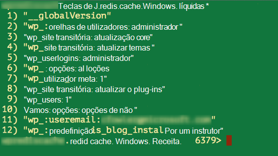

<properties
    pageTitle="Ligar uma aplicação web na aplicação de serviço de Azure a Redis Cache através do protocolo Memcache | Microsoft Azure"
    description="Ligar uma aplicação web no Azure aplicação de serviço de Cache Redis utilizando o protocolo Memcache"
    services="app-service\web"
    documentationCenter="php"
    authors="SyntaxC4"
    manager="wpickett"
    editor="riande"/>

<tags
    ms.service="app-service-web"
    ms.devlang="php"
    ms.topic="get-started-article"
    ms.tgt_pltfrm="windows"
    ms.workload="na"
    ms.date="02/29/2016"
    ms.author="cfowler"/>

# <a name="connect-a-web-app-in-azure-app-service-to-redis-cache-via-the-memcache-protocol"></a>Ligar uma aplicação web na aplicação de serviço de Azure a Redis Cache através do protocolo Memcache

Neste artigo, irá obter informações sobre como ligar um WordPress web app no [Azure aplicação de serviço de](http://go.microsoft.com/fwlink/?LinkId=529714) cache [Redis] do Azure[ 12] utilizando o [Memcache] [ 13] protocolo. Se tiver uma aplicação web existentes que utiliza um servidor de Memcached para na memória colocação em cache, pode migrá-lo para o serviço de aplicação do Azure e utilize a solução de colocação em cache originais no Microsoft Azure com pouca ou nenhuma alteração para o código da aplicação. Além disso, pode utilizar o seu Memcache existente conhecimentos para criar altamente dimensionáveis distribuído aplicações na aplicação de serviço de Azure com Azure Redis Cache para na memória colocação em cache, ao utilizar quadros populares aplicação como o .NET, PHP, Node.js, Java e Python.  

Aplicação de serviço Web Apps permite este cenário de aplicação com o correcção de compatibilidade Web Apps Memcache, que é um servidor Memcached local que age como um proxy de Memcache para chamadas para Azure Redis Cache de colocação em cache. Permite que qualquer aplicação do que comunica utilizando o protocolo Memcache para dados da cache com Redis Cache. Esta correcção de compatibilidade Memcache funciona ao nível do protocolo, para que podem ser utilizada pelo qualquer aplicação ou a arquitetura de aplicação, desde que comunica utilizando o protocolo Memcache.

[AZURE.INCLUDE [app-service-web-to-api-and-mobile](../../includes/app-service-web-to-api-and-mobile.md)] 

## <a name="prerequisites"></a>Pré-requisitos

A correcção de compatibilidade Web Apps Memcache pode ser utilizada com qualquer aplicação fornecidos comunica utilizando o protocolo Memcache. Para este exemplo específico, a aplicação de referência é um site do WordPress dimensionáveis que pode ser aprovisionado do Azure Marketplace.

Siga os passos descritos nestes artigos:

* [Aprovisionar uma instância do serviço de Cache Redis do Azure][0]
* [Implementar um site de WordPress dimensionáveis no Azure][1]

Assim que tiver o site de WordPress dimensionáveis implementado e uma instância de Redis Cache aprovisionado estará pronto para continuar com a ativação de correcção de compatibilidade Memcache no Azure aplicação de serviço Web Apps.

## <a name="enable-the-web-apps-memcache-shim"></a>Ativar a correcção de compatibilidade Web Apps Memcache

Para configurar Memcache correcção de compatibilidade, terá de criar três as definições da aplicação. Isto pode ser feito utilizando uma variedade de métodos, incluindo o [Portal do Azure](http://go.microsoft.com/fwlink/?LinkId=529715), o [portal clássica][3], os [Cmdlets do PowerShell Azure] [ 5] ou a [Interface de comandos do Azure][5]. Para efeitos desta mensagem, vou utilizar o [Portal do Azure] [ 4] para configurar as definições de aplicação. Podem ser obtidos os seguintes valores a partir do pá **Definições** da sua instância Redis Cache.


### <a name="add-redishost-app-setting"></a>Adicionar a definição de aplicação REDIS_HOST

A definição de aplicação primeira tem de criar é o **REDIS\_anfitrião** definição de aplicação. Esta definição define o destino à qual a correcção de compatibilidade reencaminha das informações da cache. O valor necessário para a definição de aplicação REDIS_HOST pode ser obtido pá as **Propriedades** da sua instância Redis Cache.


Definir a chave da definição de aplicação para **REDIS\_anfitrião** e o valor da definição de aplicação para o **nome do anfitrião** da instância Redis Cache.


### <a name="add-rediskey-app-setting"></a>Adicionar a definição de aplicação REDIS_KEY

A segunda definição de aplicação que precisa para criar é o **REDIS\_chave** definição de aplicação. Esta definição fornece que o token de autenticação necessário para o access segura a instância Redis Cache. Pode obter o valor necessário para a definição de aplicação REDIS_KEY da pá **teclas de acesso** da instância Redis Cache.


Definir a chave da definição de aplicação para **REDIS\_chave** e o valor da definição de aplicação para a **Chave primária** da instância Redis Cache.


### <a name="add-memcacheshimredisenable-app-setting"></a>Adicionar a definição de aplicação MEMCACHESHIM_REDIS_ENABLE

A definição de aplicação última é utilizada para ativar a correcção de compatibilidade Memcache nas aplicações Web, que utiliza a REDIS_HOST e REDIS_KEY para ligar para a Cache do Azure Redis e reencaminhar a cache de chamadas. Definir a chave da definição de aplicação para **MEMCACHESHIM\_REDIS\_ATIVAR** e o valor **Verdadeiro**.


Depois de ter adicionar as definições de aplicação três (3), clique em **Guardar**.

## <a name="enable-memcache-extension-for-php"></a>Ativar a extensão de Memcache para PHP

Ordem para a aplicação para o protocolo Memcache de falar, é necessário instalar a extensão Memcache PHP – a arquitetura de idioma para o seu site WordPress.

### <a name="download-the-phpmemcache-extension"></a>Transferir o php_memcache extensão

Navegue até à [PECL][6]. Em categoria de colocação em cache, clique em [memcache][7]. Por baixo da coluna transferências clique na ligação DLL.


Transfira a ligação de tópico não seguros (nta para) x86 para a versão do PHP ativada na Web Apps. (A predefinição é PHP 5.4)


### <a name="enable-the-phpmemcache-extension"></a>Activar a extensão de php_memcache

Depois de transferir o ficheiro, deszipar e carregue o **php\_memcache.dll** para o **d:\\casa\\site\\wwwroot\\posição\\EXP\\ ** diretório. Depois do php_memcache.dll ser carregado para a aplicação web, tem de ativar a extensão para o Runtime PHP. Para ativar a extensão de Memcache no Portal do Azure, abra o pá **Definições da aplicação** para a aplicação web, em seguida, adicionar uma nova definição de aplicação com a chave do **PHP\_EXTENSÕES** e o valor **posição\\EXP\\php_memcache.dll**.


> [AZURE.NOTE] Se necessitar da aplicação web carregar vários extensões PHP, o valor de PHP_EXTENSIONS deve ser uma lista de delimitado por vírgulas de caminhos relativas aos ficheiros DLL.


Assim que tiver terminado, clique em **Guardar**.

## <a name="install-memcache-wordpress-plugin"></a>Instalar o plug-in do Memcache WordPress

> [AZURE.NOTE] Também pode transferir o [Plug-in de Cache de objecto Memcached](https://wordpress.org/plugins/memcached/) do WordPress.org.

Na página de plug-ins WordPress, clique em **Adicionar novo**.


Na caixa de pesquisa, escreva **memcached** e prima **Enter**.


Localize **A Cache de objecto Memcached** na lista e, em seguida, clique em **Instalar agora**.


### <a name="enable-the-memcache-wordpress-plugin"></a>Ativar o plug-in Memcache WordPress

>[AZURE.NOTE] Siga as instruções neste blogue sobre [como ativar uma extensão de Site na Web Apps] [ 8] para instalar os serviços de equipa do Visual Studio.

No `wp-config.php` de ficheiros, adicione o seguinte código acima parar edição de comentário junto ao fim do ficheiro.

```php
$memcached_servers = array(
    'default' => array('localhost:' . getenv("MEMCACHESHIM_PORT"))
);
```

Assim que este código foi colado, Mónaco irá guardar o documento automaticamente.

O passo seguinte é permitir o plug-in da cache de objecto. Isto é feito ao arrastar e largar **cache.php objeto** da pasta **wp-conteúdo/plug-ins/memcached** para a pasta **wp conteúdo** para ativar a funcionalidade de Cache de objecto Memcache.


Agora que o ficheiro de **objeto cache.php** estiver na pasta **wp conteúdo** , a Cache de objecto Memcached agora está ativada.


## <a name="verify-the-memcache-object-cache-plugin-is-functioning"></a>Certifique-se de que o plug-in da Cache de objecto Memcache está a funcionar

Todos os passos para ativar a correcção de compatibilidade Web Apps Memcache estão concluídos. A única coisa esquerda é confirmar que os dados estão a preencher a instância Redis Cache.

### <a name="enable-the-non-ssl-port-support-in-azure-redis-cache"></a>Activar o suporte de porta que não sejam SSL na Cache Redis do Azure

>[AZURE.NOTE] No momento da escrever neste artigo, o clip Redis não suporta conectividade SSL, pelo que são necessários os seguintes passos.

No Portal do Azure, navegue para a instância de Redis Cache que criou para esta aplicação web. Assim que pá a cache estiver aberta, clique no ícone **Definições** .


Selecione **Portas de acesso** a partir da lista.


Clique em **não** para **Permitir o acesso apenas através de SSL**.


Irá ver a porta de SSL não está agora definida. Clique em **Guardar**.


### <a name="connect-to-azure-redis-cache-from-redis-cli"></a>Ligar para a Cache de Redis Azure a partir do clip redis

>[AZURE.NOTE] Este passo assume que redis está instalado localmente no seu computador de desenvolvimento. [Instalar Redis localmente utilizando estas instruções][9].

Abra a sua consola da linha de comandos da escolha e escreva o seguinte comando:

```shell
redis-cli –h <hostname-for-redis-cache> –a <primary-key-for-redis-cache> –p 6379
```

Substituir o ** &lt;hostname para redis cache&gt; ** com o nome do anfitrião xxxxx.redis.cache.windows.net real e o ** &lt;chave de principal para cache redis&gt; ** com a tecla de acesso para a cache, em seguida, prima **Enter**. Quando o clip tem estabelecida para a instância de Redis Cache, emita qualquer comando redis. Na captura de ecrã abaixo, posso escolheu listam as teclas de.



A chamada para listam as teclas de deve devolver um valor. Caso contrário, tente navegar para a aplicação web e volte a tentar.

## <a name="conclusion"></a>Conclusão

Parabéns! A aplicação de WordPress tem agora uma cache na memória centralizada para ajudar aumentando débito a. Lembre-se de que a correcção de compatibilidade de Memcache de aplicações Web podem ser utilizada com qualquer cliente Memcache, independentemente de linguagem de programação ou framework de aplicação. Para fornecer o seu feedback ou para fazer perguntas sobre correcção de compatibilidade Web Apps Memcache, publicar nos fóruns do [MSDN] [ 10] ou [Stackoverflow][11].

>[AZURE.NOTE] Se pretender começar a aplicação de serviço de Azure antes de inscrever-se para uma conta do Azure, aceda ao [Tentar aplicação de serviço](http://go.microsoft.com/fwlink/?LinkId=523751), onde imediatamente pode criar uma aplicação web do starter curto na aplicação de serviço. Sem cartões de crédito necessários; sem compromissos.

## <a name="whats-changed"></a>O que é alterado
* Para um guia para a alteração de Web sites para a aplicação de serviço Consulte o artigo: [aplicação de serviço de Azure e o seu impacto dos serviços do Azure existente](http://go.microsoft.com/fwlink/?LinkId=529714)


[0]: ../redis-cache/cache-dotnet-how-to-use-azure-redis-cache.md#create-a-cache
[1]: http://bit.ly/1t0KxBQ
[2]: http://manage.windowsazure.com
[3]: http://portal.azure.com
[4]: ../powershell-install-configure.md
[5]: /downloads
[6]: http://pecl.php.net
[7]: http://pecl.php.net/package/memcache
[8]: http://blog.syntaxc4.net/post/2015/02/05/how-to-enable-a-site-extension-in-azure-websites.aspx
[9]: http://redis.io/download#installation
[10]: https://social.msdn.microsoft.com/Forums/home?forum=windowsazurewebsitespreview
[11]: http://stackoverflow.com/questions/tagged/azure-web-sites
[12]: /services/cache/
[13]: http://memcached.org
