<properties
   pageTitle="Criar uma aplicação web do ASP.NET 5 no código do Visual Studio"
   description="Neste tutorial ilustra como criar uma aplicação web do ASP.NET 5 utilizando o código do Visual Studio."
   services="app-service\web"
   documentationCenter=".net"
   authors="erikre"
   manager="wpickett"
   editor="jimbe"/>

<tags
    ms.service="app-service-web" 
    ms.workload="web" 
    ms.tgt_pltfrm="dotnet" 
    ms.devlang="na" 
    ms.topic="article" 
    ms.date="02/26/2016" 
    ms.author="cephalin"/>

# Criar uma aplicação web do ASP.NET 5 no código do Visual Studio

## Descrição geral

Este tutorial mostra-lhe como criar uma aplicação web do ASP.NET 5 utilizando o [Visual Studio (código VS)](http://code.visualstudio.com//Docs/whyvscode) e implementá-lo para a [Aplicação de serviço de Azure](../app-service/app-service-value-prop-what-is.md). 

> [AZURE.NOTE] Apesar deste artigo refere-se a aplicações web, também se aplica à API aplicações e as aplicações móveis. 

ASP.NET 5 é um redesenhar significativa do ASP.NET. ASP.NET 5 é um novo quadro de origem de abrir e em diferentes plataformas, para criar aplicações web baseadas na nuvem moderna utilizando o .NET. Para mais informações, consulte o artigo [Introdução ao ASP.NET 5](http://docs.asp.net/en/latest/conceptual-overview/aspnet.html). Para obter informações sobre o serviço de aplicação do Azure web apps, consulte o artigo [Descrição geral de aplicações Web](app-service-web-overview.md).

[AZURE.INCLUDE [app-service-web-try-app-service.md](../../includes/app-service-web-try-app-service.md)]

## Pré-requisitos  

* Instale o [código de VS](http://code.visualstudio.com/Docs/setup).
* Instalar [Node.js](http://nodejs.org) - Node.js é uma plataforma para criar aplicações de servidor mais rápido e dimensionáveis utilizando JavaScript. Nó é o runtime (nó) e [npm](http://www.npmjs.com/) é o Gestor de pacote para módulos nó. Que irá utilizar npm para scaffold uma aplicação web do ASP.NET 5 neste tutorial.
* Instalar Git - pode instalá-lo a partir de uma das seguintes localizações: [Chocolatey](https://chocolatey.org/packages/git) ou [git scm.com](http://git-scm.com/downloads). Se estiver familiarizado com o Git, escolha [git scm.com](http://git-scm.com/downloads) e selecione a opção para **Utilizar Git da linha de comandos do Windows**. Depois de instalar Git, também terá de definir o nome de utilizador Git e e-mail conforme for necessário mais tarde no tutorial (quando desempenhar uma consolidação a partir do código VS).  

## Instalar o ASP.NET 5 e DNX
ASP.NET 5/DNX (ambiente de execução de .NET) é uma pilha de .NET lean para construir nuvem modernos e web apps que são executados nos X, Linux e Windows. -Foi criado a partir do terreno para cima para fornecer um quadro de desenvolvimento otimizada para as aplicações que são implementadas na nuvem ou executar no local. É constituída modulares componentes com sobrecarga mínima, para manter flexibilidade enquanto construir a sua soluções.

Neste tutorial foi concebido para ajudar a começar a criação de aplicações com as versões mais recentes do desenvolvimento de 5 de ASP.NET e DNX. As instruções seguintes são específicas do Windows. Para instruções de instalação mais detalhadas para OS X, Linux e Windows, consulte o artigo [instalar o 5 de ASP.NET e DNX](https://code.visualstudio.com/Docs/ASPnet5#_installing-aspnet-5-and-dnx). 

1. Para instalar o Gestor de versão .NET (DNVM) no Windows, abra uma linha de comandos e execute o seguinte comando.

        @powershell -NoProfile -ExecutionPolicy unrestricted -Command "&{$Branch='dev';iex ((new-object net.webclient).DownloadString('https://raw.githubusercontent.com/aspnet/Home/dev/dnvminstall.ps1'))}"

    Isto irá transferir o script DNVM e coloque-o no seu diretório de perfil de utilizador. 

2. **Reiniciar o Windows** para concluir a instalação DNVM. 

    Depois de ter reiniciado Windows, pode abrir a linha de comandos para verificar a localização da DNVM introduzindo o seguinte procedimento:

        where dnvm

    Linha de comandos irá apresentar um caminho semelhante ao seguinte.

    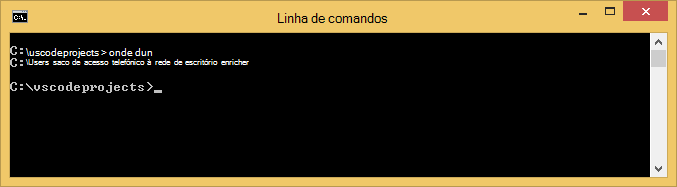

3. Agora que tem DNVM, tem de o utilizar para transferir DNX para executar as aplicações. Execute o seguinte na linha de comandos:

        dnvm upgrade

    Confirmar o seu DNVM e ver o runtime ativo ao introduzir o seguinte na linha de comandos:

        dnvm list

    Linha de comandos irá apresentar os detalhes do tempo de execução ativo.

    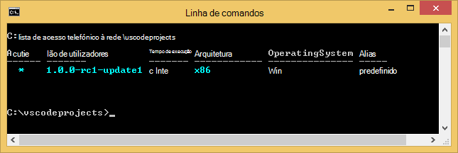

    Se mais do que um DNX runtime estiver listado, pode optar por introduzir o seguinte (ou uma versão mais recente) na linha de comandos para definir o tempo de execução DNX ativo. Defina-o para a mesma versão que é utilizada pelo gerador ASP.NET 5 quando criar a sua aplicação web posteriormente neste tutorial. *Não poderá precisar de alterar o tempo de execução ativo se está definido para a mais recente disponível.*

        dnvm use 1.0.0-update1 –p

> [AZURE.NOTE] Para instruções de instalação mais detalhadas para OS X, Linux e Windows, consulte o artigo [instalar o 5 de ASP.NET e DNX](https://code.visualstudio.com/Docs/ASPnet5#_installing-aspnet-5-and-dnx). 

## Criar a aplicação web 

Esta secção mostra-lhe como scaffold uma aplicação web do ASP.NET aplicação. Irá utilizar o Gestor de pacote nó (npm) para instalar [Yeoman](http://yeoman.io/) (ferramenta de andaimes aplicação - o equivalente VS código do Visual Studio **ficheiro > novo projeto** operação), [roncador](http://gruntjs.com/) (JavaScript corredor de tarefa) e [Bower](http://bower.io/) (Gestor de pacote do lado do cliente). 

1. Abra uma linha de comandos com direitos de administrador e navegue para a localização onde pretende criar o seu projeto do ASP.NET. Por exemplo, criar um diretório de *vscodeprojects* na raiz da c:\.

2. Introduza o seguinte na linha de comandos para instalar o Yeoman e as ferramentas de suporte.

        npm install -g yo grunt-cli generator-aspnet bower

    > [AZURE.NOTE] Poderá receber um aviso de sugerir que a sua versão de npm é desatualizada. Este aviso não deve afectar este tutorial.

3. Introduza o seguinte na linha de comandos para criar a pasta do projecto e scaffold a aplicação.

        yo aspnet

4. Utilize as teclas de seta para selecionar o tipo **Básico de aplicação Web** do ASP.NET 5 gerador menu de e, prima ** &lt;Enter >**.

    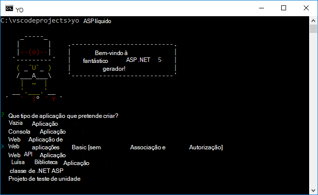

5. Defina o nome da sua nova aplicação web do ASP.NET para **SampleWebApp**. Como este nome é utilizado em todo o tutorial, se selecionar um nome diferente, terá de substituí-los-lo para cada ocorrência de **SampleWebApp**. Quando prime ** &lt;Enter >**, Yeoman irá criar uma nova pasta denominada **SampleWebApp** e os ficheiros necessários para a nova aplicação.

6. Na linha de comandos, altere directórios para a nova pasta de projeto:

        cd SampleWebApp

7. Também na linha de comandos, para instalar os pacotes de NuGet necessários para executar a aplicação, introduza o seguinte comando:

        dnu restore

8. Abra o código de VS introduzindo o seguinte na linha de comandos:

        code .

## Executar a aplicação web localmente

Agora que criou a aplicação web e obtidos todos os pacotes de NuGet para a aplicação, pode executar a aplicação web localmente.

1. A partir da **Paleta de comando** no código VS, introduza o seguinte para mostrar as opções disponíveis comando executar:

        dnx: Run Command

    > [AZURE.NOTE] Se o servidor de Omnisharp ainda não atualmente em execução, será iniciado para cima. Volte a introduzir o comando acima.

    Em seguida, selecione o seguinte comando para executar a aplicação web:
        
        dnx web - (SampleWebApp)

    A janela de comandos irá apresentar que iniciou a aplicação. Se a janela de comando não é apresentada esta mensagem, verifique o inferior esquerda corning de código VS erros no seu projeto.
    
    > [AZURE.NOTE]Emitir um comando a partir da **Paleta de comando** requer um **>** carácter no início da linha de comandos. Pode ver os detalhes relacionados com o comando **web** no ficheiro *project.json* .   
    > Se o comando não aparecer ou não está disponível, poderá ter de instalar a extensão de c#. Executar `>Extensions: Install Extension` e `ext install c#` para instalar as extensões c#.

2. Abra um browser e navegue para o seguinte URL.

    **http://localhost:5000**

    A página de predefinido da aplicação web será apresentada da seguinte forma.

    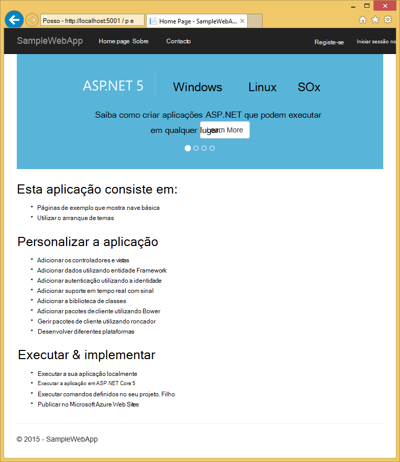

3. Feche o browser. Na **Janela de comando**, prima **Ctrl + C** para encerrar a aplicação e feche a **Janela de comandos**. 

## Criar uma aplicação web no Portal do Azure

Os passos seguintes irão guiá-lo através da criação de uma aplicação web no Portal do Azure.

1. Inicie a sessão [Portal do Azure](https://portal.azure.com).

2. Clique em **Novo** na parte superior esquerda do Portal.

3. Clique em **Web aplicações > Web App**.

    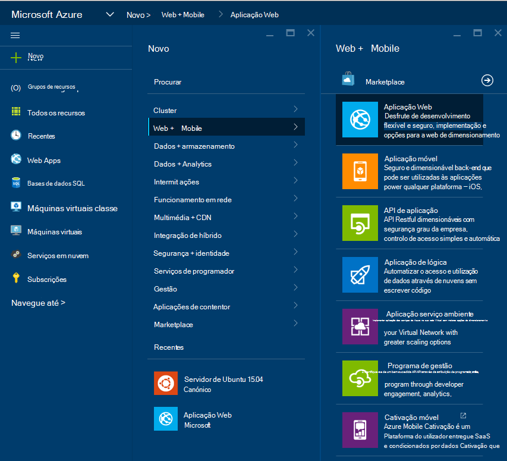

4. Introduza um valor para **nome**, tal como **SampleWebAppDemo**. Tenha em atenção que este nome tem de ser exclusivo e o portal irão impor que quando tenta introduza o nome. Por isso, se selecionar uma introduzir um valor diferente, terá de substituir esse valor para cada ocorrência de **SampleWebAppDemo** que vê neste tutorial. 

5. Selecione uma existente **Plano de serviço de aplicação** ou crie um novo. Se criar um novo plano, selecione a camada comparar, localização e outras opções. Para mais informações sobre os planos de aplicação de serviço, consulte o artigo [Descrição geral de aprofundada de planos do serviço de aplicação do Azure](../app-service/azure-web-sites-web-hosting-plans-in-depth-overview.md).

    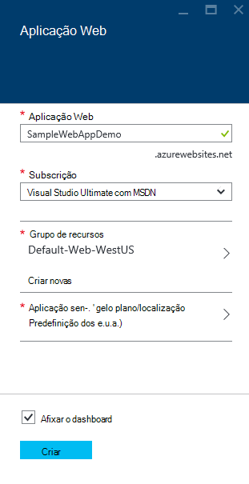

6. Clique em **Criar**.

    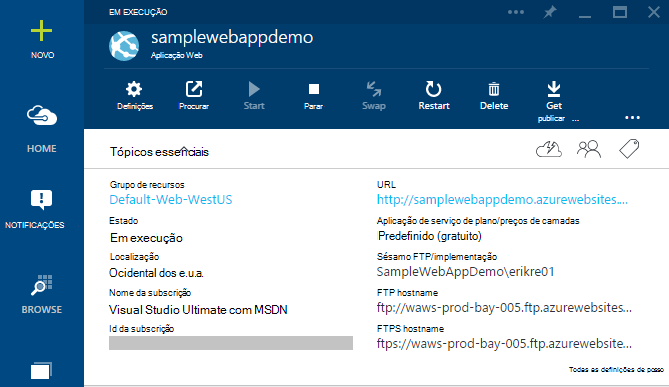

## Ativar a publicação Git a nova aplicação web

Git é um sistema de controlo de versão distribuído que pode utilizar para implementar a aplicação web do serviço de aplicação do Azure. Irá armazenar o código de escrita para a sua aplicação web num repositório Git local e irá implementar o seu código em Azure por conduza para um repositório remoto.   

1. Iniciar sessão no [Portal do Azure](https://portal.azure.com).

2. Clique em **Procurar**.

3. Clique em **Web Apps** para ver uma lista das aplicações web associada à sua subscrição Azure.

4. Selecione a aplicação web que criou neste tutorial.

5. No pá de aplicação web, clique em **Definições** > **implementação contínua**. 

    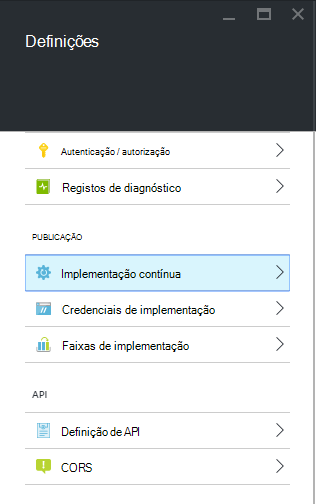

6. Clique em **Escolher origem > Local Git repositório**.

7. Clique em **OK**.

    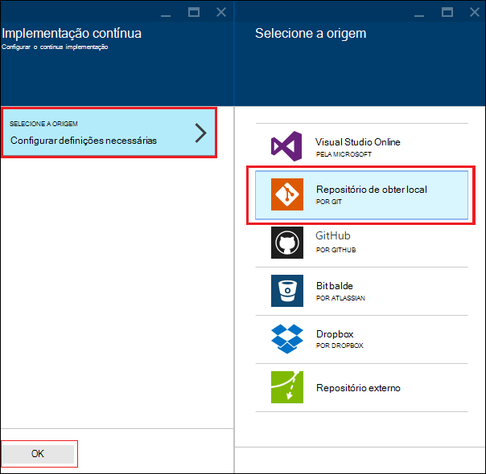

8. Se anteriormente não configurado implementação as credenciais para uma aplicação web ou noutra aplicação da aplicação de serviço de publicação, configurá-los agora:

    * Clique em **Definições** > **credenciais de implementação**. Será apresentado o pá **Definir credenciais de implementação** .

    * Crie um nome de utilizador e palavra-passe.  Irá precisar desta palavra-passe mais tarde quando configurar Git.

    * Clique em **Guardar**.

9. No pá da sua aplicação web, clique em **Definições > propriedades**. O URL do repositório Git remoto que irá implementar é apresentado em **GIT URL**.

10. Copie o valor de **GIT URL** para utilizar posteriormente no tutorial.

    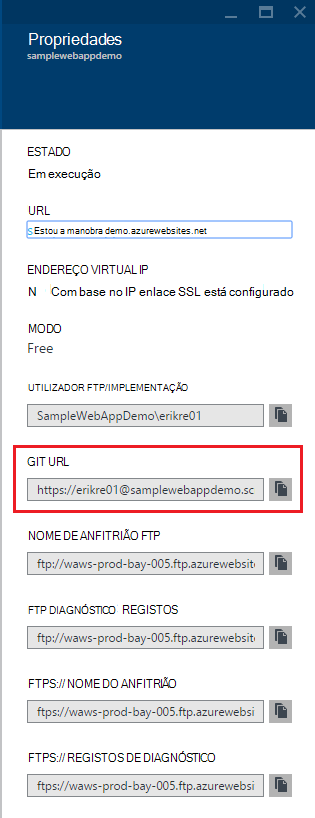

## Publicar a aplicação web do serviço de aplicação do Azure

Nesta secção, irá criar um repositório de Git local e push a partir desse repositório Azure para implementar a aplicação web do Azure.

1. No código VS, selecione a opção **Git** na barra de navegação à esquerda.

    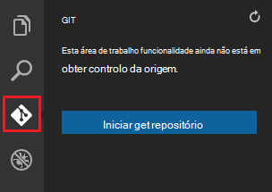

2. Selecione **Iniciar git repositório** para se certificar de que a área de trabalho está em git controlo da origem. 

    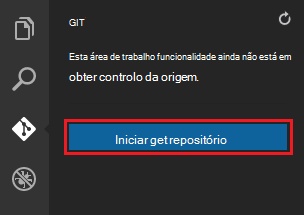

3. Abrir a janela de comando e altere directórios ao diretório da sua aplicação web. Em seguida, introduza o seguinte comando:

        git config core.autocrlf false

    Este comando impede um problema sobre o texto onde estão envolvidas terminações CRLF e terminações LF.

4. No código VS, adicione uma mensagem de confirmação e clique no ícone de verificação **Consolidar todos os** .

    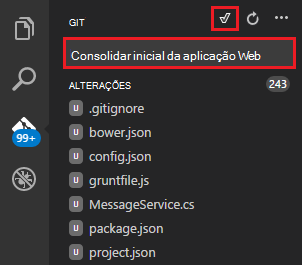

5. Depois de Git tem processamento, verá que não existem ficheiros listados na janela Git em **alterações**. 

    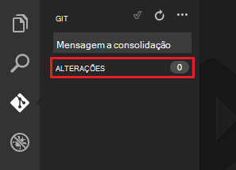

6. Altere novamente para a janela de comando onde a linha de comandos aponta para o directório onde se encontra a sua aplicação web.

7. Crie uma referência remota para direccionar actualizações para a sua aplicação web utilizando o URL de Git (terminação no ".git") que copiou anteriormente.

        git remote add azure [URL for remote repository]

8. Configure Git para guardar as suas credenciais localmente para que vai ser acrescentados automaticamente para os seus comandos push gerados a partir de código VS.

        git config credential.helper store

9. Notificações push as suas alterações para Azure introduzindo o seguinte comando. Após esta push inicial para Azure, irá possam fazer todos os comandos de push do código VS. 

        git push -u azure master

    É-lhe pedida a palavra-passe que criou anteriormente no Azure. **Nota: A palavra-passe só estarão visível.**

    O resultado do comando acima termina com uma mensagem que implementação é efetuada com êxito.

        remote: Deployment successful.
        To https://user@testsite.scm.azurewebsites.net/testsite.git
        [new branch]      master -> master

> [AZURE.NOTE] Se efetuar alterações para a sua aplicação, pode voltar a publicar diretamente no código de VS utilizando a funcionalidade incorporada do Git ao selecionar a opção **Consolidar tudo** seguida da opção **de emissão** . Encontrará a opção **de emissão** disponível no menu pendente junto os botões **Consolidar tudo** e **Atualizar** .

Se precisar de colaborar num projeto, deverá tomar em consideração da instalação push GitHub entre a instalação push Azure.

## Executar a aplicação no Azure
Agora que já implementou a aplicação web, vamos executar a aplicação de enquanto alojado no Azure. 

Isto pode ser feito de duas maneiras:

* Abra um browser e introduza o nome da sua aplicação web da seguinte forma.   

        http://SampleWebAppDemo.azurewebsites.net
 
* No Portal do Azure, localize o pá de aplicação web para a sua aplicação web e, clique em **Procurar** para ver a sua aplicação 
* no seu browser predefinido.

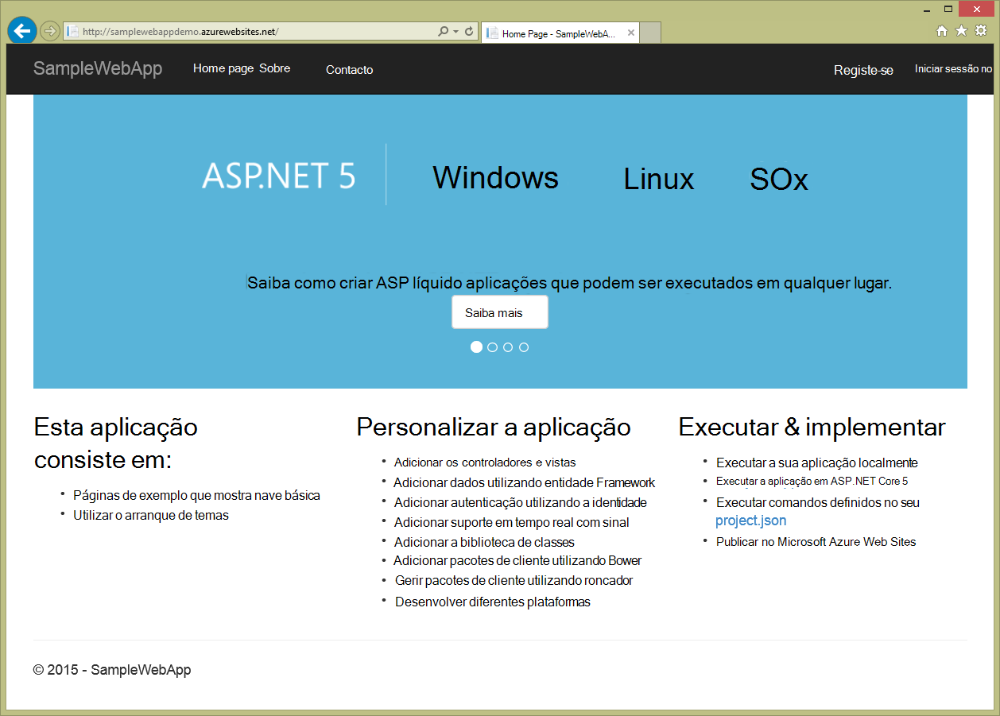

## Resumo
Neste tutorial, aprendeu como criar uma aplicação web no código VS e implemente-o Azure. Para mais informações sobre VS código, consulte o artigo, [por que motivo Visual Studio código?](https://code.visualstudio.com/Docs/) Para obter informações sobre o serviço de aplicação web apps, consulte o artigo [Descrição geral de aplicações Web](app-service-web-overview.md). 
