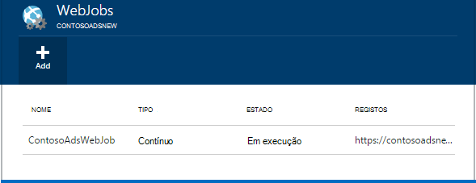
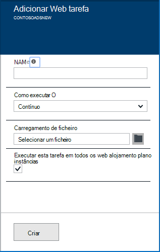
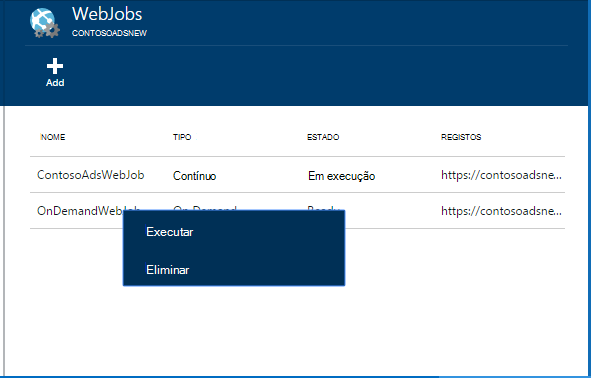
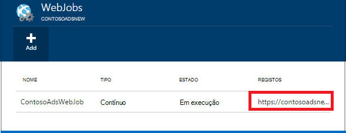

<properties 
    pageTitle="Executar tarefas em segundo plano com WebJobs" 
    description="Saiba como executar tarefas em segundo plano no Azure web apps." 
    services="app-service" 
    documentationCenter="" 
    authors="tdykstra" 
    manager="wpickett" 
    editor="jimbe"/>

<tags 
    ms.service="app-service" 
    ms.workload="na" 
    ms.tgt_pltfrm="na" 
    ms.devlang="na" 
    ms.topic="article" 
    ms.date="04/27/2016" 
    ms.author="tdykstra"/>

# <a name="run-background-tasks-with-webjobs"></a>Executar tarefas em segundo plano com WebJobs

## <a name="overview"></a>Descrição geral

Pode executar programas ou scripts no WebJobs na aplicação web do [Serviço de aplicação](http://go.microsoft.com/fwlink/?LinkId=529714) de três formas: a pedido, continuamente, ou uma agenda. Não há custo adicional para utilizar WebJobs.

Este artigo mostra como implementar WebJobs utilizando o [Portal do Azure](https://portal.azure.com). Para obter informações sobre como implementar utilizando o Visual Studio ou um processo de entrega contínuo, consulte o artigo [como implementar o Azure WebJobs às aplicações Web](websites-dotnet-deploy-webjobs.md).

O SDK do Azure WebJobs simplifica WebJobs muitas tarefas de programação. Para mais informações, consulte o artigo [o que é o SDK WebJobs](websites-dotnet-webjobs-sdk.md).

 Funções Azure (atualmente em pré-visualização) é outra forma de executar scripts e programas no Azure aplicação de serviço. Para mais informações, consulte o artigo [Descrição geral das funções Azure](../azure-functions/functions-overview.md).

[AZURE.INCLUDE [app-service-web-to-api-and-mobile](../../includes/app-service-web-to-api-and-mobile.md)] 

## <a name="acceptablefiles"></a>Tipos de ficheiro aceitável de scripts ou programas

Os seguintes tipos de ficheiro são aceites:

* . cmd, bat, .exe (utilizando o windows cmd)
* . ps1 (utilizando o powershell)
* .SH (utilizando festa)
* .php (utilizando php)
* .PY (utilizando python)
* . js (utilizando o nó)
* .JAR (utilizando java)

## <a name="CreateOnDemand"></a>Criar um pedido em WebJob no portal

1. No pá a **Aplicação Web** do [Portal do Azure](https://portal.azure.com), clique em **todas as definições > WebJobs** para mostrar o pá **WebJobs** .
    
    
    
5. Clique em **Adicionar**. É apresentada a caixa de diálogo **Adicionar WebJob** .
    
    
    
2. Em **nome**, forneça um nome para o WebJob. O nome tem de começar com uma letra ou um número e não pode conter carateres especiais de "-" e "_".
    
4. Na caixa **como executar** , selecione **executar a pedido**.
    
3. Na caixa de **Envio de ficheiros** , clique no ícone de pasta e procure o ficheiro zip que contém o script. O ficheiro zip deve conter seu executável (.exe. cmd. bat .sh .php .py. js) bem como quaisquer ficheiros de suporte conforme necessários para executar o programa ou script.
    
5. Selecione **Criar** para carregar o script para a sua aplicação web. 
    
    O nome que especificou para o WebJob aparece na lista de pá **WebJobs** .
    
6. Para executar o WebJob, com o botão direito respetivo nome na lista e clique em **Executar**.
    
    
    
## <a name="CreateContinuous"></a>Criar um WebJob continuamente em execução

1. Para criar uma forma contínua execução WebJob, siga os mesmos passos para criar um WebJob que é executada uma vez, mas na caixa **como executar** , selecione **contínuo**.

2. Para iniciar ou parar um WebJob contínuo, com o botão direito WebJob na lista e clique em **Iniciar** ou **Parar**.
    
> [AZURE.NOTE] Se a aplicação web é executado em mais do que uma instância, um WebJob continuamente a execução será executado em todos os seus instâncias. Executar a pedido e agendadas WebJobs numa única ocorrência seleccionada para balanceamento de carga ao Microsoft Azure.
    
> Para WebJobs contínua executar o sujeito e em todas as instâncias, ative a sempre no * definição de configuração para o web app caso contrário pode deixar de em execução quando o site de anfitrião SMS tem estado inativo durante muito tempo.

## <a name="CreateScheduledCRON"></a>Criar um WebJob agendada utilizando uma expressão de CRON

Esta técnica está disponível para aplicações Web a ser executada em modo de básica, padrão ou Premium e requer a definição **Sempre** para a aplicação de estar ativada.

Para transformar uma WebJob de procura numa WebJob agendada, basta inclua um `settings.job` ficheiro na raiz do seu ficheiro de postal WebJob. Este ficheiro JSON deve incluir um `schedule` propriedade com uma [expressão CRON](https://en.wikipedia.org/wiki/Cron), por exemplo abaixo.

A expressão CRON é composta por 6 campos: `{second} {minute} {hour} {day} {month} {day of the week}`.

Por exemplo, para acionar o WebJob a cada 15 minutos, seu `settings.job` teria:

```json
{
    "schedule": "0 */15 * * * *"
}
``` 

Exemplos de agenda outras CRON:

- Cada hora (ou seja, sempre que a contagem de minutos é 0):`0 0 * * * *` 
- Cada hora a partir de 9 AM às 17: 00:`0 0 9-17 * * *` 
- Em 9:30 AM diariamente:`0 30 9 * * *`
- Em 9:30 AM cada dia da semana:`0 30 9 * * 1-5`

**Nota**: quando implementar um WebJob do Visual Studio, certifique-se marcar o `settings.job` propriedades do ficheiro como 'Cópia se mais recente'.


## <a name="CreateScheduled"></a>Criar um WebJob agendada utilizando o Scheduler do Azure

A seguinte técnica alternativa utiliza o Scheduler do Azure. Neste caso, o WebJob não tem qualquer direto dados de conhecimento da agenda. Em vez disso, o Scheduler do Azure obtém configurado para acionar o WebJob uma agenda. 

Portal do Azure ainda não tiver a capacidade de criar uma WebJob agendada, mas até que a funcionalidade é adicionada que pode fazê-lo utilizando o [portal clássica](http://manage.windowsazure.com).

1. No [portal clássica](http://manage.windowsazure.com) aceda à página WebJob e clique em **Adicionar**.

1. Na caixa **como executar** , selecione a **executar numa agenda**.
    
    ![Tarefa agendada nova][NewScheduledJob]
    
2. Selecione o **Programador de região** para a tarefa e, em seguida, clique na seta no canto inferior direito da caixa de diálogo para avançar para o ecrã seguinte.

3. Na caixa de diálogo **Criar tarefa** , escolha o tipo de **Periodicidade** que pretende: **processo único** ou **periódica**.
    
    ![Periodicidade da agenda][SchdRecurrence]
    
4. Também escolher uma hora de **início** : **agora** ou **uma altura específica**.
    
    ![Hora de início de agenda][SchdStart]
    
5. Se pretende iniciar uma altura específica, selecione os valores de hora inicial em **Iniciar em**.
    
    ![Início da agenda num momento específico][SchdStartOn]
    
6. Se optar por uma tarefa periódica, terá do **Repetir todas as** opção para especificar a frequência de ocorrência e a opção **Terminar** para especificar uma hora de fim.
    
    ![Periodicidade da agenda][SchdRecurEvery]
    
7. Se escolher **semanas**, pode selecionar a caixa de **Um determinado planeado** e especificar os dias da semana em que pretende que a tarefa para executar.
    
    ![Agenda dias da semana][SchdWeeksOnParticular]
    
8. Se escolher **meses** e selecione a caixa de **Um determinado como planeado** , pode definir a tarefa para ser executada em particular numerada **dias** no mês. 
    
    ![Agendar específica datas no mês][SchdMonthsOnPartDays]
    
9. Se optar por **Dias da semana**, pode selecionar qual dia ou dias da semana no mês que pretende que a tarefa para executar.
    
    ![Agendar dias da semana específica num mês][SchdMonthsOnPartWeekDays]
    
10. Por fim, também pode utilizar a opção de **ocorrências** para escolher qual semana no mês (primeiro, segundo, terceiro etc.) que pretende que a tarefa para executar o os dias da semana que especificou.
    
    ![Agendar dias da semana específico em Particular semanas num mês][SchdMonthsOnPartWeekDaysOccurences]
    
11. Depois de ter criado uma ou mais tarefas, os respetivos nomes serão apresentados no separador WebJobs com o respetivo estado, tipo de agenda e outras informações. Informações no histórico para os últimos 30 WebJobs são mantidas.
    
    ![Lista de tarefas][WebJobsListWithSeveralJobs]
    
### <a name="Scheduler"></a>Tarefas agendadas e o programador do Azure

Tarefas agendadas podem ser configuradas ainda mais nas páginas do Azure Scheduler do [portal clássica](http://manage.windowsazure.com).

1.  Na página WebJobs, clique em ligação de **agenda** a tarefa para navegar para a página de portal do Scheduler do Azure. 
    
    ![Ligação para o Scheduler do Azure][LinkToScheduler]
    
2. Na página de programador, clique na tarefa.
    
    ![Tarefa na página do portal de programador][SchedulerPortal]
    
3. A página de **acção de tarefa** é aberta, onde pode continuar a configurar a tarefa. 
    
    ![Acção de tarefa PageInScheduler][JobActionPageInScheduler]
    
## <a name="ViewJobHistory"></a>Ver o histórico de tarefa

1. Para visualizar o histórico de execução de uma tarefa, incluindo tarefas criadas com o SDK WebJobs, clique na hiperligação correspondente sob a coluna de **registos** da pá WebJobs. (Pode utilizar o ícone de área de transferência para copiar o URL da página de ficheiro de registo para a área de transferência, se pretender.)
    
    
        
2. Clicar na ligação abre a página de detalhes para a WebJob. Esta página mostra-lhe o nome do comando Executar, as horas últimas executou o caso, e o sucesso ou falha. Em **recente tarefa é executada**, clique numa hora para ver mais detalhes.
    
    ![WebJobDetails][WebJobDetails]
    
3. É apresentada a página de **Detalhes de executar WebJob** . Clique em **Saída do botão de alternar** para ver o texto do conteúdo do registo. O registo de saída está no formato de texto. 
    
    ![Execução detalhes da tarefa de Web][WebJobRunDetails]
    
4. Para ver o texto de saída numa janela do browser em separado, clique na ligação **Transferir** . Para transferir o próprio texto, com o botão direito na ligação e utilize as opções do browser para guardar o conteúdo do ficheiro.
    
    ![Transferir o registo de saída][DownloadLogOutput]
    
5. A ligação **WebJobs** na parte superior da página fornece uma forma conveniente para aceder a uma lista de WebJobs no dashboard de histórico.
    
    ![Ligar a lista de WebJobs][WebJobsLinkToDashboardList]
    
    ![Lista de WebJobs no dashboard de histórico][WebJobsListInJobsDashboard]
    
    Clicar em uma destas ligações leva-o para a página de detalhes do WebJob para a tarefa que selecionou.


## <a name="WHPNotes"></a>Notas
    
- Web apps no modo gratuito podem tempo limite depois de 20 minutos, se existirem sem pedidos para o site de SMS (implementação) e o portal do web app não haja nenhum aberto no Azure. Pedidos para o site real não irão repor esta.
- Código de um projecto contínuo tem de ser escritos para serem executados num ciclo contínuo.
- As tarefas contínuas continuamente executadas apenas quando a aplicação web é para cima.
- Básicas e modos de padrão oferta a sempre de funcionalidades que, quando ativada, impede que aplicações web a tornar-se inactivo.
- Só é possível depurar continuamente a executar o WebJobs. Depuração WebJobs agendado ou a pedido não é suportada.

## <a name="NextSteps"></a>Próximos passos
 
Para obter mais informações, consulte o artigo [Azure WebJobs recomendado recursos][WebJobsRecommendedResources].

[PSonWebJobs]:http://blogs.msdn.com/b/nicktrog/archive/2014/01/22/running-powershell-web-jobs-on-azure-websites.aspx
[WebJobsRecommendedResources]:http://go.microsoft.com/fwlink/?LinkId=390226

[OnDemandWebJob]: ./media/web-sites-create-web-jobs/01aOnDemandWebJob.png
[WebJobsList]: ./media/web-sites-create-web-jobs/02aWebJobsList.png
[NewContinuousJob]: ./media/web-sites-create-web-jobs/03aNewContinuousJob.png
[NewScheduledJob]: ./media/web-sites-create-web-jobs/04aNewScheduledJob.png
[SchdRecurrence]: ./media/web-sites-create-web-jobs/05SchdRecurrence.png
[SchdStart]: ./media/web-sites-create-web-jobs/06SchdStart.png
[SchdStartOn]: ./media/web-sites-create-web-jobs/07SchdStartOn.png
[SchdRecurEvery]: ./media/web-sites-create-web-jobs/08SchdRecurEvery.png
[SchdWeeksOnParticular]: ./media/web-sites-create-web-jobs/09SchdWeeksOnParticular.png
[SchdMonthsOnPartDays]: ./media/web-sites-create-web-jobs/10SchdMonthsOnPartDays.png
[SchdMonthsOnPartWeekDays]: ./media/web-sites-create-web-jobs/11SchdMonthsOnPartWeekDays.png
[SchdMonthsOnPartWeekDaysOccurences]: ./media/web-sites-create-web-jobs/12SchdMonthsOnPartWeekDaysOccurences.png
[RunOnce]: ./media/web-sites-create-web-jobs/13RunOnce.png
[WebJobsListWithSeveralJobs]: ./media/web-sites-create-web-jobs/13WebJobsListWithSeveralJobs.png
[WebJobLogs]: ./media/web-sites-create-web-jobs/14WebJobLogs.png
[WebJobDetails]: ./media/web-sites-create-web-jobs/15WebJobDetails.png
[WebJobRunDetails]: ./media/web-sites-create-web-jobs/16WebJobRunDetails.png
[DownloadLogOutput]: ./media/web-sites-create-web-jobs/17DownloadLogOutput.png
[WebJobsLinkToDashboardList]: ./media/web-sites-create-web-jobs/18WebJobsLinkToDashboardList.png
[WebJobsListInJobsDashboard]: ./media/web-sites-create-web-jobs/19WebJobsListInJobsDashboard.png
[LinkToScheduler]: ./media/web-sites-create-web-jobs/31LinkToScheduler.png
[SchedulerPortal]: ./media/web-sites-create-web-jobs/32SchedulerPortal.png
[JobActionPageInScheduler]: ./media/web-sites-create-web-jobs/33JobActionPageInScheduler.png
 
