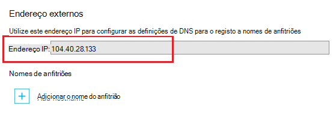

<properties
    pageTitle="Mapear um nome de domínio personalizado para uma aplicação do Azure"
    description="Saiba como mapear um nome de domínio personalizado (domínio relegado) para a sua aplicação na aplicação de serviço de Azure."
    services="app-service"
    documentationCenter=""
    authors="cephalin"
    manager="wpickett"
    editor="jimbe"
    tags="top-support-issue"/>

<tags
    ms.service="app-service"
    ms.workload="na"
    ms.tgt_pltfrm="na"
    ms.devlang="na"
    ms.topic="article"
    ms.date="07/27/2016"
    ms.author="cephalin"/>

# Mapear um nome de domínio personalizado para uma aplicação do Azure

[AZURE.INCLUDE [web-selector](../../includes/websites-custom-domain-selector.md)]

Este artigo mostra-lhe como mapear um nome de domínio personalizado manualmente a sua aplicação web, aplicação móvel do back-end ou aplicação API na [Aplicação de serviço de Azure](../app-service/app-service-value-prop-what-is.md). 

A aplicação já é fornecido com um subdomínio exclusivo do azurewebsites.net. Por exemplo, se o nome da sua aplicação for **contoso**, o nome de domínio é **contoso.azurewebsites.net**. No entanto, pode mapear um domínio personalizado atribuir um nome à aplicação assim que o URL, tais como `www.contoso.com`, reflete a sua marca.

>[AZURE.NOTE] Obtenha ajuda do Azure especialistas nos [fóruns do Azure](https://azure.microsoft.com/support/forums/). Para o mesmo superior, nível de suporte, aceda ao [site de suporte do Azure](https://azure.microsoft.com/support/options/) e clique em **Obter suporte**.

[AZURE.INCLUDE [introfooter](../../includes/custom-dns-web-site-intro-notes.md)]

## Comprar um novo domínio personalizado no portal do Azure

Se ainda não tiver comprado um nome de domínio personalizado, pode comprar um e geri-lo diretamente nas definições sua aplicação no [portal do Azure](https://portal.azure.com). Esta opção torna mais fácil mapear um domínio personalizado para a sua aplicação, se a sua aplicação utiliza [O Gestor de tráfego Azure](web-sites-traffic-manager-custom-domain-name.md) ou não. 

Para obter instruções, consulte o artigo [comprar um nome de domínio personalizado para a aplicação de serviço](custom-dns-web-site-buydomains-web-app.md).

## Mapear um domínio personalizado que comprou externamente

Se já tiver comprado um domínio personalizado a partir do [Azure DNS](https://azure.microsoft.com/services/dns/) ou a partir de um fornecedor de terceiros, existem três passos principais para mapear o domínio personalizado para a sua aplicação:

1. [Endereço IP da aplicação de obter *(apenas para um registo)* ](#vip).
2. [Criar os registos DNS que mapeiam o seu domínio para a sua aplicação](#createdns). 
    - **Onde**: a ferramenta de gestão do entidade de registo próprio domínio (por exemplo, Azure DNS, da GoDaddy, etc.).
    - **Por que motivo**: para que a entidade de registo de domínio saiba devolva o resultado o domínio personalizado pretendido para a sua aplicação Azure.
1. [Activar o nome de domínio personalizado para a sua aplicação Azure](#enable).
    - **Onde**: o [Azure portal](https://portal.azure.com).
    - **Por que motivo**: para que a aplicação saiba responder aos pedidos efetuados para o nome de domínio personalizado.
3. [Verifique se o DNS propagação](#verify).

### Tipos de domínios que pode mapear

Aplicação de serviço de Azure permite-lhe mapear as seguintes categorias de domínios personalizados para a sua aplicação.

- **Domínio de raiz** - nome do domínio que reservada com a entidade de registo de domínio (representada pela `@` registo de anfitrião, normalmente). Por exemplo, **contoso.com**.
- **Subdomínio** - qualquer domínio que está sob o seu domínio de raiz. Por exemplo, **www.contoso.com** (representada pela `www` registo do anfitrião).  Pode mapear subdomínios diferentes do domínio de raiz da mesma para diferentes aplicações no Azure.
- **Domínio de caracteres universais** - [qualquer subdomínio cuja etiqueta mais à esquerda do DNS é `*` ](https://en.wikipedia.org/wiki/Wildcard_DNS_record) (por exemplo, aloje registos `*` e `*.blogs`). Por exemplo, ** \*. contoso.com**.

### Tipos de registos DNS, que pode utilizar

Dependendo das suas necessidades, pode utilizar dois tipos diferentes de registos DNS padrão para mapear o seu domínio personalizado: 

- [T](https://en.wikipedia.org/wiki/List_of_DNS_record_types#A) - mapas seu nome de domínio personalizado para virtual IP a aplicação Azure endereço diretamente. 
- [CNAME](https://en.wikipedia.org/wiki/CNAME_record) - mapas do seu nome de domínio personalizado para o nome de domínio Azure da sua aplicação, * *&lt;*nome*>. azurewebsites.net**. 

A vantagem de CNAME é persistir através de alterações do endereço IP. Se eliminar e recrie a sua aplicação ou altere a partir de uma camada preços mais elevada novamente para a camada **partilhado** , pode alterar o endereço IP virtual sua aplicação. Através de uma alteração, um registo CNAME ainda estiver válido, Considerando que necessita de um registo a uma atualização. 

O tutorial mostra-lhe os passos para utilizar o registo e também para utilizar o registo CNAME.

>[AZURE.IMPORTANT] Não crie um registo CNAME para o seu domínio de raiz (ou seja, "registo raiz"). Para mais informações, consulte o artigo [porque é que não um registo CNAME possível utilizar o domínio de raiz](http://serverfault.com/questions/613829/why-cant-a-cname-record-be-used-at-the-apex-aka-root-of-a-domain).
Para mapear um domínio de raiz para a sua aplicação Azure, utilize um registo.

## Passo 1. *(Apenas para um registo)* Obter o endereço IP da aplicação
Para mapear um nome de domínio personalizado utilizando um registo, precisa de endereço IP da sua aplicação Azure. Se serão mapeadas utilizando um registo CNAME em vez disso, ignorar este passo e deslocar-se para a secção seguinte.

1.  Inicie a sessão [portal do Azure](https://portal.azure.com).

2.  Clique em **Serviços de aplicação** no menu à esquerda.

4.  Clique em sua aplicação e, em seguida, clique em **domínios personalizados**.

6.  Tome nota do endereço IP por cima da secção de nomes de anfitriões...

    

7.  Mantenha este pá portal aberta. Irá voltar ao mesmo depois de criar os registos DNS.

## Passo 2. Criar os registos DNS

Inicie sessão na sua entidade de registo de domínio e utilizar os respetivos ferramenta para adicionar um registo a ou o registo CNAME. IU de cada entidade de registo é ligeiramente diferente, deverá consultar a documentação do seu fornecedor. No entanto, aqui estão algumas orientações gerais.

1.  Localize a página para gerir os registos DNS. Procure ligações ou áreas do site denominada **Nome de domínio**, o **DNS**ou **Gestão de servidor de nomes**. Muitas vezes, pode encontrar na ligação ver as informações da conta e, em seguida, está à procura de uma ligação como **My domains**.
2.  Procure uma hiperligação que permite-lhe adicionar ou editar registos DNS. Isto poderá ser um **ficheiro de zona** ou **Registos DNS** ligação ou uma ligação de configuração **Avançadas** .
3.  Criar o registo e guarde as alterações.
    - [As instruções para um registo estão aqui](#a).
    - [As instruções para um registo CNAME estão aqui](#cname).

### Criar um registo

Para utilizar um registo para mapear para o endereço IP da sua aplicação Azure, é realmente necessário criar um registo e um registo TXT. O registo é para a resolução DNS próprio e o registo TXT destina-se Azure confirmar que é o proprietário o nome de domínio personalizado. 

Configurar o seu registo da seguinte forma (@ normalmente representa o domínio de raiz):
 
<table cellspacing="0" border="1">
  <tr>
    <th>Exemplo FQDN</th>
    <th>Um anfitrião</th>
    <th>Um valor</th>
  </tr>
  <tr>
    <td>contoso.com (raiz)</td>
    <td>@</td>
    <td>Endereço IP a partir <a href="#vip">passo 1</a></td>
  </tr>
  <tr>
    <td>www.contoso.com (sub)</td>
    <td>www</td>
    <td>Endereço IP a partir <a href="#vip">passo 1</a></td>
  </tr>
  <tr>
    <td>*. contoso.com (caracteres universais)</td>
    <td>*</td>
    <td>Endereço IP a partir <a href="#vip">passo 1</a></td>
  </tr>
</table>

O registo TXT adicional assume a Convenção de mapas de &lt; *subdomínio*>. &lt; *rootdomain*> para &lt; *nome*>. azurewebsites.net. Configure o seu registo TXT da seguinte forma:

<table cellspacing="0" border="1">
  <tr>
    <th>Exemplo FQDN</th>
    <th>TXT anfitrião</th>
    <th>Valor TXT</th>
  </tr>
  <tr>
    <td>contoso.com (raiz)</td>
    <td>@</td>
    <td>&lt;<i>nome</i>>. azurewebsites.net</td>
  </tr>
  <tr>
    <td>www.contoso.com (sub)</td>
    <td>www</td>
    <td>&lt;<i>nome</i>>. azurewebsites.net</td>
  </tr>
  <tr>
    <td>*. contoso.com (caracteres universais)</td>
    <td>*</td>
    <td>&lt;<i>nome</i>>. azurewebsites.net</td>
  </tr>
</table>

###Criar um registo CNAME

Se utilizar um registo CNAME para mapear para nome de domínio predefinido sua aplicação Azure, não precisa de um registo TXT adicional, tal como faria com um registo. 

>[AZURE.IMPORTANT] Não crie um registo CNAME para o seu domínio de raiz (ou seja, "registo raiz"). Para mais informações, consulte o artigo [porque é que não um registo CNAME possível utilizar o domínio de raiz](http://serverfault.com/questions/613829/why-cant-a-cname-record-be-used-at-the-apex-aka-root-of-a-domain).
Para mapear um domínio de raiz para a sua aplicação Azure, utilize um [registo](#a) .

Configurar o seu registo CNAME da seguinte forma (@ normalmente representa o domínio de raiz):

<table cellspacing="0" border="1">
  <tr>
    <th>Exemplo FQDN</th>
    <th>Anfitrião CNAME</th>
    <th>Valor CNAME</th>
  </tr>
  <tr>
    <td>www.contoso.com (sub)</td>
    <td>www</td>
    <td>&lt;<i>nome</i>>. azurewebsites.net</td>
  </tr>
  <tr>
    <td>*. contoso.com (caracteres universais)</td>
    <td>*</td>
    <td>&lt;<i>nome</i>>. azurewebsites.net</td>
  </tr>
</table>

##Passo 3. Activar o nome de domínio personalizado para a sua aplicação

Novamente na pá **Domínios personalizados** no portal do Azure (consulte [passo 1](#vip)), tem de adicionar o nome de domínio completamente qualificado (FQDN) do seu domínio personalizado para a lista.

1.  Se ainda não o tiver feito, início de sessão do [Azure portal](https://portal.azure.com).

2.  No portal do Azure, clique em **Serviços de aplicação** no menu à esquerda.

3.  Clique em sua aplicação, em seguida, clique em **domínios personalizados** > **Adicionar nome do anfitrião**.

4.  Adicione o FQDN do seu domínio personalizado para a lista (por exemplo, **www.contoso.com**).

    

    >[AZURE.NOTE] Azure tentará verificar o nome do domínio que utiliza aqui. Certifique-se de que é o mesmo nome de domínio para o qual um registo DNS que criou no [passo 2](#createdns). 

5.  Clique em **Validar**.

6.  Após clicar em **Validar** Azure o irá iniciar fluxo de trabalho de verificação de domínios. Isto irá procurar a propriedade do domínio, bem como sucesso de disponibilidade e relatório do nome do anfitrião ou detalhada do erro com aconselhar à sobre como corrigir o erro.    

7.  Após a validação com êxito **hostname adicionar** botão irão tornar-se ativa e poderão atribuir o nome do anfitrião. 

8.  Assim que tiver terminado Azure de configurar o seu novo nome de domínio personalizado, navegue para o seu nome de domínio personalizado num browser. Browser deve abrir a aplicação Azure, o que significa que o seu nome de domínio personalizado está configurado corretamente.

> [AZURE.NOTE] Se o registo DNS já estiver a utilizar (cenário de tráfego de servir de domínio do active) e necessita de preemptively vincular a aplicação web para o mesmo para verificação do domínio, em seguida, basta crie um TXT records como apresentados na seguinte tabela de exemplos. O registo TXT adicional assume a Convenção de mapas de &lt; *subdomínio*>. &lt; *rootdomain*> para &lt; *nome*>. azurewebsites.net. 
> <table cellspacing="0" border="1">
  <tr>
    <th>Exemplo FQDN</th>
    <th>TXT anfitrião</th>
    <th>Valor TXT</th>
  </tr>
  <tr>
    <td>contoso.com (raiz)</td>
    <td>awverify.contoso.com</td>
    <td>&lt;<i>nome</i>>. azurewebsites.net</td>
  </tr>
  <tr>
    <td>www.contoso.com (sub)</td>
    <td>awverify.www.contoso.com</td>
    <td>&lt;<i>nome</i>>. azurewebsites.net</td>
  </tr>
    <tr>
    <td>*. contoso.com (sub)</td>
    <td>awverify.*.contoso.com</td>
    <td>&lt;<i>nome</i>>. azurewebsites.net</td>
  </tr>
</table>
Quando este registo DNS estiver criado, regresse ao Azure portal e adicionar o seu nome de domínio personalizado para a sua aplicação web.
 

##Verifique se a propagação de DNS

Depois de concluir os passos de configuração, pode demorar algum tempo para que as alterações se propaguem, consoante o seu fornecedor DNS. Pode verificar se a propagação de DNS está a funcionar como esperado utilizando [http://digwebinterface.com/](http://digwebinterface.com/). Depois de navegue para o site, especifique os nomes de anfitriões na caixa de texto e clique em **Procurar de forma**. Verificar os resultados para confirmar se as alterações recentes efetuadas foram aplicadas.  

> [AZURE.NOTE] A propagação das entradas de DNS, pode demorar até 48 horas (por vezes já). Se tiver configurado tudo corretamente, ainda tem de aguardar a propagação ser concluída com êxito.

## Próximos passos
Saiba como proteger o seu nome de domínio personalizado com HTTPS [compra de um certificado SSL no Azure](web-sites-purchase-ssl-web-site.md) ou [utilizando um certificado SSL a partir de qualquer outro lugar](web-sites-configure-ssl-certificate.md).

>[AZURE.NOTE] Se pretender começar a aplicação de serviço de Azure antes de inscrever-se para uma conta do Azure, aceda ao [Tentar aplicação de serviço](http://go.microsoft.com/fwlink/?LinkId=523751), onde imediatamente pode criar uma aplicação web do starter curto na aplicação de serviço. Sem cartões de crédito necessários; sem compromissos.

[Introdução ao Azure DNS](../dns/dns-getstarted-create-dnszone.md)  
[Criar registos DNS para uma aplicação web num domínio personalizado](../dns/dns-web-sites-custom-domain.md)  
[Domínio de delegado para Azure DNS](../dns/dns-domain-delegation.md)

<!-- Images -->
[subdomain]: media/web-sites-custom-domain-name/azurewebsites-subdomain.png
