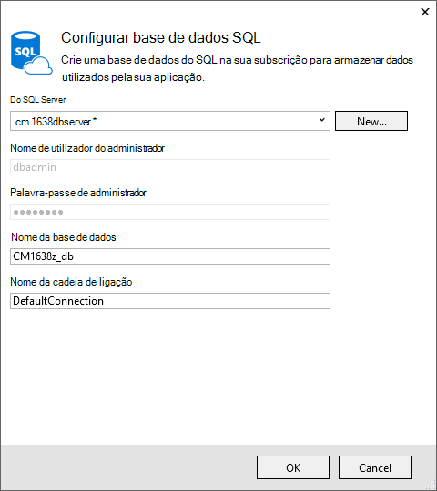
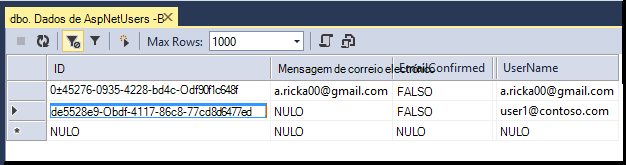

<properties 
    pageTitle="Criar uma aplicação do ASP.NET MVC com auth e DB do SQL e implementar a aplicação de serviço do Azure" 
    description="Saiba como desenvolver uma aplicação do ASP.NET MVC 5 com uma base de dados SQL back-end, adicionar autenticação e autorização e implemente-o Azure." 
    services="app-service\web" 
    documentationCenter=".net" 
    authors="Rick-Anderson" 
    writer="Rick-Anderson" 
    manager="wpickett" 
    editor=""/>

<tags 
    ms.service="app-service-web" 
    ms.workload="web" 
    ms.tgt_pltfrm="na" 
    ms.devlang="dotnet" 
    ms.topic="article" 
    ms.date="03/21/2016" 
    ms.author="riande"/> 

# Criar uma aplicação do ASP.NET MVC com auth e DB do SQL e implementar a aplicação de serviço do Azure

Este tutorial mostra como criar uma aplicação de web do ASP.NET MVC 5 segura que permite aos utilizadores iniciarem com as credenciais do Facebook ou Google. A aplicação é uma lista de contactos simple que utiliza a arquitetura de entidade ADO.NET de acesso de base de dados. Irá implementar a aplicação para a [Aplicação de serviço de Azure](http://go.microsoft.com/fwlink/?LinkId=529714). 

Em a concluir o tutorial, terá de uma aplicação web condicionados por dados segura para cima e em execução na nuvem e utilizar uma base de dados na nuvem. A ilustração seguinte mostra a página de início de sessão para a aplicação completa.

![página de início de sessão][rxb]

Que vai aprender:

* Como criar um projeto de web do ASP.NET MVC 5 seguro no Visual Studio.
* Como autenticar e autorizar utilizadores que iniciem sessão com as credenciais das respetivas contas Google ou do Facebook (autenticação do fornecedor de rede social utilizando [OAuth 2.0](http://oauth.net/2 "http://oauth.net/2")).
* Como autenticar e autorizar utilizadores que registe-se numa base de dados gerida pela aplicação (local autenticação utilizando a [Identidade do ASP.NET](http://asp.net/identity/)).
* Como utilizar o ADO.NET entidade Framework 6 código primeiro para ler e escrever dados numa base de dados SQL.
* Como utilizar entidade Framework código primeiro migrações para implementar uma base de dados.
* Como armazenar dados relacionais na nuvem ao utilizar a base de dados do SQL Azure.
* Como implementar um projecto da web que utiliza uma base de dados para uma [aplicação web](http://go.microsoft.com/fwlink/?LinkId=529714) na aplicação de serviço de Azure.

>[AZURE.NOTE] Este é um tutorial longo. Se pretender que uma breve introdução a aplicação de serviço de Azure e o Visual Studio projetos web, consulte o artigo [criar uma aplicação web do ASP.NET na aplicação de serviço de Azure](web-sites-dotnet-get-started.md). Para informações de resolução de problemas, consulte a secção de [resolução de problemas](#troubleshooting) .
>
>Ou, se pretender começar a aplicação de serviço de Azure antes de inscrever-se para uma conta do Azure, vá para o [Experimentar o serviço de aplicação](http://go.microsoft.com/fwlink/?LinkId=523751), onde imediatamente pode criar uma aplicação web do starter curto na aplicação de serviço. Sem cartões de crédito necessários; sem compromissos.

## Pré-requisitos

Para concluir este tutorial, é necessária uma conta do Microsoft Azure. Se não tiver uma conta, pode [Ativar os benefícios da sua Visual Studio subscritor](/pricing/member-offers/msdn-benefits-details/?WT.mc_id=A261C142F) ou [Inscrever-se para uma avaliação gratuita](/pricing/free-trial/?WT.mc_id=A261C142F).

Para configurar o seu ambiente de desenvolvimento, tem de instalar o [Visual Studio 2013 Update 5](http://go.microsoft.com/fwlink/?LinkId=390521) ou superior e a versão mais recente do [Azure SDK para .NET](http://go.microsoft.com/fwlink/?linkid=324322&clcid=0x409). Este artigo foi escrito para Visual Studio atualização 4 e SDK 2.8.1. As mesmas instruções funcionam para Visual Studio 2015 com o mais recente [Azure SDK para .NET](http://go.microsoft.com/fwlink/?linkid=518003&clcid=0x409) instalado, mas alguns ecrãs serão o aspeto diferentes das ilustrações.

## Criar uma aplicação do ASP.NET MVC 5

### Criar o projecto

1. No menu **ficheiro** , clique em **Novo projeto**.

    

1. Na caixa de diálogo **Novo projeto** , expanda **c#** e selecione **Web** em **Modelos instalados**e, em seguida, selecione a **Aplicação Web do ASP.NET**. Atribua um nome da aplicação **ContactManager**e, em seguida, clique em **OK**.

    
 
    **Nota:** Certifique-se de que introduzir "ContactManager". Blocos de código qual irá copiar mais tarde partem do pressuposto de que o nome do projeto é ContactManager. 

1. Na caixa de diálogo **Novo projeto de ASP.NET** , selecione o modelo **MVC** . Certifique-se de **autenticação** estiver definida para **Contas de utilizador Individual**, **anfitrião na nuvem** está selecionada e **Aplicação de serviço** está selecionada.

    

1. Clique em **OK**.

1. É apresentada a caixa de diálogo **Configurar Microsoft Azure definições do Web App** . Poderá ter de iniciar sessão, se ainda não o tiver feito, ou reintroduzir as suas credenciais, se tiver expirado o início de sessão.

1. Opcional - alterar o valor no **nome da aplicação Web** caixa (consulte imagem abaixo).

    O URL da aplicação web será {nome} .azurewebsites .net, para que o nome tem de ser exclusivo no domínio de azurewebsites.net. O Assistente de configuração sugere um nome exclusivo ao acrescentar um número para o nome do projeto "ContactManager", e que está bem formatado para este tutorial.

5. No **grupo de recursos** pendente selecione um grupo existente ou **Criar novo grupo de recursos**(ver imagem abaixo). 

    Se preferir, pode selecionar um grupo de recursos que já possui. Mas se criar um novo grupo de recursos e só utilizá-la para este tutorial, será mais fácil eliminar todos os recursos Azure que criou para o tutorial quando tiver terminado-los. Para obter informações sobre os grupos de recursos, consulte o artigo [Descrição geral do Gestor de recursos do Azure](../azure-resource-manager/resource-group-overview.md). 

5. No **plano de serviço de aplicação** selecione pendente selecione um plano existente ou **Criar nova aplicação de serviço plano**(consulte a imagem abaixo).

    Se preferir, pode selecionar um plano de serviço de aplicação que já possui. Para obter informações sobre os planos de aplicação de serviço, consulte o artigo [Descrição geral de aprofundada de planos do serviço de aplicação do Azure](../app-service/azure-web-sites-web-hosting-plans-in-depth-overview.md). 

1. Toque em **explorar serviços Azure adicionais** para adicionar uma base de dados do SQL.

    

1. Toque na **+** ícone para adicionar uma base de dados do SQL.

    

1. Toque em **Novo** na caixa de diálogo **Configurar base de dados do SQL** :

    

1. Introduza um nome para o administrador e uma palavra-passe segura.

    

    O nome do servidor tem de ser exclusivo. Pode conter letras minúsculas, dígitos numéricos e hífenes. Não pode conter um hífen à direita. O nome de utilizador e palavra-passe novas as credenciais estão que está a criar para o servidor de novo. 

    Se já tiver um servidor de base de dados, pode selecionar que em vez de criar uma. Os servidores de base de dados são um recurso preciosas e pretende geralmente criar várias bases de dados no mesmo servidor para testar e desenvolvimento em vez de criar um servidor de base de dados por bases de dados. No entanto, este tutorial apenas terá do servidor temporariamente e através da criação do servidor no mesmo grupo de recursos, como o web site torna mais fácil eliminar ambos os recursos da aplicação e base de dados web ao eliminar o grupo de recursos quando tiver terminado o tutorial. 

    Se selecionar um servidor de base de dados existente, certifique-se do web app e o seu base de dados estão na mesma região.

    

4. Toque em **Criar**.

    Visual Studio cria o projecto da web ContactManager, cria o grupo de recursos e o plano de serviço de aplicação que especificou, e cria uma aplicação web na aplicação de serviço de Azure com o nome que especificou.

### Definir o cabeçalho da página e o rodapé

1. No **Explorador de solução** abra o ficheiro *Layout.cshtml* na pasta *Views\Shared* .

    ![_Layout.cshtml no Explorador de soluções][newapp004]

1. Substitua ActionLink no ficheiro *Layout.cshtml* o código seguinte.

    @Html.ActionLink("CMDemonstração","Indexar","Contactos", nova {área =" "}, a nova funcionalidade { @class ="barra de navegação a marca"})
                   

    Certifique-se de que altera o terceiro parâmetro de "Base" para "Contactos". A marcação acima irá criar uma ligação de "Contactos" em cada página para o método de índice remissivo do controlador de contactos. Altere o nome da aplicação no cabeçalho e o rodapé "Minha aplicação do ASP.NET" e "Nome da aplicação" para "Contact Manager" e "CM demonstração". 
 
### Executar a aplicação localmente

1. Prima CTRL + F5 para executar a aplicação.

    A home page da aplicação apresentada no browser predefinido.

    

Este é tudo o que precisa de fazer por agora criar a aplicação que irá implementar Azure. 

## Implementar a aplicação para Azure

1. No Visual Studio, com o botão direito do projecto no **Explorador de soluções** e selecione **Publicar** no menu de contexto.

    
    
    O Assistente de **Publicar Web** abre.

1. Na caixa de diálogo **Publicar Web** , clique em **Publicar**.

    

    Está a ser executado a aplicação que criou na nuvem. Da próxima vez que implementa a aplicação, apenas os ficheiros (novos ou alterados) serão implementados.

    

## Activar o SSL para o projeto ##

1. No **Explorador de soluções**, clique no projeto **ContactManager** , em seguida, clique em F4 para abrir a janela de **Propriedades** .

3. Altere o **SSL ativado** para **True**. 

4. Copie o **URL de SSL**.

    O URL de SSL será https://localhost:44300 /, a menos que criou anteriormente SSL web apps.

    ![activar o SSL][rxSSL]
 
1. No **Explorador de soluções**, clique com o botão direito do rato em projeto **Contact Manager** e clique em **Propriedades**.

1. Clique no separador **Web** .

1. Altere o **Url do Project** para utilizar o **URL de SSL** e guarde a página (S controlo).

    
 
1. Certifique-se de que o Internet Explorer é o browser que inicia o Visual Studio, conforme mostrado na imagem abaixo:

    

    Selector de browser permite-lhe especificar o browser que inicia o Visual Studio. Pode selecionar vários browsers e tiver o Visual Studio atualizar cada browser quando efetuar alterações. Para obter mais informações, consulte [Utilizar a ligação de Browser no Visual Studio 2013](http://www.asp.net/visual-studio/overview/2013/using-browser-link).

    

1. Prima CTRL + F5 para executar a aplicação. Clique em **Sim** para iniciar o processo de confiar no certificado autoassinado que IIS Express gerou.

     

1. Leia a caixa de diálogo de **Aviso de segurança** e, em seguida, clique em **Sim** se pretender instalar o certificado que representa **localhost**.

    

1. IE mostra a *Home* page do e não existem avisos SSL.

     

     Internet Explorer é uma boa escolha quando estiver a utilizar SSL porque aceita o certificado e mostra HTTPS conteúdo sem um aviso. Microsoft Edge e o Google Chrome também aceitam o certificado. Firefox utiliza os suas próprias arquivo de certificados, por isso, é-lhe apresentado um aviso.

     

## Adicionar uma base de dados para a aplicação

Em seguida, irá atualizar a aplicação para adicionar a capacidade de apresentar e actualizar contactos e armazenar os dados numa base de dados. A aplicação irá utilizar o quadro de entidade (EF) para criar a base de dados e para ler e atualizar os dados.

### Adicionar classes de modelo de dados para os contactos

Comece por criar um modelo de dados simples no código.

1. No **Explorador de soluções**, com o botão direito na pasta Modelos, clique em **Adicionar**e, em seguida, **escolares**.

    

2. Na caixa de diálogo **Adicionar Novo Item** , o nome do ficheiro de classe *Contact.cs*novo e, em seguida, clique em **Adicionar**.

    ![Adicionar a caixa de diálogo Novo Item][adddb002]

3. Substitua o conteúdo do ficheiro Contact.cs com o código seguinte.

        using System.ComponentModel.DataAnnotations;
        using System.Globalization;
        namespace ContactManager.Models
        {
            public class Contact
            {
                public int ContactId { get; set; }
                public string Name { get; set; }
                public string Address { get; set; }
                public string City { get; set; }
                public string State { get; set; }
                public string Zip { get; set; }
                [DataType(DataType.EmailAddress)]
                public string Email { get; set; }
            }
        }
A classe **de contacto** define os dados que irá guardar para cada contacto, bem como uma chave primária, *contacto*, que é necessário para a base de dados.

### Criar páginas web que permitem aos utilizadores da aplicação trabalhar com os contactos

A funcionalidade de andaimes ASP.NET MVC automaticamente pode gerar código que efetua criar, ler, atualizar e eliminar (CRUD) acções. 

1. Crie o projecto **(Ctrl + Shift + B)**. (Tem de criar o projecto antes de utilizar o mecanismo andaimes.)
 
1. No **Explorador de soluções**, com o botão direito na pasta de controladores e clique em **Adicionar**e, em seguida, clique em **controlador de**.

    ![Adicionar controlador no menu de contexto de pasta controladores][addcode001]

5. Na caixa de diálogo **Adicionar Scaffold** , selecione o **Controlador de 5 MVC com vistas, através de EF** e, em seguida, clique em **Adicionar**.
    
    

1. Na caixa de lista pendente de **classe do modelo** , selecione **o contacto (ContactManager.Models)**. (Consulte a imagem abaixo).

1. A **classe de contexto de dados**, selecione **ApplicationDbContext (ContactManager.Models)**. O **ApplicationDbContext** será utilizada para a associação DB e os nossos dados de contacto.

    

1. Clique em **Adicionar**.

   Visual Studio cria um controlador com métodos e vistas para operações de base de dados CRUD para objetos de **contacto** .

## Activar migrações, criar a base de dados, adicionar dados de exemplo e um inicializador de dados ##

A tarefa seguinte é ativar a funcionalidade de [Migrações primeiro código](http://msdn.microsoft.com/library/hh770484.aspx) para criar tabelas de base de dados com base no modelo de dados que criou.

1. No menu **Ferramentas** , selecione **O Gestor de pacotes NuGet** e, em seguida, **Consola do Gestor de pacote**.

    

2. Na janela da **Consola do Gestor de pacote** , introduza o seguinte comando:

        enable-migrations

    O comando **Ativar migrações** cria uma pasta de *migrações* e coloca nessa pasta um ficheiro de *Configuration.cs* que pode editar para propagar a base de dados e configurar migrações. 

2. Na janela da **Consola do Gestor de pacote** , introduza o seguinte comando:

        add-migration Initial

    O comando de **migração adicionar inicial** gera num ficheiro denominado ** &lt;date_stamp&gt;inicial** na pasta *migrações* . O código neste ficheiro cria as tabelas de base de dados. O primeiro parâmetro ( **inicial** ) é utilizado para criar o nome do ficheiro. Pode ver os novos ficheiros de classe no **Explorador de soluções**.

    Na classe **inicial** , o método **para cima** cria a tabela de contactos e o método **para baixo** (utilizado quando pretender regressar ao estado anterior) coloca-lo.

3. Abra o ficheiro *Migrations\Configuration.cs* . 

4. Adicione o seguinte `using` declaração. 

         using ContactManager.Models;

5. Substitua o método de *propagação* com o seguinte código:

        protected override void Seed(ContactManager.Models.ApplicationDbContext context)
        {
            context.Contacts.AddOrUpdate(p => p.Name,
               new Contact
               {
                   Name = "Debra Garcia",
                   Address = "1234 Main St",
                   City = "Redmond",
                   State = "WA",
                   Zip = "10999",
                   Email = "debra@example.com",
               },
                new Contact
                {
                    Name = "Thorsten Weinrich",
                    Address = "5678 1st Ave W",
                    City = "Redmond",
                    State = "WA",
                    Zip = "10999",
                    Email = "thorsten@example.com",
                },
                new Contact
                {
                    Name = "Yuhong Li",
                    Address = "9012 State st",
                    City = "Redmond",
                    State = "WA",
                    Zip = "10999",
                    Email = "yuhong@example.com",
                },
                new Contact
                {
                    Name = "Jon Orton",
                    Address = "3456 Maple St",
                    City = "Redmond",
                    State = "WA",
                    Zip = "10999",
                    Email = "jon@example.com",
                },
                new Contact
                {
                    Name = "Diliana Alexieva-Bosseva",
                    Address = "7890 2nd Ave E",
                    City = "Redmond",
                    State = "WA",
                    Zip = "10999",
                    Email = "diliana@example.com",
                }
                );
        }

    Este código inicializado (sementes) a base de dados com informações de contacto. Para mais informações sobre propagar a base de dados, consulte o artigo [Seeding e DBs depuração entidade Framework (EF)](http://blogs.msdn.com/b/rickandy/archive/2013/02/12/seeding-and-debugging-entity-framework-ef-dbs.aspx). Crie o projecto para verificar que não existem erros compilação.

6. Na **Consola do Gestor de pacote** , introduza o comando:

        update-database

    ![Comandos de consola do Gestor de pacote][addcode009]

    A **base de dados de atualização** é executada a primeira migração que cria a base de dados. Por predefinição, a base de dados é criado como uma base de dados do SQL Server Express LocalDB. 

7. Prima CTRL + F5 para executar a aplicação e, em seguida, clique na ligação de **Demonstração CM** ; ou navegue até ao https://localhost:(port#)/Cm. 

    A aplicação que mostram os dados de propagação e fornece ligações de edição, detalhes e eliminar. Pode criar, editar, eliminar e visualizar dados.

    ![Vista MVC dos dados][rx2]

## Adicionar um fornecedor de oauth2 ainda

>[AZURE.NOTE] Para obter instruções detalhadas sobre como utilizar os Google e Facebook programador sites de portal, este tutorial ligações a tutoriais no site do ASP.NET. No entanto, Google e Facebook alterar os seus sites com maior frequência desses tutoriais são atualizados e estão agora Desatualizadas. Se tiver problemas em seguir as instruções, consulte o comentário Disqus em destaque no final deste tutorial para uma lista do que mudou. 

[OAuth] (http://oauth.net/ "http://OAuth.NET/") é um protocolo aberto que lhe permite autorização segura num método simples e padrão a partir de aplicações web, de ambiente de trabalho e móvel. O modelo de internet ASP.NET MVC utiliza OAuth para expor Facebook, Twitter, Google e Microsoft como fornecedores de autenticação. Apesar deste tutorial utiliza apenas Google, como o fornecedor de autenticação, pode facilmente modificar o código para utilizar qualquer um destes fornecedores. Os passos para implementar a outros fornecedores são muito semelhantes aos passos, que consulte o artigo neste tutorial. Para utilizar o Facebook como um fornecedor de autenticação, consulte o artigo [MVC 5 aplicação com o Facebook, Twitter, LinkedIn e Sign-on oauth2 ainda do Google ](http://www.asp.net/mvc/tutorials/mvc-5/create-an-aspnet-mvc-5-app-with-facebook-and-google-oauth2-and-openid-sign-on).

Para além de autenticação, este tutorial utiliza funções para implementar autorização. Apenas aos utilizadores que adicionar à função *canEdit* são possível alterar dados (ou seja, criar, editar ou eliminar contactos).

1. Siga as instruções na [Aplicação de 5 MVC com Facebook, Twitter, LinkedIn e oauth2 ainda do Google Sign-on](http://www.asp.net/mvc/tutorials/mvc-5/create-an-aspnet-mvc-5-app-with-facebook-and-google-oauth2-and-openid-sign-on#goog) em **criar uma aplicação do Google para OAuth 2 configurar uma aplicação do Google para oauth2 ainda**.

3. Executar e testar a aplicação para verificar que pode iniciar sessão utilizando a autenticação do Google.

2. Se pretender criar botões de início de sessão sociais com os ícones do específicas do fornecedor, consulte o artigo [botões de início de sessão muito social para ASP.NET MVC 5](http://www.jerriepelser.com/blog/pretty-social-login-buttons-for-asp-net-mvc-5)

## Utilizar a API de associação

Nesta secção irá adicionar um utilizador local e a função de *canEdit* à base de dados de associação. Apenas os utilizadores na função *canEdit* poderão editar dados. Prática recomendada é a funções de nome por ações que poderem efetuar, pelo que *canEdit* é preferido através de uma função chamada *admin*. Quando a aplicação evolução deste, pode adicionar novas funções como *canDeleteMembers* em vez do menor descritivo *superAdmin*.

1. Abra o ficheiro *migrations\configuration.cs* e adicione o seguinte `using` declarações:

        using Microsoft.AspNet.Identity;
        using Microsoft.AspNet.Identity.EntityFramework;

1. Adicione o seguinte método de **AddUserAndRole** para a classe de:

        bool AddUserAndRole(ContactManager.Models.ApplicationDbContext context)
        {
            IdentityResult ir;
            var rm = new RoleManager<IdentityRole>
                (new RoleStore<IdentityRole>(context));
            ir = rm.Create(new IdentityRole("canEdit"));
            var um = new UserManager<ApplicationUser>(
                new UserStore<ApplicationUser>(context));
            var user = new ApplicationUser()
            {
                UserName = "user1@contoso.com",
            };
            ir = um.Create(user, "P_assw0rd1");
            if (ir.Succeeded == false)
                return ir.Succeeded;
            ir = um.AddToRole(user.Id, "canEdit");
            return ir.Succeeded;
        }

1. Ligar para o novo método do método de **propagação** de:

        protected override void Seed(ContactManager.Models.ApplicationDbContext context)
        {
            AddUserAndRole(context);
            context.Contacts.AddOrUpdate(p => p.Name,
                // Code removed for brevity
        }

    As seguintes imagens mostra as alterações efetuadas a *propagação* método:

    

    Este código cria uma nova função, denominada *canEdit*, cria um novo utilizador local *user1@contoso.com*e adiciona *user1@contoso.com* à função *canEdit* . Para obter mais informações, consulte a [Tutoriais de identidade do ASP.NET](http://www.asp.net/identity/overview/features-api) no site do ASP.NET.

## Utilize código temporária para adicionar novos utilizadores de início de sessão de rede Social para a função canEdit  ##

Nesta secção irá de modificar temporariamente o método de **ExternalLoginConfirmation** no controlador de conta para adicionar novos utilizadores se ter registado com um fornecedor de OAuth à função *canEdit* . Vamos Espero fornecer uma ferramenta semelhante ao [WSAT](http://msdn.microsoft.com/library/ms228053.aspx) no futuro que permite-lhe criar e editar contas de utilizador e funções. Até lá, que pode efetuar a mesma função utilizando código temporário.

1. Abra o ficheiro **Controllers\AccountController.cs** e navegue para o método de **ExternalLoginConfirmation** .

1. Adicione a chamada seguinte para **AddToRoleAsync** apenas antes das chamadas de **SignInAsync** .

        await UserManager.AddToRoleAsync(user.Id, "canEdit");

   O código acima adiciona o utilizador recentemente registado para a função de "canEdit", que dá-lhes acesso aos métodos de ação que alterar dados (editar). O fragmento que se segue mostra a nova linha de código no contexto.

          // POST: /Account/ExternalLoginConfirmation
          [HttpPost]
          [AllowAnonymous]
          [ValidateAntiForgeryToken]
          public async Task ExternalLoginConfirmation(ExternalLoginConfirmationViewModel model, string returnUrl)
          {
             if (User.Identity.IsAuthenticated)
             {
                return RedirectToAction("Index", "Manage");
             }
             if (ModelState.IsValid)
             {
                // Get the information about the user from the external login provider
                var info = await AuthenticationManager.GetExternalLoginInfoAsync();
                if (info == null)
                {
                   return View("ExternalLoginFailure");
                }
                var user = new ApplicationUser { UserName = model.Email, Email = model.Email };
                var result = await UserManager.CreateAsync(user);
                if (result.Succeeded)
                {
                   result = await UserManager.AddLoginAsync(user.Id, info.Login);
                   if (result.Succeeded)
                   {
                      await UserManager.AddToRoleAsync(user.Id, "canEdit");
                      await SignInManager.SignInAsync(user, isPersistent: false, rememberBrowser: false);
                      return RedirectToLocal(returnUrl);
                   }
                }
                AddErrors(result);
             }
             ViewBag.ReturnUrl = returnUrl;
             return View(model);
          }

Mais tarde no tutorial irá implementar a aplicação para Azure, onde que irá iniciar sessão com o Google ou noutro fornecedor de autenticação de terceiros. Isto irá adicionar a sua conta recentemente registada para a função *canEdit* . Qualquer pessoa que localiza URL do web app e tem um ID do Google, em seguida, pode registar e atualizar a sua base de dados. Para impedir que outras pessoas fazê-lo, pode deixar o site. Poderá verificar quem está na função *canEdit* por examinar a base de dados.

Na **Consola do Gestor de pacote** visitas a tecla de seta para cima para ativar o seguinte comando:

        Update-Database

O comando de **Base de dados de atualização** é executado o método de **propagação** , e que executa o método de **AddUserAndRole** que adicionou anteriormente. O método de **AddUserAndRole** cria o utilizador *user1@contoso.com* e adiciona-lhe à função *canEdit* .

## Proteger a aplicação com SSL e o atributo autorizar ##

Nesta secção aplicar o atributo [autorizar](http://msdn.microsoft.com/library/system.web.mvc.authorizeattribute.aspx) restringir o acesso dos métodos de ação. Os utilizadores anónimos poderão ver apenas o método de ação de **índice remissivo** do controlador de casa. Os utilizadores registados poderão ver dados de contactos (as páginas **índice** e **Detalhes** do controlador de Cm), página acerca e página de contacto. Apenas os utilizadores na função *canEdit* poderão métodos de ação de acesso que alterar os dados.

1. Abra o ficheiro *App_Start\FilterConfig.cs* e substituir o método de *RegisterGlobalFilters* com o seguinte (que adiciona os dois filtros):

        public static void RegisterGlobalFilters(GlobalFilterCollection filters)
        {
            filters.Add(new HandleErrorAttribute());
            filters.Add(new System.Web.Mvc.AuthorizeAttribute());
            filters.Add(new RequireHttpsAttribute());
        }
        
    Este código adiciona o filtro de [autorizar](http://msdn.microsoft.com/library/system.web.mvc.authorizeattribute.aspx) e o filtro [RequireHttps](http://msdn.microsoft.com/library/system.web.mvc.requirehttpsattribute.aspx) para a aplicação. O filtro de [autorizar](http://msdn.microsoft.com/library/system.web.mvc.authorizeattribute.aspx) impede os utilizadores anónimos de aceder a qualquer métodos na aplicação. Que irá utilizar o atributo [AllowAnonymous](http://blogs.msdn.com/b/rickandy/archive/2012/03/23/securing-your-asp-net-mvc-4-app-and-the-new-allowanonymous-attribute.aspx) para optar por terminar o requisito de autorização em alguns métodos, para que os utilizadores anónimos podem iniciar sessão e podem ver a home page. O [RequireHttps](http://msdn.microsoft.com/library/system.web.mvc.requirehttpsattribute.aspx) requer que todo o acesso do web app através de HTTPS.

    Uma abordagem alternativa é para adicionar o atributo [autorizar](http://msdn.microsoft.com/library/system.web.mvc.authorizeattribute.aspx) e o atributo [RequireHttps](http://msdn.microsoft.com/library/system.web.mvc.requirehttpsattribute.aspx) para cada controlador, mas é considerada uma segurança melhor prática aplicam-se para a aplicação completa. Ao adicionar globalmente, cada novo método de controlador e ação que adicionar automaticamente está protegido – não precisa de se lembrar de aplicá-los. Para obter mais informações consulte [proteger a sua aplicação de MVC do ASP.NET e o novo atributo AllowAnonymous](http://blogs.msdn.com/b/rickandy/archive/2012/03/23/securing-your-asp-net-mvc-4-app-and-the-new-allowanonymous-attribute.aspx). 

1. Adicione o atributo [AllowAnonymous](http://blogs.msdn.com/b/rickandy/archive/2012/03/23/securing-your-asp-net-mvc-4-app-and-the-new-allowanonymous-attribute.aspx) para o método de **índice remissivo** do controlador de base. O atributo [AllowAnonymous](http://blogs.msdn.com/b/rickandy/archive/2012/03/23/securing-your-asp-net-mvc-4-app-and-the-new-allowanonymous-attribute.aspx) permite-lhe à lista de branco os métodos que pretende optar por terminar autorização. 

        public class HomeController : Controller
        {
          [AllowAnonymous]
          public ActionResult Index()
          {
             return View();
          }

    Se fizer uma pesquisa global para *AllowAnonymous*, verá que é utilizado nos métodos de início de sessão e registo do controlador de conta.

1. Na *CmController.cs*, adicione `[Authorize(Roles = "canEdit")]` os métodos de HttpGet e HttpPost alterar dados (criar, editar, eliminar, cada método de ação, exceto o índice e detalhes) no controlador de *Cm* . Uma parte do código concluída é mostrada abaixo: 

        // GET: Cm/Create
        [Authorize(Roles = "canEdit")]
        public ActionResult Create()
        {
           return View(new Contact { Address = "123 N 456 W",
            City="Great Falls", Email = "ab@cd.com", Name="Joe Smith", State="MT",
           Zip = "59405"});
        }
        // POST: Cm/Create
        // To protect from overposting attacks, please enable the specific properties you want to bind to, for 
        // more details see http://go.microsoft.com/fwlink/?LinkId=317598.
        [HttpPost]
        [ValidateAntiForgeryToken]
         [Authorize(Roles = "canEdit")]
        public ActionResult Create([Bind(Include = "ContactId,Name,Address,City,State,Zip,Email")] Contact contact)
        {
            if (ModelState.IsValid)
            {
                db.Contacts.Add(contact);
                db.SaveChanges();
                return RedirectToAction("Index");
            }
            return View(contact);
        }
        // GET: Cm/Edit/5
        [Authorize(Roles = "canEdit")]
        public ActionResult Edit(int? id)
        {
            if (id == null)
            {
                return new HttpStatusCodeResult(HttpStatusCode.BadRequest);
            }
            Contact contact = db.Contacts.Find(id);
            if (contact == null)
            {
                return HttpNotFound();
            }
            return View(contact);
        }
        
1. Prima CTRL + F5 para executar a aplicação.

1. Se ainda iniciou a partir de uma sessão anterior, clicar na ligação **Terminar sessão** .

1. Clique no **sobre** ou **contacto** em ligações. São redirecionado para a página de início de sessão dado que os utilizadores anónimos não é possível ver essas páginas.

1. Clique na ligação **Registe-se como um novo utilizador** e adicionar um utilizador local com o e-mail *joe@contoso.com*. Verifique se *João* pode ver a home page, cerca e páginas de contacto. 

    

1. Clique na ligação de *Demonstração CM* e certifique-se de que está a ver os dados.

1. Clique numa ligação de edição na página, serão redirecionados para a página de início de sessão (uma vez que um novo utilizador local não é adicionado à função *canEdit* ).

1. Inicie sessão como *user1@contoso.com* com palavra-passe de "P_assw0rd1" (a "0" em "word" é um zero). Ser redirecionado para a página Editar seleccionado anteriormente. 
2. 

    Se não consegue iniciar sessão com a essa conta e a palavra-passe, experimente copiar a palavra-passe a partir do código de origem e colá-lo. Se ainda não consigo iniciar, selecione a coluna **nome de utilizador** da tabela **AspNetUsers** para verificar *user1@contoso.com* foi adicionada. 

1. Certifique-se de que pode efetuar alterações aos dados.

## Implementar a aplicação em Azure

1. No Visual Studio, com o botão direito do projecto no **Explorador de soluções** e selecione **Publicar** no menu de contexto.

    ![Publicar no menu de contexto do projeto][firsdeploy003]

    O Assistente de **Publicar Web** abre.

1. Clique no separador **Definições** no lado esquerdo da caixa de diálogo **Publicar Web** . 

2. Em **ApplicationDbContext** selecione a base de dados que criou quando criou o projeto.
   

1. Em **ContactManagerContext**, selecione **Executar primeiro migrações de código**.

    

1. Clique em **Publicar**.

1. Inicie sessão como *user1@contoso.com* (com palavra-passe de "P_assw0rd1") e verifique se pode editar os dados.

1. Termine a sessão.

1. Aceda à [Consola de programadores do Google](https://console.developers.google.com/) e sobre a atualização de separador de **credenciais** o redirecionamento URIS e JavaScript Orgins para utilizar o URL do Azure.

1. Inicie sessão com o Google ou do Facebook. Que irá adicionar a conta Google ou do Facebook à função **canEdit** . Se obtiver um erro de HTTP 400 com a mensagem *o redirecionamento URI no pedido de: https://contactmanager {meu version}.azurewebsites.net/signin-google não corresponde um redirecionamento registado URI.*, terá de esperar até que as alterações que efetuou são propagadas. Se receber este erro depois de mais de alguns minutos, verifique o URIs estão corretas.

### Parar a aplicação web para impedir que outras pessoas de registo  

1. No **Explorador do servidor**, navegue para **Azure > aplicação de serviço > {seu grupo de recursos} > {a aplicação web do}**.

4. Com o botão direito do web app e selecione **Parar**. 

    Em alternativa, a partir do [Portal do Azure](https://portal.azure.com/), pode ir para pá do web app, em seguida, clique no ícone **Parar** no topo da pá.

    

### Remover AddToRoleAsync, publicar e testar

1. Comentar ou remover o seguinte código do método de **ExternalLoginConfirmation** no controlador de conta:

        await UserManager.AddToRoleAsync(user.Id, "canEdit");

1. Crie o projecto (que guarda as alterações de ficheiro e verifica se que não tiver algum erro compilação).

5. Com o botão direito do projecto no **Explorador de soluções** e selecione **Publicar**.

       
    
4. Clique no botão **Começar a pré-visualização** . Apenas os ficheiros que precisam de ser atualizados são implementados.

5. Inicie a aplicação web do Visual Studio ou a partir do Portal. **Não será possível publicar enquanto a aplicação web está parada**.

    

5. Volte para Visual Studio e clique em **Publicar**.

3. A aplicação do Azure é aberta no browser predefinido. Se tem sessão iniciada, termine para que possa ver a home page como um utilizador anónimo.  

4. Clique na ligação **sobre** . Será redirecionado para o registo na página.

5. Clique na ligação **Registe-se** no registo na página e criar conta local. Irá utilizamos esta conta local para verificar que pode aceder a páginas só de leitura mas não é possível aceder páginas que alterar dados (o que são protegidos pela função *canEdit* ). Mais tarde no tutorial removerá acesso a uma conta local. 

    

1. Certifique-se de que pode navegar para as páginas *sobre* e *contacto* .

    

1. Clique na ligação **CM demonstração** para navegar para o controlador de **Cm** . Em alternativa, pode acrescentar *Cm* para o URL. 

    
 
1. Clique numa ligação de edição. 

    Ser redirecionado para a página de início de sessão. 

2. Em **utilizar outro serviço de iniciar sessão no**, clique em Google ou Facebook e inicie sessão com a conta anteriormente registado. (Se estiver a trabalhar rapidamente e não foi excedido o seu cookie sessão, que irão ser automaticamente tem sessão iniciada com a conta Google ou do Facebook que utilizou anteriormente.)

2. Certifique-se de que pode editar dados enquanto tinha sessão iniciada para essa conta.

    **Nota:** Que não é possível terminar sessão Google a partir desta aplicação e inicie sessão para uma conta do google diferente com o mesmo browser. Se estiver a utilizar um browser, terá de navegar para o Google e termine a sessão. Pode iniciar sessão com outra conta a partir do mesmo autenticador de terceiros (como Google) utilizando um browser diferente.

    Se não tiverem preenchido primeiro e último nome das suas informações de conta do Google, irá ocorrer uma NullReferenceException.

## Examinar a SQL Azure DB ##

1. No **Explorador do servidor**, navegue para **Azure > bases de dados SQL > {a base de dados}**

2. Clique com o botão direito do rato em sua base de dados e, em seguida, selecione **Abrir no Explorador de objeto do SQL Server**.
 
    
 
3. Se ainda não tiver ligado anteriormente a esta base de dados, poderá ser-lhe pedido para adicionar uma regra de firewall para ativar o acesso ao seu endereço de IP atual. O endereço IP serão previamente preenchido. Basta clicar em **Adicionar regra de Firewall** para permitir o acesso.

    

3. Inicie sessão na base de dados com o nome de utilizador e palavra-passe que especificou quando criou o servidor de base de dados. 
 
1. Clique com o botão direito do rato em tabela **AspNetUsers** e selecione a **Vista de dados**.

    
 
1. Tenha em atenção o Id da conta Google registado com a estar a função **canEdit** e o Id do *user1@contoso.com*. Estes devem ser os únicos utilizadores na função **canEdit** . (Confirmará que no próximo passo.)

    
 
2. No **Explorador de objeto do SQL Server**, clique com o botão direito do rato no **AspNetUserRoles** e selecione a **Vista de dados**.

    
 
3. Certifique-se de que o **ID de utilizador** é proveniente de *user1@contoso.com* e a conta do Google se registou. 

## Resolução de problemas

Se deparado com problemas, eis algumas sugestões sobre o que fazer.

* Erros de aprovisionamento SQL de base de dados - Certifique-se de que tem o SDK atual instalado. As versões antes 2.8.1 têm um erro em alguns cenários que faz com que erros quando tenta VS criar o servidor de base de dados ou a base de dados.
* Mensagem de erro "operação não é suportada para o seu tipo de oferta de subscrição" quando criar os recursos Azure - igual acima.
* Erros ao implementar - considere passam pelo artigo de [implementação do ASP.NET básica](web-sites-dotnet-get-started.md) . Que cenário de implementação é mais simples e se tiver o mesmo problema-poderá ser mais fácil identificar. Por exemplo, em alguns ambientes enterprise uma firewall da empresa pode impedir que Web implementar façam tipos de ligações de para Azure, é necessário.
* Não existe uma opção para selecionar cadeia de ligação no Assistente de Web publicar quando implementar - se de que utilizou um método diferente para criar os recursos do Azure (por exemplo, que está a tentar implementar uma aplicação web e uma base de dados do SQL criada no Portal do), a base de dados do SQL não pode ser associada com a aplicação web. É a solução mais fácil criar uma nova aplicação web e a base de dados com VS conforme mostrado no tutorial. Não tem de iniciar o tutorial sobre – no Assistente de publicar Web pode optar por criar uma nova aplicação web e obtém a mesma recurso Azure criação caixa de diálogo que obtém quando cria o projeto.
* Instruções para o portal de programador do Google ou do Facebook são Desatualizadas - ver o comentário Disqus em destaque no final deste tutorial.

## Próximos passos

Criou uma aplicação de web do ASP.NET MVC básica autentica os utilizadores. Para obter mais informações sobre tarefas comuns de autenticação e como manter os dados sensíveis a maiúsculas e segura, consulte os seguintes tutoriais.

- [Criar uma aplicação de web do ASP.NET MVC 5 segura com de início de sessão, repor de confirmação e palavra-passe de e-mail](http://www.asp.net/mvc/overview/getting-started/create-an-aspnet-mvc-5-web-app-with-email-confirmation-and-password-reset)
- [Aplicação do ASP.NET MVC 5 com SMS e e-mail autenticação de dois fatores](http://www.asp.net/mvc/overview/getting-started/aspnet-mvc-5-app-with-sms-and-email-two-factor-authentication)
- [Melhores práticas para implementar palavras-passe e outros dados confidenciais ASP.NET e Azure](http://www.asp.net/identity/overview/features-api/best-practices-for-deploying-passwords-and-other-sensitive-data-to-aspnet-and-azure) 
- [Criar uma aplicação do ASP.NET MVC 5 com Facebook e a oauth2 ainda do Google](http://www.asp.net/mvc/tutorials/mvc-5/create-an-aspnet-mvc-5-app-with-facebook-and-google-oauth2-and-openid-sign-on ) Isto inclui instruções sobre como adicionar dados de perfil para o registo de utilizador DB e para obter instruções detalhadas sobre a utilização do Facebook como um fornecedor de autenticação.
- [Introdução ao ASP.NET MVC 5](http://www.asp.net/mvc/tutorials/mvc-5/introduction/getting-started)

Para obter um tutorial mais avançado sobre como utilizar o quadro entidade, consulte o artigo [Introdução ao EF e MVC](http://www.asp.net/mvc/tutorials/getting-started-with-ef-using-mvc/creating-an-entity-framework-data-model-for-an-asp-net-mvc-application).

Neste tutorial foi escrito por [Rick Almeida](http://blogs.msdn.com/b/rickandy/) (Twitter [@RickAndMSFT](https://twitter.com/RickAndMSFT)) com a assistência a partir do Rui Daniel e Dorrans Bruno (Twitter [@blowdart](https://twitter.com/blowdart)). 

***Please deixar comentários*** sobre o que colocou um gosto ou o que pretender para ver melhorado, não só sobre o tutorial propriamente dito, mas também sobre os produtos que demonstrará-lo. Os seus comentários irão ajude-na atribuir prioridades a melhorias. Também pode pedir e votar nas novos tópicos [Mostrar-Me como com o](http://aspnet.uservoice.com/forums/228522-show-me-how-with-code)código.

## O que é alterado

* Para um guia para a alteração de Web sites para a aplicação de serviço Consulte o artigo: [aplicação de serviço de Azure e respectivo impacto na existente dos serviços do Azure](http://go.microsoft.com/fwlink/?LinkId=529714)

<!-- bookmarks -->
[Add an OAuth Provider]: #addOauth
[Using the Membership API]:#mbrDB
[Create a Data Deployment Script]:#ppd
[Update the Membership Database]:#ppd2

[setupwindowsazureenv]: #bkmk_setupwindowsazure
[createapplication]: #bkmk_createmvc4app
[deployapp1]: #bkmk_deploytowindowsazure1
[deployapp11]: #bkmk_deploytowindowsazure11
[adddb]: #bkmk_addadatabase

<!-- images-->
[rx2]: ./media/web-sites-dotnet-deploy-aspnet-mvc-app-membership-oauth-sql-database/rx2.png

[rx5]: ./media/web-sites-dotnet-deploy-aspnet-mvc-app-membership-oauth-sql-database-vs2013/rx5.png
[rx6]: ./media/web-sites-dotnet-deploy-aspnet-mvc-app-membership-oauth-sql-database-vs2013/rx6.png
[rx7]: ./media/web-sites-dotnet-deploy-aspnet-mvc-app-membership-oauth-sql-database-vs2013/rx7.png
[rx8]: ./media/web-sites-dotnet-deploy-aspnet-mvc-app-membership-oauth-sql-database-vs2013/rx8.png
[rx9]: ./media/web-sites-dotnet-deploy-aspnet-mvc-app-membership-oauth-sql-database-vs2013/rx9.png

[rxb]: ./media/web-sites-dotnet-deploy-aspnet-mvc-app-membership-oauth-sql-database/rxb.png

[rxSSL]: ./media/web-sites-dotnet-deploy-aspnet-mvc-app-membership-oauth-sql-database/rxSSL.png

[rxNOT]: ./media/web-sites-dotnet-deploy-aspnet-mvc-app-membership-oauth-sql-database-vs2013/rxNOT.png
[rxNOT2]: ./media/web-sites-dotnet-deploy-aspnet-mvc-app-membership-oauth-sql-database-vs2013/rxNOT2.png

[rxNOT]: ./media/web-sites-dotnet-deploy-aspnet-mvc-app-membership-oauth-sql-database-vs2013/rxNOT.png
[rxNOT]: ./media/web-sites-dotnet-deploy-aspnet-mvc-app-membership-oauth-sql-database-vs2013/rxNOT.png
[rxNOT]: ./media/web-sites-dotnet-deploy-aspnet-mvc-app-membership-oauth-sql-database-vs2013/rxNOT.png
[rr1]: ./media/web-sites-dotnet-deploy-aspnet-mvc-app-membership-oauth-sql-database-vs2013/rr1.png

[rxPrevDB]: ./media/web-sites-dotnet-deploy-aspnet-mvc-app-membership-oauth-sql-database-vs2013/rxPrevDB.png

[rxWSnew]: ./media/web-sites-dotnet-deploy-aspnet-mvc-app-membership-oauth-sql-database-vs2013/rxWSnew2.png
[rxCreateWSwithDB]: ./media/web-sites-dotnet-deploy-aspnet-mvc-app-membership-oauth-sql-database-vs2013/rxCreateWSwithDB.png

[setup007]: ./media/web-sites-dotnet-deploy-aspnet-mvc-app-membership-oauth-sql-database-vs2013/dntutmobile-setup-azure-site-004.png

[newapp004]: ./media/web-sites-dotnet-deploy-aspnet-mvc-app-membership-oauth-sql-database/dntutmobile-createapp-004.png

[firsdeploy003]: ./media/web-sites-dotnet-deploy-aspnet-mvc-app-membership-oauth-sql-database/dntutmobile-deploy1-publish-001.png

[adddb002]: ./media/web-sites-dotnet-deploy-aspnet-mvc-app-membership-oauth-sql-database/dntutmobile-adddatabase-002.png
[addcode001]: ./media/web-sites-dotnet-deploy-aspnet-mvc-app-membership-oauth-sql-database/dntutmobile-controller-add-context-menu.png

[addcode008]: ./media/web-sites-dotnet-deploy-aspnet-mvc-app-membership-oauth-sql-database-vs2013/dntutmobile-migrations-package-manager-menu.png
[addcode009]: ./media/web-sites-dotnet-deploy-aspnet-mvc-app-membership-oauth-sql-database/dntutmobile-migrations-package-manager-console.png

[Important information about ASP.NET in Azure web apps]: #aspnetwindowsazureinfo
[Next steps]: #nextsteps

[ImportPublishSettings]: ./media/web-sites-dotnet-deploy-aspnet-mvc-app-membership-oauth-sql-database-vs2013/ImportPublishSettings.png
 
