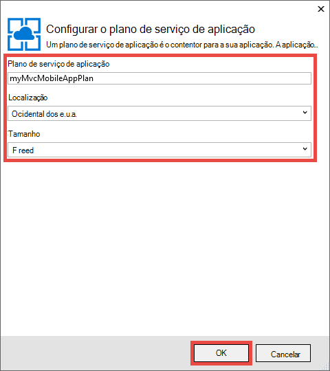
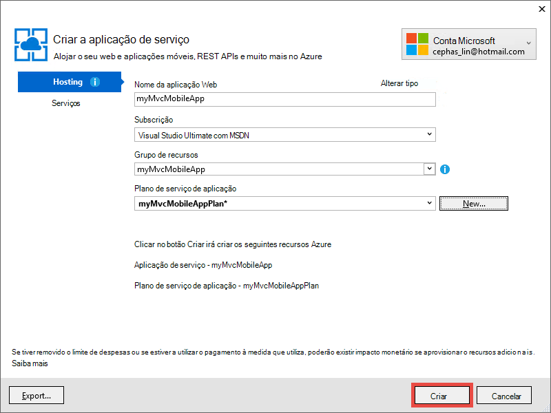

<properties 
    pageTitle="Implemente uma aplicação móvel web do ASP.NET MVC 5 na aplicação de serviço de Azure" 
    description="Tutorial que lhe ensina a implementar uma aplicação web para a aplicação de serviço de Azure utilizando funcionalidades para dispositivos móveis na aplicação de web do ASP.NET MVC 5." 
    services="app-service" 
    documentationCenter=".net" 
    authors="cephalin" 
    manager="wpickett" 
    editor="jimbe"/>

<tags 
    ms.service="app-service" 
    ms.workload="na" 
    ms.tgt_pltfrm="na" 
    ms.devlang="dotnet" 
    ms.topic="article" 
    ms.date="01/12/2016" 
    ms.author="cephalin;riande"/>

# Implemente uma aplicação móvel web do ASP.NET MVC 5 na aplicação de serviço de Azure

Neste tutorial sobre as noções básicas de como criar uma aplicação web do ASP.NET MVC 5 que seja amigável mobile e implementá-lo para a aplicação de serviço de Azure. Neste tutorial, terá de [Visual Studio 2013 Express para Web] [ Visual Studio Express 2013] ou a edição do Visual Studio se já tiver que profissional. Pode utilizar o [Visual Studio 2015] , mas as capturas de ecrã serão diferentes e tem de utilizar os modelos de 4. x do ASP.NET.

[AZURE.INCLUDE [create-account-and-websites-note](../../includes/create-account-and-websites-note.md)]

## O que irá criar

Para este tutorial, terá de adicionar funcionalidades para dispositivos móveis para a aplicação de listagem de conferência simple que é fornecida no [projeto starter][StarterProject]. A captura de ecrã seguinte mostra as sessões ASP.NET na aplicação concluída, conforme visto no emulador de browser nas ferramentas de programador do Internet Explorer 11 F12.

![][FixedSessionsByTag]

Pode utilizar as ferramentas de programador do Internet Explorer 11 F12 e a [ferramenta de Fiddler] [ Fiddler] para ajudar a depurar a aplicação. 

## Competências que irá aprender

Eis o que vai aprender:

-   Como utilizar o Visual Studio 2013 para publicar a sua aplicação web diretamente para uma aplicação web na aplicação de serviço de Azure.
-   Como os modelos de ASP.NET MVC 5 utilizam a arquitetura de arranque CSS para melhorar a apresentação em dispositivos móveis
-   Como criar vistas de mobile específicas alvo específicos browsers para dispositivos móveis, como o iPhone e Android
-   Como criar vistas de responder (vistas que respondem a diferentes browsers em todos os dispositivos)

## Configurar o ambiente de desenvolvimento

Configurar o seu ambiente de desenvolvimento ao instalar o SDK do Azure para .NET 2.5.1 ou posterior. 

1. Para instalar o SDK do Azure para .NET, clique na ligação abaixo. Se não tiver o Visual Studio 2013 ainda instalado, será instalado pela ligação. Neste tutorial requer o Visual Studio 2013. [Azure SDK do Visual Studio 2013][AzureSDKVs2013]
1. Na janela do Web plataforma Installer, clique em **instalar** e continuar com a instalação.

Também terá um emulador de browser para dispositivo móvel. Irá funcionar qualquer um dos seguintes procedimentos:

-   Browser emulador nas [Ferramentas de programador do Internet Explorer 11 F12] [ EmulatorIE11] (utilizado em todas as capturas de ecrã do browser para dispositivo móvel). Predefinições de cadeia do agente de utilizador que tem para Windows Phone 8, Windows Phone 7 e iPad da Apple.
-   Browser emulador no [Google Chrome DevTools][EmulatorChrome]. Contém predefinições para vários dispositivos Android, bem como Apple iPhone, iPad da Apple e Amazon Kindle Fire. -Lo também emula tátil eventos.
-   [Emulador móvel opera][EmulatorOpera]

Projectos do Visual Studio com C\# código fonte estão disponíveis para acompanhar neste tópico:

-   [Transferência de projeto Starter][StarterProject]
-   [Concluída a transferência de projeto][CompletedProject]

##Implementar o projeto starter para uma aplicação web do Azure

1.  Transferir a aplicação de listagem de conferência [projeto starter][StarterProject].

2.  Em seguida, no Explorador do Windows, com o botão direito no ficheiro ZIP transferido e selecione *Propriedades*.

3.  Na caixa de diálogo **Propriedades** , selecione o botão **Desbloquear** . (Sobre como desbloquear impede que um aviso de segurança que ocorre quando tenta utilizar um ficheiro *. zip* que transferiu a partir da web.)

4.  O ficheiro ZIP com o botão direito e selecione **Extrair todos** para deszipar o ficheiro. 

5.  No Visual Studio, abra o ficheiro *C#\Mvc5Mobile.sln* .

6.  No Explorador de solução, com o botão direito do projeto e clique em **Publicar**.

    ![][DeployClickPublish]

7.  No Web publicar, clique em **Serviço de aplicação do Microsoft Azure**.

    ![][DeployClickWebSites]

8.  Se ainda não tiver iniciado sessão no Azure, clique em **Adicionar uma conta**.

    ![][DeploySignIn]

9.  Siga os pedidos para iniciar sessão na sua conta Azure.

11. A caixa de diálogo do serviço de aplicação deverá agora mostrar-lhe como iniciar sessão. Clique em **Novo**.

    ![][DeployNewWebsite]  

12. No campo **Nome da aplicação Web** , especifique um prefixo de nome de aplicação exclusiva. O nome da aplicação web completamente qualificado será * &lt;prefixo >*. azurewebsites.net. Além disso, selecione ou especifique um nome do novo grupo de recursos no **grupo de recursos**. Em seguida, clique em **Novo** para criar um novo plano de serviço de aplicação.

    ![][DeploySiteSettings]

13. Configure o novo plano de aplicação de serviço e clique em **OK**. 

    

13. Novamente na caixa de diálogo Criar aplicação de serviço, clique em **Criar**.

     

13. Após o Azure recursos são criados, a publicar Web caixa de diálogo preenchida com as definições para a nova aplicação. Clique em **Publicar**.

    ![][DeployPublishSite]

    Assim que o Visual Studio terminar o projeto starter de publicação para a aplicação Azure web, o browser de ambiente de trabalho é aberto para apresentar a aplicação web ao vivo.

14. Inicie o seu emulador de browser para dispositivo móvel, copie o URL para a aplicação de conferência (*<prefix>*. azurewebsites.net) para o emulador e, em seguida, clique no botão superior direito e selecione **Procurar por etiqueta**. Se estiver a utilizar o Internet Explorer 11 como o browser predefinido, apenas terá de escrever `F12`, em seguida, `Ctrl+8`e, em seguida, altere o perfil de browser para **Windows Phone**. A imagem abaixo mostra a vista de *AllTags* no modo de vertical (de escolherem **Procurar por etiqueta**).

    ![][AllTags]

>[AZURE.TIP] Enquanto pode depurar a aplicação de MVC 5 a partir do Visual Studio, pode publicar a aplicação web do Azure novamente para verificar se a aplicação web ao vivo diretamente a partir do seu browser para dispositivo móvel ou um emulador de browser.

A apresentação é muito legível num dispositivo móvel. Também já pode ver alguns dos efeitos visuais aplicados à arquitetura de arranque CSS.
Clique na ligação **ASP.NET** .

![][SessionsByTagASP.NET]

A vista de etiqueta do ASP.NET é equipado zoom ao ecrã arranque é automaticamente para si. No entanto, pode melhorar esta vista para se adequar browser para dispositivo móvel. Por exemplo, a coluna de **data** é difícil de ler. Mais tarde no tutorial irá alterar a vista de *AllTags* para torná-lo amigável mobile.

##Arquitetura de arranque CSS

Novidade no 5 MVC modelo é suporte de arranque incorporado. Já viu como imediatamente melhora as diferentes vistas na sua aplicação. Por exemplo, a barra de navegação na parte superior é que pode ser fechada automaticamente quando a largura de browser é mais pequena. No browser do ambiente de trabalho, tente redimensionar a janela do browser e consulte o artigo como na barra de navegação alterações respetiva aspeto e funcionalidade. Esta é a estrutura da web incorporada no arranque.

Para ver como teria o aspeto do Web app sem arranque, abrir *aplicação\_iniciar\\BundleConfig.cs* e comentário as linhas que contêm *bootstrap.js* e *bootstrap.css*. O código seguinte mostra as dois últimos declarações do `RegisterBundles` método após a alteração:

     bundles.Add(new ScriptBundle("~/bundles/bootstrap").Include(
              //"~/Scripts/bootstrap.js",
              "~/Scripts/respond.js"));

    bundles.Add(new StyleBundle("~/Content/css").Include(
              //"~/Content/bootstrap.css",
              "~/Content/site.css"));

Prima `Ctrl+F5` para executar a aplicação.

Observe a barra de navegação que pode ser fechado está agora apenas uma lista não ordenada normal. Clique novamente em **Procurar por etiqueta** e, em seguida, clique em **ASP.NET**.
Na vista de emulador móvel, pode ver agora que já não se encontra equipado zoom ao ecrã e tem desloque-se na diagonal para poder ver lado direito da tabela.

![][SessionsByTagASP.NETNoBootstrap]

Anular as suas alterações e atualize o browser para dispositivo móvel para verificar que a apresentação de mobile amigável foi restaurada.

Arranque não é específico a ASP.NET MVC 5 e pode tirar partido destas funcionalidades em qualquer aplicação web. Mas agora incorporada no modelo de projeto ASP.NET MVC 5, para que a aplicação Web do MVC 5 pode tirar partido de arranque por predefinição.

Para mais informações sobre o arranque, vá para o [arranque] [ BootstrapSite] site.

Na secção seguinte verá como fornecer vistas específicas de browser móvel.

##Substituir as vistas, esquemas e vistas parciais

Pode substituir qualquer vista (incluindo esquemas e vistas parciais) para browsers para dispositivos móveis em geral, um browser para dispositivo móvel individual, ou por qualquer browser específico. Para fornecer uma vista móvel específicas, pode copiar um ficheiro de vista e adicionar *. Mobile* ao nome do ficheiro. Por exemplo, para criar uma vista móvel do *índice remissivo* , pode copiar *vistas\\casa\\Index.cshtml* para *vistas\\casa\\Index.Mobile.cshtml*.

Nesta secção, crie um ficheiro de esquema móvel específicas.

Para começar, copie *vistas\\partilhado\\\_Layout.cshtml* para *vistas\\partilhado\\\_Layout.Mobile.cshtml*. Abrir * \_Layout.Mobile.cshtml* e alterar o título a partir da **Aplicação MVC5** à **Aplicação MVC5 (telemóvel)**.

Em cada `Html.ActionLink` ligar para a barra de navegação, remover "Procurar por" em cada ligação *ActionLink*. O código seguinte mostra a concluídas `<ul class="nav navbar-nav">` etiqueta do ficheiro de esquema móvel.

    <ul class="nav navbar-nav">
        <li>@Html.ActionLink("Home", "Index", "Home")</li>
        <li>@Html.ActionLink("Date", "AllDates", "Home")</li>
        <li>@Html.ActionLink("Speaker", "AllSpeakers", "Home")</li>
        <li>@Html.ActionLink("Tag", "AllTags", "Home")</li>
    </ul>

Copiar o *vistas\\casa\\AllTags.cshtml* do ficheiro para *vistas\\casa\\AllTags.Mobile.cshtml*. Abra o novo ficheiro e altere o `<h2>` elemento de "Etiquetas" para "etiquetas (M)":

    <h2>Tags (M)</h2>

Navegue para a página de etiquetas utilizando um browser de ambiente de trabalho e utilizar emulador de browser para dispositivo móvel. O emulador de browser para dispositivo móvel mostra as duas alterações que efetuou (o título do * \_Layout.Mobile.cshtml* e o título do *AllTags.Mobile.cshtml*).

![][AllTagsMobile_LayoutMobile]

Em contrapartida, a apresentação de ambiente de trabalho não foi alterada (com títulos de * \_Layout.cshtml* e *AllTags.cshtml*).

![][AllTagsMobile_LayoutMobileDesktop]

##Criar vistas de específicas do Browser

Para além de vistas mobile-específicas e do ambiente de trabalho, pode criar vistas para um browser individual. Por exemplo, pode criar vistas que estão especificamente para iPhone ou o browser Android. Nesta secção, irá criar um esquema para o browser do iPhone e uma versão do iPhone da vista de *AllTags* .

Abra o ficheiro *asax* e adicione o seguinte código para o fim da `Application_Start` método.

    DisplayModeProvider.Instance.Modes.Insert(0, new DefaultDisplayMode("iPhone")
    {
        ContextCondition = (context => context.GetOverriddenUserAgent().IndexOf
            ("iPhone", StringComparison.OrdinalIgnoreCase) >= 0)
    });

Este código define um novo modo de visualização com o nome "iPhone" que vai ser correspondido contra cada pedido de entrada. Se o pedido de entrada corresponde a condição que definiu (ou seja, se agente do utilizador contém a cadeia "iPhone"), ASP.NET MVC irá procurar vistas cujo nome contém sufixo "iPhone".

>[AZURE.NOTE] Quando adicionar modos de visualização de específicas do browser móvel, tal como para iPhone e Android, certifique-se definir o primeiro argumento como `0` (inserir na parte superior da lista) para se certificar de que o modo de específicas do browser terá precedência relativamente ao modelo de dispositivos móvel (*. Mobile.cshtml). Se o modelo móvel na parte superior da lista em vez disso, será selecionada sobre o modo de visualização pretendida (a primeira ganha de correspondência e o modelo de móvel corresponde ao todos os browsers para dispositivos móveis). 

No código, com o botão direito `DefaultDisplayMode`, selecione **resolver**e, em seguida, selecione `using System.Web.WebPages;`. Esta opção adiciona uma referência para a `System.Web.WebPages` espaço de nomes, que é o local onde a `DisplayModeProvider` e `DefaultDisplayMode` tipos são definidos.

![][ResolveDefaultDisplayMode]

Em alternativa, pode adicionar manualmente apenas a linha seguinte para o `using` secção do ficheiro.

    using System.Web.WebPages;

Guarde as alterações. Copiar o *vistas\\partilhado\\\_Layout.Mobile.cshtml* do ficheiro para *vistas\\partilhado\\\_Layout.iPhone.cshtml*. Abrir o novo ficheiro e, em seguida, altere o título do `MVC5 Application (Mobile)` para `MVC5 Application (iPhone)`.

Copiar o *vistas\\casa\\AllTags.Mobile.cshtml* do ficheiro para *vistas\\casa\\AllTags.iPhone.cshtml*. No novo ficheiro, alterar o `<h2>` elemento de "etiquetas (M)" a "Etiquetas (iPhone)".

Execute a aplicação. Executar um emulador de browser para dispositivo móvel, certifique-se de que agente do utilizador está definido para "iPhone" e navegue para a vista de *AllTags* . Se estiver a utilizar o emulador nas ferramentas de programador do Internet Explorer 11 F12, configure emulação ao seguinte:

-   Perfil de browser = **Windows Phone**
-   Cadeia de agente do utilizador = **personalizado**
-   Cadeia personalizada = **Apple-iPhone5C1/1001.525**

A seguinte captura de ecrã mostra a vista de *AllTags* foi processada num emulador nas ferramentas de programador do Internet Explorer 11 F12 com a cadeia do agente de utilizador personalizada (isto é uma cadeia de agente de utilizador do iPhone 5 C).

![][AllTagsIPhone_LayoutIPhone]

No browser para dispositivo móvel, selecione a ligação **dos altifalantes** . Porque não existe uma vista móvel (*AllSpeakers.Mobile.cshtml*), a vista de altifalantes predefinida (*AllSpeakers.cshtml*) é composta utilizando a vista de esquema móvel (*\_Layout.Mobile.cshtml*). Como é mostrado abaixo, o título da **Aplicação MVC5 (telemóvel)** é definido na * \_Layout.Mobile.cshtml*.

![][AllSpeakers_LayoutMobile]

Pode desativar uma vista de (não móvel) predefinida de composição dentro de um esquema móvel globalmente definindo `RequireConsistentDisplayMode` para `true` na *vistas\\\_ViewStart.cshtml* ficheiro, da seguinte forma:

    @{
        Layout = "~/Views/Shared/_Layout.cshtml";
        DisplayModeProvider.Instance.RequireConsistentDisplayMode = true;
    }

Quando `RequireConsistentDisplayMode` está definido para `true`, o esquema móvel (*\_Layout.Mobile.cshtml*) é utilizada apenas para vistas móveis (isto é, quando o ficheiro de vista é o formulário * **ViewName**. Mobile.cshtml*). Poderá pretender definir `RequireConsistentDisplayMode` para `true` se o esquema móvel não funciona bem com as vistas que não sejam mobile. A captura de ecrã abaixo mostra como página dos *altifalantes* compõe quando `RequireConsistentDisplayMode` está definido para `true` (sem a cadeia "(telemóvel)" na barra de navegação na parte superior).

![][AllSpeakers_LayoutMobileOverridden]

Pode desativar o modo de visualização consistente numa vista específica definindo `RequireConsistentDisplayMode` para `false` no ficheiro de vista. A marcação seguinte na *vistas\\casa\\AllSpeakers.cshtml* conjuntos de ficheiros `RequireConsistentDisplayMode` para `false`:

    @model IEnumerable<string>

    @{
        ViewBag.Title = "All speakers";
        DisplayModeProvider.Instance.RequireConsistentDisplayMode = false;
    }

Nesta secção podemos visualizou como criar vistas e esquemas móveis e como criar esquemas e vistas para dispositivos específicos, como o iPhone.
No entanto, a vantagem principal da arquitetura de arranque CSS é o esquema da, o que significa que um único stylesheet pode ser aplicado ao longo de ambiente de trabalho, telefone e tablet browsers para criar um aspeto e funcionalidade consistente. Na secção seguinte verá como tirar partido de arranque para criar vistas de mobile relevantes.

##Melhorar a lista dos altifalantes

À medida que acabou de ver, a vista de *altifalantes* é legível, mas as ligações são pequenas e de difícil acesso toque num dispositivo móvel. Nesta secção, irá efetuar a vista de *AllSpeakers* mobile relevantes, que apresenta hiperligações grandes e fácil de toque e contém uma caixa de pesquisa para localizar rapidamente os altifalantes.

Pode utilizar a criar o [grupo de lista ligada][] de arranque para melhorar a vista de *altifalantes* . No *vistas\\casa\\AllSpeakers.cshtml*, substituir o conteúdo do ficheiro Razor com o código abaixo.

     @model IEnumerable<string>

    @{
        ViewBag.Title = "All Speakers";
    }

    <h2>Speakers</h2>

    

        @foreach (var speaker in Model)
        {
            @Html.ActionLink(speaker, "SessionsBySpeaker", new { speaker }, new { @class = "list-group-item" })
        }
    

O `class="list-group"` do atributo da `
` etiqueta aplica o estilo de lista de arranque e a `class="input-group-item"` atributo se aplica o estilo de item de lista de arranque para cada ligação.

Atualize o browser para dispositivo móvel. A vista atualizada tem o seguinte aspeto:

![][AllSpeakersFixed]

O estilo de arranque [grupo lista ligadas][] faz com que a caixa completa para cada ligação clicável, que é uma muito melhor experiência de utilizador. Mudar para a vista de ambiente de trabalho e observe o aspeto e funcionalidade consistente.

![][AllSpeakersFixedDesktop]

Apesar de melhorou a vista de browser para dispositivo móvel, é difícil navegar na lista longa dos altifalantes. Arranque não fornece uma filtro funcionalidade fora-de-de-caixa de pesquisa, mas pode adicioná-la com algumas linhas de código. Primeiro irá adicionar uma caixa de pesquisa para a vista depois associar o código JavaScript para a função filter. No *vistas\\casa\\AllSpeakers.cshtml*, adicionar um \<formulário\> apenas depois de marcar o \<h2\> marcar, conforme apresentado abaixo:

    @model IEnumerable<string>

    @{
        ViewBag.Title = "All Speakers";
    }

    <h2>Speakers</h2>

    <form class="input-group">
        
        <input type="text" class="form-control" placeholder="Search speaker">
    </form>
     
    

        @foreach (var speaker in Model)
        {
            @Html.ActionLink(speaker, 
                             "SessionsBySpeaker", 
                             new { speaker }, 
                             new { @class = "list-group-item" })
        }
    

Repare que o `<form>` e `<input>` ambas as etiquetas têm os estilos de arranque aplicados às mesmas. O `` elemento adiciona um arranque [glyphicon][] à caixa de pesquisa.

Na pasta de *Scripts* , adicione um ficheiro de JavaScript denominado *filter.js*. Abra o ficheiro e colá-la o seguinte código:

    $(function () {

        // reset the search form when the page loads
        $("form").each(function () {
            this.reset();
        });

        // wire up the events to the <input> element for search/filter
        $("input").bind("keyup change", function () {
            var searchtxt = this.value.toLowerCase();
            var items = $(".list-group-item");

            // show all speakers that begin with the typed text and hide others
            for (var i = 0; i < items.length; i++) {
                var val = items[i].text.toLowerCase();
                val = val.substring(0, searchtxt.length);
                if (val == searchtxt) {
                    $(items[i]).show();
                }
                else {
                    $(items[i]).hide();
                }
            }
        });
    });

Também precisa de incluir filter.js na sua conjuntos registados. Abrir *aplicação\_iniciar\\BundleConfig.cs* e alterar os primeira conjuntos. Alterar o primeiro `bundles.Add` declaração (do pacote **jquery** ) para incluir *Scripts\\filter.js*, da seguinte forma:

     bundles.Add(new ScriptBundle("~/bundles/jquery").Include(
                "~/Scripts/jquery-{version}.js",
                "~/Scripts/filter.js"));

O pacote de **jquery** já é composto por predefinição * \_esquema* vista. Mais tarde, pode utilizar o mesmo código JavaScript para aplicar a funcionalidade de filtro para outras vistas de lista.

Atualizar o browser para dispositivo móvel e ir para a vista de *AllSpeakers* . Na caixa de pesquisa, escreva "sc". A lista dos altifalantes agora deve ser filtrada de acordo com a cadeia de pesquisa.

![][AllSpeakersFixedSearchBySC]

##Melhorar a lista de etiquetas

Como a vista de *altifalantes* , a vista de *etiquetas* é legível, mas as ligações são pequenos e de difícil acesso toque num dispositivo móvel. Corrigir a vista de *etiquetas* da mesma forma que corrige vista *altifalantes* , se utilizar as alterações de código descritas anteriormente, mas com o seguinte `Html.ActionLink` sintaxe método na *vistas\\casa\\AllTags.cshtml*:

    @Html.ActionLink(tag, 
                     "SessionsByTag", 
                     new { tag }, 
                     new { @class = "list-group-item" })

Browser de ambiente de trabalho atualizado será apresentada da seguinte forma:

![][AllTagsFixedDesktop]

E o browser para dispositivo móvel atualizado da seguinte forma: 

![][AllTagsFixed]

>[AZURE.NOTE] Se notar que a formatação original da lista existe ainda no browser para dispositivo móvel e questionar-se de que o que aconteceu ao seu estilo de arranque totalmente, este é um artifício da ação anterior para criar vistas específicas móveis. No entanto, agora que estiver a utilizar o quadro de arranque CSS para criar um design da web, aceda cabeça e remover estas vistas específicas do telemóvel e as vistas de esquema móvel específicas. Assim que tiver feito, atualizado browser para dispositivo móvel irá mostrar o estilo de arranque do sistema.

##Melhorar a lista de datas

Pode melhorar a vista de *datas* como melhorada as vistas *dos altifalantes* e *etiquetas* , se utilizar as alterações de código descritas anteriormente, mas com o seguinte `Html.ActionLink` sintaxe método na *vistas\\casa\\AllDates.cshtml*:

    @Html.ActionLink(date.ToString("ddd, MMM dd, h:mm tt"), 
                     "SessionsByDate", 
                     new { date }, 
                     new { @class = "list-group-item" })

Irá obter uma vista de browser para dispositivo móvel atualizados da seguinte forma:

![][AllDatesFixed]

Pode melhorar ainda mais a vista de *datas* organizando os valores de data-hora por data. Isto pode ser feito com o estilo de arranque [painéis][] . Substituir o conteúdo da *vistas\\casa\\AllDates.cshtml* ficheiro com o seguinte código:

    @model IEnumerable<DateTime>

    @{
        ViewBag.Title = "All Dates";
    }

    <h2>Dates</h2>

    @foreach (var dategroup in Model.GroupBy(x=>x.Date))
    {
        

            

                @dategroup.Key.ToString("ddd, MMM dd")
            

            

                @foreach (var date in dategroup)
                {
                    @Html.ActionLink(date.ToString("h:mm tt"), 
                                     "SessionsByDate", 
                                     new { date }, 
                                     new { @class = "list-group-item" })
                }
            

        

    }

Este código cria uma separada `
` etiqueta para cada data distinta na lista e utiliza o [grupo de lista ligada][] para as respetivas ligações como anteriormente. Aqui é o browser para dispositivo móvel aspeto quando executa este código:

![][AllDatesFixed2]

Mudar para o browser de ambiente de trabalho. Novamente, tenha em atenção o aspecto consistente.

![][AllDatesFixed2Desktop]

##Melhorar a View SessionsTable

Nesta secção, irá criar a vista de *SessionsTable* mais mobile relevantes. Esta alteração é mais abrangente as alterações anterior.

No browser para dispositivo móvel, toque no botão de **etiqueta** , em seguida, introduza `asp` na caixa de pesquisa.

![][AllTagsFixedSearchByASP]

Toque na ligação **ASP.NET** .

![][SessionsTableTagASP.NET]

Como pode ver, a apresentação está formatada como uma tabela, que atualmente está concebida para ser visto no browser do ambiente de trabalho. No entanto, é ligeiramente difícil de ler no browser para dispositivo móvel. Para corrigir este problema, abra *vistas\\casa\\SessionsTable.cshtml* e, em seguida, substitua o conteúdo do ficheiro com o seguinte código:

    @model IEnumerable<Mvc5Mobile.Models.Session>

    <h2>@ViewBag.Title</h2>

    

        

            @foreach (var session in Model)
            {
                

                    

                        @Html.ActionLink(session.Title, 
                                         "SessionByCode", 
                                         new { session.Code }, 
                                         new { @class="list-group-item active" })
                        

                            

                                @Html.Partial("_SpeakersLinks", session)
                            

                            

                                @session.DateText
                            

                            

                                @Html.Partial("_TagsLinks", session)
                            

                        

                    

                

            }
        

    

O código faz 3 coisas:

-   utiliza o arranque [grupo ligada de lista personalizada][] para formatar as informações da sessão verticalmente, para que todos os estas informações ficam legíveis num browser móvel (utilizando classes como lista grupo-item texto)
-   aplica-se o [sistema de grelha][] para o esquema, para que os itens da sessão de fluxo de horizontalmente no browser do ambiente de trabalho e na vertical no browser para dispositivo móvel (utilizando a classe de col-md-4)
-   utiliza os [utilitários de responder][] para ocultar os códigos de sessão quando visualizado no browser para dispositivo móvel (utilizando a classe de x ocultos)

Pode também tocar uma ligação de título para ir para a sessão respetivas. A imagem abaixo apresenta as alterações de código.

![][FixedSessionsByTag]

O sistema de arranque grelha que aplicou automaticamente organiza as sessões verticalmente no browser para dispositivo móvel. Além disso, repare que as etiquetas não são apresentadas. Mudar para o browser de ambiente de trabalho.

![][SessionsTableFixedTagASP.NETDesktop]

No browser de ambiente de trabalho, repare que as etiquetas agora são apresentadas. Além disso, pode ver que o sistema de arranque grelha que aplicou organiza os itens de sessão nas duas colunas. Se aumentar o browser, verá que a disposição muda para três colunas.

##Melhorar a View SessionByCode

Por fim, irá corrija a vista de *SessionByCode* para torná-lo amigável mobile.

No browser para dispositivo móvel, toque no botão de **etiqueta** , em seguida, introduza `asp` na caixa de pesquisa.

![][AllTagsFixedSearchByASP]

Toque na ligação **ASP.NET** . Sessões para a etiqueta ASP.NET são apresentados.

![][FixedSessionsByTag]

Selecione a ligação de **criar uma única página aplicação com o ASP.NET e AngularJS** .

![][SessionByCode3-644]

A vista de ambiente de trabalho predefinida é fina, mas pode melhorar o aspeto facilmente através de alguns componentes de interface gráfica de arranque.

Abrir *vistas\\casa\\SessionByCode.cshtml* e substituir o conteúdo com a marcação seguinte:

    @model Mvc5Mobile.Models.Session

    @{
        ViewBag.Title = "Session details";
    }
    <h3>@Model.Title (@Model.Code)</h3>
    

        <strong>@Model.DateText</strong> in <strong>@Model.Room</strong>
    

    

        

            Speakers
        

        @foreach (var speaker in Model.Speakers)
        {
            @Html.ActionLink(speaker, 
                             "SessionsBySpeaker", 
                             new { speaker }, 
                             new { @class="panel-body" })
        }
    

    
@Model.Abstract

    

        

            Tags
        

        @foreach (var tag in Model.Tags)
        {
            @Html.ActionLink(tag, 
                             "SessionsByTag", 
                             new { tag }, 
                             new { @class = "panel-body" })
        }
    

A marcação nova utiliza painéis arranque criar para melhorar a vista móvel. 

Atualize o browser para dispositivo móvel. A imagem seguinte reflete as alterações de código que acabou de fazer:

![][SessionByCodeFixed3-644]

## Moldar e rever

Neste tutorial tem mostrado como utilizar ASP.NET MVC 5 para desenvolver aplicações de Web amigável mobile. Estes incluem:

-   Implementar uma aplicação do ASP.NET MVC 5 para uma aplicação de serviço web app
-   Utilizar o arranque para criar o esquema da web na sua aplicação MVC 5
-   Substituir o esquema, vistas e vistas parciais, globalmente e para uma vista individual
-   Esquema de controlo e parcial substituam imposição utilizando o `RequireConsistentDisplayMode` propriedade
-   Criar vistas que alvo browsers específicos, como o browser do iPhone
-   Aplicar o estilo de arranque no código Razor

## Consulte também

-   [9 princípios básicos de estrutura da web](http://blog.froont.com/9-basic-principles-of-responsive-web-design/)
-   [Arranque][BootstrapSite]
-   [Blogue de arranque oficial][]
-   [Twitter Tutorial de arranque do Tutorial República][]
-   [O arranque parques][]
-   [W3C recomendação Web móvel aplicação melhores práticas][]
-   [W3C candidatos recomendação para consultas de multimédia][]

## O que é alterado
* Para um guia para a alteração de Web sites para a aplicação de serviço Consulte o artigo: [aplicação de serviço de Azure e respectivo impacto na existente dos serviços do Azure](http://go.microsoft.com/fwlink/?LinkId=529714)

<!-- Internal Links -->
[Deploy the starter project to an Azure web app]: #bkmk_DeployStarterProject
[Bootstrap CSS Framework]: #bkmk_bootstrap
[Override the Views, Layouts, and Partial Views]: #bkmk_overrideviews
[Create Browser-Specific Views]:#bkmk_browserviews
[Improve the Speakers List]: #bkmk_Improvespeakerslist
[Improve the Tags List]: #bkmk_improvetags
[Improve the Dates List]: #bkmk_improvedates
[Improve the SessionsTable View]: #bkmk_improvesessionstable
[Improve the SessionByCode View]: #bkmk_improvesessionbycode

<!-- External Links -->
[Visual Studio Express 2013]: http://www.visualstudio.com/downloads/download-visual-studio-vs#d-express-web
[Visual Studio 2015]: https://www.visualstudio.com/downloads/download-visual-studio-vs
[AzureSDKVs2013]: http://go.microsoft.com/fwlink/p/?linkid=323510&clcid=0x409
[Fiddler]: http://www.fiddler2.com/fiddler2/
[EmulatorIE11]: http://msdn.microsoft.com/library/ie/dn255001.aspx
[EmulatorChrome]: https://developers.google.com/chrome-developer-tools/docs/mobile-emulation
[EmulatorOpera]: http://www.opera.com/developer/tools/mobile/
[StarterProject]: http://go.microsoft.com/fwlink/?LinkID=398780&clcid=0x409
[CompletedProject]: http://go.microsoft.com/fwlink/?LinkID=398781&clcid=0x409
[BootstrapSite]: http://getbootstrap.com/
[WebPIAzureSdk23NetVS13]: ./media/web-sites-dotnet-deploy-aspnet-mvc-mobile-app/WebPIAzureSdk23NetVS13.png
[grupo de lista ligada]: http://getbootstrap.com/components/#list-group-linked
[glyphicon]: http://getbootstrap.com/components/#glyphicons
[painéis]: http://getbootstrap.com/components/#panels
[grupo de lista personalizada de ligadas]: http://getbootstrap.com/components/#list-group-custom-content
[sistema de grelha]: http://getbootstrap.com/css/#grid
[utilitários de responder]: http://getbootstrap.com/css/#responsive-utilities
[Blogue de arranque oficial]: http://blog.getbootstrap.com/
[Twitter Tutorial de arranque do Tutorial República]: http://www.tutorialrepublic.com/twitter-bootstrap-tutorial/
[O arranque parques]: http://www.bootply.com/
[W3C recomendação Web móvel aplicação melhores práticas]: http://www.w3.org/TR/mwabp/
[W3C candidatos recomendação para consultas de multimédia]: http://www.w3.org/TR/css3-mediaqueries/

<!-- Images -->
[DeployClickPublish]: ./media/web-sites-dotnet-deploy-aspnet-mvc-mobile-app/deploy-to-azure-website-1.png
[DeployClickWebSites]: ./media/web-sites-dotnet-deploy-aspnet-mvc-mobile-app/deploy-to-azure-website-2.png
[DeploySignIn]: ./media/web-sites-dotnet-deploy-aspnet-mvc-mobile-app/deploy-to-azure-website-3.png
[DeployUsername]: ./media/web-sites-dotnet-deploy-aspnet-mvc-mobile-app/deploy-to-azure-website-4.png
[DeployPassword]: ./media/web-sites-dotnet-deploy-aspnet-mvc-mobile-app/deploy-to-azure-website-5.png
[DeployNewWebsite]: ./media/web-sites-dotnet-deploy-aspnet-mvc-mobile-app/deploy-to-azure-website-6.png
[DeploySiteSettings]: ./media/web-sites-dotnet-deploy-aspnet-mvc-mobile-app/deploy-to-azure-website-7.png
[DeployPublishSite]: ./media/web-sites-dotnet-deploy-aspnet-mvc-mobile-app/deploy-to-azure-website-8.png
[MobileHomePage]: ./media/web-sites-dotnet-deploy-aspnet-mvc-mobile-app/mobile-home-page.png
[FixedSessionsByTag]: ./media/web-sites-dotnet-deploy-aspnet-mvc-mobile-app/SessionsByTag-ASP.NET-Fixed.png
[AllTags]: ./media/web-sites-dotnet-deploy-aspnet-mvc-mobile-app/AllTags.png
[SessionsByTagASP.NET]: ./media/web-sites-dotnet-deploy-aspnet-mvc-mobile-app/SessionsByTag-ASP.NET.png
[SessionsByTagASP.NETNoBootstrap]: ./media/web-sites-dotnet-deploy-aspnet-mvc-mobile-app/SessionsByTag-ASP.NET-NoBootstrap.png
[AllTagsMobile_LayoutMobile]: ./media/web-sites-dotnet-deploy-aspnet-mvc-mobile-app/AllTagsMobile-_LayoutMobile.png
[AllTagsMobile_LayoutMobileDesktop]: ./media/web-sites-dotnet-deploy-aspnet-mvc-mobile-app/AllTagsMobile-_LayoutMobile-Desktop.png
[ResolveDefaultDisplayMode]: ./media/web-sites-dotnet-deploy-aspnet-mvc-mobile-app/Resolve-DefaultDisplayMode.png
[AllTagsIPhone_LayoutIPhone]: ./media/web-sites-dotnet-deploy-aspnet-mvc-mobile-app/AllTagsIPhone-_LayoutIPhone.png
[AllSpeakers_LayoutMobile]: ./media/web-sites-dotnet-deploy-aspnet-mvc-mobile-app/AllSpeakers-_LayoutMobile.png
[AllSpeakers_LayoutMobileOverridden]: ./media/web-sites-dotnet-deploy-aspnet-mvc-mobile-app/AllSpeakers-_LayoutMobile-Overridden.png
[AllSpeakersFixed]: ./media/web-sites-dotnet-deploy-aspnet-mvc-mobile-app/AllSpeakers-Fixed.png
[AllSpeakersFixedDesktop]: ./media/web-sites-dotnet-deploy-aspnet-mvc-mobile-app/AllSpeakers-Fixed-Desktop.png
[AllSpeakersFixedSearchBySC]: ./media/web-sites-dotnet-deploy-aspnet-mvc-mobile-app/AllSpeakers-Fixed-SearchBySC.png
[AllTagsFixedDesktop]: ./media/web-sites-dotnet-deploy-aspnet-mvc-mobile-app/AllTags-Fixed-Desktop.png 
[AllTagsFixed]: ./media/web-sites-dotnet-deploy-aspnet-mvc-mobile-app/AllTags-Fixed.png
[AllDatesFixed]: ./media/web-sites-dotnet-deploy-aspnet-mvc-mobile-app/AllDates-Fixed.png
[AllDatesFixed2]: ./media/web-sites-dotnet-deploy-aspnet-mvc-mobile-app/AllDates-Fixed2.png
[AllDatesFixed2Desktop]: ./media/web-sites-dotnet-deploy-aspnet-mvc-mobile-app/AllDates-Fixed2-Desktop.png
[AllTagsFixedSearchByASP]: ./media/web-sites-dotnet-deploy-aspnet-mvc-mobile-app/AllTags-Fixed-SearchByASP.png
[SessionsTableTagASP.NET]: ./media/web-sites-dotnet-deploy-aspnet-mvc-mobile-app/SessionsTable-Tag-ASP.NET.png
[SessionsTableFixedTagASP.NETDesktop]: ./media/web-sites-dotnet-deploy-aspnet-mvc-mobile-app/SessionsTable-Fixed-Tag-ASP.NET-Desktop.png
[SessionByCode3-644]: ./media/web-sites-dotnet-deploy-aspnet-mvc-mobile-app/SessionByCode-3-644.png
[SessionByCodeFixed3-644]: ./media/web-sites-dotnet-deploy-aspnet-mvc-mobile-app/SessionByCode-Fixed-3-644.png
 
