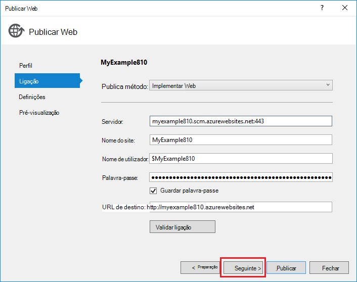

<properties
    pageTitle="Implementar uma aplicação do ASP.NET ao serviço de aplicação do Azure utilizando o Visual Studio | Microsoft Azure"
    description="Saiba como implementar um projeto de web do ASP.NET para uma nova aplicação web no Azure aplicação de serviço, utilizando o Visual Studio."
    services="app-service\web"
    documentationCenter=".net"
    authors="tdykstra"
    manager="wpickett"
    editor=""/>

<tags
    ms.service="app-service-web"
    ms.workload="web"
    ms.tgt_pltfrm="na"
    ms.devlang="dotnet"
    ms.topic="get-started-article"
    ms.date="07/22/2016"
    ms.author="rachelap"/>

# Implementar uma aplicação web do ASP.NET para Azure aplicação de serviço, utilizando o Visual Studio

[AZURE.INCLUDE [tabs](../../includes/app-service-web-get-started-nav-tabs.md)]

## Descrição geral

Este tutorial mostra como implementar uma aplicação web do ASP.NET para uma [aplicação web na aplicação de serviço de Azure](app-service-web-overview.md) utilizando o Visual Studio 2015.

O tutorial assume que se encontra um programador ASP.NET que tenha sem experiência anterior com a utilização do Azure. Quando tiver terminado, terá de uma aplicação web simples para cima e a execução de na nuvem.

Que vai aprender:

* Como criar uma nova aplicação web da aplicação de serviço enquanto criar um novo projeto de web no Visual Studio.
* Como implementar um projecto da web a uma aplicação do serviço de aplicação web utilizando o Visual Studio.

O diagrama ilustra o que fazer no tutorial.

No fim do tutorial, uma secção de [resolução de problemas](#troubleshooting) dá ideias sobre o que fazer se algo não funciona, e uma secção [próximos passos](#next-steps) fornece ligações para outros tutoriais que indicam profundidade mais sobre como utilizar a aplicação de serviço de Azure.

Como este é um tutorial introdução, que mostra como implementar o projecto da web é um relatório simples que não utiliza uma base de dados e não executa a autorização ou autenticação. Para estabelecer ligações a mais avançadas de implementação de tópicos, consulte o artigo [como implementar uma aplicação Azure web](web-sites-deploy.md).

Para além do tempo necessário para instalar o SDK do Azure para .NET, este tutorial irá demorar cerca de 10 a 15 minutos para concluir.

## Pré-requisitos

* O tutorial assume que trabalhou com ASP.NET MVC e Visual Studio. Se precisar de uma introdução, consulte o artigo [Introdução ao ASP.NET MVC 5](http://www.asp.net/mvc/overview/getting-started/introduction/getting-started).

* Precisa de uma conta Azure. Pode [Abrir uma conta Azure gratuita](/pricing/free-trial/?WT.mc_id=A261C142F) ou [Ativar o Visual Studio benefícios de subscritor](/pricing/member-offers/msdn-benefits-details/?WT.mc_id=A261C142F). 

    Se pretender começar com a aplicação de serviço de Azure antes de se inscrever para uma conta do Azure, aceda ao [Serviço de aplicação tente](http://go.microsoft.com/fwlink/?LinkId=523751). Não existem pode criar uma aplicação starter curto na aplicação de serviço de — sem cartão de crédito obrigatório e sem compromissos.

## Configurar o ambiente de desenvolvimento

O tutorial, é escrito para Visual Studio 2015 com o [Azure SDK para .NET](../dotnet-sdk.md) 2.9 ou posterior. 

* [Transferir o SDK Azure mais recente para Visual Studio 2015](http://go.microsoft.com/fwlink/?linkid=518003). O SDK instala Visual Studio 2015, se ainda não tiver.

    >[AZURE.NOTE] Dependendo das dependências SDK quantas já tiver no seu computador, instalar o SDK poderá demorar muito tempo, a partir de alguns minutos para de meia hora ou mais.

Se tiver o Visual Studio 2013 e prefere utilizar que, pode [Transferir o SDK Azure mais recente do Visual Studio 2013](http://go.microsoft.com/fwlink/?LinkID=324322). Alguns ecrãs poderão estar diferentes a partir de ilustrações.

## Configurar um novo projeto de web

O passo seguinte é criar um projecto da web no Visual Studio e uma aplicação web na aplicação de serviço de Azure. Nesta secção do tutorial configure o novo projeto de web. 

1. Abrir o Visual Studio 2015.

2. Clique em **ficheiro > novo > projeto**.

3. Na caixa de diálogo **Novo projeto** , clique em **Visual c# > Web > aplicação Web do ASP.NET**.

3. Certifique-se de que o **.NET Framework 4.5.2** está selecionada como a arquitetura de destino.

4.  [Informações de aplicação do Azure](../application-insights/app-insights-overview.md) monitoriza a sua aplicação web para disponibilidade, desempenho e a utilização. A caixa de verificação **Adicionar informações de aplicação para o Project** está selecionada por predefinição a primeira vez que cria um projeto de web depois de instalar o Visual Studio. Desmarque a caixa de verificação se estiver selecionado, mas não quer experimentar a aplicação de informações.

4. Atribua um nome da aplicação **MyExample**e, em seguida, clique em **OK**.

    

5. Na caixa de diálogo **Novo projeto de ASP.NET** , selecione o modelo **MVC** e, em seguida, clique em **Autenticação de alteração**.

    Para este tutorial, implementar um projeto de web do ASP.NET MVC. Se pretender saber como implementar um projeto de ASP.NET Web API, consulte a secção [os passos seguintes](#next-steps) . 

    

6. Na caixa de diálogo **Alterar autenticação** , clique em **Sem autenticação**e, em seguida, clique em **OK**.

    

    Para este tutorial introdução ao que está a implementar uma aplicação simple que não executa a sessão de utilizador.

5. Na secção **Do Microsoft Azure** da caixa de diálogo **Novo projeto de ASP.NET** , certifique-se de que a **alojar na nuvem** está selecionada e que a **Aplicação de serviço** está selecionada na lista pendente.

    

    Estas definições direccionam Visual Studio para criar uma aplicação Azure web para o seu projeto web.

6. Clique em **OK**

## Configurar o Azure recursos para uma nova aplicação web

Agora Visual Studio envie os recursos Azure que pretende que criar.

5. Na caixa de diálogo **Criar aplicação de serviço** , clique em **Adicionar uma conta**e, em seguida, inicie sessão no Azure com o ID e palavra-passe da conta que utiliza para gerir a sua subscrição do Azure.

    

    Se já iniciou sessão anterior no mesmo computador, não poderá ver o botão **Adicionar uma conta** . Nesse caso, pode ignorar este passo ou poderá ter de reintroduzir as suas credenciais.
 
3. Introduza um **Nome da aplicação Web** que seja exclusivo no domínio de *azurewebsites.net* . Por exemplo, pode nomear-MyExample com números para a direita para torná-lo único, como MyExample810. Se um nome de web predefinido é criado por si, será exclusivo e pode utilizá-la.

    Se a outra pessoa já tenha utilizado o nome que introduzir, verá um ponto de exclamação vermelho para a direita em vez de uma marca de verificação verde e tem de introduzir um nome diferente.

    O URL para a sua aplicação está este nome plus *. azurewebsites.net*. Por exemplo, se o nome é `MyExample810`, o URL é `myexample810.azurewebsites.net`.

    Também pode utilizar um domínio personalizado com uma aplicação Azure web. Para mais informações, consulte o artigo [configurar um nome de domínio personalizado no Azure aplicação de serviço](web-sites-custom-domain-name.md).

6. Clique no botão **Novo** junto à caixa de **Grupo de recursos** e, em seguida, introduza "MyExample" ou outro nome se preferir. 

    

    Um grupo de recursos é um conjunto de recursos Azure como aplicações web, bases de dados e VMs. Para obter um tutorial, é geralmente melhor criar um novo grupo de recursos, porque é que o torna mais fácil eliminar num único passo quaisquer recursos Azure criados para o tutorial. Para mais informações, consulte o artigo [Descrição geral do Gestor de recursos do Azure](../azure-resource-manager/resource-group-overview.md).

4. Clique no botão de **Novo** junto ao **Plano de serviço de aplicação** seta de lista pendente.

    

    É apresentada a caixa de diálogo **Configurar o plano de serviço de aplicação** .

    

    Os passos seguintes, irá configurar um plano de serviço de aplicação para o novo grupo de recursos. Um plano de serviço de aplicação Especifica os recursos de cluster que a aplicação web é executada no. Por exemplo, se escolher a camada livre, a aplicação de API é executada no VMs partilhados, enquanto para alguns camadas pagas é executado no VMs dedicadas. Para mais informações, consulte o artigo [Descrição geral de planos do serviço de aplicação](../app-service/azure-web-sites-web-hosting-plans-in-depth-overview.md).

5. Na caixa de diálogo **Configurar o plano de serviço de aplicação** , introduza "MyExamplePlan" ou outro nome se preferir.

5. Na lista pendente de **localização** , escolha a localização que esteja mais próxima para si.

    Esta definição especifica que Centro de dados Azure a sua aplicação será executada em. Para este tutorial, pode selecionar qualquer região e -não fazer uma diferença evidente. Mas, para uma aplicação de produção, pretender que o servidor para ser o mais próximo possível aos clientes de que estão a aceder ao mesmo, para minimizar a [latência](http://www.bing.com/search?q=web%20latency%20introduction&qs=n&form=QBRE&pq=web%20latency%20introduction&sc=1-24&sp=-1&sk=&cvid=eefff99dfc864d25a75a83740f1e0090).

5. No menu pendente **tamanho** , clique em **grátis**.

    Para este tutorial, a camada comparar gratuita irá fornecer boa suficiente desempenho.

6. Na caixa de diálogo **Configurar o plano de serviço de aplicação** , clique em **OK**.

7. Na caixa de diálogo **Criar aplicação de serviço** , clique em **Criar**.

## Visual Studio cria a aplicação web e project

Numa hora abreviada, normalmente inferior um minuto Visual Studio cria o projecto da web e no web app.  

A janela do **Explorador de solução** mostra os ficheiros e pastas no novo projeto.

A janela de **Atividade de serviço de aplicação do Azure** mostra que a aplicação web foi criada.

A janela do **Explorador de nuvem** permite-lhe ver e gerir recursos Azure, incluindo a nova aplicação web que acabou de criar.

    
## Implementar o projeto de web para a aplicação web do Azure

Nesta secção, implementar o projeto web para a aplicação web.

1. No **Explorador de soluções**, com o botão direito do projeto e selecione **Publicar**.

    

    Em alguns segundos, aparece o Assistente de **Publicar Web** . É aberto o Assistente para um *perfil de publicar* com definições para implementar o projeto web para a nova aplicação web.

    O perfil de publicar inclui um nome de utilizador e palavra-passe para implementação.  Estas credenciais foram geradas por si e não tem de introduzi-las. A palavra-passe é encriptada num ficheiro específicas do utilizador oculto na `Properties\PublishProfiles` pasta.
 
8. No separador **ligação** do assistente **Publicar Web** , clique em **seguinte**.

    

    Segue-se no separador **Definições** . Aqui pode alterar a configuração da compilação para implementar uma compilação de depuração para [depuração remota](../app-service-web/web-sites-dotnet-troubleshoot-visual-studio.md#remotedebug). No separador também oferece várias [Opções de publicar de ficheiros](https://msdn.microsoft.com/library/dd465337.aspx#Anchor_2).

10. No separador **Definições** , clique em **seguinte**.

    

    Segue-se no separador **pré-visualização** . Aqui tem uma oportunidade para ver o que são indo ficheiros sejam copiados a partir do seu projeto para a aplicação de API. Quando está a implementar um projeto para uma aplicação de API já implementado anteriormente, são copiados apenas os ficheiros alterados. Se pretender ver uma lista do que será copiado, pode clicar no botão **Começar a pré-visualização** .

11. No separador **pré-visualização** , clique em **Publicar**.

    

    Quando clica em **Publicar**, Visual Studio começa o processo de copiar os ficheiros para o servidor Azure. Isto pode demorar um minuto ou dois.

    As janelas de **saída** e **Actividade de serviço de aplicação do Azure** mostram foram tidos quê implementação e o report conclusão com êxito da implementação.

    

    Após a implementação com êxito, o browser predefinido é aberto automaticamente o URL da aplicação web implementado e, a aplicação que criou está a ser executado na nuvem. O URL na barra de endereço do browser mostra que a aplicação web é carregada a partir da Internet.

    

    > [AZURE.TIP]Pode ativar a barra de ferramentas de **Publicar clique numa da Web** para implementação rápida. Clique em **vista > barras de ferramentas**e, em seguida, selecione **Publicar clique numa da Web**. Pode utilizar a barra de ferramentas para selecionar um perfil, clique num botão para publicar ou clicar num botão para abrir o Assistente de **Publicar Web** .
    > 

## Resolução de problemas

Se ocorrer um problema à medida que avança através de neste tutorial, certifique-se de que está a utilizar a versão mais recente do Azure SDK para .NET. A forma mais fácil para o fazer é [Transferir o SDK do Azure para Visual Studio 2015](http://go.microsoft.com/fwlink/?linkid=518003). Se tiver a versão atual instalada, o instalador do plataforma Web permite-lhe saber o que não é necessária nenhuma instalação.

Se estiver numa rede de empresa e está a tentar implementar a aplicação de serviço de Azure através de uma firewall, certifique-se de que as portas 443 e 8172 estão abertas para implementar Web. Se não conseguir abrir esses portas, consulte a secção seguinte de passos seguintes para obter outras opções de implementação.

Depois de ter a aplicação web do ASP.NET em execução no serviço de aplicação do Azure, poderá pretender saber mais sobre as funcionalidades do Visual Studio que simplificam a resolução de problemas. Para obter informações sobre o registo, depuração remota e muito mais, consulte o artigo [resolução de problemas Azure web apps no Visual Studio](web-sites-dotnet-troubleshoot-visual-studio.md).

## Próximos passos

Neste tutorial, visualizou como criar uma aplicação web simples e implementá-lo para uma aplicação Azure web. Eis alguns tópicos relacionados e recursos para saber mais sobre a aplicação de serviço de Azure:

* Monitorizar e gerir a sua aplicação web no [portal do Azure](https://portal.azure.com/). 

    Para mais informações, consulte o artigo [uma descrição geral do portal do Azure](/services/management-portal/) e [Configurar web apps no Azure aplicação de serviço](web-sites-configure.md).

* Implementar um projeto de web existente para uma nova aplicação web, utilizando o Visual Studio

    Com o botão direito do projecto no **Explorador de soluções**e, em seguida, clique em **Publicar**. Escolher **Serviço de aplicação do Microsoft Azure** como o destino de publicar e, em seguida, clique em **Novo**. As caixas de diálogo, em seguida, são os mesmos como o que visualizou neste tutorial.

* Implementar um projecto da web a partir do controlo da origem

    Para obter informações sobre como [a automatização de implementação](http://www.asp.net/aspnet/overview/developing-apps-with-windows-azure/building-real-world-cloud-apps-with-windows-azure/continuous-integration-and-continuous-delivery) de um [sistema de controlo de origem](http://www.asp.net/aspnet/overview/developing-apps-with-windows-azure/building-real-world-cloud-apps-with-windows-azure/source-control), consulte o artigo [Introdução ao web apps no serviço de aplicação do Azure](app-service-web-get-started.md) e [como implementar uma aplicação Azure web](web-sites-deploy.md).

* Implementar uma Web do ASP.NET API para uma aplicação do API no Azure de aplicação de serviço

    Visualizou como criar uma instância do serviço de aplicação de Azure destina-se principalmente para um Web site do anfitrião. Aplicação de serviço também oferece funcionalidades para o alojamento APIs da Web, tal como CORS de suporte e suporte de metadados de API para geração de código do cliente. Pode utilizar funcionalidades de API numa aplicação web, mas se pretender principalmente alojar uma API numa instância da aplicação de serviço, uma **aplicação de API** seria uma boa opção. Para mais informações, consulte o artigo [Introdução às aplicações API e ASP.NET na aplicação de serviço de Azure](../app-service-api/app-service-api-dotnet-get-started.md). 

* Adicionar um nome de domínio personalizado e SSL

    Para obter informações sobre como utilizar SSL e o seu próprio domínio (por exemplo, www.contoso.com em vez de contoso.azurewebsites.net), consulte os seguintes recursos:

    * [Configurar um nome de domínio personalizado no serviço de aplicação do Azure](web-sites-custom-domain-name.md)
    * [Ativar HTTPS para um Web site Azure](web-sites-configure-ssl-certificate.md)

* Elimine o grupo de recursos que contém a sua aplicação web e qualquer recursos Azure relacionados quando terminar com os mesmos.

    Para obter informações sobre como trabalhar com grupos de recursos no portal do Azure, consulte o artigo [recursos implementar modelos de Gestor de recursos e Azure portal](../resource-group-template-deploy-portal.md).   

*   Para obter mais exemplos de criação de uma aplicação Web do ASP.NET na aplicação de serviço, consulte o artigo [criar e implementar uma aplicação web do ASP.NET na aplicação de serviço de Azure](https://github.com/Microsoft/HealthClinic.biz/wiki/Create-and-deploy-an-ASP.NET-web-app-in-Azure-App-Service) e [criar e implementar uma aplicação móvel na aplicação de serviço de Azure](https://github.com/Microsoft/HealthClinic.biz/wiki/Create-and-deploy-a-mobile-app-in-Azure-App-Service) a partir de ligar a [HealthClinic.biz](https://github.com/Microsoft/HealthClinic.biz) 2015 [demonstração](https://blogs.msdn.microsoft.com/visualstudio/2015/12/08/connectdemos-2015-healthclinic-biz/). Para obter mais tutoriais a partir de demonstração HealthClinic.biz, consulte o artigo [Tutoriais de ferramentas de programador do Azure](https://github.com/Microsoft/HealthClinic.biz/wiki/Azure-Developer-Tools-Quickstarts).
