<properties 
    pageTitle="Criar uma aplicação do Azure de linha de negócio com autenticação AD FS | Microsoft Azure" 
    description="Saiba como criar uma aplicação de linha de negócio no Azure aplicação de serviço que autentica com STS no local. Neste tutorial destinos AD FS, como o STS no local." 
    services="app-service\web" 
    documentationCenter=".net" 
    authors="cephalin" 
    manager="wpickett" 
    editor=""/>

<tags 
    ms.service="app-service-web" 
    ms.devlang="dotnet" 
    ms.topic="article" 
    ms.tgt_pltfrm="na" 
    ms.workload="web" 
    ms.date="08/31/2016" 
    ms.author="cephalin"/>

# Criar uma aplicação do Azure de linha de negócio com autenticação ADFS

Este artigo mostra-lhe como criar uma aplicação de linha de negócio ASP.NET MVC na [Aplicação de serviço de Azure](../app-service/app-service-value-prop-what-is.md) utilizando uma no local [A serviços de Federação do Active Directory](http://technet.microsoft.com/library/hh831502.aspx) como o fornecedor de identidade. Este cenário trabalhar que pretende criar aplicações de linha de negócio no Azure aplicação de serviço mas a sua organização precisa de dados do directório a ser armazenado no local.

>[AZURE.NOTE] Para obter uma descrição geral das opções de autenticação e autorização de empresa diferente para Azure aplicação de serviço, consulte o artigo [autenticar com o Active Directory no local na sua aplicação Azure](web-sites-authentication-authorization.md).

## O que irá criar ##

Vai criar uma aplicação do ASP.NET básica no Azure aplicação de serviço Web Apps com as seguintes funcionalidades:

- Autentica utilizadores contra AD FS
- Utiliza `[Authorize]` autorizar utilizadores para ações diferentes
- Configuração estática para depuração no Visual Studio e de publicação para a aplicação de serviço Web Apps (configurar uma vez, depurar e publicar a qualquer momento)  

## O que precisa ##

[AZURE.INCLUDE [free-trial-note](../../includes/free-trial-note.md)]

Tem o seguinte procedimento para concluir este tutorial:

- No local implementação do AD FS (para uma extremidade para obter instruções sobre laboratório de teste utilizado neste tutorial, consulte o artigo [laboratório de teste: STS autónomo com o AD FS no Azure VM (para o teste)](https://blogs.msdn.microsoft.com/cephalin/2014/12/21/test-lab-standalone-sts-with-ad-fs-in-azure-vm-for-test-only/))
- Permissões para criar a colocar festa fidedignidades na gestão do AD FS
- Visual Studio 2013 atualização 4 ou posterior
- [Azure SDK 2.8.1](http://go.microsoft.com/fwlink/p/?linkid=323510&clcid=0x409) ou posterior

## Utilizar a aplicação de exemplo para modelo de linha de negócio ##

A aplicação de exemplo neste tutorial, [Web App-WSFederation-DotNet)](https://github.com/AzureADSamples/WebApp-WSFederation-DotNet), é criado pela equipa do Azure Active Directory. Uma vez que o AD FS suporta WS Federation, pode utilizá-lo como um modelo para criar aplicações de linha de negócio com facilidade. Tem as seguintes funcionalidades:

- Utiliza [WS Federation](http://msdn.microsoft.com/library/bb498017.aspx) para autenticar com no local implementação do AD FS
- Funcionalidade de iniciar sessão e terminar sessão
- Utilizações [Microsoft.Owin](http://www.asp.net/aspnet/overview/owin-and-katana/an-overview-of-project-katana) (em vez do Windows identidade Foundation), que é o futuro do ASP.NET e muito mais simples configurar para autenticação e autorização que WIF

## Configurar a aplicação de exemplo ##

2.  Clonar ou transfira a solução de exemplo na [Web App-WSFederation-DotNet](https://github.com/AzureADSamples/WebApp-WSFederation-DotNet) para o seu diretório local.

    > [AZURE.NOTE] As instruções apresentadas na [README.md](https://github.com/AzureADSamples/WebApp-WSFederation-DotNet/blob/master/README.md) mostram-lhe como configurar a aplicação com o Azure Active Directory. Mas, neste tutorial, configure-o com o AD FS, por isso, siga estes passos em vez disso.

3.  Abra a solução e, em seguida, abra Controllers\AccountController.cs no **Explorador de soluções**.

    Irá ver as que o código simplesmente emite um desafio de autenticação para autenticar o utilizador utilizando WS Federação. Autenticação de todos os está configurada no App_Start\Startup.Auth.cs.

4.  Abra App_Start\Startup.Auth.cs. No `ConfigureAuth` método, tenha em atenção a linha:

        app.UseWsFederationAuthentication(
            new WsFederationAuthenticationOptions
            {
                Wtrealm = realm,
                MetadataAddress = metadata                                      
            });

    No mundo OWIN, este fragmento é na verdade as condições mínimas que tem de configurar autenticação de Federação WS. É muito mais simples e elegante mais que WIF, onde a Web. config com XML é inseridos todo o local. As informações necessárias a apenas são a dependente festa (RP) identificador e o URL do ficheiro de metadados do seu serviço de AD FS. Eis um exemplo:

    -   Identificador RP:`https://contoso.com/MyLOBApp`
    -   Endereço de metadados:`http://adfs.contoso.com/FederationMetadata/2007-06/FederationMetadata.xml`

5.  Na App_Start\Startup.Auth.cs, altere as definições de cadeia estático seguintes:  
    <pre class="prettyprint">
    realm privado cadeia estático = ConfigurationManager.AppSettings["ida:<mark>RPIdentifier</mark>"]; <mark><del>privada cadeia estático aadInstance = ConfigurationManager.AppSettings["ida:AADInstance"];</del></mark> 
     <mark><del>inquilino privado cadeia estático = ConfigurationManager.AppSettings["ida:Tenant"];</del></mark> 
     <mark><del>privada cadeia estático metadados = cadeia. Formatar ("{0} / {1} /federationmetadata/2007-06/federationmetadata.xml", aadInstance, inquilino);</del></mark> 
     <mark>privada cadeia estático metadados = cadeia. Formatar ("https:// {0} /federationmetadata/2007-06/federationmetadata.xml", ConfigurationManager.AppSettings["ida:ADFS"]);</mark>

    <mark><del>autoridade de cadeia = String.Format (CultureInfo.InvariantCulture, aadInstance, inquilino);</del></mark>
    </pre>

6.  Agora, efetue as alterações correspondentes na Web. config. Abra o Web. config e modificar as seguintes definições de aplicação:  
    <pre class="prettyprint">
    &lt;appSettings&gt;
    &lt;add key="webpages:Version" value="3.0.0.0" /&gt;
    &lt;add key="webpages:Enabled" value="false" /&gt;
    &lt;add key="ClientValidationEnabled" value="true" /&gt;
    &lt;add key="UnobtrusiveJavaScriptEnabled" value="true" /&gt;
      <mark><del>&lt;add key="ida:Wtrealm" value="[Enter the App ID URI of WebApp-WSFederation-DotNet https://contoso.onmicrosoft.com/WebApp-WSFederation-DotNet]" /&gt;</del></mark>
      <mark><del>&lt;add key="ida:AADInstance" value="https://login.windows.net" /&gt;</del></mark>
      <mark><del>&lt;add key="ida:Tenant" value="[Enter tenant name, e.g. contoso.onmicrosoft.com]" /&gt;</del></mark>
      <mark>&lt;add key="ida:RPIdentifier" value="[Enter the relying party identifier tal como está configurado no AD FS, por exemplo, https://localhost:44320 /] "/&gt;</mark>
      <mark>&lt;Adicionar chave = valor de"ida: ADFS"="Introduzir o FQDN do serviço do AD FS, por exemplo, adfs.contoso.com a"/&gt; </mark>        

    &lt;/appSettings&gt;
    </pre>

    Preencha os valores da chave com base no seu ambiente respetivos.

7.  Crie a aplicação para se certificar de que não existem erros.

Já está. Agora a aplicação de exemplo está pronta para trabalhar com o AD FS. Ainda precisa de configurar uma fidedignidade RP com esta aplicação no AD FS mais tarde.

## Implementar a aplicação de exemplo ao Azure aplicação de serviço Web Apps

Aqui, publicar a aplicação para uma aplicação web na aplicação de serviço Web Apps preservando o ambiente de depuração. Tenha em atenção que vai para publicar a aplicação antes de este tenha uma fidedignidade RP com o AD FS, por isso autenticação ainda não funciona ainda. No entanto, se pode fazê-lo agora pode ter o URL do web app que pode utilizar para configurar a fidedignidade RP mais tarde.

1. Com o botão direito do projeto e selecione **Publicar**.

    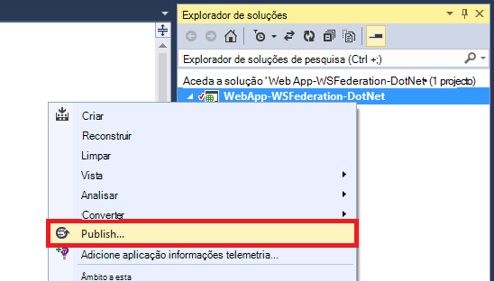

2. Selecione a **Aplicação de serviço do Microsoft Azure**.
3. Se ainda não tiver sessão iniciada no Azure, clique em **Iniciar sessão** e utilizar a conta Microsoft para a sua subscrição Azure para iniciar sessão.
4. Assim que iniciar sessão, clique em **Novo** para criar uma aplicação web.
5. Preencha todos os campos obrigatórios. Passar para ligar a no local dados mais tarde, para que não o criar uma base de dados para esta aplicação web.

    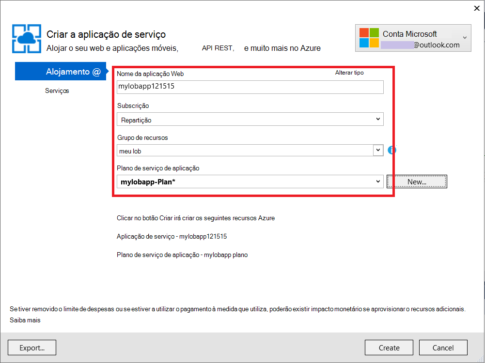

6. Clique em **Criar**. Quando a aplicação web estiver criada, é aberta a caixa de diálogo Publicar Web.
7. No **URL de destino**, altere **http** por **https**. Copie o URL completo para um editor de texto para utilizar posteriormente. Em seguida, clique em **Publicar**.

    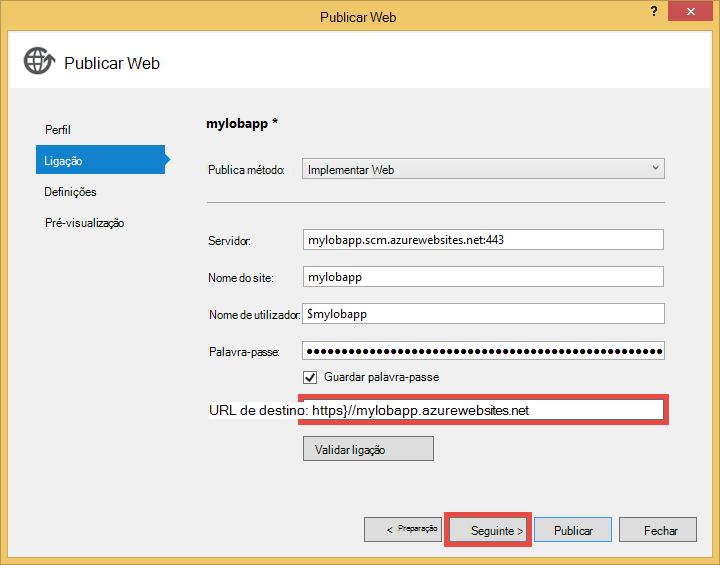

11. No Visual Studio, abra **Web.Release.config** no projeto. Inserir o XML seguinte para o `<configuration>` tag e substitua o valor de chave do URL do seu publicar web app.  
    <pre class="prettyprint">
&lt;appSettings&gt;
   &lt;Adicionar chave = valor de "ida: RPIdentifier" = "<mark>[, por exemplo, https://mylobapp.azurewebsites.net/]</mark>" xdt:Transform = "SetAttributes" xdt:Locator="Match(key)" /&gt;
&lt;/appSettings&gt;</pre>

Quando terminar, tem duas identificadores RP configurados no seu projeto, uma para o seu ambiente de depuração no Visual Studio e outra para a aplicação web publicada no Azure. Irá configurar uma fidedignidade RP para cada um dos dois ambientes no AD FS. Durante a depuração, as definições de aplicação no Web. config são utilizadas para criar a sua configuração **Depurar** trabalhar com o AD FS. Quando é publicado (por predefinição, é publicada a configuração do **lançamento** ), que incorpora as alterações de definição de aplicação no Web.Release.config é carregado um Web. config transformados com logaritmos.

Se pretender anexar a aplicação web publicada no Azure para o depurador (ou seja, terá de carregar símbolos de depuração do código na aplicação web publicada), pode criar um clonar da configuração do depuração para depuração Azure, mas com as suas próprias transformação Web. config personalizada (por exemplo, Web.AzureDebug.config) utiliza as definições de aplicação a partir do Web.Release.config. Esta opção permite-lhe manter uma configuração estático em diferentes ambientes.

## Configurar dependente festa fidedignidades na gestão do AD FS ##

Agora, precisa de configurar uma fidedignidade RP na gestão do AD FS antes de poder utilizar a aplicação de exemplo e realmente autenticar com o AD FS. Terá de configurar o duas fidedignidades RP separadas, uma para o seu ambiente de depuração e outra para a sua aplicação web publicada.

> [AZURE.NOTE] Certifique-se de que repita os passos seguintes para ambos os ambientes.

4.  No servidor ADFS, inicie sessão com as credenciais possui direitos de gestão de AD FS.
5.  Abra a gestão do AD FS. Com o botão direito **AD FS\Trusted Relationships\Relying festa fidedignidades** e selecione **Adicionar confiar festa de fidedignidade**.

    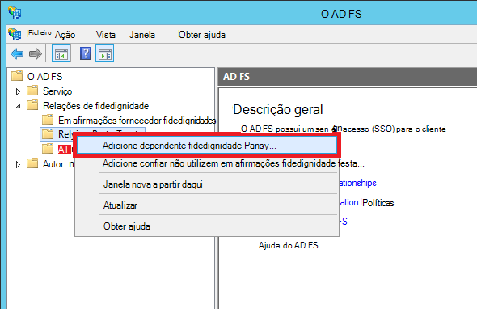

5.  Na página **Selecionar origem de dados** , selecione a **introduzir dados sobre parte dependente manualmente**. 

    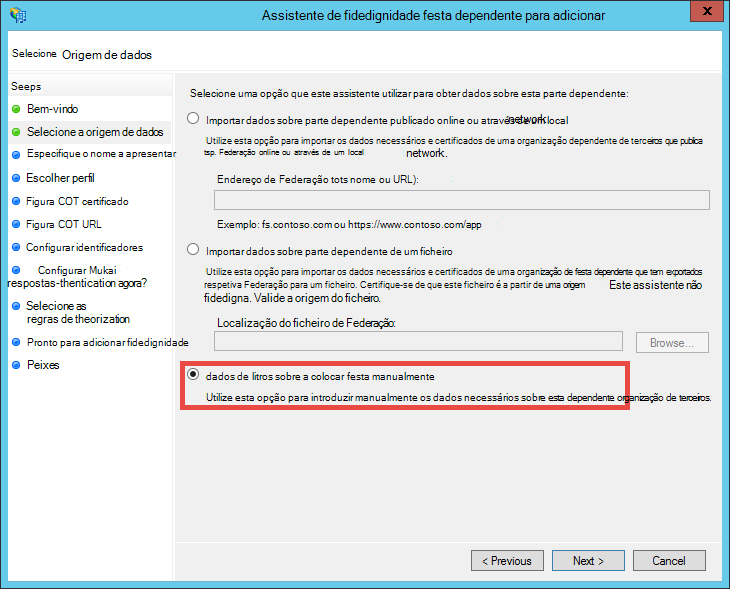

6.  Na página **Especificar nome a apresentar** , escreva um nome a apresentar para a aplicação e clique em **seguinte**.
7.  Na página **Escolher protocolo** , clique em **seguinte**.
8.  Na página **Configurar o certificado** , clique em **seguinte**.

    > [AZURE.NOTE] Uma vez que deve utilizar HTTPS já, tokens encriptadas são opcionais. Se realmente quiser encriptar tokens a partir do AD FS nesta página, tem de adicionar lógica desencriptar token no seu código. Para mais informações, consulte o artigo [configurar manualmente o software OWIN WS-Federation intermédio e aceitar tokens encriptadas](http://chris.59north.com/post/2014/08/21/Manually-configuring-OWIN-WS-Federation-middleware-and-accepting-encrypted-tokens.aspx).
  
5.  Antes de mover para o próximo passo, tem uma peça de informação a partir do seu projeto do Visual Studio. Nas propriedades do projeto, tenha em atenção o **URL de SSL** da aplicação. 

    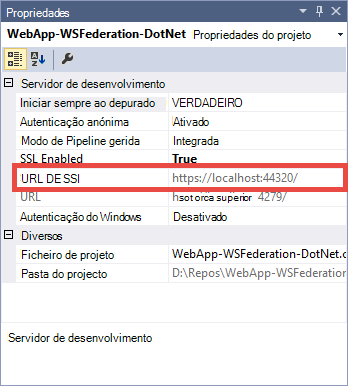

6.  Novamente na AD FS gestão, na página **Configurar o URL** da **Confiar festa confiar Assistente para adicionar**, selecione **Ativar o suporte para o protocolo WS Federation passivas** em, escreva o URL de SSL do seu projeto do Visual Studio que anotou no passo anterior. Em seguida, clique em **seguinte**.

    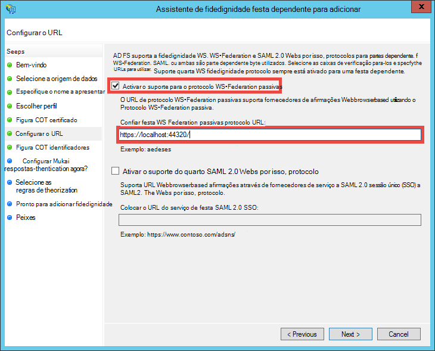

    > [AZURE.NOTE] URL especifica onde enviar o cliente após ser bem sucedida de autenticação. Para o ambiente de depuração, devem ser <code>https://localhost:&lt;port&gt;/</code>. Para a aplicação web publicada, deverá ser o URL da aplicação web.

7.  Na página **Configurar identificadores** , verifique se o seu projeto SSL URL já está listado e clique em **seguinte**. Clique em **seguinte** tudo para o fim do assistente com seleções predefinido.

    > [AZURE.NOTE] No App_Start\Startup.Auth.cs do seu projeto do Visual Studio, este identificador é comparado com o valor de <code>WsFederationAuthenticationOptions.Wtrealm</code> durante a autenticação federada. Por predefinição, o URL da aplicação a partir do passo anterior é adicionado como um identificador RP.

8.  Agora tiver concluído a configurar a aplicação de RP para o seu projeto no AD FS. Em seguida, pode configura esta aplicação para enviar as afirmações necessárias a sua aplicação. A caixa de diálogo **Editar regras afirmação** é aberta por predefinição para si no final do Assistente para que possa começar imediatamente. Vamos configurar, pelo menos, as seguintes afirmações (com os esquemas entre parênteses):

    -   Nome (http://schemas.xmlsoap.org/ws/2005/05/identity/claims/name -) utilizado pelo ASP.NET para hidratado `User.Identity.Name`.
    -   Nome principal de utilizador (http://schemas.xmlsoap.org/ws/2005/05/identity/claims/upn) - utilizado para identificar exclusivamente os utilizadores na organização.
    -   Os membros do grupo como funções (http://schemas.microsoft.com/ws/2008/06/identity/claims/role) - pode ser utilizada com `[Authorize(Roles="role1, role2,...")]` decoração autorizar controladores/ações. Na realidade, esta abordagem, poderá não estar a maioria dos performant de autorização de função. Se os utilizadores de AD pertencerem a centenas de grupos de segurança, tornam-se centenas de afirmações função no token de SAML. Uma abordagem alternativa consiste em enviar um pedido de única função condicionalmente consoante a associação do utilizador de um determinado grupo. No entanto, podemos irá mantenha-a simples para este tutorial.
    -   Atribuir um nome ID (http://schemas.xmlsoap.org/ws/2005/05/identity/claims/nameidentifier) - podem ser utilizados para anti-falsificação validação. Para mais informações sobre como para torná-lo a trabalhar com a validação de anti-falsificação, consulte a secção **Adicionar linha de negócio funcionalidade** de [criar um linha de negócio Azure aplicação com a autenticação do Azure Active Directory](web-sites-dotnet-lob-application-azure-ad.md#bkmk_crud).

    > [AZURE.NOTE] Os tipos de afirmação tem de configurar para a aplicação é determinada pela necessidades da sua aplicação. Para a lista de afirmações suportado por aplicações do Azure Active Directory (ou seja, RP fidedignidades), por exemplo, consulte o artigo [Token suportados e os tipos de afirmações](http://msdn.microsoft.com/library/azure/dn195587.aspx).

8.  Na caixa de diálogo Editar afirmação regras, clique em **Adicionar regra**.
9.  Configure os nome, UPN e função afirmações conforme apresentado na captura de ecrã e clique em **Concluir**.

    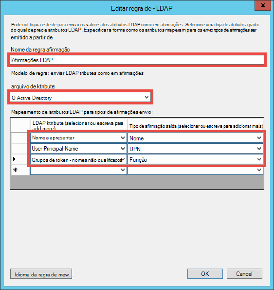

    Em seguida, pode criar nomes breves ID reclamar através dos passos demonstrados nos [Identificadores de nome na declarações SAML](http://blogs.msdn.com/b/card/archive/2010/02/17/name-identifiers-in-saml-assertions.aspx).

9.  Clique novamente em **Adicionar regra** .
10. Selecione **Enviar em afirmações através de uma regra personalizada** e clique em **seguinte**.
11. Cole o seguinte idioma regra na caixa **regra personalizada** , atribua um nome a regra **Por identificador da sessão** e clique em **Concluir**.  
    <pre class="prettyprint">
    C1: [tipo = = "http://schemas.microsoft.com/ws/2008/06/identity/claims/windowsaccountname"] &amp; &amp; 
    c2: [tipo = = "http://schemas.microsoft.com/ws/2008/06/identity/claims/authenticationinstant"] = > Adicionar (armazenar = "_OpaqueIdStore", tipos de = ("<mark>http://contoso.com/internal/sessionid</mark>"), consulta = "{0}; { 1}; {2}; {3}; {4} ", param ="useEntropy"param = c1. Valor, param = c1. OriginalIssuer, param = "", param = c2. Valor)
    </pre>

    A regra personalizada deve aspeto esta captura de ecrã:

    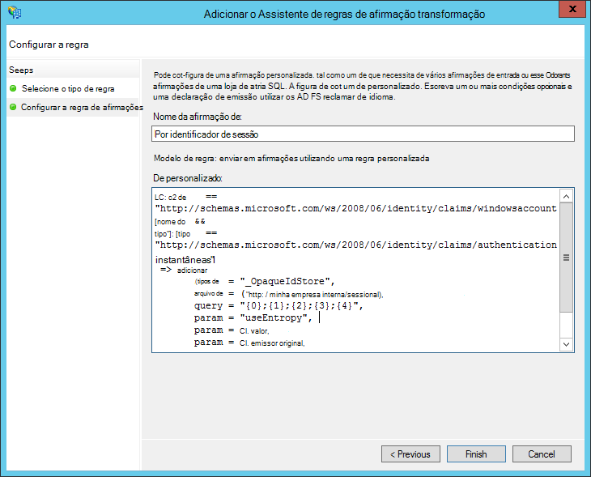

9.  Clique novamente em **Adicionar regra** .
10. Selecione **transformar uma afirmação de entrada** e clique em **seguinte**.
11. Configurar a regra conforme apresentado na captura de ecrã (utilizando o tipo de afirmação que criou na regra personalizada) e clique em **Concluir**.

    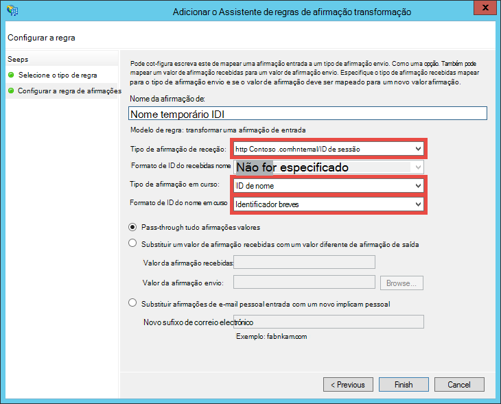

    Para obter informações detalhadas sobre os passos para o pedido de ID do nome temporário, consulte o artigo [Identificadores de nome na declarações SAML](http://blogs.msdn.com/b/card/archive/2010/02/17/name-identifiers-in-saml-assertions.aspx).

12. Na caixa de diálogo **Editar afirmação regras** , clique em **Aplicar** . Agora deverá ter aspeto como a captura de ecrã seguinte:

    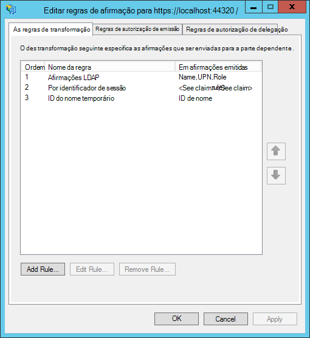

    > [AZURE.NOTE] Novamente, certifique-se de que repita estes passos para o seu ambiente de depuração e a aplicação web publicada.

## Testar federada autenticação para a sua aplicação

Está pronto para testar a lógica de autenticação da sua aplicação contra AD FS. No meu ambiente de teste do AD FS, tenho um utilizador de teste que pertence a um grupo de teste no Active Directory (AD).

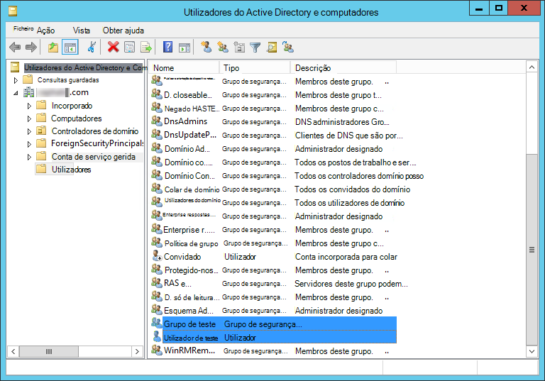

Para testar a autenticação no depurador, tudo o que precisa de fazer agora é tipo `F5`. Se pretende testar autenticação na aplicação web publicada, navegue para o URL.

Depois de ser carregado a aplicação web, clique em **Iniciar sessão**. Agora deve obter uma caixa de diálogo de início de sessão ou a página de início de sessão fornecido pelo AD FS, dependendo do método de autenticação escolhido pelo AD FS. Eis o que posso obter no Internet Explorer 11.

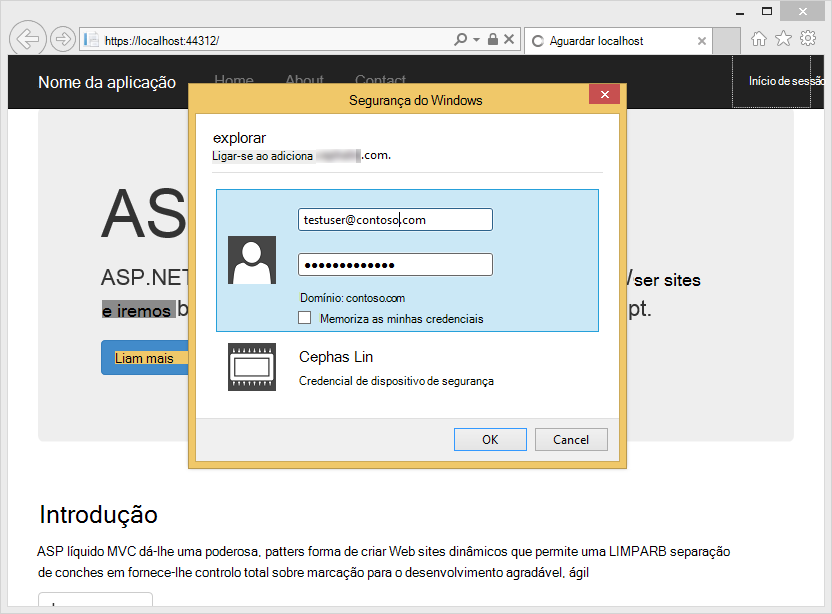

Uma vez que iniciar sessão com um utilizador no domínio de AD da implementação do AD FS, deverá agora visualizar na home page do novamente com **Olá, <User Name>!** no canto. Eis o que posso obter.

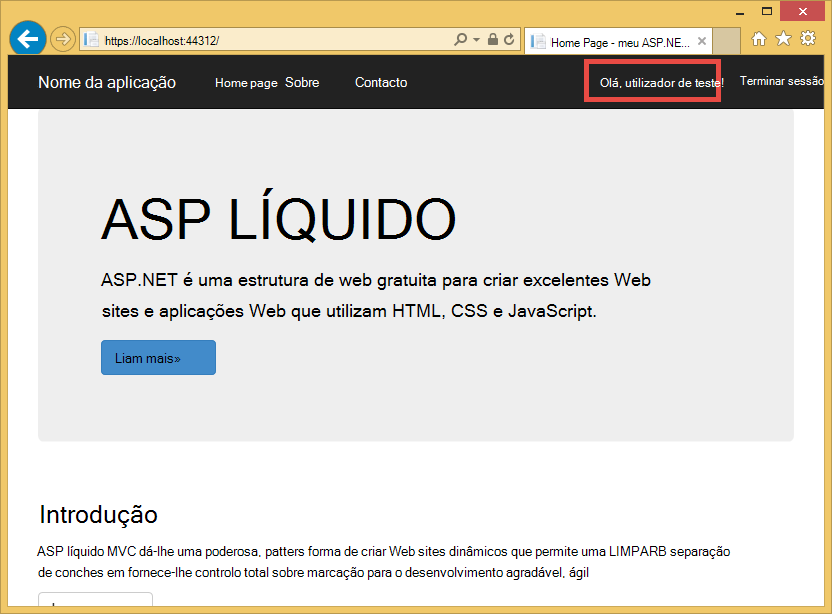

Até ao momento, tenha teve êxito das seguintes formas:

- A aplicação com êxito atingiu o AD FS e um identificador RP correspondência for encontrado da base de dados do AD FS
- O AD FS tem autenticados com êxito um utilizador do AD e redirecionar que lhe acesso novamente à home page da aplicação
- O AD FS como enviada com êxito a afirmação de nome (http://schemas.xmlsoap.org/ws/2005/05/identity/claims/name) à aplicação, como indicado pelo facto de que o nome de utilizador é apresentado no canto. 

Se a afirmação de nome estiver em falta, teria viu **Olá,!**. Se observe Views\Shared\_LoginPartial.cshtml, encontrar que utiliza `User.Identity.Name` para apresentar o nome de utilizador. Tal como mencionado anteriormente, se a afirmação de nome do utilizador autenticado está disponível no token de SAML, ASP.NET hidratos esta propriedade com o mesmo. Para ver todas as afirmações que são enviadas pelo AD FS, coloca um ponto de interrupção no Controllers\HomeController.cs, o método de ação de índice remissivo. Depois do utilizador é autenticado, inspecionar a `System.Security.Claims.Current.Claims` coleções de sites.

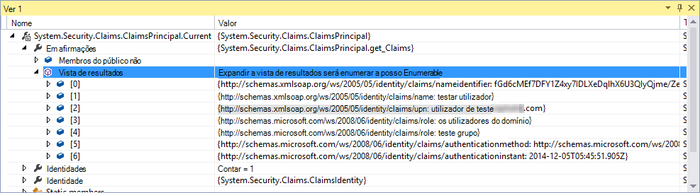 

## Autorize utilizadores para controladores específicas ou ações

Uma vez que tiver incluído membros do grupo como função afirmações na configuração fidedignidade RP, agora pode utilizá-los diretamente na `[Authorize(Roles="...")]` decoração para os controladores e ações. Numa aplicação de linha de negócio com o padrão de criar-leitura actualizar eliminar (CRUD), pode autorizar funções específicas para aceder a cada ação. Por agora, serão de experimentar apenas esta funcionalidade no controlador de base existente.

1. Abra Controllers\HomeController.cs.
2. Decorar a `About` e `Contact` métodos de ação semelhantes ao seguinte código com segurança associações que o utilizador autenticado tem a grupos.  
    <pre class="prettyprint">
    <mark>[Autorizar (funções = "Grupo de teste")]</mark> 
    público ActionResult About() {ViewBag.Message = "Da aplicação descrição page.";

        return View();
    }

    <mark>[Autorizar (funções = "Domain Admins")]</mark> 
    público ActionResult Contact() {ViewBag.Message = "Da contacto page.";

        return View();
    }  </pre>

    Dado que adicionou **Testar utilizador** ao **Grupo de teste** no meu ambiente de teste do AD FS, irá utilizar o grupo de teste para testar a autorização no `About`. Para `Contact`, irá testar o negativa para maiúsculas/minúsculas **Domain Admins**, a que não pertence a este **Utilizador testar** .

3. Inicie o depurador escrevendo `F5` e iniciar sessão, em seguida, clique em **Acerca**de. Deverá agora estar a ver a `~/About/Index` de página com êxito, se o utilizador autenticado está autorizado para essa ação.
4. Agora, clique em **contacto**, que no meu caso não deve autorizar **Utilizador de teste** para a ação. No entanto, o browser é redirecionado para AD FS, eventualmente mostre esta mensagem:

    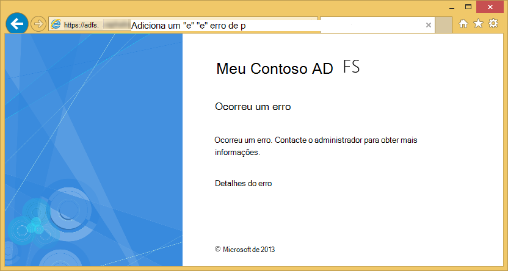

    Se a investigar este erro no Visualizador de eventos no servidor do AD FS, verá esta mensagem de exceção:  
    <pre class="prettyprint">
   Microsoft.IdentityServer.Web.InvalidRequestException: MSIS7042: <mark>mesma sessão de browser do cliente fez pedidos '6' nos últimos '11' segundos.</mark> Contacte o administrador para obter detalhes.
   em Microsoft.IdentityServer.Web.Protocols.PassiveProtocolHandler.UpdateLoopDetectionCookie (WrappedHttpListenerContext contexto) na Microsoft.IdentityServer.Web.Protocols.WSFederation.WSFederationProtocolHandler.SendSignInResponse (WSFederationContext contexto, resposta de MSISSignInResponse) na Microsoft.IdentityServer.Web.PassiveProtocolListener.ProcessProtocolRequest (ProtocolContext protocolContext, PassiveProtocolHandler protocolHandler) na Microsoft.IdentityServer.Web.PassiveProtocolListener.OnGetContext (WrappedHttpListenerContext contexto) </pre>

    O motivo para este erro é que por predefinição, MVC devolve um não autorizado 401 quando não estão autorizadas funções de um utilizador. Isto accionadores um pedido de consome para o seu fornecedor de identidade (AD FS). Uma vez que o utilizador já é autenticado, AD FS devolve à mesma página, em seguida, emite 401 outra, criação de um ciclo de redirecionamento. Irá substituir do AuthorizeAttribute `HandleUnauthorizedRequest` método com lógica simple para mostrar algo que faça sentido em vez de continuar o ciclo de redirecionamento.

5. Criar um ficheiro do projeto denominado AuthorizeAttribute.cs e cole o código seguinte na mesma.

        using System;
        using System.Web.Mvc;
        using System.Web.Routing;
        
        namespace WebApp_WSFederation_DotNet
        {
            [AttributeUsage(AttributeTargets.Class | AttributeTargets.Method, Inherited = true, AllowMultiple = true)]
            public class AuthorizeAttribute : System.Web.Mvc.AuthorizeAttribute
            {
                protected override void HandleUnauthorizedRequest(AuthorizationContext filterContext)
                {
                    if (filterContext.HttpContext.Request.IsAuthenticated)
                    {
                        filterContext.Result = new System.Web.Mvc.HttpStatusCodeResult((int)System.Net.HttpStatusCode.Forbidden);
                    }
                    else
                    {
                        base.HandleUnauthorizedRequest(filterContext);
                    }
                }
            }
        }

    O código de substituição envia uma 403 HTTP (proibido) em vez de HTTP 401 (não autorizado) no autenticados mas não autorizados casos.

6. Executar o depurador novamente com `F5`. Clicar em **contacto** agora mostra uma mensagem de erro mais informativa (embora atractiva):

    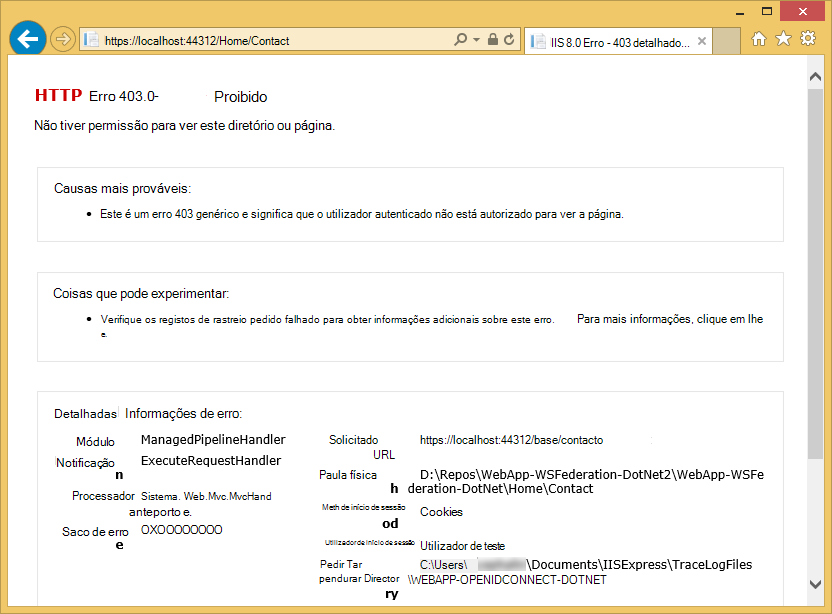

7. Publicar novamente a aplicação ao Azure aplicação de serviço Web Apps e testar o comportamento da aplicação direto.

## Ligar a dados no local

Um motivo que iria pretende implementar a aplicação de linha de negócio com o AD FS em vez do Azure Active Directory é problemas de conformidade com a manutenção organização dados desativar local. Isto poderá também significa que a aplicação web do Azure tem aceder a bases de dados no local, uma vez que não são permitidas para utilizar a [Base de dados SQL](/services/sql-database/) como a camada de dados para as suas aplicações web.

Azure aplicação de serviço Web Apps suporta aceder a bases de dados no local com duas abordagens: [Híbrido ligações](../biztalk-services/integration-hybrid-connection-overview.md) e [Redes virtuais](web-sites-integrate-with-vnet.md). Para obter mais informações, consulte o artigo [utilizar VNET integração e ligações de híbrida com o Azure aplicação de serviço Web Apps](https://azure.microsoft.com/blog/2014/10/30/using-vnet-or-hybrid-conn-with-websites/).

## Mais recursos

- [Proteger a aplicação com SSL e o atributo autorizar](web-sites-dotnet-deploy-aspnet-mvc-app-membership-oauth-sql-database.md#protect-the-application-with-ssl-and-the-authorize-attribute)
- [Autenticar com o Active Directory no local na sua aplicação do Azure](web-sites-authentication-authorization.md)
- [Criar uma aplicação de Azure de linha de negócio com a autenticação do Azure Active Directory](web-sites-dotnet-lob-application-azure-ad.md)
- [Utilizar a opção de autenticação organizacional no local (ADFS) com ASP.NET no Visual Studio 2013](http://www.cloudidentity.com/blog/2014/02/12/use-the-on-premises-organizational-authentication-option-adfs-with-asp-net-in-visual-studio-2013/)
- [Migrar um projecto da Web VS2013 de WIF para Katana](http://www.cloudidentity.com/blog/2014/09/15/MIGRATE-A-VS2013-WEB-PROJECT-FROM-WIF-TO-KATANA/)
- [Descrição geral de serviços de Federação do Active Directory](http://technet.microsoft.com/library/hh831502.aspx)
- [Especificação WS Federation 1.1](http://download.boulder.ibm.com/ibmdl/pub/software/dw/specs/ws-fed/WS-Federation-V1-1B.pdf?S_TACT=105AGX04&S_CMP=LP)

