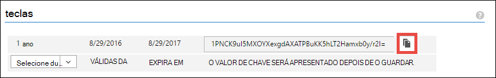
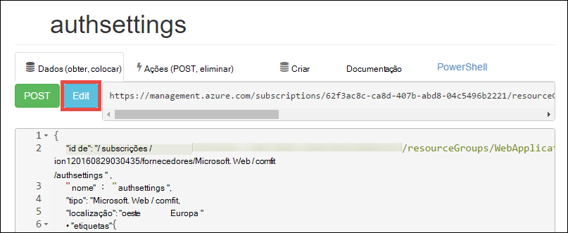

<properties 
    pageTitle="Criar uma aplicação de Azure de linha de negócio com a autenticação do Azure Active Directory | Microsoft Azure" 
    description="Saiba como criar uma aplicação de linha de negócio ASP.NET MVC no Azure aplicação de serviço que autentica com o Azure Active Directory" 
    services="app-service\web, active-directory" 
    documentationCenter=".net" 
    authors="cephalin" 
    manager="wpickett" 
    editor=""/>

<tags 
    ms.service="app-service-web" 
    ms.devlang="dotnet" 
    ms.topic="article" 
    ms.tgt_pltfrm="na" 
    ms.workload="web" 
    ms.date="09/01/2016" 
    ms.author="cephalin"/>

# Criar uma aplicação de Azure de linha de negócio com a autenticação do Azure Active Directory #

Este artigo mostra-lhe como criar uma aplicação de linha de negócio .NET no [Azure aplicação de serviço Web Apps](http://go.microsoft.com/fwlink/?LinkId=529714) utilizando o [autenticação / autorização](../app-service/app-service-authentication-overview.md) funcionalidade. Também mostra como utilizar a [API do Azure Active Directory Graph](https://msdn.microsoft.com/Library/Azure/Ad/Graph/api/api-catalog) para dados da consulta diretório na aplicação.

O inquilino do Azure Active Directory que utilizar pode ser um directory só Azure. Em alternativa, pode ser [sincronizado com o Active Directory no local](../active-directory/active-directory-aadconnect.md) para criar uma experiência de início de sessão único para os trabalhadores que estão no local e dados remotos. Este artigo utiliza o directório predefinido para a sua conta Azure.

## O que irá criar ##

Vai criar uma aplicação de criar-leitura actualizar eliminar (CRUD) de linha de negócio simples na aplicação de serviço Web Apps que controla os itens com as seguintes funcionalidades de trabalho:

- Autentica utilizadores contra Azure Active Directory
- Consultas utilizadores e grupos directory utilizando [Azure Active Directory Graph API](http://msdn.microsoft.com/library/azure/hh974476.aspx)
- Utilizar o modelo de ASP.NET MVC *Sem autenticação*

Se precisar de controlo de acesso baseado em funções (RBCA) para a sua aplicação de linha de negócio no Azure, consulte o [Passo seguinte](#next).

## O que precisa ##

[AZURE.INCLUDE [free-trial-note](../../includes/free-trial-note.md)]

Tem o seguinte procedimento para concluir este tutorial:

- Um inquilino do Azure Active Directory com utilizadores em vários grupos
- Permissões para criar aplicações no inquilino Azure Active Directory
- Visual Studio 2013 atualização 4 ou posterior
- [Azure SDK 2.8.1 ou posterior](https://azure.microsoft.com/downloads/)

## Criar e implementar uma aplicação web do Azure ##

1. A partir do Visual Studio, clique em **ficheiro** > **Novo** > **projeto**.

2. Selecione a **Aplicação Web do ASP.NET**, nome do seu projeto e clique em **OK**.

3. Selecione o modelo **MVC** , em seguida, alterar a autenticação para **Não**. Certifique-se de **que anfitrião na nuvem** está selecionada e clique em **OK**.

    

4. Na caixa de diálogo **Criar aplicação de serviço** , clique em **Adicionar uma conta** (e, em seguida, **Adicionar uma conta** na lista pendente) para iniciar sessão na sua conta Azure.

5. Assim que tiver sessão iniciada na configure a sua aplicação web. Crie um grupo de recursos e um novo plano de serviço de aplicação ao clicar no botão **Novo** respectivo. Clique em **explorar serviços Azure adicionais** para continuar.

    

6. No separador **Serviços** , clique em **+** para adicionar uma base de dados do SQL para a sua aplicação. 

    

7. No **SQL configurar base de dados**, clique em **Novo** para criar uma instância do SQL Server.

8. Em **Configurar o SQL Server**, configure o seu instância do SQL Server. Em seguida, clique em **OK**, **OK**e **Criar** para iniciar a criação de aplicação no Azure.

9. No **Azure actividade de serviço de aplicação**, pode ver quando termina a criação de aplicação. Clique em * *publicar &lt; *nome*> para esta aplicação Web agora**em seguida, clique em **publicar * *. 

    Assim que tiver terminado de Visual Studio, é aberta a aplicação de publicar no browser. 

    

## Configurar o acesso de autenticação e de diretório

1. Inicie a sessão [portal do Azure](https://portal.azure.com).

2. No menu à esquerda, clique em **Serviços de aplicação** > **&lt;*nome*>** > **autenticação / autorização * *.

    

3. Ative a autenticação do Azure Active Directory ao clicar **na** > **Azure Active Directory** > **Express** > **OK**.

    

4. Clique em **Guardar** na barra de comandos.

    

    Assim que as definições de autenticação são guardadas com êxito, tente navegar para a sua aplicação novamente no browser. As predefinições impõem a autenticação a aplicação completa. Se já não tiver sessão iniciada, são redirecionado para um ecrã de início de sessão. Assim que tiver sessão iniciada, verá a aplicação protegida por HTTPS. Em seguida, tem de ativar o acesso a dados de diretório. 

5. Navegue para o [portal clássica](https://manage.windowsazure.com).

6. No menu à esquerda, clique em **Active Directory** > **Predefinido diretório** > **aplicações** > **&lt;*nome*> * *.

    

    Esta é a aplicação do Azure Active Directory que aplicação de serviço criada para si para ativar a autorização / funcionalidade de autenticação.

7. Clique em **utilizadores** e **grupos** para se certificar de que tem alguns utilizadores e grupos no diretório. Caso não esteja, crie alguns utilizadores de teste e grupos.

    

7. Clique em **Configurar** para configurar esta aplicação.

8. Desloque para baixo para a secção **chaves** e adicione uma chave ao selecionar uma duração. Em seguida, clique em **Permissões do delegado** e selecione **Ler diretório dados**. Clique em **Guardar**.

    

8. Assim que as definições são guardadas, desloque-se até a secção **chaves** e clique no botão **Copiar** para copiar a chave de cliente. 

    

    >[AZURE.IMPORTANT] Se navegar ausente esta página agora, não poderá aceder a esta chave de cliente nunca novamente.

9. Em seguida, tem de configurar a sua aplicação web com esta chave. Inicie sessão no [Azure recurso Explorer](https://resources.azure.com) com a sua conta Azure.

10. Na parte superior da página, clique em **Leitura/escrita** para efetuar alterações no Explorador de recursos do Azure.

    

11. Localizar as definições de autenticação para a sua aplicação, que se encontra no subscrições > * *&lt;*subscriptionname*>** > **resourceGroups** > **&lt;*resourcegroupname*>** > **fornecedores** > **Microsoft.Web** > **sites** > **&lt;*nome*>** > **config** > **authsettings * *.

12. Clique em **Editar**.

    

13. No painel de edição, defina o `clientSecret` e `additionalLoginParams` propriedades da seguinte forma.

        ...
        "clientSecret": "<client key from the Azure Active Directory application>",
        ...
        "additionalLoginParams": ["response_type=code id_token", "resource=https://graph.windows.net"],
        ...

14. Clique em **colocar** na parte superior para submeter as alterações.

    

14. Agora, para testar se tiver o token de autorização para aceder a API Azure Active Directory Graph, basta navegar para * *https://&lt;*nome*>.azurewebsites.net/.auth/me** no seu browser. Se tiver configurado tudo corretamente, deverá ver o `access_token` propriedade na resposta JSON.

    O `~/.auth/me` caminho de URL é gerido pela aplicação do serviço de autenticação / autorização para dar-lhe todas as informações relacionadas com a sua sessão autenticado. Para mais informações, consulte o artigo [autenticação e autorização na aplicação de serviço de Azure](../app-service/app-service-authentication-overview.md).

    >[AZURE.NOTE] O `access_token` tem um período de expiração. No entanto, autenticação do serviço de aplicação / autorização fornece a funcionalidade de atualização token com `~/.auth/refresh`. Para obter mais informações sobre como utilizá-lo, consulte o artigo     [Arquivo de tokens de serviço de aplicação](https://cgillum.tech/2016/03/07/app-service-token-store/).

Em seguida, que irá fazer algo útil com dados de diretório.

## Adicionar funcionalidades de linha de negócio para a sua aplicação

Agora, criar um controlador de itens de trabalho CRUD simple.  

5.  Na pasta ~\Models, crie um ficheiro de classe chamado WorkItem.cs e substituir `public class WorkItem {...}` com o seguinte código:

        using System.ComponentModel.DataAnnotations;

        public class WorkItem
        {
            [Key]
            public int ItemID { get; set; }
            public string AssignedToID { get; set; }
            public string AssignedToName { get; set; }
            public string Description { get; set; }
            public WorkItemStatus Status { get; set; }
        }

        public enum WorkItemStatus
        {
            Open,
            Investigating,
            Resolved,
            Closed
        }

7.  Crie o projecto para tornar o seu novo modelo acessível para a lógica andaimes no Visual Studio.

8.  Adicionar um novo item scaffolded `WorkItemsController` para a pasta ~\Controllers ( **controladores**do botão direito do rato, aponte para **Adicionar**e selecione **novo item scaffolded**). 

9.  Selecione o **Controlador de 5 MVC com vistas, através de estrutura de entidades** e clique em **Adicionar**.

10. Selecione o modelo que criou, em seguida, clique em **+** e, em seguida, **Adicionar** para adicionar um contexto de dados e, em seguida, clique em **Adicionar**.

    

14. Na ~\Views\WorkItems\Create.cshtml (um item automaticamente scaffolded), localize o `Html.BeginForm` método de ajuda e efetue as alterações realçadas seguintes:  
<pre class="prettyprint">
    @modelWebApplication1.Models.WorkItem

    @{ViewBag.Title = &quot;criar&quot;; }

    &lt;H2&gt;criar&lt;/h2&gt;

    @using(Html.BeginForm (<mark>&quot;criar&quot;, &quot;WorkItems&quot;, FormMethod.Post, novo {id = &quot;formulário principal&quot; }</mark>)) {@Html.AntiForgeryToken()

        &lt;div class=&quot;form-horizontal&quot;&gt;
            &lt;h4&gt;WorkItem&lt;/h4&gt;
            &lt;hr /&gt;
            @Html.ValidationSummary(true, &quot;&quot;, new { @class = &quot;text-danger&quot; })
            &lt;div class=&quot;form-group&quot;&gt;
                @Html.LabelFor(model =&gt; model.AssignedToID, htmlAttributes: new { @class = &quot;control-label col-md-2&quot; })
                &lt;div class=&quot;col-md-10&quot;&gt;
                    @Html.EditorFor(model =&gt; model.AssignedToID, new { htmlAttributes = new { @class = &quot;form-control&quot;<mark>, @type = &quot;hidden&quot;</mark> } })
                    @Html.ValidationMessageFor(model =&gt; model.AssignedToID, &quot;&quot;, new { @class = &quot;text-danger&quot; })
                &lt;/div&gt;
            &lt;/div&gt;

            &lt;div class=&quot;form-group&quot;&gt;
                @Html.LabelFor(model =&gt; model.AssignedToName, htmlAttributes: new { @class = &quot;control-label col-md-2&quot; })
                &lt;div class=&quot;col-md-10&quot;&gt;
                    @Html.EditorFor(model =&gt; model.AssignedToName, new { htmlAttributes = new { @class = &quot;form-control&quot; } })
                    @Html.ValidationMessageFor(model =&gt; model.AssignedToName, &quot;&quot;, new { @class = &quot;text-danger&quot; })
                &lt;/div&gt;
            &lt;/div&gt;

            &lt;div class=&quot;form-group&quot;&gt;
                @Html.LabelFor(model =&gt; model.Description, htmlAttributes: new { @class = &quot;control-label col-md-2&quot; })
                &lt;div class=&quot;col-md-10&quot;&gt;
                    @Html.EditorFor(model =&gt; model.Description, new { htmlAttributes = new { @class = &quot;form-control&quot; } })
                    @Html.ValidationMessageFor(model =&gt; model.Description, &quot;&quot;, new { @class = &quot;text-danger&quot; })
                &lt;/div&gt;
            &lt;/div&gt;

            &lt;div class=&quot;form-group&quot;&gt;
                @Html.LabelFor(model =&gt; model.Status, htmlAttributes: new { @class = &quot;control-label col-md-2&quot; })
                &lt;div class=&quot;col-md-10&quot;&gt;
                    @Html.EnumDropDownListFor(model =&gt; model.Status, htmlAttributes: new { @class = &quot;form-control&quot; })
                    @Html.ValidationMessageFor(model =&gt; model.Status, &quot;&quot;, new { @class = &quot;text-danger&quot; })
                &lt;/div&gt;
            &lt;/div&gt;

            &lt;div class=&quot;form-group&quot;&gt;
                &lt;div class=&quot;col-md-offset-2 col-md-10&quot;&gt;
                    &lt;input type=&quot;submit&quot; value=&quot;Create&quot; class=&quot;btn btn-default&quot;<mark> id=&quot;submit-button&quot;</mark> /&gt;
                &lt;/div&gt;
            &lt;/div&gt;
        &lt;/div&gt;
    }

    &lt;div&gt;
    @Html.ActionLink(&quot;regressar à lista&quot;, &quot;índice&quot;) &lt;/div    &gt;

    @sectionScripts { @Scripts.Render( &quot;~/bundles/jqueryval&quot;)     <mark> &lt;script&gt; 
     / / código de selecionador de pessoas/grupo var maxResultsPerPage = 14;         var entrada = document.getElementById (&quot;AssignedToName&quot;);

            // Access token from request header, and tenantID from claims identity
            var token = &quot;@Request.Headers[&quot;X-MS-TOKEN-AAD-ACCESS-TOKEN&quot;]&quot;;
            var tenant =&quot;@(System.Security.Claims.ClaimsPrincipal.Current.Claims
                            .Where(c => c.Type == &quot;http://schemas.microsoft.com/identity/claims/tenantid&quot;)
                            .Select(c => c.Value).SingleOrDefault())&quot;;

            var picker = new AadPicker(maxResultsPerPage, input, token, tenant);

            // Submit the selected user/group to be asssigned.
            $(&quot;#submit-button&quot;).click({ picker: picker }, function () {
                if (!picker.Selected())
                    return;
                $(&quot;#main-form&quot;).get()[0].elements[&quot;AssignedToID&quot;].value = picker.Selected().objectId;
            });
        &lt;/script&gt;</mark>
    }
    </pre>
    
    Tenha em atenção que `token` e `tenant` são utilizadas pela `AadPicker` objeto para efetuar chamadas do Azure Active Directory Graph API. Terá de adicionar `AadPicker` mais tarde.   
    
    >[AZURE.NOTE] Apenas também pode obter `token` e `tenant` a partir do lado do cliente com `~/.auth/me`, mas esse seria uma chamada de servidor adicionais. Por exemplo:
    >  
    >     $.ajax({
    >         dataType: "json",
    >         url: "/.auth/me",
    >         success: function (data) {
    >             var token = data[0].access_token;
    >             var tenant = data[0].user_claims
    >                             .find(c => c.typ === 'http://schemas.microsoft.com/identity/claims/tenantid')
    >                             .val;
    >         }
    >     });
    
15. Efetue as alterações mesmo com ~ \Views\WorkItems\Edit.cshtml.

15. O `AadPicker` objeto está definido num script que precisa de adicionar ao seu projeto. Botão direito do rato na pasta ~\Scripts, aponte para **Adicionar**e clique em **ficheiro JavaScript**. Tipo de `AadPickerLibrary` para o nome do ficheiro e clique em **OK**.

16. Copie o conteúdo da [aqui](https://raw.githubusercontent.com/cephalin/active-directory-dotnet-webapp-roleclaims/master/WebApp-RoleClaims-DotNet/Scripts/AadPickerLibrary.js) para ~ \Scripts\AadPickerLibrary.js.

    Em script, o `AadPicker` objecto chama [Azure Active Directory Graph API](https://msdn.microsoft.com/Library/Azure/Ad/Graph/api/api-catalog) para procurar por utilizadores e grupos que correspondem a entrada de dados.  

17. ~\Scripts\AadPickerLibrary.js também utiliza o [widget de conclusão automática de IU jQuery](https://jqueryui.com/autocomplete/). Por isso, tem de adicionar jQuery IU ao seu projeto. Com o seu projeto no botão direito e clique em **Gerir pacotes de NuGet**.

18. No Gestor de NuGet pacote, clique em Procurar, escreva **jquery IU** na barra de pesquisa e clique em **jQuery.UI.Combined**.

    

19. No painel direito, clique em **instalar**, em seguida, clique em **OK** para continuar.

19. Abra ~\App_Start\BundleConfig.cs e efetue as alterações realçadas seguintes:  
    <pre class="prettyprint">
    RegisterBundles(BundleCollection bundles) void estático público {conjuntos. Adicionar (ScriptBundle novo (&quot;~/bundles/jquery&quot;). Incluir ( &quot;~/Scripts/jquery-{version}.js&quot;<mark>, &quot;~/Scripts/jquery-ui-{version}.js&quot;, &quot;~/Scripts/AadPickerLibrary.js&quot;</mark>));

        bundles.Add(new ScriptBundle(&quot;~/bundles/jqueryval&quot;).Include(
                    &quot;~/Scripts/jquery.validate*&quot;));

        // Use the development version of Modernizr to develop with and learn from. Then, when you&#39;re
        // ready for production, use the build tool at http://modernizr.com to pick only the tests you need.
        bundles.Add(new ScriptBundle(&quot;~/bundles/modernizr&quot;).Include(
                    &quot;~/Scripts/modernizr-*&quot;));

        bundles.Add(new ScriptBundle(&quot;~/bundles/bootstrap&quot;).Include(
                    &quot;~/Scripts/bootstrap.js&quot;,
                    &quot;~/Scripts/respond.js&quot;));

        bundles.Add(new StyleBundle(&quot;~/Content/css&quot;).Include(
                    &quot;~/Content/bootstrap.css&quot;,
                    &quot;~/Content/site.css&quot;<mark>,
                    &quot;~/Content/themes/base/jquery-ui.css&quot;</mark>));
    }
    </pre>

    Existem mais formas de performant gerir ficheiros JavaScript e CSS na sua aplicação. No entanto, para simplificar apenas vai integrados em conjuntos de que são carregados com todas as vistas.

12. Por fim, no ~ \Global.asax, adicione a linha seguinte do código do `Application_Start()` método. `Ctrl`+`.`cada erro resolução nomenclatura corrigi-lo.

        AntiForgeryConfig.UniqueClaimTypeIdentifier = ClaimTypes.NameIdentifier;
    
    > [AZURE.NOTE] Esta linha de código precisa de uma vez que utiliza o modelo predefinido do MVC <code>[ValidateAntiForgeryToken]</code> decoração em algumas das ações. Devido ao comportamento descrito por [Brock Allen](https://twitter.com/BrockLAllen) na     [MVC 4, AntiForgeryToken e em afirmações](http://brockallen.com/2012/07/08/mvc-4-antiforgerytoken-and-claims/) HTTP a sua mensagem poderá falhar anti-falsificação token validação porque:

    > - Azure Active Directory não enviar http://schemas.microsoft.com/accesscontrolservice/2010/07/claims/identityprovider, uma ferramenta necessária por predefinição pelo token de anti falsificação.
    > - Se o Azure Active Directory é directório sincronizado com o AD FS, a fidedignidade AD FS por predefinição não envia a afirmação http://schemas.microsoft.com/accesscontrolservice/2010/07/claims/identityprovider quer, embora pode configurar manualmente o AD FS para enviar o pedido.

    > `ClaimTypes.NameIdentifies`Especifica a afirmação `http://schemas.xmlsoap.org/ws/2005/05/identity/claims/nameidentifier`, que fornecem Azure Active Directory.  

20. Agora, publica as suas alterações. Com o botão direito do projeto e clique em **Publicar**.

21. Clique em **Definições**, certifique-se que existe uma cadeia de ligação à base de dados SQL, selecione a **Base de dados de actualização de** efetuar as alterações de esquema para o seu modelo e clique em **Publicar**.

    

22. No browser, navegue até à https://&lt;*nome*>.azurewebsites.net/workitems e clique em **Criar novo**.

23. Clique na caixa **AssignedToName** . Agora deverá ver utilizadores e grupos a partir do seu inquilino do Azure Active Directory numa lista pendente. Pode escrever para filtrar ou utilizar a `Up` ou `Down` tecla ou clique para selecionar o utilizador ou grupo. 

    

24. Clique em **Criar** para guardar as alterações. Em seguida, clique em **Editar** no item de trabalho criada a observar o mesmo comportamento.

Congrats, que é agora a executar uma aplicação de linha de negócio no Azure com acesso a directórios! Há muitas mais que pode fazer com a API do gráfico. Consulte o artigo [referência da API do Azure AD Graph](https://msdn.microsoft.com/library/azure/ad/graph/api/api-catalog).

## Passo seguinte

Se precisar de controlo de acesso baseado em funções (RBCA) para a sua aplicação de linha de negócio no azure, consulte o artigo [Web App-RoleClaims-DotNet](https://github.com/Azure-Samples/active-directory-dotnet-webapp-roleclaims) para uma amostra da equipa do Azure Active Directory. Mostra como ativar funções para a sua aplicação do Azure Active Directory e, em seguida, autorizar utilizadores com o `[Authorize]` decoração.

Se a sua aplicação de linha de negócio precisa de aceder a dados no local, consulte o artigo [Access no local recursos utilizando ligações de híbrido no Azure aplicação de serviço](web-sites-hybrid-connection-get-started.md).

## Mais recursos

- [Autenticação e autorização na aplicação de serviço do Azure](../app-service/app-service-authentication-overview.md)
- [Autenticar com o Active Directory no local na sua aplicação do Azure](web-sites-authentication-authorization.md)
- [Criar uma aplicação de linha de negócio no Azure com autenticação ADFS](web-sites-dotnet-lob-application-adfs.md)
- [Aplicação de serviço Auth e o grafo do Azure AD API](https://cgillum.tech/2016/03/25/app-service-auth-aad-graph-api/)
- [Exemplos do Microsoft Azure Active Directory e documentação](https://github.com/AzureADSamples)
- [Azure Active Directory suportadas Token e os tipos de afirmações](http://msdn.microsoft.com/library/azure/dn195587.aspx)

[Protect the Application with SSL and the Authorize Attribute]: web-sites-dotnet-deploy-aspnet-mvc-app-membership-oauth-sql-database.md#protect-the-application-with-ssl-and-the-authorize-attribute
