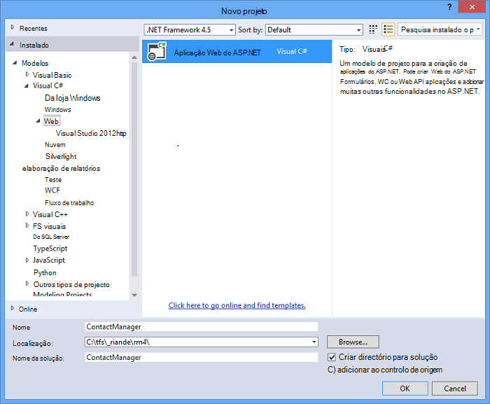
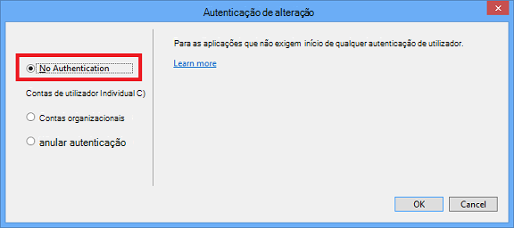
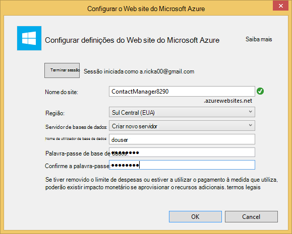
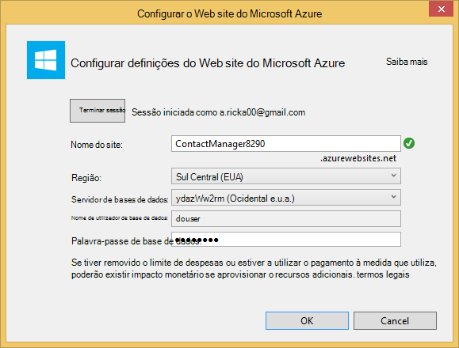
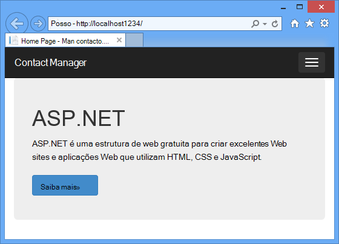
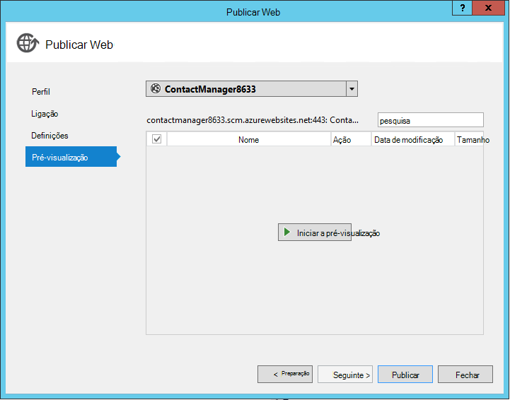
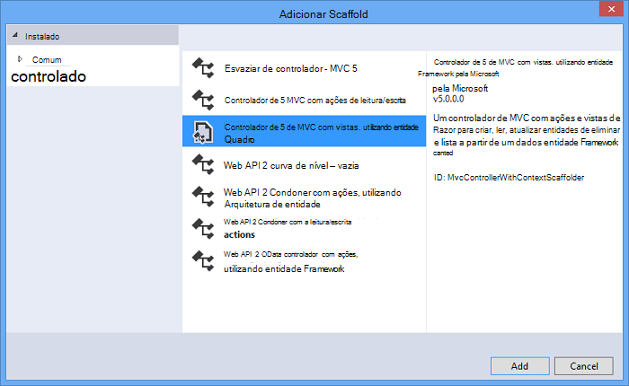
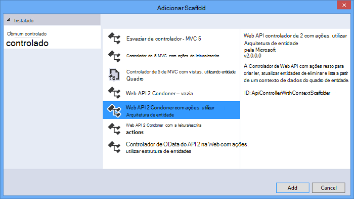
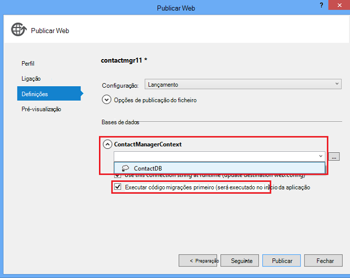

<properties 
    pageTitle="Criar um serviço de resto utilizar ASP.NET Web API e base de dados SQL Azure aplicação de serviço" 
    description="Tutorial que lhe ensina implementar uma aplicação que utiliza a API de Web do ASP.NET para uma aplicação Azure web utilizando o Visual Studio." 
    services="app-service\web" 
    documentationCenter=".net" 
    authors="Rick-Anderson" 
    writer="Rick-Anderson" 
    manager="wpickett" 
    editor=""/>

<tags 
    ms.service="app-service-web" 
    ms.workload="web" 
    ms.tgt_pltfrm="na" 
    ms.devlang="dotnet" 
    ms.topic="article" 
    ms.date="02/29/2016" 
    ms.author="riande"/>

# Criar um serviço de resto utilizar ASP.NET Web API e base de dados SQL Azure aplicação de serviço

Este tutorial mostra como implementar uma aplicação web do ASP.NET para uma [Aplicação de serviço de Azure](http://go.microsoft.com/fwlink/?LinkId=529714) utilizando o Assistente de Web publicar no Visual Studio 2013 ou no Visual Studio 2013 Comunidade Edition. 

Pode abrir uma conta Azure gratuitamente e, se ainda não tiver o Visual Studio 2013, o SDK instala automaticamente o Visual Studio 2013 para o Web Express. Por isso, pode começar a desenvolver para o Azure completamente para livre.

Neste tutorial assume que tem sem experiência prévia utilizando Azure. Em a concluir este tutorial, terá de uma aplicação web simples para cima e a execução de na nuvem.
 
Que vai aprender:

* Como permitir que o computador para o desenvolvimento Azure instalando o SDK do Azure.
* Como criar um projeto do Visual Studio o ASP.NET MVC 5 e publicá-lo a uma aplicação do Azure.
* Como utilizar a API de Web do ASP.NET para permitir chamadas à Restful API.
* Como utilizar uma base de dados do SQL para armazenar dados no Azure.
* Como publicar actualizações de aplicações no Azure.

Vai criar uma aplicação web de lista de contactos simples que é criada com base em ASP.NET MVC 5 e utiliza a arquitetura de entidade ADO.NET de acesso de base de dados. A ilustração seguinte mostra a aplicação concluída:

![captura de ecrã do web site][intro001]

<!-- the next line produces the "Set up the development environment" section as see at http://azure.microsoft.com/documentation/articles/web-sites-dotnet-get-started/ -->
[AZURE.INCLUDE [create-account-and-websites-note](../../includes/create-account-and-websites-note.md)]

### Criar o projecto

1. Inicie o Visual Studio 2013.
1. A partir do menu **ficheiro** , clique em **Novo projeto**.
3. Na caixa de diálogo **Novo projeto** , expanda **Visual c#** e selecione **Web** e, em seguida, selecione a **Aplicação Web do ASP.NET**. Atribua um nome da aplicação **ContactManager** e clique em **OK**.

    

1. Na caixa de diálogo **Novo projeto de ASP.NET** , selecione o modelo **MVC** , verifique **Web API** e, em seguida, clique em **Autenticação de alteração**.

1. Na caixa de diálogo **Alterar autenticação** , clique em **Sem autenticação**e, em seguida, clique em **OK**.

    

    A aplicação de exemplo que está a criar, não terá funcionalidades que requerem que os utilizadores iniciar sessão. Para obter informações sobre como implementar funcionalidades de autenticação e autorização, consulte a secção de [Passos](#nextsteps) no final deste tutorial. 

1. Na caixa de diálogo **Novo projeto de ASP.NET** , certifique-se que o **anfitrião na nuvem** está selecionada e clique em **OK**.

Se tiver não anteriormente sessão iniciada Azure, vai ser-lhe iniciar sessão.

1. O Assistente de configuração sugere um nome exclusivo com base em *ContactManager* (consulte a imagem abaixo). Selecione uma região perto de si. Pode utilizar [azurespeed.com](http://www.azurespeed.com/ "AzureSpeed.com") para localizar o Centro de dados de latência mais baixo. 
2. Se não tiver criado um servidor de base de dados antes de, selecione **Criar novo servidor**, introduza um nome de utilizador de base de dados e uma palavra-passe.

    

Se tiver um servidor de base de dados, utilizá-la para criar uma nova base de dados. Os servidores de base de dados são um recurso preciosas e pretende geralmente criar várias bases de dados no mesmo servidor para testar e desenvolvimento em vez de criar um servidor de base de dados por bases de dados. Certifique-se o web site e a base de dados na mesma região.

### Definir o cabeçalho da página e o rodapé

1. No **Explorador de soluções**, expanda a pasta *Views\Shared* e abra o ficheiro *_Layout.cshtml* .

    ![_Layout.cshtml no Explorador de soluções][newapp004]

1. Substitua o conteúdo do ficheiro *Views\Shared_Layout.cshtml* com o seguinte código:

        <!DOCTYPE html>
        <html lang="en">
        <head>
            <meta charset="utf-8" />
            <title>@ViewBag.Title - Contact Manager</title>
            <link href="~/favicon.ico" rel="shortcut icon" type="image/x-icon" />
            <meta name="viewport" content="width=device-width" />
            @Styles.Render("~/Content/css")
            @Scripts.Render("~/bundles/modernizr")
        </head>
        <body>
            <header>
                

                    

                        
@Html.ActionLink("Contact Manager", "Index", "Home")

                    

                

            </header>
            

                @RenderSection("featured", required: false)
                <section class="content-wrapper main-content clear-fix">
                    @RenderBody()
                </section>
            

            <footer>
                

                    

                        
&copy; @DateTime.Now.Year - Contact Manager

                    

                

            </footer>
            @Scripts.Render("~/bundles/jquery")
            @RenderSection("scripts", required: false)
        </body>
        </html>
            
A marcação acima muda o nome da aplicação a partir de "My ASP.NET App" para "Contact Manager" e remove as ligações para **casa**, **sobre** e o **contacto**.

### Executar a aplicação localmente

1. Prima CTRL + F5 para executar a aplicação.
A home page da aplicação apresentada no browser predefinido.
    

Este é tudo o que precisa de fazer por agora criar a aplicação que irá implementar Azure. Mais tarde irá adicionar a funcionalidade de base de dados.

## Implementar a aplicação para Azure

1. No Visual Studio, com o botão direito do projecto no **Explorador de soluções** e selecione **Publicar** no menu de contexto.

    ![Publicar no menu de contexto do projeto][PublishVSSolution]

    O Assistente de **Publicar Web** abre.

12. Clique em **Publicar**.

Visual Studio começa o processo de copiar os ficheiros para o servidor Azure. Na janela de **saída** mostra que ações de implementação foram tidos e relatórios de conclusão de implementação.

14. O browser predefinido é aberto automaticamente para o URL do site implementado.

    Está a ser executado a aplicação que criou na nuvem.
    
    ![Para fazer lista home page em execução no Azure][rxz2]

## Adicionar uma base de dados para a aplicação

Em seguida, irá atualizar a aplicação de MVC para adicionar a capacidade de apresentar e actualizar contactos e armazenar os dados numa base de dados. A aplicação irá utilizar o quadro entidade para criar a base de dados e para ler e atualizar os dados na base de dados.

### Adicionar classes de modelo de dados para os contactos

Comece por criar um modelo de dados simples no código.

1. No **Explorador de soluções**, com o botão direito na pasta Modelos, clique em **Adicionar**e, em seguida, **escolares**.

    ![Adicionar classe no menu de contexto da pasta de modelos][adddb001]

2. Na caixa de diálogo **Adicionar Novo Item** , o nome do ficheiro de classe *Contact.cs*novo e, em seguida, clique em **Adicionar**.

    ![Adicionar a caixa de diálogo Novo Item][adddb002]

3. Substitua o conteúdo do ficheiro Contacts.cs com o código seguinte.

        using System.Globalization;
        namespace ContactManager.Models
        {
            public class Contact
            {
                public int ContactId { get; set; }
                public string Name { get; set; }
                public string Address { get; set; }
                public string City { get; set; }
                public string State { get; set; }
                public string Zip { get; set; }
                public string Email { get; set; }
                public string Twitter { get; set; }
                public string Self
                {
                    get { return string.Format(CultureInfo.CurrentCulture,
                         "api/contacts/{0}", this.ContactId); }
                    set { }
                }
            }
        }

A classe **de contacto** define os dados que irá guardar para cada contacto, bem como uma chave primária, contacto, que é necessário para a base de dados. Pode obter mais informações sobre modelos de dados na secção [Próximos passos](#nextsteps) no final deste tutorial.

### Criar páginas web que permitem aos utilizadores da aplicação trabalhar com os contactos

O MVC ASP.NET a funcionalidade de andaimes automaticamente pode gerar código que efetua criar, ler, atualizar e eliminar (CRUD) acções.

## Adicionar um controlador e uma vista para os dados

1. No **Explorador de soluções**, expanda a pasta de controladores.

3. Crie o projecto **(Ctrl + Shift + B)**. (Tem de criar o projecto antes de utilizar mecanismo andaimes.) 

4. Botão direito do rato na pasta de controladores e clique em **Adicionar**e, em seguida, clique em **controlador**.

    ![Adicionar controlador no menu de contexto de pasta controladores][addcode001]

1. Na caixa de diálogo **Adicionar Scaffold** , selecione o **Controlador de MVC com vistas, através de estrutura de entidades** e clique em **Adicionar**.

 

6. Defina o nome do controlador para **HomeController**. Selecione o **contacto** como a sua aula de modelo. Clique no botão **novo contexto de dados** e aceite a predefinição "ContactManager.Models.ContactManagerContext" para o **novo tipo de contexto de dados**. Clique em **Adicionar**.

    Uma caixa de diálogo irá pedir-lhe: "um ficheiro com o nome HomeController já sai. Pretende substituí-la? ". Clique em **Sim**. Estamos a substituir o controlador de base que foi criado com o novo projeto. Vamos irá utilizar o novo casa controlador para nossa lista de contactos.

    Visual Studio cria métodos de controlador e vistas para operações de base de dados CRUD para objetos de **contacto** .

## Activar migrações, criar a base de dados, adicionar dados de exemplo e um inicializador de dados ##

A tarefa seguinte é ativar a funcionalidade de [Migrações primeiro código](http://curah.microsoft.com/55220) para criar a base de dados com base no modelo de dados que criou.

1. No menu **Ferramentas** , selecione **O Gestor de pacotes biblioteca** e, em seguida, **Consola do Gestor de pacote**.

    ![Consola do Gestor de pacote no menu Ferramentas][addcode008]

2. Na janela da **Consola do Gestor de pacote** , introduza o seguinte comando:

        enable-migrations 
  
    O comando **migrações ativar** cria uma pasta de *migrações* e coloca nessa pasta um ficheiro de *Configuration.cs* que pode editar para configurar migrações. 

2. Na janela da **Consola do Gestor de pacote** , introduza o seguinte comando:

        add-migration Initial

    O comando de **migração adicionar inicial** gera uma classe denominada ** &lt;date_stamp&gt;inicial** que cria a base de dados. O primeiro parâmetro ( *inicial* ) é arbitrário e utilizados para criar o nome do ficheiro. Pode ver os novos ficheiros de classe no **Explorador de soluções**.

    Na classe **inicial** , o método **para cima** cria a tabela de contactos e o método **para baixo** (utilizado quando pretender regressar ao estado anterior) coloca-lo.

3. Abra o ficheiro *Migrations\Configuration.cs* . 

4. Adicione os seguintes espaços de nomes. 

         using ContactManager.Models;

5. Substitua o método de *propagação* com o seguinte código:
        
        protected override void Seed(ContactManager.Models.ContactManagerContext context)
        {
            context.Contacts.AddOrUpdate(p => p.Name,
               new Contact
               {
                   Name = "Debra Garcia",
                   Address = "1234 Main St",
                   City = "Redmond",
                   State = "WA",
                   Zip = "10999",
                   Email = "debra@example.com",
                   Twitter = "debra_example"
               },
                new Contact
                {
                    Name = "Thorsten Weinrich",
                    Address = "5678 1st Ave W",
                    City = "Redmond",
                    State = "WA",
                    Zip = "10999",
                    Email = "thorsten@example.com",
                    Twitter = "thorsten_example"
                },
                new Contact
                {
                    Name = "Yuhong Li",
                    Address = "9012 State st",
                    City = "Redmond",
                    State = "WA",
                    Zip = "10999",
                    Email = "yuhong@example.com",
                    Twitter = "yuhong_example"
                },
                new Contact
                {
                    Name = "Jon Orton",
                    Address = "3456 Maple St",
                    City = "Redmond",
                    State = "WA",
                    Zip = "10999",
                    Email = "jon@example.com",
                    Twitter = "jon_example"
                },
                new Contact
                {
                    Name = "Diliana Alexieva-Bosseva",
                    Address = "7890 2nd Ave E",
                    City = "Redmond",
                    State = "WA",
                    Zip = "10999",
                    Email = "diliana@example.com",
                    Twitter = "diliana_example"
                }
                );
        }

    Este código acima será inicializado a base de dados com as informações de contacto. Para mais informações sobre propagar a base de dados, consulte o artigo [DBs depuração entidade Framework (EF)](http://blogs.msdn.com/b/rickandy/archive/2013/02/12/seeding-and-debugging-entity-framework-ef-dbs.aspx).

1. Na **Consola do Gestor de pacote** , introduza o comando:

        update-database

    ![Comandos de consola do Gestor de pacote][addcode009]

    A **base de dados de atualização** é executada a primeira migração que cria a base de dados. Por predefinição, a base de dados é criado como uma base de dados do SQL Server Express LocalDB.

1. Prima CTRL + F5 para executar a aplicação. 

A aplicação que mostram os dados de propagação e fornece ligações de edição, detalhes e eliminar.

![Vista MVC dos dados][rxz3]

## Editar a vista

1. Abra o ficheiro *Views\Home\Index.cshtml* . No próximo passo, podemos irá substituir a marcação gerada com o código que utiliza [jQuery](http://jquery.com/) e [Knockout.js](http://knockoutjs.com/). Este novo código obtém a lista de contactos a partir de utilizar a API do web e JSON e, em seguida, liga-se os dados de contacto para a IU utilizando knockout.js. Para mais informações, consulte a secção de [Passos](#nextsteps) no final deste tutorial. 

2. Substitua o conteúdo do ficheiro com o código seguinte.

        @model IEnumerable<ContactManager.Models.Contact>
        @{
            ViewBag.Title = "Home";
        }
        @section Scripts {
            @Scripts.Render("~/bundles/knockout")
            
        }
        <ul id="contacts" data-bind="foreach: contacts">
            <li class="ui-widget-content ui-corner-all">
                <h1 data-bind="text: Name" class="ui-widget-header"></h1>
                

                

                    ,
                    
                    
                

                

                
Email?

                

                
Twitter?

                
<a data-bind="attr: { href: Self }, click: $root.removeContact" class="removeContact ui-state-default ui-corner-all">Remove</a>

            </li>
        </ul>
        <form id="addContact" data-bind="submit: addContact">
            <fieldset>
                <legend>Add New Contact</legend>
                <ol>
                    <li>
                        <label for="Name">Name</label>
                        <input type="text" name="Name" />
                    </li>
                    <li>
                        <label for="Address">Address</label>
                        <input type="text" name="Address" >
                    </li>
                    <li>
                        <label for="City">City</label>
                        <input type="text" name="City" />
                    </li>
                    <li>
                        <label for="State">State</label>
                        <input type="text" name="State" />
                    </li>
                    <li>
                        <label for="Zip">Zip</label>
                        <input type="text" name="Zip" />
                    </li>
                    <li>
                        <label for="Email">E-mail</label>
                        <input type="text" name="Email" />
                    </li>
                    <li>
                        <label for="Twitter">Twitter</label>
                        <input type="text" name="Twitter" />
                    </li>
                </ol>
                <input type="submit" value="Add" />
            </fieldset>
        </form>

3. Botão direito do rato na pasta Conteúda e clique em **Adicionar**e, em seguida, clique em **Novo Item...**.

    ![Adicionar a folha de estilo no menu de contexto da pasta de conteúdo][addcode005]

4. Na caixa de diálogo **Adicionar Novo Item** , introduza o **estilo** na caixa de pesquisa à direita superior e, em seguida, selecione **Folha de estilo**.
    ![Adicionar a caixa de diálogo Novo Item][rxStyle]

5. O nome do ficheiro *Contacts.css* e clique em **Adicionar**. Substitua o conteúdo do ficheiro com o código seguinte.
    
        .column {
            float: left;
            width: 50%;
            padding: 0;
            margin: 5px 0;
        }
        form ol {
            list-style-type: none;
            padding: 0;
            margin: 0;
        }
        form li {
            padding: 1px;
            margin: 3px;
        }
        form input[type="text"] {
            width: 100%;
        }
        #addContact {
            width: 300px;
            float: left;
            width:30%;
        }
        #contacts {
            list-style-type: none;
            margin: 0;
            padding: 0;
            float:left;
            width: 70%;
        }
        #contacts li {
            margin: 3px 3px 3px 0;
            padding: 1px;
            float: left;
            width: 300px;
            text-align: center;
            background-image: none;
            background-color: #F5F5F5;
        }
        #contacts li h1
        {
            padding: 0;
            margin: 0;
            background-image: none;
            background-color: Orange;
            color: White;
            font-family: Trebuchet MS, Tahoma, Verdana, Arial, sans-serif;
        }
        .removeContact, .viewImage
        {
            padding: 3px;
            text-decoration: none;
        }

    Vamos utilizar o esta folha de estilos para o esquema, cores e estilos utilizados na aplicação do Gestor de contactos.

6. Abra o ficheiro *App_Start\BundleConfig.cs* .

7. Adicione o seguinte código para registar o [recortar](http://knockoutjs.com/index.html "KO") Plug-in de.

        bundles.Add(new ScriptBundle("~/bundles/knockout").Include(
                    "~/Scripts/knockout-{version}.js"));
    Este exemplo utilizando recortar para simplificar a dinâmico código JavaScript que trata os modelos de ecrã.

8. Modifique a entrada de índice/css para registar a folha de estilo *contacts.css* . Altere a linha seguinte:

                 bundles.Add(new StyleBundle("~/Content/css").Include(
                   "~/Content/bootstrap.css",
                   "~/Content/site.css"));
A:

        bundles.Add(new StyleBundle("~/Content/css").Include(
                   "~/Content/bootstrap.css",
                   "~/Content/contacts.css",
                   "~/Content/site.css"));

1. Na consola do Gestor de pacotes, execute o seguinte comando para instalar o recorte.

        Install-Package knockoutjs

## Adicionar um controlador de para a interface de Web API Restful

1. No **Explorador de soluções**, com o botão direito controladores e clique em **Adicionar** e, em seguida, **controlador de...** 

1. Na caixa de diálogo **Adicionar Scaffold** , introduza o **Controlador de 2 Web API com ações, utilizando entidade Framework** e, em seguida, clique em **Adicionar**.

    

4. Na caixa de diálogo **Adicionar controlador** , introduza "ContactsController" como nome do controlador. Selecione "Contacto (ContactManager.Models)" para a **classe de modelo**.  Manter o valor predefinido para a **classe de contexto de dados**. 

6. Clique em **Adicionar**.

### Executar a aplicação localmente

1. Prima CTRL + F5 para executar a aplicação.

    ![Página de índice][intro001]

2. Introduza um contacto e clique em **Adicionar**. A aplicação devolve para a home page e apresenta o contacto que introduziu.

    ![Página de índice com itens de lista de acções a fazer][addwebapi004]

3. No browser, acrescente **/api/contacts** para o URL.

    O URL que se pareça com api/http://localhost:1234/contactos. Web RESTful API adicionou devolve os contactos armazenados. Firefox e Chrome irão apresentar os dados no formato XML.

    ![Página de índice com itens de lista de acções a fazer][rxFFchrome]
    

    IE irá pedir-lhe para abrir ou guardar os contactos.

    ![Caixa de diálogo Guardar de Web API][addwebapi006]
    
    
    Pode abrir os contactos devolvidos no bloco de notas ou num browser.
    
    Este resultado pode ser consumido por outra aplicação como móvel página ou aplicação web.

    ![Caixa de diálogo Guardar de Web API][addwebapi007]

    **Aviso de segurança**: neste momento, a aplicação é insegura e vulnerável a CSRF ataque. Mais tarde no tutorial podemos irá remover esta vulnerabilidade. Para mais informações, consulte [impedir publicação em vários sites pedir falsificação (CSRF) ataques][prevent-csrf-attacks].
## Adicionar proteção XSRF

Falsificação de pedido de publicação em vários sites (também conhecido como XSRF ou CSRF) é um ataque contra aplicações web alojado através das quais um Web site malicioso pode influenciar a interação entre um browser de cliente e um Web site fidedigno por esse browser. Estes ataques são proporcionou porque os browsers irão enviar tokens de autenticação automaticamente com todos os pedidos para um Web site. O exemplo canónico é um cookie de autenticação, tal como ASP. Bilhetes de autenticação de formulários do líquido. No entanto, os Web sites que utilizar qualquer mecanismos de autenticação persistente (tais como a autenticação do Windows, Basic e assim sucessivamente) podem ser alvo por estes ataques.

Ataque XSRF é distinto a partir de um ataque de phishing. Ataques de phishing requerem interação do vítima. Na ataques de phishing, um Web site malicioso irá imitar o Web site de destino e a vítima é deixe enganar para fornecer informações confidenciais ao intruso. No ataque XSRF, não existe frequentemente sem interação necessárias a partir do vítima. Em vez disso, o intruso é depender de browser enviar automaticamente todos os cookies relevantes para o Web site de destino.

Para obter mais informações, consulte o [Projeto de segurança de aplicação Web aberto](https://www.owasp.org/index.php/Main_Page) (OWASP) [XSRF](https://www.owasp.org/index.php/Cross-Site_Request_Forgery_(CSRF)).

1. No **Explorador de soluções**, **ContactManager** projeto botão direito do rato e clique em **Adicionar** e, em seguida, clique em **classe**.

2. O nome do ficheiro *ValidateHttpAntiForgeryTokenAttribute.cs* e adicione o seguinte código:

        using System;
        using System.Collections.Generic;
        using System.Linq;
        using System.Net;
        using System.Net.Http;
        using System.Web.Helpers;
        using System.Web.Http.Controllers;
        using System.Web.Http.Filters;
        using System.Web.Mvc;
        namespace ContactManager.Filters
        {
            public class ValidateHttpAntiForgeryTokenAttribute : AuthorizationFilterAttribute
            {
                public override void OnAuthorization(HttpActionContext actionContext)
                {
                    HttpRequestMessage request = actionContext.ControllerContext.Request;
                    try
                    {
                        if (IsAjaxRequest(request))
                        {
                            ValidateRequestHeader(request);
                        }
                        else
                        {
                            AntiForgery.Validate();
                        }
                    }
                    catch (HttpAntiForgeryException e)
                    {
                        actionContext.Response = request.CreateErrorResponse(HttpStatusCode.Forbidden, e);
                    }
                }
                private bool IsAjaxRequest(HttpRequestMessage request)
                {
                    IEnumerable<string> xRequestedWithHeaders;
                    if (request.Headers.TryGetValues("X-Requested-With", out xRequestedWithHeaders))
                    {
                        string headerValue = xRequestedWithHeaders.FirstOrDefault();
                        if (!String.IsNullOrEmpty(headerValue))
                        {
                            return String.Equals(headerValue, "XMLHttpRequest", StringComparison.OrdinalIgnoreCase);
                        }
                    }
                    return false;
                }
                private void ValidateRequestHeader(HttpRequestMessage request)
                {
                    string cookieToken = String.Empty;
                    string formToken = String.Empty;
                    IEnumerable<string> tokenHeaders;
                    if (request.Headers.TryGetValues("RequestVerificationToken", out tokenHeaders))
                    {
                        string tokenValue = tokenHeaders.FirstOrDefault();
                        if (!String.IsNullOrEmpty(tokenValue))
                        {
                            string[] tokens = tokenValue.Split(':');
                            if (tokens.Length == 2)
                            {
                                cookieToken = tokens[0].Trim();
                                formToken = tokens[1].Trim();
                            }
                        }
                    }
                    AntiForgery.Validate(cookieToken, formToken);
                }
            }
        }

1. Adicione a seguinte instrução *utilizar* para o controlador de contratos para que tenha acesso ao atributo **[ValidateHttpAntiForgeryToken]** .

        using ContactManager.Filters;

1. Adicione o atributo **[ValidateHttpAntiForgeryToken]** para os métodos de mensagem do **ContactsController** para protegê-lo contra ameaças XSRF. Irá adicioná-la para os métodos de ação "PutContact", "PostContact" e **DeleteContact** .

        [ValidateHttpAntiForgeryToken]
            public IHttpActionResult PutContact(int id, Contact contact)
            {

1. Atualize a secção de *Scripts* do ficheiro para incluir código para obter os tokens XSRF *Views\Home\Index.cshtml* .

         @section Scripts {
            @Scripts.Render("~/bundles/knockout")
            
         }

## Publicar a actualização de aplicações no Azure e base de dados SQL

Para publicar a aplicação, repita o procedimento que anterior seguiu.

1. No **Explorador de soluções**, clique com o botão direito do rato em projeto e selecione **Publicar**.

    ![Publicar][rxP]

5. Clique no separador **Definições** .
    

1. Em **ContactsManagerContext(ContactsManagerContext)**, clique no ícone de **v** para alterar a *cadeia de ligação remoto* para a cadeia de ligação para a base de dados de contacto. Clique em **ContactDB**.

    

7. Selecione a caixa para **Executar código primeiro migrações (será executado no início da aplicação)**.

1. Clique em **seguinte** e, em seguida, clique em **pré-visualização**. Visual Studio apresenta uma lista dos ficheiros que vão ser adicionados ou atualizados.

8. Clique em **Publicar**.
Depois de concluída a implementação, browser abre-se para a home page da aplicação.

    ![Página de índice com sem contactos][intro001]

    O Visual Studio publicar processo automaticamente configurado a cadeia de ligação no ficheiro *Web. config* implementado para apontar para a base de dados do SQL. Este também configurado código migrações primeiro para atualizar automaticamente a base de dados para a versão mais recente a primeira vez que a aplicação acede a base de dados após a implementação.

    Como resultado nesta configuração, código primeiro criado a base de dados ao executar o código da turma **inicial** que criou anteriormente. Isto tinha a primeira vez que a aplicação tentou aceder a base de dados após a implementação.

9. Introduza um contacto como fez quando executou localmente, a aplicação para verificar a implementação de base de dados com êxito.

Quando vir que o item que introduzir é guardado aparece na página Gestor de contactos, sabe que tenha sido guardada na base de dados.

![Página de índice com contactos][addwebapi004]

A aplicação está a ser executado na nuvem, utilizar a base de dados SQL para armazenar os respetivos dados. Depois de concluir a testar a aplicação no Azure, eliminá-la. A aplicação é pública e não tem um mecanismos para limitar o acesso.

>[AZURE.NOTE] Se pretender começar a aplicação de serviço de Azure antes de inscrever-se para uma conta do Azure, aceda ao [Tentar aplicação de serviço](http://go.microsoft.com/fwlink/?LinkId=523751), onde imediatamente pode criar uma aplicação web do starter curto na aplicação de serviço. Sem cartões de crédito necessários; sem compromissos.

## Próximos passos

Uma aplicação real seria exigir autenticação e autorização e utilizaria a base de dados de associação para esse efeito. Tutorial [Implementar uma aplicação de seguro MVC ASP.NET com OAuth, associação e base de dados SQL](web-sites-dotnet-deploy-aspnet-mvc-app-membership-oauth-sql-database.md) é baseado neste tutorial e mostra como implementar uma aplicação web com a base de dados de associação.

Outra forma de armazenar dados numa aplicação do Azure é utilizar armazenamento Azure, que fornece armazenamento de dados que não sejam relacionais sob a forma de blobs e tabelas. As ligações seguintes fornecem mais informações sobre Web API, ASP.NET MVC e Azure da janela.
 

* [Introdução ao quadro entidade utilizando MVC][EFCodeFirstMVCTutorial]
* [Introdução ao ASP.NET MVC 5](http://www.asp.net/mvc/tutorials/mvc-5/introduction/getting-started)
* [O primeiro Web do ASP.NET API](http://www.asp.net/web-api/overview/getting-started-with-aspnet-web-api/tutorial-your-first-web-api)
* [Depuração WAWS](web-sites-dotnet-troubleshoot-visual-studio.md)

Neste tutorial e a aplicação de exemplo, foi escrito por [Rick Almeida](http://blogs.msdn.com/b/rickandy/) (Twitter [@RickAndMSFT](https://twitter.com/RickAndMSFT)) com a assistência a partir do Rui Daniel e Dorrans Bruno (Twitter [@blowdart](https://twitter.com/blowdart)). 

Fórum deixar comentários sobre o que colocou um gosto ou o que pretender para ver melhorado, não só sobre o tutorial propriamente dito, mas também sobre os produtos que demonstrará-lo. Os seus comentários irão ajude-na atribuir prioridades a melhorias. Estamos a especialmente interessados em descobrir quanto juros existir na automatização mais para o processo de configurar e implementar a base de dados de associação. 

## O que é alterado
* Para um guia para a alteração de Web sites para a aplicação de serviço Consulte o artigo: [aplicação de serviço de Azure e respectivo impacto na existente dos serviços do Azure](http://go.microsoft.com/fwlink/?LinkId=529714)

<!-- bookmarks -->
[Add an OAuth Provider]: #addOauth
[Add Roles to the Membership Database]:#mbrDB
[Create a Data Deployment Script]:#ppd
[Update the Membership Database]:#ppd2
[setupdbenv]: #bkmk_setupdevenv
[setupwindowsazureenv]: #bkmk_setupwindowsazure
[createapplication]: #bkmk_createmvc4app
[deployapp1]: #bkmk_deploytowindowsazure1
[adddb]: #bkmk_addadatabase
[addcontroller]: #bkmk_addcontroller
[addwebapi]: #bkmk_addwebapi
[deploy2]: #bkmk_deploydatabaseupdate

<!-- links -->
[EFCodeFirstMVCTutorial]: http://www.asp.net/mvc/tutorials/getting-started-with-ef-using-mvc/creating-an-entity-framework-data-model-for-an-asp-net-mvc-application
[dbcontext-link]: http://msdn.microsoft.com/library/system.data.entity.dbcontext(v=VS.103).aspx

<!-- images-->
[rxE]: ./media/web-sites-dotnet-rest-service-aspnet-api-sql-database/rxE.png
[rxP]: ./media/web-sites-dotnet-rest-service-aspnet-api-sql-database/rxP.png
[rx22]: ./media/web-sites-dotnet-rest-service-aspnet-api-sql-database/
[rxb2]: ./media/web-sites-dotnet-rest-service-aspnet-api-sql-database/rxb2.png
[rxz]: ./media/web-sites-dotnet-rest-service-aspnet-api-sql-database/rxz.png
[rxzz]: ./media/web-sites-dotnet-rest-service-aspnet-api-sql-database/rxzz.png
[rxz2]: ./media/web-sites-dotnet-rest-service-aspnet-api-sql-database/rxz2.png
[rxz3]: ./media/web-sites-dotnet-rest-service-aspnet-api-sql-database/rxz3.png
[rxStyle]: ./media/web-sites-dotnet-rest-service-aspnet-api-sql-database/rxStyle.png
[rxz4]: ./media/web-sites-dotnet-rest-service-aspnet-api-sql-database/rxz4.png
[rxz44]: ./media/web-sites-dotnet-rest-service-aspnet-api-sql-database/rxz44.png
[rxNewCtx]: ./media/web-sites-dotnet-rest-service-aspnet-api-sql-database/rxNewCtx.png
[rxPrevDB]: ./media/web-sites-dotnet-rest-service-aspnet-api-sql-database/rxPrevDB.png
[rxOverwrite]: ./media/web-sites-dotnet-rest-service-aspnet-api-sql-database/rxOverwrite.png
[rxPWS]: ./media/web-sites-dotnet-rest-service-aspnet-api-sql-database/rxPWS.png
[rxNewCtx]: ./media/web-sites-dotnet-rest-service-aspnet-api-sql-database/rxNewCtx.png
[rxAddApiController]: ./media/web-sites-dotnet-rest-service-aspnet-api-sql-database/rxAddApiController.png
[rxFFchrome]: ./media/web-sites-dotnet-rest-service-aspnet-api-sql-database/rxFFchrome.png
[intro001]: ./media/web-sites-dotnet-rest-service-aspnet-api-sql-database/dntutmobil-intro-finished-web-app.png
[rxCreateWSwithDB]: ./media/web-sites-dotnet-rest-service-aspnet-api-sql-database/rxCreateWSwithDB.png
[setup007]: ./media/web-sites-dotnet-rest-service-aspnet-api-sql-database/dntutmobile-setup-azure-site-004.png
[setup009]: ../Media/dntutmobile-setup-azure-site-006.png
[newapp002]: ./media/web-sites-dotnet-rest-service-aspnet-api-sql-database/dntutmobile-createapp-002.png
[newapp004]: ./media/web-sites-dotnet-rest-service-aspnet-api-sql-database/dntutmobile-createapp-004.png
[firsdeploy007]: ./media/web-sites-dotnet-rest-service-aspnet-api-sql-database/dntutmobile-deploy1-publish-005.png
[firsdeploy009]: ./media/web-sites-dotnet-rest-service-aspnet-api-sql-database/dntutmobile-deploy1-publish-007.png
[adddb001]: ./media/web-sites-dotnet-rest-service-aspnet-api-sql-database/dntutmobile-adddatabase-001.png
[adddb002]: ./media/web-sites-dotnet-rest-service-aspnet-api-sql-database/dntutmobile-adddatabase-002.png
[addcode001]: ./media/web-sites-dotnet-rest-service-aspnet-api-sql-database/dntutmobile-controller-add-context-menu.png
[addcode002]: ./media/web-sites-dotnet-rest-service-aspnet-api-sql-database/dntutmobile-controller-add-controller-dialog.png
[addcode004]: ./media/web-sites-dotnet-rest-service-aspnet-api-sql-database/dntutmobile-controller-modify-index-context.png
[addcode005]: ./media/web-sites-dotnet-rest-service-aspnet-api-sql-database/dntutmobile-controller-add-contents-context-menu.png
[addcode007]: ./media/web-sites-dotnet-rest-service-aspnet-api-sql-database/dntutmobile-controller-modify-bundleconfig-context.png
[addcode008]: ./media/web-sites-dotnet-rest-service-aspnet-api-sql-database/dntutmobile-migrations-package-manager-menu.png
[addcode009]: ./media/web-sites-dotnet-rest-service-aspnet-api-sql-database/dntutmobile-migrations-package-manager-console.png
[addwebapi004]: ./media/web-sites-dotnet-rest-service-aspnet-api-sql-database/dntutmobile-webapi-added-contact.png
[addwebapi006]: ./media/web-sites-dotnet-rest-service-aspnet-api-sql-database/dntutmobile-webapi-save-returned-contacts.png
[addwebapi007]: ./media/web-sites-dotnet-rest-service-aspnet-api-sql-database/dntutmobile-webapi-contacts-in-notepad.png
[Add XSRF Protection]: #xsrf
[WebPIAzureSdk20NetVS12]: ./media/web-sites-dotnet-rest-service-aspnet-api-sql-database/WebPIAzureSdk20NetVS12.png
[Add XSRF Protection]: #xsrf
[ImportPublishSettings]: ./media/web-sites-dotnet-rest-service-aspnet-api-sql-database/ImportPublishSettings.png
[ImportPublishProfile]: ./media/web-sites-dotnet-rest-service-aspnet-api-sql-database/ImportPublishProfile.png
[PublishVSSolution]: ./media/web-sites-dotnet-rest-service-aspnet-api-sql-database/PublishVSSolution.png
[ValidateConnection]: ./media/web-sites-dotnet-rest-service-aspnet-api-sql-database/ValidateConnection.png
[WebPIAzureSdk20NetVS12]: ./media/web-sites-dotnet-rest-service-aspnet-api-sql-database/WebPIAzureSdk20NetVS12.png
[prevent-csrf-attacks]: http://www.asp.net/web-api/overview/security/preventing-cross-site-request-forgery-(csrf)-attacks
 
