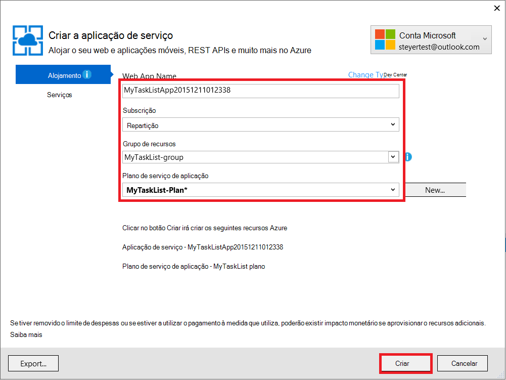
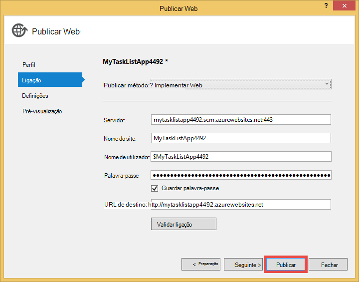

<properties 
    pageTitle="Criar uma aplicação web no Azure que se liga aos MongoDB em execução numa máquina virtual" 
    description="Um tutorial que lhe ensina utilizar Git para implementar uma aplicação do ASP.NET ao serviço de aplicação do Azure, ligado ao MongoDB uma Máquina Virtual no Azure."
    tags="azure-portal" 
    services="app-service\web, virtual-machines" 
    documentationCenter=".net" 
    authors="cephalin" 
    manager="wpickett" 
    editor=""/>

<tags 
    ms.service="app-service-web" 
    ms.workload="web" 
    ms.tgt_pltfrm="na" 
    ms.devlang="dotnet" 
    ms.topic="article" 
    ms.date="02/29/2016" 
    ms.author="cephalin"/>

# Criar uma aplicação web no Azure que se liga aos MongoDB em execução numa máquina virtual

Utilizar Git, pode implementar uma aplicação do ASP.NET ao Azure aplicação de serviço Web Apps. Neste tutorial, irá criar um MVC de ASP.NET front-end simples aplicação de lista de tarefas que liga a uma base de dados MongoDB em execução num computador virtuais no Azure.  [MongoDB] [ MongoDB] é um popular abrir origem, base de dados de alto desempenho NoSQL. Depois de executar e testar a aplicação do ASP.NET no seu computador de desenvolvimento, irá carregar a aplicação a aplicação de serviço Web Apps utilizando Git.

>[AZURE.NOTE] Se pretender começar a aplicação de serviço de Azure antes de inscrever-se para uma conta do Azure, aceda ao [Tentar aplicação de serviço](http://go.microsoft.com/fwlink/?LinkId=523751), onde imediatamente pode criar uma aplicação web do starter curto na aplicação de serviço. Sem cartões de crédito necessários; sem compromissos.

## Dados de conhecimento do fundo ##

Dados de conhecimento das seguintes ações são útil para este tutorial, embora não seja obrigado:

* O c# controlador para MongoDB. Para obter mais informações sobre como desenvolver aplicações c# contra MongoDB, consulte o artigo do MongoDB [CSharp idioma Centro][MongoC#LangCenter]. 
* A arquitetura de aplicação web do ASP .NET. Pode obter informações sobre-o [Web site do ASP.net][ASP.NET].
* A arquitetura de aplicação web do ASP .NET MVC. Pode obter informações sobre-o [Web site do ASP.NET MVC][MVCWebSite].
* Azure. Pode começar a ler no [Azure][WindowsAzure].

## Pré-requisitos ##

- [Visual Studio Express 2013 para Web]  [ VSEWeb] ou [Visual Studio 2013] [VSUlt]
- [Azure SDK para .NET](http://go.microsoft.com/fwlink/p/?linkid=323510&clcid=0x409)
- Uma subscrição ativa do Microsoft Azure

[AZURE.INCLUDE [create-account-and-websites-note](../../includes/create-account-and-websites-note.md)]

 
## Criar uma máquina virtual e instalar o MongoDB ##

Neste tutorial assume que criou uma máquina virtual no Azure. Depois de criar a máquina virtual tem de instalar MongoDB na máquina virtual:

* Para criar uma máquina de virtual do Windows e instalar MongoDB, consulte o artigo [Instalar MongoDB num computador a executar o Windows Server no Azure virtual][InstallMongoOnWindowsVM].

Depois de ter criado a máquina virtual no Azure e instalado MongoDB, certifique-se de que não se esqueça do nome DNS de máquina virtual ("testlinuxvm.cloudapp.net", por exemplo) e a porta externa para MongoDB que especificou no ponto final.  Irá precisar desta informação mais tarde no tutorial.

## Criar a aplicação ##

Nesta secção irá criar uma aplicação do ASP.NET denominada "Minha lista de tarefas" utilizando o Visual Studio e executar uma implementação inicial ao Azure aplicação de serviço Web Apps. Será executar a aplicação localmente, mas irá ligar a sua máquina virtual no Azure e utilize a instância de MongoDB que criou não existem.

1. No Visual Studio, clique em **Novo projeto**.

    ![Começar a página novo projeto][StartPageNewProject]

1. Na janela do **Novo projeto** , no painel esquerdo, selecione **Visual c#**e, em seguida, selecione **Web**. No painel do meio, selecione a **Aplicação Web do ASP.NET**. Na parte inferior, nome do seu projeto "MyTaskListApp" e, em seguida, clique em **OK**.

    ![Caixa de diálogo novo projeto][NewProjectMyTaskListApp]

1. Na caixa de diálogo **Novo projeto de ASP.NET** , selecione **MVC**e, em seguida, clique em **OK**.

    ![Selecione o modelo MVC][VS2013SelectMVCTemplate]

1. Se já não tiver sessão iniciada no Microsoft Azure, vai ser-lhe iniciar sessão. Siga os pedidos para iniciar sessão no Azure.
2. Assim que tiver sessão iniciada no, pode começar a configurar a aplicação web do serviço de aplicação. Especifique o **nome da aplicação Web**, **plano de serviço de aplicação**, **grupo de recursos**e **região**, em seguida, clique em **Criar**.

    

1. Depois do projecto conclui criação, aguarde que a aplicação web a ser criada na aplicação de serviço de Azure como indicado na janela do **Azure actividade de serviço de aplicação** . Em seguida, clique em **Publicar MyTaskListApp para esta aplicação Web agora**.

1. Clique em **Publicar**.

    

    Assim que a sua aplicação de ASP.NET predefinida é publicada no Azure aplicação de serviço Web Apps, será iniciado no browser.

## Instale o controlador de MongoDB c#

MongoDB oferece suporte do lado do cliente para aplicações c# através de um controlador, que tem de instalar no seu computador de desenvolvimento local. O controlador c# está disponível através do NuGet.

Para instalar o controlador MongoDB c#:

1. No **Explorador de soluções**, com o botão direito do projecto **MyTaskListApp** e selecione **Gerir NuGetPackages**.

    ![Gerir pacotes de NuGet][VS2013ManageNuGetPackages]

2. Na janela do **Gerir pacotes de NuGet** , no painel esquerdo, clique em **Online**. Na caixa de **Pesquisa Online** no lado direito, escreva "mongodb.driver".  Clique em **instalar** para instalar o controlador.

    ![Procurar MongoDB c# controlador][SearchforMongoDBCSharpDriver]

3. Clique em **posso aceitar** para aceitar a 10gen, termos de licenciamento Inc..

4. Clique em **Fechar** após ter instalado o controlador da.
    ![Controlador de MongoDB c# instalado][MongoDBCsharpDriverInstalled]

O controlador MongoDB c# agora está instalado.  As referências às bibliotecas **MongoDB.Bson**, **MongoDB.Driver**e **MongoDB.Driver.Core** foram adicionadas ao projeto.

![MongoDB c# controlador referências][MongoDBCSharpDriverReferences]

## Adicionar um modelo ##
No **Explorador de soluções**, com o botão direito na pasta de *modelos* e **Adicionar** uma nova **classe** e o nome *TaskModel.cs*.  Na *TaskModel.cs*, substitua o código existente com o seguinte código:

    using System;
    using System.Collections.Generic;
    using System.Linq;
    using System.Web;
    using MongoDB.Bson.Serialization.Attributes;
    using MongoDB.Bson.Serialization.IdGenerators;
    using MongoDB.Bson;
    
    namespace MyTaskListApp.Models
    {
        public class MyTask
        {
            [BsonId(IdGenerator = typeof(CombGuidGenerator))]
            public Guid Id { get; set; }
    
            [BsonElement("Name")]
            public string Name { get; set; }
    
            [BsonElement("Category")]
            public string Category { get; set; }
    
            [BsonElement("Date")]
            public DateTime Date { get; set; }
    
            [BsonElement("CreatedDate")]
            public DateTime CreatedDate { get; set; }
    
        }
    }

## Adicionar camada de acesso a dados ##
No **Explorador de soluções**, com o botão direito do projecto de *MyTaskListApp* e **Adicionar** uma **Nova pasta** denominada *DAL*.  Botão direito do rato na pasta *DAL* e **Adicionar** uma nova **classe**. Nome o ficheiro de classe *Dal.cs*.  Na *Dal.cs*, substitua o código existente com o seguinte código:

    using System;
    using System.Collections.Generic;
    using System.Linq;
    using System.Web;
    using MyTaskListApp.Models;
    using MongoDB.Driver;
    using MongoDB.Bson;
    using System.Configuration;
    
    
    namespace MyTaskListApp
    {
        public class Dal : IDisposable
        {
            private MongoServer mongoServer = null;
            private bool disposed = false;
    
            // To do: update the connection string with the DNS name
            // or IP address of your server. 
            //For example, "mongodb://testlinux.cloudapp.net"
            private string connectionString = "mongodb://mongodbsrv20151211.cloudapp.net";
    
            // This sample uses a database named "Tasks" and a 
            //collection named "TasksList".  The database and collection 
            //will be automatically created if they don't already exist.
            private string dbName = "Tasks";
            private string collectionName = "TasksList";
    
            // Default constructor.        
            public Dal()
            {
            }
    
            // Gets all Task items from the MongoDB server.        
            public List<MyTask> GetAllTasks()
            {
                try
                {
                    var collection = GetTasksCollection();
                    return collection.Find(new BsonDocument()).ToList();
                }
                catch (MongoConnectionException)
                {
                    return new List<MyTask>();
                }
            }
    
            // Creates a Task and inserts it into the collection in MongoDB.
            public void CreateTask(MyTask task)
            {
                var collection = GetTasksCollectionForEdit();
                try
                {
                    collection.InsertOne(task);
                }
                catch (MongoCommandException ex)
                {
                    string msg = ex.Message;
                }
            }
    
            private IMongoCollection<MyTask> GetTasksCollection()
            {
                MongoClient client = new MongoClient(connectionString);
                var database = client.GetDatabase(dbName);
                var todoTaskCollection = database.GetCollection<MyTask>(collectionName);
                return todoTaskCollection;
            }
    
            private IMongoCollection<MyTask> GetTasksCollectionForEdit()
            {
                MongoClient client = new MongoClient(connectionString);
                var database = client.GetDatabase(dbName);
                var todoTaskCollection = database.GetCollection<MyTask>(collectionName);
                return todoTaskCollection;
            }
    
            # region IDisposable
    
            public void Dispose()
            {
                this.Dispose(true);
                GC.SuppressFinalize(this);
            }
    
            protected virtual void Dispose(bool disposing)
            {
                if (!this.disposed)
                {
                    if (disposing)
                    {
                        if (mongoServer != null)
                        {
                            this.mongoServer.Disconnect();
                        }
                    }
                }
    
                this.disposed = true;
            }
    
            # endregion
        }
    }

## Adicionar um controlador ##
Abra o ficheiro *Controllers\HomeController.cs* no **Explorador de soluções** e substituir o código existente com o seguinte:

    using System;
    using System.Collections.Generic;
    using System.Linq;
    using System.Web;
    using System.Web.Mvc;
    using MyTaskListApp.Models;
    using System.Configuration;
    
    namespace MyTaskListApp.Controllers
    {
        public class HomeController : Controller, IDisposable
        {
            private Dal dal = new Dal();
            private bool disposed = false;
            //
            // GET: /MyTask/
    
            public ActionResult Index()
            {
                return View(dal.GetAllTasks());
            }
    
            //
            // GET: /MyTask/Create
    
            public ActionResult Create()
            {
                return View();
            }
    
            //
            // POST: /MyTask/Create
    
            [HttpPost]
            public ActionResult Create(MyTask task)
            {
                try
                {
                    dal.CreateTask(task);
                    return RedirectToAction("Index");
                }
                catch
                {
                    return View();
                }
            }
    
            public ActionResult About()
            {
                return View();
            }
    
            # region IDisposable
    
            new protected void Dispose()
            {
                this.Dispose(true);
                GC.SuppressFinalize(this);
            }
    
            new protected virtual void Dispose(bool disposing)
            {
                if (!this.disposed)
                {
                    if (disposing)
                    {
                        this.dal.Dispose();
                    }
                }
    
                this.disposed = true;
            }
    
            # endregion
    
        }
    }

## Configurar os estilos ##
Para alterar o título na parte superior da página, abra o *Views\Shared\\_Layout.cshtml* ficheiro no **Explorador de solução** e substitua "Nome da aplicação" no cabeçalho da barra de navegação "Lista de tarefas minha aplicação" para que o seguinte aspeto:

    @Html.ActionLink("My Task List Application", "Index", "Home", null, new { @class = "navbar-brand" })

Para configurar o menu de lista de tarefas, abra o ficheiro *\Views\Home\Index.cshtml* e substituir o código existente com o seguinte código:
    
    @model IEnumerable<MyTaskListApp.Models.MyTask>
    
    @{
        ViewBag.Title = "My Task List";
    }
    
    <h2>My Task List</h2>
    
    <table border="1">
        <tr>
            <th>Task</th>
            <th>Category</th>
            <th>Date</th>
            
        </tr>
    
    @foreach (var item in Model) {
        <tr>
            <td>
                @Html.DisplayFor(modelItem => item.Name)
            </td>
            <td>
                @Html.DisplayFor(modelItem => item.Category)
            </td>
            <td>
                @Html.DisplayFor(modelItem => item.Date)
            </td>
            
        </tr>
    }
    
    </table>
    
  @Html.Partial("Create", new MyTaskListApp.Models.MyTask())

Para adicionar a capacidade de criar uma nova tarefa, botão direito do rato a *Views\Home\\ * pasta e **Adicionar** uma **vista**.  Nome da vista de *Criar*. Substitua o código com o seguinte:

    @model MyTaskListApp.Models.MyTask
    
    
    
    
    
    @using (Html.BeginForm("Create", "Home")) {
        @Html.ValidationSummary(true)
        <fieldset>
            <legend>New Task</legend>
    
            

                @Html.LabelFor(model => model.Name)
            

            

                @Html.EditorFor(model => model.Name)
                @Html.ValidationMessageFor(model => model.Name)
            

    
            

                @Html.LabelFor(model => model.Category)
            

            

                @Html.EditorFor(model => model.Category)
                @Html.ValidationMessageFor(model => model.Category)
            

    
            

                @Html.LabelFor(model => model.Date)
            

            

                @Html.EditorFor(model => model.Date)
                @Html.ValidationMessageFor(model => model.Date)
            

    
            

                <input type="submit" value="Create" />
            

        </fieldset>
    }

**Solução Explorer** deve ter este aspeto:

![Explorador de soluções][SolutionExplorerMyTaskListApp]

## Definir a cadeia de ligação MongoDB ##
No **Explorador de soluções**, abra o ficheiro *DAL/Dal.cs* . Localize a linha seguinte de código:

    private string connectionString = "mongodb://<vm-dns-name>";

Substituir `<vm-dns-name>` com o nome de computador virtual MongoDB a executar o DNS criou no passo [criar uma máquina virtual e instalar o MongoDB][] deste tutorial.  Para localizar o nome DNS do seu máquina virtual, aceda ao Portal do Azure, selecione **máquinas virtuais**e localizar o **Nome de DNS**.

Se o nome DNS da máquina virtual é "testlinuxvm.cloudapp.net" e MongoDB está a escutar a porta predefinida 27017, a linha de cadeia de ligação de código terá o seguinte aspeto:

    private string connectionString = "mongodb://testlinuxvm.cloudapp.net";

Se o ponto final de máquina virtual Especifica uma porta externa diferente para MongoDB, pode especificar a porta na cadeia de ligação:

    private string connectionString = "mongodb://testlinuxvm.cloudapp.net:12345";

Para mais informações sobre as cadeias de ligação MongoDB, consulte [as ligações][MongoConnectionStrings].

## Testar a implementação local ##

Para executar a aplicação no seu computador de desenvolvimento, selecione a **Depuração de iniciar** a partir do menu **Depurar** ou prima **F5**. Inicia o IIS Express e num browser é aberto e inicia a home page da aplicação.  Pode adicionar uma nova tarefa, será adicionada à base de dados MongoDB em execução no seu computador virtual no Azure.

![Minha aplicação da lista de tarefas][TaskListAppBlank]

## Publicar no Azure de aplicação de serviço Web Apps

Nesta secção irá publicar as alterações ao Azure aplicação de serviço Web Apps.

1. No Explorador de solução, com o botão direito **MyTaskListApp** novamente e clique em **Publicar**.
2. Clique em **Publicar**.

    Agora deverá ver a aplicação web em execução no serviço de aplicação do Azure e aceder a base de dados do MongoDB em máquinas virtuais do Azure.

## Resumo ##

Com êxito agora ter implementado a sua aplicação do ASP.NET Azure aplicação de serviço Web Apps. Para ver a aplicação web:

1. Iniciar sessão no Portal do Azure.
2. Clique em **aplicações Web**. 
3. Selecione a aplicação web na lista de **Aplicações Web** .

Para obter mais informações sobre como desenvolver aplicações c# contra MongoDB, consulte o [Centro de idioma CSharp][MongoC#LangCenter]. 

[AZURE.INCLUDE [app-service-web-whats-changed](../../includes/app-service-web-whats-changed.md)]
 

<!-- HYPERLINKS -->

[AzurePortal]: http://manage.windowsazure.com
[WindowsAzure]: http://www.windowsazure.com
[MongoC#LangCenter]: http://docs.mongodb.org/ecosystem/drivers/csharp/
[MVCWebSite]: http://www.asp.net/mvc
[ASP.NET]: http://www.asp.net/
[MongoConnectionStrings]: http://www.mongodb.org/display/DOCS/Connections
[MongoDB]: http://www.mongodb.org
[InstallMongoOnWindowsVM]: ../virtual-machines/virtual-machines-windows-classic-install-mongodb.md
[VSEWeb]: http://www.microsoft.com/visualstudio/eng/2013-downloads#d-2013-express
[VSUlt]: http://www.microsoft.com/visualstudio/eng/2013-downloads

<!-- IMAGES -->

[StartPageNewProject]: ./media/web-sites-dotnet-store-data-mongodb-vm/NewProject.png
[NewProjectMyTaskListApp]: ./media/web-sites-dotnet-store-data-mongodb-vm/NewProjectMyTaskListApp.png
[VS2013SelectMVCTemplate]: ./media/web-sites-dotnet-store-data-mongodb-vm/VS2013SelectMVCTemplate.png
[VS2013DefaultMVCApplication]: ./media/web-sites-dotnet-store-data-mongodb-vm/VS2013DefaultMVCApplication.png
[VS2013ManageNuGetPackages]: ./media/web-sites-dotnet-store-data-mongodb-vm/VS2013ManageNuGetPackages.png
[SearchforMongoDBCSharpDriver]: ./media/web-sites-dotnet-store-data-mongodb-vm/SearchforMongoDBCSharpDriver.png
[MongoDBCsharpDriverInstalled]: ./media/web-sites-dotnet-store-data-mongodb-vm/MongoDBCsharpDriverInstalled.png
[MongoDBCSharpDriverReferences]: ./media/web-sites-dotnet-store-data-mongodb-vm/MongoDBCSharpDriverReferences.png
[SolutionExplorerMyTaskListApp]: ./media/web-sites-dotnet-store-data-mongodb-vm/SolutionExplorerMyTaskListApp.png
[TaskListAppBlank]: ./media/web-sites-dotnet-store-data-mongodb-vm/TaskListAppBlank.png
[WAWSCreateWebSite]: ./media/web-sites-dotnet-store-data-mongodb-vm/WAWSCreateWebSite.png
[WAWSDashboardMyTaskListApp]: ./media/web-sites-dotnet-store-data-mongodb-vm/WAWSDashboardMyTaskListApp.png
[Image9]: ./media/web-sites-dotnet-store-data-mongodb-vm/RepoReady.png
[Image10]: ./media/web-sites-dotnet-store-data-mongodb-vm/GitInstructions.png
[Image11]: ./media/web-sites-dotnet-store-data-mongodb-vm/GitDeploymentComplete.png

<!-- TOC BOOKMARKS -->
[Criar uma máquina virtual e instalar o MongoDB]: #virtualmachine
[Create and run the My Task List ASP.NET application on your development computer]: #createapp
[Create an Azure web site]: #createwebsite
[Deploy the ASP.NET application to the web site using Git]: #deployapp
 