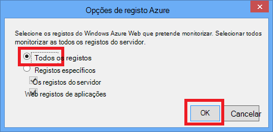

<properties 
    pageTitle="Resolver problemas de uma aplicação web no serviço de aplicação do Azure utilizando o Visual Studio" 
    description="Saiba como resolver problemas de uma aplicação Azure web utilizando depuração remota, rastreio e ferramentas de registo que são criadas as Visual Studio 2013." 
    services="app-service" 
    documentationCenter=".net" 
    authors="tdykstra" 
    manager="wpickett" 
    editor=""/>

<tags 
    ms.service="app-service" 
    ms.workload="na" 
    ms.tgt_pltfrm="na" 
    ms.devlang="dotnet" 
    ms.topic="article" 
    ms.date="08/29/2016" 
    ms.author="rachelap"/>

# Resolver problemas de uma aplicação web no serviço de aplicação do Azure utilizando o Visual Studio

## Descrição geral

Este tutorial mostra como utilizar as ferramentas do Visual Studio que o ajudam a depuração de uma aplicação web na [Aplicação de serviço](http://go.microsoft.com/fwlink/?LinkId=529714), ao executar no [modo de depuração](http://www.visualstudio.com/get-started/debug-your-app-vs.aspx) remotamente ou ao ver registos da aplicação e os registos do servidor web.

[AZURE.INCLUDE [app-service-web-to-api-and-mobile](../../includes/app-service-web-to-api-and-mobile.md)]

Que vai aprender:

* As funções de gestão de aplicação Azure web estão disponíveis no Visual Studio.
* Como utilizar a vista remota do Visual Studio para efetuar alterações rápidas numa aplicação web do remoto.
* Como executar o modo de depuração remotamente enquanto um projeto está em execução no Azure tanto para uma aplicação web para um WebJob.
* Como criar registos de rastreio da aplicação e vê-los enquanto a aplicação está a criá-los.
* Como ver registos de servidor web, incluindo mensagens de erro detalhadas e falhou rastreio do pedido.
* Como enviar registos de diagnóstico para um armazenamento do Windows Azure de conta e visualizá-los aí.

Se tiver o Visual Studio Ultimate, também pode utilizar [IntelliTrace](http://msdn.microsoft.com/library/vstudio/dd264915.aspx) para depuração. Não é abrangido IntelliTrace neste tutorial.

## Pré-requisitos

Neste tutorial funciona com o ambiente de desenvolvimento, projecto da web e Azure web app que configurou o [artigo Introdução ao Azure e ASP.NET][GetStarted]. As secções WebJobs, terá a aplicação que criar no [Artigo Introdução ao Azure WebJobs SDK][GetStartedWJ].

Os exemplos de código mostrados neste tutorial são para uma aplicação web do c# MVC, mas os procedimentos de resolução de problemas são os mesmos para aplicações do Visual Basic e formulários da Web.

O tutorial assume que estiver a utilizar o Visual Studio 2015 ou 2013. Se estiver a utilizar o Visual Studio 2013, as funcionalidades de WebJobs requerem [Update 4](http://go.microsoft.com/fwlink/?LinkID=510314) ou posterior. 

Os registos de transmissão funcionalidade só funciona para as aplicações que alvo .NET Framework 4 ou posterior.

## Gestão e configuração da aplicação Web

O Visual Studio fornece acesso a um subconjunto das definições de configuração disponíveis no [Portal do Azure](http://go.microsoft.com/fwlink/?LinkId=529715)e funções de gestão de aplicação web. Nesta secção, verá que está disponível através do **Explorador de servidor**. Para ver as funcionalidades de integração com o Azure mais recentes, experimente **Nuvem Explorer** também. Pode abrir ambas as janelas a partir do menu de **vista** . 

1. Se não tiver iniciado sessão para Azure no Visual Studio, clique no botão de **ligar ao Azure** no **Explorador do servidor**.

    Uma alternativa consiste em instalar um certificado de gestão que ativa o acesso à sua conta. Se optar por instalar um certificado, com o botão direito no nó **Azure** no **Explorador do servidor**e, em seguida, clique em **Gerir e subscrições de filtro** no menu de contexto. Na caixa de diálogo **Gerir Azure subscrições** , clique no separador **certificados** e, em seguida, clique em **Importar**. Siga as instruções para transferir e, em seguida, importar um ficheiro de subscrição (também designado de um ficheiro de *.publishsettings* ) para a sua conta Azure.

    > [AZURE.NOTE]
    > Se transferir um ficheiro de subscrição, guarde-o para uma pasta fora da sua directórios de código de origem (por exemplo, na pasta transferências) e, em seguida, elimine-o quando a importação estiver concluída. Um utilizador malicioso que obtém acesso ao ficheiro de subscrição pode editar, criar e eliminar os seus serviços Azure.

    Para mais informações sobre como ligar aos recursos Azure a partir do Visual Studio, consulte o artigo [Gerir contas, subscrições e funções administrativas](http://go.microsoft.com/fwlink/?LinkId=324796#BKMK_AccountVCert).

2. No **Explorador do servidor**, expanda **Azure** e expanda a **Aplicação de serviço**.

3. Expandir o grupo de recursos que inclui a aplicação web que criou no [Introdução ao Azure e ASP.NET][GetStarted]e, em seguida, o nó de aplicação web com o botão direito e clique em **Definições de vista**.

    

    O separador **Azure Web App** é apresentado e não existem pode ver as tarefas de gestão e configuração de aplicação de web que estão disponíveis no Visual Studio.

    

    Neste tutorial, irá utilizar a funcionalidade de registo e rastreio-ou filtros pendentes. Também irá utilizar depuração remota mas vai utilizar um método diferente para ativá-la.
   
    Para obter informações sobre as caixas das definições da aplicação e cadeias de ligação nesta janela, consulte o artigo [Azure Web Apps: como cadeias da aplicação e ligação cadeias trabalho](http://blogs.msdn.com/b/windowsazure/archive/2013/07/17/windows-azure-web-sites-how-application-strings-and-connection-strings-work.aspx).

    Se pretender executar uma tarefa de gestão de aplicação web que não pode ser feita nesta janela, clique em **Abrir no Portal de gestão** para abrir uma janela de browser para o portal do Azure.

## Ficheiros de aplicação do Access web no Explorador do servidor

Normalmente implementar um projeto de web com a `customErrors` sinalizador na Web. config ficheiro definido para `On` ou `RemoteOnly`, que significa que não recebe uma mensagem de erro úteis quando algo de errado. Para muitos erros todas obtém é uma página como um dos seguintes aqueles.

**Erro no servidor numa aplicação '/':**

**Ocorreu um erro:**

**O Web site não é possível visualizar a página**

Perguntas a forma mais fácil para localizar a causa do erro é ativar a mensagens de erro detalhadas, o primeiro as capturas de ecrã anteriores explica como o fazer. Que necessita de uma alteração no ficheiro Web. config implementada. Pode editar o ficheiro de *Web. config* no projeto e implementar o projeto, ou criar um [Web. config transformar](http://www.asp.net/mvc/tutorials/deployment/visual-studio-web-deployment/web-config-transformations) e implementar uma compilação de depuração, mas existe uma forma mais rápida: no **Explorador de solução** pode ver e editar ficheiros na aplicação web remota utilizando a funcionalidade de *Vista remoto* diretamente.

1. No **Explorador do servidor**, expanda **Azure**, expanda a **Aplicação de serviço**, expandir o grupo de recursos a sua aplicação web está localizada no e, em seguida, expanda o nó para a sua aplicação web.

    Consulte nós dão-lhe acesso a ficheiros de conteúdo e ficheiros de registo do web app.

2. Expanda o nó de **ficheiros** e faça duplo clique no ficheiro da *Web. config* .

    

    Visual Studio abre o ficheiro de Web. config a partir da aplicação web do remoto e mostra [Remote] junto ao nome do ficheiro na barra de título.

3. Adicionar a linha seguinte para o `system.web` elemento:

    `<customErrors mode="Off"></customErrors>`

    

4. Atualize o browser que esteja a mostrar a mensagem de erro pouco inútil e agora obtém uma mensagem de erro detalhada, tal como o exemplo seguinte:

    

    (O erro apresentado foi criado através da adição de linha apresentada a vermelho a *Views\Home\Index.cshtml*.)

Editar um ficheiro Web. config é apenas um exemplo de cenários na qual a capacidade de ler e editar ficheiros na sua aplicação Azure web tornar mais fácil de resolução de problemas.

## Aplicações web do depuração remoto

Se a mensagem de erro detalhada não fornece informações suficientes, e não é possível criar novamente o erro localmente, é outra forma de resolução de problemas executar no modo de depuração remotamente. Pode definir pontos de interrupção, manipular memória diretamente, siga os passos código e até alterar o caminho de código. 

Depuração remota não funciona no Express edições do Visual Studio.

Esta secção mostra como depurar remotamente utilizando o project cria na [Introdução ao Azure e ASP.NET][GetStarted].

1. Abra o projeto de web que criou no [Introdução ao Azure e ASP.NET][GetStarted].

1. Abra *Controllers\HomeController.cs*.

2. Eliminar o `About()` método e inserir o seguinte código no seu lugar.

        public ActionResult About()
        {
            string currentTime = DateTime.Now.ToLongTimeString();
            ViewBag.Message = "The current time is " + currentTime;
            return View();
        }

2. [Definir um ponto de interrupção](http://www.visualstudio.com/get-started/debug-your-app-vs.aspx) na `ViewBag.Message` linha.

1. No **Explorador de soluções**, com o botão direito do projeto e clique em **Publicar**.

2. Na lista pendente de **perfil** , selecione o mesmo perfil que utilizou em [Introdução ao Azure e ASP.NET][GetStarted].

3. Clique no separador **Definições** , altere a **configuração** para **Depurar**e, em seguida, clique em **Publicar**.

    

4. Após a implementação acabamentos e o seu browser abre-se para o URL do Azure da sua aplicação web, feche o browser.

5. No **Explorador do servidor**, a aplicação web com o botão direito e, em seguida, clique em **Anexar Depurador**. 

    

    Browser abre automaticamente à sua home page em execução no Azure. Poderá ter de aguardar 20 segundos ou de forma enquanto Azure configura o servidor para depuração. Este atraso acontece apenas a primeira vez que executar no modo de depuração uma aplicação web. Horas subsequentes dentro de seguintes 48 horas quando inicia novamente depuração não serão um atraso.

    **Nota:** Se tiver quaisquer problemas ao iniciar o depurador, tente fazê-lo através do **Explorador de nuvem** em vez de **Server Explorer**.

6. Clique em **Acerca** no menu de lista.

    Deixa de Visual Studio sobre o ponto de interrupção e o código está em execução no Azure, não no seu computador local.

7. Paire o cursor sobre o `currentTime` variável para visualizar o valor de hora.

    

    O tempo que vê é a hora do servidor Azure, que pode ser no seu computador local um fuso horário diferente.

8. Introduza um novo valor para o `currentTime` variável, tal como "Agora a ser executada em Azure".

5. Prima F5 para continuar a trabalhar rapidamente.

    Página acerca em execução no Azure apresenta o novo valor introduzidos a variável de currentTime.

    

## WebJobs depuração remoto

Esta secção mostra como depurar remotamente utilizando a aplicação web e project que cria no [Artigo Introdução ao Azure WebJobs SDK](websites-dotnet-webjobs-sdk.md). 

As funcionalidades apresentadas nesta secção estão disponíveis apenas no Visual Studio 2013 com Update 4 ou posterior. 

Depuração remota só funciona com WebJobs contínuo. WebJobs agendadas e a pedido não suporta a depuração.

1. Abra o projeto de web que criou no [Artigo Introdução ao Azure WebJobs SDK][GetStartedWJ].

1. No ContosoAdsWebJob project, abra *Functions.cs*.

2. [Definir um ponto de interrupção](http://www.visualstudio.com/get-started/debug-your-app-vs.aspx) na primeira instrução na `GnerateThumbnail` método.

    

1. No **Explorador de soluções**, com o botão direito do projecto web (não o projeto WebJob) e clique em **Publicar**.

2. Na lista pendente de **perfil** , selecione o mesmo perfil que utilizou em [Introdução ao Azure WebJobs SDK](websites-dotnet-webjobs-sdk.md).

3. Clique no separador **Definições** , altere a **configuração** para **Depurar**e, em seguida, clique em **Publicar**.

    Implementa o Visual Studio na web e projetos de WebJob e o browser é aberta para o URL do Azure da sua aplicação web.

5. No **Explorador do servidor** expandir **Azure > aplicação de serviço > grupo de recursos > a aplicação web do > WebJobs > contínua**e, em seguida, com o botão direito **ContosoAdsWebJob**.

7. Clique em **Anexar Depurador**. 

    

    Browser abre automaticamente à sua home page em execução no Azure. Poderá ter de aguardar 20 segundos ou de forma enquanto Azure configura o servidor para depuração. Este atraso acontece apenas a primeira vez que executar no modo de depuração uma aplicação web. Da próxima vez que anexa o depurador aí não será um atraso, se pode fazê-lo 48 horas.

6. No browser que é aberto para a home page da Contoso anúncios, crie um novo anúncio. 

    Criar um anúncio faz com que uma mensagem de fila de espera para ser criado, que será recolhida pela WebJob e processada. Quando o SDK WebJobs chama a função para processar a mensagem de fila de espera, o código irá atingiu o seu ponto de interrupção.

7. Quando o depurador quebras no seu ponto de interrupção, pode examinar e alterar os valores de variáveis enquanto a execução do programa na nuvem. A ilustração seguinte mostra o depurador mostra o conteúdo do objeto blobInfo que foi passado para o método de GenerateThumbnail.

    
 
5. Prima F5 para continuar a trabalhar rapidamente.

    O método GenerateThumbnail é concluída criar a miniatura.

6. No browser, atualize a página de índice remissivo e ver a miniatura.

6. No Visual Studio, prima SHIFT + F5 para parar de depuração.

7. No **Explorador do servidor**, clique com o botão direito do rato em ContosoAdsWebJob e clique em **Vista de Dashboard**.

8. Inicie sessão com as suas credenciais Azure e, em seguida, clique no nome de WebJob para ir para a página para o seu WebJob. 

    

    O Dashboard mostra que a função GenerateThumbnail executada recentemente.

    (Da próxima vez que clique em **Vista de Dashboard**, não tenho de iniciar sessão e o browser acede diretamente à página para o seu WebJob.)

9. Clique no nome de função para ver detalhes sobre a execução de função.

    

Se a função [escreveu registos](websites-dotnet-webjobs-sdk-storage-queues-how-to.md#logs), pode clicar em **ToggleOutput** vê-los.

## Notas sobre a depuração remota

* Não é recomendada a ser executada em modo de depuração de produção. Se a aplicação web do produção não está dimensionada saída para várias instâncias do servidor, depuração irá impedir que o servidor web responder a pedidos de outros. Se tiver várias instâncias de servidor web, quando anexa para o depurador irá obter uma instância aleatória e não tiver forma para se certificar de que os pedidos subsequentes browser serão direcionadas para essa instância. Além disso, normalmente não implementar uma compilação de depuração produção e otimizações compilador para lançamento compilações poderão torná-lo impossibilita Mostrar o que se passa linha a linha no seu código fonte. Para resolver problemas de produção, o melhor recurso é a aplicação web e rastreio registos do servidor.

* Evitar marcas longas em pontos de interrupção quando remoto depuração. Azure trata um processo que está parado durante mais de alguns minutos como um processo que não responde e encerra-lo.

* Enquanto está a depuração, o servidor está a enviar dados para Visual Studio, pode afetar a taxas de largura de banda. Para obter informações sobre as taxas de largura de banda, consulte o artigo [Azure preços](/pricing/calculator/).

* Certifique-se de que o `debug` atributo da `compilation` elemento no ficheiro *Web. config* está definido como verdadeiro. Está definido para true por predefinição quando publicar uma configuração da compilação de depuração.

        <system.web>
          <compilation debug="true" targetFramework="4.5" />
          <httpRuntime targetFramework="4.5" />
        </system.web>

* Se achar que o depurador não passo para o código que pretende depurar, poderá ter de alterar a definição de apenas meus código.  Para mais informações, consulte o artigo [restringir afastar-se apenas meus código](http://msdn.microsoft.com/library/vstudio/y740d9d3.aspx#BKMK_Restrict_stepping_to_Just_My_Code).

* Um temporizador é iniciado no servidor ativar a funcionalidade de depuração remota e 48 horas depois a funcionalidade é desativada automaticamente. Este limite 48 horas é feito por motivos de segurança e o desempenho. Pode facilmente ativar a funcionalidade novamente como número de vezes que quiser. Recomendamos que deixe-desactivado quando não são ativamente depurar.

* Pode anexar manualmente o depurador a qualquer processo, não só processo do web app (w3wp.exe). Para mais informações sobre como utilizar o modo de depuração no Visual Studio, consulte o artigo [depuração no Visual Studio](http://msdn.microsoft.com/library/vstudio/sc65sadd.aspx).

## Descrição geral de registos de diagnóstico

Uma aplicação do ASP.NET que é executada numa aplicação Azure web pode criar os seguintes tipos de registos:

* **Registos de rastreio de aplicação** 
  A aplicação cria estes registos ao contactar o suporte métodos a classe de [System.Diagnostics.Trace](http://msdn.microsoft.com/library/system.diagnostics.trace.aspx) de.
* **Registos do servidor Web** 
  O servidor web cria uma entrada de registo para cada pedido de HTTP para a aplicação web.
* **Registos de mensagem de erro detalhada** 
  O servidor web cria uma página HTML com algumas informações adicionais para pedidos HTTP falhou (aqueles que resultam no código de estado 400 ou maior). 
* **Ocorreu uma falha de registos do rastreio de pedido** 
  O servidor web cria um ficheiro XML com informações detalhadas rastreio para pedidos HTTP falhou. O servidor web também fornece um ficheiro XSL para formatar o XML num browser.
  
Registo afeta o desempenho da aplicação web, para que o Azure fornece-lhe a capacidade de ativar ou desativar a cada tipo de registo, conforme necessário. Nos registos de aplicação, pode especificar que apenas os registos de acima de um determinado nível gravidade devem ser escritos. Quando cria uma nova aplicação web, por predefinição todos os registo é desativada.

Os registos sejam escritos nos ficheiros numa pasta de *ficheiros de registo* no sistema de ficheiros da sua aplicação web e são acessíveis através de FTP. Também podem ser escritos registos do servidor Web e registos de aplicação a uma conta de armazenamento do Windows Azure. Pode manter um maior volume de registos numa conta de armazenamento do que é possível no sistema de ficheiros. Está limitado a um máximo de 100 megabytes de registos quando utiliza o sistema de ficheiros. (Ficheiro registos do sistema só são retenção curto prazo. Azure elimina antigo ficheiros de registo para arranjar espaço para novos depois do limite é atingido.)  

## Criar e ver registos de rastreio de aplicação

Nesta secção irá efetuar as seguintes tarefas:

* Adicionar declarações de rastreio ao projecto web que criou no [artigo Introdução ao Azure e ASP.NET][GetStarted].
* Visualize os registos ao executar o projeto localmente.
* Visualize os registos tal como estes são gerados por aplicação em execução no Azure. 

Para obter informações sobre como criar aplicação inicia sessão na WebJobs, consulte [como trabalhar com o armazenamento de filas Azure utilizando o SDK do WebJobs - como escrever registos](websites-dotnet-webjobs-sdk-storage-queues-how-to.md#logs). As seguintes instruções para ver registos de início e controlar a forma como estão armazenados no Azure também se aplicam aos registos de aplicação criados pelo WebJobs. 

### Adicionar declarações de rastreio à aplicação

1. Abra *Controllers\HomeController.cs*e substituir o `Index`, `About`, e `Contact` métodos com o seguinte código para poder adicionar `Trace` declarações e um `using` declaração do `System.Diagnostics`:

        public ActionResult Index()
        {
            Trace.WriteLine("Entering Index method");
            ViewBag.Message = "Modify this template to jump-start your ASP.NET MVC application.";
            Trace.TraceInformation("Displaying the Index page at " + DateTime.Now.ToLongTimeString());
            Trace.WriteLine("Leaving Index method");
            return View();
        }
        
        public ActionResult About()
        {
            Trace.WriteLine("Entering About method");
            ViewBag.Message = "Your app description page.";
            Trace.TraceWarning("Transient error on the About page at " + DateTime.Now.ToShortTimeString());
            Trace.WriteLine("Leaving About method");
            return View();
        }
        
        public ActionResult Contact()
        {
            Trace.WriteLine("Entering Contact method");
            ViewBag.Message = "Your contact page.";
            Trace.TraceError("Fatal error on the Contact page at " + DateTime.Now.ToLongTimeString());
            Trace.WriteLine("Leaving Contact method");
            return View();
        }       

2. Adicionar um `using System.Diagnostics;` declaração para a parte superior do ficheiro.
                
### Ver os resultados do rastreio localmente

3. Prima F5 para executar a aplicação no modo de depuração.

    A escuta de rastreio predefinido escreve todos os resultados do rastreio na janela de **saída** , juntamente com outros depuração de saída. A ilustração seguinte mostra o resultado das declarações de rastreio que adicionou ao `Index` método.

    

    Os seguintes passos mostram como ver os resultados do rastreio numa página web, sem a compilar no modo de depuração.

2. Abra o ficheiro da aplicação Web. config (a que localizada na pasta do projecto) e adicione uma `<system.diagnostics>` elemento no final do ficheiro imediatamente antes do remate `</configuration>` elemento:

        <system.diagnostics>
            <trace>
              <listeners>
                <add name="WebPageTraceListener"
                    type="System.Web.WebPageTraceListener, 
                    System.Web, 
                    Version=4.0.0.0, 
                    Culture=neutral,
                    PublicKeyToken=b03f5f7f11d50a3a" />
              </listeners>
            </trace>
          </system.diagnostics>

    O `WebPageTraceListener` permite-lhe que ver resultados do rastreio navegando para `/trace.axd`.

3. Adicionar um <a href="http://msdn.microsoft.com/library/vstudio/6915t83k(v=vs.100).aspx">elemento de rastreio</a> em `<system.web>` na Web. config ficheiro, tal como o exemplo seguinte:

        <trace enabled="true" writeToDiagnosticsTrace="true" mostRecent="true" pageOutput="false" />

3. Prima CTRL + F5 para executar a aplicação.

4. Na barra de endereço da janela do browser, adicione *axd* para o URL e, em seguida, prima Enter (o URL será semelhante ao http://localhost:53370/trace.axd).

5. Na página **Rastreio da aplicação** , clique em **Ver detalhes** sobre a primeira linha (não BrowserLink linha).

    

    É apresentada a página de **Detalhes do pedido de** e, na secção **Informações de rastreio** de ver o resultado das declarações de rastreio que adicionou ao `Index` método.

    

    Por predefinição, `trace.axd` só está disponível localmente. Se quiser torná-lo disponível a partir de uma aplicação web remoto, é possível adicionar `localOnly="false"` para o `trace` elemento na *Web. config* ficheiro, conforme mostrado no exemplo seguinte:

        <trace enabled="true" writeToDiagnosticsTrace="true" localOnly="false" mostRecent="true" pageOutput="false" />

    No entanto, permitindo- `trace.axd` uma de produção do web app geralmente não é recomendado por motivos de segurança e, nas secções seguintes verá uma forma mais fácil de ler os registos do rastreio de numa aplicação Azure web.

### Ver os resultados do rastreio no Azure

1. No **Explorador de soluções**, o project web com o botão direito e clique em **Publicar**.

2. Na caixa de diálogo **Publicar Web** , clique em **Publicar**.

    Depois de Visual Studio publica a atualização, é aberta uma janela do browser à sua home page (partindo do princípio de que não desmarque **URL de destino** no separador **ligação** ).

3. No **Explorador do servidor**, a aplicação web com o botão direito e selecione **Ver registos de transmissão**. 

    

    Na janela de **saída** mostra que está ligado ao serviço de transmissão de registo e adiciona uma linha de notificação cada minuto que acede sem um registo para apresentar.

    

4. Na janela do browser que apresenta a sua home page da aplicação, clique em **contacto**.

    Dentro de alguns segundos a saída do nível de erro que adicionou para analisar o `Contact` método aparece na janela de **saída** .

    

    Visual Studio só é apresentar rastreios de nível de erro, uma vez que é a predefinição quando ativa o registo de serviço de monitorização. Quando cria uma nova aplicação Azure web, registo todos os é desativado por predefinição, tal como viu quando aberto a página de definições anterior:

    

    No entanto, quando selecionado **Ver registos de transmissão**, o Visual Studio alterada automaticamente **Logging(File System) aplicação** para o **erro**, que significa que são reportados registos de nível de erro. Para poder ver todos os registos do seu rastreio, pode alterar esta definição para **verboso**. Quando selecionar um nível de gravidade inferior erro, todos os registos dos níveis de superiores gravidade também são reportados. Por isso, ao selecionar verboso, também verá informações, aviso e os registos de erros.  

4. No **Explorador do servidor**, com o botão direito do web app e, em seguida, clique em **Definições de vista** , anteriores.

5. Alterar o **Registo de aplicação (sistema de ficheiros)** para **verboso**e, em seguida, clique em **Guardar**.
 
    

6. Na janela do browser é agora a mostrar a sua página de **contacto** , clique em **base**e, em seguida, clique em **Acerca**e, em seguida, clique em **contacto**.

    Dentro de aguardar alguns segundos, na janela de **saída** apresente a saída de rastreio.

    

    Nesta secção ativado e desativado registo utilizando as definições da aplicação Azure web. Também pode ativar e desativar listeners rastreio modificando o ficheiro da Web. config. No entanto, modificar o ficheiro da Web. config faz com que o domínio de aplicação a Reciclagem, enquanto activar o registo através da configuração da aplicação web não fazê-lo. Se o problema demorar muito tempo a reproduzir, ou for intermitente, o domínio de aplicação a reciclagem poderá "corrigir" e forçar o que esperar até para isto acontecer novamente. Ativar diagnósticos no Azure não efetuar esta ação, para que possa começar a capturar informações de erros imediatamente.

### Funcionalidades de janela de saída

Separador de na janela de **saída** **Azure registos** tem vários botões e uma caixa de texto:

Estes efectuam as seguintes funções:

* Desmarque na janela de **saída** .
* Ativar ou desativar a moldagem de texto.
* Iniciar ou parar a monitorização de registos.
* Especificar quais os registos para monitorizar a.
* Transfira os registos.
* Filtre registos com base numa cadeia de pesquisa ou uma expressão regular.
* Feche a janela de **saída** .

Se introduzir uma cadeia de pesquisa ou expressão regular, Visual Studio filtra informações de registo no cliente. Isto significa que pode introduzir os critérios depois dos registos são apresentados na janela de **saída** e pode alterar critérios de filtragem sem ter de voltar a gerar os registos.

## Ver registos de servidor web

Os registos do servidor Web gravar todas as atividades HTTP para a aplicação web. Para poder vê-los na janela de **saída** , que tem de ativá-las para a aplicação web e verificar as Visual Studio que pretende monitorizá-los. 

1. Na caixa de diálogo **Configuração da aplicação Web Azure** que abriu a partir do **Explorador de servidor**, alterar o registo de servidor Web **no**e, em seguida, clique em **Guardar**.

    

2. Na janela de **saída** , clique no botão de **especificar quais os registos de Azure para monitorizar a** .
    
    

3. Na caixa de diálogo **Opções de registo do Azure** , selecione **os registos do servidor Web**e, em seguida, clique em **OK**.

    

4. Na janela do browser que apresenta a aplicação web, clique em **base**e, em seguida, clique em **Acerca**e, em seguida, clique em **contacto**.

    Os registos de aplicação geralmente são apresentadas em primeiro lugar, seguido os registos do servidor web. Poderá ter de esperar tempo para que os registos que seja apresentado. 

    

Por predefinição, quando ativar primeiro os registos do servidor web utilizando o Visual Studio, Azure escreve os registos de início para o sistema de ficheiros. Como alternativa, pode utilizar o portal do Azure para especificar nesse servidor web que devem ser escritos registos de início de um contentor blob numa conta de armazenamento.

Se utilizar o portal para ativar o servidor web registo a uma conta de armazenamento Azure e, em seguida, desativar o registo no Visual Studio, quando voltar a ativar registo no Visual Studio as definições de conta de armazenamento são restauradas. 

## Ver registos de mensagem de erro detalhada

Registos de erro detalhada fornecem algumas informações adicionais acerca dos pedidos de HTTP que resultam códigos de resposta do erro (400 ou acima). Para poder vê-los na janela de **saída** , tem de ativá-las para a aplicação web e verificar as Visual Studio que pretende monitorizá-los.

1. Na caixa de diálogo **Configuração da aplicação Web Azure** que abriu a partir do **Explorador de servidor**, alterar **Mensagens de erro detalhadas** para **no**e, em seguida, clique em **Guardar**.

    

2. Na janela de **saída** , clique no botão de **especificar quais os registos de Azure para monitorizar a** .

3. Na caixa de diálogo **Opções de registo do Azure** , clique em **todos os registos**e, em seguida, clique em **OK**.

    

4. Na barra de endereço da janela do browser, adicione um caráter extra para o URL para fazer com que um erro 404 (por exemplo, `http://localhost:53370/Home/Contactx`), e prima Enter.

    Após vários segundos o registo de erros detalhadas é apresentada na janela do Visual Studio **saída** .

    

    Controlo + clique na ligação para ver os resultados do registo formatado num browser:

    

## Transferir o ficheiro registos do sistema

Também podem ser transferidos quaisquer registos que pode monitorizar na janela de **saída** como um ficheiro *. zip* . 

1. Na janela de **saída** , clique em **Transferir registos transmissão**.

    

    Explorador de ficheiros abre-se para a sua pasta de *transferências* com o ficheiro transferido seleccionado.

    

2. Extrair o ficheiro *. zip* e verá a estrutura de pastas seguintes:

    

    * Registos de rastreio da aplicação estão *. txt* ficheiros na pasta *LogFiles\Application* .
    * Os registos do servidor Web estão *. log* ficheiros na pasta *LogFiles\http\RawLogs* . Pode utilizar uma ferramenta de como o [Analisador de registo](http://www.microsoft.com/download/details.aspx?displaylang=en&id=24659) para ver e manipular estes ficheiros.
    * Registos de mensagem de erro detalhada estão *. HTML* ficheiros na pasta *LogFiles\DetailedErrors* .

    (A pasta de *implementações* é para ficheiros criados com o controlo da origem de publicação; não tem qualquer elemento relacionado com a publicação do Visual Studio. A pasta *Git* destina-se rastreios relacionados com o controlo da origem de publicação e o registo de serviço de transmissão de ficheiros.)  

## Ver registos de armazenamento

Registos de rastreio de aplicação também podem ser enviados para uma conta de armazenamento Azure e pode visualizá-los no Visual Studio. Para o fazer irá criar uma conta de armazenamento, ativar registos de armazenamento no portal do clássico e vê-los no separador de **registos** da janela do **Azure Web App** .

Pode enviar os registos para um ou todos os destinos três:

* O sistema de ficheiros.
* Tabelas de conta de armazenamento.
* Blobs de conta de armazenamento.

Pode especificar um nível de gravidade diferentes para cada destino. 

Tabelas tornam mais fácil ver os detalhes de registos online e suportam transmissão; Pode registos em tabelas de consulta e ver novos registos à medida que são criadas. BLOBs tornam mais fácil para transferir registos em ficheiros e analisá-las utilizando HDInsight, uma vez que HDInsight sabe como trabalhar com o armazenamento de Blobs. Para mais informações, consulte o artigo **Hadoop e MapReduce** nas [Opções de armazenamento de dados (edifício reais nuvem aplicações com o Azure)](http://www.asp.net/aspnet/overview/developing-apps-with-windows-azure/building-real-world-cloud-apps-with-windows-azure/data-storage-options).

Que possui atualmente registos de ficheiro do sistema definidos para nível verboso; os passos seguintes ajudá-lo através da configuração de registos de nível de informação para ir para tabelas de conta de armazenamento. Nível de informação significa que todos os registos que criou ao contactar o suporte `Trace.TraceInformation`, `Trace.TraceWarning`, e `Trace.TraceError` serão apresentados, mas não os registos que criou ao contactar o suporte `Trace.WriteLine`.

As contas de armazenamento oferecem mais armazenamento e retenção longas para registos em comparação comparada o sistema de ficheiros. Outra vantagem de enviar registos do rastreio de aplicação para o armazenamento é que obter algumas informações adicionais com cada registo que não obtém de registos de ficheiro do sistema.

5. **Armazenamento** de contexto no nó do Azure e, em seguida, clique em **Criar a conta de armazenamento**.

3. Na caixa de diálogo **Criar conta de armazenamento** , introduza um nome para a conta de armazenamento. 

    O nome deve ser têm de ser exclusivo (a outra conta de armazenamento Azure pode ter o mesmo nome). Se o nome que introduziu ainda estiver em utilização irá obter a oportunidade de alterá-la.

    O URL para aceder à sua conta de armazenamento será *{nome}*. core.windows.net. 

5. Predefinir uma lista pendente **região ou grupo de afinidade** à região de próximo do computador.

    Esta definição especifica que Centro de dados do Azure irá alojar a sua conta de armazenamento. Para este tutorial sua escolha não efetuar uma diferença evidente, mas uma aplicação web de produção pretende obter do seu servidor web e a sua conta de armazenamento para ser na mesma região para minimizar os custos de saída de latência e os dados. A aplicação web (que irá criar mais tarde) deverá ser executado numa região tanto quanto possível os browsers aceder a sua aplicação web para poder minimizar latência.

6. Defina a lista de seta de lista pendente de **replicação** **localmente redundantes**. 

    Quando geo replicação está ativada para uma conta de armazenamento, o conteúdo armazenado é replicado para um centro de dados secundário para ativar activação pós-falha até essa localização em caso de uma falhas principais na localização principal. Replicação geo pode implicar custos adicionais. Para contas de teste e desenvolvimento, geralmente não pretende pagar a replicação geo. Para mais informações, consulte o artigo [criar, gerir, ou eliminar uma conta de armazenamento](../storage-create-storage-account/#replication-options).

5. Clique em **Criar**. 

      

1. Na janela do Visual Studio **Azure Web App** , clique no separador de **registos** e, em seguida, clique em **Configurar o início de sessão no Portal de gestão**.

    <!-- todo:screenshot of new portal if the VS page link goes to new portal -->
    

    No separador **Configurar** esta abre no portal do clássico para a sua aplicação web.

2. No separador de **Configurar** o portal clássico, desloque para baixo para a secção Diagnósticos de aplicação e, em seguida, altere o **Registo de aplicação (armazenamento de tabela)** **no**.

3. Alterar o **nível de registo** para **obter informações**.

4. Clique em **Gerir o armazenamento de tabela**.

    

    Na caixa **Gerir armazenamento de tabela para diagnósticos de aplicação** , pode escolher a sua conta de armazenamento se tiver mais do que um. Pode criar uma nova tabela ou utilize um já existente.

    

6. Na caixa **Gerir armazenamento de tabela para diagnósticos de aplicação** , clique na marca de verificação para fechar a caixa.

6. No separador de **Configurar** o portal clássico, clique em **Guardar**.

7. Na janela do browser que apresenta o aplicação web app, clique em **base**e, em seguida, clique em **Acerca**e, em seguida, clique em **contacto**.

    As informações de registo produzidas mediante navegação estas páginas web serão escritas para a conta de armazenamento.

8. No separador **registos** da janela do **Azure Web App** no Visual Studio, clique em **Atualizar** em **Resumo de diagnóstico**.

    

    A secção de **Resumo diagnóstico** mostra registos para os últimos 15 minutos por predefinição. Pode alterar o tempo para ver mais registos. 

    (Se obtiver um erro "tabela não encontrado", certifique-se de que pode navegar para a mesma as páginas que execute o rastreio depois de ter ativado o **Registo de aplicação (armazenamento)** e depois de clicar em **Guardar**.)

    

    Repare que nesta vista pode ver informações de **ID do tópico** e **ID do processo** para cada registo, que não obter nos registos do sistema do ficheiro. Pode ver campos adicionais, veja a tabela de armazenamento Azure diretamente.

8. Clique em **Ver todos os registos de aplicação**.

    A tabela de registo de rastreio é apresentado no Visualizador de tabela de armazenamento Azure.
   
    (Se obtiver um erro "sequência contém sem elementos", abra o **Explorador do servidor**, expanda o nó para a sua conta de armazenamento em nó do **Azure** e, em seguida, com o botão direito **tabelas** e clique em **Atualizar**.)

    

    Esta vista mostra campos adicionais que não ver em quaisquer outras vistas. Esta vista também permite-lhe filtrar registos utilizando especial IU do construtor de consultas para construir uma consulta. Para mais informações, consulte o artigo trabalhar com recursos de tabela - entidades de filtragem em [Recursos de armazenamento de navegação com o Explorador de servidor](http://msdn.microsoft.com/library/ff683677.aspx).

7. Para ver os detalhes de uma única linha, faça duplo clique das linhas.

    

## Ver registos do rastreio de pedido falhado

Registos de rastreio de pedido falhado são úteis quando é necessário compreender os detalhes de como IIS está a processar um pedido de HTTP, em cenários, tais como problemas de autenticação ou de conversão de URL. 

Aplicações Azure web utilizam a funcionalidade de rastreio pedido falhado mesmo que tenha sido disponíveis com IIS 7.0 e versões posteriores. Não tem acesso às definições do IIS que configurar os erros de obtenham tiver sessão iniciados, no entanto. Quando ativa o rastreio pedido falhado, são captados todos os erros. 

Pode ativar o rastreio pedido falhado utilizando o Visual Studio, mas não é possível visualizar no Visual Studio. Estes registos são ficheiros XML. O serviço de registo de transmissão monitoriza apenas os ficheiros que são considerados legíveis no modo de texto simples: ficheiros *. txt*, *. HTML*e *. log* .

Pode ver os registos do rastreio de pedido falhado num browser diretamente através de FTP ou localmente depois de utilizar uma ferramenta de FTP para transferi-los para o seu computador local. Nesta secção, irá vê-las num browser diretamente.

1. No separador **configuração** da janela do **Azure Web App** que abriu a partir do **Explorador de servidor**, alterar **Falhou pedir Traçar** a **no**e, em seguida, clique em **Guardar**.

    

4. Na barra de endereço na janela do browser que apresenta a aplicação web, adicionar um caráter extra para o URL e clique em Enter para fazer com que um erro 404.

    Isto faz com que um registo do rastreio pedido falhado seja criado e os seguintes passos mostram como ver ou transferir o registo.

2. No Visual Studio, no separador **configuração** da janela do **Azure Web App** , clique em **Abrir no Portal de gestão**.

3. Na pá de **Definições** do [Portal do Azure](https://portal.azure.com) para a sua aplicação web, clique em **implementação credenciais**e, em seguida, introduza um novo nome de utilizador e palavra-passe.

    

    * * Quando inicia sessão no, tem de utilizar o nome de utilizador completo com o nome da aplicação web o prefixo à mesma. Por exemplo, se introduzir "myid" como um nome de utilizador e o site é "myexample", que iniciar sessão como "myexample\myid".

5. Numa nova janela do browser, vá para o URL que é apresentado em **nome do anfitrião FTP** ou **FTPS hostname** nas pá a **Web App** para a sua aplicação web. 

6. Inicie sessão com as credenciais FTP que criou anteriormente (incluindo o web app prefixo de nome para o nome de utilizador).

    O browser apresenta a pasta de raiz da aplicação web.

6. Abra a pasta de *ficheiros de registo* .

    

7. Abra a pasta que se chamar W3SVC plus um valor numérico.

    

    A pasta contém ficheiros XML para erros que tenham sido iniciados depois de ter ativado o rastreio pedido falhado e um ficheiro XSL num browser pode utilizar para formatar o XML.

    

8. Clique no ficheiro XML para o pedido falhado ao qual pretende ver as informações de rastreio de.

    A ilustração seguinte mostra parte das informações de rastreio, para um erro de exemplo.

    

## Próximos passos

Visualizou como Visual Studio torna mais fácil ver registos criados por uma aplicação Azure web. As secções seguintes fornecem ligações para mais recursos sobre tópicos relacionados:

* Resolução de problemas de aplicação web do Azure
* Depuração no Visual Studio 
* Remote depuração no Azure
* Rastreio nas aplicações do ASP.NET
* Analisar os registos do servidor web
* Registos de rastreio de pedido de falha ao analisar
* Depuração de serviços em nuvem

### Resolução de problemas de aplicação web do Azure

Para mais informações sobre resolução de problemas de web apps no Azure Service de aplicação, consulte os seguintes recursos:

* [Como monitorizar aplicações web](/manage/services/web-sites/how-to-monitor-websites/)
* [Investigar fugas de memória nas aplicações Azure Web com o Visual Studio 2013](http://blogs.msdn.com/b/visualstudioalm/archive/2013/12/20/investigating-memory-leaks-in-azure-web-sites-with-visual-studio-2013.aspx). Mensagem de blogue do Microsoft ALM sobre as funcionalidades do Visual Studio para analisar os problemas de memória gerida.
* [Azure aplicações online ferramentas da web que devem saber sobre](/blog/2014/03/28/windows-azure-websites-online-tools-you-should-know-about-2/). Mensagem de blogue por Amit Apple.

Para obter ajuda com uma pergunta de resolução de problemas específica, começar um tópico de um dos Fóruns do seguintes:

* [Fórum do Azure no site do ASP.NET](http://forums.asp.net/1247.aspx/1?Azure+and+ASP+NET).
* [Fórum do Azure no MSDN](http://social.msdn.microsoft.com/Forums/windowsazure/).
* [StackOverflow.com](http://www.stackoverflow.com).

### Depuração no Visual Studio 

Para mais informações sobre como utilizar o modo de depuração no Visual Studio, consulte o tópico do MSDN [depuração no Visual Studio](http://msdn.microsoft.com/library/vstudio/sc65sadd.aspx) e [Sugestões de depuração com Visual Studio 2010http](http://weblogs.asp.net/scottgu/archive/2010/08/18/debugging-tips-with-visual-studio-2010.aspx).

### Remote depuração no Azure

Para obter mais informações sobre a depuração remota para aplicações Azure web e WebJobs, consulte os seguintes recursos:

* [Introdução ao Azure de aplicação de serviço Web Apps depuração remoto](/blog/2014/05/06/introduction-to-remote-debugging-on-azure-web-sites/).
* [Introdução à peça de remoto depuração Azure aplicação serviço Web Apps 2 - dentro de depuração remota](/blog/2014/05/07/introduction-to-remote-debugging-azure-web-sites-part-2-inside-remote-debugging/)
* [Introdução ao depuração remota na parte do Azure aplicação serviço Web Apps 3 - ambiente com várias instâncias e GIT](/blog/2014/05/08/introduction-to-remote-debugging-on-azure-web-sites-part-3-multi-instance-environment-and-git/)
* [WebJobs depuração (vídeo)](https://www.youtube.com/watch?v=ncQm9q5ZFZs&list=UU_SjTh-ZltPmTYzAybypB-g&index=1)

Se a sua aplicação web utiliza um back-end Azure Web API ou serviços Mobile e terá de depurar que, consulte o artigo [Depuração .NET do back-end no Visual Studio](http://blogs.msdn.com/b/azuremobile/archive/2014/03/14/debugging-net-backend-in-visual-studio.aspx).

### Rastreio nas aplicações do ASP.NET

Não existem sem introduções aprofundadas e atualizadas no rastreio de ASP.NET na Internet. A melhor que pode fazer é introdução ao antigos materiais introdutórios escritas para formulários Web porque MVC não ainda existe e que o suplemento com mais recente no blogue novas publicações que se sobre os problemas específicos. Algumas boas locais para começar são os seguintes recursos:

* [Monitorização e de telemetria (edifício reais nuvem aplicações com o Azure)](http://www.asp.net/aspnet/overview/developing-apps-with-windows-azure/building-real-world-cloud-apps-with-windows-azure/monitoring-and-telemetry).  Livro de endereços "e" capítulo com recomendações para rastreio nas aplicações do Azure na nuvem.
* [Rastreio do ASP.NET](http://msdn.microsoft.com/library/ms972204.aspx) 
  Antigo, mas ainda um boa recurso para uma introdução básica para o assunto.
* [Rastreio Listeners](http://msdn.microsoft.com/library/4y5y10s7.aspx) 
  Obter informações sobre listeners rastreio, mas não refere a [WebPageTraceListener](http://msdn.microsoft.com/library/system.web.webpagetracelistener.aspx).
* [Tutorial: Integrar o rastreio de ASP.NET com o rastreio System.Diagnostics](http://msdn.microsoft.com/library/b0ectfxd.aspx) 
  Isto também é antigo, mas inclui algumas informações adicionais que não abrange o artigo introdutório.
* [Rastreio ASP.NET MVC Razor vistas](http://blogs.msdn.com/b/webdev/archive/2013/07/16/tracing-in-asp-net-mvc-razor-views.aspx) 
  Para além de rastreio nas vistas de Razor, a mensagem também explica como criar um filtro de erro para poder iniciar sessão todas as exceções não processadas numa aplicação MVC. Para obter informações sobre como iniciar sessão todas as exceções não processadas numa aplicação Web formulários, consulte o artigo o exemplo asax exemplo [concluída para processadores de erro](http://msdn.microsoft.com/library/bb397417.aspx) no MSDN. Na MVC ou formulários da Web, se pretender iniciar sessão determinadas exceções mas permitir que a arquitetura de predefinido processamento entrem em vigor das mesmas, pode detetar e reaccionar tal como no exemplo seguinte:

        try
        {
           // Your code that might cause an exception to be thrown.
        }
        catch (Exception ex)
        {
            Trace.TraceError("Exception: " + ex.ToString());
            throw;
        } 

* [Transmissão diagnósticos rastreio registo a partir do Azure linha de comandos (mais antevisão!)](http://www.hanselman.com/blog/StreamingDiagnosticsTraceLoggingFromTheAzureCommandLinePlusGlimpse.aspx) 
  Como utilizar a linha de comandos para fazer que este tutorial mostra como fazer no Visual Studio. [Antevisão](http://www.hanselman.com/blog/IfYoureNotUsingGlimpseWithASPNETForDebuggingAndProfilingYoureMissingOut.aspx) é uma ferramenta para depuração de aplicações do ASP.NET. 
* [Utilizar aplicações Web do registo e diagnósticos - com David Ebbo](/documentation/videos/azure-web-site-logging-and-diagnostics/) e [registos de transmissão a partir das aplicações Web - com David Ebbo](/documentation/videos/log-streaming-with-azure-web-sites/) 
  Vídeos ao Scott Hanselman e David Ebbo.

Para o registo de erros, uma alternativa a escrever o seu próprio código rastreio é utilizar um quadro de registo de origem de abrir como [ELMAH](http://nuget.org/packages/elmah/). Para mais informações, consulte o artigo [mensagens de blogue de Scott Hanselman sobre ELMAH](http://www.hanselman.com/blog/NuGetPackageOfTheWeek7ELMAHErrorLoggingModulesAndHandlersWithSQLServerCompact.aspx).

Além disso, tenha em atenção que não tem de utilizar ASP.NET ou System.Diagnostics rastreio se pretender obter transmissão registos a partir do Azure. O serviço de registo de transmissão de aplicação do Azure web serão transmitidos em sequência qualquer ficheiro. *txt*, *. HTML*ou *. log* que se encontra na pasta de *ficheiros de registo* . Por conseguinte, poderia criar o seu próprio sistema de registo que escreve o sistema de ficheiros da aplicação web, e o ficheiro será automaticamente transmitido em sequência e transferido. Tudo o que tem de fazer é escrever código da aplicação que cria ficheiros na pasta *d:\home\logfiles* . 

### Analisar os registos do servidor web

Para obter mais informações acerca de como analisar os registos do servidor web, consulte os seguintes recursos:

* [LogParser](http://www.microsoft.com/download/details.aspx?id=24659) 
  Uma ferramenta de visualização de dados em registos do servidor web (ficheiros*. log* ).
* [Resolução de problemas de desempenho do IIS ou utilizar LogParser de erros de aplicação](http://www.iis.net/learn/troubleshoot/performance-issues/troubleshooting-iis-performance-issues-or-application-errors-using-logparser) 
  Uma introdução para a ferramenta de analisador de registo que pode utilizar para analisar os registos do servidor web.
* [Mensagens de blogue por Rodrigo McMurray sobre como utilizar LogParser](http://blogs.msdn.com/b/robert_mcmurray/archive/tags/logparser/) 
* [O código de estado HTTP no IIS 7.0, IIS 7.5 e IIS 8.0](http://support.microsoft.com/kb/943891)

### Registos de rastreio de pedido de falha ao analisar

No Web site Microsoft TechNet inclui uma secção [Utilizando falhou pedir rastreio](http://www.iis.net/learn/troubleshoot/using-failed-request-tracing) que pode ser úteis para compreender como utilizar estes registos. No entanto, esta documentação foca-se principalmente em configurar o rastreio de pedido falhado no IIS, que não pode fazer no Azure Web Apps.

[GetStarted]: web-sites-dotnet-get-started.md
[GetStartedWJ]: websites-dotnet-webjobs-sdk.md
 
