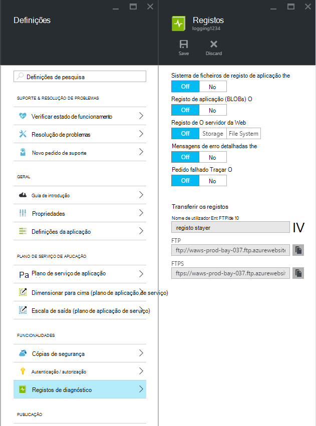
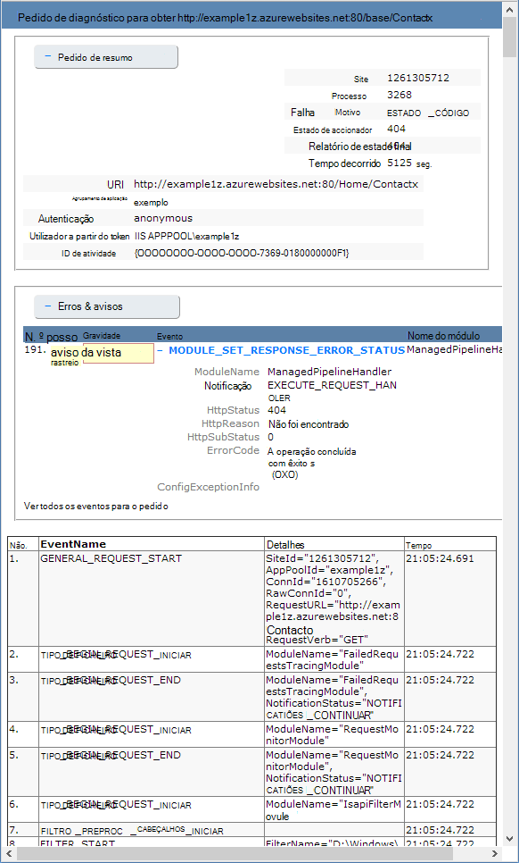

<properties
    pageTitle="Ativar o registo de diagnóstico para web apps no serviço de aplicação do Azure"
    description="Saiba como ativar o registo de diagnóstico e adicionar instrumentação à aplicação, bem como aceder às informações registadas pelo Azure."
    services="app-service"
    documentationCenter=".net"
    authors="cephalin"
    manager="wpickett"
    editor="jimbe"/>

<tags
    ms.service="app-service"
    ms.workload="na"
    ms.tgt_pltfrm="na"
    ms.devlang="na"
    ms.topic="article"
    ms.date="06/06/2016"
    ms.author="cephalin"/>

# Ativar o registo de diagnóstico para web apps no serviço de aplicação do Azure

## Descrição geral

Azure fornece diagnósticos incorporados para ajudá-lo a depuração de uma [aplicação de serviço web app](http://go.microsoft.com/fwlink/?LinkId=529714). Este artigo irá aprender como ativar o registo de diagnóstico e adicionar instrumentação à aplicação, bem como aceder às informações registadas pelo Azure.

Este artigo utiliza o [Portal do Azure](https://portal.azure.com), PowerShell do Azure e a Interface de comandos do Azure (Azure CLI) para trabalhar com registos de diagnóstico. Para obter informações sobre como trabalhar com registos de diagnóstico utilizando o Visual Studio, consulte o artigo [Resolução de problemas Azure no Visual Studio](web-sites-dotnet-troubleshoot-visual-studio.md).

[AZURE.INCLUDE [app-service-web-to-api-and-mobile](../../includes/app-service-web-to-api-and-mobile.md)]

## Diagnósticos do servidor Web e diagnósticos de aplicação

Aplicação de serviço web apps fornecem uma funcionalidade de diagnóstico para informações de registo do servidor web e a aplicação web. Estas são logicamente separadas para **Diagnósticos do servidor web** e **Diagnósticos de aplicação**.

### Diagnósticos do servidor Web

Pode ativar ou desativar os seguintes tipos de registos:

- **Registo de erro detalhada** - informações de erro detalhada para códigos de estado HTTP que indiquem uma falha (código de estado 400 ou maior). Isto pode conter informações que podem ajudar a determinar porque é que o servidor devolvido o código de erro.
- **Ocorreu uma falha de pedido de rastreio** - informações detalhadas sobre pedidos de falhados, incluindo um rastreio dos componentes do IIS utilizada para processar o pedido e o tempo despendido em cada componente. Isto pode ser útil se estiver a tentar aumentar o desempenho do site ou isolar o que está a causar um erro HTTP específico ser devolvido.
- **Registo de servidor web** - informações sobre as transações de HTTP utilizando o [formato de ficheiro de registo expandido W3C](http://msdn.microsoft.com/library/windows/desktop/aa814385.aspx). Isto é útil quando determinar geral métricas de site como o número de pedidos processados ou pedidos de quantas são de um endereço IP específico.

### Diagnósticos de aplicação

Diagnósticos de aplicação permite-lhe capturar informações produzidas por uma aplicação web. Aplicações do ASP.NET podem utilizar a classe de [System.Diagnostics.Trace](http://msdn.microsoft.com/library/36hhw2t6.aspx) para registar informações para o registo de diagnóstico de aplicação. Por exemplo:

    System.Diagnostics.Trace.TraceError("If you're seeing this, something bad happened");

O tempo de execução pode obter estes registos para o ajudar com a resolução de problemas. Para mais informações, consulte o artigo [resolução de problemas Azure web apps no Visual Studio](web-sites-dotnet-troubleshoot-visual-studio.md).

Aplicação de serviço web apps também registar informações de implementação durante a publicação de conteúdo para uma aplicação web. Isto acontece automaticamente e não existem definições configuração para o registo de implementação. Registo de implementação permite-lhe determinar a razão pela qual uma implementação falhou. Por exemplo, se estiver a utilizar um script de implementação personalizada, poderá utilizar o registo de implementação para determinar por que motivo o script está a falhar.

## Como ativar diagnósticos

Para ativar diagnósticos no [Portal do Azure](https://portal.azure.com), aceda a pá para a sua aplicação web e clique em **Definições > registos de diagnóstico**.

<!-- todo:cleanup dogfood addresses in screenshot -->

Quando ativa **Diagnósticos de aplicação** também escolher o **nível**. Esta definição permite-lhe filtrar as informações capturadas às informações **informativo**, **aviso** ou **um erro** . Esta definição para **verboso** registará todas as informações produzidas pela aplicação.

> [AZURE.NOTE] Ao contrário de alterar o ficheiro da Web. config, permitindo-diagnósticos de aplicação ou alterar níveis de registo de diagnóstico não Reciclagem o domínio de aplicação que a aplicação é executada dentro.

No separador de **Configurar** [portal clássica](https://manage.windowsazure.com) Web app, pode selecionar **armazenamento** ou **sistema de ficheiros** para o **registo de servidor web**. Selecionar **armazenamento** permite-lhe selecionar uma conta de armazenamento e, em seguida, um contentor de BLOBs que os registos serão sejam escritos nos. Todos os outros registos de **diagnóstico do site** são escritos apenas o sistema de ficheiros.

No separador **Configurar** do [portal clássica](https://manage.windowsazure.com) Web app também tem definições adicionais para diagnósticos de aplicação:

* **Sistema de ficheiros** - armazena as informações de diagnóstico de aplicação para o sistema de ficheiros de aplicação web. Estes ficheiros podem ser acedidos por FTP ou transferidos como um arquivo Zip utilizando o Azure PowerShell ou a Interface de comandos do Azure (Azure CLI).
* **Armazenamento de tabela** - armazena as informações de diagnóstico da aplicação, o nome de conta de armazenamento do Azure e tabela especificada.
* **Armazenamento de BLOBs** - armazena as informações de diagnóstico de aplicação no contentor de conta de armazenamento do Azure e blob especificado.
* **Período de retenção** – por predefinição, os registos não são automaticamente eliminados de **armazenamento de BLOBs**. Selecione **Configurar retenção** e introduza o número de dias para manter os registos, se pretender eliminar automaticamente os registos.

>[AZURE.NOTE] Se a [Gerar teclas de acesso da sua conta de armazenamento](storage-create-storage-account.md#view-copy-and-regenerate-storage-access-keys), terá de repor a configuração do registo respetivos para utilizar as teclas atualizadas. Para fazer isto:
>
> 1. No separador **Configurar** , defina a funcionalidade de registo respetivos para **desativar**. Guarde a sua definição.
> 2. Ative o registo de Blobs do armazenamento conta ou tabela novamente. Guarde a sua definição.

Qualquer combinação de sistema de ficheiros de armazenamento de Blobs do armazenamento de tabela pode ser ativada ao mesmo tempo e ter configurações de nível de registo individuais. Por exemplo, poderá pretender registar erros e avisos para blob armazenamento como uma solução de registo a longo prazo, permitindo registo do sistema de ficheiros com um nível de verboso.

Enquanto todas as localizações de armazenamento três fornecem as mesmas informações básicas para eventos com sessão iniciada, **armazenamento de tabela** e **armazenamento de BLOBs** inicie sessão informações adicionais, como o ID da instância, o ID de tópico e um carimbo mais granular (formato de escala) que o registo do **sistema de ficheiros**.

> [AZURE.NOTE] Só podem ser acedidas informações armazenadas no **armazenamento de tabela** ou **armazenamento de BLOBs** utilizar um cliente de armazenamento ou uma aplicação que diretamente pode trabalhar com estes sistemas de armazenamento. Por exemplo, o Visual Studio 2013 contém o Explorador de armazenamento que podem ser utilizados para explorar o armazenamento de tabela ou blob e HDInsight pode aceder aos dados armazenados no armazenamento blob. Também pode escrever uma aplicação que acede armazenamento do Windows Azure utilizando uma do [SDK do Azure](/downloads/#).

> [AZURE.NOTE] Também podem ser ativados diagnósticos do PowerShell Azure utilizando o cmdlet **Set-AzureWebsite** . Se não tiver instalado o Azure PowerShell, ou se não tiver configurado para utilizar a sua subscrição do Azure, veja [como utilizar o PowerShell Azure](/develop/nodejs/how-to-guides/powershell-cmdlets/).

##Como: transferir registos

Informações de diagnóstico armazenadas para o sistema de ficheiros de aplicação web podem ser acedidas diretamente utilizando FTP. Também pode ser transferido como um arquivo de Zip utilizando o PowerShell do Azure ou a Interface de comandos do Azure.

A estrutura do directório de registos são armazenados em é da seguinte forma:

* **Registos da aplicação** - /LogFiles/aplicações /. Esta pasta contém um ou mais ficheiros de texto que contém informações produzidas pelo registo de aplicação.

* **Ocorreu uma falha pedido rastreios** - / ficheiros de registo/W3SVC # # # /. Esta pasta contém um ficheiro XSL e um ou mais ficheiros XML. Certifique-se de que transferir o ficheiro XSL no diretório do mesmo como ficheiro (s) XML porque o ficheiro XSL fornece a funcionalidade de formatação e filtragem de conteúdos dos ficheiros XML quando visualizado no Internet Explorer.

* **Registos de erro detalhada** - /LogFiles/DetailedErrors /. Esta pasta contém um ou mais ficheiros. htm que fornecem informações extensas qualquer para erros de HTTP que tenham ocorrido.

* **Os registos do servidor web** - /LogFiles/http/RawLogs. Esta pasta contém um ou mais ficheiros de texto formatados utilizando o [formato de ficheiro de registo expandido W3C](http://msdn.microsoft.com/library/windows/desktop/aa814385.aspx).

* **Registos de implementação** - / ficheiros de registo/Git. Esta pasta contém registos gerados pelos processos de implementação interna utilizados por aplicações Azure web, bem como os registos para implementações Git.

### FTP

Para aceder a informações de diagnóstico utilizando FTP, visite o **Dashboard** da sua aplicação web no [portal clássica](https://manage.windowsazure.com). Na secção **vista rápida** , utilize a ligação de **FTP registos de diagnóstico** para aceder a ficheiros de registo utilizando FTP. A **Implementação/FTP utilizador** entrada registrar apresenta o nome de utilizador que deve ser utilizado para aceder ao site FTP.

> [AZURE.NOTE] Se a entrada de **Utilizadores de implementação/FTP** não estiver definida, ou se esqueceu-se a palavra-passe para este utilizador, pode criar um novo utilizador e palavra-passe utilizando a ligação **Repor as credenciais de implementação** na secção **vista rápida** do **Dashboard**.

### Transferir com Azure PowerShell

Para transferir os ficheiros de registo, inicie uma nova instância do PowerShell do Azure e utilize o seguinte comando:

    Save-AzureWebSiteLog -Name webappname

Isto irá guardar os registos para a aplicação web especificado pela **-nome** parâmetro para um ficheiro com o nome **logs.zip** no diretório atual.

> [AZURE.NOTE] Se não tiver instalado o Azure PowerShell, ou se não tiver configurado para utilizar a sua subscrição do Azure, veja [como utilizar o PowerShell Azure](/develop/nodejs/how-to-guides/powershell-cmdlets/).

### Transferir com Azure Interface de comandos

Para transferir os ficheiros de registo utilizando a Interface de linha de comandos do Azure, abra uma nova linha de comandos, PowerShell, festa ou sessão Terminal e introduza o seguinte comando:

    azure site log download webappname

Isto irá guardar os registos para a aplicação web com o nome webappname num ficheiro denominado **diagnostics.zip** no diretório atual.

> [AZURE.NOTE] Se não tiver instalado o Interface de comandos do Azure (Azure CLI), ou se não tiver configurado para utilizar a sua subscrição do Azure, veja [como utilizar o clip do Azure](../xplat-cli-install.md).

## Como: ver os registos na aplicação de informações

Informações de aplicação do Visual Studio fornece ferramentas para filtrar e procurar registos e para correlacionar os registos com os pedidos e outros eventos.

1. Adicione o SDK de informações da aplicação ao seu projeto no Visual Studio.
 * No Explorador de solução, clique com o botão direito do rato em seu projeto e selecione Adicionar informações de aplicação. Receberá indicações passos que incluem a criação de um recurso de informações da aplicação. [Saiba mais](../application-insights/app-insights-asp-net.md)
2. Adicione o pacote de rastreio escuta ao seu projeto.
 * Clique com o botão direito do rato em seu projeto e selecione gerir pacotes de NuGet. Selecione `Microsoft.ApplicationInsights.TraceListener` [Saiba mais](../application-insights/app-insights-asp-net-trace-logs.md)
3. Carregue o seu projeto e executá-la para gerar os dados do registo.
4. No [Portal do Azure](https://portal.azure.com/), navegue para o seu novo recurso de informações da aplicação e abra a **pesquisa**. Verá os dados do registo, juntamente com o pedido, a utilização e outros telemetria. Algumas telemetria poderá demorar alguns minutos a chegar: clique em Atualizar. [Saiba mais](../application-insights/app-insights-diagnostic-search.md)

[Saiba mais sobre o desempenho do controlo com informações de aplicação](../application-insights/app-insights-azure-web-apps.md)

##Como: transmitir em fluxo registos

Enquanto desenvolver uma aplicação, muitas vezes é útil ver informações de registo em tempo perto real. Isto pode ser feito por transmissão informações de registo para o seu ambiente de desenvolvimento utilizando Azure PowerShell ou a Interface de comandos do Azure.

> [AZURE.NOTE] Alguns tipos de registo do intervalo de tempo escreverem o ficheiro de registo, que pode resultar em eventos de ordem na sequência. Por exemplo, poderá ser apresentada uma entrada de registo de aplicação que ocorre quando um utilizador visita uma página na sequência antes da entrada de registo HTTP correspondente para o pedido de página.

> [AZURE.NOTE] Transmissão de registo será também transmitir em fluxo informação escrita para qualquer ficheiro de texto armazenado na **D:\\casa\\ficheiros de registo\\ ** pasta.

### Transmissão com Azure PowerShell

Para transmitir em fluxo informações de registo, inicie uma nova instância do PowerShell do Azure e utilize o seguinte comando:

    Get-AzureWebSiteLog -Name webappname -Tail

Isto irá ligar para a aplicação web especificada pela **-nome** parâmetro e comece a transmissão de informações para a janela do PowerShell como ocorrem eventos de registo no web app. Quaisquer informações escritos nos ficheiros que terminem em. htm,. log ou. txt que estão armazenados no diretório /LogFiles (d/base/ficheiros de registo) transmitido em sequência consola local.

Para filtrar eventos específicos, tal como erros, utilize o **-mensagem** parâmetro. Por exemplo:

    Get-AzureWebSiteLog -Name webappname -Tail -Message Error

Para filtrar os tipos de registo específico, tal como HTTP, utilize o **-caminho** parâmetro. Por exemplo:

    Get-AzureWebSiteLog -Name webappname -Tail -Path http

Para ver uma lista de caminhos disponíveis, utilize o parâmetro - ListPath.

> [AZURE.NOTE] Se não tiver instalado o Azure PowerShell, ou se não tiver configurado para utilizar a sua subscrição do Azure, veja [como utilizar o PowerShell Azure](/develop/nodejs/how-to-guides/powershell-cmdlets/).

### Transmissão com Azure Interface de comandos

Para transmitir em fluxo informações de registo, abra uma nova linha de comandos, PowerShell, festa ou sessão Terminal e introduza o seguinte comando:

    azure site log tail webappname

Isto irá ligar-se para a aplicação web 'webappname' com o nome e comece a transmissão de informações para a janela de medida que ocorrem eventos de registo da aplicação web do. Quaisquer informações escritos nos ficheiros que terminem em. htm,. log ou. txt que estão armazenados no diretório /LogFiles (d/base/ficheiros de registo) transmitido em sequência consola local.

Para filtrar eventos específicos, tal como erros, utilize o **– filtro** parâmetro. Por exemplo:

    azure site log tail webappname --filter Error

Para filtrar os tipos de registo específico, tal como HTTP, utilize o **– caminho** parâmetro. Por exemplo:

    azure site log tail webappname --path http

> [AZURE.NOTE] Se não tiver instalado o Interface de comandos do Azure, ou se não tiver configurado para utilizar a sua subscrição do Azure, consulte o artigo [como para utilizar o Azure da linha de comandos Interface](../xplat-cli-install.md).

##Como: compreender os registos de diagnóstico

### Registos de diagnóstico da aplicação

Aplicação diagnósticos armazena informações num formato específico para aplicações do .NET, dependendo se armazena os registos para o sistema de ficheiros, armazenamento de tabela ou armazenamento de Blobs. O conjunto de base de dados armazenados é igual em todos os três tipos de armazenamento - a data e hora em que ocorreu o evento, o ID do processo que produzidos o evento, o tipo de evento (informações aviso, erro) e a mensagem de evento.

__Sistema de ficheiros__

Cada linha tem sessão iniciada o sistema de ficheiros ou recebido através da transmissão será no seguinte formato:

    {Date}  PID[{process id}] {event type/level} {message}

Por exemplo, um evento de erro apareceriam semelhante ao seguinte:

    2014-01-30T16:36:59  PID[3096] Error       Fatal error on the page!

Funcionalidade de registo para o sistema de ficheiros fornece as informações básicas mais de três métodos disponíveis, fornecer apenas a hora, o id de processo, nível de eventos e mensagem.

__Armazenamento de tabela__

Quando o registo ao armazenamento de tabelas, propriedades adicionais são utilizadas para facilitar a procurar os dados armazenados na tabela, bem como mais granulares informações sobre o evento. As seguintes propriedades (colunas) são utilizadas para cada entidade (linha) armazenada na tabela.

Nome da propriedade|Formato do valor
---|---
PartitionKey|Data/hora do evento no formato de yyyyMMddHH
RowKey|Um valor GUID que identifica exclusivamente esta entidade
Data/hora|A data e hora em que ocorreu o evento
EventTickCount|A data e hora em que ocorreu o evento, no formato de escala (maior precisão)
ApplicationName|No nome da aplicação web
Nível|Nível de eventos (por exemplo, erro, aviso, informações)
IDdoevento|O ID deste evento

Predefinições de 0 se não especificado nenhum
InstanceId|Instância da aplicação web que ocorreu o mesmo no
PID|ID do processo
TID|O ID do tópico do tópico de que produzidos o evento
Mensagem|Mensagem de detalhes do evento

__Armazenamento de BLOBs__

Ao iniciar sessão blob armazenamento, os dados são armazenados no formato de valores separados por vírgulas (CSV). Semelhante ao armazenamento de tabelas, campos adicionais são registados para fornecer mais granulares informações sobre o evento. As seguintes propriedades são utilizadas para cada linha de CSV:

Nome da propriedade|Formato do valor
---|---
Data|A data e hora em que ocorreu o evento
Nível|Nível de eventos (por exemplo, erro, aviso, informações)
ApplicationName|No nome da aplicação web
InstanceId|Instância da aplicação web que ocorreu o evento no
EventTickCount|A data e hora em que ocorreu o evento, no formato de escala (maior precisão)
IDdoevento|O ID deste evento

Predefinições de 0 se não especificado nenhum
PID|ID do processo
TID|O ID do tópico do tópico de que produzidos o evento
Mensagem|Mensagem de detalhes do evento

Os dados armazenados num blob seria semelhantes ao seguinte:

    date,level,applicationName,instanceId,eventTickCount,eventId,pid,tid,message
    2014-01-30T16:36:52,Error,mywebapp,6ee38a,635266966128818593,0,3096,9,An error occurred

> [AZURE.NOTE] A primeira linha do registo de irá conter os cabeçalhos de coluna, tal como ilustrado neste exemplo.

### Ocorreu uma falha pedido rastreios

Ocorreu uma falha pedido rastreios são armazenados em ficheiros XML com o nome __. XML de # # # f__. Para tornar mais fácil de ver as informações com sessão iniciada, uma folha de estilos XSL denominada __freb.xsl__ é fornecida no diretório do mesmo como os ficheiros XML. Abrir um dos ficheiros XML no Internet Explorer irá utilizar para fornecer uma visualização formatada as informações de rastreio de folha de estilos XSL. Irão aparecer semelhante ao seguinte:

### Registos de erro detalhada

Os registos de erro detalhada são documentos HTML que fornecem informações mais detalhadas sobre erros HTTP que tenham ocorrido. Uma vez que são simplesmente documentos HTML, podem ser visualizadas utilizando um browser.

### Registos do servidor Web

Os registos do servidor web são formatados utilizando o [formato de ficheiro de registo expandido W3C](http://msdn.microsoft.com/library/windows/desktop/aa814385.aspx). Estas informações podem ser lidos utilizando um editor de texto ou analisada utilizando utilitários de como o [Analisador de registo](http://go.microsoft.com/fwlink/?LinkId=246619).

> [AZURE.NOTE] Os registos produzidos por aplicações Azure web não suportam os campos __nome do computador-s__, __s-ip__ou __versão cs__ .

##Próximos passos

- [Como monitorizar aplicações Web](/manage/services/web-sites/how-to-monitor-websites/)
- [Resolução de problemas Azure web apps no Visual Studio](web-sites-dotnet-troubleshoot-visual-studio.md)
- [Analisar os registos do web app no HDInsight](http://gallery.technet.microsoft.com/scriptcenter/Analyses-Windows-Azure-web-0b27d413)

> [AZURE.NOTE] Se pretender começar a aplicação de serviço de Azure antes de inscrever-se para uma conta do Azure, aceda ao [Tentar aplicação de serviço](http://go.microsoft.com/fwlink/?LinkId=523751), onde imediatamente pode criar uma aplicação web do starter curto na aplicação de serviço. Sem cartões de crédito necessários; sem compromissos.

## O que é alterado
* Para um guia para a alteração de Web sites para a aplicação de serviço Consulte o artigo: [aplicação de serviço de Azure e respectivo impacto na existente dos serviços do Azure](http://go.microsoft.com/fwlink/?LinkId=529714)
* Para um guia para a alteração do portal antigo para o novo portal consulte o artigo: [referência para navegar portal do Azure](http://go.microsoft.com/fwlink/?LinkId=529715)
 
