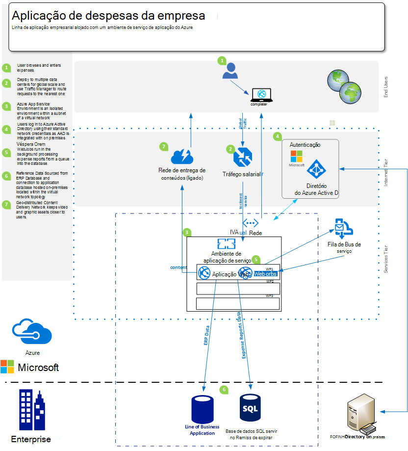

<properties 
    pageTitle="Azure aplicação Web Apps ofertas de serviço para o Enterprise" 
    description="Mostra como utilizar as aplicações do Azure aplicação de serviço Web para criar enterprise soluções de Web site para a sua empresa" 
    services="app-service\web" 
    documentationCenter="" 
    authors="apwestgarth" 
    manager="wpickett" 
    editor=""/>

<tags 
    ms.service="app-service-web" 
    ms.workload="web" 
    ms.tgt_pltfrm="na" 
    ms.devlang="na" 
    ms.topic="article" 
    ms.date="07/29/2016" 
    ms.author="anwestg"/>

# Azure de aplicação de serviço Web Apps ofertas para documento técnico de empresa #

A necessidade de reduzir os custos e entregar soluções de TI mais rápidas num ambiente rápida evolução cria novos desafios para programadores, profissionais de TI e os gestores de. Os utilizadores cada vez estão à procura suas aplicações de web linha de negócio (LOB) ser disponível a partir de qualquer dispositivo, responder e rápido. Ao mesmo tempo, empresas estão a tentar capitalize a produtividade aumentada e a eficiência que sejam oriundos de integração com o cloud e serviços móveis, este pode ser algo tão simple como single sign-on em todos os dispositivos utilizando o Active Directory para colaboração no Office 365 através de dados importados a partir de uma aplicação de LOB interna que por sua vez obtém dados a partir da execução de empresa do Salesforce. [Azure aplicação de serviço Web Apps](http://go.microsoft.com/fwlink/?LinkId=529714) é um serviço de nuvem de classe empresarial para desenvolver, testar e executar web e aplicações móveis, APIs da Web e Web sites genéricos. Pode ser utilizada para executar a Web sites da empresa, sites da intranet, aplicações empresariais e campanhas de marketing digitais numa rede de centros de dados otimizados para escala e disponibilidade, juntamente com o suporte para integração contínua global e práticas DevOps Moderno.  

Este documento técnico realça as funcionalidades do serviço [Web Apps](/services/app-service/web/) centrado especificamente sobre como executar LOB as aplicações Web, abrangendo migração das aplicações web existentes e implementação das novas aplicações de web LOB a plataforma. 

## Audiência ##

Os profissionais de TI, arquitectura e gestores de quem está à procura de migrar para as nuvem web das cargas de trabalho que estão atualmente em execução no local. Podem ocupar cargas de trabalho de Web em empresas empregado ou empresas com aplicações web de parceiros.

## Introdução ##

Aplicação serviço Web Apps é uma plataforma ideal na qual pretende alojar aplicações web internas e externas e serviços à medida que fornece uma rentável altamente dimensionável gerida solução, permitindo-lhe para se concentrar nos fornecer valor empresas para os seus utilizadores em vez de despesas significativas quantidades de tempo e dinheiro mantendo e suporte separam os ambientes. Web Apps oferece uma plataforma flexível na qual pretende implementar aplicações web enterprise perguntar se a capacidade de continuar a autenticar no Active Directory local através da integração com o Microsoft Azure Active Directory, suporte de fácil e rápidas implementações efetuar utilização de seu internas contínuas integração e implementação práticas, enquanto automaticamente dimensionamento para aumentar as com as necessidades de negócio - tudo numa plataforma gerida que permite-lhe concentrar-se na aplicação e não a sua infraestrutura. 

## Definição de problema ##

Paisagem IT está a alterar rapidamente, com uma mover afastando-o alojamento em servidores tradicionais com os seus custos capitais alto no prazo de entrega longo horas para um que utiliza a pedido utilizar serviços Dimensionar automaticamente para processar carga. Contestação de departamentos de TI para reduzir o custo e ambiental dos infraestrutura e a manutenção passam com um foco na redução CAPEX enquanto também aumentando agilidade. O fim do ciclo de vida de plataformas infraestrutura mais antigas, como o Windows Server 2003, é levando os departamentos de TI para rever migração na nuvem, de forma potenciais para evitar custos de capital novo longo prazo. No passado, CIOs tornaria decisões de compra para outros serviços; No entanto, cada vez CMOs e outros chefes de unidade empresas estão a efetuar uma função mais ativa no como o seu orçamento é gasto e o que é o retorno do seu investimento. Cada vez, empresas necessitam os respetivos força de trabalho para ser muito mais móvel que nunca com funcionários trabalhar remotamente, demorar mais tempo com os clientes que necessitam de acesso para sistemas sem problemas gratuito.

Suas necessidades empresariais mensais, semanais, diariamente. Empresas estão à procura instantânea escala global com serviços atualizadas regulares completo das novas funcionalidades, fornecidas de terceiros ou internamente.  Em alguns casos empresas são também está à procura das capacidades isolar as suas aplicações e aceder aos recursos, embora o efetuar também utilização de nuvem público instalações. Os utilizadores têm expectativas superiores, com muitas que façam uso de serviços no seus próprio vidas privados como o Office 365. Que esperam ter acesso a funcionalidade semelhantes, atualizados, rich serviços no seu ciclo de vida do trabalho. Para fazer face este pedido, IT tem aspeto para ajudar o negócio para ativar esta através de seleção e integração com terceiros serviços, cuidadosa de seleção de plataformas de adaptação às necessidades de negócio, embora também a ser fiável com um custo total reduzido de propriedade.

As equipas de programação estiver à procura para entregar a vantagem de empresas de imediato, fornecer as novas funcionalidades frequente faseadamente no. Está à procura de uma plataforma rentável, fiável que integra-se com o seu teste de ferramentas e práticas – desenvolvimento, existente, liberte; e trabalhar juntamente com os departamentos de TI automatiza implementação, gestão e alertar, tudo com o propósito de zero tempo de inatividade.

<a href="highlevel" />
## Solução nível alta ##

Plataformas de Web e quadros cada vez estão a ser utilizados para desenvolver, testar e linha de aplicações empresariais do anfitrião.  Com uma linha típica de aplicação empresarial, tal como um sistema de despesas de empregado interno, muitas vezes constituídos apenas uma aplicação web com uma base de dados de segurança para armazenar os dados ligados com a aplicação.

Aplicação de serviço Web Apps é uma boa opção para alojamento estas aplicações, que oferece infraestrutura e dimensionável que é gerida e corrigida com perto do zero intervenção manual e o tempo de inatividade. A plataforma do Microsoft Azure fornece várias opções de armazenamento de dados para suportar as aplicações web alojadas no Web Apps a partir do Microsoft Azure SQL da base de dados, um geridos dimensionável relacional da base de dados-como-a-service, para os serviços de nossos parceiros como base de dados do MySQL ClearDB e MongoDB populares.

Uma abordagem alternativa é efetuar utilização do seu investimento existente no local. O cenário de exemplo, um sistema de despesas de empregado, poderá pretender manter o arquivo de dados no seu próprio infraestrutura interno. Isto pode dever-se para a integração com sistemas internos (elaboração de relatórios, folha de pagamentos, faturação, etc.) ou satisfazer um requisito de governação IT.  Web Apps fornece um número de métodos de permitindo-lhe ligar à sua infraestrutura de local no:

- [Aplicação de serviço ambientes](app-service-app-service-environment-intro.md) - ambientes de serviço de aplicação (Auxiliar) são uma nova funcionalidade de Premium qual foi recentemente adicionar para a oferta de serviço de aplicação do Microsoft Azure.  ASEs proporcionar um ambiente totalmente isolado e dedicado para segura execução do aplicações de serviço de aplicação do Azure alta enquanto também oferece isolamento e acesso seguro à rede   
- [Ligações de híbrido](../biztalk-services/integration-hybrid-connection-overview.md) – híbrido ligações são uma funcionalidade do Microsoft Azure BizTalk Services e ativar Web Apps ligar a no local recursos de forma segura, por exemplo, SQL Server, MySQL, APIs da Web e serviços web personalizada. 
- [Virtual integração com redes](https://azure.microsoft.com/blog/2014/09/15/azure-websites-virtual-network-integration/) – integração de aplicações Web com a rede Virtual do Azure permite-lhe ligar a sua aplicação web a uma rede Virtual Azure que por sua vez que podem ser ligados à sua infraestrutura de local ligado através de uma VPN do site para o site. 

Diagramas seguintes representar uma solução de alto nível de exemplo com opções de conectividade para recursos de local.  O primeiro exemplo mostra como este pode ser realizado com funcionalidades padrão do serviço de aplicação do Azure, e o segundo mostra como este pode ser obtido utilizar premium perguntar se ambientes de serviço de aplicação.

Utilizar funcionalidades de padrão de aplicação de serviço:

Utilizar um ambiente de aplicação de serviço:

## Benefícios de negócio ##

Aplicação de serviço Web Apps fornece um anfitrião benefícios de empresas que permitem a sua função para ser rentável e ágil no faz para as necessidades de negócio muito mais. 

### Modelo de PaaS ###

Aplicação de serviço Web Apps está incorporado numa plataforma como um modelo de serviço que fornece um número de reduções de custos e eficiência.  Já não tem de passam horas gerir VMs, a aplicação de patches sistemas operativos e quadros. Web Apps é um ambiente corrigido automaticamente que permite-lhe focar-se em Gerir o aplicações web e não VMs, deixando equipas gratuitas fornecer valor comercial adicionais.

O modelo de PaaS subjacentes aos Web Apps permite médicos da metodologia de DevOps satisfazer os seus objetivos. Como um negócio Isto significa que totalmente a gestão e integração ao longo da aplicação completo ciclo de vida, incluindo desenvolvimento, testes, lançamento, monitorização e gestão e suporte. 

Para as equipas de programação, contínuos integração e implementação fluxos de trabalho podem ser configurados de serviços de equipa do Visual Studio, GitHub, TeamCity, Hudson ou BitBucket, ativação de compilação automatizada, teste e implementação ativar lançamento mais rápido ciclos, embora reduzir a fricção, normalmente soltar na infraestrutura existente. Web Apps também suporta a criação de testar vários e ambientes para o seu fluxo de trabalho do lançamento de transição, já não precisa reservar ou alocar hardware para estes efeitos, pode criar ambientes tantas à medida que pretende e definir o seu próprio promoção para libertar o fluxo de trabalho. Como uma empresa que poderá decidir solte para uma ranhura de teste de controlo de origem, execute uma série de testes e após a conclusão com êxito promover para uma ranhura fase e finalmente trocar produção com sem indisponibilidade, com a vantagem adicional que aplicações web alojadas no Web Apps são pré-carregados e quente para fornecer a experiência de melhor possíveis cliente.  Além disso empresas podem tornar utilize de testar nas funcionalidades de produção da aplicação de serviço Web Apps para direcionar uma secção de tráfego para uma ranhura diferente, validar as alterações antes de mudar de todo o tráfego para a nova implementação ou reverter todo o tráfego para a implementação anterior. 

Equipas de operações podem tiver dúvidas que estão na posição possível melhor resposta a quaisquer problemas com qualquer uma das suas aplicações web alojadas no Web Apps incorporado com funcionalidades de monitorização e alertas. Deverá equipas de operações ter já investido monitorização soluções, de informações de aplicação do Microsoft Visual Studio, Relic nova e AppDynamics e de análise. Estes também totalmente são suportados no Web Apps ativação continuidade e um ambientes familiares a partir do qual monitorizar aplicações web.

Por fim, Web Apps fornece funcionalidade para agregar automaticamente o seu app(s) e bases de dados a alojado direcionar a um contentor de armazenamento de Blobs do Azure. Fornecendo-lhe um método de forma e muito rentável fácil com a qual pretende recuperar de falhas, reduzir a necessidade de complexo no local hardware e software.

### Facilidade de migração ###

Manutenção de hardware e rotação é um problema chave para empresas como ciclos de lançamento do hardware e sistemas operativos acelerar. Talvez possui um número de servidores do Windows Server 2003 R2 que está a chegar ao fim de suporte no 2015 mas ainda estiver a alojar aplicações web chave para a sua empresa? Aplicação de serviço Web Apps é um ótimo candidato de alojar nessas aplicações web e para lhe racionalizar de imobiliário de hardware de empresas. Web Apps dá-lhe acesso a um intervalo de especificações de hardware que são geridos e mantidas como parte do serviço, eliminando a necessidade de factor substituição e os custos de gestão como parte do seu orçamento de infraestrutura.  Migração pode ser tão simples como uma cópia e colar a operação a partir da sua implementação existente para aplicações Web ou uma migração mais complexa onde a utilizar o Assistente de migração do Web Apps adicionará valor. Aplicações web migrados Desfrute de todo o espectro dos serviços do Azure, integrar serviços adicionais para as aplicações web. Por exemplo, pode considerar adicionar Azure Active Directory para controlar o acesso à aplicação com base na associação dos utilizadores aos grupos de segurança. Outro exemplo pode adicionar os serviços de Cache para melhorar o desempenho e reduzir a latência, fornecendo global melhor experiência de utilizador. 

### Alojamento de classe de empresa ###

Aplicação de serviço Web Apps fornece uma plataforma estável, fiável que tenha sido prova possam processar uma grande variedade de empresas necessidades pequenas internas desenvolvimento e teste das cargas de trabalho, a Web sites de tráfego de alta altamente com escala. Ao utilizar Web Apps, estiver a fazer utilizar da mesma plataforma alojamento de classe de empresa que o Microsoft como uma empresa utiliza para os valor elevado web das cargas de trabalho. As aplicações Web, juntamente com todos os serviços a plataforma Azure, são criadas com a segurança e conformidade com os requisitos de regulamentação, tal como ISO (ISO/IEC 27001:2005); SOC1 e SOC2 SSAE 16/ISAE 3402 garantias, HIPAA BAA, PCI e Fedramp, no coração muito de cada elemento e a funcionalidade, para obter mais informações consulte o artigo [http://aka.ms/azurecompliance](/support/trust-center/compliance/). 

Plataforma Microsoft Azure permite que os função com base autorização controlos ativar níveis de empresa do controlo recursos dentro Web Apps. RBAC dá empresas power para implementar os seus próprios políticas de gestão de acesso para todos os respetivos elementos no ambiente do Azure, atribuir utilizadores a grupos e sucessivamente atribuindo as permissões necessárias para esses grupos de elemento, tal como uma aplicação web. Para mais informações sobre RBAC no Azure, consulte o artigo [http://aka.ms/azurerbac](../active-directory/role-based-access-control-configure.md). Utilizando Web Apps, pode assegurar-as aplicações web são implementadas num ambiente seguro e têm controlo total para o qual território são implementados seus ativos. 

Azure ambientes de serviço de aplicação [http://aka.ms/aseintro](http://aka.ms/aseintro) são uma nova opção de plano de serviço de premium para clientes empresariais pretendam tornar a utilização da aplicação de serviço de Azure e estes fornecem um ambiente totalmente isolado e dedicado.  Isto permite que os clientes empresariais implementar aplicações que podem tirar partido da escala muito alta, embora também ter controlo total sobre o tráfego de rede de entrada e saída e ASEs permitem que as aplicações de ter ligações seguras de alta velocidade através de redes virtuais para recursos no local.

Aplicação de serviço Web Apps também que conseguem tirar partido dos seus em investimentos de local através da oferta a capacidade de ligar para os recursos internos, como o seu armazém de dados ou o ambiente do SharePoint. Tal como é abordado numa [solução de alto nível](#highlevel) que pode efetuar utilizar das ligações de híbrido e Virtual a conectividade da rede para estabelecer ligações a infraestrutura do local e serviços.

### Escala global ###

Aplicação de serviço Web Apps é uma plataforma global e dimensionável, permitindo aplicações web aumentar e adaptar às necessidades de um negócio crescente rapidamente e com o mínimo longo prazo planeamento e custo. No típico no cenários de infraestrutura de local, expansão e aumento da procura tanto localmente e geograficamente seriam requerer uma grande quantidade de gestão, planeamento e as despesas a aprovisionar e gerir a infraestrutura adicional. Web Apps oferece a capacidade de dimensionar aplicações web com a ebb e fluxo de seus requisitos. Por exemplo, utilizando a aplicação de despesas por exemplo, para a maioria dos mês os seus utilizadores estão simplificados utilizadores da aplicação, mas como o prazo cada mês, para submissões de despesas de ser introduzida e a utilização da aumenta na sua aplicação, Web Apps tem a funcionalidade para aprovisionar automaticamente infraestrutura mais para a sua aplicação e, em seguida, assim que a utilização de tem subsided novamente-pode dimensionar voltar a infraestrutura do plano base que define.

Web Apps está disponível globalmente no 24 centros de dados em todo o mundo e em crescimento. Para a lista mais actualizada das regiões e localização, consulte o artigo [http://aka.ms/azlocations](http://aka.ms/azlocations). Web Apps, a sua empresa pode facilmente alcançar alcance global e a escala. Que a sua empresa cresce para novas regiões, a elaboração de relatórios dashboards de aplicação que utiliza e anfitrião na Web Apps facilmente podem ser implementadas para centros de dados adicionais e servem utilizadores locais extremidade mais rapidamente através da combinação do Web Apps e o Gestor de tráfego de Azure, tudo com a vantagem de infraestrutura do dimensionável por baixo de ser capaz de contrato e expanda como as necessidades da alteração filiais.
 
## Detalhes da solução ##

Vamos ver um exemplo de um cenário de migração de aplicação. Isto destaca os detalhes de como funcionalidades aplicação serviço Web Apps Unidas fornecer ótimas solução e valor comercial.
 
Ao longo neste exemplo, a linha de aplicação empresarial que estamos irá tratar é uma aplicação que permite aos seus funcionários submeter as suas despesas de reembolso de elaboração de relatórios de despesas. A aplicação está alojada num Windows Server 2003 R2 em execução do IIS6 e a base de dados é uma base de dados do SQL Server 2005. O motivo optamos mais antigos servidor reside com o fim do serviço para o Windows Server 2003 R2 e o SQL Server 2005 próximos e temos [orientações](http://aka.ms/websitesmigrationresources) para migrar automaticamente das cargas de trabalho para o Azure e [Ferramentas](http://aka.ms/websitesmigration) . Com que deve ter em conta, o padrão de utilizados neste exemplo aplicar a uma vasta verity de cenários de migração. 

### Migrar aplicação existente ###

Passo um da solução geral para mover uma aplicação de linha de negócio para Web Apps é identificar a arquitectura e elementos de aplicação existente. O exemplo deste documento é uma aplicação web do ASP.NET alojada num único IIS servidor da base de dados alojado no SQL Server em separado, conforme apresentado na figura abaixo. Início de sessão de funcionários para o sistema utilizando uma combinação de nome de utilizador e palavra-passe, introduza os detalhes das despesas e carregar digitalizadas cópias das receitas, para a base de dados, para cada item de despesas. 
 

#### Itens a considerar ####

Quando aplicação de migração a partir de um ambiente no local, poderá pretender ter em conta, algumas restrições de Web Apps. Eis alguns tópicos chaves ter em consideração quando migrar aplicações web às aplicações Web ([http://aka.ms/websitesmigrationresources](http://aka.ms/websitesmigrationresources)):

-   Porta enlaces – Web Apps apenas suporta a porta 80 HTTP e uma porta 443 para o tráfego de HTTPS. Se a aplicação utiliza qualquer outra porta, em seguida, uma vez migradas a aplicação irá tornar utilização de porta 80 para HTTP e porta 443 para o tráfego de HTTPS. Este com frequência é um problema inofensivo, tal como está comuns na implementações local para tornar utilização de portas diferentes para poder ultrapassar a utilização de nomes de domínio, especialmente nos ambientes de desenvolvimento e de teste
-   Autenticação – Web Apps suporta autenticação anónima por predefinição e autenticação de formulários como identificadas por uma aplicação. Web Apps pode oferecer autenticação do Windows, quando a aplicação está integrada com o Azure Active Directory e ADFS apenas. Esta é uma funcionalidade que é abordada mais detalhadamente [aqui](http://aka.ms/azurebizapp) 
-   GAC com base assemblagem – Web Apps não permite a implementação de fluidos a Cache de assemblagem Global (GAC). Por isso, se a aplicação de ser migrada torna uso desta funcionalidade no local, considere mover conjuntos de para a pasta bin da aplicação.
-   IIS5 Modo de compatibilidade Web Apps não suporta o modo de compatibilidade IIS5 e, como tal cada instância do Web Apps e todas as aplicações web da instância de Web Apps principal são executados no processo de trabalho mesmo dentro de um único agrupamento de aplicações.
-   Utilização das bibliotecas COM – Web Apps não permite o registo de componentes COM a plataforma. Por isso, se a aplicação está a fazer utilizar de qualquer componentes do, estes precisa de ser reprogramados em código gerido e implementado com a aplicação.
-   Filtros ISAPI – os filtros ISAPI podem ser suportados na Web Apps. Estas terão de ser implementada como parte da aplicação e registado no ficheiro de Web. config a aplicação web. Para mais informações, consulte o artigo [http://aka.ms/azurewebsitesxdt](web-sites-transform-extend.md). 

Assim que foram considerados estes tópicos, a aplicação web deve estar pronta para a nuvem. E não se preocupe se alguns tópicos não são totalmente cumpridos, a ferramenta de migração atribuirá melhor esforço para migração. 

Os passos do processo de migração estão a criar um aplicação de serviço web app e uma base de dados do SQL Azure. Existem vários tamanhos de instâncias do Web Apps com número variado de CPU núcleos e disponíveis selecionar as quantidades de RAM com base no seu requisito de aplicações web. Para obter mais informações e preços, consulte o artigo [http://aka.ms/azurewebsitesskus](/pricing/details/websites/). Da mesma forma, base de dados do Microsoft Azure SQL caters para todas as necessidades de um negócio com várias camadas de serviços e níveis de desempenho para satisfazer necessidades. Informações adicionais podem ser encontradas em [http://aka.ms/azuresqldbskus](/pricing/details/sql-database/). Depois de criada, a aplicação é carregado para a aplicação de serviço Web Apps, quer através de FTP ou WebDeploy e, em seguida, mover para a base de dados.

Esta migração a solução utiliza base de dados do SQL Azure mas, ou seja, não apenas base de dados que é suportado no Azure. Também podem fazer empresas utilização do MySQL, MongoDB, Azure DocumentDB e muito mais através de suplementos que podem ser adquiridos na [Loja do Azure](/marketplace/partner-program/). 

Quando criar uma base de dados do SQL Azure um número de opções está disponível para importar uma base de dados existente a partir de um servidor no local a partir de um script de base de dados existente para utilizar os [dados camada aplicação exportar e importar](http://aka.ms/dacpac)a gerar. 

A base de dados de aplicação de despesas foi criado através da criação de uma nova base de dados do Azure SQL, ligar à base de dados do SQL Server Management Studio a utilizar e, em seguida, executar um script para construir o esquema da base de dados e preencha-a com dados da base de dados no local.

Necessita de passo final nesta fase primeiro da migração atualizar de cadeias de ligação à base de dados para a aplicação. Isto pode ser obtido através do portal do Azure. Para cada web app pode modificar definições específicas da aplicação, incluindo quaisquer cadeias de ligação a ser utilizadas pela aplicação para ligar a uma base de dados a ser utilizado.

### Alternativas ao utilizar a base de dados do SQL Azure ###

A plataforma Azure oferece um número de alternativas ao utilizar a base de dados do SQL Azure como aplicações primária base de dados web, esta é para ativar ou seja, diferentes das cargas de trabalho Utilize de uma solução NoSQL ou para ativar a plataforma para se adequar às necessidades em termos de um negócio dados. Por exemplo, uma empresa poderá mantenha dados que não tem de ser armazenados externo ou num ambiente nuvem público e, consequentemente, seria para manter a utilização da sua base de dados no local.

#### Conectividade no local recursos ####
Aplicação de serviço Web Apps oferece várias opções para estabelecer ligação em recursos local, tais como bases de dados, permitindo-reutilização de infraestrutura de elevado valor existente. As opções são conforme indicado abaixo:

- Ambientes de aplicação de serviço são isolados e criadas dentro de uma sub-rede de uma rede virtual, por conseguinte, permitindo-o ambiente comunicar com os pontos finais privados localizados dentro da mesma rede virtual - [http://aka.ms/appserviceasenetworking](http://aka.ms/appserviceasenetworking)
- Integração da rede Virtual aplicações Web suporta a integração entre aplicações Web e uma rede Virtual Azure, permitindo-lhe acesso aos recursos em execução na sua rede Virtual que, se ligado à rede no local com VPN do site para o site, permite a conectividade direta para o seu em sistemas de local.
- Híbrido ligações são uma funcionalidade dos serviços de BizTalk Azure e fornecem uma forma fácil de ligar a individuais no local recursos, tais como SQL Server, MySQL, HTTP Web API e mais serviços Web personalizados.

#### Escala e RDP ####

À medida que um negócio cresce respetiva força de trabalho, através de aquisições ou de crescimento orgânico natural, por isso, também tem escala de aplicações para cumprir estes novos pedidos de web. Facto hoje é comum para ver uma ainda maior propagação de cocriação localizadas equipas e colaboradores remotos, por exemplo empresas com escritórios nos Estados Unidos, Europa e Ásia, com uma vendas móvel forçar em muitos territórios mais. Web Apps tem a funcionalidade para processar as alterações flexível na escala confortavelmente e automaticamente.

Aplicação de serviço Web Apps permite que as aplicações web ser configurado para dimensionar automaticamente através do portal do Azure, dependendo de dois vectores – agendado horas ou pela utilização da CPU. Dimensionamento do Web Apps automática fornece uma forma rentável e extremamente flexível para satisfazer para maiores alterações em utilização para todas as aplicações de negócio, a partir de aplicações web como o nossa despesas reportar sistema a Web sites, experiência uma rajada alta de tráfego de duração de uma breve de promoção de marketing. Para obter mais informações e orientações sobre dimensionamento das suas aplicações web utilizando Web Apps, consulte o artigo [como Web sites de escala](web-sites-scale.md).

Para além da flexibilidade dimensionamento das aplicações Web, a plataforma geral permite continuidade do negócio e RDP através da distribuição possível das aplicações web e os respetivos elementos em múltiplas centros de dados e regiões geográficas.

## Resumo ##
Aplicação de serviço Web Apps oferece uma solução flexível, rentável e responder às necessidades de um negócio num ambiente rápida evolução dinâmicas. Web Apps ajuda-o a empresas aumentar produtividade e eficiência dos fazendo com a utilização de uma plataforma gerida com modernas capacidades de DevOps e reduzida mãos a gestão, enquanto fornecem capacidades de empresa na escala, recuperação, segurança e integração com os recursos no local.

## Ligar a ação ##
Para mais informações sobre o serviço Azure aplicação serviço Web Apps, visite [http://aka.ms/enterprisewebsites](/services/websites/enterprise/) , onde podem ser origem obter mais informações e início de sessão para uma versão de avaliação hoje às [http://aka.ms/azuretrial](/pricing/free-trial/) para avaliar o serviço e descubra as vantagens da sua empresa.

[AZURE.INCLUDE [app-service-web-whats-changed](../../includes/app-service-web-whats-changed.md)]

[AZURE.INCLUDE [app-service-web-try-app-service](../../includes/app-service-web-try-app-service.md)]
 
 
