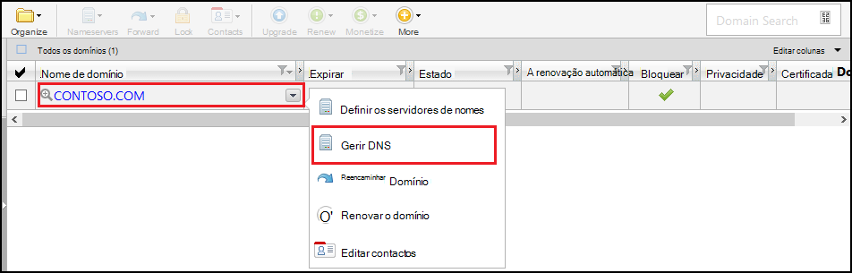
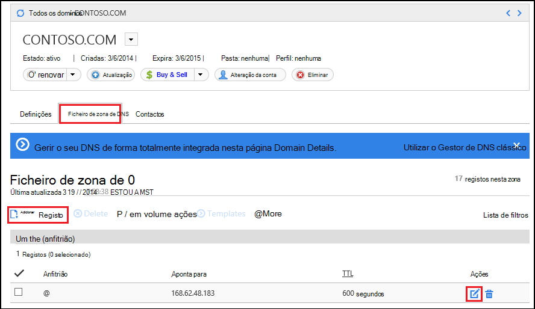
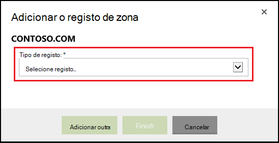
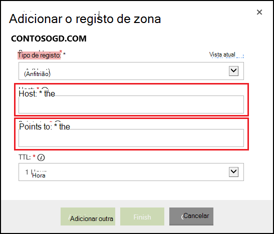

<properties
    pageTitle="Configurar um nome de domínio personalizado no Azure aplicação de serviço (GoDaddy)"
    description="Saiba como utilizar um nome de domínio da GoDaddy com o Azure Web Apps"
    services="app-service"
    documentationCenter=""
    authors="erikre"
    manager="wpickett"
    editor="jimbe"/>

<tags
    ms.service="app-service"
    ms.workload="na"
    ms.tgt_pltfrm="na"
    ms.devlang="na"
    ms.topic="article"
    ms.date="01/12/2016"
    ms.author="cephalin"/>

# Configurar um nome de domínio personalizado no Azure aplicação de serviço (comprado diretamente da GoDaddy)

[AZURE.INCLUDE [web-selector](../../includes/websites-custom-domain-selector.md)]

[AZURE.INCLUDE [intro](../../includes/custom-dns-web-site-intro.md)]

Se tiver comprado domínio através do Azure aplicação de serviço Web Apps, em seguida, consulte a passo final da [Comprar domínio para Web Apps](custom-dns-web-site-buydomains-web-app.md).

Este artigo fornece instruções sobre como utilizar um nome de domínio personalizado que foi comprado diretamente da [GoDaddy](https://godaddy.com) com a [Aplicação de serviço Web Apps](http://go.microsoft.com/fwlink/?LinkId=529714).

[AZURE.INCLUDE [introfooter](../../includes/custom-dns-web-site-intro-notes.md)]

##Noções sobre registos DNS

[AZURE.INCLUDE [understandingdns](../../includes/custom-dns-web-site-understanding-dns-raw.md)]

## Adicionar um registo DNS do seu domínio personalizado

Para associar o seu domínio personalizado uma aplicação web na aplicação de serviço, tem de adicionar uma nova entrada na tabela DNS do seu domínio personalizado utilizando ferramentas fornecidas da GoDaddy. Utilize os seguintes passos para localizar as ferramentas DNS para o GoDaddy.com

1. Inicie sessão sua conta com GoDaddy.com e selecione **A minha conta** e, em seguida, **Gerir os meus domínios**. Por fim, selecione o menu pendente para o nome do domínio que pretende utilizar com a aplicação web do Azure e selecione **Gerir DNS**.

    

2. Na página **Domain details** , desloque-se para o separador **DNS Zone File** . Esta é a secção utilizada para adicionar e modificar os registos DNS para o seu nome de domínio.

    

    Selecione **Add Record** para adicionar um registo existente.

    Para **Editar** um registo existente, selecione o ícone de papel & caneta junto ao registo.

    > [AZURE.NOTE] Antes de adicionar novos registos, tenha em atenção que GoDaddy já criou registos DNS para o populares subdomínios (denominados **anfitrião** no editor,) como o **correio eletrónico**, **ficheiros**, **correio**e outras pessoas. Se o nome que pretende utilizar já existir, modifique o registo existente em vez de criar um novo.

4. Quando adicionar um registo, primeiro tem de selecionar o tipo de registo.

    

    Em seguida, tem de fornecer o **anfitrião** (o domínio personalizado ou subdomínio) e o que **aponta para o**.

    

    * Ao adicionar **um registo (anfitrião de)** uma - tem de definir o campo **anfitrião** como quer **@** (Isto representa o nome de domínio de raiz, como **contoso.com**,) *(universal correspondentes vários subdomínios) ou o subdomínio que pretende utilizar (por exemplo, * *www**.) Tem de definir o * *aponta para o** campo para o endereço IP da sua aplicação Azure web.

    * Ao adicionar um **registo CNAME (alias)** - tem de definir o campo de **anfitrião do** subdomínio que pretende utilizar. Por exemplo, **www**. Tem de definir o **aponta para o** campo para a **. azurewebsites.net** nome de domínio da sua aplicação Azure web. Por exemplo, **contoso.azurewebsites.net**.

5. Clique em **Adicionar outra**.
6. Selecione **TXT** como o tipo de registo, em seguida, especifique um valor de **anfitrião** de **@** e um valor de **aponta para** de ** &lt;yourwebappname&gt;. azurewebsites.net**.

    > [AZURE.NOTE] Este registo TXT é utilizado por Azure para validar o que é proprietário do domínio descrito pelo registo a ou o primeiro registo TXT. Assim que o domínio foi mapeado para a aplicação web no Portal do Azure, pode ser removida esta entrada de registo TXT.

5. Quando tiver terminado de adicionar ou modificar registos, clique em **Concluir** para guardar as alterações.

## Ativar o nome de domínio na sua aplicação web

[AZURE.INCLUDE [modes](../../includes/custom-dns-web-site-enable-on-web-site.md)]

>[AZURE.NOTE] Se pretender começar a aplicação de serviço de Azure antes de inscrever-se para uma conta do Azure, aceda ao [Tentar aplicação de serviço](http://go.microsoft.com/fwlink/?LinkId=523751), onde imediatamente pode criar uma aplicação web do starter curto na aplicação de serviço. Sem cartões de crédito necessários; sem compromissos.

## O que é alterado
* Para um guia para a alteração de Web sites para a aplicação de serviço Consulte o artigo: [aplicação de serviço de Azure e respectivo impacto na existente dos serviços do Azure](http://go.microsoft.com/fwlink/?LinkId=529714)
