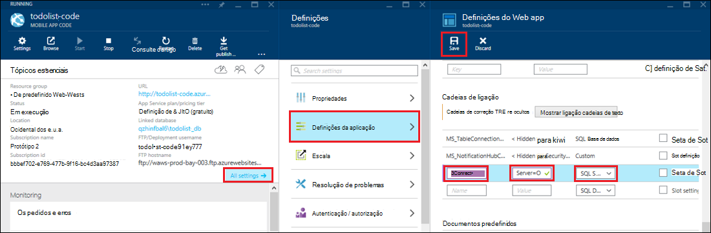

<properties 
    pageTitle="Recursos do Access no local utilizando ligações de híbrido no serviço de aplicação do Azure" 
    description="Criar uma ligação entre uma aplicação web na aplicação de serviço de Azure e um recurso no local que utiliza uma porta TCP estática" 
    services="app-service" 
    documentationCenter="" 
    authors="cephalin" 
    manager="wpickett" 
    editor="mollybos"/>

<tags 
    ms.service="app-service" 
    ms.workload="na" 
    ms.tgt_pltfrm="na" 
    ms.devlang="na" 
    ms.topic="article" 
    ms.date="02/03/2016" 
    ms.author="cephalin"/>

#Recursos do Access no local utilizando ligações de híbrido no serviço de aplicação do Azure

Pode ligar a uma aplicação de serviço de aplicação do Azure a qualquer outro recurso no local que utiliza uma porta TCP estática, tal como SQL Server, MySQL, HTTP Web API e a maioria dos serviços Web personalizados. Este artigo mostra-lhe como criar uma ligação de híbrida entre o serviço de aplicação e uma base de dados do SQL Server no local.

> [AZURE.NOTE] Parte da Web Apps da funcionalidade híbrido ligações está disponível apenas no [Portal do Azure](https://portal.azure.com). Para criar uma ligação no BizTalk Services, consulte o artigo [Híbrido ligações](http://go.microsoft.com/fwlink/p/?LinkID=397274). 
> 
> Este conteúdo também se aplica às aplicações móveis num serviço de aplicação do Azure. 

## Pré-requisitos
- Uma subscrição do Azure. Para uma subscrição livre, consulte o artigo [Versão de avaliação gratuita do Azure](https://azure.microsoft.com/pricing/free-trial/). 
 
    Se pretender começar a aplicação de serviço de Azure antes de inscrever-se para uma conta do Azure, aceda ao [Tentar aplicação de serviço](http://go.microsoft.com/fwlink/?LinkId=523751), onde imediatamente pode criar uma aplicação web do starter curto na aplicação de serviço. Sem cartões de crédito necessários; sem compromissos.

- Para utilizar uma base de dados do SQL Server ou do SQL Server Express no local com uma ligação de híbrido, TCP/IP tem de estar ativada numa porta estática. Utilizar uma instância predefinida no SQL Server é recomendado porque utiliza porta estática 1433. Para obter informações sobre a instalação e configuração do SQL Server Express para utilização com ligações de híbridas, consulte o artigo [ligar a um servidor do SQL no local de um web site Azure utilizando ligações de híbrido](http://go.microsoft.com/fwlink/?LinkID=397979).

- O computador no qual instala o agente de Gestor de ligação híbrido no local descrito neste artigo:

    - Tem de ser conseguir ligar ao Azure através da porta 5671
    - Tem de conseguir alcançar o *nome do anfitrião*:*NúmeroPorta* do seu recurso no local. 

> [AZURE.NOTE] Os passos neste artigo presumem que está a utilizar o browser do computador que será o anfitrião o agente de ligação de híbrido no local.

## Criar uma aplicação web no Portal do Azure ##

> [AZURE.NOTE] Se já tiver criado uma aplicação web ou back-end de aplicação Mobile no Portal do Azure que pretende utilizar para este tutorial, pode avançar para [criar uma ligação de híbrido e um serviço de BizTalk](#CreateHC) e iniciar a partir daí.

1. No canto superior esquerdo do [Portal do Azure](https://portal.azure.com), clique em **Novo** > **Web + Mobile** > **Web App**.
    
    ![Nova aplicação web][NewWebsite]
    
2. No pá **Web app** , disponibilizar um URL e clique em **Criar**. 
    
    ![Nome do Web site][WebsiteCreationBlade]
    
3. Depois de alguns minutos, a aplicação web é criada e é apresentada a sua pá de aplicação web. O pá é um dashboard verticalmente deslocável que permite-lhe gerir o seu site.
    
    ![Web site em execução][WebSiteRunningBlade]
    
4. Para verificar que o site é direto, pode clicar no ícone **Procurar** para apresentar a página predefinida.
    
    ![Clique em Procurar para ver a sua aplicação web][Browse]
    
    ![Página web app predefinida][DefaultWebSitePage]
    
Em seguida, irá criar uma ligação de híbrido e um serviço de BizTalk para a aplicação web.

## Criar uma ligação de híbrido e um serviço de BizTalk ##

1. No seu pá de aplicação web, clique em **todas as definições** > **funcionamento em rede** > **Configurar a ligação de híbrido pontos finais**.
    
    ![Ligações de híbrido][CreateHCHCIcon]
    
2. No pá de ligações híbrido, clique em **Adicionar**.
    
    <!-- ![Add a hybrid connnection][CreateHCAddHC]
-->
    
3. A **Adicionar uma ligação de híbrido** pá é aberta.  Dado que este é a sua primeira ligação híbrido, a opção da **nova ligação de híbrido** é seleccionada e a **ligação de híbrido criar** pá abre por si.
    
    ![Criar uma ligação de híbrido][TwinCreateHCBlades]
    
    No **pá de ligação de híbrido criar**:
    - **Nome**, forneça um nome para a ligação.
    - Para o **nome do anfitrião**, introduza o nome do computador no local que aloja o seu recurso.
    - **Porta**, introduza o número da porta que o seu recurso no local utiliza (1433 para uma instância do SQL Server predefinida).
    - Clique em **serviço de falar com Biz**

4. O **Serviço de BizTalk criar** pá é aberta. Introduza um nome para o serviço de BizTalk e, em seguida, clique em **OK**.
    
    ![Criar o serviço de BizTalk][CreateHCCreateBTS]
    
    O **Serviço de BizTalk criar** pá fecha e são devolvidos para a **ligação de híbrido criar** pá.
    
5. No pá de ligação de híbrido criar, clique em **OK**. 
    
    ![Clique em OK][CreateBTScomplete]
    
6. Quando concluir o processo, área de notificações no Portal do informa que a ligação foi criada com êxito.
    <!-TODO

    Tudo falha neste passo. Posso não é possível criar um serviço de BizTalk no portal do dogfood. Posso mudar para o portal clássico (completa portal) e que criou o serviço de BizTalk mas -lo parece não permitem-lhe ligá-los - quando concluir o passo de ligação de híbrido criar, recebe a seguinte mensagem de erro não foi possível criar ligação híbrido RelecIoudHC. Não foi possível encontrar o tipo de recurso no espaço de nomes 'Microsoft.BizTaIkServices para api versão 2014-06-01'.
    
    O erro indica que não foi possível localizar o tipo, não a instância.
    ![Notificação de sucesso][CreateHCSuccessNotification]
    -->
7. No pá do web app, o ícone de **ligações de híbrido** agora mostra que 1 ligação híbrido foi criada.
    
    ![Ligação de um híbrido criada][CreateHCOneConnectionCreated]
    
Neste momento, tiver concluído uma parte importante infraestrutura de ligação de implementações na nuvem. Em seguida, irá criar um elemento no local correspondente.

## Instalar o Gestor de ligação de híbrido no local para concluir a ligação ##

1. No pá do web app, clique em **todas as definições de** > **funcionamento em rede** > **Configurar a ligação de híbrido pontos finais**. 
    
    ![Ícone de ligações de híbrido][HCIcon]
    
2. No pá **ligações híbrido** , a coluna **Estado** para o ponto final adicionada recentemente mostra **não ligado**. Clique na ligação configurá-lo.
    
    ![Não ligado][NotConnected]
    
    É aberta a pá de ligação híbrido.
    
    ![NotConnectedBlade][NotConnectedBlade]
    
3. No pá, clique em **Configuração escuta**.
    
    ![Clique em configuração escuta][ClickListenerSetup]
    
4. A **Propriedades de ligação híbrido** pá é aberta. Em **Gestor de ligação de híbrido no local**, selecione **clique aqui para instalar**.
    
    ![Clique aqui para instalar][ClickToInstallHCM]
    
5. No diálogo de aviso de segurança executar a aplicação, selecione **Executar** para continuar.
    
    ![Selecione executar para continuar a][ApplicationRunWarning]
    
6.  Na caixa de diálogo **Controlo de conta de utilizador** , escolha **Sim**.
    
    ![Selecione Sim][UAC]
    
7. O Gestor de ligação híbrido é transferido e instalado para si. 
    
    ![Instalar o][HCMInstalling]
    
8. Quando concluir a instalação, clique em **Fechar**.
    
    ![Clique em Fechar][HCMInstallComplete]
    
    No pá **ligações híbrido** , a coluna **Estado** mostra agora **ligado**. 
    
    ![Estado ligado][HCStatusConnected]

Agora que a infraestrutura de ligação Híbrido estiver concluída, pode criar uma aplicação híbrida que utiliza-lo. 

>[AZURE.NOTE]As secções seguintes mostram-lhe como utilizar uma ligação de híbrido com um projeto de back-end .NET de aplicações móveis.

## Configurar o projeto de back-end .NET de aplicação móvel para se ligar à base de dados do SQL Server

No serviço de aplicação, um projeto de back-end Mobile aplicações .NET é apenas uma aplicação de web do ASP.NET com um SDK de aplicações móveis adicionais instalado e inicializado. Para utilizar a aplicação web do como aplicações Mobile back-end, tem de [Transferir e iniciar o Mobile aplicações .NET back-end SDK](../app-service-mobile/app-service-mobile-dotnet-backend-how-to-use-server-sdk.md#install-sdk).  

Para as aplicações do telemóvel, também tem de definir uma cadeia de ligação para a base de dados no local e modificar o back-end para utilizar esta ligação. 

1. No Explorador de solução no Visual Studio, abra o ficheiro de Web. config para sua back-end .NET de aplicação móvel, localize a secção **connectionStrings** , adicione uma nova entrada SqlClient semelhante ao seguinte que aponta para a base de dados do SQL Server no local:

        <add name="OnPremisesDBConnection"
         connectionString="Data Source=OnPremisesServer,1433;
         Initial Catalog=OnPremisesDB;
         User ID=HybridConnectionLogin;
         Password=<**secure_password**>;
         MultipleActiveResultSets=True"
         providerName="System.Data.SqlClient" />

    Lembre-se substituir `<**secure_password**>` nesta cadeia com a palavra-passe que criou para *HybridConnectionLogin*.

3. Clique em **Guardar** no Visual Studio para guardar o ficheiro da Web. config.

    > [AZURE.NOTE]Esta definição de ligação é utilizada quando a ser executado no computador local. Quando em execução no Azure, esta definição está substituídas pela definição de ligação definida no portal.

4. Expanda a pasta **modelos** e abra o ficheiro de modelo de dados, que termina em *Context.cs*.

6. Modificar o construtor de instância **DbContext** para passar o valor `OnPremisesDBConnection` do construtor de **DbContext** base, semelhante ao seguinte fragmento:

        public class hybridService1Context : DbContext
        {
            public hybridService1Context()
                : base("OnPremisesDBConnection")
            {
            }
        }

    O serviço agora irá utilizar a nova ligação à base de dados do SQL Server.

## Atualizar o aplicação Mobile back-end a utilizar a cadeia de ligação no local

Em seguida, tem de adicionar uma definição de aplicação para esta nova cadeia de ligação para que possa ser utilizado a partir do Azure.  

1. Novamente na do [Azure portal](https://portal.azure.com) o código de back-end de aplicação web para a sua aplicação móvel, clique em **todas as definições**e, em seguida **as definições da aplicação**.

3. Na pá **as definições da aplicação Web** , desloque-se para baixo para **as cadeias de ligação** e adicionar uma nova cadeia de ligação **Do SQL Server** com o nome `OnPremisesDBConnection` com um valor como `Server=OnPremisesServer,1433;Database=OnPremisesDB;User ID=HybridConnectionsLogin;Password=<**secure_password**>`.

    Substituir `<**secure_password**>` com a palavra-passe segura da base de dados no local.

    

2. Prima **Guardar** para guardar a ligação de híbrido e a cadeia de ligação que acabou de criar.

Neste momento pode voltar a publicar o projeto de servidor e testar a nova ligação com os seus clientes aplicações Mobile existentes. Dados serão lerem e escritos à base de dados no local utilizando a ligação híbrido.

## Próximos passos ##

- Para obter informações sobre como criar uma aplicação web do ASP.NET que utiliza uma ligação de híbridas, consulte o artigo [ligar a um servidor do SQL no local de um web site Azure utilizando ligações de híbrido](http://go.microsoft.com/fwlink/?LinkID=397979). 

### Recursos adicionais

[Descrição geral das ligações de híbrido](http://go.microsoft.com/fwlink/p/?LinkID=397274)

[Joaquim torção apresenta ligações híbrido (9 de canal de vídeo)](http://channel9.msdn.com/Shows/Azure-Friday/Josh-Twist-introduces-hybrid-connections)

[Web site da ligações híbrido](https://azure.microsoft.com/services/biztalk-services/)

[BizTalk serviços: Separadores de Dashboard, Monitor, escala, configurar e híbrido ligação](../biztalk-services/biztalk-dashboard-monitor-scale-tabs.md)

[Construir uma nuvem de híbrido reais com totalmente integrada aplicação portabilidade (9 de canal de vídeo)](http://channel9.msdn.com/events/TechEd/NorthAmerica/2014/DCIM-B323#fbid=)

[Ligar a um SQL Server no local a partir do Azure Mobile Services utilizando ligações de híbrido (9 de canal de vídeo)](http://channel9.msdn.com/Series/Windows-Azure-Mobile-Services/Connect-to-an-on-premises-SQL-Server-from-Azure-Mobile-Services-using-Hybrid-Connections)

## O que é alterado
* Para um guia para a alteração de Web sites para a aplicação de serviço Consulte o artigo: [aplicação de serviço de Azure e respectivo impacto na existente dos serviços do Azure](http://go.microsoft.com/fwlink/?LinkId=529714)

<!-- IMAGES -->
[New]:./media/web-sites-hybrid-connection-get-started/B01New.png
[NewWebsite]:./media/web-sites-hybrid-connection-get-started/B02NewWebsite.png
[WebsiteCreationBlade]:./media/web-sites-hybrid-connection-get-started/B03WebsiteCreationBlade.png
[WebSiteRunningBlade]:./media/web-sites-hybrid-connection-get-started/B04WebSiteRunningBlade.png
[Browse]:./media/web-sites-hybrid-connection-get-started/B05Browse.png
[DefaultWebSitePage]:./media/web-sites-hybrid-connection-get-started/B06DefaultWebSitePage.png
[CreateHCHCIcon]:./media/web-sites-hybrid-connection-get-started/C01CreateHCHCIcon.png
[CreateHCAddHC]:./media/web-sites-hybrid-connection-get-started/C02CreateHCAddHC.png
[TwinCreateHCBlades]:./media/web-sites-hybrid-connection-get-started/C03TwinCreateHCBlades.png
[CreateHCCreateBTS]:./media/web-sites-hybrid-connection-get-started/C04CreateHCCreateBTS.png
[CreateBTScomplete]:./media/web-sites-hybrid-connection-get-started/C05CreateBTScomplete.png
[CreateHCSuccessNotification]:./media/web-sites-hybrid-connection-get-started/C06CreateHCSuccessNotification.png
[CreateHCOneConnectionCreated]:./media/web-sites-hybrid-connection-get-started/C07CreateHCOneConnectionCreated.png
[HCIcon]:./media/web-sites-hybrid-connection-get-started/D01HCIcon.png
[NotConnected]:./media/web-sites-hybrid-connection-get-started/D02NotConnected.png
[NotConnectedBlade]:./media/web-sites-hybrid-connection-get-started/D03NotConnectedBlade.png
[ClickListenerSetup]:./media/web-sites-hybrid-connection-get-started/D04ClickListenerSetup.png
[ClickToInstallHCM]:./media/web-sites-hybrid-connection-get-started/D05ClickToInstallHCM.png
[ApplicationRunWarning]:./media/web-sites-hybrid-connection-get-started/D06ApplicationRunWarning.png
[UAC]:./media/web-sites-hybrid-connection-get-started/D07UAC.png
[HCMInstalling]:./media/web-sites-hybrid-connection-get-started/D08HCMInstalling.png
[HCMInstallComplete]:./media/web-sites-hybrid-connection-get-started/D09HCMInstallComplete.png
[HCStatusConnected]:./media/web-sites-hybrid-connection-get-started/D10HCStatusConnected.png
 