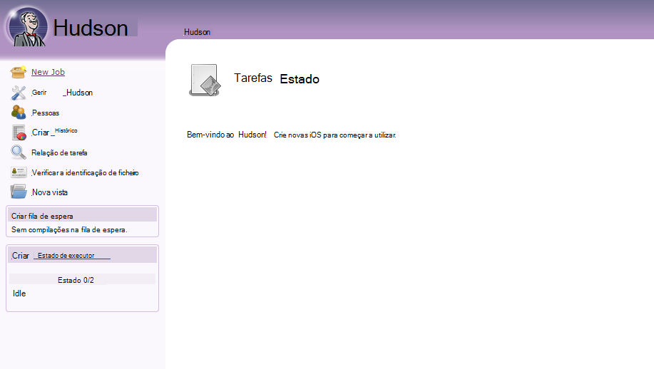
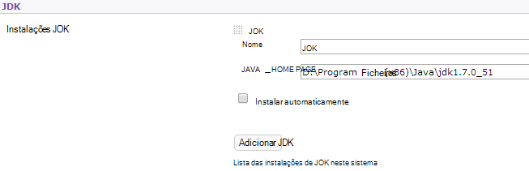
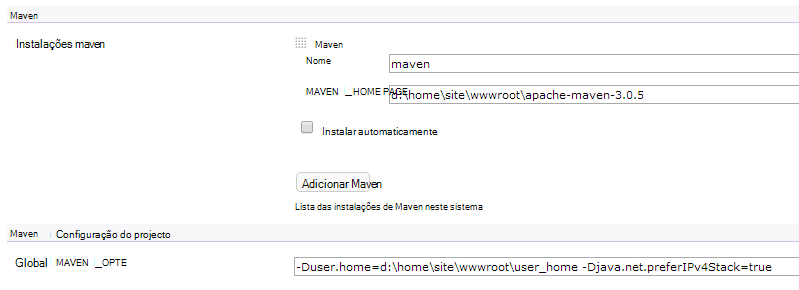

<properties 
    pageTitle="Carregar uma aplicação web do Java personalizada para Azure" 
    description="Este tutorial mostra-lhe como carregar uma aplicação web do Java personalizada para Azure aplicação de serviço Web Apps." 
    services="app-service\web" 
    documentationCenter="java" 
    authors="rmcmurray" 
    manager="wpickett" 
    editor=""/>

<tags 
    ms.service="app-service-web" 
    ms.workload="web" 
    ms.tgt_pltfrm="na" 
    ms.devlang="Java" 
    ms.topic="article" 
    ms.date="08/11/2016" 
    ms.author="robmcm"/>

# Carregar uma aplicação web do Java personalizada para Azure

Este tópico explica como carregar uma aplicação web do Java personalizada para a [Aplicação de serviço de Azure] Web Apps. Informações que se aplicam a qualquer aplicação do Web site ou web Java e também alguns exemplos para aplicações específicas está incluída.

Tenha em atenção que Azure fornece um meio para criar aplicações web do Java utilizando configuração no Portal de Azure IU e Azure Marketplace, conforme é documentado ao [criar uma aplicação web do Java na aplicação de serviço de Azure](web-sites-java-get-started.md). Neste tutorial é para cenários em que não pretende utilizar a configuração do Portal do Azure IU ou Azure Marketplace.  

## Directrizes de configuração

A seguinte descreve as definições de esperado para personalizado Java web apps no Azure.

- A porta HTTP utilizada pelo processo de Java dinamicamente é atribuída.  O processo de tem de utilizar a porta da variável de ambiente `HTTP_PLATFORM_PORT`.
- Todas as portas ouvir que não seja a única escuta HTTP devem ser desactivadas.  No Tomcat, que inclui o encerramento, HTTPS e AJP portas.
- O contentor tem de ser configurado para o tráfego de IPv4 apenas.
- O comando de **arranque** para a aplicação tem de ser definidas na configuração.
- As aplicações que requerem directórios com escrever necessidade de permissão de estar localizados na diretório de conteúdo a aplicação Azure web, que é **D:\home**.  A variável ambiental `HOME` que se refere a D:\home.  

Pode definir variáveis de ambiente conforme necessário no ficheiro Web. config.

## Web. config httpPlatform configuração

As seguintes informações descrevem o formato de **httpPlatform** na Web. config.
                                 
**argumentos** (Predefinição = ""). Argumentos para o ficheiro executável ou script especificado na definição de **processPath** .

Exemplos (mostrados com **processPath** incluído):

    processPath="%HOME%\site\wwwroot\bin\tomcat\bin\catalina.bat"
    arguments="start"
    
    processPath="%JAVA_HOME\bin\java.exe"
    arguments="-Djava.net.preferIPv4Stack=true -Djetty.port=%HTTP\_PLATFORM\_PORT% -Djetty.base=&quot;%HOME%\site\wwwroot\bin\jetty-distribution-9.1.0.v20131115&quot; -jar &quot;%HOME%\site\wwwroot\bin\jetty-distribution-9.1.0.v20131115\start.jar&quot;"

**processPath** - caminho para o ficheiro executável ou script que irá iniciar um processo listening para pedidos de HTTP.

Exemplos:

    processPath="%JAVA_HOME%\bin\java.exe"

    processPath="%HOME%\site\wwwroot\bin\tomcat\bin\startup.bat"

    processPath="%HOME%\site\wwwroot\bin\tomcat\bin\catalina.bat"
                                                                                       
**rapidFailsPerMinute** (Predefinição = 10.) Número de vezes que o processo de especificados na **processPath** é permitido falhar por minuto. Se for excedido este limite, **HttpPlatformHandler** deixarão de iniciar o processo para o resto do minuto.
                                    
**requestTimeout** (Predefinição = "00: 02:00".) Duração para o qual **HttpPlatformHandler** irá aguardar uma resposta a partir do processo a escutar `%HTTP_PLATFORM_PORT%`.

**startupRetryCount** (Predefinição = 10.) Número de vezes **que httpplatformhandler** irá tentar para iniciar o processo de especificados na **processPath**. Consulte o artigo **startupTimeLimit** para obter mais detalhes.

**startupTimeLimit** (Predefinição = 10 segundos.) Duração para o qual **HttpPlatformHandler** irá aguardar que o ficheiro executável script iniciar um processo escutar a porta.  Se for excedido este limite de tempo, **HttpPlatformHandler** irá eliminar o processo e tente iniciá-la novamente **startupRetryCount** vezes.
                                                                                      
**stdoutLogEnabled** (Predefinição = "true".) Se for VERDADEIRO, **stdout** e **stderr** para o processo de especificado na definição de **processPath** serão redirecionados para o ficheiro especificado no **stdoutLogFile** (consulte a secção **stdoutLogFile** ).
                                    
**stdoutLogFile** (Default="d:\home\LogFiles\httpPlatformStdout.log".) Caminho do ficheiro absoluta para a qual serão registados **stdout** e **stderr** do processo de especificado na **processPath** .
                                    
> [AZURE.NOTE] `%HTTP_PLATFORM_PORT%`é um marcador de posição especial que necessita de especificado como parte dos **argumentos** ou como parte da lista de **environmentVariables** **httpPlatform** . Esta será substituída por uma porta internamente gerada pelo **HttpPlatformHandler** para que o processo especificado pelo **processPath** pode ouvem esta porta.

## Implementação

Aplicações de web baseadas em Java aplicações web baseada em podem ser implementadas facilmente com a maioria dos meios mesmo que são utilizados com serviços de informação Internet (IIS).  FTP, Git e Kudu são suportadas como mecanismos de implementação, tal como está a funcionalidade de SMS integrada para web apps. WebDeploy funciona como um protocolo, no entanto, tal como Java não é desenvolvido no Visual Studio, WebDeploy não se ajusta com casos de utilização de implementação do Java web app.

## Configuração da aplicação exemplos

Para as seguintes aplicações, um ficheiro de Web. config e a aplicação de configuração é fornecida como exemplos para mostrar como ativar a sua aplicação Java na aplicação de serviço Web Apps.

### Tomcat
Apesar de existirem duas variações Tomcat que são fornecidas com a aplicação de serviço Web Apps, ainda é bastante possível carregar instâncias específicas do cliente. Abaixo está um exemplo de uma instalação de Tomcat com um diferentes Java Máquina Virtual (JVM).

    <?xml version="1.0" encoding="UTF-8"?>
    <configuration>
      <system.webServer>
        <handlers>
          <add name="httpPlatformHandler" path="*" verb="*" modules="httpPlatformHandler" resourceType="Unspecified" />
        </handlers>
        <httpPlatform processPath="%HOME%\site\wwwroot\bin\tomcat\bin\startup.bat" 
            arguments="">
          <environmentVariables>
            <environmentVariable name="CATALINA_OPTS" value="-Dport.http=%HTTP_PLATFORM_PORT%" />
            <environmentVariable name="CATALINA_HOME" value="%HOME%\site\wwwroot\bin\tomcat" />
            <environmentVariable name="JRE_HOME" value="%HOME%\site\wwwroot\bin\java" /> <!-- optional, if not specified, this will default to %programfiles%\Java -->
            <environmentVariable name="JAVA_OPTS" value="-Djava.net.preferIPv4Stack=true" />
          </environmentVariables>
        </httpPlatform>
      </system.webServer>
    </configuration>

No lado Tomcat, existem algumas alterações de configuração que precisam de ser efetuadas. Precisa de ser editado para definir o server.xml:

-   Porta de encerramento = -1
-   Porta de conexão HTTP = ${port.http}
-   Endereço do conector HTTP = "127.0.0.1"
-   Comentar conectores HTTPS e AJP
-   A definição de IPv4 também pode ser definida no ficheiro catalina.properties qual pode adicionar`java.net.preferIPv4Stack=true`
    
Chamadas de Direct3D não são suportadas na aplicação de serviço Web Apps. Para desativar os, adicione a opção Java seguinte da aplicação farão essas chamadas:`-Dsun.java2d.d3d=false`

### Cais

À medida que as maiúsculas/minúsculas Tomcat, clientes podem carregar os seus próprios instâncias para cais. No caso de executar a instalação completa do cais, a configuração teria o seguinte aspeto:

    <?xml version="1.0" encoding="UTF-8"?>
    <configuration>
      <system.webServer>
        <handlers>
          <add name="httppPlatformHandler" path="*" verb="*" modules="httpPlatformHandler" resourceType="Unspecified" />
        </handlers>
        <httpPlatform processPath="%JAVA_HOME%\bin\java.exe" 
             arguments="-Djava.net.preferIPv4Stack=true -Djetty.port=%HTTP_PLATFORM_PORT% -Djetty.base=&quot;%HOME%\site\wwwroot\bin\jetty-distribution-9.1.0.v20131115&quot; -jar &quot;%HOME%\site\wwwroot\bin\jetty-distribution-9.1.0.v20131115\start.jar&quot;"
            startupTimeLimit="20"
          startupRetryCount="10"
          stdoutLogEnabled="true">
        </httpPlatform>
      </system.webServer>
    </configuration>

A configuração do cais tem de ser alterados start.ini para definir `java.net.preferIPv4Stack=true`.

### Springboot
Para obter uma Springboot aplicação em execução tem de carregue o seu ficheiro para caixa ou guerra e adicione o ficheiro da Web. config seguinte. O ficheiro da Web. config vai para a pasta wwwroot. Na Web. config ajuste os argumentos para apontarem para o seu ficheiro para caixa, no exemplo seguinte, que o ficheiro para caixa está localizado na pasta wwwroot.  

    <?xml version="1.0" encoding="UTF-8"?>
    <configuration>
      <system.webServer>
        <handlers>
          <add name="httpPlatformHandler" path="*" verb="*" modules="httpPlatformHandler" resourceType="Unspecified" />
        </handlers>
        <httpPlatform processPath="%JAVA_HOME%\bin\java.exe"
            arguments="-Djava.net.preferIPv4Stack=true -Dserver.port=%HTTP_PLATFORM_PORT% -jar &quot;%HOME%\site\wwwroot\my-web-project.jar&quot;">
        </httpPlatform>
      </system.webServer>
    </configuration>

### Hudson

Os nossos teste utilizado guerra Hudson 3.1.2 e a instância de Tomcat 7.0.50 predefinida, mas sem utilizar a IU de configurar elementos.  Uma vez que Hudson é um software de criar ferramenta, é aconselhável instalá-lo no instâncias dedicadas onde o sinalizador **AlwaysOn** pode ser definido na aplicação web.

1. No diretório de raiz do web app, ou seja, **d:\home\site\wwwroot**, crie um diretório de **webapps** (se não existir já) e colocar Hudson.war **d:\home\site\wwwroot\webapps**.
2. Transfira maven apache 3.0.5 (compatível com Hudson) e colocá-la **d:\home\site\wwwroot**.
3. Criar Web. config no **d:\home\site\wwwroot** e cole o seguinte conteúdo:
    
        <?xml version="1.0" encoding="UTF-8"?>
        <configuration>
          <system.webServer>
            <handlers>
              <add name="httppPlatformHandler" path="*" verb="*" 
        modules="httpPlatformHandler" resourceType="Unspecified" />
            </handlers>
            <httpPlatform processPath="%AZURE_TOMCAT7_HOME%\bin\startup.bat"
        startupTimeLimit="20"
        startupRetryCount="10">
        <environmentVariables>
          <environmentVariable name="HUDSON_HOME" 
        value="%HOME%\site\wwwroot\hudson_home" />
          <environmentVariable name="JAVA_OPTS" 
        value="-Djava.net.preferIPv4Stack=true -Duser.home=%HOME%/site/wwwroot/user_home -Dhudson.DNSMultiCast.disabled=true" />
        </environmentVariables>            
            </httpPlatform>
          </system.webServer>
        </configuration>

    Neste momento, a aplicação web pode ser reiniciada tirar as alterações.  Ligar a http://yourwebapp/hudson para iniciar Hudson.

4. Depois de Hudson configura-se, deverá ver o ecrã seguinte:

    
    
5. Aceder à página de configuração de Hudson: clique em **Gerir Hudson**e, em seguida, clique em **Configurar o sistema**.
6. Configure o JDK conforme apresentado abaixo:

    

7. Configure Maven conforme apresentado abaixo:

    

8. Guarde as definições. Hudson deverá agora estar configurada e prontos a utilizar.

Para obter informações adicionais sobre Hudson, consulte o artigo [http://hudson-ci.org](http://hudson-ci.org).

### Liferay

Liferay é suportada numa aplicação do serviço Web Apps. Uma vez que Liferay pode requerer significativas de memória, a aplicação web tem de executar uma média ou grande dedicada trabalhador, que pode fornecer memória suficiente. Liferay também demora vários minutos para iniciar o. Por que razão, é recomendado que o utilizador defina do web app para **Sempre no**.  

Utilizar Liferay 6.1.2 que Comunidade Edition GA3 agrupados com Tomcat, os seguintes ficheiros tenham sido editados depois de transferir Liferay:

**Server.XML**

- Altere porta encerramento -1.
- Alterar HTTP conexão para      `<Connector port="${port.http}" protocol="HTTP/1.1" connectionTimeout="600000" address="127.0.0.1" URIEncoding="UTF-8" />`
- Comentar o conector AJP.

Na pasta **liferay\tomcat-7.0.40\webapps\ROOT\WEB-INF\classes** , crie um ficheiro denominado **portal ext.properties**. Este ficheiro tem de conter uma linha, conforme mostrado aqui:

    liferay.home=%HOME%/site/wwwroot/liferay

No mesmo nível diretório como a pasta tomcat 7.0.40, crie um ficheiro com o nome **Web. config** com o seguinte conteúdo:

    <?xml version="1.0" encoding="UTF-8"?>
    <configuration>
      <system.webServer>
        <handlers>
    <add name="httpPlatformHandler" path="*" verb="*"
         modules="httpPlatformHandler" resourceType="Unspecified" />
        </handlers>
        <httpPlatform processPath="%HOME%\site\wwwroot\tomcat-7.0.40\bin\catalina.bat" 
                      arguments="run" 
                      startupTimeLimit="10" 
                      requestTimeout="00:10:00" 
                      stdoutLogEnabled="true">
          <environmentVariables>
      <environmentVariable name="CATALINA_OPTS" value="-Dport.http=%HTTP_PLATFORM_PORT%" />
      <environmentVariable name="CATALINA_HOME" value="%HOME%\site\wwwroot\tomcat-7.0.40" />
            <environmentVariable name="JRE_HOME" value="D:\Program Files\Java\jdk1.7.0_51" /> 
            <environmentVariable name="JAVA_OPTS" value="-Djava.net.preferIPv4Stack=true" />
          </environmentVariables>
        </httpPlatform>
      </system.webServer>
    </configuration>

Em bloquear **httpPlatform** , o **requestTimeout** está definido para "00:10:00".  Pode ser reduzido-lo mas, em seguida, é provável que ver alguns erros de tempo limite enquanto Liferay é iniciar.  Se este valor for alterada, o **connectionTimeout** na server.xml tomcat também deve modificado.  

É de notar que a varariable environnment JRE_HOME é especificada na Web. config acima para apontarem para o JDK de 64 bits. A predefinição é de 32 bits, mas uma vez que Liferay pode exigir alto níveis de memória, recomenda-se para utilizar o JDK de 64 bits.

Depois de efetuar estas alterações, reinicie a aplicação web em execução Liferay, em seguida, abra http://yourwebapp. O portal de Liferay está disponível a partir da raiz de aplicação web. 

## Próximos passos

Para mais informações sobre Liferay, consulte o artigo [http://www.liferay.com](http://www.liferay.com).

Para mais informações sobre Java, consulte o [Centro de programadores do Java](/develop/java/).

[AZURE.INCLUDE [app-service-web-whats-changed](../../includes/app-service-web-whats-changed.md)]

[AZURE.INCLUDE [app-service-web-try-app-service](../../includes/app-service-web-try-app-service.md)]
 
 
<!-- External Links -->
[Azure de aplicação de serviço]: http://go.microsoft.com/fwlink/?LinkId=529714
