<properties 
    pageTitle="Migrar uma aplicação web do enterprise para a aplicação de serviço do Azure" 
    description="Mostra como utilizar o Assistente de Web Apps migração para migrar rapidamente existentes Web sites IIS para Azure aplicação de serviço Web Apps" 
    services="app-service" 
    documentationCenter="" 
    authors="cephalin" 
    writer="cephalin" 
    manager="wpickett" 
    editor=""/>

<tags 
    ms.service="app-service" 
    ms.workload="na" 
    ms.tgt_pltfrm="na" 
    ms.devlang="na" 
    ms.topic="article" 
    ms.date="07/01/2016" 
    ms.author="cephalin"/>

# Migrar uma aplicação web do enterprise para a aplicação de serviço do Azure

Pode migrar facilmente os seus sites públicos existentes que são executados no serviço de informação Internet (IIS) 6 ou posterior para a [Aplicação de serviço Web Apps](http://go.microsoft.com/fwlink/?LinkId=529714). 

>[AZURE.IMPORTANT] Windows Server 2003 atingido o fim do suporte de 14 de Julho de 2015. Se estiver atualmente a alojar os Web sites públicos num servidor IIS que é o Windows Server 2003, Web Apps é um mínimo de risco, custo de baixa, e baixo atrito forma para manter os seus Web sites online e Web Apps migração assistente podem ajudar a automatizar o processo de migração para si. 

[Assistente de Web Apps migração](https://www.movemetothecloud.net/) pode analisar a sua instalação do servidor IIS, identifique os sites que podem ser migrados para a aplicação de serviço, realce qualquer elementos que não podem ser migrados ou não são suportados a plataforma e, em seguida, migra seus Web sites e bases de dados associadas Azure.

[AZURE.INCLUDE [app-service-web-to-api-and-mobile](../../includes/app-service-web-to-api-and-mobile.md)]

## Elementos verificados durante a análise de compatibilidade ##
O Assistente de migração, cria um relatório de preparação para identificar as causas potenciais preocupações ou bloqueio problemas que podem impedir que uma migração com êxito, a partir do IIS no local ao Azure aplicação de serviço Web Apps. Alguns dos itens da chaves ter em consideração são:

-   Porta enlaces – Web Apps suporta apenas porta 80 para HTTP e porta 443 para o tráfego de HTTPS. Configurações de porta diferente serão ignoradas e tráfego vai ser encaminhado para 80 e 443. 
-   Autenticação – Web Apps suporta autenticação anónima por predefinição e formulários de autenticação nos casos especificados por uma aplicação. Autenticação do Windows podem ser utilizada pelo integrar com o Azure Active Directory e ADFS apenas. Todas as outras formas de autenticação - por exemplo, autenticação básica - atualmente não são suportadas. 
-   Cache de assemblagem global (GAC) – GAC não é suportada nas aplicações Web. Se a aplicação referenciar conjuntos que normalmente implementar GAC, terá de implementar para a pasta de posição de aplicação no Web Apps. 
-   IIS5 Modo de compatibilidade – não é suportado nas aplicações Web. 
-   Conjuntos aplicacionais – no Web Apps, cada site e suas aplicações subordinado executar no mesmo agrupamento de aplicações. Se o seu site tiver várias aplicações de subordinados utilizando vários conjuntos aplicacionais, consolidá-las para um único agrupamento de aplicações com definições comuns ou migrar cada aplicação para uma aplicação web em separado.
-   Componentes do COM – Web Apps não permitir que o registo de componentes COM a plataforma. Se a Web sites ou aplicações recorrer de qualquer componentes COM, tem de reescrevê-los em código gerido e implementá-los com o Web site ou a aplicação.
-   Filtros ISAPI – Web Apps pode suportar a utilização de filtros ISAPI. Precisa de fazer o seguinte procedimento:
    -   implementar DLLs com a aplicação web 
    -   registar DLLs utilizando [Web. config](http://www.iis.net/configreference/system.webserver/isapifilters)
    -   Coloque um ficheiro de applicationHost.xdt na raiz da site com o conteúdo abaixo:

            <?xml version="1.0"?>
            <configuration xmlns:xdt="http://schemas.microsoft.com/XML-Document-Transform">
            <configSections>
                <sectionGroup name="system.webServer">
                  <section name="isapiFilters" xdt:Transform="SetAttributes(overrideModeDefault)" overrideModeDefault="Allow" />
                </sectionGroup>
              </configSections>
            </configuration>

        Para obter mais exemplos de como utilizar transformações de documento XML com o seu site, consulte o artigo [transformar o seu Web Site da Microsoft Azure](http://blogs.msdn.com/b/waws/archive/2014/06/17/transform-your-microsoft-azure-web-site.aspx).

-   Outros componentes como o SharePoint, página de capa as extensões de servidor (FPSE), FTP, certificados SSL não serão migrados.

## Como utilizar o Assistente de migração do Web Apps ##
Passos nesta secção através de um exemplo a migrar alguns Web sites que utilizam uma base de dados do SQL Server e em execução num computador Windows Server 2003 R2 (IIS 6.0) no local:

1.  No servidor do IIS ou do computador cliente, navegue para [https://www.movemetothecloud.net/](https://www.movemetothecloud.net/) 

    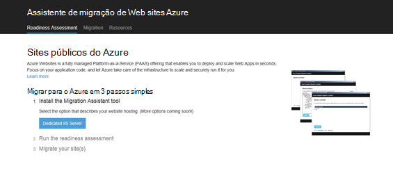

2.  Instale o Assistente de Web Apps migração ao clicar no botão de **Servidor do IIS dedicado** . Mais opções estarão no futuro próximo opções. 
4.  Clique no botão **Instalar a ferramenta** para instalar o Assistente de Web Apps migração no seu computador.

    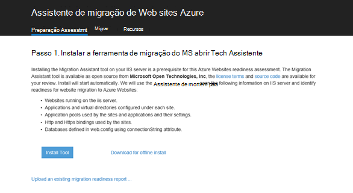

    >[AZURE.NOTE] Também pode clicar em **Transferir para instalar offline** para transferir um ficheiro de postal para instalar o em servidores não ligados à internet. Em alternativa, pode clicar em **carregar um relatório de preparação de migração existente**, que é uma opção avançada para trabalhar com um migração preparação relatório existente que anteriormente geradas (explicado posteriormente).

5.  No ecrã **De instalação da aplicação** , clique em **instalar** para instalar o no seu computador. Também instalará dependências correspondentes como implementar Web, DacFX e IIS, se necessário. 

    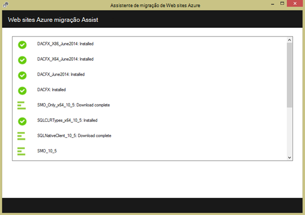

    Depois de instalado, Assistente de Web Apps migração é iniciado automaticamente.
  
6.  Selecione **Migrar sites e bases de dados de um servidor remoto para Azure**. Introduza as credenciais administrativas para o servidor remoto e clique em **continuar**. 

    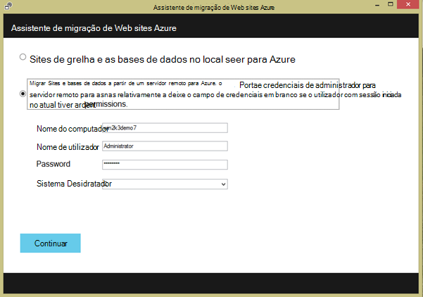

    Obviamente pode optar por migrar a partir do servidor local. A opção remota é útil quando pretende migrar Web sites a partir de um servidor do IIS de produção.
 
    Neste momento a ferramenta de migração vai inspeccionar a configuração do seu servidor IIS, como Sites, aplicações, conjuntos de aplicações e dependências para identificar sites públicos do candidato a migração. 

8.  A captura de ecrã abaixo mostra três Web sites – **Web Site predefinido**, **TimeTracker**e **CommerceNet4**. Todos eles têm uma base de dados associado queremos a migrar. Selecione todos os sites que pretende avaliar e, em seguida, clique em **seguinte**.

    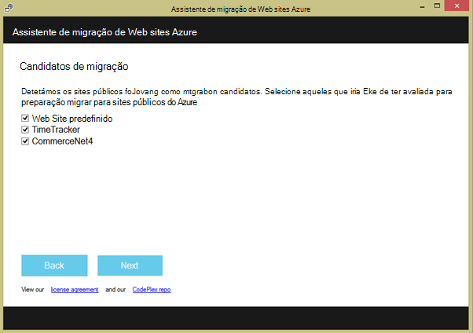
 
9.  Clique em **carregar** para carregar o relatório de preparação. Se clicar em **Guardar ficheiro localmente**, pode executar a ferramenta de migração novamente mais tarde e carregar o relatório de preparação guardada, tal como indicado anteriormente.

    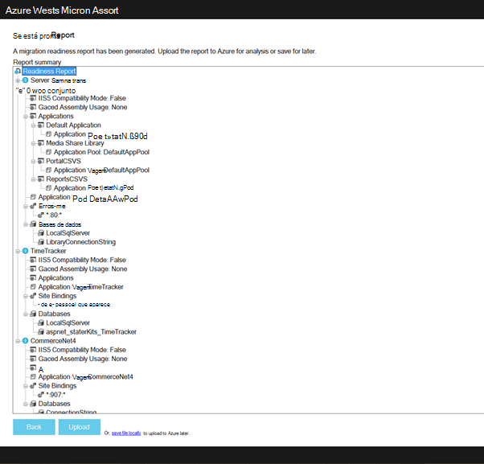
 
    Depois de carregar o relatório de disponibilidade, Azure executa a análise de preparação e mostra-lhe os resultados. Leia os detalhes de avaliação para cada site e certifique-se de que compreender ou tenham abordadas todos os problemas antes de continuar. 
 
    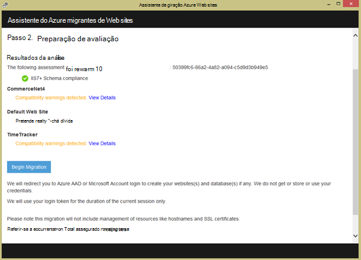

12. Clique em **Iniciar a migração** para iniciar a migração. Serão redirecionados agora para Azure para iniciar sessão na sua conta. É importante que inicie sessão com uma conta que tenha uma subscrição ativa do Azure. Se não tiver uma conta Azure, em seguida, pode inscrever-se para uma gratuito avaliação [aqui](https://azure.microsoft.com/pricing/free-trial/?WT.srch=1&WT.mc_ID=SEM_). 

13. Selecione a conta de inquilino, a subscrição do Azure e a região para utilizar para o seu web Azure migrados aplicações e bases de dados e, em seguida, clique em **Iniciar a migração**. Pode selecionar os sites públicos para migrar mais tarde.

    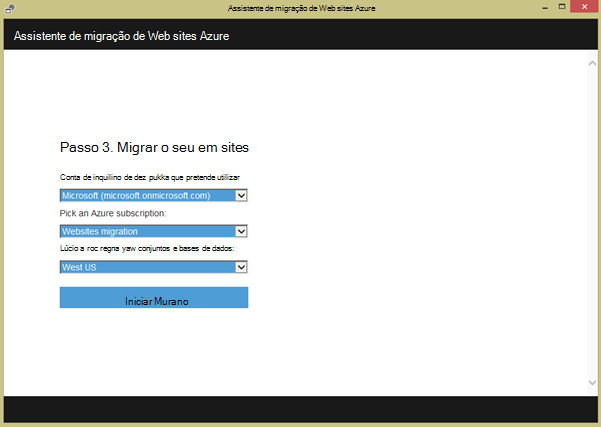

14. No ecrã seguinte pode efetuar alterações para as predefinições de migração, tais como:

    - utilizar uma base de dados do SQL Azure existente ou criar uma nova base de dados do Azure SQL e configurar as suas credenciais
    - Selecione os sites públicos para migrar
    - Definir nomes para aplicações Azure web e os respetivos ligadas bases de dados do SQL
    - Personalizar as definições de nível do site e definições globais

    A captura de ecrã abaixo mostra todos os Web sites selecionados para migração com as definições predefinidas.

    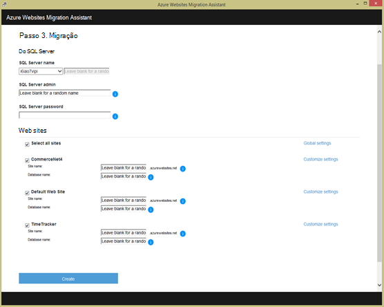

    >[AZURE.NOTE] a caixa de verificação **Ativar o Azure Active Directory** em definições personalizadas integra-se do Azure web app com o [Azure Active Directory](active-directory-whatis.md) (o **Diretório predefinido**). Para mais informações sobre a sincronização do Azure Active Directory com o seu no local Active Directory, consulte o artigo [integração de diretórios](http://msdn.microsoft.com/library/jj573653).

16.  Depois de efetuar as alterações pretendidas, clique em **Criar** para iniciar o processo de migração. A ferramenta de migração vai criar a base de dados do SQL Azure e o Azure web app e, em seguida, publique o conteúdo do Web site e as bases de dados. O progresso da migração claramente é apresentado na ferramenta de migração e irá ver um ecrã de resumo no final, que os detalhes dos sites migrados, se terem sido concluído com êxito, liga às aplicações web Azure recentemente criado. 

    Se qualquer erro ocorrer durante a migração, a ferramenta de migração irá indicar claramente falha e anular as alterações. Também poderá enviar o relatório de erro diretamente para a equipa de engenharia ao clicar no botão **Enviar relatório de erros** , com a pilha de chamadas falha capturado e criar o corpo da mensagem. 

    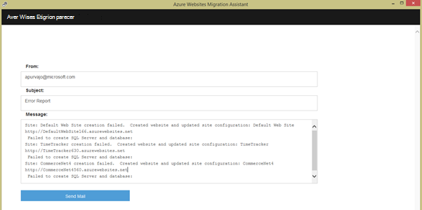

    Se migrar é concluída com êxito sem erros, também pode clicar no botão **Dar Feedback** para fornecer eventuais comentários diretamente. 
 
20. Clique nas ligações para as aplicações Azure web e certifique-se de que a migração foi bem sucedido.

21. Agora pode gerir as aplicações web migrados na aplicação de serviço de Azure. Para fazer isto, inicie sessão no [Portal do Azure](https://portal.azure.com).

22. No Portal do Azure, abra o pá Web Apps para ver os sites públicos do migrados (mostrados como web apps), em seguida, clique em qualquer um dos mesmos para iniciar a gerir o web app, tal como configurar a publicação contínua, criar cópias de segurança, autoscaling e monitorização de utilização ou desempenho.

    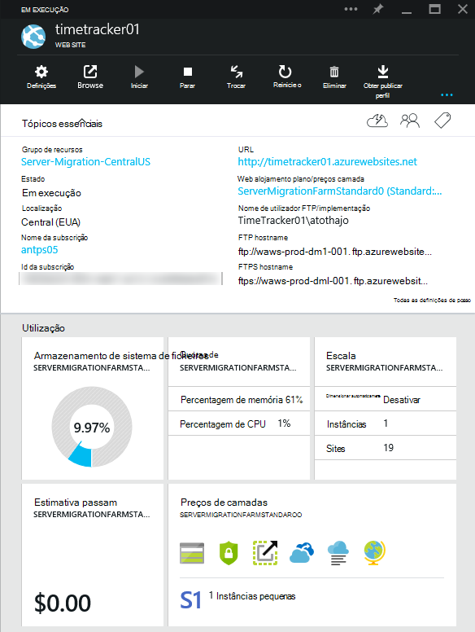

>[AZURE.NOTE] Se pretender começar a aplicação de serviço de Azure antes de inscrever-se para uma conta do Azure, aceda ao [Tentar aplicação de serviço](http://go.microsoft.com/fwlink/?LinkId=523751), onde imediatamente pode criar uma aplicação web do starter curto na aplicação de serviço. Sem cartões de crédito necessários; sem compromissos.

## O que é alterado
* Para um guia para a alteração de Web sites para a aplicação de serviço Consulte o artigo: [aplicação de serviço de Azure e respectivo impacto na existente dos serviços do Azure](http://go.microsoft.com/fwlink/?LinkId=529714)
 
