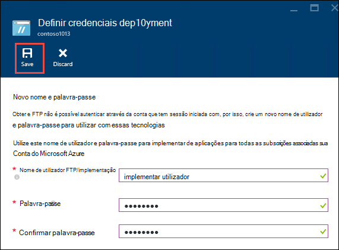
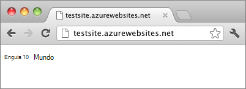

<properties
    pageTitle="Criar uma aplicação de web Node.js na aplicação de serviço de Azure | Microsoft Azure"
    description="Saiba como implementar uma aplicação de Node.js para uma aplicação web na aplicação de serviço de Azure."
    services="app-service\web"
    documentationCenter="nodejs"
    authors="rmcmurray"
    manager="wpickett"
    editor=""/>

<tags
    ms.service="app-service-web"
    ms.workload="web"
    ms.tgt_pltfrm="na"
    ms.devlang="nodejs"
    ms.topic="hero-article"
    ms.date="08/11/2016"
    ms.author="robmcm"/>

# Criar uma aplicação web do Node.js no serviço de aplicação do Azure

> [AZURE.SELECTOR]
- [.NET](web-sites-dotnet-get-started.md)
- [NODE.js](web-sites-nodejs-develop-deploy-mac.md)
- [Java](web-sites-java-get-started.md)
- [PHP - Git](web-sites-php-mysql-deploy-use-git.md)
- [PHP - FTP](web-sites-php-mysql-deploy-use-ftp.md)
- [Python](web-sites-python-ptvs-django-mysql.md)

Este tutorial mostra como criar uma aplicação de [Node.js](http://nodejs.org) simple e implementá-la para uma [aplicação web](app-service-web-overview.md) na [Aplicação de serviço de Azure](../app-service/app-service-value-prop-what-is.md) utilizando [Git](http://git-scm.com). As instruções neste tutorial, podem ser seguidas em qualquer sistema operativo que capaz de executar Node.js.

Que vai aprender:

* Como criar uma aplicação web na aplicação de serviço de Azure utilizando o Portal do Azure.
* Como implementar uma aplicação de Node.js para a aplicação web por conduza para o repositório de Git do web app.

A aplicação completa escreve uma breve cadeia "Olá mundo" para o browser.

![Num browser apresentar a mensagem 'Olá mundo'.][helloworld-completed]

Para a tutoriais e o código de exemplo com mais complexas Node.js aplicações, ou para outros tópicos sobre como utilizar Node.js no Azure, consulte o artigo do [Centro de programadores do Node.js](/develop/nodejs/).

> [AZURE.NOTE]
> Para concluir este tutorial, é necessária uma conta do Microsoft Azure. Se não tiver uma conta, pode [Ativar os benefícios da sua Visual Studio subscritor](/en-us/pricing/member-offers/msdn-benefits-details/?WT.mc_id=A261C142F) ou [Inscrever-se para uma avaliação gratuita](/en-us/pricing/free-trial/?WT.mc_id=A261C142F).
>
> Se pretender começar com a aplicação de serviço de Azure antes de se inscrever para uma conta do Azure, aceda ao [Serviço de aplicação tente](http://go.microsoft.com/fwlink/?LinkId=523751). Não existem, imediatamente pode criar uma aplicação web do starter curto na aplicação de serviço — sem cartão de crédito obrigatório e sem compromissos.

## Criar uma aplicação web e ativar a publicação de Git

Siga estes passos para criar uma aplicação web na aplicação de serviço de Azure e ativar a publicação de Git. 

[Git](http://git-scm.com/) é um sistema de controlo de versão distribuído que pode utilizar para implementar o seu Web site Azure. Irá armazenar o código de escrita para a sua aplicação web num repositório Git local e irá implementar o seu código em Azure por conduza para um repositório remoto. Este método de implementação é uma funcionalidade do serviço de aplicação web apps.  

1. Inicie sessão no [Portal do Azure](https://portal.azure.com).

2. Clique no ícone **+ Novo** no canto superior esquerdo do Portal do Azure.

3. Clique em **Web + Mobile**e, em seguida, clique em **aplicação Web**.

    ![][portal-quick-create]

4. Introduza um nome para a aplicação web na caixa **do Web app** .

    Este nome tem de ser exclusivo no domínio de azurewebsites.net porque o URL da aplicação web serão {nome}. azurewebsites.net. Se o nome que introduziu não exclusivo, um ponto de exclamação vermelho é apresentada na caixa de texto.

5. Selecione uma **subscrição**.

6. Selecione um **Grupo de recursos** ou crie um novo.

    Para mais informações sobre os grupos de recursos, consulte o artigo [Descrição geral do Gestor de recursos do Azure](../azure-resource-manager/resource-group-overview.md).

7. Selecione uma **Aplicação de serviço de plano/localização** ou crie um novo.

    Para mais informações sobre os planos do serviço de aplicação, consulte o artigo [Descrição geral de planos do serviço de aplicação do Azure](../azure-web-sites-web-hosting-plans-in-depth-overview.md)

8. Clique em **Criar**.
   
    ![][portal-quick-create2]

    Uma hora abreviada, normalmente menores do que um minuto Azure acaba de criar a nova aplicação web.

9. Clique em **Web aplicações > {a nova aplicação web do}**.

    

10. Na pá **Web app** , clique na parte de **implementação** .

    ![][deployment-part]

11. No pá **Implementação contínuo** , clique em **Escolha da origem**

12. Clique **Repositório de Git Local**e, em seguida, clique em **OK**.

    ![][setup-git-publishing]

13. Configure as credenciais de implementação, se ainda não o tiver feito.

    um. No pá de aplicação Web, clique em **Definições > credenciais de implementação**.

    ![][deployment-credentials]
 
    b. Crie um nome de utilizador e palavra-passe. 
    
    

14. No pá de aplicação Web, clique em **Definições**e, em seguida, clique em **Propriedades**.
 
    Para publicar, irá emissão para um repositório de Git remoto. O URL para o repositório está listado em **GIT URL**. Irá utilizar este URL mais tarde no tutorial.

    ![][git-url]

## Criar e teste a sua aplicação localmente

Nesta secção, crie um ficheiro de **server.js** que contém uma versão do exemplo 'Olá mundo' a partir do [nodejs.org] ligeiramente modificada. O código adiciona process.env.PORT como a porta a escutar quando a ser executado numa aplicação Azure web.

1. Crie num diretório chamado *helloworld*.

2. Utilize um editor de texto para criar um novo ficheiro chamado **server.js** no diretório *helloworld* .

2. Copie o código seguinte para o ficheiro **server.js** e, em seguida, guarde o ficheiro:

        var http = require('http')
        var port = process.env.PORT || 1337;
        http.createServer(function(req, res) {
          res.writeHead(200, { 'Content-Type': 'text/plain' });
          res.end('Hello World\n');
        }).listen(port);

3. Abra a linha de comandos e utilize o seguinte comando para iniciar a aplicação web localmente.

        node server.js

4. Abra o browser e navegue para http://localhost:1337. 

    Numa página Web que apresenta "Olá mundo" é apresentada, conforme apresentado na captura de ecrã seguinte.

    ![Num browser apresentar a mensagem 'Olá mundo'.][helloworld-localhost]

## Publicar a sua aplicação

1. Instale Git se ainda não o tiver feito.

    Para obter instruções de instalação para a sua plataforma, consulte o artigo o [Git página de transferência](http://git-scm.com/download).

1. Na linha de comandos, mude de directórios ao diretório **helloworld** e introduza o seguinte comando para iniciar um repositório de Git local.

        git init

2. Utilize os seguintes comandos para adicionar ficheiros para o repositório de:

        git add .
        git commit -m "initial commit"

3. Adicione um Git remoto para direccionar actualizações para a aplicação web que criou anteriormente, utilizando o seguinte comando:

        git remote add azure [URL for remote repository]

4. Notificações push as suas alterações para Azure utilizando o seguinte comando:

        git push azure master

    É-lhe pedida a palavra-passe que criou anteriormente. O resultado é semelhante ao seguinte exemplo.

        Counting objects: 3, done.
        Delta compression using up to 8 threads.
        Compressing objects: 100% (2/2), done.
        Writing objects: 100% (3/3), 374 bytes, done.
        Total 3 (delta 0), reused 0 (delta 0)
        remote: New deployment received.
        remote: Updating branch 'master'.
        remote: Preparing deployment for commit id '5ebbe250c9'.
        remote: Preparing files for deployment.
        remote: Deploying Web.config to enable Node.js activation.
        remote: Deployment successful.
        To https://user@testsite.scm.azurewebsites.net/testsite.git
         * [new branch]      master -> master

5. Para ver a sua aplicação, clique no botão **Procurar** na peça **Web App** no portal do Azure.

    

    

## Publicar as alterações à aplicação

1. Abra o ficheiro **server.js** num editor de texto e alterar 'World\n Olá' para 'Azure\n Olá'. 

2. Guarde o ficheiro.

2. Na linha de comandos, mude de directórios ao diretório **helloworld** e execute os seguintes comandos:

        git add .
        git commit -m "changing to hello azure"
        git push azure master

    É-lhe pedida a palavra-passe novamente.

3. Atualize a janela de browser compreendê-las para o URL do web app.

    ![Uma página web apresenta 'Azure Olá'][helloworld-completed]

## Recuperar uma implementação

A partir do pá **Web app** pode clicar em **Definições > implementação contínua** para ver o histórico de implementação da pá **híbridas** . Se precisar de reverter para uma implementação anterior, pode selecioná-la e, em seguida, clique em **Implementar novamente** no pá **Detalhes de implementação** .

## Próximos passos

Tenha implementado uma aplicação de Node.js para uma aplicação web na aplicação de serviço de Azure. Para saber mais sobre como a aplicação de serviço web apps executem Node.js aplicações, consulte o artigo [Azure aplicação de serviço Web Apps: Node.js](http://blogs.msdn.com/b/silverlining/archive/2012/06/14/windows-azure-websites-node-js.aspx) e [especificando uma versão Node.js numa aplicação do Azure](../nodejs-specify-node-version-azure-apps.md).

NODE.js fornece uma ecossistema avançada do módulos que podem ser utilizadas pelas suas aplicações. Para saber como Web Apps funciona com módulos, consulte o artigo [utilizar Node.js módulos com aplicações do Azure](../nodejs-use-node-modules-azure-apps.md).

Se encontrar problemas com a sua aplicação depois de ter sido implementada para Azure, consulte o artigo [como depurar uma aplicação de Node.js na aplicação de serviço de Azure](web-sites-nodejs-debug.md) para obter informações sobre diagnosticar o problema.

Este artigo utiliza o Portal do Azure para criar uma aplicação web. Também pode utilizar a [Interface de comandos do Azure](../xplat-cli-install.md) ou [Azure PowerShell](../powershell-install-configure.md) para executar as mesmas operações.

Para mais informações sobre como desenvolver aplicações de Node.js no Azure, consulte o [Centro de programadores do Node.js](/develop/nodejs/).

[helloworld-completed]: ./media/web-sites-nodejs-develop-deploy-mac/helloazure.png
[helloworld-localhost]: ./media/web-sites-nodejs-develop-deploy-mac/helloworldlocal.png
[portal-quick-create]: ./media/web-sites-nodejs-develop-deploy-mac/create-quick-website.png
[portal-quick-create2]: ./media/web-sites-nodejs-develop-deploy-mac/create-quick-website2.png
[setup-git-publishing]: ./media/web-sites-nodejs-develop-deploy-mac/setup_git_publishing.png
[go-to-dashboard]: ./media/web-sites-nodejs-develop-deploy-mac/go_to_dashboard.png
[deployment-part]: ./media/web-sites-nodejs-develop-deploy-mac/deployment-part.png
[deployment-credentials]: ./media/web-sites-nodejs-develop-deploy-mac/deployment-credentials.png
[git-url]: ./media/web-sites-nodejs-develop-deploy-mac/git-url.png
