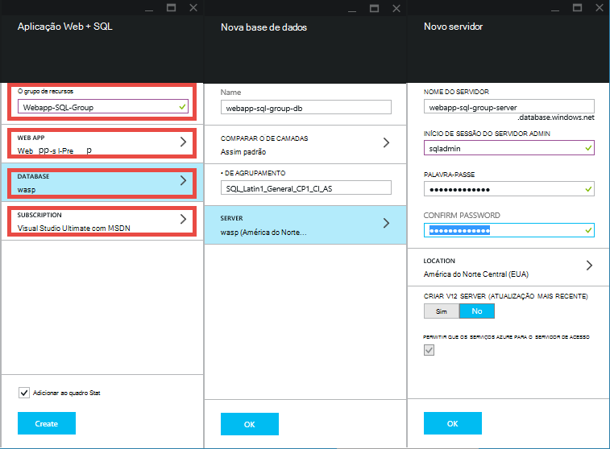
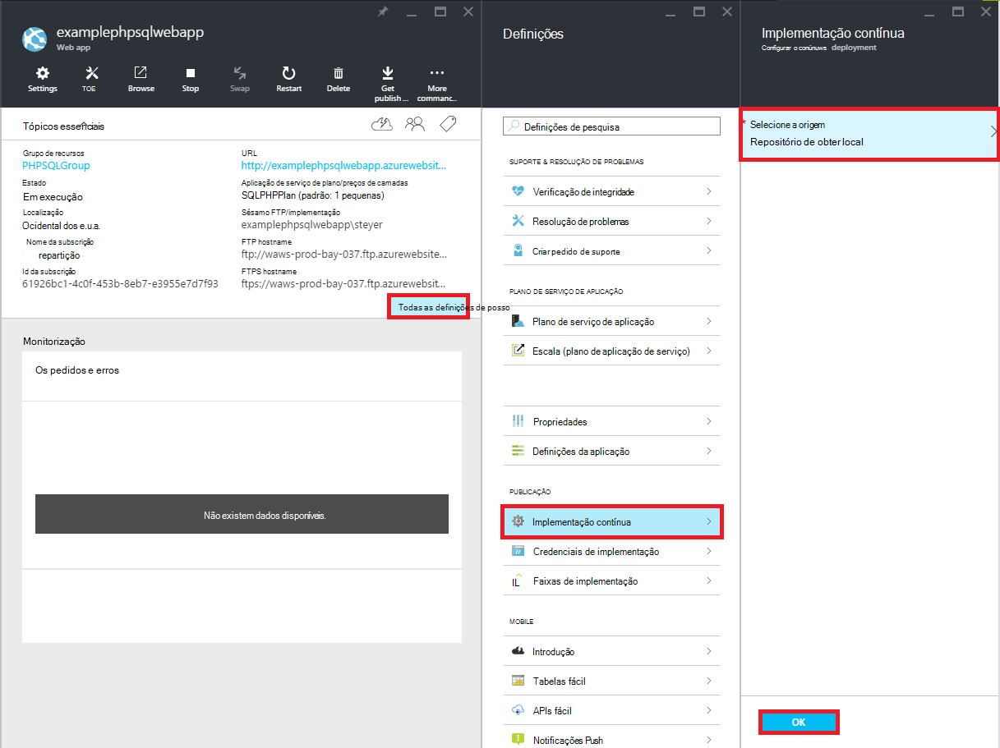

<properties 
    pageTitle="Criar uma aplicação web do PHP SQL e implementar em serviço de aplicação do Azure utilizando Git" 
    description="Um tutorial demonstra como criar uma aplicação web PHP que armazena os dados na base de dados do SQL Azure e utilizar Git implementação para a aplicação de serviço de Azure." 
    services="app-service\web, sql-database" 
    documentationCenter="php" 
    authors="rmcmurray" 
    manager="wpickett" 
    editor=""/>

<tags 
    ms.service="app-service-web" 
    ms.workload="web" 
    ms.tgt_pltfrm="na" 
    ms.devlang="PHP" 
    ms.topic="article" 
    ms.date="08/11/2016" 
    ms.author="robmcm"/>

# Criar uma aplicação web do PHP SQL e implementar em serviço de aplicação do Azure utilizando Git

Este tutorial mostra-lhe como criar uma aplicação web do PHP na [Aplicação de serviço de Azure](http://go.microsoft.com/fwlink/?LinkId=529714) que liga à base de dados do SQL Azure e como implementá-lo utilizando Git. Neste tutorial assume que tem [PHP][install-php], [SQL Server Express][install-SQLExpress], os [Controladores da Microsoft para o SQL Server para PHP](http://www.microsoft.com/download/en/details.aspx?id=20098)e [Git] [ install-git] instalado no seu computador. Após concluir este guia, terá de uma aplicação web de PHP SQL em execução no Azure.

> [AZURE.NOTE]
> Pode instalar e configurar PHP, SQL Server Express e os Drivers Microsoft para o SQL Server para PHP utilizando o [Microsoft Web plataforma Installer](http://www.microsoft.com/web/downloads/platform.aspx).

Vai aprender:

* Como criar uma aplicação web do Azure e uma base de dados do SQL utilizando o [Portal do Azure](http://go.microsoft.com/fwlink/?LinkId=529715). Porque PHP é activado na aplicação de serviço Web Apps por predefinição, nada especial é necessária para executar o seu código PHP.
* Como publicar e voltar a publicar a aplicação para Azure utilizando Git.
 
Ao seguir este tutorial, irá criar uma aplicação web do registo simples no PHP. A aplicação irá estar alojada num Web site Azure. Uma captura de ecrã da aplicação concluída é abaixo:

[AZURE.INCLUDE [create-account-and-websites-note](../../includes/create-account-and-websites-note.md)]

>[AZURE.NOTE] Se pretender começar a aplicação de serviço de Azure antes de inscrever-se para uma conta do Azure, aceda ao [Tentar aplicação de serviço](http://go.microsoft.com/fwlink/?LinkId=523751), onde imediatamente pode criar uma aplicação web do starter curto na aplicação de serviço. Sem cartões de crédito necessários; sem compromissos.

##Criar uma aplicação web do Azure e configurar o Git publicação

Siga estes passos para criar uma aplicação web do Azure e uma base de dados do SQL:

1. Inicie a sessão [Portal do Azure](https://portal.azure.com/).

2. Abrir o Azure Marketplace, clicando no ícone de **Novo** no canto superior esquerdo do dashboard, clique em **Selecionar tudo** junto Marketplace e selecionar **Web + Mobile**.
    
3. No mercado, selecione **Web + Mobile**.

4. Clique no ícone da **aplicação Web + SQL** .

5. Depois de ler a descrição da aplicação SQL + Web app, selecione **Criar**.

6. Clique em sobre cada parte (**Grupo de recursos**, **Aplicação Web**, **base de dados**e **subscrição**) e introduza ou selecione os valores para os campos obrigatórios:
    
    - Introduza um nome de URL da sua preferência   
    - Configurar as credenciais de servidor de base de dados
    - Selecione a região mais perto para si

    

7. Quando tiver terminado que define a aplicação web, clique em **Criar**.

    Quando a aplicação web foi criada, o botão de **notificações** passará a verde **SUCESSO** e o pá de grupo de recursos aberta para mostrar a aplicação web e a base de dados do SQL no grupo.

4. Clique em ícone do web app na pá do grupo de recursos para abrir pá do web app.

    

5. Em **Definições** , clique em **implementação contínua** > **Configurar obrigatório definições**. Selecione o **Local Git repositório** e clique em **OK**.

    

    Se não configurou um repositório de Git antes, tem de fornecer um nome de utilizador e palavra-passe. Para executar esta tarefa, clique em **Definições** > **credenciais de implementação** no pá do web app.

    

6. Em **Definições** , clique em **Propriedades** para ver o URL remoto do Git tem de utilizar para implementar a sua aplicação PHP mais tarde.

##Obter informações de ligação de base de dados SQL

Para ligar para a instância de base de dados SQL que está associada a sua aplicação web, o seu irá precisar das informações de ligação que especificou quando criou a base de dados. Para obter as informações de ligação de base de dados SQL, siga estes passos:

1. Novamente na pá o grupo de recursos, clique em ícone da base de dados SQL.

2. No pá da base de dados SQL, clique em **Definições** > **Propriedades**, em seguida, clique em **Mostrar cadeias de texto de ligação de base de dados**. 

    
    
3. A partir da secção **PHP** da caixa de diálogo resultante, tome nota dos valores dos `Server`, `SQL Database`, e `User Name`. Irá utilizar estes valores mais tarde, quando a aplicação web do PHP de publicação para a aplicação de serviço de Azure.

##Criar e teste a sua aplicação localmente

O pedido de registo é uma aplicação de PHP simple que lhe permite registe-se para um evento ao fornecer o seu nome e endereço de e-mail. Obter informações sobre requerentes de registo anterior são apresentadas numa tabela. Informações de registo são armazenadas numa instância de base de dados SQL. A aplicação é constituído por dois ficheiros (código de copiar/colar disponíveis abaixo):

* **Index.php**: apresenta um formulário de registo e uma tabela que contém informações do inscrito.
* **createtable.php**: cria a tabela de base de dados SQL para a aplicação. Este ficheiro só será utilizado uma vez.

Para executar a aplicação localmente, siga os passos abaixo. Tenha em atenção que estes passos partem do princípio de que tem PHP e o SQL Server Express configurar no seu computador local e ativou a [extensão de DOP para SQL Server][pdo-sqlsrv].

1. Criar uma base de dados do SQL Server denominado `registration`. Pode fazê-lo a partir do `sqlcmd` linha de comandos com estes comandos:

        >sqlcmd -S localhost\sqlexpress -U <local user name> -P <local password>
        1> create database registration
        2> GO   

2. No seu diretório de raiz de aplicação, criar duas ficheiros nela contidos - outro chamado `createtable.php` e outro chamado `index.php`.

3. Abrir o `createtable.php` ficheiro num editor de texto ou IDE e adicione o código abaixo. Este código será utilizado para criar o `registration_tbl` tabela na `registration` base de dados.

        <?php
        // DB connection info
        $host = "localhost\sqlexpress";
        $user = "user name";
        $pwd = "password";
        $db = "registration";
        try{
            $conn = new PDO( "sqlsrv:Server= $host ; Database = $db ", $user, $pwd);
            $conn->setAttribute( PDO::ATTR_ERRMODE, PDO::ERRMODE_EXCEPTION );
            $sql = "CREATE TABLE registration_tbl(
            id INT NOT NULL IDENTITY(1,1) 
            PRIMARY KEY(id),
            name VARCHAR(30),
            email VARCHAR(30),
            date DATE)";
            $conn->query($sql);
        }
        catch(Exception $e){
            die(print_r($e));
        }
        echo "<h3>Table created.</h3>";
        ?>

    Tenha em atenção que terá de atualizar os valores para <code>$user</code> e <code>$pwd</code> com o seu nome de utilizador do SQL Server local e a palavra-passe.

4. Num terminal no directório de raiz da aplicação escreva o seguinte comando:

        php -S localhost:8000

4. Abra um browser e navegue até ao **http://localhost:8000/createtable.php**. Isto irá criar a `registration_tbl` tabela na base de dados.

5. Abra o ficheiro de **index.php** num editor de texto ou IDE e adicione o código HTML e CSS básico para a página (o código PHP será adicionado passos posteriores).

        <html>
        <head>
        <Title>Registration Form</Title>
        
        </head>
        <body>
        <h1>Register here!</h1>
        
Fill in your name and email address, then click <strong>Submit</strong> to register.

        <form method="post" action="index.php" enctype="multipart/form-data" >
              Name  <input type="text" name="name" id="name"/> 
              Email <input type="text" name="email" id="email"/> 
              <input type="submit" name="submit" value="Submit" />
        </form>
        <?php

        ?>
        </body>
        </html>

6. Dentro das tags PHP, adicione o código PHP para ligar à base de dados.

        // DB connection info
        $host = "localhost\sqlexpress";
        $user = "user name";
        $pwd = "password";
        $db = "registration";
        // Connect to database.
        try {
            $conn = new PDO( "sqlsrv:Server= $host ; Database = $db ", $user, $pwd);
            $conn->setAttribute( PDO::ATTR_ERRMODE, PDO::ERRMODE_EXCEPTION );
        }
        catch(Exception $e){
            die(var_dump($e));
        }

    Novamente, terá de atualizar os valores para <code>$user</code> e <code>$pwd</code> com o seu nome de utilizador do MySQL local e a palavra-passe.

7. Após o código de ligação de base de dados, adicione o código para inserir as informações de registo na base de dados.

        if(!empty($_POST)) {
        try {
            $name = $_POST['name'];
            $email = $_POST['email'];
            $date = date("Y-m-d");
            // Insert data
            $sql_insert = "INSERT INTO registration_tbl (name, email, date) 
                           VALUES (?,?,?)";
            $stmt = $conn->prepare($sql_insert);
            $stmt->bindValue(1, $name);
            $stmt->bindValue(2, $email);
            $stmt->bindValue(3, $date);
            $stmt->execute();
        }
        catch(Exception $e) {
            die(var_dump($e));
        }
        echo "<h3>Your're registered!</h3>";
        }

8. Por fim, após o código acima, adicione o código de obtenção de dados da base de dados.

        $sql_select = "SELECT * FROM registration_tbl";
        $stmt = $conn->query($sql_select);
        $registrants = $stmt->fetchAll(); 
        if(count($registrants) > 0) {
            echo "<h2>People who are registered:</h2>";
            echo "<table>";
            echo "<tr><th>Name</th>";
            echo "<th>Email</th>";
            echo "<th>Date</th></tr>";
            foreach($registrants as $registrant) {
                echo "<tr><td>".$registrant['name']."</td>";
                echo "<td>".$registrant['email']."</td>";
                echo "<td>".$registrant['date']."</td></tr>";
            }
            echo "</table>";
        } else {
            echo "<h3>No one is currently registered.</h3>";
        }

Agora, pode navegar para **http://localhost:8000/index.php** para testar a aplicação.

##Publicar a sua aplicação

Depois de ter testado localmente a sua aplicação, pode publicá-lo para a aplicação de serviço Web Apps utilizando Git. No entanto, primeiro tem de atualizar as informações de ligação de base de dados na aplicação. Utilizando as informações de ligação de base de dados tiver sido obtido anterior (na secção **informações de ligação de base de dados SQL obter** ), de atualizar as seguintes informações no **tanto** a `createdatabase.php` e `index.php` ficheiros com os valores adequados:

    // DB connection info
    $host = "tcp:<value of Server>";
    $user = "<value of User Name>";
    $pwd = "<your password>";
    $db = "<value of SQL Database>";

> [AZURE.NOTE]
> No <code>$host</code>, o valor do servidor tem de ser anexado com <code>tcp:</code>.

Agora, está pronto para configurar a publicação de Git e publicar a aplicação.

> [AZURE.NOTE]
> Estes são os mesmos passos indicados no final da secção **criar uma aplicação web do Azure e configurar a publicação de Git** acima.

1. Abrir GitBash (ou um terminal, se Git estiver na sua `PATH`), altere directórios para o diretório de raiz da sua aplicação (o directório de **registo** ) e execute os seguintes comandos:

        git init
        git add .
        git commit -m "initial commit"
        git remote add azure [URL for remote repository]
        git push azure master

    Será pedido para a palavra-passe que criou anteriormente.

2. Navegue até à **http://[web aplicação name].azurewebsites.net/createtable.php** para criar a tabela de base de dados SQL para a aplicação.
3. Navegue até à **http://[web aplicação name].azurewebsites.net/index.php** para começar a utilizar a aplicação.

Depois de ter publicado a aplicação, pode começar a fazer alterações ao mesmo e utilizar Git para publicá-las. 

##Publicar as alterações à aplicação

Para publicar as alterações à aplicação, siga estes passos:

1. Faça alterações à aplicação localmente.
2. Abrir GitBash (ou um terminal it Git está no seu `PATH`), altere directórios para o diretório de raiz da sua aplicação e execute os seguintes comandos:

        git add .
        git commit -m "comment describing changes"
        git push azure master

    Será pedido para a palavra-passe que criou anteriormente.

3. Navegue até à **http://[web aplicação name].azurewebsites.net/index.php** para ver as suas alterações.

## O que é alterado
* Para um guia para a alteração de Web sites para a aplicação de serviço Consulte o artigo: [aplicação de serviço de Azure e respectivo impacto na existente dos serviços do Azure](http://go.microsoft.com/fwlink/?LinkId=529714)

[install-php]: http://www.php.net/manual/en/install.php
[install-SQLExpress]: http://www.microsoft.com/download/details.aspx?id=29062
[install-Drivers]: http://www.microsoft.com/download/details.aspx?id=20098
[install-git]: http://git-scm.com/
[pdo-sqlsrv]: http://php.net/pdo_sqlsrv
 
