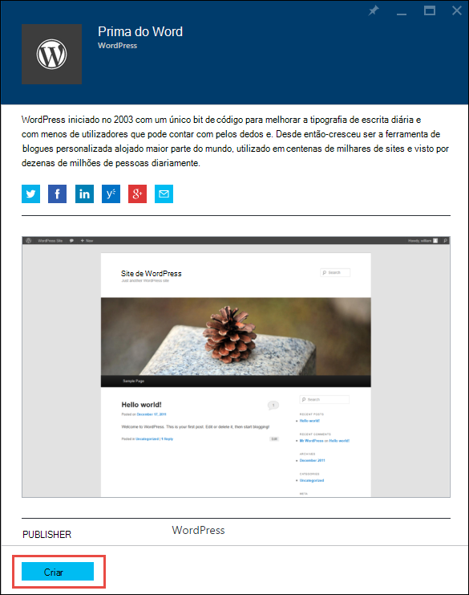

<properties
    pageTitle="Criar uma aplicação de web WordPress na aplicação de serviço de Azure | Microsoft Azure"
    description="Saiba como criar uma nova aplicação Azure web para um blogue de WordPress utilizando o Portal do Azure."
    services="app-service\web"
    documentationCenter="php"
    authors="rmcmurray"
    manager="wpickett"
    editor=""/>

<tags
    ms.service="app-service-web"
    ms.workload="na"
    ms.tgt_pltfrm="na"
    ms.devlang="PHP"
    ms.topic="hero-article"
    ms.date="08/11/2016"
    ms.author="robmcm"/>

# Criar uma aplicação web do WordPress no serviço de aplicação do Azure

[AZURE.INCLUDE [tabs](../../includes/app-service-web-get-started-nav-tabs.md)]

Este tutorial mostra como implementar um site de blogue WordPress do Azure Marketplace.

Quando tiver terminado o tutorial terá o seu próprio site de blogue WordPress para cima e a execução de na nuvem.

Que vai aprender:

* Como encontrar um modelo de aplicação no Azure Marketplace.
* Como criar uma aplicação web no Azure aplicação de serviço baseado no modelo.
* Como configurar definições de serviço de aplicação do Azure para a nova aplicação web e a base de dados.

Azure Marketplace disponibiliza uma vasta gama de aplicações web populares desenvolvidos pela Microsoft, empresas de terceiros e iniciativas de software de abrir origem. As aplicações de web foram criadas numa vasta gama de quadros populares, tal como [PHP](/develop/nodejs/) neste WordPress exemplo, [.NET](/develop/net/), [Node.js](/develop/nodejs/), [Java](/develop/java/)e [Python](/develop/python/), para atribuir um nome algumas. Para criar uma aplicação web do Azure Marketplace o software de só que precisa de é o browser que utiliza para o [Portal do Azure](https://portal.azure.com/). 

O site de WordPress implementar neste tutorial utiliza MySQL para a base de dados. Se pretender utilizar em vez disso, base de dados SQL para a base de dados, consulte o artigo [Nami do projeto](http://projectnami.org/). **Project Nami** também está disponível através de mercado.

> [AZURE.NOTE]
> Para concluir este tutorial, é necessária uma conta do Microsoft Azure. Se não tiver uma conta, pode [Ativar os benefícios da sua Visual Studio subscritor](/pricing/member-offers/msdn-benefits-details/?WT.mc_id=A261C142F) ou [Inscrever-se para uma avaliação gratuita](/en-us/pricing/free-trial/?WT.mc_id=A261C142F).
>
> Se pretender começar com a aplicação de serviço de Azure antes de se inscrever para uma conta do Azure, aceda ao [Serviço de aplicação tente](http://go.microsoft.com/fwlink/?LinkId=523751). Não existem, imediatamente pode criar uma aplicação web do starter curto na aplicação de serviço — sem cartão de crédito obrigatório e sem compromissos.

## Selecione WordPress e configurar o serviço de aplicação do Azure

1. Inicie a sessão [Portal do Azure](https://portal.azure.com/).

2. Clique em **Novo**.
    
    ![Criar novas][5]
    
3. Procurar **WordPress**e, em seguida, clique em **WordPress**. Se pretender utilizar a base de dados SQL em vez de MySQL, procure **Nami de projeto**.

    ![WordPress a partir da lista][7]
    
5. Depois de ler a descrição da aplicação WordPress, clique em **Criar**.

    

4. Introduza um nome para a aplicação web na caixa **do Web app** .

    Este nome tem de ser exclusivo no domínio de azurewebsites.net porque o URL da aplicação web serão {nome}. azurewebsites.net. Se o nome que introduziu não exclusivo, um ponto de exclamação vermelho é apresentada na caixa de texto.

8. Se tiver mais do que uma subscrição, escolha aquele que pretende utilizar. 

5. Selecione um **Grupo de recursos** ou crie um novo.

    Para mais informações sobre os grupos de recursos, consulte o artigo [Descrição geral do Gestor de recursos do Azure](../azure-resource-manager/resource-group-overview.md).

5. Selecione uma **Aplicação de serviço de plano/localização** ou crie um novo.

    Para mais informações sobre os planos do serviço de aplicação, consulte o artigo [Descrição geral de planos do serviço de aplicação do Azure](../azure-web-sites-web-hosting-plans-in-depth-overview.md) 

7. Clique em **base de dados**e, em seguida, no pá a **Nova base de dados do MySQL** forneça os valores necessários para configurar a sua base de dados do MySQL.

    um. Introduza um novo nome ou deixar o nome predefinido.

    b. Deixe o **Tipo de base de dados** definido para **partilhado**.

    c. Selecione na mesma localização que aquele que escolheu para a aplicação web.

    d. Selecione uma camada comparar. Mercúrio (gratuito com ligações permitidas mínimas e espaço em disco) está bem formatado para este tutorial.

8. Na pá **Nova base de dados do MySQL** , clique em **OK**. 

8. Na pá **WordPress** , aceite os termos legais e, em seguida, clique em **Criar**. 

    

    Aplicação de serviço de Azure cria a aplicação web, normalmente no menos de um minuto. Pode ver o progresso ao clicar no ícone de campainha na parte superior da página de portal.

    

## Iniciação e gerir a sua aplicação web do WordPress
    
7. Quando tiver terminada a criação de aplicação web, navegue no Portal do Azure ao grupo de recursos em que criou a aplicação e, pode ver a aplicação web e a base de dados.

    O recurso extra com o ícone de lâmpada é [Informações de aplicação](/services/application-insights/), que fornece serviços de monitorização para a sua aplicação web.

1. No pá **grupo de recursos** , clique na linha de aplicação web.

    

2. Na pá de aplicação Web, clique em **Procurar**.

    ![URL do site][browse]

3. Na página WordPress **Bem-vindo** , introduza as informações de configuração, uma ferramenta necessária ao WordPress e, em seguida, clique em **Instalar WordPress**.

    

4. Inicie sessão com as credenciais que criou na página de **boas-vindas** .  

5. Abre a sua página de Dashboard do site.    

    

## Próximos passos

Visualizou como criar e implementar uma aplicação web do PHP a partir da galeria. Para mais informações sobre como utilizar PHP no Azure, consulte o [Centro de programadores do PHP](/develop/php/).

Para mais informações sobre como trabalhar com a aplicação de serviço Web Apps, consulte as ligações no lado esquerdo da página (para windows do browser e uma altura) ou na parte superior da página (para windows do browser estreita). 

## O que é alterado
* Para um guia para a alteração de Web sites para a aplicação de serviço, consulte o artigo [aplicação de serviço de Azure e o seu impacto dos serviços do Azure existente](http://go.microsoft.com/fwlink/?LinkId=529714).

[5]: ./media/web-sites-php-web-site-gallery/startmarketplace.png
[7]: ./media/web-sites-php-web-site-gallery/search-web-app.png
[browse]: ./media/web-sites-php-web-site-gallery/browse-web.png
