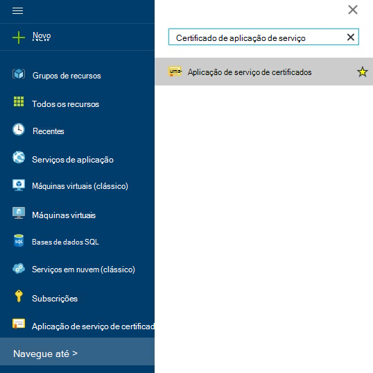
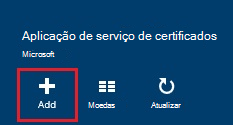
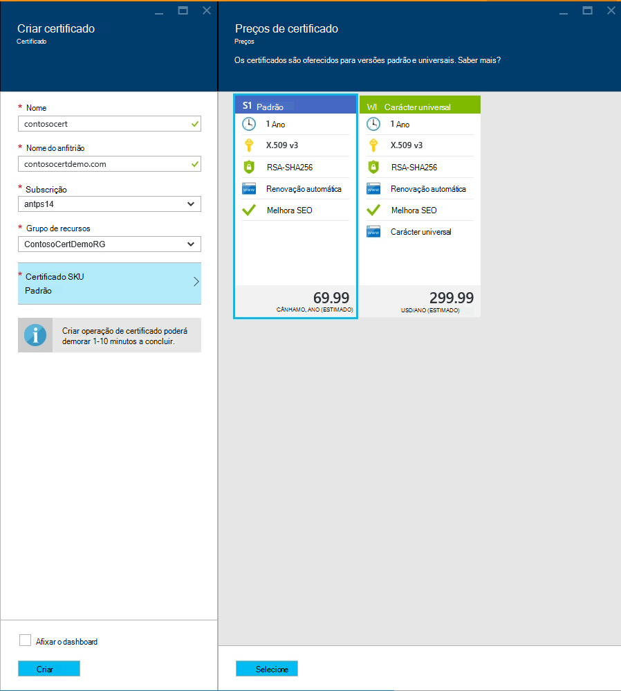
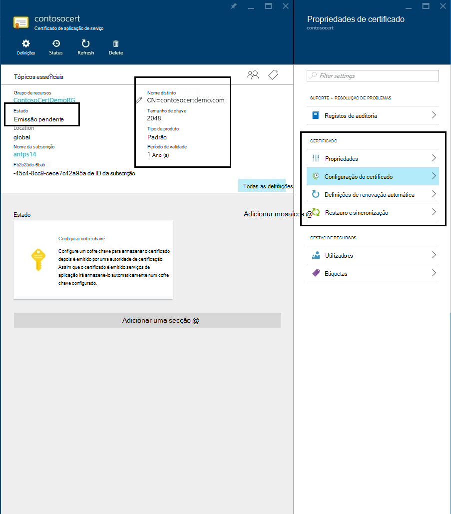
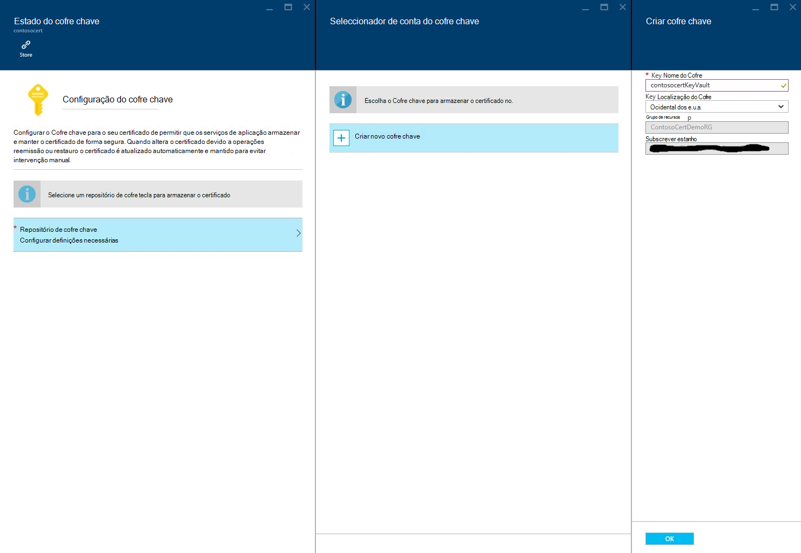
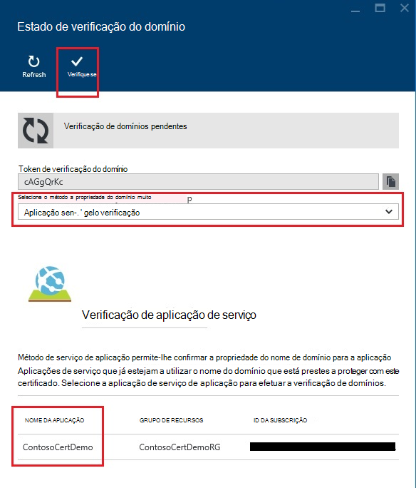
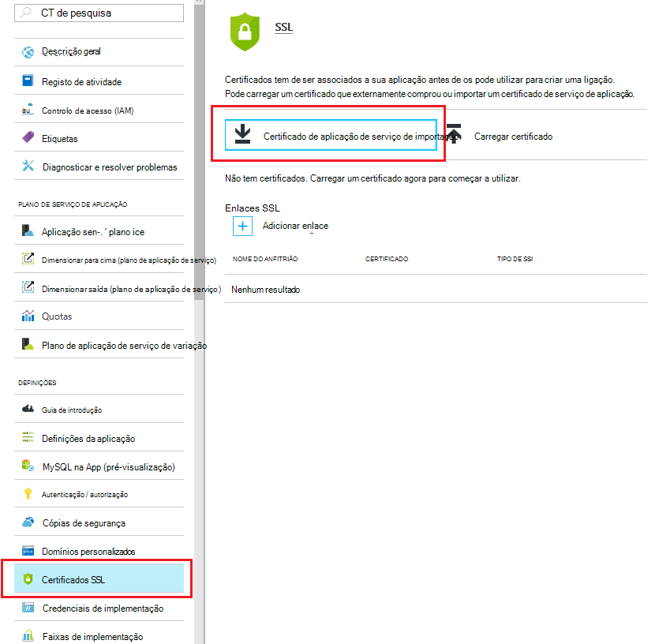
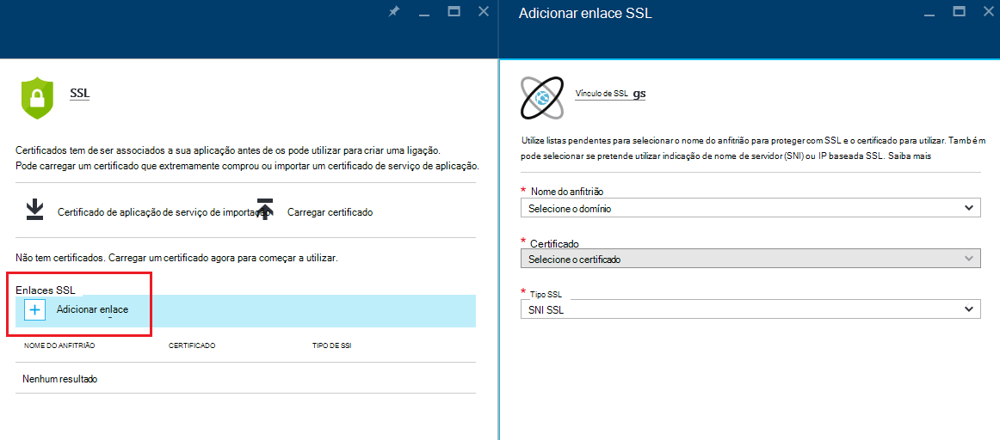
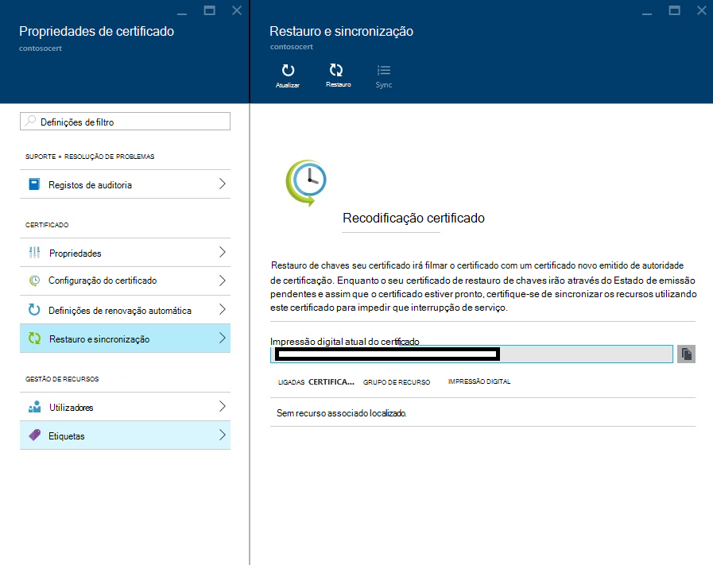

<properties
    pageTitle="Comprar e configurar um certificado SSL do seu serviço de aplicação do Azure"
    description="Saiba como comprar e configurar um certificado SSL do seu serviço de aplicação Azure."
    services="app-service"
    documentationCenter=".net"
    authors="apurvajo"
    manager="stefsch"
    editor="cephalin"
    tags="buy-ssl-certificates"/>

<tags
    ms.service="app-service"
    ms.workload="na"
    ms.tgt_pltfrm="na"
    ms.devlang="na"
    ms.topic="article"
    ms.date="09/19/2016"
    ms.author="apurvajo"/>

#Comprar e configurar um certificado SSL do seu serviço de aplicação do Azure

> [AZURE.SELECTOR]
- [Comprar o certificado SSL no Azure](web-sites-purchase-ssl-web-site.md)
- [Utilizar SSL orientação do diapositivo notas a partir de qualquer outro lugar](web-sites-configure-ssl-certificate.md)

Por predefinição, **[Serviço de aplicação do Azure](http://go.microsoft.com/fwlink/?LinkId=529714)** permite já HTTPS para a sua aplicação web com um certificado de caracteres universais para o *. azurewebsites.net domínio. Se não planeia configurar um domínio personalizado, em seguida, beneficiar o certificado HTTPS predefinido. No entanto, como todos os * [domínios de caracteres universais](https://casecurity.org/2014/02/26/pros-and-cons-of-single-domain-multi-domain-and-wildcard-certificates), não é tão seguro como utilizar um domínio personalizado com o seu próprio certificado. Azure de aplicação de serviço agora fornece-lhe uma forma realmente simplificada para adquirir e gerir um certificado SSL a partir do Portal do Azure sem deixar o portal.  
Este artigo explica como comprar e configurar um certificado SSL do seu **[Serviço de aplicação do Azure](http://go.microsoft.com/fwlink/?LinkId=529714)** 3 passos simples. 

> [AZURE.NOTE]
> Certificados SSL para nomes de domínio personalizados não podem ser utilizados com gratuitos e partilhado web app. Tem de configurar a aplicação web do modo básica, padrão ou Premium, que podem ser alteradas quanto são faturada para a sua subscrição. Ver **[Detalhes de preços de aplicações na Web](https://azure.microsoft.com/pricing/details/web-sites/)** para obter mais informações.

##Descrição geral
> [AZURE.NOTE]
> Não tente adquirir um certificado SSL utilizar uma subscrição que não tem um cartão de crédito ativo associada. Isto poderá resultar na sua subscrição a ser desactivada. 

##<a>Comprar, armazenar e atribuir um certificado SSL do seu domínio personalizado</a>
Para ativar HTTPS para um domínio personalizado, como contoso.com, tem primeiro de ** [configurar um nome de domínio personalizado no serviço de aplicação do Azure.](web-sites-custom-domain-name.md)**

Antes de pedir um certificado SSL, primeiro tem de determinar quais os nomes de domínio serão protegidos pelo certificado. Isto irá determinar qual o tipo de certificado tem de obter. Se apenas precisar de seguro um nome de domínio simples como contoso.com ou www.contoso.com um padrão (básico) certificado é suficiente. Se precisar de seguro múltiplos nomes de domínio, como contoso.com, www.contoso.com e mail.contoso.com, em seguida, pode obter um ** [certificado de caracteres universais](http://en.wikipedia.org/wiki/Wildcard_certificate)**

##Passo 0: Colocar uma ordem de certificado SSL

Neste passo, vai aprender colocar uma ordem de um certificado SSL da sua escolha.

1.  No **[Portal do Azure](https://portal.azure.com/)**, clique em Procurar e escreva "Certificados do serviço de aplicação" na barra de pesquisa e selecione "Certificados do serviço de aplicação" a partir da resultado e, em seguida, clique em Adicionar. 

    

    

2.  Introduza o **nome amigável** para o certificado SSL.

3.  Introduza o **nome do anfitrião**
> [AZURE.NOTE]
    Esta é uma das partes mais importantes do processo de compra. Certifique-se introduzir o nome de anfitrião correcto (domínio personalizado) que pretende proteger com este certificado. Acrescentar **Não** o nome do anfitrião com WWW. Por exemplo, se o seu nome de domínio personalizado é www.contoso.com, em seguida, basta introduzir contoso.com no campo nome do anfitrião, o certificado em questão irá proteger os domínios do www e raiz. 
    
4.  Selecione a sua **subscrição**. 

    Se tiver múltiplas subscrições, em seguida, certifique-se criar um certificado SSL na mesma subscrição que tiver utilizado para o seu domínio personalizado ou Web App em questão.
       
5.  Selecione ou criar um **grupo de recursos**.

    Grupos de recursos permitem-lhe gerir recursos Azure relacionados como uma unidade e são úteis quando estabelecer regras de acesso baseado em funções de controlo (RBCA) para as suas aplicações. Para obter mais informações, consulte Gerir os recursos do Azure.
     
6.  Selecione o **certificado SKU** 

    Por fim, selecione o certificado SKU que se adequa suas necessidades e clique em criar. Hoje em dia, a aplicação de serviço de Azure permite-lhe comprar duas diferentes SKUs • S1 – certificado padrão com validade de 1 ano e renovação automática  
           • B1 – carácter universal certificado com a renovação automática de validade e de 1 ano      
    Ver **[Detalhes de preços de aplicações na Web](https://azure.microsoft.com/pricing/details/web-sites/)** para obter mais informações.

> [AZURE.NOTE]
> Criação de um certificado SSL entrarão em qualquer local a partir de 1 – 10 minutos. Este processo executa vários passos em segundo plano que caso contrário, são muito complexo para efetuar manualmente.  

##Passo 1: Armazenar o certificado no Azure chave Cofre

Neste passo, vai aprender colocar um arquivo de um certificado SSL que comprou Azure chave cofre da sua escolha.

1.  Uma vez concluída a compra de um certificado SSL terá de abrir manualmente pá **Certificados do serviço de aplicação** recurso procurando-lo novamente (consulte o artigo passo 1 acima)   

    

    Irá Repare que o estado de certificado é **"emissão pendente"** , existem alguns passos mais que precisa de concluir antes de poder começar a utilizar este certificados.
 
2. Clique no **"configuração de certificados"** dentro pá propriedades de certificado e clique em **"passo 1: armazenar"** para armazenar este certificado no Azure chave cofre.

3.  A partir do clique **"chave cofre estado"** pá **"chave cofre repositório"** para escolher um cofre chave existente para armazenar este certificado **ou "Criar nova tecla cofre"** criar nova tecla cofre dentro do mesmo grupo de subscrição e de recursos.
 
    
 
    > [AZURE.NOTE]
    Azure Cofre de chave tem muito mínimas taxas para armazenar este certificado. Ver **[Detalhes de preços do Azure chave cofre](https://azure.microsoft.com/pricing/details/key-vault/)** para obter mais informações.

4. Assim que tiver selecionado do repositório de cofre chave para armazenar este certificado no, vá para a frente e armazená-la ao clicar no botão **"Armazenar"** no topo da pá **"chave cofre estado"** .  

    Isto deve concluir passo para armazenar o certificado que comprou com Azure chave cofre da sua escolha. Após atualizar o pá, deverá ver verde verificar marcar contra este passo também.
    
##Passo 2: Verifique a propriedade do domínio

Neste passo, vai aprender a efetuar a verificação de que é o proprietário do domínio para um certificado SSL que é, colocou apenas uma ordem para. 

1.  Clique no **"passo 2: Verifique se"** passo a partir do pá **"Configuração de certificados"** . Existem 4 tipos de domínio verificação suportado pelo certificados do serviço de aplicação.

    * **Verificação de aplicação de serviço** 
    
        * Este é o processo mais prático se já tiver **o seu domínio personalizado atribuído ao iniciador de aplicações de serviço.** Este método irá listar saída todas as aplicações de serviço de aplicação que correspondem a este critério. 
           Por exemplo, neste caso, **contosocertdemo.com** é um domínio personalizado atribuído à aplicação de serviço de aplicação denominado **"ContosoCertDemo"** e, consequentemente, que é a aplicação de serviço de aplicação apenas listados aqui. Se havia implementação com várias região, em seguida,-seria listá-las toda as regiões.
        
           O método de verificação só está disponível para compras certificado (básica) padrão. Para os certificados de carateres universais, ignore e deslocar-se para a opção B. o, C. o ou D abaixo.
        * Clique no botão **"Verificar"** para concluir este passo.
        * Clique em **"Atualizar"** atualizar o estado de certificado após verificação seja concluída. Pode demorar alguns minutos para verificação concluir.
        
             

    * **Verificação de domínios** 

        * Este é o processo mais prático **apenas se** tiver **[comprou o seu domínio personalizado a partir da aplicação de serviço de Azure.](custom-dns-web-site-buydomains-web-app.md)**
        
        * Clique no botão **"Verificar"** para concluir este passo.
        
        * Clique em **"Atualizar"** atualizar o estado de certificado após verificação seja concluída. Pode demorar alguns minutos para verificação concluir.

    * **Verificação de correio**
        
        * E-mail de verificação já ter sido enviada para o endereço de correio eletrónico associada este domínio personalizado.
         
        * Abra o e-mail e clique na ligação da verificação para concluir o passo de verificação de correio eletrónico. 
        
        * Se precisar de reenviar o e-mail de verificação, clique no botão **"Reenviar correio eletrónico"** .
         
    * **Verificação manual**    
                 
        1. **Verificação de página Web HTML**
        
            * Criar um ficheiro HTML com o nome. HTML **{Token de verificação do domínio}**(pode copiar o token de ele pá de estado de verificação de domínio)
            
            * Conteúdo deste ficheiro deve ser o mesmo nome exato do **Token de verificação do domínio**.
            
            * Carregar este ficheiro na raiz do servidor web que aloja o seu domínio.
            
            * Clique em **"Atualizar"** atualizar o estado de certificado após verificação seja concluída. Pode demorar alguns minutos para verificação concluir.
            
            Por exemplo, se estiver a comprar um certificado padrão para contosocertdemo.com com Token de verificação do domínio **'cAGgQrKc'** , em seguida, um pedido de web efetuado **'http://contosocertdemo.com/cAGgQrKc.html'** deve devolver **cAGgQrKc.**
        2. **Verificação de registo DNS TXT**

            * Utilizar o seu Gestor de DNS, crie um registo TXT no subdomínio **'DZC'** com valor igual ao **Token de verificação do domínio.**
            
            * Clique em **"Atualizar"** atualizar o estado de certificado após verificação seja concluída. Pode demorar alguns minutos para verificação concluir.
                              
            Por exemplo, para realizar validação para um certificado de caracteres universais com hostname ** \*. contosocertdemo.com** ou ** \*. subdomain.contosocertdemo.com** e Token de verificação do domínio **cAGgQrKc**, necessita de criar um registo TXT em dzc.contosocertdemo.com com valor **cAGgQrKc.**     

##Passo 3: Atribuir certificado a aplicação de serviço de aplicação

Neste passo, vai aprender atribuir esta comprado recentemente certificado às suas aplicações de serviço de aplicação. 

> [AZURE.NOTE]
> Antes de executar os passos nesta secção, tem de ter associado um nome de domínio personalizado com a sua aplicação. Para obter mais informações, consulte o artigo ** [configurar um nome de domínio personalizado para um web App.](web-sites-custom-domain-name.md)**

1.  No seu browser, abra o ** [Azure Portal.](https://portal.azure.com/)**
2.  Clique na opção de **Aplicação de serviço** no lado esquerdo da página.
3.  Clique no nome da sua aplicação para o qual pretende atribuir este certificado. 
4.  Nas **Definições**, clique em **certificados SSL**
5.  Clique em **Importar certificado de aplicação do serviço** e selecione o certificado que comprou apenas

    

6. Clique em **Adicionar enlaces** da secção nos **enlaces ssl**
7. Na pá **Adicionar SSL encadernação** utilize listas pendentes para selecionar o nome de domínio para proteger com SSL e o certificado para utilizar. Também pode selecionar se pretende utilizar **[Indicação de nome de servidor (SNI)](http://en.wikipedia.org/wiki/Server_Name_Indication)** ou IP baseada SSL.

    

       •    IP based SSL associates a certificate with a domain name by mapping the dedicated public IP address of the server to the domain name. This requires each domain name (contoso.com, fabricam.com, etc.) associated with your service to have a dedicated IP address. This is the traditional          method of associating SSL certificates with a web server.
       •    SNI based SSL is an extension to SSL and **[Transport Layer Security](http://en.wikipedia.org/wiki/Transport_Layer_Security)** (TLS) that allows multiple domains to share the same IP address, with separate security certificates for each domain. Most modern browsers (including Internet Explorer, Chrome, Firefox and Opera) support SNI, however older browsers may not support SNI. For more information on SNI, see the **[Server Name Indication](http://en.wikipedia.org/wiki/Server_Name_Indication)** article on Wikipedia.
       
7. Clique em **Adicionar encadernação** para guardar as alterações e ativar SSL.

Se tiver seleccionado **IP com base SSL** e o seu domínio personalizado é configurado utilizando um registo, deve efetuar os seguintes passos adicionais:

* Depois de ter configurado um IP baseados encadernação SSL, um endereço IP dedicado é atribuído para a sua aplicação. Pode encontrar este endereço IP na página **domain personalizada** em definições da sua aplicação, para a direita acima da secção de **nomes de anfitriões** . Este será listado como **Endereço IP externo**
    
    

    Tenha em atenção que este endereço IP será diferente do endereço IP virtual utilizado anteriormente para configurar o registo para o seu domínio. Se estiverem configurados para utilizarem SNI com base em SSL, ou não estiverem configurados para utilizar SSL, não existe um endereço será listado nesta entrada.
    
2. Utilizar as ferramentas de fornecida pela sua entidade de registo de nome de domínio, modifique o registo a para o seu nome de domínio personalizado para apontarem para o endereço IP do passo anterior.
Neste momento, deverá conseguir visitar a sua aplicação utilizando HTTPS:// em vez de HTTP:// para verificar o certificado ter sido configurado corretamente.

##Recodificação e sincronizar o certificado

1. Por motivos de segurança, se necessário recodificação seu certificado, em seguida, basta selecione a opção de **"recodificação e sincronizar"** pá **"Propriedades do certificado"** . 

2. Clique no botão **"Recodificação"** para iniciar o processo. Este processo pode demorar 1-10 minutos a concluir. 

    

3. Restauro de chaves seu certificado irá filmar o certificado com um novo certificado emitido por uma autoridade de certificação.
4. Não lhe será cobrado para Rekeying para o tempo de vida do certificado. 
5. Restauro de chaves seu certificado subscreve através do Estado de emissão pendentes. 
6. Assim que o certificado estiver pronto, certifique-se de que sincronizar os seus recursos utilizando este certificado para impedir que interrupção ao serviço.
7. Opção sincronizar não está disponível para certificados que ainda não são atribuídos à aplicação Web. 

## Mais recursos ##
- [Ativar HTTPS para uma aplicação no Azure de aplicação de serviço](web-sites-configure-ssl-certificate.md)
- [Comprar e configurar um nome de domínio personalizado no serviço de aplicação do Azure](custom-dns-web-site-buydomains-web-app.md)
- [Centro de fidedignidade do Microsoft Azure](/support/trust-center/security/)
- [Opções de configuração desbloqueadas no Azure Web Sites](http://azure.microsoft.com/blog/2014/01/28/more-to-explore-configuration-options-unlocked-in-windows-azure-web-sites/)
- [Portal de gestão do Azure](https://manage.windowsazure.com)

>[AZURE.NOTE] Se pretender começar a aplicação de serviço de Azure antes de inscrever-se para uma conta do Azure, aceda ao [Tentar aplicação de serviço](http://go.microsoft.com/fwlink/?LinkId=523751), onde imediatamente pode criar uma aplicação web do starter curto na aplicação de serviço. Sem cartões de crédito necessários; sem compromissos.

