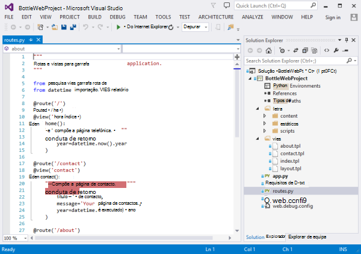
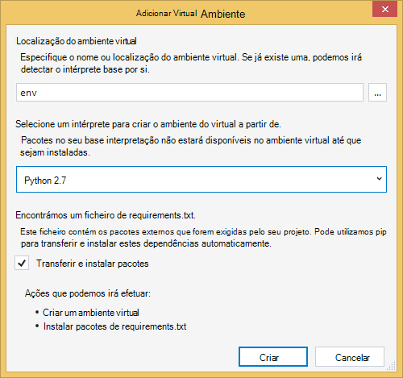
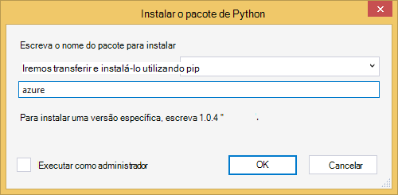
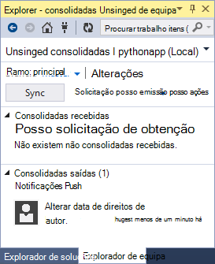
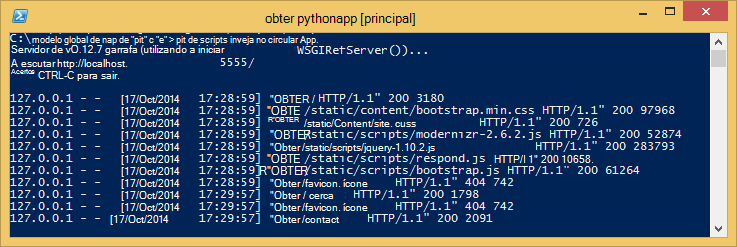
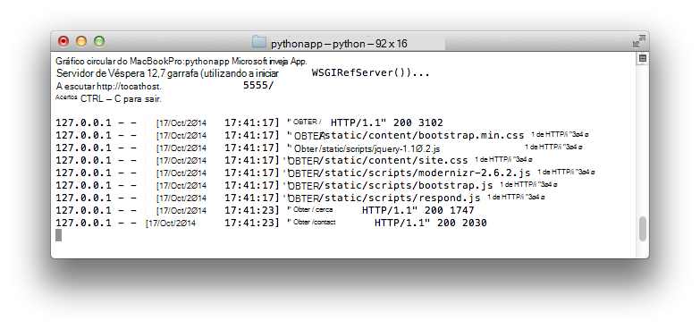
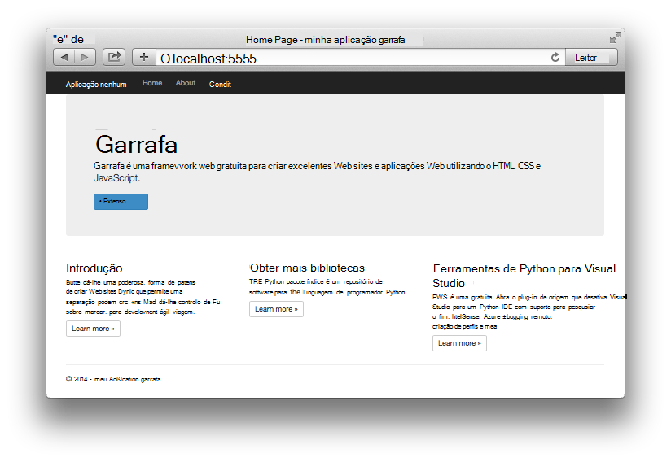

<properties 
    pageTitle="Python web apps com garrafa no Azure" 
    description="Tutorial que lhe apresenta em execução de uma aplicação web do Python no Azure aplicação de serviço Web Apps." 
    services="app-service\web" 
    documentationCenter="python" 
    tags="python"
    authors="huguesv" 
    manager="wpickett" 
    editor=""/>

<tags 
    ms.service="app-service-web" 
    ms.workload="web" 
    ms.tgt_pltfrm="na" 
    ms.devlang="python" 
    ms.topic="article" 
    ms.date="02/19/2016"
    ms.author="huvalo"/>

# Criar aplicações web com garrafa no Azure

Neste tutorial descreve como começar a ser executado Python no Azure aplicação de serviço Web Apps. Web Apps fornece alojamento gratuito limitado e de implementação rápida e pode utilizar Python! À medida que aumenta a sua aplicação, pode mudar para o alojamento paga e também pode integrar com todos os outros serviços do Azure.

Irá criar uma aplicação web utilizando a arquitetura de web garrafa (consulte o artigo alternativos versões deste tutorial para [Django](web-sites-python-create-deploy-django-app.md) e [balão](web-sites-python-create-deploy-flask-app.md)). Irá criar a aplicação web do Azure Marketplace, configurar a implementação de Git e clonar do repositório localmente. Em seguida, será executar a aplicação web localmente, efetuar alterações, consolide e emissão-los ao [Azure aplicação de serviço Web Apps](http://go.microsoft.com/fwlink/?LinkId=529714). O tutorial mostra como fazê-lo a partir do Windows ou Mac/Linux.

[AZURE.INCLUDE [create-account-and-websites-note](../../includes/create-account-and-websites-note.md)]

>[AZURE.NOTE] Se pretender começar a aplicação de serviço de Azure antes de inscrever-se para uma conta do Azure, aceda ao [Tentar aplicação de serviço](http://go.microsoft.com/fwlink/?LinkId=523751), onde imediatamente pode criar uma aplicação web do starter curto na aplicação de serviço. Sem cartões de crédito necessários; sem compromissos.

## Pré-requisitos

- Windows, Mac ou Linux
- Python 2.7 ou 3.4.
- setuptools pip, virtualenv (apenas no Python 2.7)
- Git
- [Ferramentas de Python 2.2 para Visual Studio][] Tenha em atenção (PTVS) -: Isto é opcional

**Nota**: publicação TFS não é atualmente suportada para projetos Python.

### Windows

Se ainda não tiver Python 2.7 ou 3.4 instalado (32 bits), recomendamos que instale [Azure SDK para Python 2.7] ou [Azure SDK para Python 3.4] utilizando Web plataforma Installer. Isto instala a versão de 32 bits do Python, setuptools, pip, virtualenv, etc (32 bits Python é o que é instalado nos computadores anfitrião Azure). Em alternativa, pode obter Python do [python.org].

Para Git, recomendamos que [Git para Windows] ou [GitHub para Windows]. Se utilizar o Visual Studio, pode utilizar o suporte técnico da Git integrado.

Recomendamos também instalar [Python ferramentas 2.2 para Visual Studio]. Isto é opcional, mas se tiver o [Visual Studio], incluindo o gratuito Visual Studio Comunidade 2013 ou o Visual Studio 2013 Express para Web, em seguida, isto irá dar-lhe um IDE Python excelente.

### Mac/Linux

Deverá ter Python e Git já instalado, mas certifique-se de que tem Python 2.7 ou 3.4.

## Criação de aplicação Web no Portal do Azure

É o primeiro passo para criar a sua aplicação criar a aplicação web através de do [Portal do Azure](https://portal.azure.com).  

1. Inicie sessão no Portal do Azure e clique no botão **Novo** no canto inferior esquerdo. 
3. Na caixa de pesquisa, escreva "python".
4. Nos resultados da pesquisa, selecione **garrafa**, em seguida, clique em **Criar**.
5. Configure a nova aplicação garrafa, tal como criar um novo plano de serviço de aplicação e um novo grupo de recursos para a mesma. Em seguida, clique em **Criar**.
6. Configure a publicação de Git para a sua aplicação web recentemente criado, seguindo as instruções no [Local Git implementação para a aplicação de serviço de Azure](app-service-deploy-local-git.md).
 
## Descrição geral da aplicação

### Conteúdos do repositório Git

Eis uma descrição geral dos ficheiros que encontrará no repositório Git inicial, que recomendamos irá clonar na secção seguinte.

    \routes.py
    \static\content\
    \static\fonts\
    \static\scripts\
    \views\about.tpl
    \views\contact.tpl
    \views\index.tpl
    \views\layout.tpl

Origens de principais para a aplicação. É composta por 3 páginas (índice, sobre contacto) com um esquema do modelo global.  Em conteúdo estático e scripts incluem arranque, jquery, modernizr e responder.

    \app.py

Suporte de servidor de desenvolvimento local. Utilize esta opção para executar a aplicação localmente.

    \BottleWebProject.pyproj
    \BottleWebProject.sln

Ficheiros de projeto para utilização com [As ferramentas Python para Visual Studio].

    \ptvs_virtualenv_proxy.py

Proxy do IIS para ambientes virtuais e PTVS depuração suporte remota.

    \requirements.txt

Pacotes externos necessários por esta aplicação. O script de implementação será pip instalar os pacotes listados neste ficheiro.
 
    \web.2.7.config
    \web.3.4.config

Ficheiros de configuração do IIS. O script de implementação irá utilizar o web.x.y.config adequado e copiá-lo como Web. config.

### Ficheiros opcionais - implementação de personalização

[AZURE.INCLUDE [web-sites-python-customizing-deployment](../../includes/web-sites-python-customizing-deployment.md)]

### Ficheiros opcionais - Python runtime

[AZURE.INCLUDE [web-sites-python-customizing-runtime](../../includes/web-sites-python-customizing-runtime.md)]

### Ficheiros adicionais no servidor

Alguns ficheiros existem no servidor, mas não são adicionados ao repositório git. Estes são criados pelo script de implementação.

    \web.config

Ficheiro de configuração do IIS. Criada a partir web.x.y.config na cada implementação.

    \env\

Ambiente virtual Python. Criado durante a implementação, se ainda não exista um ambiente virtual compatíveis com a aplicação web.  Pacotes listados em requirements.txt são pip instalado, mas pip irá ignorar instalação se os pacotes já estão instalados.

As 3 seguinte secções descrevem como continuar com a programação da aplicações web em ambientes diferentes 3:

- Windows, com as ferramentas Python para Visual Studio
- Windows, com linha de comandos
- Mac/Linux, com linha de comandos

## Web App desenvolvimento - Windows - Python ferramentas para Visual Studio

### Clonar o repositório

Em primeiro lugar, clonar repositório utilizando o url fornecido no Portal do Azure. Para mais informações, consulte o artigo [Local Git implementação para a aplicação de serviço de Azure](app-service-deploy-local-git.md).

Abra o ficheiro da solução (.sln) que está incluído na raiz do repositório.

### Criar ambiente virtual

Agora, iremos criar um ambiente virtual para desenvolvimento local. Botão direito do rato no **Python ambientes** selecionar **Adicionar ambiente Virtual...**.

- Certifique-se é o nome do ambiente de `env`.

- Selecione o intérprete base. Certifique-se utilizar a mesma versão do Python está selecionada para a sua aplicação web (em runtime.txt ou pá as **Definições da aplicação** da sua aplicação web no Portal do Azure).

- Certifique-se a opção para transferir e instalar pacotes está selecionada.

Clique em **Criar**. Isto irá criar o ambiente virtual e instalar o dependências listadas na requirements.txt.

### Executar a utilizar o servidor de desenvolvimento

Prima F5 para iniciar a depuração e o seu browser abrirá automaticamente para a página a ser executado localmente.

Pode definir pontos de interrupção nas fontes, utilize o windows de monitorização, etc. Consulte as [Ferramentas de Python para Visual Studio documentação] para obter mais informações sobre as várias funcionalidades.

### Efetuar alterações

Agora pode experimentar ao efetuar alterações à origens de aplicação e/ou modelos.

Depois de testámos as suas alterações, consolidá-los para o repositório de Git:

### Instalar pacotes mais

A aplicação poderá ter dependências para além dos Python e garrafa.

Pode instalar pacotes adicionais utilizando pip. Para instalar um pacote, com o botão direito no ambiente de virtual e selecione **Instalar o pacote de Python**.

Por exemplo, para instalar o SDK do Azure para Python, que dá-lhe acesso, armazenamento Azure, bus de serviço e outros serviços do Azure, introduza `azure`:

Botão direito do rato no ambiente de virtual e selecione **Gerar requirements.txt** para atualizar requirements.txt.

Consolide, em seguida, as alterações requirements.txt para o repositório de Git.

### Implementar Azure

Para acionar uma implementação, clique em **sincronizar** ou **Push**. A sincronização é que um push e uma solicitação.

A implementação primeira irá demorar algum tempo, tal como irá criar um ambiente virtual, instalar pacotes, etc.

Visual Studio não é apresentado o progresso da implementação. Se gostaria rever o resultado, consulte a secção sobre [resolução de problemas - implementação](#troubleshooting-deployment).

Navegue para o URL do Azure para ver as suas alterações.

## Linha de comandos - Windows - desenvolvimento da aplicação Web

### Clonar o repositório

Em primeiro lugar, clonar repositório utilizando o URL fornecido no Portal do Azure e adicionar o repositório Azure como um controlo remoto. Para mais informações, consulte o artigo [Local Git implementação para a aplicação de serviço de Azure](app-service-deploy-local-git.md).

    git clone <repo-url>
    cd <repo-folder>
    git remote add azure <repo-url> 

### Criar ambiente virtual

Vamos criar um novo ambiente virtual para fins de desenvolvimento (não adicioná-lo para o repositório). Ambientes virtuais no Python não são relocalizável, portanto, cada programador trabalhar na aplicação irá criar os seus próprios localmente.

Certifique-se utilizar a mesma versão do Python está selecionada para a sua aplicação web (em runtime.txt ou pá as definições da aplicação para a sua aplicação web no Portal do Azure)

Para Python 2.7:

    c:\python27\python.exe -m virtualenv env

Para Python 3.4:

    c:\python34\python.exe -m venv env

Instale quaisquer pacotes externos necessários pela aplicação. Pode utilizar o ficheiro requirements.txt na raiz do repositório para instalar os pacotes no seu ambiente virtual:

    env\scripts\pip install -r requirements.txt

### Executar a utilizar o servidor de desenvolvimento

Pode iniciar a aplicação num servidor de desenvolvimento com o seguinte comando:

    env\scripts\python app.py

A consola irá apresentar o URL e recebe porta do servidor:

Em seguida, abra o seu browser para esse URL.

### Efetuar alterações

Agora pode experimentar ao efetuar alterações à origens de aplicação e/ou modelos.

Depois de testámos as suas alterações, consolidá-los para o repositório de Git:

    git add <modified-file>
    git commit -m "<commit-comment>"

### Instalar pacotes mais

A aplicação poderá ter dependências para além dos Python e garrafa.

Pode instalar pacotes adicionais utilizando pip. Por exemplo, para instalar o SDK do Azure para Python, que dá-lhe acesso, armazenamento Azure, bus de serviço e outros serviços do Azure, escreva:

    env\scripts\pip install azure

Certifique-se atualizar requirements.txt:

    env\scripts\pip freeze > requirements.txt

Consolide as alterações:

    git add requirements.txt
    git commit -m "Added azure package"

### Implementar Azure

Para acionar uma implementação, transmitir as alterações para Azure:

    git push azure master

Irá ver o resultado de script de implementação, incluindo ambiente virtual criação, instalação de pacotes, criação de Web. config.

Navegue para o URL do Azure para ver as suas alterações.

## Linha de comandos de desenvolvimento Mac/Linux - do Web app

### Clonar o repositório

Em primeiro lugar, clonar repositório utilizando o URL fornecido no Portal do Azure e adicionar o repositório Azure como um controlo remoto. Para mais informações, consulte o artigo [Local Git implementação para a aplicação de serviço de Azure](app-service-deploy-local-git.md).

    git clone <repo-url>
    cd <repo-folder>
    git remote add azure <repo-url> 

### Criar ambiente virtual

Vamos criar um novo ambiente virtual para fins de desenvolvimento (não adicioná-lo para o repositório). Ambientes virtuais no Python não são relocalizável, portanto, cada programador trabalhar na aplicação irá criar os seus próprios localmente.

Certifique-se utilizar a mesma versão do Python está selecionada para a sua aplicação web (em runtime.txt ou pá as definições da aplicação da sua aplicação web no Portal do Azure).

Para Python 2.7:

    python -m virtualenv env

Para Python 3.4:

    python -m venv env
ou pyvenv envelope

Instale quaisquer pacotes externos necessários pela aplicação. Pode utilizar o ficheiro requirements.txt na raiz do repositório para instalar os pacotes no seu ambiente virtual:

    env/bin/pip install -r requirements.txt

### Executar a utilizar o servidor de desenvolvimento

Pode iniciar a aplicação num servidor de desenvolvimento com o seguinte comando:

    env/bin/python app.py

A consola irá apresentar o URL e recebe porta do servidor:

Em seguida, abra o seu browser para esse URL.

### Efetuar alterações

Agora pode experimentar ao efetuar alterações à origens de aplicação e/ou modelos.

Depois de testámos as suas alterações, consolidá-los para o repositório de Git:

    git add <modified-file>
    git commit -m "<commit-comment>"

### Instalar pacotes mais

A aplicação poderá ter dependências para além dos Python e garrafa.

Pode instalar pacotes adicionais utilizando pip. Por exemplo, para instalar o SDK do Azure para Python, que dá-lhe acesso, armazenamento Azure, bus de serviço e outros serviços do Azure, escreva:

    env/bin/pip install azure

Certifique-se atualizar requirements.txt:

    env/bin/pip freeze > requirements.txt

Consolide as alterações:

    git add requirements.txt
    git commit -m "Added azure package"

### Implementar Azure

Para acionar uma implementação, transmitir as alterações para Azure:

    git push azure master

Irá ver o resultado de script de implementação, incluindo ambiente virtual criação, instalação de pacotes, criação de Web. config.

Navegue para o URL do Azure para ver as suas alterações.

## Resolução de problemas - instalação do pacote

[AZURE.INCLUDE [web-sites-python-troubleshooting-package-installation](../../includes/web-sites-python-troubleshooting-package-installation.md)]

## Resolução de problemas - ambiente Virtual

[AZURE.INCLUDE [web-sites-python-troubleshooting-virtual-environment](../../includes/web-sites-python-troubleshooting-virtual-environment.md)]

## Próximos passos

Siga estas ligações para mais informações sobre garrafa e Python ferramentas para o Visual Studio: 
 
- [Garrafa documentação]
- [Ferramentas de Python para documentação Visual Studio]

Para obter informações sobre a utilização do armazenamento de tabela do Azure e MongoDB:

- [Garrafa e MongoDB no Azure com as ferramentas Python para Visual Studio]
- [Garrafa e armazenamento de tabela do Azure no Azure com as ferramentas Python para Visual Studio]

## O que é alterado
* Para um guia para a alteração de Web sites para a aplicação de serviço Consulte o artigo: [aplicação de serviço de Azure e respectivo impacto na existente dos serviços do Azure](http://go.microsoft.com/fwlink/?LinkId=529714)

<!--Link references-->
[Garrafa e MongoDB no Azure com as ferramentas Python para Visual Studio]: web-sites-python-ptvs-bottle-table-storage.md
[Garrafa e armazenamento de tabela do Azure no Azure com as ferramentas Python para Visual Studio]: web-sites-python-ptvs-bottle-table-storage.md

<!--External Link references-->
[Azure SDK para Python 2.7]: http://go.microsoft.com/fwlink/?linkid=254281
[Azure SDK para Python 3.4.]: http://go.microsoft.com/fwlink/?linkid=516990
[Python.org]: http://www.python.org/
[Git para Windows]: http://msysgit.github.io/
[GitHub para Windows]: https://windows.github.com/
[Ferramentas de Python para Visual Studio]: http://aka.ms/ptvs
[Python ferramentas 2.2 para Visual Studio]: http://go.microsoft.com/fwlink/?LinkID=624025
[Visual Studio]: http://www.visualstudio.com/
[Ferramentas de Python para documentação Visual Studio]: http://aka.ms/ptvsdocs 
[Garrafa documentação]: http://bottlepy.org/docs/dev/index.html
 
