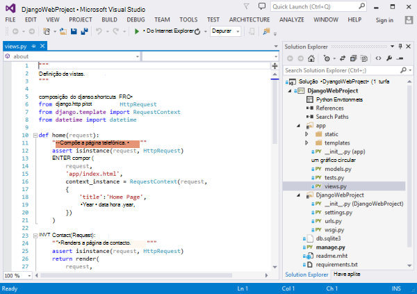
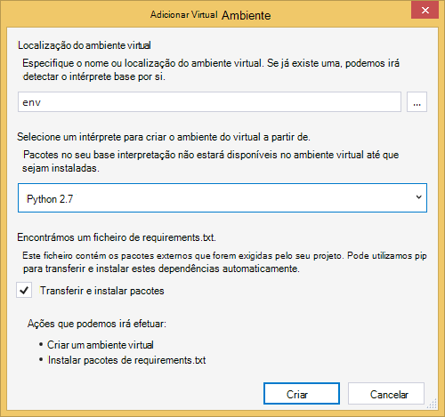
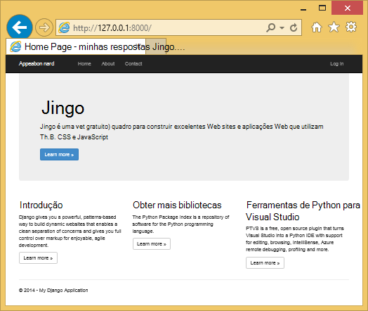
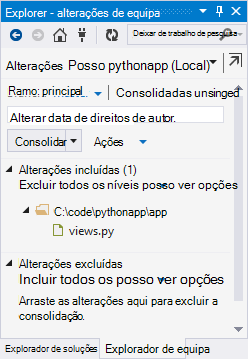
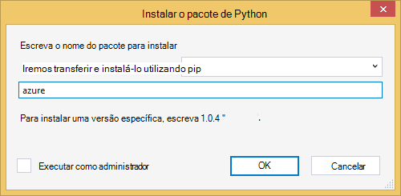
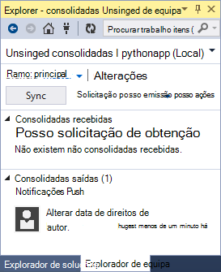
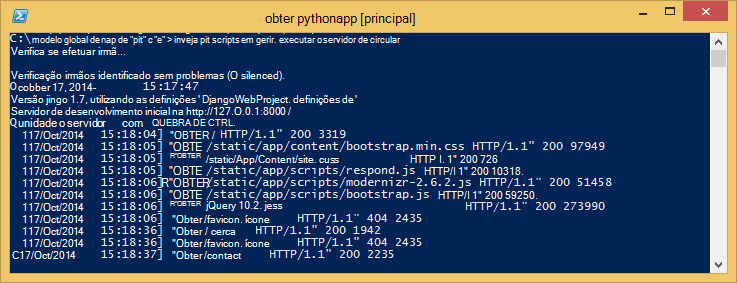
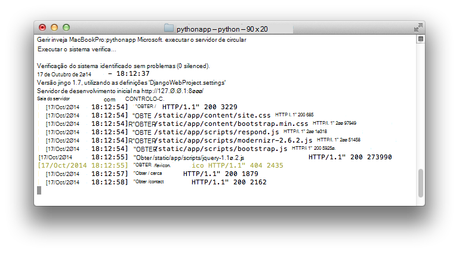
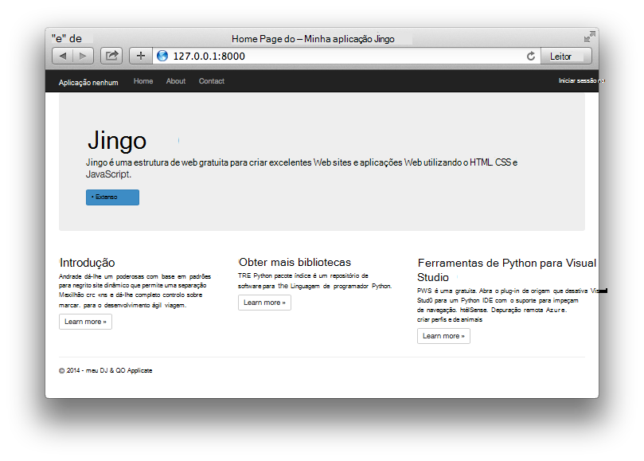

<properties
    pageTitle="Criar aplicações web com Django no Azure"
    description="Tutorial que lhe apresenta em execução de uma aplicação web do Python no Azure aplicação de serviço Web Apps."
    services="app-service\web"
    documentationCenter="python"
    tags="python"
    authors="huguesv" 
    manager="wpickett" 
    editor=""/>

<tags
    ms.service="app-service-web"
    ms.workload="web"
    ms.tgt_pltfrm="na"
    ms.devlang="python"
    ms.topic="hero-article" 
    ms.date="02/19/2016"
    ms.author="huvalo"/>

# Criar aplicações web com Django no Azure

Neste tutorial descreve como começar a executar Python no [Azure aplicação de serviço Web Apps](http://go.microsoft.com/fwlink/?LinkId=529714). Web Apps fornece alojamento gratuito limitado e de implementação rápida e pode utilizar Python! À medida que aumenta a sua aplicação, pode mudar para o alojamento paga e também pode integrar com todos os outros serviços do Azure.

Irá criar uma aplicação utilizando a arquitetura de web Django (consulte o artigo alternativos versões deste tutorial para [balão](web-sites-python-create-deploy-flask-app.md) e [garrafa](web-sites-python-create-deploy-bottle-app.md)). Irá criar a aplicação web do Azure Marketplace, configurar a implementação de Git e clonar do repositório localmente. Em seguida, será executar a aplicação localmente, efetuar alterações, consolide e transmiti-los para Azure. O tutorial mostra como fazê-lo a partir do Windows ou Mac/Linux.

[AZURE.INCLUDE [create-account-and-websites-note](../../includes/create-account-and-websites-note.md)]

>[AZURE.NOTE] Se pretender começar a aplicação de serviço de Azure antes de inscrever-se para uma conta do Azure, aceda ao [Tentar aplicação de serviço](http://go.microsoft.com/fwlink/?LinkId=523751), onde imediatamente pode criar uma aplicação web do starter curto na aplicação de serviço. Sem cartões de crédito necessários; sem compromissos.

## Pré-requisitos

- Windows, Mac ou Linux
- Python 2.7 ou 3.4.
- setuptools pip, virtualenv (apenas no Python 2.7)
- Git
- [Ferramentas de Python para Visual Studio][] Tenha em atenção (PTVS) -: Isto é opcional

**Nota**: publicação TFS não é atualmente suportada para projetos Python.

### Windows

Se ainda não tiver Python 2.7 ou 3.4 instalado (32 bits), recomendamos que instale [Azure SDK para Python 2.7] ou [Azure SDK para Python 3.4] utilizando Web plataforma Installer. Isto instala a versão de 32 bits do Python, setuptools, pip, virtualenv, etc (32 bits Python é o que é instalado nos computadores anfitrião Azure). Em alternativa, pode obter Python do [python.org].

Para Git, recomendamos que [Git para Windows] ou [GitHub para Windows]. Se utilizar o Visual Studio, pode utilizar o suporte técnico da Git integrado.

Recomendamos também instalar [Python ferramentas 2.2 para Visual Studio]. Isto é opcional, mas se tiver o [Visual Studio], incluindo o gratuito Visual Studio Comunidade 2013 ou o Visual Studio 2013 Express para Web, em seguida, isto irá dar-lhe um IDE Python excelente.

### Mac/Linux

Deverá ter Python e Git já instalado, mas certifique-se de que tem Python 2.7 ou 3.4.

## Criação de aplicação Web no Portal

É o primeiro passo para criar a sua aplicação criar a aplicação web através de do [Portal do Azure](https://portal.azure.com).

1. Inicie sessão no Portal do Azure e clique no botão **Novo** no canto inferior esquerdo.
3. Na caixa de pesquisa, escreva "python".
4. Nos resultados da pesquisa, selecione **Django** (publicado por PTVS), em seguida, clique em **Criar**.
5. Configure a nova aplicação Django, tal como criar um novo plano de serviço de aplicação e um novo grupo de recursos para a mesma. Em seguida, clique em **Criar**.
6. Configure a publicação de Git para a sua aplicação web recentemente criado, seguindo as instruções no [Local Git implementação para a aplicação de serviço de Azure](app-service-deploy-local-git.md).

## Descrição geral da aplicação

### Conteúdos do repositório Git

Eis uma descrição geral dos ficheiros que encontrará no repositório Git inicial, que recomendamos irá clonar na secção seguinte.

    \app\__init__.py
    \app\forms.py
    \app\models.py
    \app\tests.py
    \app\views.py
    \app\static\content\
    \app\static\fonts\
    \app\static\scripts\
    \app\templates\about.html
    \app\templates\contact.html
    \app\templates\index.html
    \app\templates\layout.html
    \app\templates\login.html
    \app\templates\loginpartial.html
    \DjangoWebProject\__init__.py
    \DjangoWebProject\settings.py
    \DjangoWebProject\urls.py
    \DjangoWebProject\wsgi.py

Origens de principais para a aplicação. É composta por 3 páginas (índice, sobre contacto) com um esquema do modelo global. Em conteúdo estático e scripts incluem arranque, jquery, modernizr e responder.

    \manage.py

Suporte de servidor de desenvolvimento e gestão local. Utilize esta opção para executar a aplicação localmente, sincronizar a base de dados, etc.

    \db.sqlite3

Base de dados predefinido. Inclui as tabelas necessárias para a aplicação seja executada, mas não contiver todos os utilizadores (sincronizar a base de dados para criar um utilizador).

    \DjangoWebProject.pyproj
    \DjangoWebProject.sln

Ficheiros de projeto para utilização com [As ferramentas Python para Visual Studio].

    \ptvs_virtualenv_proxy.py

Proxy do IIS para ambientes virtuais e PTVS depuração suporte remota.

    \requirements.txt

Pacotes externos necessários por esta aplicação. O script de implementação será pip instalar os pacotes listados neste ficheiro.

    \web.2.7.config
    \web.3.4.config

Ficheiros de configuração do IIS. O script de implementação irá utilizar o web.x.y.config adequado e copiá-lo como Web. config.

### Ficheiros opcionais - implementação de personalização

[AZURE.INCLUDE [web-sites-python-django-customizing-deployment](../../includes/web-sites-python-django-customizing-deployment.md)]

### Ficheiros opcionais - Python runtime

[AZURE.INCLUDE [web-sites-python-customizing-runtime](../../includes/web-sites-python-customizing-runtime.md)]

### Ficheiros adicionais no servidor

Alguns ficheiros existem no servidor, mas não são adicionados ao repositório git. Estes são criados pelo script de implementação.

    \web.config

Ficheiro de configuração do IIS. Criada a partir web.x.y.config na cada implementação.

    \env\

Ambiente virtual Python. Criado durante a implementação, se ainda não exista um ambiente virtual compatíveis com a aplicação web. Pacotes listados em requirements.txt são pip instalado, mas pip irá ignorar instalação se os pacotes já estão instalados.

As 3 seguinte secções descrevem como continuar com a programação da aplicações web em ambientes diferentes 3:

- Windows, com as ferramentas Python para Visual Studio
- Windows, com linha de comandos
- Mac/Linux, com linha de comandos

## Programação da aplicações Web Python - Windows - ferramentas para o Visual Studio

### Clonar o repositório

Em primeiro lugar, clonar repositório utilizando o URL fornecido no Portal do Azure. Para mais informações, consulte o artigo [Local Git implementação para a aplicação de serviço de Azure](app-service-deploy-local-git.md).

Abra o ficheiro da solução (.sln) que está incluído na raiz do repositório.

### Criar ambiente virtual

Agora, iremos criar um ambiente virtual para desenvolvimento local. Botão direito do rato no **Python ambientes** selecionar **Adicionar ambiente Virtual...**.

- Certifique-se é o nome do ambiente de `env`.

- Selecione o intérprete base. Certifique-se utilizar a mesma versão do Python está selecionada para a sua aplicação web (em runtime.txt ou pá as **Definições da aplicação** da sua aplicação web no Portal do Azure).

- Certifique-se a opção para transferir e instalar pacotes está selecionada.

Clique em **Criar**. Isto irá criar o ambiente virtual e instalar o dependências listadas na requirements.txt.

### Criar um super utilizador

A base de dados incluída com a aplicação não tem qualquer super utilizador definido. Para poder utilizar a funcionalidade de início de sessão na aplicação ou a interface de administração Django (se decidir ativá-la), terá de criar um super utilizador.

Execute esta a partir da linha de comandos da sua pasta de projeto:

    env\scripts\python manage.py createsuperuser

Siga os pedidos para definir o nome de utilizador, palavra-passe, etc.

### Executar a utilizar o servidor de desenvolvimento

Prima F5 para iniciar a depuração e o seu browser abrirá automaticamente para a página a ser executado localmente.

Pode definir pontos de interrupção nas fontes, utilize o windows de monitorização, etc. Consulte as [Ferramentas de Python para Visual Studio documentação] para obter mais informações sobre as várias funcionalidades.

### Efetuar alterações

Agora pode experimentar ao efetuar alterações à origens de aplicação e/ou modelos.

Depois de testámos as suas alterações, consolidá-los para o repositório de Git:

### Instalar pacotes mais

A aplicação poderá ter dependências para além dos Python e Django.

Pode instalar pacotes adicionais utilizando pip. Para instalar um pacote, com o botão direito no ambiente de virtual e selecione **Instalar o pacote de Python**.

Por exemplo, para instalar o SDK do Azure para Python, que dá-lhe acesso, armazenamento Azure, bus de serviço e outros serviços do Azure, introduza `azure`:

Botão direito do rato no ambiente de virtual e selecione **Gerar requirements.txt** para atualizar requirements.txt.

Consolide, em seguida, as alterações requirements.txt para o repositório de Git.

### Implementar Azure

Para acionar uma implementação, clique em **sincronizar** ou **Push**. A sincronização é que um push e uma solicitação.

A implementação primeira irá demorar algum tempo, tal como irá criar um ambiente virtual, instalar pacotes, etc.

Visual Studio não é apresentado o progresso da implementação. Se gostaria rever o resultado, consulte a secção sobre [resolução de problemas - implementação](#troubleshooting-deployment).

Navegue para o URL do Azure para ver as suas alterações.

## Linha de comandos de desenvolvimento - Windows - do Web app

### Clonar o repositório

Em primeiro lugar, clonar repositório utilizando o URL fornecido no Portal do Azure e adicionar o repositório Azure como um controlo remoto. Para mais informações, consulte o artigo [Local Git implementação para a aplicação de serviço de Azure](app-service-deploy-local-git.md).

    git clone <repo-url>
    cd <repo-folder>
    git remote add azure <repo-url>

### Criar ambiente virtual

Vamos criar um novo ambiente virtual para fins de desenvolvimento (não adicioná-lo para o repositório). Ambientes virtuais no Python não são relocalizável, portanto, cada programador trabalhar na aplicação irá criar os seus próprios localmente.

Certifique-se utilizar a mesma versão do Python está selecionada para a sua aplicação web (em runtime.txt ou pá as definições da aplicação da sua aplicação web no Portal do Azure).

Para Python 2.7:

    c:\python27\python.exe -m virtualenv env

Para Python 3.4:

    c:\python34\python.exe -m venv env

Instale quaisquer pacotes externos necessários pela aplicação. Pode utilizar o ficheiro requirements.txt na raiz do repositório para instalar os pacotes no seu ambiente virtual:

    env\scripts\pip install -r requirements.txt

### Criar um super utilizador

A base de dados incluída com a aplicação não tem qualquer super utilizador definido. Para poder utilizar a funcionalidade de início de sessão na aplicação ou a interface de administração Django (se decidir ativá-la), terá de criar um super utilizador.

Execute esta a partir da linha de comandos da sua pasta de projeto:

    env\scripts\python manage.py createsuperuser

Siga os pedidos para definir o nome de utilizador, palavra-passe, etc.

### Executar a utilizar o servidor de desenvolvimento

Pode iniciar a aplicação num servidor de desenvolvimento com o seguinte comando:

    env\scripts\python manage.py runserver

A consola irá apresentar o URL e recebe porta do servidor:

Em seguida, abra o seu browser para esse URL.

### Efetuar alterações

Agora pode experimentar ao efetuar alterações à origens de aplicação e/ou modelos.

Depois de testámos as suas alterações, consolidá-los para o repositório de Git:

    git add <modified-file>
    git commit -m "<commit-comment>"

### Instalar pacotes mais

A aplicação poderá ter dependências para além dos Python e Django.

Pode instalar pacotes adicionais utilizando pip. Por exemplo, para instalar o SDK do Azure para Python, que dá-lhe acesso, armazenamento Azure, bus de serviço e outros serviços do Azure, escreva:

    env\scripts\pip install azure

Certifique-se atualizar requirements.txt:

    env\scripts\pip freeze > requirements.txt

Consolide as alterações:

    git add requirements.txt
    git commit -m "Added azure package"

### Implementar Azure

Para acionar uma implementação, transmitir as alterações para Azure:

    git push azure master

Irá ver o resultado de script de implementação, incluindo ambiente virtual criação, instalação de pacotes, criação de Web. config.

Navegue para o URL do Azure para ver as suas alterações.

## Linha de comandos de desenvolvimento Mac/Linux - do Web app

### Clonar o repositório

Em primeiro lugar, clonar repositório utilizando o URL fornecido no Portal do Azure e adicionar o repositório Azure como um controlo remoto. Para mais informações, consulte o artigo [Local Git implementação para a aplicação de serviço de Azure](app-service-deploy-local-git.md).

    git clone <repo-url>
    cd <repo-folder>
    git remote add azure <repo-url>

### Criar ambiente virtual

Vamos criar um novo ambiente virtual para fins de desenvolvimento (não adicioná-lo para o repositório). Ambientes virtuais no Python não são relocalizável, portanto, cada programador trabalhar na aplicação irá criar os seus próprios localmente.

Certifique-se utilizar a mesma versão do Python está selecionada para a sua aplicação web (em runtime.txt ou pá as definições da aplicação da sua aplicação web no Portal do Azure).

Para Python 2.7:

    python -m virtualenv env

Para Python 3.4:

    python -m venv env

ou

    pyvenv env

Instale quaisquer pacotes externos necessários pela aplicação. Pode utilizar o ficheiro requirements.txt na raiz do repositório para instalar os pacotes no seu ambiente virtual:

    env/bin/pip install -r requirements.txt

### Criar um super utilizador

A base de dados incluída com a aplicação não tem qualquer super utilizador definido. Para poder utilizar a funcionalidade de início de sessão na aplicação ou a interface de administração Django (se decidir ativá-la), terá de criar um super utilizador.

Execute esta a partir da linha de comandos da sua pasta de projeto:

    env/bin/python manage.py createsuperuser

Siga os pedidos para definir o nome de utilizador, palavra-passe, etc.

### Executar a utilizar o servidor de desenvolvimento

Pode iniciar a aplicação num servidor de desenvolvimento com o seguinte comando:

    env/bin/python manage.py runserver

A consola irá apresentar o URL e recebe porta do servidor:

Em seguida, abra o seu browser para esse URL.

### Efetuar alterações

Agora pode experimentar ao efetuar alterações à origens de aplicação e/ou modelos.

Depois de testámos as suas alterações, consolidá-los para o repositório de Git:

    git add <modified-file>
    git commit -m "<commit-comment>"

### Instalar pacotes mais

A aplicação poderá ter dependências para além dos Python e Django.

Pode instalar pacotes adicionais utilizando pip. Por exemplo, para instalar o SDK do Azure para Python, que dá-lhe acesso, armazenamento Azure, bus de serviço e outros serviços do Azure, escreva:

    env/bin/pip install azure

Certifique-se atualizar requirements.txt:

    env/bin/pip freeze > requirements.txt

Consolide as alterações:

    git add requirements.txt
    git commit -m "Added azure package"

### Implementar Azure

Para acionar uma implementação, transmitir as alterações para Azure:

    git push azure master

Irá ver o resultado de script de implementação, incluindo ambiente virtual criação, instalação de pacotes, criação de Web. config.

Navegue para o URL do Azure para ver as suas alterações.

## Resolução de problemas - instalação do pacote

[AZURE.INCLUDE [web-sites-python-troubleshooting-package-installation](../../includes/web-sites-python-troubleshooting-package-installation.md)]

## Resolução de problemas - ambiente Virtual

[AZURE.INCLUDE [web-sites-python-troubleshooting-virtual-environment](../../includes/web-sites-python-troubleshooting-virtual-environment.md)]

## Resolução de problemas - ficheiros estáticos

Django tem o conceito de recolha de ficheiros estáticos. Este botão leva todos os estática ficheiros a partir da sua localização original e copia-os para uma única pasta. Para esta aplicação, são copiadas para o `/static`.

Isto é feito porque ficheiros estáticos poderão vir a partir de diferentes Django 'aplicações'. Por exemplo, os ficheiros estáticos das interfaces de administração Django encontram-se numa subpasta biblioteca Django no ambiente virtual. Ficheiros estáticos definidos por esta aplicação estão localizados na `/app/static`. Ao utilizar mais Django 'aplicações', terá de estáticos ficheiros localizados em vários locais.

Quando executar a aplicação no modo de depuração, a aplicação serve os ficheiros estáticos da sua localização original.

Ao executar a aplicação no modo de edição, a aplicação é que **não** servem os ficheiros estáticos. Cabe o servidor web para servir os ficheiros. Para esta aplicação, IIS irá servir os ficheiros a partir do estáticos `/static`.

A coleção de ficheiros estáticos é feita automaticamente como parte do script de implementação, desmarcando anteriormente recolhida ficheiros. Isto significa que a coleção de ocorre na cada implementação, lento implementação um pouco, mas assegura que ficheiros obsoletos não estarão disponíveis, evitando um potencial problema de segurança.

Se pretender que ignorar coleção de ficheiros estáticos para a sua aplicação Django:

    \.skipDjango

Em seguida, terá de fazer a coleção de manualmente no seu computador local:

    env\scripts\python manage.py collectstatic

Em seguida, remova o `\static` pasta a partir da `.gitignore` e adicioná-la para o repositório de Git.

## Resolução de problemas - definições

Várias definições para a aplicação podem ser alteradas no `DjangoWebProject/settings.py`.

Para sua comodidade de programador, o modo de depuração está ativado. Uma bonito lado efeito que é que poderá ver imagens e outros em conteúdo estático quando a ser executado localmente, sem ter de recolher ficheiros estáticos.

Para desativar o modo de depuração:

    DEBUG = False

Quando depurar estiver desativado, o valor para `ALLOWED_HOSTS` tem de ser atualizadas para incluir o nome do anfitrião Azure. Por exemplo:

    ALLOWED_HOSTS = (
        'pythonapp.azurewebsites.net',
    )

ou para activar quaisquer:

    ALLOWED_HOSTS = (
        '*',
    )

Na prática, poderá querer fazer algo mais complexas para lidar com alternar entre depuração e solte modo e obter o nome do anfitrião.

Pode definir variáveis de ambiente através do portal do Azure **Configurar** página, na secção **definições de aplicação** .  Isto pode ser útil para definir valores que podem não pretende que apareçam nas origens (cadeias de ligação, palavras-passe, etc), ou que pretende definir de forma diferente entre o Azure e o seu computador local. No `settings.py`, pode consultar as variáveis de ambiente utilizando `os.getenv`.

## Utilizar uma base de dados

Base de dados que está incluído com a aplicação é uma base de dados sqlite. Esta é uma base de dados predefinido útil e conveniente para utilizar para o desenvolvimento, tal como não requer quase nenhum programa de configuração. A base de dados é armazenado no ficheiro db.sqlite3 na pasta do projecto.

Azure fornece serviços de base de dados que são fáceis de utilizar a partir de uma aplicação de Django. Tutoriais para utilizar a [Base de dados SQL] e [MySQL] a partir de uma aplicação Django mostram os passos necessários para criar o serviço de base de dados, altere as definições de base de dados em `DjangoWebProject/settings.py`e bibliotecas necessárias para instalar.

Obviamente, se preferir gerir os seus servidores de base de dados, que pode fazer por isso, com o Windows ou Linux máquinas virtuais em execução no Azure.

## Interface da administração de Django

Quando começa a criar os modelos, irá querer preencher a base de dados com alguns dados. Uma forma fácil de adicionar e editar conteúdo de forma interativa é utilizar a interface de administração do Django.

O código para a interface de administração é colocada como comentário nas origens de aplicação, mas este é assinalado claramente para que pode facilmente ativar-(Procurar 'admin').

Depois de estiver ativada, sincronizar a base de dados, execute a aplicação e navegue para `/admin`.

## Próximos passos

Siga estas ligações para mais informações sobre Django e Python ferramentas para o Visual Studio:

- [Documentação Django]
- [Ferramentas de Python para documentação Visual Studio]

Para obter informações sobre como utilizar a base de dados SQL e MySQL:

- [Django e MySQL no Azure com as ferramentas Python para Visual Studio]
- [Django e base de dados do SQL no Azure com as ferramentas Python para Visual Studio]

Para mais informações, consulte o [Centro de programadores do Python](/develop/python/).

## O que é alterado
* Para um guia para a alteração de Web sites para a aplicação de serviço Consulte o artigo: [aplicação de serviço de Azure e respectivo impacto na existente dos serviços do Azure](http://go.microsoft.com/fwlink/?LinkId=529714)

<!--Link references-->
[Django e MySQL no Azure com as ferramentas Python para Visual Studio]: web-sites-python-ptvs-django-mysql.md
[Django e base de dados do SQL no Azure com as ferramentas Python para Visual Studio]: web-sites-python-ptvs-django-sql.md
[Base de dados SQL]: web-sites-python-ptvs-django-sql.md
[MySQL]: web-sites-python-ptvs-django-mysql.md

<!--External Link references-->
[Azure SDK para Python 2.7]: http://go.microsoft.com/fwlink/?linkid=254281
[Azure SDK para Python 3.4.]: http://go.microsoft.com/fwlink/?linkid=516990
[Python.org]: http://www.python.org/
[Git para Windows]: http://msysgit.github.io/
[GitHub para Windows]: https://windows.github.com/
[Ferramentas de Python para Visual Studio]: http://aka.ms/ptvs
[Python ferramentas 2.2 para Visual Studio]: http://go.microsoft.com/fwlink/?LinkID=624025
[Visual Studio]: http://www.visualstudio.com/
[Ferramentas de Python para documentação Visual Studio]: http://aka.ms/ptvsdocs
[Documentação Django]: https://www.djangoproject.com/
