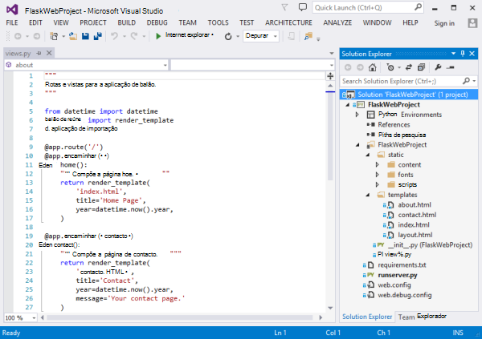
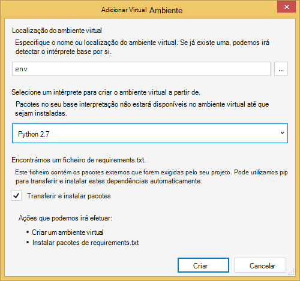
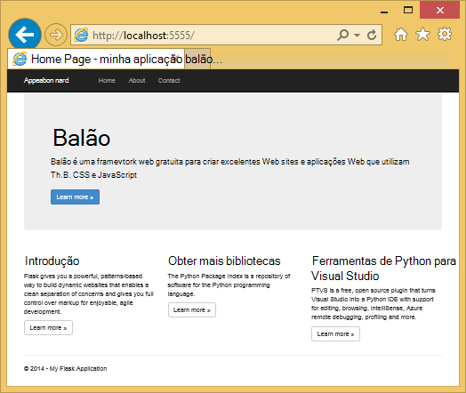
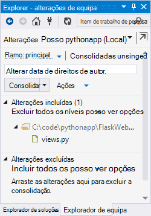
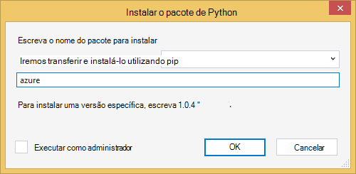
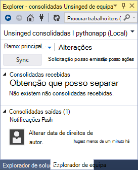
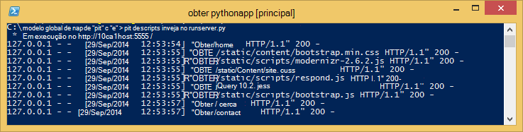
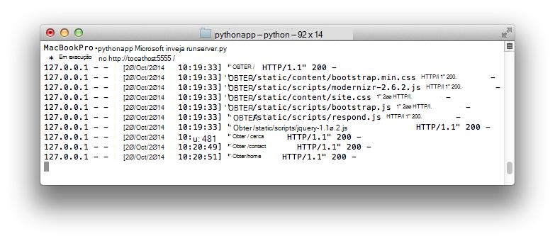
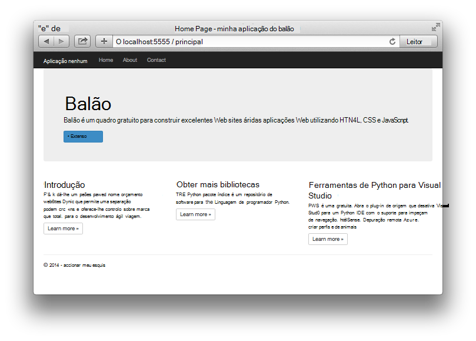

<properties 
    pageTitle="Criar aplicações web com balão no Azure" 
    description="Tutorial que lhe apresenta em execução uma aplicação web do Python no Azure." 
    services="app-service\web" 
    documentationCenter="python"
    tags="python"
    authors="huguesv" 
    manager="wpickett" 
    editor=""/>

<tags 
    ms.service="app-service-web" 
    ms.workload="web" 
    ms.tgt_pltfrm="na" 
    ms.devlang="python" 
    ms.topic="article" 
    ms.date="02/20/2016"
    ms.author="huvalo"/>

# Criar aplicações web com balão no Azure

Neste tutorial descreve como começar a ser executado Python no [Azure aplicação de serviço Web Apps](http://go.microsoft.com/fwlink/?LinkId=529714).  Web Apps fornece alojamento gratuito limitado e de implementação rápida e pode utilizar Python!  À medida que aumenta a sua aplicação, pode mudar para o alojamento paga e também pode integrar com todos os outros serviços do Azure.

Irá criar uma aplicação utilizando a arquitetura de web balão (consulte o artigo alternativos versões deste tutorial para [Django](web-sites-python-create-deploy-django-app.md) e [garrafa](web-sites-python-create-deploy-bottle-app.md)).  Irá criar o Web site a partir da Galeria Azure, configurar a implementação de Git e clonar do repositório localmente.  Em seguida, será executar a aplicação localmente, efetuar alterações, consolide e transmiti-los para Azure.  O tutorial mostra como fazê-lo a partir do Windows ou Mac/Linux.

[AZURE.INCLUDE [create-account-and-websites-note](../../includes/create-account-and-websites-note.md)]

>[AZURE.NOTE] Se pretender começar a aplicação de serviço de Azure antes de inscrever-se para uma conta do Azure, aceda ao [Tentar aplicação de serviço](http://go.microsoft.com/fwlink/?LinkId=523751), onde imediatamente pode criar uma aplicação web do starter curto na aplicação de serviço. Sem cartões de crédito necessários; sem compromissos.

## Pré-requisitos

- Windows, Mac ou Linux
- Python 2.7 ou 3.4.
- setuptools pip, virtualenv (apenas no Python 2.7)
- Git
- [Ferramentas de Python para Visual Studio][] Tenha em atenção (PTVS) -: Isto é opcional

**Nota**: publicação TFS não é atualmente suportada para projetos Python.

### Windows

Se ainda não tiver Python 2.7 ou 3.4 instalado (32 bits), recomendamos que instale [Azure SDK para Python 2.7] ou [Azure SDK para Python 3.4] utilizando Web plataforma Installer.  Isto instala a versão de 32 bits do Python, setuptools, pip, virtualenv, etc (32 bits Python é o que é instalado nos computadores anfitrião Azure).  Em alternativa, pode obter Python do [python.org].

Para Git, recomendamos que [Git para Windows] ou [GitHub para Windows].  Se utilizar o Visual Studio, pode utilizar o suporte técnico da Git integrado.

Recomendamos também instalar [Python ferramentas 2.2 para Visual Studio].  Isto é opcional, mas se tiver o [Visual Studio], incluindo o gratuito Visual Studio Comunidade 2013 ou o Visual Studio 2013 Express para Web, em seguida, isto irá dar-lhe um IDE Python excelente.

### Mac/Linux

Deverá ter Python e Git já instalado, mas certifique-se de que tem Python 2.7 ou 3.4.

## Criar do Web app no Portal do Azure

É o primeiro passo para criar a sua aplicação criar a aplicação web através de do [Portal do Azure](https://portal.azure.com). 

1. Inicie sessão no Portal do Azure e clique no botão **Novo** no canto inferior esquerdo. 
2. Clique em **Web + Mobile**.
3. Na caixa de pesquisa, escreva "python".
4. Nos resultados da pesquisa, selecione **balão**, em seguida, clique em **Criar**.
5. Configure a nova aplicação de balão, tal como criar um novo plano de serviço de aplicação e um novo grupo de recursos para a mesma. Em seguida, clique em **Criar**.
6. Configure a publicação de Git para a sua aplicação web recentemente criado, seguindo as instruções no [Local Git implementação para a aplicação de serviço de Azure](app-service-deploy-local-git.md).

## Descrição geral da aplicação

### Conteúdos do repositório Git

Eis uma descrição geral dos ficheiros que encontrará no repositório Git inicial, que recomendamos irá clonar na secção seguinte.

    \FlaskWebProject\__init__.py
    \FlaskWebProject\views.py
    \FlaskWebProject\static\content\
    \FlaskWebProject\static\fonts\
    \FlaskWebProject\static\scripts\
    \FlaskWebProject\templates\about.html
    \FlaskWebProject\templates\contact.html
    \FlaskWebProject\templates\index.html
    \FlaskWebProject\templates\layout.html

Origens de principais para a aplicação.  É composta por 3 páginas (índice, sobre contacto) com um esquema do modelo global.  Em conteúdo estático e scripts incluem arranque, jquery, modernizr e responder.

    \runserver.py

Suporte de servidor de desenvolvimento local. Utilize esta opção para executar a aplicação localmente.

    \FlaskWebProject.pyproj
    \FlaskWebProject.sln

Ficheiros de projeto para utilização com [As ferramentas Python para Visual Studio].

    \ptvs_virtualenv_proxy.py

Proxy do IIS para ambientes virtuais e PTVS depuração suporte remota.

    \requirements.txt

Pacotes externos necessários por esta aplicação. O script de implementação será pip instalar os pacotes listados neste ficheiro.
 
    \web.2.7.config
    \web.3.4.config

Ficheiros de configuração do IIS.  O script de implementação irá utilizar o web.x.y.config adequado e copiá-lo como Web. config.

### Ficheiros opcionais - implementação de personalização

[AZURE.INCLUDE [web-sites-python-customizing-deployment](../../includes/web-sites-python-customizing-deployment.md)]

### Ficheiros opcionais - Python runtime

[AZURE.INCLUDE [web-sites-python-customizing-runtime](../../includes/web-sites-python-customizing-runtime.md)]

### Ficheiros adicionais no servidor

Alguns ficheiros existem no servidor, mas não são adicionados ao repositório git.  Estes são criados pelo script de implementação.

    \web.config

Ficheiro de configuração do IIS.  Criada a partir web.x.y.config na cada implementação.

    \env\

Ambiente virtual Python.  Criado durante a implementação, se ainda não exista um ambiente virtual compatíveis com a aplicação.  Pacotes listados em requirements.txt são pip instalado, mas pip irá ignorar instalação se os pacotes já estão instalados.

As 3 seguinte secções descrevem como continuar com a programação da aplicações web em ambientes diferentes 3:

- Windows, com as ferramentas Python para Visual Studio
- Windows, com linha de comandos
- Mac/Linux, com linha de comandos

## Programação da aplicações Web Python - Windows - ferramentas para o Visual Studio

### Clonar o repositório

Em primeiro lugar, clonar repositório utilizando o URL fornecido no Portal do Azure. Para mais informações, consulte o artigo [Local Git implementação para a aplicação de serviço de Azure](app-service-deploy-local-git.md).

Abra o ficheiro da solução (.sln) que está incluído na raiz do repositório.

### Criar ambiente virtual

Agora, iremos criar um ambiente virtual para desenvolvimento local.  Botão direito do rato no **Python ambientes** selecionar **Adicionar ambiente Virtual...**.

- Certifique-se é o nome do ambiente de `env`.

- Selecione o intérprete base.  Certifique-se utilizar a mesma versão do Python está selecionada para a sua aplicação web (em runtime.txt ou pá as **Definições da aplicação** da sua aplicação web no Portal do Azure).

- Certifique-se a opção para transferir e instalar pacotes está selecionada.

Clique em **Criar**.  Isto irá criar o ambiente virtual e instalar o dependências listadas na requirements.txt.

### Executar a utilizar o servidor de desenvolvimento

Prima F5 para iniciar a depuração e o seu browser abrirá automaticamente para a página a ser executado localmente.

Pode definir pontos de interrupção nas fontes, utilize o windows de monitorização, etc.  Consulte as [Ferramentas de Python para Visual Studio documentação] para obter mais informações sobre as várias funcionalidades.

### Efetuar alterações

Agora pode experimentar ao efetuar alterações à origens de aplicação e/ou modelos.

Depois de testámos as suas alterações, consolidá-los para o repositório de Git:

### Instalar pacotes mais

A aplicação poderá ter dependências para além dos Python e balão.

Pode instalar pacotes adicionais utilizando pip.  Para instalar um pacote, com o botão direito no ambiente de virtual e selecione **Instalar o pacote de Python**.

Por exemplo, para instalar o SDK do Azure para Python, que dá-lhe acesso, armazenamento Azure, bus de serviço e outros serviços do Azure, introduza `azure`:

Botão direito do rato no ambiente de virtual e selecione **Gerar requirements.txt** para atualizar requirements.txt.

Consolide, em seguida, as alterações requirements.txt para o repositório de Git.

### Implementar Azure

Para acionar uma implementação, clique em **sincronizar** ou **Push**.  A sincronização é que um push e uma solicitação.

A implementação primeira irá demorar algum tempo, tal como irá criar um ambiente virtual, instalar pacotes, etc.

Visual Studio não é apresentado o progresso da implementação.  Se gostaria rever o resultado, consulte a secção sobre [resolução de problemas - implementação](#troubleshooting-deployment).

Navegue para o URL do Azure para ver as suas alterações.

## Linha de comandos de desenvolvimento - Windows - do Web app

### Clonar o repositório

Em primeiro lugar, clonar repositório utilizando o URL fornecido no Portal do Azure e adicionar o repositório Azure como um controlo remoto. Para mais informações, consulte o artigo [Local Git implementação para a aplicação de serviço de Azure](app-service-deploy-local-git.md).

    git clone <repo-url>
    cd <repo-folder>
    git remote add azure <repo-url> 

### Criar ambiente virtual

Vamos criar um novo ambiente virtual para fins de desenvolvimento (não adicioná-lo para o repositório).  Ambientes virtuais no Python não são relocalizável, portanto, cada programador trabalhar na aplicação irá criar os seus próprios localmente.

Certifique-se utilizar a mesma versão do Python está selecionada para a sua aplicação web (em runtime.txt ou pá as **Definições da aplicação** da sua aplicação web no Portal do Azure).

Para Python 2.7:

    c:\python27\python.exe -m virtualenv env

Para Python 3.4:

    c:\python34\python.exe -m venv env

Instale quaisquer pacotes externos necessários pela aplicação. Pode utilizar o ficheiro requirements.txt na raiz do repositório para instalar os pacotes no seu ambiente virtual:

    env\scripts\pip install -r requirements.txt

### Executar a utilizar o servidor de desenvolvimento

Pode iniciar a aplicação num servidor de desenvolvimento com o seguinte comando:

    env\scripts\python runserver.py

A consola irá apresentar o URL e recebe porta do servidor:

Em seguida, abra o seu browser para esse URL.

### Efetuar alterações

Agora pode experimentar ao efetuar alterações à origens de aplicação e/ou modelos.

Depois de testámos as suas alterações, consolidá-los para o repositório de Git:

    git add <modified-file>
    git commit -m "<commit-comment>"

### Instalar pacotes mais

A aplicação poderá ter dependências para além dos Python e balão.

Pode instalar pacotes adicionais utilizando pip.  Por exemplo, para instalar o SDK do Azure para Python, que dá-lhe acesso, armazenamento Azure, bus de serviço e outros serviços do Azure, escreva:

    env\scripts\pip install azure

Certifique-se atualizar requirements.txt:

    env\scripts\pip freeze > requirements.txt

Consolide as alterações:

    git add requirements.txt
    git commit -m "Added azure package"

### Implementar Azure

Para acionar uma implementação, transmitir as alterações para Azure:

    git push azure master

Irá ver o resultado de script de implementação, incluindo ambiente virtual criação, instalação de pacotes, criação de Web. config.

Navegue para o URL do Azure para ver as suas alterações.

## Linha de comandos de desenvolvimento Mac/Linux - do Web app

### Clonar o repositório

Em primeiro lugar, clonar repositório utilizando o URL fornecido no Portal do Azure e adicionar o repositório Azure como um controlo remoto. Para mais informações, consulte o artigo [Local Git implementação para a aplicação de serviço de Azure](app-service-deploy-local-git.md).

    git clone <repo-url>
    cd <repo-folder>
    git remote add azure <repo-url> 

### Criar ambiente virtual

Vamos criar um novo ambiente virtual para fins de desenvolvimento (não adicioná-lo para o repositório).  Ambientes virtuais no Python não são relocalizável, portanto, cada programador trabalhar na aplicação irá criar os seus próprios localmente.

Certifique-se utilizar a mesma versão do Python está selecionada para a sua aplicação web (em runtime.txt ou pá as **Definições da aplicação** da sua aplicação web no Portal do Azure).

Para Python 2.7:

    python -m virtualenv env

Para Python 3.4:

    python -m venv env
ou pyvenv envelope

Instale quaisquer pacotes externos necessários pela aplicação. Pode utilizar o ficheiro requirements.txt na raiz do repositório para instalar os pacotes no seu ambiente virtual:

    env/bin/pip install -r requirements.txt

### Executar a utilizar o servidor de desenvolvimento

Pode iniciar a aplicação num servidor de desenvolvimento com o seguinte comando:

    env/bin/python runserver.py

A consola irá apresentar o URL e recebe porta do servidor:

Em seguida, abra o seu browser para esse URL.

### Efetuar alterações

Agora pode experimentar ao efetuar alterações à origens de aplicação e/ou modelos.

Depois de testámos as suas alterações, consolidá-los para o repositório de Git:

    git add <modified-file>
    git commit -m "<commit-comment>"

### Instalar pacotes mais

A aplicação poderá ter dependências para além dos Python e balão.

Pode instalar pacotes adicionais utilizando pip.  Por exemplo, para instalar o SDK do Azure para Python, que dá-lhe acesso, armazenamento Azure, bus de serviço e outros serviços do Azure, escreva:

    env/bin/pip install azure

Certifique-se atualizar requirements.txt:

    env/bin/pip freeze > requirements.txt

Consolide as alterações:

    git add requirements.txt
    git commit -m "Added azure package"

### Implementar Azure

Para acionar uma implementação, transmitir as alterações para Azure:

    git push azure master

Irá ver o resultado de script de implementação, incluindo ambiente virtual criação, instalação de pacotes, criação de Web. config.

Navegue para o URL do Azure para ver as suas alterações.

## Resolução de problemas - instalação do pacote

[AZURE.INCLUDE [web-sites-python-troubleshooting-package-installation](../../includes/web-sites-python-troubleshooting-package-installation.md)]

## Resolução de problemas - ambiente Virtual

[AZURE.INCLUDE [web-sites-python-troubleshooting-virtual-environment](../../includes/web-sites-python-troubleshooting-virtual-environment.md)]

## Próximos passos

Siga estas ligações para mais informações sobre balão e Python ferramentas para o Visual Studio: 
 
- [Balão de documentação]
- [Ferramentas de Python para documentação Visual Studio]

Para obter informações sobre a utilização do armazenamento de tabela do Azure e MongoDB:

- [Balão e MongoDB no Azure com as ferramentas Python para Visual Studio]
- [Balão e armazenamento de tabela do Azure no Azure com as ferramentas Python para Visual Studio]

Para obter mais informações, consulte também o [Centro de programadores do Python](/develop/python/).

## O que é alterado
* Para um guia para a alteração de Web sites para a aplicação de serviço Consulte o artigo: [aplicação de serviço de Azure e respectivo impacto na existente dos serviços do Azure](http://go.microsoft.com/fwlink/?LinkId=529714)

<!--Link references-->
[Balão e MongoDB no Azure com as ferramentas Python para Visual Studio]: https://github.com/microsoft/ptvs/wiki/Flask-and-MongoDB-on-Azure
[Balão e armazenamento de tabela do Azure no Azure com as ferramentas Python para Visual Studio]: web-sites-python-ptvs-flask-table-storage.md

<!--External Link references-->
[Azure SDK para Python 2.7]: http://go.microsoft.com/fwlink/?linkid=254281
[Azure SDK para Python 3.4.]: http://go.microsoft.com/fwlink/?linkid=516990
[Python.org]: http://www.python.org/
[Git para Windows]: http://msysgit.github.io/
[GitHub para Windows]: https://windows.github.com/
[Ferramentas de Python para Visual Studio]: http://aka.ms/ptvs
[Python ferramentas 2.2 para Visual Studio]: http://go.microsoft.com/fwlink/?LinkID=624025
[Visual Studio]: http://www.visualstudio.com/
[Ferramentas de Python para documentação Visual Studio]: http://aka.ms/ptvsdocs
[Balão de documentação]: http://flask.pocoo.org/ 
 
