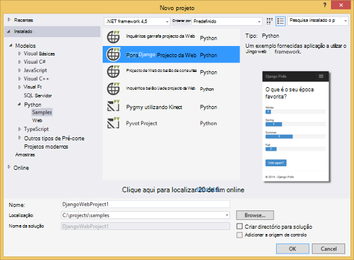
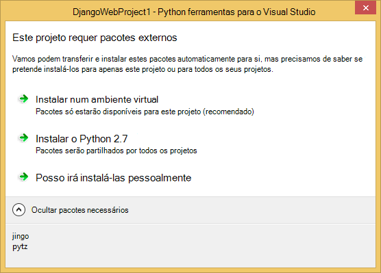
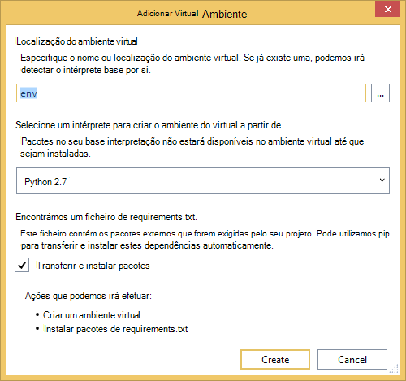
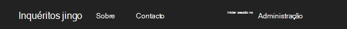
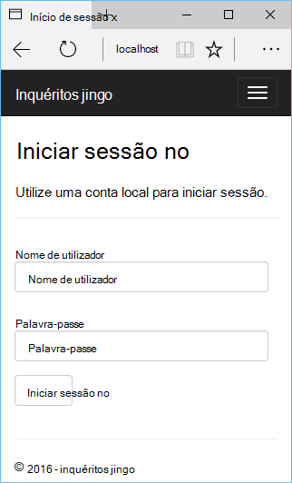
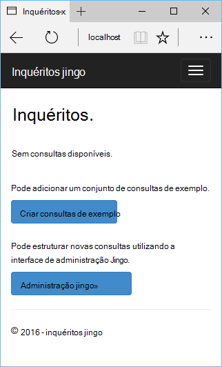
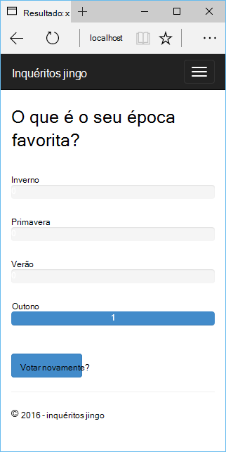
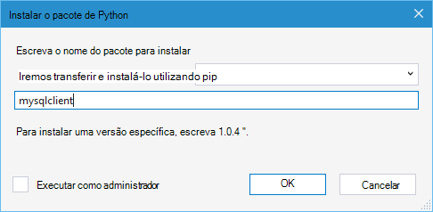
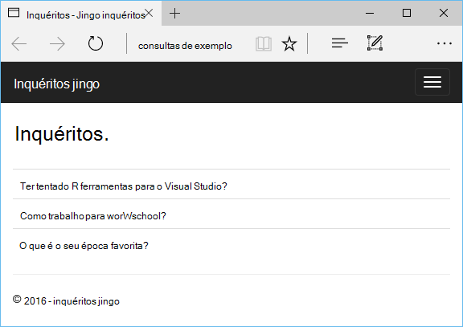

<properties 
    pageTitle="Django e MySQL no Azure com ferramentas de Python 2.2 para Visual Studio" 
    description="Saiba como utilizar as ferramentas de Python para Visual Studio para criar uma aplicação web Django que armazena os dados numa instância de base de dados do MySQL e implemente-o Azure aplicação de serviço Web Apps." 
    services="app-service\web" 
    documentationCenter="python" 
    authors="huguesv" 
    manager="wpickett" 
    editor=""/>

<tags 
    ms.service="app-service-web" 
    ms.workload="web" 
    ms.tgt_pltfrm="na" 
    ms.devlang="python"
    ms.topic="get-started-article" 
    ms.date="07/07/2016"
    ms.author="huvalo"/>

# Django e MySQL no Azure com ferramentas de Python 2.2 para Visual Studio 

[AZURE.INCLUDE [tabs](../../includes/app-service-web-get-started-nav-tabs.md)]

Neste tutorial, irá utilizar [Ferramentas de Python para Visual Studio] (PTVS) para criar uma aplicação web de consultas simples utilizando um dos modelos de exemplo PTVS. Irá obter informações sobre como utilizar um serviço de MySQL alojado no Azure, como configurar a aplicação web para utilizar MySQL e como publicar a aplicação web [Azure aplicação de serviço Web Apps](http://go.microsoft.com/fwlink/?LinkId=529714).

> [AZURE.NOTE] As informações contidas neste tutorial também estão disponíveis no vídeo seguinte:
> 
> [PTVS 2.1: Aplicação de Django com MySQL][video]

Consulte o [Centro de programadores do Python] para obter mais artigos que abrangem desenvolvimento do Azure aplicação de serviço Web Apps com PTVS utilizar quadros web garrafa, balão e Django, com os serviços de armazenamento de tabela do Windows Azure, MySQL e base de dados SQL. Enquanto este artigo foca-se a aplicação de serviço, os passos são semelhantes quando desenvolver [Serviços em nuvem Azure].

## Pré-requisitos

 - Visual Studio 2015
 - [Python 2.7 32 bits] ou [Python 3.4 32 bits]
 - [Python ferramentas 2.2 para Visual Studio]
 - [Python ferramentas 2.2 para Visual Studio amostras VSIX]
 - [Ferramentas Azure SDK para VS 2015]
 - Django 1,9 ou posterior

[AZURE.INCLUDE [create-account-and-websites-note](../../includes/create-account-and-websites-note.md)]

<!-- This note should not render as part of the the previous include. -->

> [AZURE.NOTE] Se pretender começar a aplicação de serviço de Azure antes de inscrever-se para uma conta do Azure, aceda ao [Tentar aplicação de serviço](http://go.microsoft.com/fwlink/?LinkId=523751), onde imediatamente pode criar uma aplicação web do starter curto na aplicação de serviço. Não é necessária nenhuma cartão de crédito e, sem compromissos que sejam necessários.

## Criar o projecto

Nesta secção, crie um projeto do Visual Studio através de um modelo de exemplo. Irá criar um ambiente virtual e instalar pacotes necessários. Crie uma base de dados local utilizando sqlite. Em seguida, vai executar a aplicação localmente.

1. No Visual Studio, selecione o **ficheiro**, **Novo projeto**.

1. Os modelos do project a partir do [Python ferramentas 2.2 para Visual Studio amostras VSIX] estão disponíveis em **Python**, **amostras**. Selecione **Inquéritos Django Web projeto** e clique em OK para criar o projeto.

    

1. Vai ser-lhe instalar pacotes externos. Selecione **instalar para um ambiente virtual**.

    

1. Selecione **Python 2.7** ou **Python 3.4** como o intérprete base.

    

1. No **Explorador de soluções**, com o botão direito no nó do projeto e selecione **Python**e, em seguida, selecione **Django migrar**.  Em seguida, selecione **Super Django criar utilizador**.

1. Isto irá abrir uma consola de gestão de Django e crie uma base de dados sqlite na pasta do projecto. Siga os pedidos para criar um utilizador.

1. Confirme que a aplicação funciona ao premir `F5`.

1. Clique em **Iniciar sessão** a partir da barra de navegação na parte superior.

    

1. Introduza as credenciais para o utilizador que criou quando a sincronização da base de dados.

    

1. Clique em **criar consultas de exemplo**.

    

1. Clique num inquérito e votar.

    

## Criar uma base de dados do MySQL

Para a base de dados, crie uma base de dados alojada do ClearDB MySQL no Azure.

Como alternativa, pode criar o seu próprio Máquina Virtual em execução no Azure, em seguida, instalar e administrar MySQL si mesmo.

Pode criar uma base de dados com um plano gratuito seguindo estes passos.

1. Inicie a sessão [Portal do Azure].

1. Na parte superior do painel de navegação, clique em **Novo**, em seguida, clique em **dados + armazenamento**e, em seguida, clique em **Base de dados do MySQL**. 

1. Configurar a nova base de dados do MySQL ao criar um novo grupo de recursos e selecione o local adequado para a mesma.

1. Quando a base de dados do MySQL estiver criado, clique em **Propriedades** no pá a base de dados.

1. Utilize o botão Copiar para a colocar o valor de **Cadeia de ligação** na área de transferência.

## Configurar o projecto

Nesta secção, irá configurar os nossos web app para a base de dados do MySQL que acabou de criar. Também irá instalar pacotes Python adicionais necessários para utilizar bases de dados do MySQL com Django. Em seguida, vai executar a aplicação web localmente.

1. No Visual Studio, abra **settings.py**, a partir da pasta de *Nomeprojeto* . Cole temporariamente a cadeia de ligação no editor. A cadeia de ligação é neste formato:

        Database=<NAME>;Data Source=<HOST>;User Id=<USER>;Password=<PASSWORD>

    Alterar a base de dados predefinido **motor** utilizar MySQL e defina os valores para o **nome**, **utilizador**, **palavra-passe** e **anfitrião** do **CONNECTIONSTRING**.

        DATABASES = {
            'default': {
                'ENGINE': 'django.db.backends.mysql',
                'NAME': '<Database>',
                'USER': '<User Id>',
                'PASSWORD': '<Password>',
                'HOST': '<Data Source>',
                'PORT': '',
            }
        }

1. No Explorador de solução, em **Ambientes Python**, com o botão direito no ambiente de virtual e selecione **Instalar o pacote de Python**.

1. Instale o pacote `mysqlclient` utilizando **pip**.

    

1. No **Explorador de soluções**, com o botão direito no nó do projeto e selecione **Python**e, em seguida, selecione **Django migrar**.  Em seguida, selecione **Super Django criar utilizador**.

    Isto irá criar as tabelas para a base de dados do MySQL que criou na secção anterior. Siga os pedidos para criar um utilizador, que não tem de corresponder ao utilizador da base de dados sqlite criado na primeira secção deste artigo.

1. Executar a aplicação com `F5`. Consultas que são criadas com **Criar inquéritos de exemplo** e os dados apresentados pela voto serão dispostos em série na base de dados MySQL.

## Publicar a aplicação web para a aplicação de serviço do Azure

O Azure .NET SDK fornece uma forma fácil de implementar a aplicação web do serviço de aplicação do Azure.

1. No **Explorador de soluções**, com o botão direito no nó do projeto e selecione **Publicar**.

    

1. Clique na **Aplicação de serviço do Microsoft Azure**.

1. Clique em **Novo** para criar uma nova aplicação web.

1. Preencha os campos seguintes e clique em **Criar**:
    - **Nome da aplicação Web**
    - **Plano de serviço de aplicação**
    - **Grupo de recursos**
    - **Região**
    - Deixe **o servidor de base de dados** definido para **sem base de dados**

1. Aceitar todas as outras predefinições e clique em **Publicar**.

1. Browser da web irá abrir automaticamente a aplicação web publicada. Deverá visualizar a aplicação web a funcionar como esperado, utilizar a base de dados do **MySQL** alojado no Azure.

    

    Parabéns! Foram publicados com êxito a sua aplicação web baseada em MySQL para Azure.

## Próximos passos

Siga estas ligações para saber mais sobre as ferramentas de Python para Visual Studio, Django e MySQL.

- [Ferramentas de Python para documentação Visual Studio]
  - [Projectos Web]
  - [Projetos de serviço de nuvem]
  - [Depuração remota no Microsoft Azure]
- [Documentação Django]
- [MySQL]

Para mais informações, consulte o [Centro de programadores do Python](/develop/python/).

<!--Link references-->

[Centro de programadores do Python]: /develop/python/
[Serviços em nuvem Azure]: ../cloud-services-python-ptvs.md

<!--External Link references-->

[Portal do Azure]: https://portal.azure.com
[Ferramentas de Python para Visual Studio]: http://aka.ms/ptvs
[Python ferramentas 2.2 para Visual Studio]: http://go.microsoft.com/fwlink/?LinkID=624025
[Python ferramentas 2.2 para Visual Studio amostras VSIX]: http://go.microsoft.com/fwlink/?LinkID=624025
[Ferramentas Azure SDK para VS 2015]: http://go.microsoft.com/fwlink/?LinkId=518003
[Python 2.7 32 bits]: http://go.microsoft.com/fwlink/?LinkId=517190 
[Python 3.4 32 bits]: http://go.microsoft.com/fwlink/?LinkId=517191
[Ferramentas de Python para documentação Visual Studio]: http://aka.ms/ptvsdocs
[Depuração remota no Microsoft Azure]: http://go.microsoft.com/fwlink/?LinkId=624026
[Projectos Web]: http://go.microsoft.com/fwlink/?LinkId=624027
[Projetos de serviço de nuvem]: http://go.microsoft.com/fwlink/?LinkId=624028
[Documentação Django]: https://www.djangoproject.com/
[MySQL]: http://www.mysql.com/
[video]: http://youtu.be/oKCApIrS0Lo
