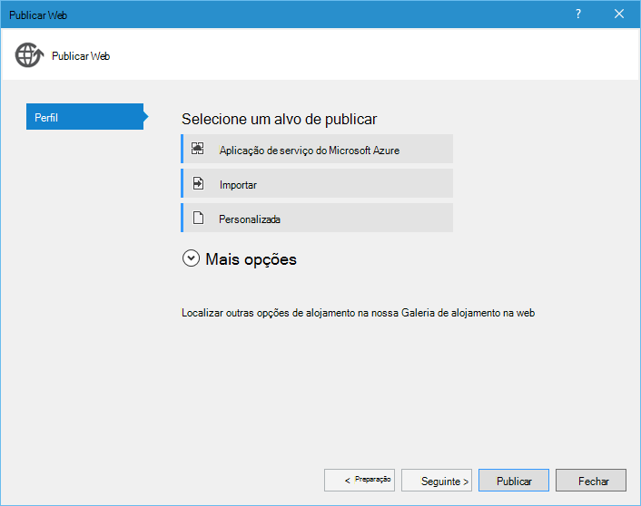

<properties 
    pageTitle="Django e base de dados do SQL no Azure com ferramentas de Python 2.2 para Visual Studio" 
    description="Saiba como utilizar as ferramentas de Python para Visual Studio para criar uma aplicação web Django que armazena os dados numa instância de base de dados SQL e implemente-o Azure aplicação de serviço Web Apps." 
    services="app-service\web" 
    tags="python"
    documentationCenter="python" 
    authors="huguesv" 
    manager="wpickett" 
    editor=""/>

<tags 
    ms.service="app-service-web" 
    ms.workload="web" 
    ms.tgt_pltfrm="na" 
    ms.devlang="python" 
    ms.topic="article" 
    ms.date="07/07/2016"
    ms.author="huguesv"/>

# Django e base de dados do SQL no Azure com ferramentas de Python 2.2 para Visual Studio 

Neste tutorial, vamos utilizar [Ferramentas de Python para Visual Studio] para criar uma aplicação web de consultas simples utilizando um dos modelos de exemplo PTVS. Neste tutorial também está disponível como um [vídeo](https://www.youtube.com/watch?v=ZwcoGcIeHF4).

Vamos aprender como utilizar uma base de dados do SQL alojado no Azure, como configurar a aplicação web para utilizar uma base de dados do SQL e como publicar a aplicação web [Azure aplicação de serviço Web Apps](http://go.microsoft.com/fwlink/?LinkId=529714).

Consulte o [Centro de programadores do Python] para obter mais artigos que abrangem desenvolvimento do Azure aplicação de serviço Web Apps com PTVS utilizar quadros web garrafa, balão e Django, com os serviços de armazenamento de tabela do Windows Azure, MySQL e base de dados SQL. Enquanto este artigo foca-se a aplicação de serviço, os passos são semelhantes quando desenvolver [Serviços em nuvem Azure].

## Pré-requisitos

 - Visual Studio 2015
 - [Python 2.7 32 bits]
 - [Python ferramentas 2.2 para Visual Studio]
 - [Python ferramentas 2.2 para Visual Studio amostras VSIX]
 - [Ferramentas Azure SDK para VS 2015]
 - Django 1,9 ou posterior

[AZURE.INCLUDE [create-account-and-websites-note](../../includes/create-account-and-websites-note.md)]

>[AZURE.NOTE] Se pretender começar a aplicação de serviço de Azure antes de inscrever-se para uma conta do Azure, aceda ao [Tentar aplicação de serviço](http://go.microsoft.com/fwlink/?LinkId=523751), onde imediatamente pode criar uma aplicação web do starter curto na aplicação de serviço. Sem cartões de crédito necessários; sem compromissos.

## Criar o projecto

Nesta secção, vamos criar um projeto do Visual Studio através de um modelo de exemplo. Vamos criar um ambiente virtual e instalar pacotes necessários. Vamos criar uma base de dados local utilizando sqlite. Em seguida, podemos vai executar a aplicação web localmente.

1.  No Visual Studio, selecione o **ficheiro**, **Novo projeto**.

1.  Os modelos do project a partir do [Python ferramentas 2.2 para Visual Studio amostras VSIX] estão disponíveis em **Python**, **amostras**. Selecione **Inquéritos Django Web projeto** e clique em OK para criar o projeto.

    

1.  Vai ser-lhe instalar pacotes externos. Selecione **instalar para um ambiente virtual**.

    

1.  Selecione **Python 2.7** como o intérprete base.

    

1.  No **Explorador de soluções**, com o botão direito no nó do projeto e selecione **Python**e, em seguida, selecione **Django migrar**.  Em seguida, selecione **Super Django criar utilizador**.

1.  Isto irá abrir uma consola de gestão de Django e crie uma base de dados sqlite na pasta do projecto. Siga os pedidos para criar um utilizador.

1.  Confirme que a aplicação funciona premindo a tecla <kbd>F5</kbd>.

1.  Clique em **Iniciar sessão** a partir da barra de navegação na parte superior.

    

1.  Introduza as credenciais para o utilizador que criou quando a sincronização da base de dados.

    

1.  Clique em **criar consultas de exemplo**.

    

1.  Clique num inquérito e votar.

    

## Criar uma base de dados SQL

Para a base de dados, vamos criar uma base de dados do Azure SQL.

Pode criar uma base de dados ao seguir estes passos.

1.  Iniciar sessão no [Portal do Azure].

1.  Na parte inferior do painel de navegação, clique em **Novo**. , clique em **dados + armazenamento** > **Base de dados SQL**.

1.  Configurar a nova base de dados do SQL ao criar um novo grupo de recursos e selecione o local adequado para a mesma.

1.  Quando a base de dados do SQL estiver criado, clique em **Abrir no Visual Studio** pá a base de dados.
2.  Clique em **Configurar a firewall**.
3.  Na pá **As definições da Firewall** , adicione que uma regra de firewall com **IP inicial** e **Final IP** definido para o endereço IP público da sua máquina de desenvolvimento. Clique em **Guardar**.

    Isto irá permitir ligações para o servidor de base de dados a partir do seu computador de desenvolvimento.

4.  Novamente na pá da base de dados, clique em **Propriedades**, em seguida, clique em **Mostrar cadeias de texto de ligação de base de dados**. 

2.  Utilize o botão Copiar para a colocar o valor de **ADO.NET** na área de transferência.

## Configurar o projecto

Nesta secção, irá configurar os nossos web app para a base de dados do SQL que acabou de criar. Recomendamos também irá instalar pacotes Python adicionais necessários para utilizar bases de dados SQL com Django. Em seguida, podemos vai executar a aplicação web localmente.

1.  No Visual Studio, abra **settings.py**, a partir da pasta de *Nomeprojeto* . Cole temporariamente a cadeia de ligação no editor. A cadeia de ligação é neste formato:

        Server=<ServerName>,<ServerPort>;Database=<DatabaseName>;User ID=<UserName>;Password={your_password_here};Encrypt=True;TrustServerCertificate=False;Connection Timeout=30;

Editar a definição de `DATABASES` para utilizar os valores acima.

        DATABASES = {
            'default': {
                'ENGINE': 'sql_server.pyodbc',
                'NAME': '<DatabaseName>',
                'USER': '<UserName>',
                'PASSWORD': '{your_password_here}',
                'HOST': '<ServerName>',
                'PORT': '<ServerPort>',
                'OPTIONS': {
                    'driver': 'SQL Server Native Client 11.0',
                    'MARS_Connection': 'True',
                }
            }
        }

1.  No Explorador de solução, em **Ambientes Python**, com o botão direito no ambiente de virtual e selecione **Instalar o pacote de Python**.

1.  Instale o pacote `pyodbc` utilizando **pip**.

    

1.  Instale o pacote `django-pyodbc-azure` utilizando **pip**.

    

1.  No **Explorador de soluções**, com o botão direito no nó do projeto e selecione **Python**e, em seguida, selecione **Django migrar**.  Em seguida, selecione **Super Django criar utilizador**.

    Isto irá criar as tabelas para a base de dados do SQL que criámos na secção anterior. Siga os pedidos para criar um utilizador, que não tem de corresponder ao utilizador da base de dados sqlite criado na primeira secção.

1.  Executar a aplicação com `F5`. Consultas que são criadas com **Criar inquéritos de exemplo** e os dados apresentados pela voto serão dispostos em série na base de dados SQL.

## Publicar a aplicação web para a aplicação de serviço do Azure

O Azure .NET SDK fornece uma forma fácil de implementar a aplicação web do web ao Azure aplicação de serviço Web Apps.

1.  No **Explorador de soluções**, com o botão direito no nó do projeto e selecione **Publicar**.

    

1.  Clique em **aplicações Web do Microsoft Azure**.

1.  Clique em **Novo** para criar uma nova aplicação web.

1.  Preencha os campos seguintes e clique em **Criar**.
    -   **Nome da aplicação Web**
    -   **Plano de serviço de aplicação**
    -   **Grupo de recursos**
    -   **Região**
    -   Deixe **o servidor de base de dados** definido para **sem base de dados**

1.  Aceitar todas as outras predefinições e clique em **Publicar**.

1.  Browser da web irá abrir automaticamente a aplicação web publicada. Deverá ver o web app funcionam como esperado, utilizar a base de dados do **SQL** alojado no Azure.

    Parabéns!

    

## Próximos passos

Siga estas ligações para saber mais sobre as ferramentas de Python para Visual Studio, Django e base de dados SQL.

- [Ferramentas de Python para documentação Visual Studio]
  - [Projectos Web]
  - [Projetos de serviço de nuvem]
  - [Depuração remota no Microsoft Azure]
- [Documentação Django]
- [Base de dados SQL]

## O que é alterado
* Para um guia para a alteração de Web sites para a aplicação de serviço Consulte o artigo: [aplicação de serviço de Azure e respectivo impacto na existente dos serviços do Azure](http://go.microsoft.com/fwlink/?LinkId=529714)

<!--Link references-->
[Centro de programadores do Python]: /develop/python/
[Serviços em nuvem Azure]: ../cloud-services-python-ptvs.md

<!--External Link references-->
[Portal do Azure]: https://portal.azure.com
[Ferramentas de Python para Visual Studio]: http://aka.ms/ptvs
[Python ferramentas 2.2 para Visual Studio]: http://go.microsoft.com/fwlink/?LinkID=624025
[Python ferramentas 2.2 para Visual Studio amostras VSIX]: http://go.microsoft.com/fwlink/?LinkID=624025
[Ferramentas Azure SDK para VS 2015]: http://go.microsoft.com/fwlink/?LinkId=518003
[Python 2.7 32 bits]: http://go.microsoft.com/fwlink/?LinkId=517190 
[Ferramentas de Python para documentação Visual Studio]: http://aka.ms/ptvsdocs
[Depuração remota no Microsoft Azure]: http://go.microsoft.com/fwlink/?LinkId=624026
[Projectos Web]: http://go.microsoft.com/fwlink/?LinkId=624027
[Projetos de serviço de nuvem]: http://go.microsoft.com/fwlink/?LinkId=624028
[Documentação Django]: https://www.djangoproject.com/
[Base de dados SQL]: /documentation/services/sql-database/
