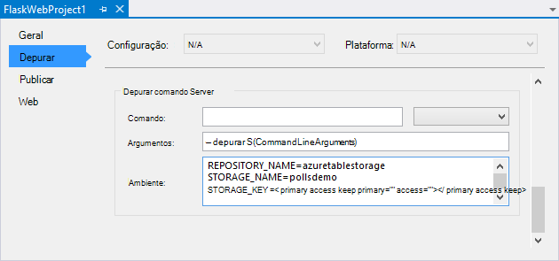

<properties 
    pageTitle="Balão e armazenamento de tabela do Azure no Azure com ferramentas de Python 2.2 para Visual Studio" 
    description="Saiba como utilizar as ferramentas de Python para Visual Studio para criar uma aplicação web balão que armazena dados em armazenamento de tabela do Azure e implemente-o Azure aplicação de serviço Web Apps." 
    services="app-service\web"
    tags="python"
    documentationCenter="python" 
    authors="huguesv" 
    manager="wpickett" 
    editor=""/>

<tags 
    ms.service="app-service-web" 
    ms.workload="web" 
    ms.tgt_pltfrm="na" 
    ms.devlang="python" 
    ms.topic="article" 
    ms.date="07/07/2016"
    ms.author="huvalo"/>

# Balão e armazenamento de tabela do Azure no Azure com ferramentas de Python 2.2 para Visual Studio 

Neste tutorial, vamos utilizar [Ferramentas de Python para Visual Studio] para criar uma aplicação web de consultas simples utilizando um dos modelos de exemplo PTVS. Neste tutorial também está disponível como um [vídeo](https://www.youtube.com/watch?v=qUtZWtPwbTk).

A aplicação web do inquéritos define uma abstracção para o repositório de, para que possa alternar facilmente entre diferentes tipos de repositórios (na memória, armazenamento de tabela do Azure, MongoDB).

Vamos aprender como criar uma conta de armazenamento do Windows Azure, como configurar a aplicação web para utilizar o armazenamento de tabela do Azure e como publicar a aplicação web [Azure aplicação de serviço Web Apps](http://go.microsoft.com/fwlink/?LinkId=529714).

Consulte o [Centro de programadores do Python] para obter mais artigos que abrangem desenvolvimento do Azure aplicação de serviço Web Apps com PTVS utilizar quadros web garrafa, balão e Django, com os serviços de MongoDB, armazenamento de tabela do Windows Azure, MySQL e base de dados SQL. Enquanto este artigo foca-se a aplicação de serviço, os passos são semelhantes quando desenvolver [Serviços em nuvem Azure].

## Pré-requisitos

 - Visual Studio 2015
 - [Python ferramentas 2.2 para Visual Studio]
 - [Python ferramentas 2.2 para Visual Studio amostras VSIX]
 - [Ferramentas Azure SDK para VS 2015]
 - [Python 2.7 32 bits] ou [Python 3.4 32 bits]

[AZURE.INCLUDE [create-account-and-websites-note](../../includes/create-account-and-websites-note.md)]

>[AZURE.NOTE] Se pretender começar a aplicação de serviço de Azure antes de inscrever-se para uma conta do Azure, aceda ao [Tentar aplicação de serviço](http://go.microsoft.com/fwlink/?LinkId=523751), onde imediatamente pode criar uma aplicação web do starter curto na aplicação de serviço. Sem cartões de crédito necessários; sem compromissos.

## Criar o projecto

Nesta secção, vamos criar um projeto do Visual Studio através de um modelo de exemplo. Vamos criar um ambiente virtual e instalar pacotes necessários. Em seguida, podemos vai executar a aplicação localmente utilizando o repositório de na memória predefinido.

1.  No Visual Studio, selecione o **ficheiro**, **Novo projeto**.

1.  Os modelos do project a partir do [Python ferramentas 2.2 para Visual Studio amostras VSIX] estão disponíveis em **Python**, **amostras**. Selecione **Projeto de Web do balão de inquéritos** e clique em OK para criar o projeto.

    

1.  Vai ser-lhe instalar pacotes externos. Selecione **instalar para um ambiente virtual**.

    

1.  Selecione **Python 2.7** ou **Python 3.4** como o intérprete base.

    

1.  Confirme que a aplicação funciona ao premir `F5`. Por predefinição, a aplicação utiliza um repositório de na memória que não necessita de qualquer configuração. Todos os dados são perdidas quando o servidor web seja parado.

1.  Clique em **Criar inquéritos do exemplo**, em seguida, clique num inquérito e voto.

    

## Criar uma conta de armazenamento Azure

Para utilizar operações de armazenamento, tem uma conta de armazenamento Azure. Pode criar uma conta de armazenamento ao seguir estes passos.

1.  Iniciar sessão no [Portal do Azure](https://portal.azure.com/).

2. Clique no ícone de **Novo** no canto superior esquerdo do Portal de, em seguida, clique em **dados + armazenamento** > **Conta de armazenamento**. Clique em **Criar**, em seguida, atribua um nome exclusivo à conta de armazenamento e criar um novo [grupo de recursos](../azure-resource-manager/resource-group-overview.md) para a mesma.

    

    Quando a conta de armazenamento ter sido criada, o botão de **notificações** passará a verde **SUCESSO** e pá a conta de armazenamento está aberta para mostrar a que pertence o novo grupo de recursos que criou.

5. Clique na parte de **Teclas de acesso** no pá a conta de armazenamento. Tome nota do nome da conta e o chave1.

    

    Vamos terão estas informações para configurar o seu projeto na secção seguinte.

## Configurar o projecto

Nesta secção, irá configurar nossa aplicação para utilizar a conta de armazenamento que acabou de criar. Vamos ver como obter as definições de ligação a partir do Portal do Azure. Em seguida, podemos vai executar a aplicação localmente.

1.  No Visual Studio, com o botão direito no nó do seu projeto no Explorador de solução e selecione **Propriedades**. Clique no separador **Depurar** .

    

1.  Defina os valores de variáveis de ambiente necessários pela aplicação no **Comando de servidor depurar**, **ambiente**.

        REPOSITORY_NAME=azuretablestorage
        STORAGE_NAME=<storage account name>
        STORAGE_KEY=<primary access key>

    Esta opção permite configurar as variáveis de ambiente quando que **Depuração de iniciar**. Se pretender que as variáveis de ser definido quando que **Iniciar sem depuração**, também os mesmos valores em **Executar o comando de servidor** .

    Em alternativa, pode definir variáveis de ambiente utilizando o painel de controlo do Windows. Este é a melhor opção se pretender Evite armazenar credenciais no código fonte / ficheiro do project. Tenha em atenção que será necessário reiniciar o Visual Studio para os novos valores ambiente ficar disponível para a aplicação.

1.  O código que implementa o repositório de armazenamento de tabela do Windows Azure é no **models/azuretablestorage.py**. Consulte a [documentação] para obter mais informações sobre como utilizar o serviço de tabela do Python.

1.  Executar a aplicação com `F5`. Consultas que são criadas com **Criar inquéritos de exemplo** e os dados apresentados pela voto serão dispostos em série no armazenamento de tabela do Azure.

    > [AZURE.NOTE] O ambiente do virtuais 2.7 Python pode causar uma exceção quebra no Visual Studio.  Prima `F5` para continuar a carregar o projecto da web.

1.  Navegue para a página **sobre** para verificar que a aplicação está a utilizar o repositório de **Armazenamento de tabela do Windows Azure** .

    

## Explorar o armazenamento de tabela do Azure

É fácil ver e editar tabelas de armazenamento através do Explorador da nuvem no Visual Studio. Nesta secção vamos utilizar Server Explorer para ver o conteúdo das tabelas de aplicação de consultas.

> [AZURE.NOTE] Isto requer o Microsoft Azure Tools ser instalado, que estão disponíveis como parte do [Azure SDK para .NET].

1.  Abra o **Explorador de nuvem**. Expanda **As contas de armazenamento**, sua conta de armazenamento, em seguida, **tabelas**.

    

1.  Faça duplo clique na tabela **inquéritos** ou **então escolhas** para ver os conteúdos da tabela numa janela do documento, bem como adicionar/remover/edit entidades.

    

## Publicar a aplicação web para a aplicação de serviço do Azure

O Azure .NET SDK fornece uma forma fácil de implementar a aplicação web do serviço de aplicação do Azure.

1.  No **Explorador de soluções**, com o botão direito no nó do projeto e selecione **Publicar**.

    

1.  Clique em **aplicações Web do Microsoft Azure**.

1.  Clique em **Novo** para criar uma nova aplicação web.

1.  Preencha os campos seguintes e clique em **Criar**.
    -   **Nome da aplicação Web**
    -   **Plano de serviço de aplicação**
    -   **Grupo de recursos**
    -   **Região**
    -   Deixe **o servidor de base de dados** definido para **sem base de dados**

1.  Aceitar todas as outras predefinições e clique em **Publicar**.

1.  Browser da web irá abrir automaticamente a aplicação web publicada. Se, navegar para o sobre a página, verá que utiliza um repositório de **Na memória** , não o repositório de **Armazenamento de tabela do Windows Azure** .

    Se ao facto das variáveis de ambiente não estão definidas na instância do Web Apps no serviço de aplicação do Azure, para que utilize os valores predefinidos especificados na **settings.py**.

## Configurar a instância do Web Apps

Nesta secção, irá configurar variáveis de ambiente para a instância do Web Apps.

1.  No [Portal do Azure](https://portal.azure.com), abra pá a aplicação web ao clicar em **Procurar** > **Serviços de aplicação** > o nome da aplicação web.

1.  No pá da sua aplicação web, clique em **Todas as definições**, em seguida, clique em **Definições da aplicação**.

1.  Desloque-se para baixo até à secção **definições de aplicação** e defina os valores para **REPOSITÓRIO\_nome**, **armazenamento\_nome** e **armazenamento\_chave** conforme descrito na secção **configurar o projecto** acima.

    

1.  Clique em **Guardar**. Depois de recebeu as notificações de que as alterações foram aplicadas, clique no **Procurar** a partir do pá principal de aplicação Web.

1.  Deverá visualizar a aplicação web a funcionar como esperado, utilizando o repositório de **Armazenamento de tabela do Windows Azure** .

    Parabéns!

    

## Próximos passos

Siga estas ligações para saber mais sobre as ferramentas de Python para Visual Studio, balão e armazenamento de tabela do Windows Azure.

- [Ferramentas de Python para documentação Visual Studio]
  - [Projectos Web]
  - [Projetos de serviço de nuvem]
  - [Depuração remota no Microsoft Azure]
- [Balão de documentação]
- [Armazenamento Azure]
- [Azure SDK para Python]
- [Como utilizar o serviço de armazenamento de tabela a partir do Python]

## O que é alterado
* Para um guia para a alteração de Web sites para a aplicação de serviço Consulte o artigo: [aplicação de serviço de Azure e respectivo impacto na existente dos serviços do Azure](http://go.microsoft.com/fwlink/?LinkId=529714)

<!--Link references-->
[Centro de programadores do Python]: /develop/python/
[Serviços em nuvem Azure]: ../cloud-services-python-ptvs.md
[documentação]: ../storage-python-how-to-use-table-storage.md
[Como utilizar o serviço de armazenamento de tabela a partir do Python]: ../storage-python-how-to-use-table-storage.md

<!--External Link references-->
[Azure Portal]: https://portal.azure.com
[Azure SDK para .NET]: http://azure.microsoft.com/downloads/
[Ferramentas de Python para Visual Studio]: http://aka.ms/ptvs
[Python ferramentas 2.2 para Visual Studio]: http://go.microsoft.com/fwlink/?LinkID=624025
[Python ferramentas 2.2 para Visual Studio amostras VSIX]: http://go.microsoft.com/fwlink/?LinkID=624025
[Ferramentas Azure SDK para VS 2015]: http://go.microsoft.com/fwlink/?linkid=518003
[Python 2.7 32 bits]: http://go.microsoft.com/fwlink/?LinkId=517190 
[Python 3.4 32 bits]: http://go.microsoft.com/fwlink/?LinkId=517191
[Ferramentas de Python para documentação Visual Studio]: http://aka.ms/ptvsdocs
[Balão de documentação]: http://flask.pocoo.org/
[Depuração remota no Microsoft Azure]: http://go.microsoft.com/fwlink/?LinkId=624026
[Projectos Web]: http://go.microsoft.com/fwlink/?LinkId=624027
[Projetos de serviço de nuvem]: http://go.microsoft.com/fwlink/?LinkId=624028
[Armazenamento Azure]: http://azure.microsoft.com/documentation/services/storage/
[Azure SDK para Python]: https://github.com/Azure/azure-sdk-for-python
 
