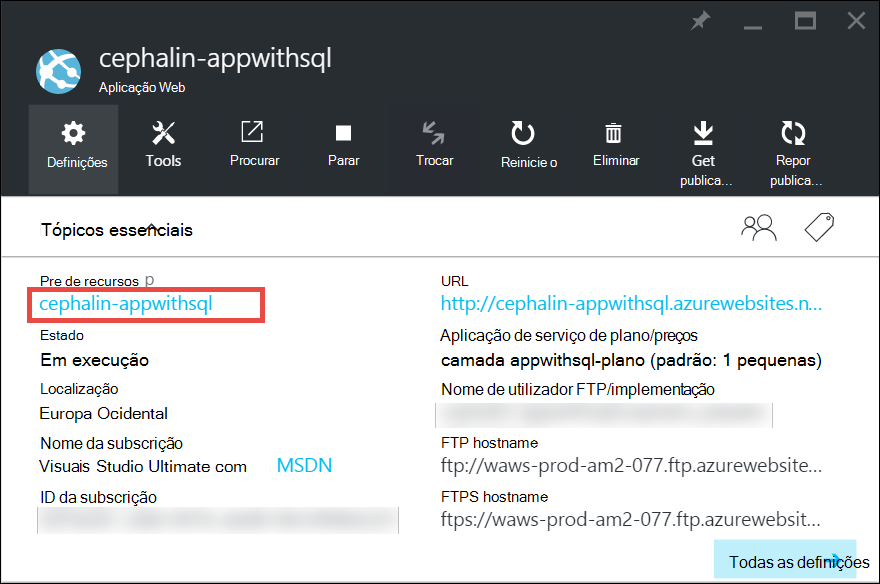
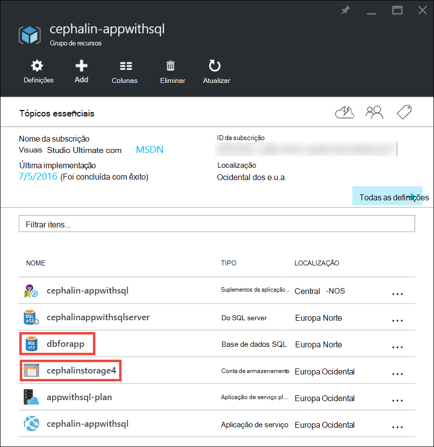
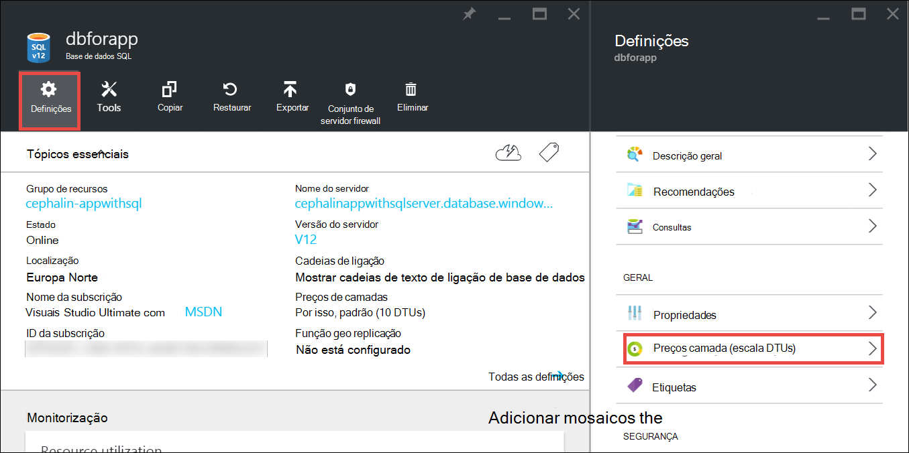
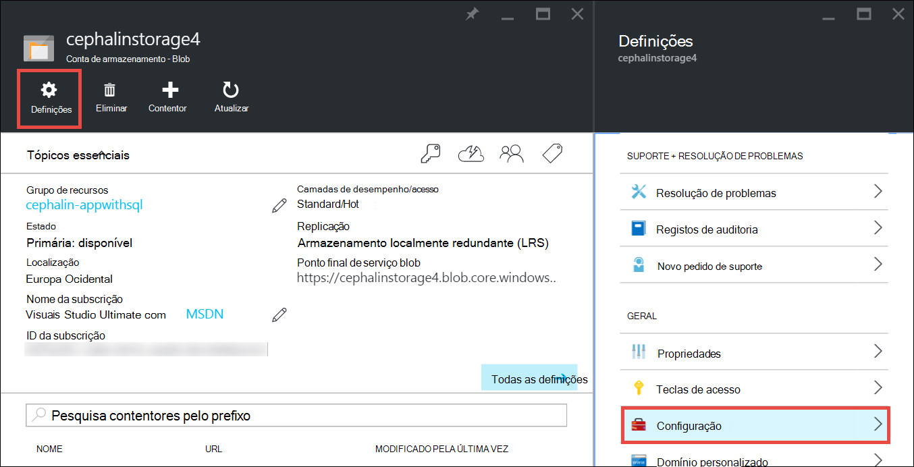

<properties
    pageTitle="Dimensionar para cima de uma aplicação no Azure | Microsoft Azure"
    description="Saiba como escalar para cima uma aplicação do serviço de aplicação do Azure para adicionar capacidade e funcionalidades."
    services="app-service"
    documentationCenter=""
    authors="cephalin"
    manager="wpickett"
    editor="mollybos"/>

<tags
    ms.service="app-service"
    ms.workload="na"
    ms.tgt_pltfrm="na"
    ms.devlang="na"
    ms.topic="article"
    ms.date="07/05/2016"
    ms.author="cephalin"/>

# Dimensionar para cima de uma aplicação no Azure #

Este artigo mostra-lhe como dimensionar a sua aplicação no Azure aplicação de serviço. Existem duas fluxos de trabalho para escala de dimensionamento, para cima e a escala saída e este artigo explica a escala o fluxo de trabalho.

- [Dimensionar](https://en.wikipedia.org/wiki/Scalability#Horizontal_and_vertical_scaling): obter mais CPU, memória, espaço em disco e funcionalidades adicionais, como dedicadas máquinas virtuais (VMs), domínios personalizados e certificados, teste faixas, autoscaling e muito mais. Dimensionar alterando a camada comparar do plano de serviço de aplicação que pertence a aplicação.
- [Escala de saída](https://en.wikipedia.org/wiki/Scalability#Horizontal_and_vertical_scaling): aumentar o número de ocorrências VM que executar a sua aplicação.
É possível dimensionar saída até 20 instâncias, dependendo do seu comparar camada. [Ambientes de serviço de aplicação](../app-service/app-service-app-service-environments-readme.md) na camada **Premium** aumentará ainda mais a contagem de escala-out 50 instâncias. Para mais informações sobre escalar para fora, consulte a [contagem de instâncias de dimensionar automaticamente ou manualmente](../monitoring-and-diagnostics/insights-how-to-scale.md). Não existem irá encontrar informações sobre como utilizar autoscaling, que é Dimensionar automaticamente com base em regras predefinidas e agendas de contagem de instâncias.

As definições de escala demorar apenas alguns segundos para aplicar e afeta todas as aplicações no seu [plano de serviço de aplicação](../app-service/azure-web-sites-web-hosting-plans-in-depth-overview.md).
Não necessitam que alterar o seu código ou implementar novamente a sua aplicação.

Para obter informações sobre os preços e as funcionalidades dos planos de aplicação de serviço individuais, consulte o artigo [Aplicação detalhes do preços de serviço](/pricing/details/web-sites/).  

> [AZURE.NOTE] Antes de mudar de um plano de serviço de aplicação a partir da camada **livre** , tem primeiro de remover [limites de despesas](/pricing/spending-limits/) num local para a sua subscrição Azure. Para ver ou alterar as opções para a sua subscrição do serviço de aplicação do Microsoft Azure, consulte o artigo [Subscrições do Microsoft Azure][azuresubscriptions].

## Dimensionar o seu camada comparar

1. No seu browser, abra o [Azure portal][portal].

2. Na pá da sua aplicação, clique em **todas as definições**e, em seguida, clique em **Escala para cima**.

    ![Navegue para dimensionar o seu app Azure.][ChooseWHP]

4. Selecione a camada e, em seguida, clique em **Selecionar**.

    No separador **notificações** passará a verde **SUCESSO** depois de concluída a operação.

## Dimensionar recursos relacionados
Se a sua aplicação depender de outros serviços, como base de dados do SQL Azure ou armazenamento do Windows Azure, também pode dimensionar o esses recursos com base nas suas necessidades. Estes recursos não estão dimensionados com o plano de serviço de aplicação e com escala separadamente.

1. No **Essentials**, clique na ligação do **grupo de recursos** .

    

2. Na parte **Resumo** da pá **grupo de recursos** , clique num recurso que que quer dimensionar. A captura de ecrã seguinte mostra um recurso de base de dados SQL e um recurso de armazenamento do Windows Azure.

    

3. Para um recurso de base de dados SQL, clique em **Definições** > **preços camadas** para dimensionar os preços camada.

    

    Também pode ativar [geo replicação](../sql-database/sql-database-geo-replication-overview.md) para a instância de base de dados SQL.

    Para um recurso de armazenamento do Windows Azure, clique em **Definições** > **configuração** para dimensionar o as opções de armazenamento.

    

## Saiba mais sobre as funcionalidades de programador
Consoante a camada comparar, estão disponíveis as seguintes funcionalidades orientados para programadores:

### Número de bits ###

- As camadas **básicas**, **padrão**e **Premium** suportam as aplicações de 32 bits e 64 bits.
- **Gratuitos** e camadas de plano **partilhado** suportam apenas a versão de 32 bits aplicações.

### Suporte de depurador ###

- Suporte de depurador está disponível para os modos de **livre**, **partilhado**e **básicas** numa ligação pelo plano de serviço de aplicação.
- Suporte de depurador está disponível para os modos de **padrão** e **Premium** na cinco ligações concorrentes pelo plano de serviço de aplicação.

## Saiba mais sobre outras funcionalidades

- Para obter informações detalhadas sobre todos os restantes funcionalidades nos planos de aplicação de serviço, incluindo os preços e funcionalidades de interesse para todos os utilizadores (incluindo os programadores), consulte o artigo [Aplicação detalhes do preços de serviço](/pricing/details/web-sites/).

>[AZURE.NOTE] Se pretender começar com a aplicação de serviço de Azure antes de se inscrever para uma conta do Azure, aceda ao [Serviço de aplicação tente](http://go.microsoft.com/fwlink/?LinkId=523751) onde imediatamente pode criar uma aplicação web do starter curto na aplicação de serviço. Sem cartões de crédito são necessários e não existem sem compromissos.

## Próximos passos

- Para começar a utilizar com o Azure, consulte o artigo [Versão de avaliação gratuita do Microsoft Azure](/pricing/free-trial/).
- Para obter informações sobre preços, suporte e SLA, visite as ligações seguintes.

    [Detalhes do preços de transferências de dados](/pricing/details/data-transfers/)

    [Planos do Microsoft Azure suporte](/support/plans/)

    [Acordos do nível serviço](/support/legal/sla/)

    [Detalhes de preços de base de dados do SQL](/pricing/details/sql-database/)

    [Máquina virtual e tamanhos de serviço de nuvem para Microsoft Azure][vmsizes]

    [Detalhes do preços de serviço de aplicação](/pricing/details/app-service/)

    [Aplicação de serviço de preços detalhes - ligações SSL](/pricing/details/web-sites/#ssl-connections)

- Para obter informações sobre a aplicação de serviço de Azure melhores práticas, incluindo a criação de uma arquitetura de SVG e flexível, consulte o artigo [melhores práticas: Azure aplicação de serviço Web Apps](http://blogs.msdn.com/b/windowsazure/archive/2014/02/10/best-practices-windows-azure-websites-waws.aspx).

- Para vídeos sobre o dimensionamento das aplicações de serviço de aplicação, consulte os seguintes recursos:

    - [Quando dimensionar sites públicos do Azure - com Frederico Schackow](/documentation/videos/azure-web-sites-free-vs-standard-scaling/)
    - [Automática dimensionamento Azure sites públicos, CPU ou agendada - com Frederico Schackow](/documentation/videos/auto-scaling-azure-web-sites/)
    - [Escala de Web sites como Azure - com Frederico Schackow](/documentation/videos/how-azure-web-sites-scale/)

<!-- LINKS -->
[vmsizes]:/pricing/details/app-service/
[SQLaccountsbilling]:http://go.microsoft.com/fwlink/?LinkId=234930
[azuresubscriptions]:http://go.microsoft.com/fwlink/?LinkID=235288
[portal]: https://portal.azure.com/

<!-- IMAGES -->
[ChooseWHP]: ./media/web-sites-scale/scale1ChooseWHP.png
[ChooseBasicInstances]: ./media/web-sites-scale/scale2InstancesBasic.png
[SaveButton]: ./media/web-sites-scale/05SaveButton.png
[BasicComplete]: ./media/web-sites-scale/06BasicComplete.png
[ScaleStandard]: ./media/web-sites-scale/scale3InstancesStandard.png
[Autoscale]: ./media/web-sites-scale/scale4AutoScale.png
[SetTargetMetrics]: ./media/web-sites-scale/scale5AutoScaleTargetMetrics.png
[SetFirstRule]: ./media/web-sites-scale/scale6AutoScaleFirstRule.png
[SetSecondRule]: ./media/web-sites-scale/scale7AutoScaleSecondRule.png
[SetThirdRule]: ./media/web-sites-scale/scale8AutoScaleThirdRule.png
[SetRulesFinal]: ./media/web-sites-scale/scale9AutoScaleFinal.png
[ResourceGroup]: ./media/web-sites-scale/scale10ResourceGroup.png
[ScaleDatabase]: ./media/web-sites-scale/scale11SQLScale.png
[GeoReplication]: ./media/web-sites-scale/scale12SQLGeoReplication.png
