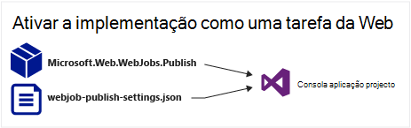
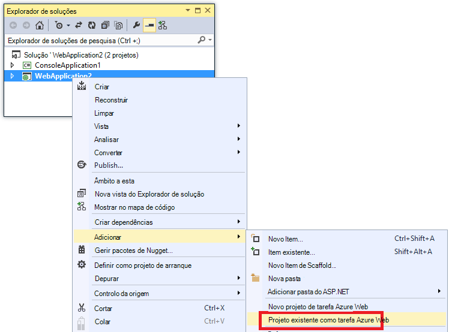
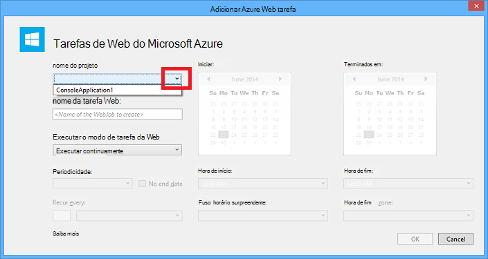
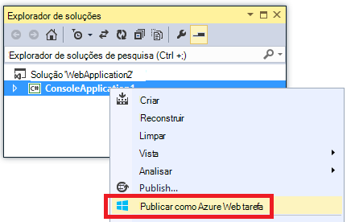
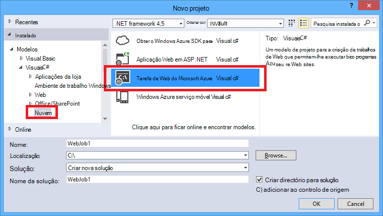
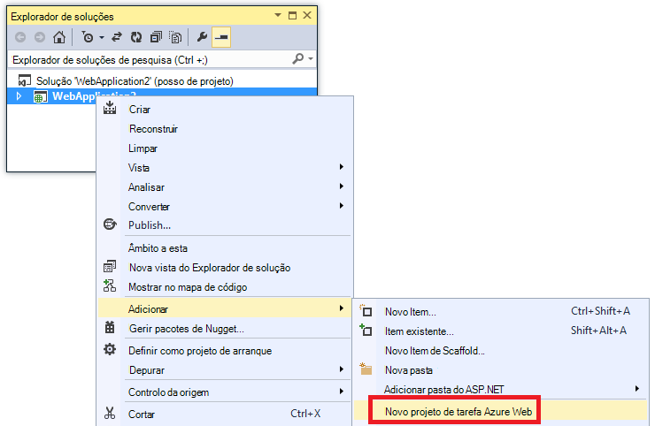
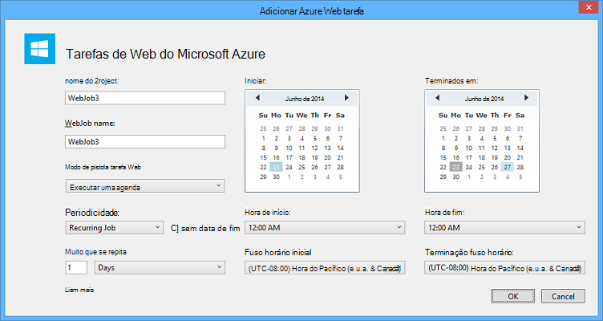

<properties 
    pageTitle="Implementar WebJobs utilizando o Visual Studio" 
    description="Saiba como implementar o Azure WebJobs em Azure aplicação de serviço Web Apps utilizando o Visual Studio." 
    services="app-service" 
    documentationCenter="" 
    authors="tdykstra" 
    manager="wpickett" 
    editor="jimbe"/>

<tags 
    ms.service="app-service" 
    ms.devlang="dotnet" 
    ms.topic="article" 
    ms.tgt_pltfrm="na" 
    ms.workload="na" 
    ms.date="04/27/2016" 
    ms.author="tdykstra"/>

# Implementar WebJobs utilizando o Visual Studio

## Descrição geral

Este tópico explica como utilizar o Visual Studio para implementar um projeto de aplicação de consola para uma aplicação web na [Aplicação de serviço](http://go.microsoft.com/fwlink/?LinkId=529714) , como um [Azure WebJob](http://go.microsoft.com/fwlink/?LinkId=390226). Para obter informações sobre como implementar WebJobs utilizando o [Portal do Azure](https://portal.azure.com), consulte o artigo [tarefas em segundo plano executar com WebJobs](web-sites-create-web-jobs.md).

Quando um projeto de aplicação de consola com capacidade de WebJobs implementa o Visual Studio, executa duas tarefas:

* Copia runtime ficheiros para a pasta adequada no web app (*App_Data/tarefas/contínua* para WebJobs contínuo, *App_Data/tarefas/acionou* para WebJobs agendada e a pedido).
* Configura [Azure Programador de tarefas](#scheduler) WebJobs agendado para ser executado em momentos específicos. (Isto não é necessária para WebJobs contínuo.)

Um projeto com capacidade de WebJobs tem os seguintes itens adicionados ao mesmo:

* O pacote de NuGet [Microsoft.Web.WebJobs.Publish](http://www.nuget.org/packages/Microsoft.Web.WebJobs.Publish/) .
* Um ficheiro de [settings.json webjob publicar](#publishsettings) que contém as definições de implementação e programador. 

Pode adicionar estes itens para um projeto de aplicação de consola existente ou utilizar um modelo para criar um novo projeto de aplicação de consola com capacidade de WebJobs. 

Pode implementar um projeto como um WebJob por si ou ligá-lo a um projecto da web para que automaticamente implementa sempre implementar o projecto da web. Para ligar projetos, o Visual Studio inclui o nome do projeto com capacidade de WebJobs num ficheiro [webjobs list.json](#webjobslist) no projeto web.

## Pré-requisitos

Funcionalidades de implementação de WebJobs estão disponíveis no Visual Studio 2015 quando instala o SDK do Azure para .NET:

* [Azure SDK para .NET (Visual Studio 2015)](http://go.microsoft.com/fwlink/?linkid=518003).

## Ativar WebJobs implementação para um projeto de aplicação de consola existente

Tem duas opções:

* [Ativar implementação automática com um projecto da web](#convertlink).

    Configure um projeto de aplicação de consola existente para que-lo automaticamente implementa o como um WebJob quando implementar um projecto da web. Utilize esta opção quando quiser executar o WebJob no web app mesmo em que executar a aplicação web relacionadas.

* [Ativar a implementação sem um projecto da web](#convertnolink).

    Configure um projeto de aplicação de consola existente para implementar o como um WebJob por si só, com sem ligação para um projecto da web. Utilize esta opção quando quiser executar um WebJob numa aplicação web por si só, com nenhuma aplicação web em execução no web app. Poderá pretender fazer para poder dimensionar os recursos do WebJob independentemente dos recursos da aplicação web.

### Ativar automática WebJobs implementação com um projecto da web
  
1. Com o botão direito do projecto web no **Explorador de soluções**e, em seguida, clique em **Adicionar** > **Projeto existente como Azure WebJob**.

    
    
    É apresentada a caixa de diálogo [Adicionar WebJob Azure](#configure) .

1. Na lista pendente **nome do projeto** , selecione o projeto de aplicação de consola para adicionar como um WebJob.

    

2. Concluir a caixa de diálogo [Adicionar WebJob Azure](#configure) e, em seguida, clique em **OK**. 

### Ativar a implementação de WebJobs sem um projecto da web
  
1. Com o botão direito do projecto de aplicação de consola no **Explorador de soluções**e, em seguida, clique em **Publicar como Azure WebJob**. 

    
    
    É apresentada a caixa de diálogo [Adicionar WebJob Azure](#configure) , com o projeto selecionado na caixa **nome do projeto** .

2.  Preencha a caixa de diálogo [Adicionar WebJob Azure](#configure) e, em seguida, clique em **OK**.

    Aparece o Assistente de **Publicar Web** .  Se não pretende publicar imediatamente, feche o assistente. As definições que introduziu são guardadas quando pretende [Implementar o projeto](#deploy).

## Criar um novo projeto com capacidade de WebJobs

Para criar um novo projeto com capacidade de WebJobs, pode utilizar o modelo de projeto de aplicação de consola e ativar WebJobs implementação, tal como é explicado na [secção anterior](#convert). Como alternativa, pode utilizar o modelo de novo projeto WebJobs:

* [Utilizar o modelo de novo projeto WebJobs para um WebJob independente](#createnolink)

    Criar um projeto e configure-o para implementar por si só, como um WebJob, com sem ligação para um projecto da web. Utilize esta opção quando quiser executar um WebJob numa aplicação web por si só, com nenhuma aplicação web em execução no web app. Poderá pretender fazer para poder dimensionar os recursos do WebJob independentemente dos recursos da aplicação web.

* [Utilizar o modelo de novo projeto WebJobs para um WebJob associado a um projecto da web](#createlink)

    Crie um projeto que está configurado para implementar o automaticamente como uma WebJob quando um projeto de web na mesma solução é implementado. Utilize esta opção quando quiser executar o WebJob no web app mesmo em que executar a aplicação web relacionadas.

> [AZURE.NOTE] O modelo de novo projeto WebJobs instala NuGet pacotes e inclui o código no *Program.cs* para o [WebJobs SDK](http://www.asp.net/aspnet/overview/developing-apps-with-windows-azure/getting-started-with-windows-azure-webjobs)automaticamente. Se não pretende utilizar o SDK WebJobs ou pretende utilizar um WebJob agendada em vez de contínuo, remover ou alterar a `host.RunAndBlock` instrução no *Program.cs*.

### Utilizar o modelo de novo projeto WebJobs para um WebJob independente
  
1. Clique em **ficheiro** > **Novo projeto**e, em seguida, na caixa de diálogo **Novo projeto** , clique em **nuvem** > **WebJob do Microsoft Azure**.

    
    
2. Siga as instruções apresentadas anterior para [tornar a aplicação de consola de um projeto WebJobs independente do project](#convertnolink).

### Utilizar o modelo de novo projeto WebJobs para um WebJob associado a um projecto da web

1. Com o botão direito do projecto web no **Explorador de soluções**e, em seguida, clique em **Adicionar** > **Novo projeto de WebJob Azure**.

    

    É apresentada a caixa de diálogo [Adicionar WebJob Azure](#configure) .

2. Preencha a caixa de diálogo [Adicionar WebJob Azure](#configure) e, em seguida, clique em **OK**.

## A caixa de diálogo Adicionar WebJob do Azure

A caixa de diálogo **Adicionar WebJob Azure** permite-lhe introduzir WebJob nome e as definições para a sua WebJob de agendamento. 

Os campos nesta caixa de diálogo correspondem aos campos na caixa de diálogo **Nova tarefa** do Portal do Azure. Para mais informações, consulte o artigo [tarefas em segundo plano executar com WebJobs](web-sites-create-web-jobs.md).

Para um WebJob agendada (não para contínua WebJobs), o Visual Studio cria uma coleção de tarefa de [Programador do Azure](/services/scheduler/) se não existir ainda e que cria uma tarefa na coleção de:

* Chama-se a coleção de tarefa scheduler *WebJobs-{regionname}* onde *{regionname}* refere-se à região de web app está alojado no. Por exemplo: WebJobs WestUS.
* Chama-se a tarefa de programador *{webappname}-{webjobname}*. Por exemplo: /AminhaApWeb MyWebJob. 
 
>[AZURE.NOTE]
> 
>* Para obter informações sobre a implementação da linha de comandos, consulte o artigo [Activar da linha de comandos ou entrega contínua de WebJobs Azure](/blog/2014/08/18/enabling-command-line-or-continuous-delivery-of-azure-webjobs/).
>* Se configurar um **Projecto periódico** e defina a frequência de periodicidade para um número de minutos, o serviço Azure programador não é gratuito. Outros frequência (horas, dias e assim sucessivamente) é gratuita.
>* Se implementar uma WebJob e, em seguida, decida que pretende alterar o tipo de WebJob e novo lançamento, terá de eliminar o ficheiro settings.json webjobs publicar. Este procedimento irá tornar Visual Studio para mostrar as opções de publicação novamente, por isso, pode alterar o tipo de WebJob.
>* Se implementar uma WebJob e mais tarde alterar o modo de execução de contínua para que não sejam contínua ou vice-versa, o Visual Studio cria uma nova WebJob no Azure quando é implementá. Se alterar outras definições de agendamento, mas deixar executar o modo da mesma ou alternar entre agendada e no pedido, Visual Studio atualiza a tarefa existente em vez de criar um novo.

## settings.json webjob publicar

Quando configurar uma aplicação de consola para implementação WebJobs, o Visual Studio instala o pacote de NuGet [Microsoft.Web.WebJobs.Publish](http://www.nuget.org/packages/Microsoft.Web.WebJobs.Publish/) e armazena as informações de agendamento num ficheiro *settings.json webjob publicar* na pasta de *Propriedades* do projecto do projeto WebJobs. Eis um exemplo desse ficheiro:

        {
          "$schema": "http://schemastore.org/schemas/json/webjob-publish-settings.json",
          "webJobName": "WebJob1",
          "startTime": "2014-06-23T00:00:00-08:00",
          "endTime": "2014-06-27T00:00:00-08:00",
          "jobRecurrenceFrequency": "Minute",
          "interval": 5,
          "runMode": "Scheduled"
        }

Pode editar este ficheiro diretamente e o Visual Studio fornece IntelliSense. O esquema do ficheiro é armazenado na [http://schemastore.org](http://schemastore.org/schemas/json/webjob-publish-settings.json) e pode ser visualizado.  

>[AZURE.NOTE]
>
>* Se configurar um **Projecto periódico** e defina a frequência de periodicidade para um número de minutos, o serviço Azure programador não é gratuito. Outros frequência (horas, dias e assim sucessivamente) é gratuita.

## webjobs list.json

Ao associar um projeto com capacidade de WebJobs a um projecto da web, o Visual Studio armazena o nome do projeto WebJobs num ficheiro *webjobs list.json* na pasta de *Propriedades* do projeto web. A lista pode conter vários projetos WebJobs, conforme mostrado no exemplo seguinte:

        {
          "$schema": "http://schemastore.org/schemas/json/webjobs-list.json",
          "WebJobs": [
            {
              "filePath": "../ConsoleApplication1/ConsoleApplication1.csproj"
            },
            {
              "filePath": "../WebJob1/WebJob1.csproj"
            }
          ]
        }

Pode editar este ficheiro diretamente e o Visual Studio fornece IntelliSense. O esquema do ficheiro é armazenado na [http://schemastore.org](http://schemastore.org/schemas/json/webjobs-list.json) e pode ser visualizado.
  
## Implementar um projeto WebJobs

Um projeto de WebJobs tiver ligado a um projeto de web implementa automaticamente com o projecto da web. Para obter informações sobre a implementação do project web, consulte o artigo [como implementar às aplicações Web](web-sites-deploy.md).

Para implementar um projeto WebJobs por si só, com o botão direito do projecto no **Explorador de soluções**e clique em **Publicar como Azure WebJob**. 

    
Aparece uma WebJob independente, o mesmo assistente **Publicar Web** que é utilizado para projetos web, mas com menos disponível para alterar as definições.

## Próximos passos

Este artigo explicou como implementar WebJobs utilizando o Visual Studio. Para mais informações sobre como implementar o Azure WebJobs, consulte o artigo [Azure WebJobs - recomendado recursos - implementação](http://www.asp.net/aspnet/overview/developing-apps-with-windows-azure/azure-webjobs-recommended-resources#deploying).
