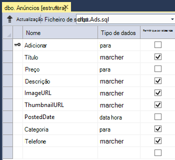
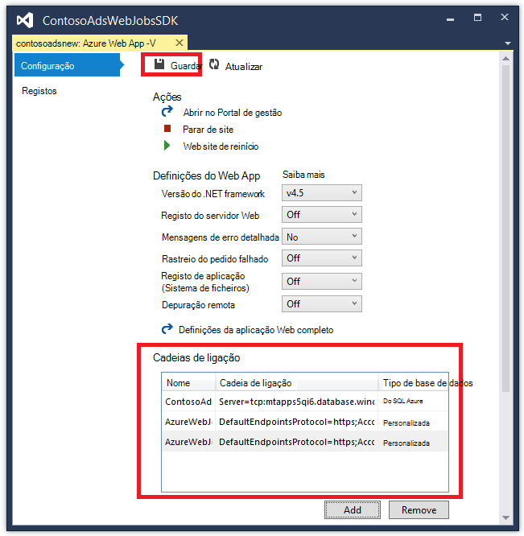

<properties
    pageTitle="Criar um WebJob .NET no Azure de aplicação de serviço | Microsoft Azure"
    description="Crie uma aplicação de várias camada utilizando ASP.NET MVC e Azure. As parte da frente execuções de fim numa aplicação web na aplicação de serviço de Azure e back-end é executado como um WebJob. A aplicação utiliza entidade Framework, base de dados do SQL e filas de armazenamento Azure e blobs."
    services="app-service"
    documentationCenter=".net"
    authors="tdykstra"
    manager="wpickett"
    editor="mollybos"/>

<tags
    ms.service="app-service"
    ms.workload="na"
    ms.tgt_pltfrm="na"
    ms.devlang="na"
    ms.topic="article"
    ms.date="10/28/2016"
    ms.author="tdykstra"/>

# Criar um WebJob .NET no Azure de aplicação de serviço

Este tutorial mostra como escrever código para uma aplicação de ASP.NET MVC 5 várias camada simple que utiliza o [WebJobs SDK](websites-dotnet-webjobs-sdk.md).

É o objetivo do [WebJobs SDK](websites-webjobs-resources.md) simplificar o código que escrever para tarefas comuns que um WebJob pode efetuar, como o processamento de imagens, processamento de fila e RSS agregação, manutenção de ficheiros e enviar e-mails. O SDK WebJobs tem funcionalidades incorporadas para trabalhar com o armazenamento do Windows Azure e Bus de serviço, para agendamento de tarefas e processamento de erros e muitas outras cenários comuns. Além disso, foi concebido para ser extensible e existe um [repositório de origem para as extensões de abrir](https://github.com/Azure/azure-webjobs-sdk-extensions/wiki/Binding-Extensions-Overview).

A aplicação de exemplo é um quadro de boletim publicidade. Os utilizadores podem carregar imagens para anúncios e um processo de back-end converte as imagens miniaturas. Página da lista de ad mostra as miniaturas e a página de detalhes do ad mostra a imagem de tamanho completo. Eis uma captura de ecrã:

Esta aplicação exemplo funciona com [filas Azure](http://www.asp.net/aspnet/overview/developing-apps-with-windows-azure/building-real-world-cloud-apps-with-windows-azure/queue-centric-work-pattern) e [blobs do Azure](http://www.asp.net/aspnet/overview/developing-apps-with-windows-azure/building-real-world-cloud-apps-with-windows-azure/unstructured-blob-storage). O tutorial mostra como implementar a aplicação ao [Serviço de aplicação do Azure](http://go.microsoft.com/fwlink/?LinkId=529714) e [Base de dados do SQL Azure](http://msdn.microsoft.com/library/azure/ee336279).

## Pré-requisitos

O tutorial assume que sabe como trabalhar com projetos [ASP.NET MVC 5](http://www.asp.net/mvc/tutorials/mvc-5/introduction/getting-started) no Visual Studio.

O tutorial foi escrito para Visual Studio 2013. Se ainda não tiver Visual Studio, este será instalado para si automaticamente quando instala o SDK do Azure para .NET.

O tutorial pode ser utilizado com Visual Studio 2015, mas antes de executar a aplicação localmente tem de alterar o `Data Source` para parte de uma cadeia de ligação do SQL Server LocalDB na Web. config e App ficheiros a partir do `Data Source=(localdb)\v11.0` para `Data Source=(LocalDb)\MSSQLLocalDB`. 

> [AZURE.NOTE] Precisa de uma conta Azure para concluir este tutorial:
  >
  > + Pode [Abrir uma conta Azure gratuitamente](https://azure.microsoft.com/pricing/free-trial/?WT.mc_id=A261C142F): obter o créditos pode utilizar para experimentar o nosso pagos serviços Azure e mesmo depois de que estão habituados até pode manter a conta e utilização livre Azure serviços, como sites. O cartão de crédito nunca será cobrado, exceto se alterar as definições e pedir para ser cobrada explicitamente.
  >
  > + Pode [Ativar benefícios de subscritor do MSDN](https://azure.microsoft.com/pricing/member-offers/msdn-benefits-details/?WT.mc_id=A261C142F): subscrição da sua MSDN fornece-lhe créditos todos os meses que pode utilizar para serviços Azure pagos.
  >
  >Se pretender começar a aplicação de serviço de Azure antes de inscrever-se para uma conta do Azure, aceda ao [Tentar aplicação de serviço](http://go.microsoft.com/fwlink/?LinkId=523751), onde imediatamente pode criar uma aplicação web do starter curto na aplicação de serviço. Sem cartões de crédito necessários; sem compromissos.

## O que vai aprender

O tutorial mostra como efetuar as seguintes tarefas:

* Permitir que o computador para o desenvolvimento Azure instalando o SDK do Azure.
* Crie um projeto de aplicação de consola implementa automaticamente como uma WebJob Azure quando implementar o projeto web associado.
* Teste back-end WebJobs SDK localmente no computador desenvolvimento.
* Publica uma aplicação com um back-end WebJobs para uma aplicação web na aplicação de serviço.
* Carregar ficheiros e armazená-los no serviço de Blobs do Azure.
* Utilize o SDK do Azure WebJobs para trabalhar com filas de armazenamento do Windows Azure e blobs.

## Arquitetura de aplicação

A aplicação de exemplo utiliza o [padrão de trabalho centrados em fila de espera](http://www.asp.net/aspnet/overview/developing-apps-with-windows-azure/building-real-world-cloud-apps-with-windows-azure/queue-centric-work-pattern) para descontínuas o trabalho com muitos CPU da criação de miniaturas para um processo de back-end.

A aplicação armazena anúncios numa base de dados SQL, entidade Framework código primeiro a utilizar para criar as tabelas e aceder aos dados. Para cada ad, a base de dados armazena duas URLs: uma para a imagem de tamanho completa e outra para a miniatura.

Quando um utilizador carrega uma imagem, a aplicação web armazena a imagem num [blob do Azure](http://www.asp.net/aspnet/overview/developing-apps-with-windows-azure/building-real-world-cloud-apps-with-windows-azure/unstructured-blob-storage)e armazena as informações de ad na base de dados com um URL que aponta para o blob. Ao mesmo tempo, escreve uma mensagem para uma fila Azure. Num processo de back-end em execução como um WebJob Azure, o SDK WebJobs leva fila de espera para novas mensagens. Quando for apresentada uma nova mensagem, o WebJob cria uma miniatura para essa imagem e atualiza o campo de base de dados de URL miniatura para esse ad. Eis um diagrama que mostra como interagem as partes da aplicação:

[AZURE.INCLUDE [install-sdk](../../includes/install-sdk-2015-2013.md)]

As instruções tutoriais aplicam a Azure SDK para .NET 2.7.1 ou posterior.

## Criar uma conta de armazenamento do Windows Azure

Uma conta de armazenamento Azure fornece recursos para armazenar dados fila de espera e blob na nuvem. Também é utilizado pelo WebJobs SDK para armazenar dados de registo para o dashboard.

Numa aplicação reais, normalmente criam contas separadas para a aplicação dados por oposição aos dados do registo e em separado contas para os dados de teste versus dados de produção. Para este tutorial irá utilizar apenas uma conta.

1. Abra a janela do **Explorador de servidor** no Visual Studio.

2. Clique com o botão direito do rato em **Azure** e, em seguida, clique em **ligar ao Microsoft Azure**.

3. Inicie sessão utilizando as suas credenciais Azure.

5. **Armazenamento** de contexto no nó do Azure e, em seguida, clique em **Criar a conta de armazenamento**.

3. Na caixa de diálogo **Criar conta de armazenamento** , introduza um nome para a conta de armazenamento.

    O nome deve ser têm de ser exclusivo (a outra conta de armazenamento Azure pode ter o mesmo nome). Se o nome que introduziu ainda estiver em utilização irá obter a oportunidade de alterá-la.

    O URL para aceder à sua conta de armazenamento será *{nome}*. core.windows.net.

5. Predefinir uma lista pendente **região ou grupo de afinidade** à região de próximo do computador.

    Esta definição especifica que Centro de dados do Azure irá alojar a sua conta de armazenamento. Neste tutorial, sua escolha não certifique uma diferença evidente. No entanto, para uma aplicação web de produção, pretende que o servidor web e a sua conta de armazenamento para ser na mesma região para minimizar os custos de saída de latência e os dados. A aplicação web (que irá criar mais tarde) Centro de dados deve ser tão próximo quanto possível os browsers aceder a aplicação web para poder minimizar latência.

6. Defina a lista de seta de lista pendente de **replicação** **localmente redundantes**.

    Quando geo replicação está ativada para uma conta de armazenamento, o conteúdo armazenado é replicado para um centro de dados secundário para ativar activação pós-falha até essa localização em caso de uma falhas principais na localização principal. Replicação geo pode implicar custos adicionais. Para contas de teste e desenvolvimento, geralmente não pretende pagar a replicação geo. Para mais informações, consulte o artigo [criar, gerir, ou eliminar uma conta de armazenamento](../storage-create-storage-account/#replication-options).

5. Clique em **Criar**.

    

## Transferir a aplicação

1. Transfira e deszipe a [solução de concluída](http://code.msdn.microsoft.com/Simple-Azure-Website-with-b4391eeb).

2. Inicie o Visual Studio.

3. A partir do menu **ficheiro** , selecione **Abrir > projeto/solução**, navegue até ao local onde que transferiu a solução e, em seguida, abra o ficheiro da solução.

4. Prima CTRL + SHIFT + B para criar a solução.

    Por predefinição, o Visual Studio restaura automaticamente o conteúdo de pacote NuGet, que não foi incluído no ficheiro *. zip* . Se os pacotes não restaurar, instale-os manualmente ao aceder à caixa de diálogo **Gerir pacotes de NuGet para solução** e clicar no botão **Restaurar** na parte superior direita.

5. No **Explorador de soluções**, certifique-se de que **ContosoAdsWeb** está selecionada como o projeto de arranque.

## Configurar a aplicação para utilizar a sua conta de armazenamento

1. Abra o ficheiro da aplicação *Web. config* no projeto ContosoAdsWeb.

    O ficheiro contém uma cadeia de ligação de SQL e uma cadeia de ligação do Azure armazenamento para trabalhar com blobs e filas.

    A cadeia de ligação de SQL aponta para uma base de dados do [SQL Server Express LocalDB](http://msdn.microsoft.com/library/hh510202.aspx) .

    A cadeia de ligação de armazenamento é um exemplo com marcadores de posição para a chave de acesso e nome da conta de armazenamento. Irá substituir isto com uma cadeia de ligação que tem o nome e a chave da sua conta de armazenamento.  

    <pre class="prettyprint">&lt;connectionStrings&gt;
   &lt;Adicionar nome = connectionString "ContosoAdsContext" = "origem de dados = \v11.0 (localdb); Inicial catálogo = ContosoAds; Segurança integrada = verdadeiro; MultipleActiveResultSets = verdadeiro; "providerName="System.Data.SqlClient "/&gt;
   &lt;Adicionar nome = connectionString"AzureWebJobsStorage"=" DefaultEndpointsProtocol = https; AccountName =<mark>[accountname]</mark>; AccountKey =<mark>[accesskey]</mark>"/&gt; 
    &lt;/connectionStrings      &gt;</pre>

    A cadeia de ligação de armazenamento é denominada AzureWebJobsStorage uma vez que é o nome que utiliza o SDK WebJobs por predefinição. O mesmo nome é utilizado aqui, pelo que tem de definir apenas um valor de cadeia de ligação no ambiente do Azure.

2. No **Explorador do servidor**, contexto da sua conta de armazenamento sob o nó de **armazenamento** e, em seguida, clique em **Propriedades**.

    

3. Na janela de **Propriedades** , clique **Nas teclas de conta de armazenamento**e, em seguida, clique nas reticências.

    

4. Copie a **cadeia de ligação**.

    

5. Substitua a cadeia de ligação que acabou de copiar a cadeia de ligação de armazenamento no ficheiro *Web. config* . Certifique-se de que seleciona tudo aspas mas não incluindo as aspas antes de colar.

6. Abra o ficheiro *App* no projeto ContosoAdsWebJob.

    Este ficheiro tem duas cadeias de ligação de armazenamento, uma para dados da aplicação e uma para o registo. Pode utilizar contas de armazenamento em separado para dados da aplicação e registo e pode utilizar [várias contas de armazenamento para os dados](https://github.com/Azure/azure-webjobs-sdk/blob/master/test/Microsoft.Azure.WebJobs.Host.EndToEndTests/MultipleStorageAccountsEndToEndTests.cs). Para este tutorial irá utilizar uma conta de armazenamento única. As cadeias da ligação tem marcadores de posição para as teclas de conta de armazenamento. 
    <pre class="prettyprint">&lt;configuração&gt; 
    &lt;connectionStrings&gt;
   &lt;Adicionar nome = connectionString "AzureWebJobsDashboard" = "DefaultEndpointsProtocol = https; AccountName =<mark>[accountname]</mark>; AccountKey =<mark>[accesskey]</mark>"/&gt;
   &lt;Adicionar nome = connectionString"AzureWebJobsStorage"=" DefaultEndpointsProtocol = https; AccountName =<mark>[accountname]</mark>; AccountKey =<mark>[accesskey]</mark>"/&gt;
   &lt;Adicionar nome = connectionString"ContosoAdsContext"=" origem de dados = \v11.0 (localdb); Inicial catálogo = ContosoAds; Segurança integrada = verdadeiro; MultipleActiveResultSets = verdadeiro; " /&gt; 
    &lt;/connectionStrings&gt;
   &lt;arranque&gt;
   &lt;supportedRuntime versão = "v 4.0" sku = ". NETFramework, versão = v4.5 "/&gt; 
    &lt;/startup&gt;
&lt;/configuration                             &gt;</pre>

    Por predefinição, o SDK WebJobs procura cadeias de ligação com o nome AzureWebJobsStorage e AzureWebJobsDashboard. Como alternativa, pode [arquivo a ligação de cadeia no entanto que pretende e passar-o na explicitamente para o `JobHost` objeto](websites-dotnet-webjobs-sdk-storage-queues-how-to.md#config).

7. Substitua ambas as cadeias de ligação de armazenamento a cadeia de ligação que copiou anteriormente.

8. Guarde as suas alterações.

## Executar a aplicação localmente

1. Para iniciar o frontend web da aplicação, prima CTRL + F5.

    O browser predefinido abre-se para a home page. (O projecto da web é executado uma vez que tenha feito-o projeto de arranque.)

    

2. Para iniciar o WebJob back-end da aplicação, com o botão direito do projecto ContosoAdsWebJob no **Explorador de soluções**e, em seguida, clique em **Depurar** > **Iniciar instância nova**.

    Uma janela de aplicação da consola abre e apresenta as mensagens de registo que indica que o objeto WebJobs SDK JobHost ter começado executar.

    

3. No seu browser, clique em **criar um anúncio**.

4. Introduza alguns dados de teste e selecione uma imagem para carregar e, em seguida, clique em **Criar**.

    

    A aplicação acede à página do índice remissivo, mas -não apresentar uma miniatura para o novo ad porque que processamento não aconteceu ainda.

    Entretanto, após uma atividade aguardar breve uma mensagem de registo na janela da aplicação de consola mostra que uma mensagem de fila de espera foi recebida e foi processada.

    

5. Depois de ver as mensagens de registo na janela da aplicação de consola, atualize a página de índice remissivo para ver a miniatura.

    

6. Clique em **Detalhes** para a sua ad para visualizar a imagem de tamanho completa.

    

Tenha sido executar a aplicação no seu computador local, e que está a utilizar o SQL Server base de dados localizado no seu computador, mas está a trabalhar com filas e blobs na nuvem. Na secção seguinte vai executar a aplicação na nuvem, utilizando uma base de dados na nuvem, bem como blobs na nuvem e filas.  

## Executar a aplicação na nuvem

Faça os seguintes passos para executar a aplicação na nuvem:

* Implemente às aplicações Web. Visual Studio cria automaticamente uma nova aplicação web na aplicação de serviço e uma instância de base de dados SQL.
* Configure a aplicação web para utilizar a sua conta de base de dados e o armazenamento do Azure SQL.

Após ter criado alguns anúncios ao executar na nuvem, irá ver o dashboard WebJobs SDK para ver rich funcionalidades que tem para oferecer de monitorização.

### Implementar às aplicações Web

1. Feche o browser e a janela de aplicação da consola.

2. No **Explorador de soluções**, com o botão direito do projecto ContosoAdsWeb e, em seguida, clique em **Publicar**.

3. No passo do assistente **Publicar Web** **perfil** , clique em **aplicações web do Microsoft Azure**.

    

4. Inicie sessão no Azure se ainda não iniciou sessão.

5. Clique em **Novo**.

    A caixa de diálogo poderá estar ligeiramente diferente consoante a versão do Azure SDK para .NET que instalou.

    

6. Na caixa de diálogo **criar web app no Microsoft Azure** , introduza um nome exclusivo na caixa **nome da aplicação Web** .

    O URL completo irá consistir no que introduzir aqui plus. azurewebsites.net (como mostrado junto à caixa de texto **nome da aplicação Web** ). Por exemplo, se o nome da aplicação web for ContosoAds, o URL será ContosoAds.azurewebsites.net.

7. Na lista pendente de [plano de serviço de aplicação](../app-service/azure-web-sites-web-hosting-plans-in-depth-overview.md) , selecione **Criar novo plano de serviço de aplicação**. Introduza um nome para o plano de serviço de aplicação, tal como ContosoAdsPlan.

8. Na lista pendente de [grupo de recursos](../azure-resource-manager/resource-group-overview.md) , selecione **Criar novo grupo de recursos**.

9. Introduza um nome para o grupo de recursos, tal como ContosoAdsGroup.

10. Na lista pendente **região** , selecione a região mesmo que escolheu para a sua conta de armazenamento.

    Esta definição especifica que Azure Centro de dados a aplicação web do será executada em. Manter a conta do web app e armazenamento no Centro de dados mesmo minimiza a latência e dados de taxas de saída.

11. Na lista pendente de **servidor de base de dados** , selecione **Criar novo servidor**.

12. Introduza um nome para o servidor de base de dados, tal como contosoadsserver + um número ou o seu nome para tornar o nome do servidor exclusivo. 

    O nome do servidor tem de ser exclusivo. Pode conter letras minúsculas, dígitos numéricos e hífenes. Não pode conter um hífen à direita. 

    Em alternativa, se a sua subscrição já tiver um servidor, pode selecionar nesse servidor a partir da lista pendente.

12. Introduza um administrador **da base de dados nome de utilizador** e **palavra-passe de base de dados**.

    Se tiver selecionado a **nova base de dados do SQL server** que não está a introduzir um nome existente e uma palavra-passe aqui, estiver a introduzir um novo nome e palavra-passe de que está a definir agora para utilizar mais tarde, quando acede a base de dados. Se Selecionou um servidor que criou anteriormente, será solicitado para a palavra-passe para a conta de utilizador administrativo já tiver criado.

13. Clique em **Criar**.

    

    Visual Studio cria a solução, o projecto da web, a aplicação web no Azure e a instância de base de dados do Azure SQL.

14. No passo do assistente **Publicar Web** **ligação** , clique em **seguinte**.

    

15. No passo **Definições** , desmarque a caixa de verificação **utilizar esta cadeia de ligação o tempo de execução** e, em seguida, clique em **seguinte**.

    

    Não tem de utilizar a caixa de diálogo Publicar para definir a cadeia de ligação de SQL, uma vez que irá definir esse valor no ambiente do Azure mais tarde.

    Pode ignorar avisos nesta página.

    * Normalmente a conta de armazenamento que utiliza ao executar no Azure seria diferente daquele que utiliza à ser executado localmente, mas para este tutorial estiver a utilizar o mesmo em ambos os ambientes. Por isso, a cadeia de ligação AzureWebJobsStorage não necessitam de ser transformados. Mesmo se queria utilizar uma conta de armazenamento diferente na nuvem, teria de transformar a cadeia de ligação de uma vez que a aplicação utiliza uma definição de ambiente Azure quando é executada no Azure. Verá esta mais tarde no tutorial.

    * Para este tutorial que não está vai ser façam alterações ao modelo de dados utilizado para a base de dados ContosoAdsContext, pelo que não é necessário utilizar entidade Framework código primeiro migrações para implementação. Primeiro o código cria automaticamente uma nova hora para a base de dados o primeiro a aplicação tenta aceder a dados do SQL.

    Para este tutorial, os valores predefinidos das opções em **Opções de publicar ficheiros** são finos.

16. No passo **pré-visualização** , clique em **Iniciar a pré-visualização**.

    

    Pode ignorar o aviso sobre sem bases de dados a ser publicado. Cria entidade Framework código primeira base de dados; -não necessite de ser publicado.

    A janela de pré-visualização mostra que binários e ficheiros de configuração do projeto WebJob serão copiados para a pasta *app_data\jobs\continuous* da aplicação web.

    

17. Clique em **Publicar**.

    Visual Studio implementa a aplicação e abre o URL da home page no browser.

    Não poderá utilizar a aplicação web até definido cadeias de ligação no ambiente do Azure na secção seguinte. Verá uma página de erro ou a home page, dependendo do web app e base de dados de opções de criação de que escolheu anteriormente.

### Configure a aplicação web para utilizar a sua conta de base de dados e o armazenamento do Azure SQL.

É aconselhável segurança para [evitar a colocação de informações confidenciais como cadeias de ligação nos ficheiros que estão armazenados no repositórios de código de origem](http://www.asp.net/aspnet/overview/developing-apps-with-windows-azure/building-real-world-cloud-apps-with-windows-azure/source-control#secrets). Azure fornece uma forma para o fazer: pode definir a cadeia de ligação e outros valores definição no ambiente do Azure e configuração do ASP.NET APIs Pegue automaticamente estes valores quando a aplicação é executado no Azure. Pode definir esses valores no Azure utilizando o **Explorador do servidor**, o Portal do Azure, Windows PowerShell ou a interface de comandos em diferentes plataformas. Para mais informações, consulte o artigo [como cadeias da aplicação e ligação cadeias de trabalho](/blog/2013/07/17/windows-azure-web-sites-how-application-strings-and-connection-strings-work/).

Nesta secção utilize **Server Explorer** para definir valores de cadeia de ligação no Azure.

7. No **Explorador do servidor**, botão direito do rato a aplicação web em **Azure > aplicação de serviço > {seu grupo de recursos}**e, em seguida, clique em **Definições de vista**.

    Janela do **Azure Web App** abre-se no separador **configuração** .

9. Altere o nome da cadeia de ligação DefaultConnection para ContosoAdsContext.

    Azure criada automaticamente nesta cadeia de ligação quando criou a aplicação web com uma base de dados associado, para que este já tenha o valor de cadeia de ligação à direita. Está a alterar apenas o nome para o seu código está à procura.

9. Adicione duas cadeias de ligação à nova, com o nome AzureWebJobsStorage e AzureWebJobsDashboard. Definir o tipo de escala e, defina o valor de cadeia de ligação para o mesmo valor que utilizou anteriormente os ficheiros de *Web. config* e *App* . (Certifique-se de que incluem a cadeia de ligação completa, não apenas a tecla de acesso e não incluem as aspas.)

    Estes cadeias de ligação são utilizadas pelo WebJobs SDK, uma para dados da aplicação e outra para o registo. Tal como viu anterior, a uma para dados da aplicação também é utilizada pelo código web front-end.

9. Clique em **Guardar**.

    

10. No **Explorador do servidor**, com o botão direito do web app e, em seguida, clique em **Parar**.

12. Depois de parar do web app, com o botão direito do web app novamente e, em seguida, clique em **Iniciar**.

    O WebJob é iniciado automaticamente publicar, mas parar quando fizer uma alteração de configuração. Para reiniciar-pode reiniciar a aplicação web ou reiniciar o WebJob no [Portal do Azure](http://go.microsoft.com/fwlink/?LinkId=529715). É recomendado geralmente para reiniciar a aplicação web após uma alteração da configuração.

9. Atualize a janela do browser que tem o URL da aplicação web na sua barra de endereço.

    É apresentada a home page.

10. Crie um anúncio, como fez quando executou o pedido localmente.

    A página de índice remissivo mostra sem uma miniatura na primeira.

11. Atualize a página depois de aguardar alguns segundos e a miniatura é apresentado.

    Se não aparecer na miniatura, poderá ter de esperar um minuto ou por isso, para WebJob reiniciar. Se após um tempo ainda não vê a miniatura quando atualizar a página, o WebJob poderá não ter sido iniciado automaticamente. Nesse caso, aceda ao separador WebJobs na página de [portal clássica](https://manage.windowsazure.com) para a sua aplicação web e, em seguida, clique em **Iniciar**.

### Visualizar o dashboard WebJobs SDK

1. No [portal clássico](https://manage.windowsazure.com), selecione a aplicação web.

2. Clique no separador **WebJobs** .

3. Clique no URL na coluna registos para o seu WebJob.

    

    É aberto um novo separador do browser para o dashboard WebJobs SDK. O dashboard mostra que a WebJob está em execução e mostra uma lista de funções no seu código que o acionou o SDK WebJobs.

4. Clique das funções para ver detalhes sobre a sua execução.

    

    

    O botão de **Reprodução função** nesta página faz com que a arquitetura de WebJobs SDK chamar a função novamente e dá-lhe a oportunidade de alterar os dados transmitidos para a função pela primeira vez.

>[AZURE.NOTE] Quando tiver terminado a testar, eliminar a aplicação web e a instância de base de dados SQL. A aplicação web é gratuita, mas a instância de base de dados SQL e a conta de armazenamento de imputação dos encargos (mínimos devido ao tamanho pequeno). Além disso, se deixar a aplicação web em execução, qualquer pessoa que se encontra o seu URL pode criar e ver anúncios. No portal do clássico, aceda ao separador **Dashboard** para a sua aplicação web e, em seguida, clique no botão **Eliminar** na parte inferior da página. Em seguida, pode selecionar uma caixa de verificação para eliminar a instância de base de dados SQL ao mesmo tempo. Se apenas quiser impedir temporariamente a outras pessoas acedam do web app, clique em **Parar** em vez disso. Nesse caso, encargos irão continuar a imputação para a conta de base de dados SQL e armazenamento. Pode seguir um procedimento semelhante ao eliminar a conta de base de dados e armazenamento SQL quando já não precisar.

## Criar a aplicação de raiz

Nesta secção irá efetuar as seguintes tarefas:

* Crie uma solução do Visual Studio com um projecto da web.
* Adicione um projeto de biblioteca de classe para a camada de acesso de dados que é partilhada entre o front-end e back-end.
* Adicione um projeto de aplicação de consola para back-end, com a implementação de WebJobs ativada.
* Adicione pacotes NuGet.
* Conjunto de referências de projeto.
* Copie ficheiros de código e de configuração da aplicação a partir da aplicação transferida que trabalhou com na secção anterior do tutorial.
* Reveja as partes do código que funcionam com blobs do Azure e filas e o SDK WebJobs.

### Criar uma solução do Visual Studio com um projeto de web e projecto da biblioteca de classe

1. No Visual Studio, selecione **Novo** > **projeto** a partir do menu **ficheiro** .

2. Na caixa de diálogo **Novo projeto** , escolha **Visual c#** > **Web** > **Aplicação Web do ASP.NET**.

3. Nome do projeto ContosoAdsWeb, nome a solução ContosoAdsWebJobsSDK (alterar o nome da solução se estiver a colocá-lo na mesma pasta como a solução transferida) e, em seguida, clique em **OK**.

    

5. Na caixa de diálogo **Novo projeto de ASP.NET** , selecione o modelo MVC e desmarque a caixa de verificação **anfitrião na nuvem** em **Microsoft Azure**.

    Selecionar o **anfitrião na nuvem** permite Visual Studio para criar automaticamente uma nova aplicação web do Azure e base de dados SQL. Uma vez que já criou estas anteriormente, não precisa de fazer agora ao criar o projeto. Se pretender criar um novo, selecione a caixa de verificação. Pode, em seguida, configurar a nova aplicação web e a base de dados SQL da mesma forma anteriores quando a aplicação implementada.

5. Clique em **Alterar autenticação**.

    

7. Na caixa de diálogo **Alterar autenticação** , selecione **Sem autenticação**e, em seguida, clique em **OK**.

    

8. Na caixa de diálogo **Novo projeto de ASP.NET** , clique em **OK**.

    Visual Studio cria a solução e o projecto da web.

9. No **Explorador de soluções**, a solução (e não o projecto) com o botão direito e selecione **Adicionar** > **Novo projeto**.

11. Na caixa de diálogo **Adicionar novo projeto** , escolha **Visual c#** > **Ambiente de trabalho Windows** > modelo de**Biblioteca de classes** .  

10. Nome do projeto *ContosoAdsCommon*e, em seguida, clique em **OK**.

    Este projeto irá conter o contexto de estrutura de entidades e o modelo de dados que irão utilizar o front-end e de back-end. Como alternativa que definem as classes relacionadas com EF no projeto web e que o project de referência do projeto WebJob. Mas, em seguida, o seu projeto WebJob teria uma referência a conjuntos de web que não necessite.

### Adicionar um projeto de aplicação de consola tem implementação WebJobs activada

1. Com o botão direito do projecto web (não a solução ou o projeto de biblioteca de classe) e, em seguida, clique em **Adicionar** > **Novo projeto de WebJob Azure**.

    

2. Na caixa de diálogo **Adicionar WebJob Azure** , introduza ContosoAdsWebJob como o **nome do projeto** e o **nome de WebJob**. Deixe **WebJob executar o modo** definido para **Executar continuamente**.

3.  Clique em **OK**.

    Visual Studio cria uma aplicação de consola que esteja configurada para implementar o como um WebJob sempre implementar o projecto da web. Para o fazer, efetuada as seguintes tarefas depois de criar o projeto:

    * Adicionado um ficheiro de *settings.json webjob publicar* na pasta de propriedades do projeto WebJob.
    * Adicionado um ficheiro de *webjobs list.json* na pasta de propriedades do project web.
    * Instalado o pacote de Microsoft.Web.WebJobs.Publish NuGet no projeto WebJob.

    Para mais informações sobre estas alterações, veja [como implementar WebJobs utilizando o Visual Studio](websites-dotnet-deploy-webjobs.md).

### Adicionar pacotes NuGet

O modelo de novo projeto de um projeto WebJob instala automaticamente o pacote de WebJobs SDK NuGet [Microsoft.Azure.WebJobs](http://www.nuget.org/packages/Microsoft.Azure.WebJobs) e respectivas dependências.

Uma das dependências de WebJobs SDK, que é instalado automaticamente no projeto WebJob é o Azure armazenamento cliente biblioteca (SCL). No entanto, tem de adicioná-lo ao projeto web para trabalhar com blobs e filas.

1. Abra a caixa de diálogo **Gerir pacotes de NuGet** para a solução.

2. No painel esquerdo, selecione **pacotes instalados**.

3. Localizar o pacote de *Armazenamento do Windows Azure* e, em seguida, clique em **Gerir**.

4. Na caixa **Selecione projetos** , selecione a caixa de verificação **ContosoAdsWeb** e, em seguida, clique em **OK**.

    Todos os três projetos utilizam a arquitetura de entidade para trabalhar com dados numa base de dados do SQL.

5. No painel esquerdo, selecione **Online**.

6. Localizar o pacote de NuGet *EntityFramework* e instalá-la em todos os três projetos.

### Conjunto de referências do projecto

Web e projetos de WebJob trabalhar com a base de dados do SQL, pelo ambos necessita de uma referência ao projeto ContosoAdsCommon.

1. No ContosoAdsWeb project, defina uma referência ao projeto ContosoAdsCommon. (Com o botão direito do projecto ContosoAdsWeb e, em seguida, clique em **Adicionar** > **referência**. Na caixa de diálogo **Gestor de referência** , selecione **solução** > **projetos** > **ContosoAdsCommon**e, em seguida, clique em **OK**.)

1. No ContosoAdsWebJob project, defina uma referência ao projeto ContosAdsCommon.

    O projeto WebJob necessita de referências para trabalhar com imagens e para aceder a cadeias de ligação.

3. No ContosoAdsWebJob project, defina uma referência `System.Drawing` e `System.Configuration`.

### Adicionar ficheiros de código e configuração

Neste tutorial não mostrar como [criar controladores de MVC e vistas através de andaimes](http://www.asp.net/mvc/tutorials/mvc-5/introduction/getting-started), como [escrever código Framework entidade que funciona com bases de dados do SQL Server](http://www.asp.net/mvc/tutorials/getting-started-with-ef-using-mvc)ou [os princípios básicos assíncrona de programação no 4,5 ASP.NET](http://www.asp.net/aspnet/overview/developing-apps-with-windows-azure/building-real-world-cloud-apps-with-windows-azure/web-development-best-practices#async). Por isso, tudo o que permanece fazer é copiar ficheiros de código e configuração da solução transferido para a nova solução. Depois de fazê-lo, as seguintes secções mostram e explicam partes importantes do código.

Para adicionar ficheiros a um projecto ou uma pasta, o botão direito do rato no projeto ou a pasta e clique em **Adicionar** > **Item existente**. Selecione os ficheiros que pretende e clique em **Adicionar**. Se lhe for perguntado se pretende substituir ficheiros existentes, clique em **Sim**.

1. No ContosoAdsCommon project, elimine o ficheiro *Class1.cs* e no seu lugar, adicione os seguintes ficheiros do projeto transferido.

    - *AD.CS*
    - *ContosoAdscontext.cs*
    - *BlobInformation.cs*  

2. No ContosoAdsWeb project, adicione os seguintes ficheiros do projeto transferido.

    - *Web. config*
    - *Global.asax.CS*  
    - Na pasta *controladores* : *AdController.cs*
    - Na pasta *Views\Shared* : *_Layout.cshtml* ficheiro
    - Na pasta *Views\Home* : *Index.cshtml*
    - Na pasta *Views\Ad* (criar a pasta pela primeira vez): cinco *.cshtml* ficheiros  

3. No ContosoAdsWebJob project, adicione os seguintes ficheiros do projeto transferido.

    - *App* (alterar o filtro do tipo de ficheiro para **Todos os ficheiros**)
    - *Program.CS*
    - *Functions.CS*

Agora pode criar, executar e implementar a aplicação, tal como indicado anteriormente no tutorial. Antes de o fazer, no entanto, pare o WebJob que ainda está em execução no primeiro web app que implementado. Caso contrário, esse WebJob processará mensagens em fila criadas localmente ou com a aplicação em execução numa nova aplicação web, uma vez que todas as estiver a utilizar a mesma conta de armazenamento.

## Rever o código da aplicação

As secções seguintes explicam o código relacionado com a trabalhar com as blobs WebJobs SDK e armazenamento do Windows Azure e as filas.

> [AZURE.NOTE] O código de específico para o SDK WebJobs, aceda às secções [Program.cs e Functions.cs](#programcs) .

### ContosoAdsCommon - Ad.cs

O ficheiro de Ad.cs define uma enumeração para categorias de ad e de uma classe de entidade POCO para obter informações de ad.

        public enum Category
        {
            Cars,
            [Display(Name="Real Estate")]
            RealEstate,
            [Display(Name = "Free Stuff")]
            FreeStuff
        }

        public class Ad
        {
            public int AdId { get; set; }

            [StringLength(100)]
            public string Title { get; set; }

            public int Price { get; set; }

            [StringLength(1000)]
            [DataType(DataType.MultilineText)]
            public string Description { get; set; }

            [StringLength(1000)]
            [DisplayName("Full-size Image")]
            public string ImageURL { get; set; }

            [StringLength(1000)]
            [DisplayName("Thumbnail")]
            public string ThumbnailURL { get; set; }

            [DataType(DataType.Date)]
            [DisplayFormat(DataFormatString = "{0:yyyy-MM-dd}", ApplyFormatInEditMode = true)]
            public DateTime PostedDate { get; set; }

            public Category? Category { get; set; }
            [StringLength(12)]
            public string Phone { get; set; }
        }

### ContosoAdsCommon - ContosoAdsContext.cs

A classe de ContosoAdsContext Especifica que a classe de Ad é utilizada numa coleção de DbSet, que armazena entidade Framework numa base de dados SQL.

        public class ContosoAdsContext : DbContext
        {
            public ContosoAdsContext() : base("name=ContosoAdsContext")
            {
            }
            public ContosoAdsContext(string connString)
                : base(connString)
            {
            }
            public System.Data.Entity.DbSet<Ad> Ads { get; set; }
        }

A classe tem dois construtores. O primeiro é utilizado pelo web project e especifica o nome de uma cadeia de ligação que está armazenado no ficheiro Web. config ou o ambiente do Azure runtime. O construtor de segundo permite-lhe passar na cadeia de ligação real. Que é necessário pelo WebJob project uma vez que não tem um ficheiro de Web. config. Viu anteriormente onde foi armazenada nesta cadeia de ligação e verá mais tarde como o código obtém a cadeia de ligação quando-iniciar instância a classe de DbContext.

### ContosoAdsCommon - BlobInformation.cs

O `BlobInformation` classe é utilizada para armazenar informações sobre um blob imagem numa mensagem de fila de espera.

        public class BlobInformation
        {
            public Uri BlobUri { get; set; }

            public string BlobName
            {
                get
                {
                    return BlobUri.Segments[BlobUri.Segments.Length - 1];
                }
            }
            public string BlobNameWithoutExtension
            {
                get
                {
                    return Path.GetFileNameWithoutExtension(BlobName);
                }
            }
            public int AdId { get; set; }
        }

### ContosoAdsWeb - Global.asax.cs

Código que chama-se a partir do `Application_Start` método cria um contentor de BLOBs *imagens* e uma fila de *imagens* se já não existirem. Este procedimento garante que sempre que começar a utilizar uma nova conta de armazenamento, contentor blob necessários e fila são criados automaticamente.

O código obtém acesso à conta de armazenamento utilizando a cadeia de ligação de armazenamento a partir da *Web. config* ficheiro ou um ambiente do Azure runtime.

        var storageAccount = CloudStorageAccount.Parse
            (ConfigurationManager.ConnectionStrings["AzureWebJobsStorage"].ToString());

Em seguida, -obtém uma referência para o contentor de BLOBs *imagens* , cria o contentor se ainda não exista e define as permissões de acesso no contentor de novo. Por predefinição contentores novos permitem apenas os clientes com as credenciais de conta de armazenamento aceder a blobs. A aplicação web tem blobs seja público para que pode apresentar imagens com URLs que apontam para blobs a imagem.

        var blobClient = storageAccount.CreateCloudBlobClient();
        var imagesBlobContainer = blobClient.GetContainerReference("images");
        if (imagesBlobContainer.CreateIfNotExists())
        {
            imagesBlobContainer.SetPermissions(
                new BlobContainerPermissions
                {
                    PublicAccess = BlobContainerPublicAccessType.Blob
                });
        }

Código semelhante obtém uma referência para a fila *thumbnailrequest* e cria uma nova fila. Neste caso, é necessária nenhuma alteração de permissões. 

        CloudQueueClient queueClient = storageAccount.CreateCloudQueueClient();
        var imagesQueue = queueClient.GetQueueReference("thumbnailrequest");
        imagesQueue.CreateIfNotExists();

### ContosoAdsWeb - _Layout.cshtml

O ficheiro *_Layout.cshtml* define o nome da aplicação no cabeçalho e rodapé e cria uma entrada de menu "Anúncios".

### ContosoAdsWeb - Views\Home\Index.cshtml

O ficheiro *Views\Home\Index.cshtml* apresenta hiperligações de categoria na home page. As ligações passam o valor de número inteiro do `Category` enumeração numa variável de cadeia de consulta para a página de anúncios índice.

        <li>@Html.ActionLink("Cars", "Index", "Ad", new { category = (int)Category.Cars }, null)</li>
        <li>@Html.ActionLink("Real estate", "Index", "Ad", new { category = (int)Category.RealEstate }, null)</li>
        <li>@Html.ActionLink("Free stuff", "Index", "Ad", new { category = (int)Category.FreeStuff }, null)</li>
        <li>@Html.ActionLink("All", "Index", "Ad", null, null)</li>

### ContosoAdsWeb - AdController.cs

No *AdController.cs* ficheiro das chamadas do construtor de `InitializeStorage` método para criar a biblioteca de cliente do Azure armazenamento objectos que fornecem uma API para trabalhar com blobs e filas.

Em seguida, o código obtém uma referência para o contentor de BLOBs *imagens* como viu anteriormente no *Global.asax.cs*. Enquanto segue que, define uma predefinição [Repetir política](http://www.asp.net/aspnet/overview/developing-apps-with-windows-azure/building-real-world-cloud-apps-with-windows-azure/transient-fault-handling) adequado para uma aplicação web. A política predefinida para repetir duplicar exponencial poderia deixar de responder a aplicação web durante mais de um minuto no repetidas tentativas de uma falha breves. A política de repetir especificada aqui espera 3 segundos depois de cada tente para tentativas até 3.

        var blobClient = storageAccount.CreateCloudBlobClient();
        blobClient.DefaultRequestOptions.RetryPolicy = new LinearRetry(TimeSpan.FromSeconds(3), 3);
        imagesBlobContainer = blobClient.GetContainerReference("images");

O código semelhante obtém uma referência para a fila de *imagens* .

        CloudQueueClient queueClient = storageAccount.CreateCloudQueueClient();
        queueClient.DefaultRequestOptions.RetryPolicy = new LinearRetry(TimeSpan.FromSeconds(3), 3);
        imagesQueue = queueClient.GetQueueReference("blobnamerequest");

A maior parte do código do controlador é típicas para trabalhar com um modelo de dados de entidade Framework utilizando uma classe DbContext. Uma exceção é o HttpPost `Create` método, que envia um ficheiro e guarda os dados no armazenamento de Blobs. O arquivador modelo disponibiliza um objeto de [HttpPostedFileBase](http://msdn.microsoft.com/library/system.web.httppostedfilebase.aspx) para o método.

        [HttpPost]
        [ValidateAntiForgeryToken]
        public async Task<ActionResult> Create(
            [Bind(Include = "Title,Price,Description,Category,Phone")] Ad ad,
            HttpPostedFileBase imageFile)

Se o utilizador selecionado um ficheiro a carregar, o código carrega o ficheiro, guarda os dados num blob e atualiza o registo de base de dados do Ad com um URL que aponta para o blob.

        if (imageFile != null && imageFile.ContentLength != 0)
        {
            blob = await UploadAndSaveBlobAsync(imageFile);
            ad.ImageURL = blob.Uri.ToString();
        }

O código que é que o carregamento é o `UploadAndSaveBlobAsync` método. Cria um nome GUID para o blob, os carregamentos pendentes e guarda o ficheiro e devolve uma referência para o blob guardado.

        private async Task<CloudBlockBlob> UploadAndSaveBlobAsync(HttpPostedFileBase imageFile)
        {
            string blobName = Guid.NewGuid().ToString() + Path.GetExtension(imageFile.FileName);
            CloudBlockBlob imageBlob = imagesBlobContainer.GetBlockBlobReference(blobName);
            using (var fileStream = imageFile.InputStream)
            {
                await imageBlob.UploadFromStreamAsync(fileStream);
            }
            return imageBlob;
        }

Após o HttpPost `Create` método carrega um blob e atualiza a base de dados, que cria uma mensagem de fila de espera para informar o processo de back-end que uma imagem está pronta para a conversão para uma miniatura.

        BlobInformation blobInfo = new BlobInformation() { AdId = ad.AdId, BlobUri = new Uri(ad.ImageURL) };
        var queueMessage = new CloudQueueMessage(JsonConvert.SerializeObject(blobInfo));
        await thumbnailRequestQueue.AddMessageAsync(queueMessage);

O código para o HttpPost `Edit` método é semelhante, exceto os se o utilizador seleciona um novo ficheiro de imagem qualquer blobs que já existam para este ad tem de ser eliminadas.

        if (imageFile != null && imageFile.ContentLength != 0)
        {
            await DeleteAdBlobsAsync(ad);
            imageBlob = await UploadAndSaveBlobAsync(imageFile);
            ad.ImageURL = imageBlob.Uri.ToString();
        }

Eis o código que elimina a blobs quando elimina um ad:

        private async Task DeleteAdBlobsAsync(Ad ad)
        {
            if (!string.IsNullOrWhiteSpace(ad.ImageURL))
            {
                Uri blobUri = new Uri(ad.ImageURL);
                await DeleteAdBlobAsync(blobUri);
            }
            if (!string.IsNullOrWhiteSpace(ad.ThumbnailURL))
            {
                Uri blobUri = new Uri(ad.ThumbnailURL);
                await DeleteAdBlobAsync(blobUri);
            }
        }
        private static async Task DeleteAdBlobAsync(Uri blobUri)
        {
            string blobName = blobUri.Segments[blobUri.Segments.Length - 1];
            CloudBlockBlob blobToDelete = imagesBlobContainer.GetBlockBlobReference(blobName);
            await blobToDelete.DeleteAsync();
        }

### ContosoAdsWeb - Views\Ad\Index.cshtml e Details.cshtml

O ficheiro *Index.cshtml* apresenta miniaturas com os dados de ad:

        

O ficheiro *Details.cshtml* apresenta a imagem prefira:

        

### ContosoAdsWeb - Views\Ad\Create.cshtml e Edit.cshtml

Os ficheiros *Create.cshtml* e *Edit.cshtml* especificam a codificação de formulário que permite que o controlador de obter o `HttpPostedFileBase` objeto.

        @using (Html.BeginForm("Create", "Ad", FormMethod.Post, new { enctype = "multipart/form-data" }))

Um `<input>` elemento indica o browser para fornecer uma caixa de diálogo de seleção do ficheiro.

        <input type="file" name="imageFile" accept="image/*" class="form-control fileupload" />

### ContosoAdsWebJob - Program.cs

Quando inicia o WebJob, o `Main` chamadas de método o SDK WebJobs `JobHost.RunAndBlock` método para começar a execução dos acionou funções no módulo actual.

        static void Main(string[] args)
        {
            JobHost host = new JobHost();
            host.RunAndBlock();
        }

### Método de GenerateThumbnail ContosoAdsWebJob - Functions.cs-

O SDK WebJobs chamadas este método quando for recebida uma mensagem de fila de espera. O método cria uma miniatura e coloca a miniatura do URL da base de dados.

        public static void GenerateThumbnail(
        [QueueTrigger("thumbnailrequest")] BlobInformation blobInfo,
        [Blob("images/{BlobName}", FileAccess.Read)] Stream input,
        [Blob("images/{BlobNameWithoutExtension}_thumbnail.jpg")] CloudBlockBlob outputBlob)
        {
            using (Stream output = outputBlob.OpenWrite())
            {
                ConvertImageToThumbnailJPG(input, output);
                outputBlob.Properties.ContentType = "image/jpeg";
            }

            // Entity Framework context class is not thread-safe, so it must
            // be instantiated and disposed within the function.
            using (ContosoAdsContext db = new ContosoAdsContext())
            {
                var id = blobInfo.AdId;
                Ad ad = db.Ads.Find(id);
                if (ad == null)
                {
                    throw new Exception(String.Format("AdId {0} not found, can't create thumbnail", id.ToString()));
                }
                ad.ThumbnailURL = outputBlob.Uri.ToString();
                db.SaveChanges();
            }
        }

* O `QueueTrigger` atributo encaminha o SDK WebJobs para chamar este método quando uma nova mensagem é recebida na fila de thumbnailrequest.

        [QueueTrigger("thumbnailrequest")] BlobInformation blobInfo,

    O `BlobInformation` objeto na mensagem fila é automaticamente para o `blobInfo` parâmetro. Quando o método for concluída, é eliminada a mensagem de fila de espera. Se o método falhar antes de concluir, a mensagem de fila de espera não é eliminada; Depois de expira uma locação 10 minutos, a mensagem é disponibilizada para serem recolhidos novamente e processada. Esta sequência não ser repetida indefinidamente se uma mensagem sempre causar uma exceção. Depois de ter êxito 5 tentativas de uma mensagem do processo, a mensagem é movida para uma fila denominada {NomeFila}-corrompida foi. O número máximo de tentativas é configurável.

* As duas `Blob` atributos fornecem objetos que estão vinculados ao blobs: uma para o blob imagem existente e uma para um novo blob miniatura que cria o método.

        [Blob("images/{BlobName}", FileAccess.Read)] Stream input,
        [Blob("images/{BlobNameWithoutExtension}_thumbnail.jpg")] CloudBlockBlob outputBlob)

    Nomes de BLOBs provêm de propriedades do `BlobInformation` objeto recebido na mensagem fila de espera (`BlobName` e `BlobNameWithoutExtension`). Para obter a funcionalidade completa da biblioteca de cliente de armazenamento, pode utilizar o `CloudBlockBlob` escolares para trabalhar com blobs. Se pretender reutilizar o código que foi escrito para trabalhar com `Stream` objectos, pode utilizar o `Stream` escolares.

Para mais informações sobre como escrever funções que utilizam os atributos de WebJobs SDK, consulte os seguintes recursos:

* [Como utilizar o armazenamento de Azure filas com o SDK WebJobs](websites-dotnet-webjobs-sdk-storage-queues-how-to.md)
* [Como utilizar o armazenamento de Blobs do Azure com o SDK WebJobs](websites-dotnet-webjobs-sdk-storage-blobs-how-to.md)
* [Como utilizar o armazenamento de tabela do Azure com o SDK WebJobs](websites-dotnet-webjobs-sdk-storage-tables-how-to.md)
* [Como utilizar o Azure Service Bus com o SDK WebJobs](websites-dotnet-webjobs-sdk-service-bus.md)

> [AZURE.NOTE]
>
> * Se a sua aplicação web é executado em várias VMs, várias WebJobs irá estar em execução em simultâneo e, em alguns cenários Isto pode resultar nos mesmos dados a ser processados várias vezes. Não é um problema se utilizar a fila incorporada, blob e accionadores Bus de serviço. O SDK assegura que as funções serão processadas apenas uma vez para cada mensagem ou blob.
>
> * Para obter informações sobre como implementar o encerramento sem problemas, consulte o artigo [Encerramento com êxito](websites-dotnet-webjobs-sdk-storage-queues-how-to.md#graceful).
>
> * O código na `ConvertImageToThumbnailJPG` método (não apresentado) utiliza classes na `System.Drawing` espaço de nomes para simplificar. No entanto, as classes neste espaço de nomes foram concebidas para utilização com formulários do Windows. Não são suportadas para utilização num serviço Windows ou ASP.NET. Para mais informações sobre as opções de processamento de imagens, consulte o artigo [Dinâmico geração de imagens](http://www.hanselman.com/blog/BackToBasicsDynamicImageGenerationASPNETControllersRoutingIHttpHandlersAndRunAllManagedModulesForAllRequests.aspx) e [Abrangente dentro de redimensionamento de imagens](http://www.hanselminutes.com/313/deep-inside-image-resizing-and-scaling-with-aspnet-and-iis-with-imageresizingnet-author-na).

## Próximos passos

Neste tutorial visualizou uma aplicação de várias camada simple que utiliza o SDK WebJobs para processamento de back-end. Esta secção oferece algumas sugestões para saber mais sobre aplicações de várias camadas do ASP.NET e WebJobs.

### Funcionalidades em falta

A aplicação foi manteve simple para obter um tutorial introdução. Numa aplicação reais seria implementar a [introdução de dependência](http://www.asp.net/mvc/tutorials/hands-on-labs/aspnet-mvc-4-dependency-injection) e o [repositório de unidade de trabalho padrões](http://www.asp.net/mvc/tutorials/getting-started-with-ef-using-mvc/advanced-entity-framework-scenarios-for-an-mvc-web-application#repo), utilize [uma interface para o registo](http://www.asp.net/aspnet/overview/developing-apps-with-windows-azure/building-real-world-cloud-apps-with-windows-azure/monitoring-and-telemetry#log), utilizar [EF código primeiro migrações](http://www.asp.net/mvc/tutorials/getting-started-with-ef-using-mvc/migrations-and-deployment-with-the-entity-framework-in-an-asp-net-mvc-application) para gerir alterações do modelo de dados e utilizar [EF ligação RDP](http://www.asp.net/mvc/tutorials/getting-started-with-ef-using-mvc/connection-resiliency-and-command-interception-with-the-entity-framework-in-an-asp-net-mvc-application) para gerir os erros de rede breves.

### Dimensionamento WebJobs

WebJobs executar no contexto de uma aplicação web e não são dimensionáveis separadamente. Por exemplo, se tiver uma instância de aplicação web padrão, tiver apenas uma instância do processo de fundo em execução e que está a utilizar alguns dos recursos de servidor (CPU, memória, etc.) caso contrário, estariam disponíveis para servir o conteúdo da web.

Se o tráfego varia por hora do dia ou dia da semana, e se o processamento de back-end precisar de pode esperar, poderia agendar o WebJobs para serem executados em alturas de tráfego de baixa. Se a carga ainda é demasiado elevada para essa solução, pode executar o back-end como um WebJob numa aplicação web em separado dedicada para esse efeito. Em seguida, pode dimensionar a aplicação web do back-end independentemente da sua aplicação web do front-end.

Para mais informações, consulte o artigo [Dimensionamento WebJobs](websites-webjobs-resources.md#scale).

### Evitar tempo limite de aplicação web encerrar-pendentes

Para se certificar-se de que seu WebJobs sempre estiver a executar e, em execução no todas as instâncias da sua aplicação web, tem de ativar a funcionalidade de [AlwaysOn](http://weblogs.asp.net/scottgu/archive/2014/01/16/windows-azure-staging-publishing-support-for-web-sites-monitoring-improvements-hyper-v-recovery-manager-ga-and-pci-compliance.aspx) .

### Utilizando o SDK WebJobs fora WebJobs

Não possui um programa que utiliza o SDK WebJobs executar no Azure num WebJob. Pode ser executado localmente e também pode executar noutros ambientes como uma função de trabalho do serviço na nuvem ou um serviço do Windows. No entanto, só pode aceder o dashboard WebJobs SDK através de uma aplicação Azure web. Para utilizar o dashboard tem que ligar a aplicação web para a conta de armazenamento que estiver a utilizar o definindo a cadeia de ligação AzureWebJobsDashboard no separador **Configurar** do portal clássico. Em seguida, pode obter a dashboard utilizando o seguinte URL:

https://{webappname}.SCM.azurewebsites.NET/azurejobs/#/Functions

Para mais informações, consulte o artigo [Introdução um dashboard para desenvolvimento local com o SDK WebJobs](http://blogs.msdn.com/b/jmstall/archive/2014/01/27/getting-a-dashboard-for-local-development-with-the-webjobs-sdk.aspx), mas tenha em atenção que mostra um nome de cadeia de ligação antigo.

### Mais WebJobs documentação

Para mais informações, consulte o artigo [recursos de documentação Azure WebJobs](http://go.microsoft.com/fwlink/?LinkId=390226).
