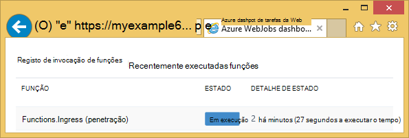

<properties 
    pageTitle="Como utilizar o armazenamento de tabela do Azure com o SDK WebJobs" 
    description="Saiba como utilizar o armazenamento de tabela do Azure com o SDK WebJobs. Criar tabelas, adicionar entidades a tabelas e ler tabelas existentes." 
    services="app-service\web, storage" 
    documentationCenter=".net" 
    authors="tdykstra" 
    manager="wpickett" 
    editor="jimbe"/>

<tags 
    ms.service="app-service-web" 
    ms.workload="web" 
    ms.tgt_pltfrm="na" 
    ms.devlang="dotnet" 
    ms.topic="article" 
    ms.date="06/01/2016" 
    ms.author="tdykstra"/>

# Como utilizar o armazenamento de tabela do Azure com o SDK WebJobs

## Descrição geral

Este guia fornece c# exemplos de código que mostram como ler e escrever tabelas de armazenamento Azure utilizando a versão de [WebJobs SDK](websites-dotnet-webjobs-sdk.md) 1. x.

O guia assume saber [como criar um projeto WebJob no Visual Studio com cadeias de ligação que apontam para a sua conta de armazenamento](websites-dotnet-webjobs-sdk-get-started.md) ou a [múltiplas contas de armazenamento](https://github.com/Azure/azure-webjobs-sdk/blob/master/test/Microsoft.Azure.WebJobs.Host.EndToEndTests/MultipleStorageAccountsEndToEndTests.cs).
        
Alguns da apresentação de fragmentos código a `Table` atributo utilizado em funções que [denominado manualmente](websites-dotnet-webjobs-sdk-storage-queues-how-to.md#manual), ou seja, não são através de um dos atributos acionador. 

## Como adicionar entidades a uma tabela

Para adicionar entidades a uma tabela, utilize o `Table` atributo com um `ICollector<T>` ou `IAsyncCollector<T>` parâmetro onde `T` Especifica o esquema das entidades que pretende adicionar. O construtor de atributo leva um parâmetro de cadeia que especifica o nome da tabela. 

O código de exemplo seguinte adiciona `Person` entidades a uma tabela com o nome *penetração*.

        [NoAutomaticTrigger]
        public static void IngressDemo(
            [Table("Ingress")] ICollector<Person> tableBinding)
        {
            for (int i = 0; i < 100000; i++)
            {
                tableBinding.Add(
                    new Person() { 
                        PartitionKey = "Test", 
                        RowKey = i.ToString(), 
                        Name = "Name" }
                    );
            }
        }

Normalmente, o tipo de utilizar com `ICollector` deriva da `TableEntity` ou implementa `ITableEntity`, mas não tem de. Um dos seguintes procedimentos `Person` classes trabalho com o código apresentado na anterior `Ingress` método.

        public class Person : TableEntity
        {
            public string Name { get; set; }
        }

        public class Person
        {
            public string PartitionKey { get; set; }
            public string RowKey { get; set; }
            public string Name { get; set; }
        }

Se pretende que trabalhe diretamente com o Azure armazenamento API, pode adicionar um `CloudStorageAccount` parâmetro para a assinatura de método.

## Monitorização em tempo real

Uma vez que as funções de penetração de dados com frequência processam grandes volumes de dados, o dashboard WebJobs SDK fornece dados em tempo real de monitorização. A secção de **Registo de invocação** indica se a função ainda estiver em execução.

Página de **Detalhes de invocação** de relatórios progresso a função (número de entidades escritos) enquanto está a ser executado e fornece-lhe uma oportunidade para cancelá-lo. 

Quando termina a função, página de **Detalhes de invocação** de relatórios o número de linhas por escrito.

## Saber como ler várias entidades de uma tabela

Para ler uma tabela, utilize o `Table` atributo com um `IQueryable<T>` parâmetro onde escrever `T` deriva da `TableEntity` ou implementa `ITableEntity`.

O código seguinte de exemplo lê e os registos de todas as linhas do `Ingress` tabela:
 
        public static void ReadTable(
            [Table("Ingress")] IQueryable<Person> tableBinding,
            TextWriter logger)
        {
            var query = from p in tableBinding select p;
            foreach (Person person in query)
            {
                logger.WriteLine("PK:{0}, RK:{1}, Name:{2}", 
                    person.PartitionKey, person.RowKey, person.Name);
            }
        }

### Saber como ler uma única entidade de uma tabela

Existe um `Table` o construtor de atributos com dois parâmetros adicionais que permitem-lhe especificar a chave de partição e chave de linha ao qual pretende vincular para uma entidade única tabela.

O código seguinte de exemplo lê uma linha de tabela para uma `Person` entidade baseada em partição chave e linha valores chave recebidos numa mensagem de fila de espera:  

        public static void ReadTableEntity(
            [QueueTrigger("inputqueue")] Person personInQueue,
            [Table("persontable","{PartitionKey}", "{RowKey}")] Person personInTable,
            TextWriter logger)
        {
            if (personInTable == null)
            {
                logger.WriteLine("Person not found: PK:{0}, RK:{1}",
                        personInQueue.PartitionKey, personInQueue.RowKey);
            }
            else
            {
                logger.WriteLine("Person found: PK:{0}, RK:{1}, Name:{2}",
                        personInTable.PartitionKey, personInTable.RowKey, personInTable.Name);
            }
        }

O `Person` escolares neste exemplo não tem a implementar `ITableEntity`.

## Como utilizar a API do armazenamento .NET diretamente para trabalhar com uma tabela

Também pode utilizar o `Table` atributo com um `CloudTable` objeto para maior flexibilidade em trabalhar com uma tabela.

O seguinte código de exemplo utiliza um `CloudTable` objeto para adicionar uma única entidade à tabela de *penetração* . 
 
        public static void UseStorageAPI(
            [Table("Ingress")] CloudTable tableBinding,
            TextWriter logger)
        {
            var person = new Person()
                {
                    PartitionKey = "Test",
                    RowKey = "100",
                    Name = "Name"
                };
            TableOperation insertOperation = TableOperation.Insert(person);
            tableBinding.Execute(insertOperation);
        }

Para obter mais informações sobre como utilizar o `CloudTable` objeto, consulte o artigo [como utilizar o armazenamento de tabela a partir do .NET](../storage/storage-dotnet-how-to-use-tables.md). 

## Tópicos relacionados abrangidos pelo artigo sobre como utilizar filas

Para obter informações sobre como gerir o processamento de tabela acionou por uma mensagem de fila ou para cenários WebJobs SDK específicos processamento de tabela, consulte o artigo [como utilizar o armazenamento de fila Azure com o SDK WebJobs](websites-dotnet-webjobs-sdk-storage-queues-how-to.md). 

Os tópicos abrangidos no artigo incluem o seguinte:

* Funções de assíncrona
* Várias instâncias
* Desligar sem problemas
* Utilize os atributos de WebJobs SDK no corpo de uma função
* Definir as cadeias de ligação SDK no código
* Valores definidos para WebJobs SDK parâmetros construtor no código
* Acionar uma função manualmente
* Escrever os registos

## Próximos passos

Este guia forneceu exemplos de código que mostram como lidar cenários comuns de trabalhar com tabelas Azure. Para obter mais informações sobre como utilizar Azure WebJobs e o SDK WebJobs, consulte o artigo [Azure WebJobs recomendado recursos](http://go.microsoft.com/fwlink/?linkid=390226).
 
