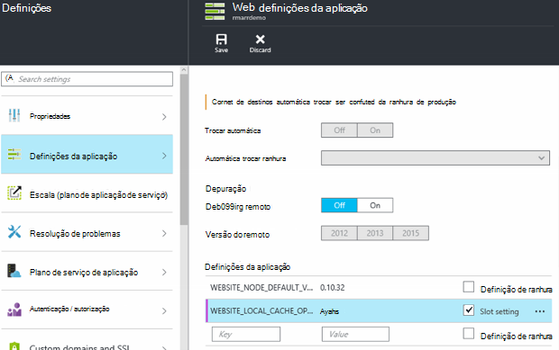

<properties
   pageTitle="Descrição geral de aplicação serviço de Cache Local Azure | Microsoft Azure"
   description="Este artigo descreve como ativar, redimensionar e consultar o estado da funcionalidade Cache Local do serviço de aplicação Azure"
   services="app-service"
   documentationCenter="app-service"
   authors="SyntaxC4"
   manager="yochayk"
   editor=""
   tags="optional"
   keywords=""/>

<tags
   ms.service="app-service"
   ms.devlang="multiple"
   ms.topic="article"
   ms.tgt_pltfrm="na"
   ms.workload="na"
   ms.date="03/04/2016"
   ms.author="cfowler"/>

# <a name="azure-app-service-local-cache-overview"></a>Descrição geral de aplicação serviço de Cache Local Azure

Conteúdo de aplicação Azure web está armazenado no armazenamento do Windows Azure e é estar para cima de uma forma resistente como uma partilha de conteúdo. Esta estrutura destina-se para trabalhar com uma diversidade de aplicações e tem os seguintes atributos:  

* O conteúdo é partilhado através de várias instâncias de máquina virtual (VM) do web app.
* O conteúdo dure e pode ser modificado executando aplicações web.
* Ficheiros de registo e ficheiros de dados de diagnóstico estão disponíveis na mesma pasta conteúdo partilhado.
* Publicação de novo conteúdo diretamente atualiza a pasta de conteúdo. Pode ver imediatamente o mesmo conteúdo através de Web site da SMS e a aplicação web em execução (normalmente algumas tecnologias, tais como ASP.NET iniciar um reinício da aplicação web no algumas alterações de ficheiro para obter o conteúdo mais recente).

Apesar de muitas aplicações web utilizam uma ou todas estas funcionalidades, algumas aplicações web só precisa de um arquivo de conteúdo alto desempenho e só de leitura que podem executar a partir com elevada disponibilidade. Podem beneficiar estas aplicações a partir de uma instância VM da cache local específica.

A funcionalidade de Cache Local do serviço de aplicação Azure fornece uma vista da função web dos seus conteúdos. Este conteúdo é uma cache de escrita-mas-rejeitar dos seus conteúdos de armazenamento que são criado de forma assíncrona no arranque do site. Quando a cache estiver pronta, o site está mudado para executar contra o conteúdo em cache. Aplicações Web que sejam executados em Local Cache tem os seguintes benefícios:

* Estes são imunes à latências que ocorrem quando aceder a conteúdo do armazenamento do Windows Azure.
* Estes são imunes para as actualizações planeadas ou não planeadas falhas e outras interrupções com armazenamento do Windows Azure que ocorrem em servidores que servem a partilha de conteúdo.
* Possuem menos de aplicação de ser reiniciado devido a alterações da quota de armazenamento.

## <a name="how-local-cache-changes-the-behavior-of-app-service"></a>Como Local Cache altera o comportamento da aplicação de serviço

* A cache local é uma cópia das pastas /site e /siteextensions da aplicação web. É criado na instância VM local no arranque de aplicação web. O tamanho da cache local do web app está limitado a 300 MB por predefinição, mas pode aumentá-la até 1 GB.
* A cache local é leitura e escrita. No entanto, todas as modificações serão eliminadas quando a aplicação web move o cursor máquinas virtuais ou obtém reiniciada. Não deve utilizar Local Cache para as aplicações que armazenar dados críticos no arquivo de conteúdo.
* Aplicações Web podem continuar a escrever ficheiros de registo e dados de diagnóstico, tal como atualmente. Ficheiros de registo e dados, no entanto, são armazenados localmente na VM. Em seguida, são copiados sobre periodicamente para o arquivo de conteúdo partilhado. Copiar para o arquivo de conteúdo partilhado é um esforço questão – escrita cria uma segurança pode perder de conclusão para uma falha de uma instância VM repentina sobre.
* Existe uma alteração na estrutura de pastas das pastas de ficheiros de registo e dados para as aplicações web que utilizam a Local Cache. Agora existem subpastas as pastas de ficheiros de registo e dados de armazenamento que siga o padrão de nomenclatura "Identificador exclusivo" + carimbo de data / hora. Cada uma das subpastas corresponde a uma instância VM onde a aplicação web está a ser executado ou foi executado.  
* Publicar alterações de publicação para a aplicação web através de qualquer um dos mecanismos de publicação para o arquivo de conteúdo partilhado. Isto é porque pretendemos o conteúdo publicado para durar. Para atualizar a cache local do web app, tem de ser reiniciado. É que isto parecer um passo excessivo? Para tornar o ciclo de vida totalmente integrada, consulte as informações neste artigo.
* D:\home irá apontar para a cache local. D:\Local irão continuar a apontar para o armazenamento de específico VM temporário.
* A vista de conteúdo predefinido do site SMS irão continuar a ser que o arquivo de conteúdo partilhado.

## <a name="enable-local-cache-in-app-service"></a>Ativar a Cache Local na aplicação de serviço

Configurar Local Cache ao utilizar uma combinação das definições da aplicação reservadas. Pode configurar estas definições de aplicação através dos seguintes métodos:

* [Portal do Azure](#Configure-Local-Cache-Portal)
* [Gestor de recursos do Azure](#Configure-Local-Cache-ARM)

### <a name="configure-local-cache-by-using-the-azure-portal"></a>Configurar a Local Cache, utilizando o portal do Azure
<a name="Configure-Local-Cache-Portal"></a>

Activar a Local Cache numa base por-web-app utilizando esta definição de aplicação:`WEBSITE_LOCAL_CACHE_OPTION` = `Always`  



### <a name="configure-local-cache-by-using-azure-resource-manager"></a>Configurar Local Cache utilizando o Gestor de recursos do Azure
<a name="Configure-Local-Cache-ARM"></a>

```
...

{
    "apiVersion": "2015-08-01",
    "type": "config",
    "name": "appsettings",
    "dependsOn": [
        "[resourceId('Microsoft.Web/sites/', variables('siteName'))]"
    ],
    "properties": {
        "WEBSITE_LOCAL_CACHE_OPTION": "Always",
        "WEBSITE_LOCAL_CACHE_SIZEINMB": "300"
    }
}

...
```

## <a name="change-the-size-setting-in-local-cache"></a>Altere a definição de tamanho na Local Cache

Por predefinição, o tamanho da local cache é **300 MB**. Isto inclui o /site e /siteextensions pastas que são copiadas a partir da loja de conteúdo, bem como quaisquer pastas de registos e dados localmente criadas. Para aumentar esse limite, utilize a definição de aplicação `WEBSITE_LOCAL_CACHE_SIZEINMB`. Pode aumentar o tamanho de até **1 GB** (1000 MB) por aplicação web.

## <a name="best-practices-for-using-app-service-local-cache"></a>Práticas recomendadas para utilizar a aplicação de serviço de Cache Local

Recomendamos que utilize Local Cache em conjunto com a funcionalidade de [Transição ambientes](../app-service-web/web-sites-staged-publishing.md) .

* Adicione a definição de aplicação _autocolantes_ `WEBSITE_LOCAL_CACHE_OPTION` com o valor `Always` para sua ranhura de **produção** . Se estiver a utilizar o `WEBSITE_LOCAL_CACHE_SIZEINMB`, também adicioná-lo como uma definição de modificadoras para sua ranhura de produção.
* Criar uma ranhura de **teste** e publicar no seu ranhura de teste. Normalmente, não definir a transição ranhura utilizar Local Cache para permitir um ciclo de vida de teste compilação implementar totalmente integrado para de teste se obtiver os benefícios da Local Cache da ranhura de produção.
*   Teste o seu site de ranhura de teste.  
*   Quando estiver pronto, emita uma [operação de trocar](../app-service-web/web-sites-staged-publishing.md#to-swap-deployment-slots) entre o seu faixas de teste e de produção.  
*   Definições de autocolantes incluem o nome e modificadoras para uma ranhura. Por isso, quando a ranhura transição é convertida em produção, herdam as definições de aplicação de Local Cache. A ranhura de produção recentemente trocada irão executar em local cache depois de alguns minutos e vai ser aquecida como parte do aquecimento ranhura após trocar. Por isso, quando o trocar ranhura estiver concluída, a ranhura de produção irá estar em execução contra a cache local.

## <a name="frequently-asked-questions-faq"></a>Perguntas mais frequentes (FAQ)

### <a name="how-can-i-tell-if-local-cache-applies-to-my-web-app"></a>Como saber se a Local Cache aplica-se para o meu web app?

Se a aplicação web do necessita de um arquivo de conteúdo de alto desempenho e fiável, não utiliza o arquivo de conteúdo para escrever dados críticos o tempo de execução e é menor que 1 GB de tamanho total, a resposta é "Sim"! Para obter o tamanho total das suas pastas /site e /siteextensions, pode utilizar a extensão do site "Azure Web Apps utilização do disco".  

### <a name="how-can-i-tell-if-my-site-has-switched-to-using-local-cache"></a>Como saber se o meu site mudou de utilizar Local Cache?

Se estiver a utilizar a funcionalidade de Local Cache com ambientes de transição, a operação de trocar não será concluída até a Local Cache aquece-se para cima. Para verificar se o seu site está em execução contra a Local Cache, pode verificar a variável de ambiente de processo de trabalho `WEBSITE_LOCALCACHE_READY`. Utilize as instruções na página [variável de ambiente de processo de trabalho](https://github.com/projectkudu/kudu/wiki/Process-Threads-list-and-minidump-gcdump-diagsession#process-environment-variable) para aceder a variável de ambiente de processo de trabalho em várias instâncias.  

### <a name="i-just-published-new-changes-but-my-web-app-does-not-seem-to-have-them-why"></a>Acabou de publicar novas alterações, mas a minha aplicação web parece não tê-los. Por que motivo?

Se a sua aplicação web utiliza Local Cache, em seguida, tem de reiniciar o seu site para obter as alterações mais recentes. Não quer publicar as alterações a um site de produção? Ver as opções de ranhura na secção práticas recomendada anterior.

### <a name="where-are-my-logs"></a>Onde estão os registos do meu?

Com a Local Cache, os registos e as pastas de dados são um pouco diferentes. No entanto, a estrutura do seu subpastas mantém-se a mesma, exceto que as subpastas são nestled numa subpasta com o formato "VM Identificador exclusivo" + carimbo de data / hora.

### <a name="i-have-local-cache-enabled-but-my-web-app-still-gets-restarted-why-is-that-i-thought-local-cache-helped-with-frequent-app-restarts"></a>Tenho de ter activada a Cache Local, mas a minha aplicação web ainda obtém reiniciada. Porque é que? Posso considerado que local Cache contribuiu com a aplicação frequente reinicia.

Local Cache ajudar a impedir reinicia de aplicação web relacionada com armazenamento. No entanto, a aplicação web do poderia ainda ser submetidos reinicia durante as actualizações de infraestrutura planeada da VM. O geral reinicia de aplicação que que se deparar com Cache Local ativado deve ser menos.
