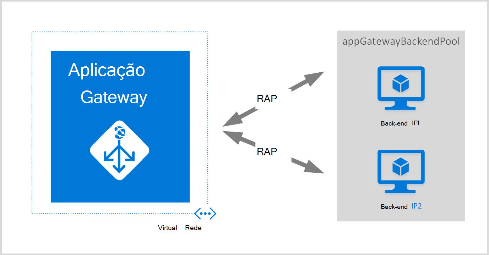
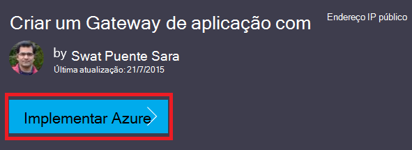
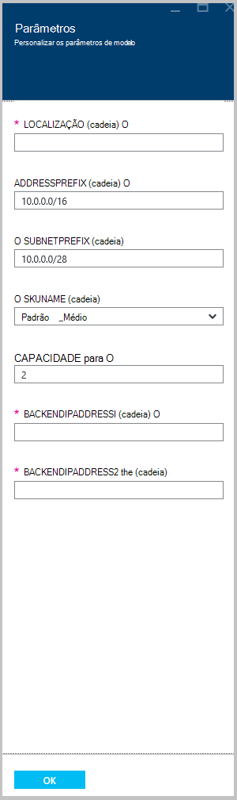

<properties
   pageTitle="Criar um gateway aplicação utilizando o Gestor de recursos do Azure modelos | Microsoft Azure"
   description="Esta página disponibiliza instruções para criar um gateway aplicação Azure utilizando o modelo de Gestor de recursos do Azure"
   documentationCenter="na"
   services="application-gateway"
   authors="georgewallace"
   manager="carmonm"
   editor="tysonn"/>
<tags
   ms.service="application-gateway"
   ms.devlang="na"
   ms.topic="article"
   ms.tgt_pltfrm="na"
   ms.workload="infrastructure-services"
   ms.date="10/25/2016"
   ms.author="gwallace"/>

# Criar um gateway aplicação utilizando o modelo de Gestor de recursos do Azure

> [AZURE.SELECTOR]
- [Portal do Azure](application-gateway-create-gateway-portal.md)
- [Azure PowerShell do Gestor de recursos](application-gateway-create-gateway-arm.md)
- [Azure PowerShell clássico](application-gateway-create-gateway.md)
- [Modelo do Gestor de recursos Azure](application-gateway-create-gateway-arm-template.md)
- [Clip Azure](application-gateway-create-gateway-cli.md)

Azure de aplicação de Gateway é um balanceador de carga de camada-7. Fornece falha na ligação, pedidos HTTP encaminhamento de desempenho entre servidores diferentes, quer estejam na nuvem ou no local. Aplicação Gateway fornece muitas controlador de entrega de aplicação (ADC) das funcionalidades incluindo balanceamento de carga HTTP afinidade sessão baseada em cookies, Secure Sockets Layer (SSL) descarregar, o estado de funcionamento personalizado sondas, suporte para múltiplos sites e muitas outras. Para localizar uma lista completa das funcionalidades suportadas, visite [Descrição geral de Gateway de aplicação](application-gateway-introduction.md)

Saiba como transferir e modificar um modelo de Gestor de recursos do Azure existente a partir do GitHub e implementar o modelo do GitHub, PowerShell e o clip do Azure.

Se estiver simplesmente a implementar o modelo de Gestor de recursos do Azure diretamente a partir do GitHub sem alterações, avance para implementar um modelo a partir de GitHub.

## Cenário

Neste cenário irá:

- Crie um gateway aplicação com duas instâncias.
- Crie uma rede virtual denominada VirtualNetwork1 com um bloco CIDR reservado de 10.0.0.0/16.
- Crie uma sub-rede denominada Appgatewaysubnet que utiliza 10.0.0.0/28 como o seu bloco CIDR.
- Configurar o duas configurou anteriormente IPs back-end para os servidores de web que pretende balanceamento de carga, o tráfego. Neste exemplo de modelo, o IPs back-end são 10.0.1.10 e 10.0.1.11.

>[AZURE.NOTE] Estas definições são os parâmetros para este modelo. Para personalizar o modelo, pode alterar regras, a escuta e o que é aberta a azuredeploy.json SSL.

## Transferir e compreender o modelo de Gestor de recursos do Azure

Pode transferir o modelo de Gestor de recursos do Azure existente para criar uma rede virtual e duas sub-redes a partir de GitHub, efetue as alterações que poderá pretende e reutilizá-la. Para fazê-lo, utilize os passos seguintes:

1. Navegue para [criar o Gateway de aplicação](https://github.com/Azure/azure-quickstart-templates/tree/master/101-application-gateway-create).
2. Clique em **azuredeploy.json**e, em seguida, clique em **matéria-PRIMA**.
3. Guarde o ficheiro para uma pasta local no seu computador.
4. Se estiver familiarizado com os modelos de Gestor de recursos do Azure, avance para o passo 7.
5. Abra o ficheiro que guardou e veja o conteúdo em **parâmetros** na linha 5. Parâmetros de modelo de Gestor de recursos Azure fornecem um marcador de posição para valores que podem ser preenchidos durante a implementação.

  	| Parâmetro | Descrição |
  	|---|---|
  	| **localização** | Azure região onde é criado o gateway de aplicação |
  	| **VirtualNetwork1** | Nome para a nova rede virtual |
  	| **addressPrefix** | Espaço de endereços para a rede virtual, no formato CIDR |
  	| **ApplicationGatewaysubnet** | Nome para a sub-rede de gateway de aplicação |
  	| **subnetPrefix** | Bloquear CIDR para a sub-rede de gateway de aplicação |
  	| **skuname** | Tamanho da instância SKU |
  	| **capacidade** | Número de ocorrências |
  	| **backendaddress1** | Endereço IP do primeiro servidor web |
  	| **backendaddress2** | Endereço IP do segundo servidor web |

    >[AZURE.IMPORTANT] Podem alterar Azure modelos de Gestor de recursos mantidos nas GitHub ao longo do tempo. Certifique-se de que verifica o modelo antes de o utilizar.

6. Verifique o conteúdo em **recursos** e tenha em atenção o seguinte procedimento:

    - **tipo**. Tipo de recurso a ser criado pelo modelo. Neste caso, o tipo é **Microsoft.Network/applicationGateways**, que representa um gateway de aplicação.
    - **nome**. Nome do recurso. Repare que a utilização de **[parameters('applicationGatewayName')]**, que significa que o nome é fornecido como entrada por si ou por um ficheiro de parâmetro durante a implementação.
    - **Propriedades**. Lista de propriedades para o recurso. Este modelo utiliza a rede virtual e o endereço IP público durante a criação de gateway de aplicação.

7. Navegue até ao [https://github.com/Azure/azure-quickstart-templates/blob/master/101-application-gateway-create/](https://github.com/Azure/azure-quickstart-templates/blob/master/101-application-gateway-create).
8. Clique **azuredeploy paremeters.json**e, em seguida, clique em **matéria-PRIMA**.
9. Guarde o ficheiro para uma pasta local no seu computador.
10. Abra o ficheiro que guardou e edite os valores para os parâmetros. Utilize os seguintes valores para implementar o gateway aplicação descrito no nosso cenário.

        {
        "$schema": "http://schema.management.azure.com/schemas/2015-01-01/deploymentParameters.json#",
        {
        "location" : {
        "value" : "West US"
        },
        "addressPrefix": {
        "value": "10.0.0.0/16"
        },
        "subnetPrefix": {
        "value": "10.0.0.0/24"
        },
        "skuName": {
        "value": "Standard_Small"
        },
        "capacity": {
        "value": 2
        },
        "backendIpAddress1": {
        "value": "10.0.1.10"
        },
        "backendIpAddress2": {
        "value": "10.0.1.11"
        }
        }

11. Guarde o ficheiro. Pode testar o modelo de parâmetro e modelo JSON utilizando ferramentas de validação JSON online como [JSlint.com](http://www.jslint.com/).

## Implementar o modelo de Gestor de recursos do Azure utilizando o PowerShell

Se nunca tiver utilizado o Azure PowerShell, consulte o artigo [como instalar e configurar o Azure PowerShell](../powershell-install-configure.md) e siga as instruções para iniciar sessão no Azure e selecione a sua subscrição.

### Passo 1

    Login-AzureRmAccount

### Passo 2

Verifique as subscrições para a conta.

    Get-AzureRmSubscription

Lhe for pedido para autenticar com as suas credenciais.

### Passo 3

Escolha as suas subscrições Azure para utilizar.

    Select-AzureRmSubscription -Subscriptionid "GUID of subscription"

### Passo 4

Se for necessário, crie um grupo de recursos utilizando o cmdlet **AzureResourceGroup novo** . No exemplo seguinte, crie um grupo de recursos denominado AppgatewayRG na localização do Leste dos EUA.

    New-AzureRmResourceGroup -Name AppgatewayRG -Location "East US"

Execute o cmdlet **AzureRmResourceGroupDeployment novo** para implementar a nova rede virtual utilizando o modelo anterior e ficheiros de parâmetro que transferiu e modificação.

    New-AzureRmResourceGroupDeployment -Name TestAppgatewayDeployment -ResourceGroupName AppgatewayRG `
        -TemplateFile C:\ARM\azuredeploy.json -TemplateParameterFile C:\ARM\azuredeploy-parameters.json

## Implementar o modelo de Gestor de recursos do Azure utilizando o clip do Azure

Para implementar o modelo de Gestor de recursos do Azure que transferiu utilizando Azure clip, siga os passos abaixo:

### Passo 1

Se nunca tiver utilizado o Azure clip, consulte o artigo [instalar e configurar o clip do Azure](../xplat-cli-install.md) e siga as instruções no ponto onde selecionar a sua conta Azure e subscrição.

### Passo 2

Execute o comando de **modo azure config** para mudar para modo de Gestor de recursos, conforme apresentado abaixo.

    azure config mode arm

Eis o resultado esperado para o comando acima:

    info:   New mode is arm

### Passo 3

Se for necessário, execute o comando **Criar grupo azure** para criar um novo grupo de recursos, conforme apresentado abaixo. Repare que a saída do comando. A lista apresentada depois da saída explica os parâmetros utilizados. Para obter mais informações sobre os grupos de recursos, visite [Descrição geral do Gestor de recursos do Azure](../azure-resource-manager/resource-group-overview.md).

    azure group create -n appgatewayRG -l eastus

**-n (ou – nome)**. Nome para o novo grupo de recursos. Para o cenário, é *appgatewayRG*.

**-l (ou – localização)**. Azure região onde é criado o novo grupo de recursos. Para o cenário, é *eastus*.

### Passo 4

Execute o cmdlet **criar de implementação do azure grupo** para implementar a nova rede virtual utilizando os ficheiros de modelo e um parâmetro transferido e modificação acima. A lista apresentada depois da saída explica os parâmetros utilizados.

    azure group deployment create -g appgatewayRG -n TestAppgatewayDeployment -f C:\ARM\azuredeploy.json -e C:\ARM\azuredeploy-parameters.json

## Implementar o modelo de Gestor de recursos do Azure utilizando o clique em implementar

Clique em implementar é outra forma de utilizar os modelos de Gestor de recursos do Azure. É uma forma fácil de utilizar modelos com o portal do Azure.

### Passo 1

Aceda a [criar um gateway de aplicação com o endereço IP público](https://azure.microsoft.com/documentation/templates/101-application-gateway-public-ip/).

### Passo 2

Clique em **Implementar Azure**.

### Passo 3

Preencha os parâmetros para o modelo de implementação no portal de e clique em **OK**.

### Passo 4

Selecionar **jurídicos termos** e clique em **comprar**.

### Passo 5

No pá de implementação personalizada, clique em **Criar**.

## Próximos passos

Se pretende configurar a passagem para da SSL, consulte o artigo [configurar um gateway de aplicação para SSL descarregar](application-gateway-ssl.md).

Se pretender configurar um gateway de aplicação para utilizar com um balanceador de carga interna, consulte o artigo [criar um gateway de aplicação com um balanceador de carga interna (ILB)](application-gateway-ilb.md).

Se pretender obter mais informações sobre carregar balanceamento de opções geral, visite:

- [Balanceador de carga Azure](https://azure.microsoft.com/documentation/services/load-balancer/)
- [Gestor de tráfego Azure](https://azure.microsoft.com/documentation/services/traffic-manager/)
