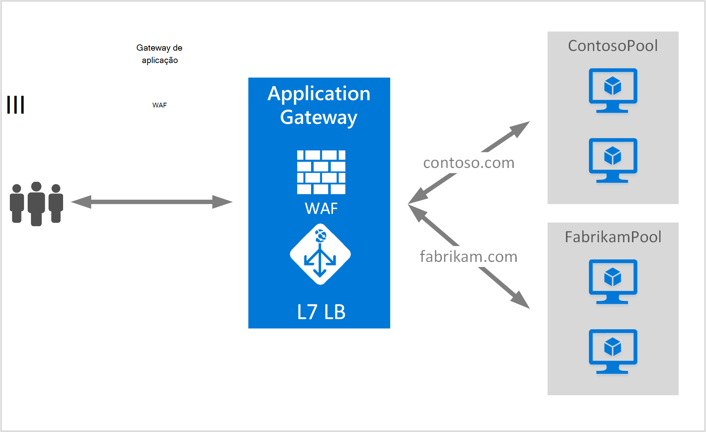

<properties
   pageTitle="Criar um gateway de aplicação para hospedagem de vários sites | Microsoft Azure"
   description="Esta página disponibiliza instruções para criar e configurar um gateway de aplicação Azure para alojar várias aplicações web no mesmo gateway."
   documentationCenter="na"
   services="application-gateway"
   authors="amsriva"
   manager="rossort"
   editor="amsriva"/>
<tags
   ms.service="application-gateway"
   ms.devlang="na"
   ms.topic="article"
   ms.tgt_pltfrm="na"
   ms.workload="infrastructure-services"
   ms.date="10/25/2016"
   ms.author="amsriva"/>

# Criar um gateway de aplicação para o alojamento várias aplicações web

> [AZURE.SELECTOR]
- [Portal do Azure](application-gateway-create-multisite-portal.md)
- [Azure PowerShell do Gestor de recursos](application-gateway-create-multisite-azureresourcemanager-powershell.md)

Vários sites alojamento permite-lhe implementar mais do que uma aplicação web no mesmo gateway de aplicação. Depende de presença de cabeçalho de anfitrião no pedido de HTTP recebido, para determinar qual escuta seria receber tráfego. A escuta direciona, em seguida, o tráfego para conjunto de dados back-end adequado, tal como está configurado na definição de regras do gateway. Nas aplicações de web SSL ativado, gateway aplicação baseia-se a extensão de nome de servidor indicação (SNI) para escolher a escuta correta para o tráfego da web. Uma utilização comum para alojamento de sites vários consiste em carregar saldo pedidos para domínios de web diferente para agrupamentos de servidor de back-end diferente. Da mesma forma vários subdomínios do domínio de raiz da mesma também podem ser alojados no mesmo gateway de aplicação.

## Cenário

No exemplo seguinte, gateway aplicação é servir o tráfego para contoso.com e fabrikam.com com dois conjuntos de servidor back-end: contoso conjunto do servidor e fabrikam conjunto de servidor. Configuração semelhante pode ser utilizadas para subdomínios anfitrião como app.contoso.com e blog.contoso.com.

## Antes de começar

1. Instale a versão mais recente dos cmdlets do Azure PowerShell utilizando o instalador do plataforma Web. Pode transferir e instalar a versão mais recente da secção da [página de transferências do](https://azure.microsoft.com/downloads/) **Windows PowerShell** .
2. Os servidores de adicionadas ao agrupamento de back-end a utilizar o gateway aplicação tem de existir ou tem os respetivos pontos finais criado ou na rede virtual numa sub-rede separada ou com um VIP/IP público atribuídas.

## Requisitos de

- **Conjunto do servidor de back-end:** A lista de endereços IP dos servidores de back-end. Endereços IP listados quer devem pertencem à sub-rede rede virtual ou devem ser VIP/IP público. Também pode ser utilizado o FQDN.
- **Definições de conjunto de dados back-end servidor:** Cada conjunto tem definições como porta, protocolo e afinidade com base em cookies. Estas definições estão associadas a um agrupamento e são aplicadas a todos os servidores dentro do conjunto.
- **Porta front-end:** Esta porta é a pública porta que é aberta no gateway aplicação. Tráfego esta porta de acertos e, em seguida, redireccionado para um dos servidores de back-end.
- **Escuta:** A escuta tem uma porta front-end, um protocolo (Http ou Https, estes valores são entre maiúsculas e minúsculas) e o nome do certificado SSL (se configurar SSL descarregar). Para gateways aplicação ativada múltiplos sites, nome do anfitrião e indicadores SNI também são adicionados.
- **Regra:** A regra vincula automaticamente o serviço de escuta, o conjunto de servidor back-end e define qual conjunto de servidor back-end o tráfego deve ser direcionado para quando acertos de uma determinada escuta.

## Criar um gateway de aplicação

Seguem-se os passos necessários para criar um gateway de aplicação:

1. Crie um grupo de recursos para Gestor de recursos.
2. Crie uma rede virtual, sub-redes e endereço IP público para o gateway de aplicação.
3. Crie um objeto de configuração de gateway de aplicação.
4. Crie um recurso de gateway de aplicação.

## Criar um grupo de recursos para Gestor de recursos

Certifique-se de que está a utilizar a versão mais recente do Azure PowerShell. Obter mais informações estão disponíveis em [Utilizar o Windows PowerShell com o Gestor de recursos](../powershell-azure-resource-manager.md).

### Passo 1

Iniciar sessão no Azure

    Login-AzureRmAccount

Lhe for pedido para autenticar com as suas credenciais.

### Passo 2

Verifique as subscrições para a conta.

    Get-AzureRmSubscription

### Passo 3

Escolha as suas subscrições Azure para utilizar.

    Select-AzureRmSubscription -SubscriptionName "Name of subscription"

### Passo 4

Crie um grupo de recursos (ignorar este passo se estiver a utilizar um grupo de recursos existente).

    New-AzureRmResourceGroup -Name appgw-RG -location "West US"

Em alternativa também pode criar etiquetas para um grupo de recursos para o gateway de aplicação:

    $resourceGroup = New-AzureRmResourceGroup -Name appgw-RG -Location "West US" -Tags @{Name = "testtag"; Value = "Application Gateway multiple site"}

Gestor de recursos do Azure requer que todos os grupos de recursos, especifique uma localização. Esta localização é utilizada como a localização predefinida para recursos nesse grupo de recursos. Certifique-se de que todos os comandos para criar um gateway aplicação utilizam o mesmo grupo de recursos.

No exemplo acima, criámos de um grupo de recursos denominado "appgw-RG" com uma localização dos "Oeste casos".

>[AZURE.NOTE] Se precisar de configurar uma sonda personalizada para o gateway de aplicação, consulte o artigo [criar um gateway de aplicação com sondas personalizados utilizando o PowerShell](application-gateway-create-probe-ps.md). Visite [as pesquisas personalizadas e os do Estado de funcionamento de monitorização](application-gateway-probe-overview.md) para obter mais informações.

## Criar uma rede virtual e sub-redes

O exemplo seguinte mostra como criar uma rede virtual utilizando o Gestor de recursos. Duas sub-redes são criados neste passo. É a primeira sub-rede para o gateway aplicação propriamente dita. Gateway aplicação requer a sua própria sub-rede para colocar em espera respectivas instâncias. Apenas outros gateways aplicação podem ser implementados nessa sub-rede. A segunda sub-rede é utilizada para os servidores de back-end aplicações colocar em espera.

### Passo 1

Atribua a 10.0.0.0/24 intervalo endereço para a variável de sub-rede para ser utilizado para colocar em espera o gateway de aplicação.

    $subnet = New-AzureRmVirtualNetworkSubnetConfig -Name appgatewaysubnet -AddressPrefix 10.0.0.0/24

### Passo 2

Atribua a 10.0.1.0/24 intervalo endereço para a variável de sub-rede2 a ser utilizada para os conjuntos de dados back-end.

    $subnet2 = New-AzureRmVirtualNetworkSubnetConfig -Name backendsubnet -AddressPrefix 10.0.1.0/24

### Passo 3

Criar uma rede virtual com o nome "appgwvnet" no recurso grupo "appgw-rg" região EUA Ocidental utilizando o prefixo 10.0.0.0/16 com sub-rede 10.0.0.0/24 e 10.0.1.0/24.

    $vnet = New-AzureRmVirtualNetwork -Name appgwvnet -ResourceGroupName appgw-RG -Location "West US" -AddressPrefix 10.0.0.0/16 -Subnet $subnet,$subnet2

### Passo 4

Atribua uma variável de sub-rede para os passos seguintes, que cria um gateway de aplicação.

    $appgatewaysubnet = Get-AzureRmVirtualNetworkSubnetConfig -Name appgatewaysubnet -VirtualNetwork $vnet
    $backendsubnet = Get-AzureRmVirtualNetworkSubnetConfig -Name backendsubnet -VirtualNetwork $vnet

## Criar um endereço IP público para a configuração de front-end

Crie um recurso IP público "publicIP01" no recurso grupo "appgw-rg" região ocidental dos EUA.

    $publicip = New-AzureRmPublicIpAddress -ResourceGroupName appgw-RG -name publicIP01 -location "West US" -AllocationMethod Dynamic

Um endereço IP é atribuído para o gateway aplicação quando o serviço é iniciado.

## Criar a configuração de gateway da aplicação

Tem de configurar todos os itens de configuração antes de criar o gateway de aplicação. Os passos seguintes criam os itens de configuração que são necessários para um recurso de gateway de aplicação.

### Passo 1

Crie uma configuração da aplicação gateway IP com o nome "gatewayIP01". Quando inicia o gateway de aplicação, levantar o auscultador de um endereço IP da sub-rede configurado e encaminhar o tráfego de rede para os endereços IP no conjunto de IP back-end. Tenha em atenção que cada instância leva-o até um endereço IP.

    $gipconfig = New-AzureRmApplicationGatewayIPConfiguration -Name gatewayIP01 -Subnet $appgatewaysubnet

### Passo 2

Configurar o conjunto de endereços IP de back-end com o nome "pool01" e "pool2" com endereços IP "10.0.1.100, 10.0.1.101,10.0.1.102" para "pool1" e "10.0.1.103, 10.0.1.104, 10.0.1.105" para "pool2".

    $pool1 = New-AzureRmApplicationGatewayBackendAddressPool -Name pool01 -BackendIPAddresses 10.0.1.100, 10.0.1.101, 10.0.1.102
    $pool2 = New-AzureRmApplicationGatewayBackendAddressPool -Name pool02 -BackendIPAddresses 10.0.1.103, 10.0.1.104, 10.0.1.105

Neste exemplo, existem dois conjuntos de dados back-end para encaminhar o tráfego de rede com base no site do pedido. Um conjunto de dados recebe tráfego a partir do site "contoso.com" e outros agrupamento recebe tráfego a partir do site "fabrikam.com". Tem de substituir os endereços IP anteriores para adicionar o seus próprio os pontos finais de endereço do IP de aplicação. Em vez de endereços IP internos, pode também utilizar endereços IP públicos, FQDN ou uma VM NIC para instâncias de back-end. Utilizar "-BackendFQDNs" parâmetro no PowerShell para especificar FQDNs em vez de IPs.

### Passo 3

Configure a definição de gateway aplicação "poolsetting01" e "poolsetting02" para o tráfego de rede balanceamento de carga no conjunto de back-end. Neste exemplo, irá configurar definições de conjunto de dados back-end diferentes para os conjuntos de dados back-end. Cada conjunto de back-end pode ter as suas próprias definição do conjunto de dados back-end.

    $poolSetting01 = New-AzureRmApplicationGatewayBackendHttpSettings -Name "besetting01" -Port 80 -Protocol Http -CookieBasedAffinity Disabled -RequestTimeout 120
    $poolSetting02 = New-AzureRmApplicationGatewayBackendHttpSettings -Name "besetting02" -Port 80 -Protocol Http -CookieBasedAffinity Enabled -RequestTimeout 240

### Passo 4

Configure o front-end PI com ponto final IP público.

    $fipconfig01 = New-AzureRmApplicationGatewayFrontendIPConfig -Name "frontend1" -PublicIPAddress $publicip

### Passo 5

Configure a porta front-end para um gateway de aplicação.

    $fp01 = New-AzureRmApplicationGatewayFrontendPort -Name "fep01" -Port 443

### Passo 6

Configure duas certificados SSL para os dois sites públicos que vamos para suportar neste exemplo. É um certificado para o tráfego de contoso.com e a outra é para o tráfego de fabrikam.com. Estes certificados devem ser uma autoridade de certificação emitido certificados para os seus Web sites. Certificados autoassinados são suportados, mas não são recomendados para o tráfego de produção.

    $cert01 = New-AzureRmApplicationGatewaySslCertificate -Name contosocert -CertificateFile <file path> -Password <password>
    $cert02 = New-AzureRmApplicationGatewaySslCertificate -Name fabrikamcert -CertificateFile <file path> -Password <password>

### Passo 7

Configure duas listeners para os dois web sites neste exemplo. Este passo configura listeners para o endereço, porta e anfitrião utilizado para receber o tráfego de entrada IP público. Parâmetro de nome do anfitrião é necessário para o suporte de múltiplos sites e deve ser definido para o site adequado para a qual o tráfego for recebido. Parâmetro de RequireServerNameIndication deve ser definido como verdadeiro para Web sites que precisa de apoio para SSL num cenário com vários anfitrião. Se for necessário suporte de SSL, também tem de especificar o certificado SSL que é utilizado para proteger o tráfego para essa aplicação web. Tem de ser exclusiva para uma escuta a combinação de FrontendIPConfiguration, FrontendPort e nome do anfitrião. Cada escuta pode suportar um certificado.

    $listener01 = New-AzureRmApplicationGatewayHttpListener -Name "listener01" -Protocol Https -FrontendIPConfiguration $fipconfig01 -FrontendPort $fp01 -HostName "contoso11.com" -RequireServerNameIndication true  -SslCertificate $cert01
    $listener02 = New-AzureRmApplicationGatewayHttpListener -Name "listener02" -Protocol Https -FrontendIPConfiguration $fipconfig01 -FrontendPort $fp01 -HostName "fabrikam11.com" -RequireServerNameIndication true -SslCertificate $cert02

### Passo 8

Crie duas definição regra para as aplicações duas web neste exemplo. Uma regra une listeners, conjuntos de dados back-end e definições de http. Este passo configura o gateway de aplicação para utilizar a regra de encaminhamento básica, uma para cada site. O tráfego para cada site é recebido pelo respetiva escuta configurada e, em seguida, é direcionado para o conjunto de dados back-end configurado, utilizando as propriedades especificadas na BackendHttpSettings.

    $rule01 = New-AzureRmApplicationGatewayRequestRoutingRule -Name "rule01" -RuleType Basic -HttpListener $listener01 -BackendHttpSettings $poolSetting01 -BackendAddressPool $pool1
    $rule02 = New-AzureRmApplicationGatewayRequestRoutingRule -Name "rule02" -RuleType Basic -HttpListener $listener02 -BackendHttpSettings $poolSetting02 -BackendAddressPool $pool2

### Passo 9

Configure o número de instâncias e tamanho para o gateway de aplicação.

    $sku = New-AzureRmApplicationGatewaySku -Name "Standard_Medium" -Tier Standard -Capacity 2

## Criar o gateway de aplicação

Crie um gateway aplicação com todos os objetos de configuração dos passos anteriores.

    $appgw = New-AzureRmApplicationGateway -Name appgwtest -ResourceGroupName appgw-RG -Location "West US" -BackendAddressPools $pool1,$pool2 -BackendHttpSettingsCollection $poolSetting01, $poolSetting02 -FrontendIpConfigurations $fipconfig01 -GatewayIpConfigurations $gipconfig -FrontendPorts $fp01 -HttpListeners $listener01, $listener02 -RequestRoutingRules $rule01, $rule02 -Sku $sku -SslCertificates $cert01, $cert02

>[AZURE.IMPORTANT] Aplicação de aprovisionamento de Gateway é uma operação de execução longa e poderá demorar algum tempo para concluir.

## Obter o nome da aplicação gateway DNS

Quando estiver criado o gateway, o próximo passo é configurar o front-end para a comunicação. Ao utilizar um endereço IP público, o gateway aplicação requer um nome DNS atribuído dinamicamente, que não é compatível com. Para garantir que os utilizadores finais pode premir o gateway aplicação um registo CNAME pode ser utilizada para apontar para o público ponto final do gateway aplicação. [Configurar um nome de domínio personalizado para no Azure](../cloud-services/cloud-services-custom-domain-name-portal.md). Para fazer isto, Obtenha detalhes do gateway aplicação e o nome do IP/DNS associado utilizando o elemento PublicIPAddress anexado para o gateway de aplicação. Nome de DNS do gateway aplicação deverá ser utilizada para criar um registo CNAME, que aponta as aplicações duas web para este nome de DNS. Não é recomendada a utilização de registos de uma vez que o VIP podem ser alteradas no reinício do gateway de aplicação.
    
    Get-AzureRmPublicIpAddress -ResourceGroupName appgw-RG -Name publicIP01
        
    Name                     : publicIP01
    ResourceGroupName        : appgw-RG
    Location                 : westus
    Id                       : /subscriptions/<subscription_id>/resourceGroups/appgw-RG/providers/Microsoft.Network/publicIPAddresses/publicIP01
    Etag                     : W/"00000d5b-54ed-4907-bae8-99bd5766d0e5"
    ResourceGuid             : 00000000-0000-0000-0000-000000000000
    ProvisioningState        : Succeeded
    Tags                     : 
    PublicIpAllocationMethod : Dynamic
    IpAddress                : xx.xx.xxx.xx
    PublicIpAddressVersion   : IPv4
    IdleTimeoutInMinutes     : 4
    IpConfiguration          : {
                                 "Id": "/subscriptions/<subscription_id>/resourceGroups/appgw-RG/providers/Microsoft.Network/applicationGateways/appgwtest/frontendIP
                               Configurations/frontend1"
                               }
    DnsSettings              : {
                                 "Fqdn": "00000000-0000-xxxx-xxxx-xxxxxxxxxxxx.cloudapp.net"
                               }

## Próximos passos

Saiba como pode proteger os seus Web sites com a [Aplicação de Gateway - Firewall de aplicação Web](application-gateway-webapplicationfirewall-overview.md)