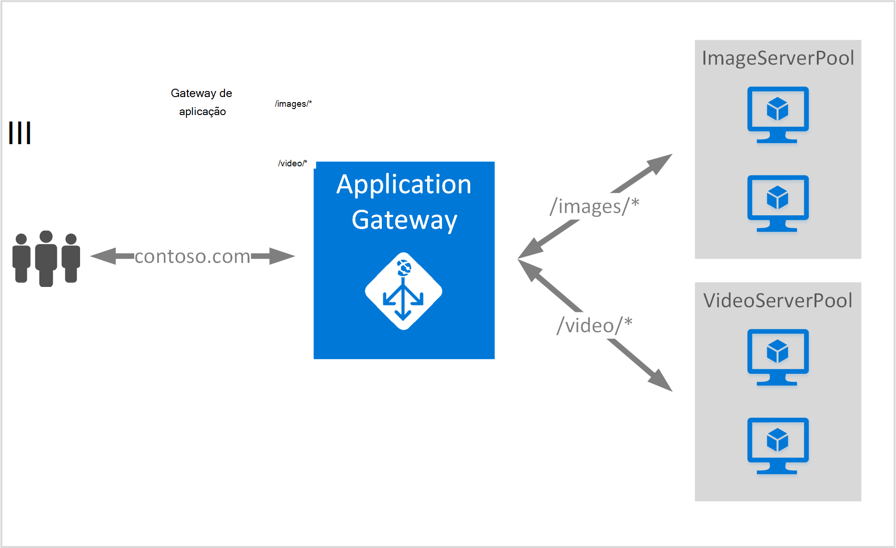

<properties
   pageTitle="Criar um gateway de aplicação utilizando regras de encaminhamento de URL | Microsoft Azure"
   description="Esta página disponibiliza instruções para criar e configurar um gateway de aplicação Azure utilizando regras de encaminhamento de URL"
   documentationCenter="na"
   services="application-gateway"
   authors="georgewallace"
   manager="jdial"
   editor="tysonn"/>
<tags
   ms.service="application-gateway"
   ms.devlang="na"
   ms.topic="article"
   ms.tgt_pltfrm="na"
   ms.workload="infrastructure-services"
   ms.date="10/25/2016"
   ms.author="gwallace"/>

# Criar um gateway de aplicação utilizar o encaminhamento de com base no caminho 

> [AZURE.SELECTOR]
- [Portal do Azure](application-gateway-create-url-route-portal.md)
- [Azure PowerShell do Gestor de recursos](application-gateway-create-url-route-arm-ps.md)

Encaminhamento de baseado no caminho de URL permite-lhe associar rotas com base no caminho do URL de pedido de Http. Verifica se existir uma rota para um conjunto de dados back-end configurado para as listas de URL no Gateway de aplicação e enviar o tráfego de rede para o conjunto de dados back-end definido. Uma utilização comum para o encaminhamento de baseados em URL consiste em carregar saldo pedidos para diferentes tipos de conteúdo para conjuntos de servidor de back-end diferente.

Baseada em URL encaminhamento introduz um novo tipo de regra para gateway de aplicação. Gateway aplicação tem dois tipos de regra: básicas e PathBasedRouting. Tipo de regra básicas fornece suporte de round robin para os conjuntos de back-end enquanto PathBasedRouting para além de distribuição round robin, atende também padrão de caminho do URL pedido ao escolher o agrupamento de back-end.

>[AZURE.IMPORTANT] PathPattern: A lista de padrões de caminho para corresponder ao. Cada tem de iniciar com / e o local apenas um "\*" é permitido se encontra no fim. Exemplos válidos são /xyz, /xyz* ou /xyz/*. A cadeia Moro para matcher o caminho não incluir qualquer texto após a primeira "?" ou "#" e essas carateres não são permitidas. 

## Cenário
No exemplo seguinte, Gateway aplicação é servir o tráfego para contoso.com com dois conjuntos de servidor back-end: conjunto do servidor de vídeo e conjunto de servidor de imagem.

Pedidos de http://contoso.com/image* são encaminhados para o conjunto de servidor de imagem (pool1) e http://contoso.com/video* são encaminhados para o conjunto de vídeo do servidor (pool2). Um conjunto de servidor predefinido (pool1) está selecionado se corresponder a nenhum dos padrões de caminho.

## Antes de começar

1. Instale a versão mais recente dos cmdlets do Azure PowerShell utilizando o instalador do plataforma Web. Pode transferir e instalar a versão mais recente da secção da [página de transferências do](https://azure.microsoft.com/downloads/) **Windows PowerShell** .
2. Criar uma rede virtual e sub-rede para o Gateway de aplicação. Certifique-se de que nenhuma máquinas virtuais ou na nuvem implementações estão a utilizar a sub-rede. O gateway aplicação tem de ser por si só, numa sub-rede rede virtual.
3. Os servidores de adicionadas ao agrupamento de back-end a utilizar o gateway aplicação tem de existir ou tem os respetivos pontos finais criado na rede virtual ou com um VIP/IP público atribuídas.

## O que é necessário para criar um gateway aplicação?

- **Conjunto do servidor de back-end:** A lista de endereços IP dos servidores de back-end. Endereços IP listados quer devem pertencem à sub-rede rede virtual ou devem ser VIP/IP público.
- **Definições de conjunto de dados back-end servidor:** Cada conjunto tem definições como porta, protocolo e afinidade com base em cookies. Estas definições estão associadas a um agrupamento e são aplicadas a todos os servidores dentro do conjunto.
- **Porta front-end:** Esta porta é a pública porta que é aberta no gateway aplicação. Tráfego esta porta de acertos e, em seguida, redireccionado para um dos servidores de back-end.
- **Escuta:** A escuta tem uma porta front-end, um protocolo (Http ou Https, estes são entre maiúsculas e minúsculas) e o nome do certificado SSL (se configurar SSL descarregar).
- **Regra:** A regra vincula automaticamente o serviço de escuta, o agrupamento de servidor back-end e define qual conjunto de servidor back-end o tráfego deve ser direcionado para quando acertos de uma determinada escuta.

## Criar um gateway de aplicação

A diferença entre a utilizar o Azure clássica e o Gestor de recursos do Azure é a ordem pela qual cria o gateway de aplicação e os itens que têm de ser configurado.

Com o Gestor de recursos, todos os itens que tornam um gateway de aplicação estão configurados individualmente e, em seguida, colocar em conjunto para criar o recurso de gateway de aplicação.

Eis os passos que são necessários para criar um gateway de aplicação:

1. Crie um grupo de recursos para Gestor de recursos.
2. Crie uma rede virtual, sub-rede e endereço IP público para o gateway de aplicação.
3. Crie um objeto de configuração de gateway de aplicação.
4. Crie um recurso de gateway de aplicação.

## Criar um grupo de recursos para Gestor de recursos

Certifique-se de que está a utilizar a versão mais recente do Azure PowerShell. Mais informações estão disponível em [Utilizar o Windows PowerShell com o Gestor de recursos](../powershell-azure-resource-manager.md).

### Passo 1

Iniciar sessão no Azure

    Login-AzureRmAccount

Lhe for pedido para autenticar com as suas credenciais. 

### Passo 2

Verifique as subscrições para a conta.

    Get-AzureRmSubscription

### Passo 3

Escolha as suas subscrições Azure para utilizar.  

    Select-AzureRmSubscription -Subscriptionid "GUID of subscription"

### Passo 4

Crie um grupo de recursos (ignorar este passo se estiver a utilizar um grupo de recursos existente).

    New-AzureRmResourceGroup -Name appgw-RG -Location "West US"

Em alternativa também pode criar etiquetas para um grupo de recursos para o gateway de aplicação:
    
    $resourceGroup = New-AzureRmResourceGroup -Name appgw-RG -Location "West US" -Tags @{Name = "testtag"; Value = "Application Gateway URL routing"} 

Gestor de recursos do Azure requer que todos os grupos de recursos, especifique uma localização. É utilizada como a localização predefinida para recursos nesse grupo de recursos. Certifique-se de que todos os comandos para criar um gateway aplicação utilizam o mesmo grupo de recursos.

No exemplo acima, criámos de um grupo de recursos denominado "appgw RG" e a localização "Oeste-nos".

>[AZURE.NOTE] Se precisar de configurar uma sonda personalizada para o gateway de aplicação, consulte o artigo [criar um gateway de aplicação com sondas personalizados utilizando o PowerShell](application-gateway-create-probe-ps.md). Veja [as pesquisas personalizadas e os do Estado de funcionamento de monitorização](application-gateway-probe-overview.md) para obter mais informações.

## Criar uma rede virtual e uma sub-rede para o gateway de aplicação

O exemplo seguinte mostra como criar uma rede virtual utilizando o Gestor de recursos.

### Passo 1

Atribua a 10.0.0.0/24 intervalo endereço para a variável de sub-rede para ser utilizado para criar uma rede virtual.

    $subnet = New-AzureRmVirtualNetworkSubnetConfig -Name subnet01 -AddressPrefix 10.0.0.0/24

### Passo 2

Crie uma rede virtual com o nome "appgwvnet" no recurso grupo "appgw-rg" utilizando o prefixo 10.0.0.0/16 com sub-rede 10.0.0.0/24 à região ocidental dos EUA.

    $vnet = New-AzureRmVirtualNetwork -Name appgwvnet -ResourceGroupName appgw-RG -Location "West US" -AddressPrefix 10.0.0.0/16 -Subnet $subnet

### Passo 3

Atribua uma variável de sub-rede para os passos seguintes, que cria um gateway de aplicação.

    $subnet=$vnet.Subnets[0]

## Criar um endereço IP público para a configuração de front-end

Crie um recurso IP público "publicIP01" no recurso grupo "appgw-rg" região ocidental dos EUA.

    $publicip = New-AzureRmPublicIpAddress -ResourceGroupName appgw-RG -name publicIP01 -location "West US" -AllocationMethod Dynamic

Um endereço IP é atribuído para o gateway aplicação quando o serviço é iniciado.

## Criar a configuração de gateway da aplicação

Todos os itens de configuração tem de ser configurados antes de criar o gateway de aplicação. Os passos seguintes criam os itens de configuração que são necessários para um recurso de gateway de aplicação.

### Passo 1

Crie uma configuração da aplicação gateway IP com o nome "gatewayIP01". Quando inicia o Gateway de aplicação, levantar o auscultador de um endereço IP da sub-rede configurado e encaminhar o tráfego de rede para os endereços IP no conjunto de IP back-end. Tenha em atenção que cada instância leva-o até um endereço IP.

    $gipconfig = New-AzureRmApplicationGatewayIPConfiguration -Name gatewayIP01 -Subnet $subnet

### Passo 2

Configurar o conjunto de endereços IP de back-end com o nome "pool01" e "pool2" com endereços IP "134.170.185.46, 134.170.188.221,134.170.185.50" para "pool1" e "134.170.186.46, 134.170.189.221,134.170.186.50" para "pool2".

    $pool1 = New-AzureRmApplicationGatewayBackendAddressPool -Name pool01 -BackendIPAddresses 134.170.185.46, 134.170.188.221,134.170.185.50

    $pool2 = New-AzureRmApplicationGatewayBackendAddressPool -Name pool02 -BackendIPAddresses 134.170.186.46, 134.170.189.221,134.170.186.50

Neste exemplo, existem dois conjuntos de dados back-end para encaminhar o tráfego de rede com base no caminho do URL. Um conjunto de dados recebe tráfego de caminho de URL "/ vídeo" e outro conjunto de receber o tráfego de caminho "/ imagem". Substitua os endereços IP anteriores para adicionar o seus próprio os pontos finais de endereço do IP de aplicação. 

### Passo 3

Configure a definição de gateway aplicação "poolsetting01" e "poolsetting02" para o tráfego de rede balanceamento de carga no conjunto de back-end. Neste exemplo, irá configurar definições de conjunto de dados back-end diferentes para os conjuntos de dados back-end. Cada conjunto de back-end pode ter as suas próprias definição do conjunto de dados back-end.

    $poolSetting01 = New-AzureRmApplicationGatewayBackendHttpSettings -Name "besetting01" -Port 80 -Protocol Http -CookieBasedAffinity Disabled -RequestTimeout 120

    $poolSetting02 = New-AzureRmApplicationGatewayBackendHttpSettings -Name "besetting02" -Port 80 -Protocol Http -CookieBasedAffinity Enabled -RequestTimeout 240

### Passo 4

Configure o front-end PI com ponto final IP público.

    $fipconfig01 = New-AzureRmApplicationGatewayFrontendIPConfig -Name "frontend1" -PublicIPAddress $publicip

### Passo 5 

Configure a porta front-end para um gateway de aplicação.

    $fp01 = New-AzureRmApplicationGatewayFrontendPort -Name "fep01" -Port 80
### Passo 6

Configure a escuta. Este passo configura a escuta para o endereço IP público e a porta utilizado para receber o tráfego de rede recebido. 
 
    $listener = New-AzureRmApplicationGatewayHttpListener -Name "listener01" -Protocol Http -FrontendIPConfiguration $fipconfig01 -FrontendPort $fp01

### Passo 7 

Configure caminhos de regra de URL para os conjuntos de dados back-end. Este passo configura o caminho relativo utilizado pelo gateway de aplicação para definir o mapeamento entre caminho de URL e é atribuído qual conjunto de back-end para processar o tráfego de entrada.

O exemplo abaixo cria duas regras: uma para "/ imagem /" caminho encaminhar o tráfego para o back-end "pool1" e outro para "/ vídeo /" caminho encaminhar o tráfego para o back-end "pool2".
    
    $imagePathRule = New-AzureRmApplicationGatewayPathRuleConfig -Name "pathrule1" -Paths "/image/*" -BackendAddressPool $pool1 -BackendHttpSettings $poolSetting01

    $videoPathRule = New-AzureRmApplicationGatewayPathRuleConfig -Name "pathrule2" -Paths "/video/*" -BackendAddressPool $pool2 -BackendHttpSettings $poolSetting02

A configuração de mapa de caminho regra também configura um conjunto de endereços de back-end predefinição se o caminho não corresponder a nenhum das regras de caminho predefinidos. 

    $urlPathMap = New-AzureRmApplicationGatewayUrlPathMapConfig -Name "urlpathmap" -PathRules $videoPathRule, $imagePathRule -DefaultBackendAddressPool $pool1 -DefaultBackendHttpSettings $poolSetting02

### Passo 8

Crie uma definição de regra. Este passo configura o gateway de aplicação para utilizar o encaminhamento de com base no caminho de URL.

    $rule01 = New-AzureRmApplicationGatewayRequestRoutingRule -Name "rule1" -RuleType PathBasedRouting -HttpListener $listener -UrlPathMap $urlPathMap

### Passo 9

Configure o número de instâncias e tamanho para o gateway de aplicação.

    $sku = New-AzureRmApplicationGatewaySku -Name "Standard_Small" -Tier Standard -Capacity 2

## Criar o Gateway de aplicação

Crie um gateway aplicação com todos os objetos de configuração dos passos anteriores.

    $appgw = New-AzureRmApplicationGateway -Name appgwtest -ResourceGroupName appgw-RG -Location "West US" -BackendAddressPools $pool1,$pool2 -BackendHttpSettingsCollection $poolSetting01, $poolSetting02 -FrontendIpConfigurations $fipconfig01 -GatewayIpConfigurations $gipconfig -FrontendPorts $fp01 -HttpListeners $listener -UrlPathMaps $urlPathMap -RequestRoutingRules $rule01 -Sku $sku

## Obter o nome da aplicação gateway DNS

Quando estiver criado o gateway, o próximo passo é configurar o front-end para a comunicação. Ao utilizar um endereço IP público, o gateway aplicação requer um nome DNS atribuído dinamicamente, que não é compatível com. Para garantir que os utilizadores finais pode premir o gateway aplicação um registo CNAME pode ser utilizada para apontar para o público ponto final do gateway aplicação. [Configurar um nome de domínio personalizado para no Azure](../cloud-services/cloud-services-custom-domain-name-portal.md). Para fazer isto, Obtenha detalhes do gateway aplicação e o nome do IP/DNS associado utilizando o elemento PublicIPAddress anexado para o gateway de aplicação. Nome de DNS do gateway aplicação deverá ser utilizada para criar um registo CNAME, que aponta as aplicações duas web para este nome de DNS. Não é recomendada a utilização de registos de uma vez que o VIP podem ser alteradas no reinício do gateway de aplicação.
    
    Get-AzureRmPublicIpAddress -ResourceGroupName appgw-RG -Name publicIP01
        
    Name                     : publicIP01
    ResourceGroupName        : appgw-RG
    Location                 : westus
    Id                       : /subscriptions/<subscription_id>/resourceGroups/appgw-RG/providers/Microsoft.Network/publicIPAddresses/publicIP01
    Etag                     : W/"00000d5b-54ed-4907-bae8-99bd5766d0e5"
    ResourceGuid             : 00000000-0000-0000-0000-000000000000
    ProvisioningState        : Succeeded
    Tags                     : 
    PublicIpAllocationMethod : Dynamic
    IpAddress                : xx.xx.xxx.xx
    PublicIpAddressVersion   : IPv4
    IdleTimeoutInMinutes     : 4
    IpConfiguration          : {
                                 "Id": "/subscriptions/<subscription_id>/resourceGroups/appgw-RG/providers/Microsoft.Network/applicationGateways/appgwtest/frontendIP
                               Configurations/frontend1"
                               }
    DnsSettings              : {
                                 "Fqdn": "00000000-0000-xxxx-xxxx-xxxxxxxxxxxx.cloudapp.net"
                               }

## Próximos passos

Se quiser saber a passagem para da Secure Sockets Layer (SSL), consulte o artigo [configurar um gateway de aplicação para SSL descarregar](application-gateway-ssl-arm.md).