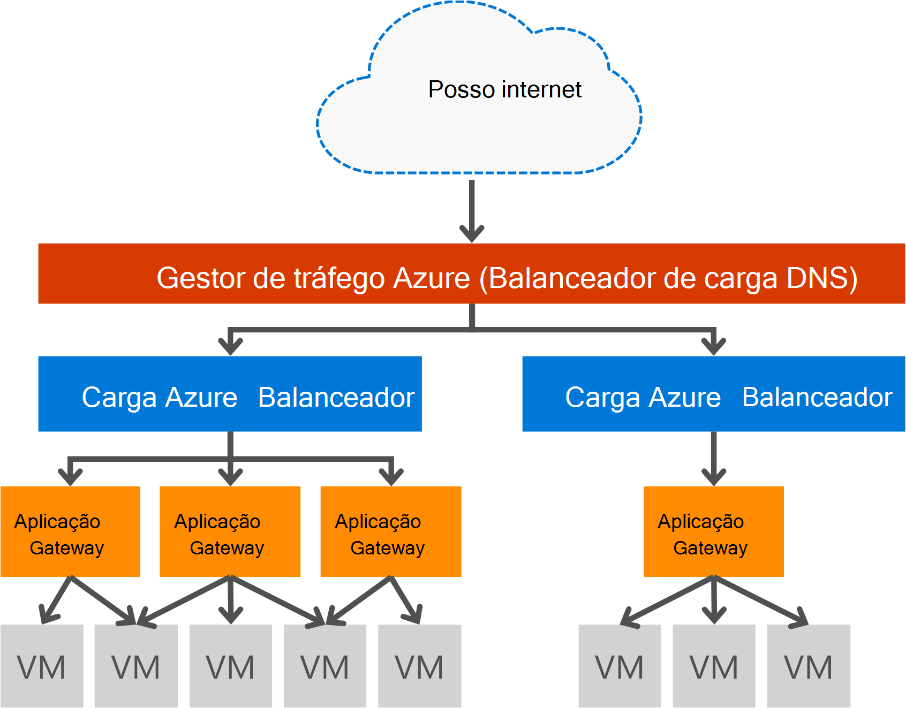

<properties
   pageTitle="Introdução à aplicação Gateway | Microsoft Azure"
   description="Esta página fornece uma descrição geral do serviço do Gateway de aplicação para camada 7 balanceamento de carga, incluindo tamanhos de gateway, HTTP carregar contrapartida, com base em cookie afinidade de sessão e descarregar SSL."
   documentationCenter="na"
   services="application-gateway"
   authors="georgewallace"
   manager="carmonm"
   editor="tysonn"/>
<tags
   ms.service="application-gateway"
   ms.devlang="na"
   ms.topic="hero-article"
   ms.tgt_pltfrm="na"
   ms.workload="infrastructure-services"
   ms.date="10/25/2016"
   ms.author="gwallace"/>

# Descrição geral de Gateway de aplicação

## O que é o Gateway aplicação

Gateway de aplicação do Microsoft Azure fornece controlador de entrega de aplicação (ADC) como um serviço, que oferece várias camadas 7 balanceamento de carga capacidades para a sua aplicação. Permite que clientes otimizar o produtividade do farm de web ao descarregar CPU intensa SSL taxas de cessação para o Gateway de aplicação. Também fornece capacidades de encaminhamento outras camada 7 incluindo distribuição round robin de tráfego de entrada, com base cookie afinidade sessão, o encaminhamento de caminho com base no URL e a capacidade de vários Web sites atrás de um único Gateway de aplicação do anfitrião. Aplicação Gateway também tem uma firewall de aplicação web (WAF) que protege a sua aplicação contra a maior parte das OWASP superiores 10 comuns web vulnerabilidades. Aplicação Gateway pode ser configurado como oposta gateway, gateway apenas interno ou uma combinação de ambos. Aplicação Gateway está totalmente Azure gerido, dimensionáveis e altamente disponíveis. Fornece conjunto avançado de funcionalidades de registo de diagnóstico e para uma melhor gestão. Gateway aplicação funciona com máquinas virtuais, serviços em nuvem e aplicações web opostas internas e externas.

Gateway aplicação é um dedicada virtual aparelho para a sua aplicação e compreende de várias instâncias de trabalho para escalabilidade e elevada disponibilidade. Quando cria um gateway de aplicação, um ponto final (público VIP ou IP ILB internos) está associado e utilizado para o tráfego de rede de penetração. Esta VIP ou ILB IP é fornecido pelo balanceador de carga Azure a trabalhar no nível de transporte (TCP/UDP) e ter todas as tráfego de rede recebido a ser distribuído para as instâncias de trabalho do Gateway de aplicação. O Gateway de aplicação, em seguida, rotas, o tráfego HTTP/HTTPS com base na sua configuração, quer seja uma máquina virtual, na nuvem serviço, interno ou um endereço IP externo. Para o SLA e preços, indique as páginas [SLA](https://azure.microsoft.com/support/legal/sla/) e [preços](https://azure.microsoft.com/pricing/details/application-gateway/) .

## Funcionalidades

Aplicação Gateway atualmente suporta a entrega de aplicação 7 camada com as seguintes funcionalidades:

- **[Firewall de aplicação web (pré-visualização)](application-gateway-webapplicationfirewall-overview.md)** - a firewall de aplicação web (WAF) no Azure aplicação Gateway protege aplicações web do comuns ataques baseada na web, como a introdução de SQL, ataques de scripts de publicação em vários sites e contra manipulação de sessão.
- **Balanceamento de carga HTTP** - Gateway aplicação fornece balanceamento de carga round robin. Balanceamento de carga é feito camada 7 e é utilizado para o tráfego de HTTP (S) apenas.
- **Afinidade sessão baseada em cookie** - esta funcionalidade é útil quando pretende impedir que uma sessão de utilizador no mesmo back-end. Ao utilizar o gateway gerido cookies, o Gateway de aplicação é possível direcionar tráfego subsequente a partir de uma sessão de utilizador para o mesmo back-end para processamento. Esta funcionalidade é importante em casos onde o estado da sessão é guardado localmente no servidor de back-end para uma sessão de utilizador.
- **[Descarregar o secure Sockets Layer (SSL)](application-gateway-ssl-arm.md)** - esta funcionalidade leva-o até a tarefa dispendiosa de desencriptar tráfego HTTPS desativar os servidores web. Ao terminar a ligação SSL no Gateway da aplicação e reencaminhar o pedido para servidor não encriptado, o servidor web é unburdened pela desencriptação.  Aplicação Gateway encripta voltar a resposta antes de o enviar para o cliente. Esta funcionalidade é útil em cenários onde back-end está localizado na mesma rede virtual segura como Gateway para a aplicação no Azure.
- **[Ponto a ponto SSL](application-gateway-backend-ssl.md)** - Gateway aplicação suporta a encriptação de ponto a ponto dos tráfego. Aplicação Gateway faz isto ao terminar a ligação SSL no gateway da aplicação. O gateway, em seguida, aplica-se as regras de encaminhamento para o tráfego, encripta novamente o pacote e reencaminha o pacote para o back-end adequado com base em regras de encaminhamento definidas. Qualquer resposta do servidor web atravessa o mesmo processo novamente para o utilizador final.
- **[Baseada em URL encaminhamento de conteúdo](application-gateway-url-route-overview.md)** - esta funcionalidade fornece a capacidade para utilizar os servidores de back-end diferentes para o tráfego de diferentes. Tráfego para uma pasta no servidor web ou para uma CDN pode ser encaminhado para um diferentes back-end, reduzir carga desnecessárias em Back-ends que não servem conteúdo específico.
- **[Encaminhamento de sites com várias](application-gateway-multi-site-overview.md)** - aplicação gateway permite consolidar por excesso para Web 20 sites num gateway única aplicação.
- **[Suporte de Websocket](application-gateway-websocket.md)** - outra funcionalidade excelente do Gateway de aplicação é o suporte nativo para Websocket.
- **[Monitorização de estado de funcionamento](application-gateway-probe-overview.md)** - gateway aplicação fornece predefinido estado de funcionamento do controlo dos recursos de back-end e personalizado sondas para monitorizar a cenários mais específicos.

## Benefícios

Aplicação Gateway é útil para:

- Aplicações que necessitam de pedidos de sessão do utilizador/cliente mesmo para chegar a mesma máquina virtual back-end. Exemplos destas aplicações seriam ser aplicações carrinho de compras e itens servidores de correio da web.
- Aplicações que pretende libertar os farms web a partir de sobrecarga de taxas de cessação SSL.
- Aplicações, como uma rede de entrega de conteúdos, que necessita de balanceamento de vários pedidos HTTP na mesma ligação TCP de execução longa para ser encaminhado ou carregar para diferentes servidores de back-end.
- Aplicações que suportam o tráfego de websocket
- Proteger aplicações web ataques comuns baseada na web como SQL introdução, ataques de scripts de publicação em vários sites e contra manipulação de sessão.

Aplicação Gateway balanceamento de carga como um serviço gerido Azure permite o aprovisionamento de um balanceador de carga camada 7 atrás Balanceador de carga de Azure software. Gestor de tráfego pode ser utilizado para concluir o cenário conforme visto na seguinte imagem. Sempre que o Gestor de tráfego fornece redirecionamento e disponibilidade, Balanceador de carga fornece na região escalabilidade e disponibilidade e gateway aplicação fornece região cruzada camada 7 balanceamento de carga em.

[AZURE.INCLUDE [load-balancer-compare-tm-ag-lb-include.md](../../includes/load-balancer-compare-tm-ag-lb-include.md)]

## Instâncias e tamanhos do gateway

Aplicação Gateway previewhttp em tamanhos de três: pequeno, médio e grande. Tamanhos de instância pequenas destinam-se para o desenvolvimento e cenários de testes.

Atualmente existem dois skus para aplicação Gateway: WAF e padrão.

Pode criar até 50 gateways aplicação por subscrição e gateway cada aplicação pode ter até 10 instâncias. Cada gateway de aplicação pode consistir 20 listeners de http. Para uma lista completa dos limites do gateway aplicações visite a página de [Limites de serviço](../azure-subscription-service-limits.md#application-gateway) .

A tabela seguinte mostra um débito desempenho média para cada instância de gateway da aplicação:

| Resposta de página de back-end | Pequenas | Médio | Grande|
|---|---|---|---|
| 6K | 7.5 Mbps | 13 Mbps | 50 Mbps |
|N 100 | 35 Mbps | 100 Mbps| 200 Mbps |

>[AZURE.NOTE] Estes valores são aproximados valores para um débito de gateway de aplicação. O débito real depende diversos detalhes ambiente, como o tamanho da página média, localização do instâncias de back-end e processamento de tempo para servir de uma página. Para os números de desempenho exata, deve executar o seus próprio testes, estes valores só são fornecidos para planeamento de orientação de capacidade.

## Estado de funcionamento de monitorização

Azure Gateway de aplicação monitoriza automaticamente o estado de funcionamento das instâncias de back-end através de basic ou sondas do Estado de funcionamento personalizado. Ao utilizar o estado de funcionamento sondas, assegura que apenas saudáveis anfitriões respondem a tráfego. Para mais informações, consulte o artigo [Descrição geral de monitorização de estado de funcionamento do Gateway de aplicação](application-gateway-probe-overview.md).

## Configurar e gerir

Para o respectivo ponto final, gateway aplicação pode ter um endereço IP público, IP privado ou ambos quando está configurado. Aplicação Gateway está configurado dentro de uma rede virtual na sua própria sub-rede. A sub-rede criado ou utilizado para o gateway de aplicação não pode conter os outros tipos de recursos, os únicos recursos que são permitidos na sub-rede são outros gateways de aplicação. Para proteger os recursos de back-end back-end servidores podem estar contidos sub-rede diferente na mesma rede virtual como gateway para a aplicação. Esta sub-rede adicional que não é necessário para as aplicações de back-end, desde que o gateway de aplicação, pode contactar o endereço ip, gateway aplicação é forneçam capacidades ADC para os servidores de back-end.

Pode criar e gerir um gateway aplicação utilizando REST APIs, cmdlets do PowerShell, Azure clip ou [Azure portal](https://portal.azure.com/).

## Próximos passos

Depois de formação sobre o gateway de aplicação, pode [criar um gateway de aplicação](application-gateway-create-gateway-portal.md) ou pode [criar um gateway de aplicação descarregar SSL](application-gateway-ssl-arm.md) para ligações de HTTPS de balanceamento de carga.

Para saber como criar um gateway de aplicação utilizando baseados em URL encaminhamento de conteúdo, vá para [criar um gateway de aplicação utilizar o encaminhamento de baseados em URL](application-gateway-create-url-route-arm-ps.md) para obter mais informações.

