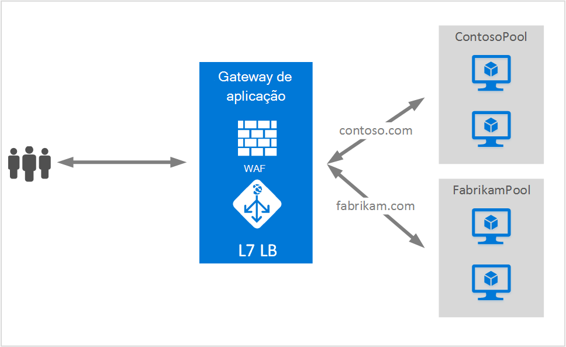

<properties
   pageTitle="Hospedagem de vários sites no Gateway aplicação | Microsoft Azure"
   description="Esta página fornece uma descrição geral do suporte de múltiplos site do Gateway de aplicação."
   documentationCenter="na"
   services="application-gateway"
   authors="amsriva"
   manager="rossort"
   editor="amsriva"/>
<tags
   ms.service="application-gateway"
   ms.devlang="na"
   ms.topic="hero-article"
   ms.tgt_pltfrm="na"
   ms.workload="infrastructure-services"
   ms.date="10/25/2016"
   ms.author="amsriva"/>

# Aplicação Gateway vários alojamento de sites

Vários sites alojamento permite-lhe configurar mais do que uma aplicação web na mesma instância do gateway de aplicação. Esta funcionalidade permite-lhe configurar uma topologia mais eficiente para sua implementações adicionando até 20 Web sites para o gateway de uma aplicação. Cada site pode ser direcionado para os suas próprias conjunto de dados back-end. No exemplo seguinte, gateway aplicação é servir o tráfego para contoso.com e fabrikam.com a partir de dois conjuntos de servidor back-end denominado ContosoServerPool e FabrikamServerPool.

Pedidos de http://contoso.com são encaminhados para ContosoServerPool e http://fabrikam.com são encaminhados para FabrikamServerPool.

Da mesma forma duas subdomínios do mesmo domínio principal podem ser alojados em da mesma implementação de gateway de aplicação. Exemplos de utilização de subdomínios podem incluir http://blog.contoso.com e http://app.contoso.com alojado numa implementação de gateway única aplicação.

## Cabeçalhos de anfitrião e indicação de nome de servidor (SNI)

Existem três mecanismos comuns para ativar a vários site que aloja no infraestrutura do mesmo.

1. Aloje várias aplicações web cada num endereço IP exclusivo.
2. Utilize o nome do anfitrião para várias aplicações web no mesmo endereço IP do anfitrião.
3. Utilize portas diferentes para várias aplicações web no mesmo endereço IP do anfitrião.

Atualmente um gateway aplicação obtém um único endereço IP público em que recebe para o tráfego. Por conseguinte, a suportar várias aplicações, cada uma com o seu próprio endereço IP, atualmente não é suportada. Gateway aplicação suporta várias aplicações de alojamento cada escutar portas diferentes, mas este cenário seria necessário as aplicações para aceitar o tráfego nas portas normalizadas muitas vezes, não sendo uma configuração pretendida. Aplicação Gateway baseia-se nos cabeçalhos de anfitrião HTTP 1.1 para alojar o Web site mais do que um no mesmo endereço IP público e porta. Os sites alojados no gateway aplicação também podem passagem para o SSL suporte com extensão de nome de servidor indicação (SNI) TLS. Este cenário significa que o cliente back-end e do browser web farm tem suportar HTTP/1.1 e extensão TLS conforme definido nas RFC 6066.

## Elemento de configuração de escuta

Elemento de configuração de HTTPListener existente é melhorado para suportar anfitrião nome e o servidor nome indicação elementos, que é utilizado pelo gateway de aplicação para encaminhar tráfego para conjunto de dados back-end adequado. O exemplo seguinte de código é o fragmento de elemento HttpListeners a partir de ficheiro de modelo.

    "httpListeners": [
                {
                    "name": "appGatewayHttpsListener1",
                    "properties": {
                        "FrontendIPConfiguration": {
                            "Id": "/subscriptions/<subid>/resourceGroups/<rgName>/providers/Microsoft.Network/applicationGateways/applicationGateway1/frontendIPConfigurations/DefaultFrontendPublicIP"
                        },
                        "FrontendPort": {
                            "Id": "/subscriptions/<subid>/resourceGroups/<rgName>/providers/Microsoft.Network/applicationGateways/applicationGateway1/frontendPorts/appGatewayFrontendPort443'"
                        },
                        "Protocol": "Https",
                        "SslCertificate": {
                            "Id": "/subscriptions/<subid>/resourceGroups/<rgName>/providers/Microsoft.Network/applicationGateways/applicationGateway1/sslCertificates/appGatewaySslCert1'"
                        },
                        "HostName": "contoso.com",
                        "RequireServerNameIndication": "true"
                    }
                },
                {
                    "name": "appGatewayHttpListener2",
                    "properties": {
                        "FrontendIPConfiguration": {
                            "Id": "/subscriptions/<subid>/resourceGroups/<rgName>/providers/Microsoft.Network/applicationGateways/applicationGateway1/frontendIPConfigurations/appGatewayFrontendIP'"
                        },
                        "FrontendPort": {
                            "Id": "/subscriptions/<subid>/resourceGroups/<rgName>/providers/Microsoft.Network/applicationGateways/applicationGateway1/frontendPorts/appGatewayFrontendPort80'"
                        },
                        "Protocol": "Http",
                        "HostName": "fabrikam.com",
                        "RequireServerNameIndication": "false"
                    }
                }
            ],

Pode visitar o [modelo de Gestor de recursos utilizando vários alojamento de sites](https://github.com/Azure/azure-quickstart-templates/blob/master/201-application-gateway-multihosting) para uma implementação do ponto a ponto com base no modelo.

## Regra de encaminhamento

Não existe nenhuma alteração exigida a regra de encaminhamento. A regra de encaminhamento 'Basic' deve continuar a ser escolhido para associam a escuta de site adequados para o conjunto de endereços de back-end correspondente.

    "requestRoutingRules": [
    {
        "name": "<ruleName1>",
        "properties": {
            "RuleType": "Basic",
            "httpListener": {
                "id": "/subscriptions/<subid>/resourceGroups/<rgName>/providers/Microsoft.Network/applicationGateways/applicationGateway1/httpListeners/appGatewayHttpsListener1')]"
            },
            "backendAddressPool": {
                "id": "/subscriptions/<subid>/resourceGroups/<rgName>/providers/Microsoft.Network/applicationGateways/applicationGateway1/backendAddressPools/ContosoServerPool')]"
            },
            "backendHttpSettings": {
                "id": "/subscriptions/<subid>/resourceGroups/<rgName>/providers/Microsoft.Network/applicationGateways/applicationGateway1/backendHttpSettingsCollection/appGatewayBackendHttpSettings')]"
            }
        }

    },
    {
        "name": "<ruleName2>",
        "properties": {
            "RuleType": "Basic",
            "httpListener": {
                "id": "/subscriptions/<subid>/resourceGroups/<rgName>/providers/Microsoft.Network/applicationGateways/applicationGateway1/httpListeners/appGatewayHttpListener2')]"
            },
            "backendAddressPool": {
                "id": "/subscriptions/<subid>/resourceGroups/<rgName>/providers/Microsoft.Network/applicationGateways/applicationGateway1/backendAddressPools/FabrikamServerPool')]"
            },
            "backendHttpSettings": {
                "id": "/subscriptions/<subid>/resourceGroups/<rgName>/providers/Microsoft.Network/applicationGateways/applicationGateway1/backendHttpSettingsCollection/appGatewayBackendHttpSettings')]"
            }
        }

    }
    ]

## Próximos passos

Depois de formação sobre o alojamento vários do site, aceda a [criar um gateway de aplicação utilizando vários alojamento de sites](application-gateway-create-multisite-azureresourcemanager-powershell.md) para criar um gateway aplicação com capacidade para suportar mais do que uma aplicação web.
