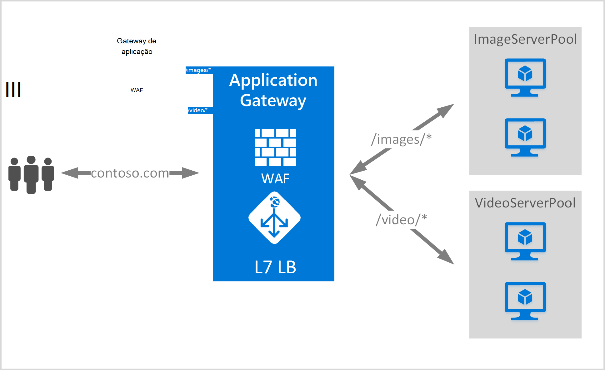

<properties
   pageTitle="Baseada em URL encaminhamento descrição geral do conteúdo | Microsoft Azure"
   description="Esta página fornece uma descrição geral de com base no URL da aplicação Gateway encaminhamento de conteúdo, UrlPathMap configuração e PathBasedRouting regra."
   documentationCenter="na"
   services="application-gateway"
   authors="georgewallace"
   manager="carmonm"
   editor="tysonn"/>
<tags
   ms.service="application-gateway"
   ms.devlang="na"
   ms.topic="hero-article"
   ms.tgt_pltfrm="na"
   ms.workload="infrastructure-services"
   ms.date="10/25/2016"
   ms.author="gwallace"/>

# Descrição geral de URL com base direccionamento de caminhos

URL com base direccionamento de caminhos permite-lhe para encaminhar tráfego para o servidor back-end agrupamentos baseada caminhos de URL do pedido de. Uma dos cenários é para encaminhar os pedidos para diferentes tipos de conteúdo para conjuntos de servidor de back-end diferente.
No exemplo seguinte, Gateway aplicação é servir o tráfego para contoso.com a partir de três agrupamentos de servidor back-end por exemplo: VideoServerPool, ImageServerPool e DefaultServerPool.

Pedidos de http://contoso.com/video* são encaminhados para VideoServerPool e http://contoso.com/images* são encaminhados para ImageServerPool. DefaultServerPool está selecionada se corresponder a nenhum dos padrões de caminho.

## Elemento de configuração de UrlPathMap

Elemento UrlPathMap é utilizado para especificar os padrões de caminho para mapeamentos de agrupamento de servidor back-end. O exemplo seguinte de código é o fragmento de elemento urlPathMap a partir de ficheiro de modelo.

    "urlPathMaps": [
    {
    "name": "<urlPathMapName>",
    "id": "/subscriptions/<subscriptionId>/../microsoft.network/applicationGateways/<gatewayName>/ urlPathMaps/<urlPathMapName>",
    "properties": {
        "defaultBackendAddressPool": {
            "id": "/subscriptions/<subscriptionId>/../microsoft.network/applicationGateways/<gatewayName>/backendAddressPools/<poolName>"
        },
        "defaultBackendHttpSettings": {
            "id": "/subscriptions/<subscriptionId>/../microsoft.network/applicationGateways/<gatewayName>/backendHttpSettingsList/<settingsName>"
        },
        "pathRules": [
            {
                "paths": [
                    <pathPattern>
                ],
                "backendAddressPool": {
                    "id": "/subscriptions/<subscriptionId>/../microsoft.network/applicationGateways/<gatewayName>/backendAddressPools/<poolName2>"
                },
                "backendHttpsettings": {
                    "id": "/subscriptions/<subscriptionId>/../microsoft.network/applicationGateways/<gatewayName>/backendHttpsettingsList/<settingsName2>"
                },

            },

        ],

    }
    }
    

>[AZURE.NOTE] PathPattern: Esta definição está uma lista de padrões de caminho para corresponder ao. Cada tem de começar com / e o local apenas um "*" é permitido é após terminar uma "/". A cadeia Moro para matcher o caminho não inclui qualquer texto após a primeira? ou # e essas caracteres não são permitidas aqui. 

Pode dar saída de um [modelo de Gestor de recursos a utilizar o encaminhamento de baseados em URL](https://azure.microsoft.com/documentation/templates/201-application-gateway-url-path-based-routing) para obter mais informações.

## Regra de PathBasedRouting

RequestRoutingRule tipo PathBasedRouting é utilizado para vincular uma escuta a um urlPathMap. Todos os pedidos que são recebidos este escutar são encaminhados com base na política especificada na urlPathMap.
Fragmento de PathBasedRouting regra:

    "requestRoutingRules": [
    {

    "name": "<ruleName>",
    "id": "/subscriptions/<subscriptionId>/../microsoft.network/applicationGateways/<gatewayName>/requestRoutingRules/<ruleName>",
    "properties": {
        "ruleType": "PathBasedRouting",
        "httpListener": {
            "id": "/subscriptions/<subscriptionId>/../microsoft.network/applicationGateways/<gatewayName>/httpListeners/<listenerName>"
        },
        "urlPathMap": {
            "id": "/subscriptions/<subscriptionId>/../microsoft.network/applicationGateways/<gatewayName>/ urlPathMaps/<urlPathMapName>"
        },

    }
    
## Próximos passos

Depois de formação sobre o encaminhamento conteúdo com base no URL, aceda a [criar um gateway de aplicação baseada em URL encaminhamento a utilizar](application-gateway-create-url-route-portal.md) para criar um gateway aplicação com regras de encaminhamento de URL.
