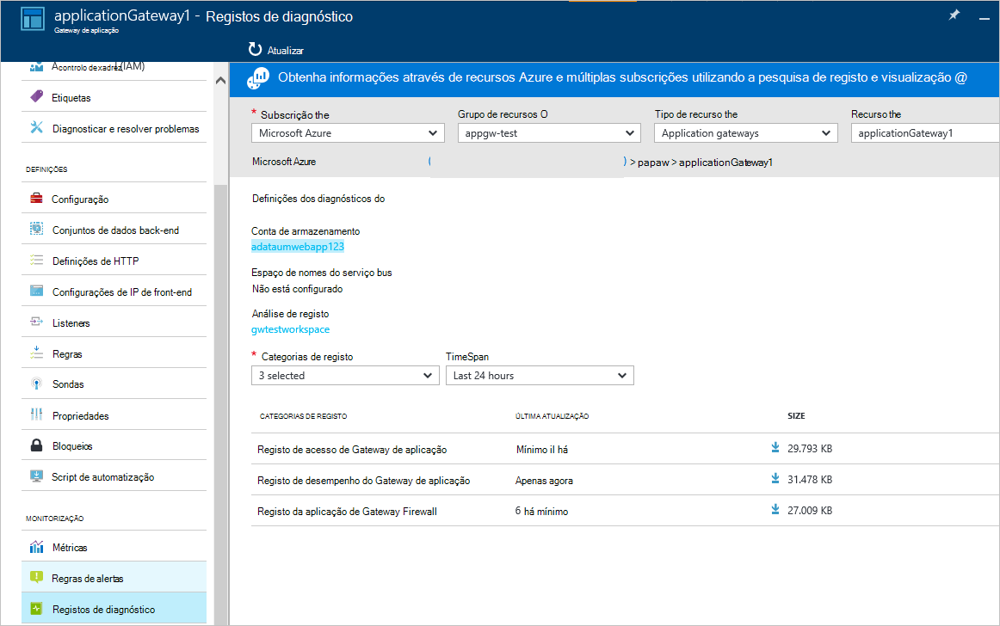

<properties
   pageTitle="Introdução à Firewall de aplicação Web (WAF) para o Gateway de aplicação | Microsoft Azure"
   description="Esta página fornece uma descrição geral da Firewall de aplicação Web (WAF) para o Gateway de aplicação "
   documentationCenter="na"
   services="application-gateway"
   authors="amsriva"
   manager="rossort"
   editor="amsriva"/>
<tags
   ms.service="application-gateway"
   ms.devlang="na"
   ms.topic="hero-article"
   ms.tgt_pltfrm="na"
   ms.workload="infrastructure-services"
   ms.date="10/25/2016"
   ms.author="amsriva"/>

# Aplicação Gateway Web aplicação Firewall (pré-visualização)

Firewall de aplicação Web (WAF) é uma funcionalidade do gateway aplicação azure que fornece a proteção contra para aplicações web que tirar partido de gateway de aplicação para as funções de controlo de entrega de aplicação (ADC) padrão. Firewall de aplicação Web faz isto, protegendo-las relativamente a maior parte das OWASP superiores 10 comuns web vulnerabilidades. Aplicações Web estão cada vez mais alvos de ataques maliciosos que tirar partido vulnerabilidade conhecida comuns. Comuns entre estes exploits são ataques de introdução de SQL, ataques de scripts entre sites para atribuir um nome algumas. Impedir a esses ataques no código de aplicação pode ser um desafio e precisem de manutenção estritas, corrigir e monitorização às várias camadas da topologia de aplicação. Uma firewall de aplicação web centralizada para proteger contra web ataques faz a gestão de segurança muito mais simples e fornece-assurance melhor para a aplicação contra ameaças de violações. Uma solução WAF também pode reagem para uma ameaça de segurança mais rápida por aplicação de patches uma vulnerabilidade conhecida numa localização central versus proteger cada uma das aplicações web individuais. Os gateways de aplicação existente podem ser convertidos para um gateway de aplicação com firewall de aplicação web facilmente.

Aplicação Gateway funciona como um controlador de entrega de aplicação e oferece terminação SSL, afinidade sessão baseada em cookies, round robin carga distribuição, conteúda com base encaminhamento, capacidade para alojar várias melhorias de Web sites e segurança. Melhoramentos de segurança disponibilizados pelos Gateway aplicação incluem gestão da política SSL, o suporte SSL do fim para fim. Vamos são reforçar capacidades de segurança de aplicação do nosso serviço introduzindo diretamente integrado ADC perguntar se WAF (firewall de aplicação web). Este procedimento fornece uma fácil configurar a localização central para gerir e proteger as suas aplicações web contra vulnerabilidades de web comuns.

Configurar WAF ao gateway aplicação fornece os seguintes benefícios a si:

- Proteja a sua aplicação web de vulnerabilidades web e ataques sem alteração ao código de back-end.
- Protege várias aplicações web ao mesmo tempo atrás de um gateway de aplicação. Gateway aplicação suporta até 20 Web sites atrás de um único gateway que poderia todos protegidas contra web ataques de alojamento.
- Monitorize a aplicação web ataques ao utilizar o relatório em tempo real gerado pelo registos de gateway WAF da aplicação.
- Determinados controlos de conformidade necessitam de todos os internet opostas pontos finais para ser protegidos por uma solução WAF. Ao utilizar o gateway aplicação com WAF ativado, pode de cumprir estes requisitos de conformidade.

## Descrição geral

Aplicação Gateway WAF é oferecida num SKU novo (WAF SKU) e está incluída pré-configurado com ModSecurity e OWASP Core regra definida para oferecem do plano base protecção contra a maior parte das OWASP superiores 10 comuns web vulnerabilidades.

- Proteção de introdução de SQL
- Proteção de scripts do site de cruz
- Comuns Web proteção ataques como introdução de comando, o pedido de HTTP contrabando, resposta de HTTP dividir e ataque de inclusão de ficheiro remoto
- Proteção contra violações de protocolo HTTP
- Proteção contra anomalias de protocolo HTTP como em falta alojar agente do utilizador e aceite os cabeçalhos
- HTTP que deve fazer protecção incluindo HTTP transbordo e lenta prevenção de HTTP DoS
- Prevenção contra bots, crawlers e scanners
- Deteção de comuns procurarem de aplicação (ou seja, Apache, IIS, etc)

## Modos de WAF

Aplicação Gateway WAF pode ser configurado para executar os seguintes dois modos:

- **Modo de detecção** – quando configurado para executar no modo de deteção, aplicação Gateway WAF monitoriza e regista todos os alertas de ameaça para um ficheiro de registo. É necessário para se certificar de que registo de diagnóstico para aplicação Gateway está ativado utilizando a secção de diagnóstico. Também terá de para se certificar de que o registo de WAF está seleccionado e ativado.
- **Modo de prevenção** – quando configurado para executar no modo de prevenção, Gateway aplicação ativamente bloqueia violações e ataques detetados pelas suas normas. O intruso recebe uma exceção 403 Acesso não autorizado e a ligação estiver terminada. Modo de prevenção continua a iniciar sessão esses ataques nos registos do WAF.

## Aplicação Gateway WAF relatórios

Aplicação Gateway WAF fornece comunicação de informações detalhadas sobre cada ameaça detetar. Registo está integrado com registos de diagnóstico do Azure e alertas são registados num formato json.

    {
        "resourceId": "/SUBSCRIPTIONS/<subscriptionId>/RESOURCEGROUPS/<resourceGroupName>/PROVIDERS/MICROSOFT.NETWORK/APPLICATIONGATEWAYS/<applicationGatewayName>",
        "operationName": "ApplicationGatewayFirewall",
        "time": "2016-09-20T00:40:04.9138513Z",
        "category": "ApplicationGatewayFirewallLog",
        "properties":     {
            "instanceId":"ApplicationGatewayRole_IN_0",
            "clientIp":"108.41.16.164",
            "clientPort":1815,
            "requestUri":"/wavsep/active/RXSS-Detection-Evaluation-POST/",
            "ruleId":"OWASP_973336",
            "message":"XSS Filter - Category 1: Script Tag Vector",
            "action":"Logged",
            "site":"Global",
            "message":"XSS Filter - Category 1: Script Tag Vector",
            "details":{"message":" Warning. Pattern match "(?i)(<script","file":"/owasp_crs/base_rules/modsecurity_crs_41_xss_attacks.conf","line":"14"}}
    }

## Preços de Gateway WAF SKU de aplicação

Durante a pré-visualização, não existem sem taxas adicionais para utilização de aplicação Gateway WAF. Continuar a ser cobrada taxas de SKU básicas existentes. Vamos irá comunicar os encargos WAF SKU momento das versões DG. Clientes que escolheu para implementar o Gateway de aplicação no WAF SKU começará a vencem ao SKU WAF preços apenas depois de anúncio das versões DG.

## Próximos passos

Após a aprender mais sobre as capacidades de WAF, visite [como configurar a Firewall de aplicação Web do Gateway de aplicação](application-gateway-web-application-firewall-portal.md).
