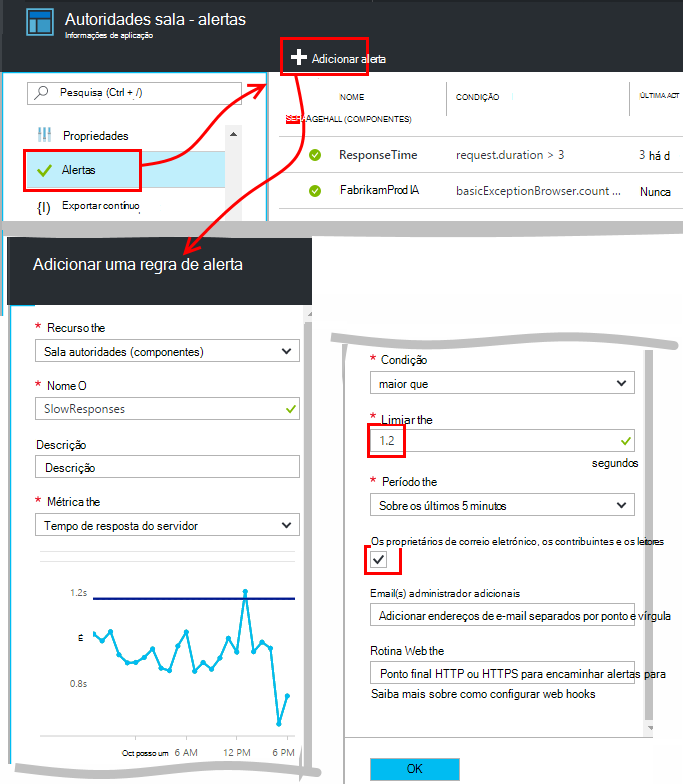
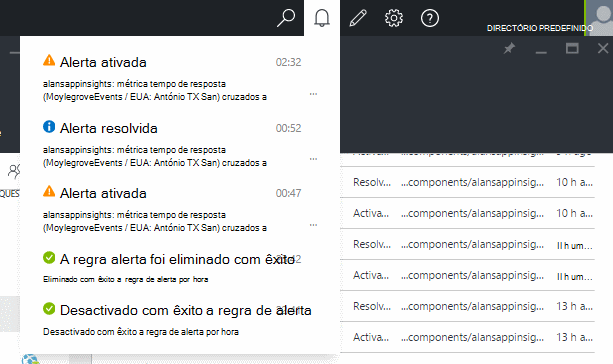
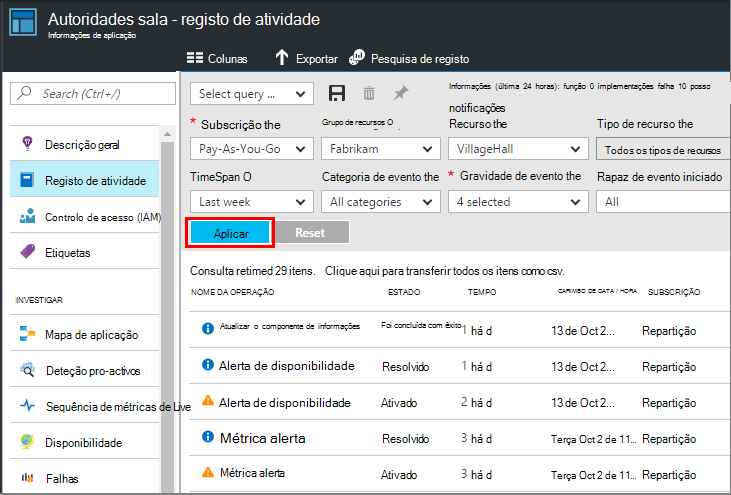

<properties 
    pageTitle="Definir alertas nas informações de aplicação | Microsoft Azure" 
    description="Notificado sobre tempos de resposta lenta, exceções e outros desempenho ou alterações de utilização na sua aplicação web." 
    services="application-insights" 
    documentationCenter=""
    authors="alancameronwills" 
    manager="douge"/>

<tags 
    ms.service="application-insights" 
    ms.workload="tbd" 
    ms.tgt_pltfrm="ibiza" 
    ms.devlang="na" 
    ms.topic="article" 
    ms.date="10/14/2016" 
    ms.author="awills"/>
 
# Definir alertas nas informações de aplicação

[Informações de aplicação do Visual Studio] [ start] pode alertá-lo com as alterações de métricas de desempenho ou utilização de na aplicação web do. 

Informações de aplicação monitoriza a sua aplicação direto numa [grande variedade de plataformas] [ platforms] para o ajudar a diagnosticar problemas de desempenho e compreender os padrões de utilização.

Existem três tipos de alertas:

* **Métricas alertas** informá-lo quando qualquer métrica cruza um valor limite para alguns período - como tempos de resposta, contagens de exceção, utilização da CPU ou vistas de página. 
* [**Web testes** ] [ availability] informa-o ao seu site está disponível na internet ou está a responder lentamente. [Saiba mais][availability].
* [**Diagnósticos pro-activos**](app-insights-proactive-diagnostics.md) são configurados automaticamente para notificá-lo sobre padrões de desempenho invulgares.

Iremos concentrar-nos métricas alertas neste artigo.

## Definir um alerta métrico

Abra o pá alerta regras e, em seguida, utilize o botão Adicionar. 

* Defina o recurso antes das outras propriedades. **Escolher o recurso "(componentes)"** se pretender definir alertas em desempenho ou utilização de métricas.
* O nome que fornecem ao alerta tem de ser exclusivo dentro do grupo de recursos (não apenas aplicação).
* Tenha cuidado para tenha em atenção as unidades em que lhe for pedido para introduzir o valor limite.
* Se selecionar a caixa "E-Mail os proprietários de...", serão enviados por correio eletrónico alertas para todas as pessoas que tiverem acesso deste grupo de recursos. Para expandir este conjunto de pessoas, tem de adicioná-los para o [grupo de recursos ou a subscrição](app-insights-resources-roles-access-control.md) (e não o recurso).
* Se especificar "E-mails adicionais", serão enviados alertas para utilizadores individuais ou grupos (ou não que selecionou a caixa de "enviar por correio eletrónico proprietários..."). 
* Defina um [endereço de webhook](../monitoring-and-diagnostics/insights-webhooks-alerts.md) se configurou uma aplicação web que responde a alertas. Será chamado quando o alerta é activado (isto é, acionada) e quando for resolvido. (Mas tenha em atenção que a apresentar, parâmetros de consulta não são transmitidos através de como propriedades webhook.)
* Pode desativar ou ativar o alerta: consulte o artigo os botões na parte superior da pá.

*Não vejo o botão Adicionar alerta.* 

- Está a utilizar uma conta institucional? Pode definir alertas se tiver o proprietário ou contribuinte aceder a este recurso de aplicação. Consulte o artigo pá o controlo de acesso. [Saiba mais sobre o controlo de acesso][roles].

> [AZURE.NOTE] Pá alertas, irá ver que já existe um conjunto de alerta para cima: [Diagnósticos pro-activos](app-insights-proactive-failure-diagnostics.md). Este é um alerta automático que monitoriza uma determinada métrica, pedido falha taxa. A não ser que decida desativar o alerta pro-activos, não tem de definir o seu próprio alerta numa taxa de falha do pedido. 

## Ver os alertas

Obter uma mensagem de e-mail quando um Estado de alerta alterações entre inativa e ativa. 

O estado atual de cada alerta é apresentado em pá o alerta de regras.

Existe um resumo da atividade recente na alertas pendente:

É o histórico de alterações de estado no registo de atividade:

## Como funcionam alertas

* Um alerta tem três Estados: "Nunca ativado", "Activado" e "Resolvido". Devoluções significa que a condição que especificou era true, quando última foi a ser avaliada.

* É gerada uma notificação quando um alerta muda de estado. (Se a condição alerta já estava true quando criou o alerta, poderá não receber uma notificação até que a condição vai falsa.)

* Cada notificação gera um e-mail se dada a caixa de mensagens de correio eletrónico ou fornecidos endereços de e-mail. Também pode consultar a lista pendente de notificações.

* Um alerta é avaliado sempre que chega uma métrica, mas não o contrário.

* A avaliação agrega a métrica do período anterior e, em seguida, se compara ao limiar para determinar o novo Estado.

* O período que escolher Especifica o intervalo através da qual são agregadas métricas. Não afeta com que frequência é avaliado o alerta: que depende da frequência de chegada de métricas.

* Se não existirem dados chegam para uma determinada métrica algum tempo, o intervalo tem efeitos diferentes no alerta de avaliação e gráficos no Explorador de métrica. No Explorador do métrica, se sem dados são visualizados durante mais de intervalo de amostragem o gráfico, o gráfico mostra um valor de 0. Mas um alerta com base na mesma métrica não está ser avaliada novamente e Estado o alerta permanece inalterado. 

    Quando os dados são eventualmente chegam, o gráfico saltos novamente para um valor diferente de zero. Avalia o alerta com base nos dados disponíveis para o período que especificou. Se o novo ponto de dados é a única pessoa disponível no período de tempo, a função de agregação baseia-se apenas no ponto de dados.

* Um alerta pode tremer frequentemente entre Unidos alertas e saudáveis, mesmo que defina um longo período. Isto pode acontecer se o valor de métrica paira à volta do limiar. Não existe nenhuma histerese o limiar: a transição para o alerta acontece com o mesmo valor como a transição para saudável.

## O que são boas alertas para definir?

Depende da aplicação. Para começar, é melhor não definir demasiadas métricas. Dedique algum tempo consultar os seus gráficos métricos enquanto a aplicação estiver em execução, para ter uma ideia de como comportamento normalmente. Isto ajuda-o a localizar formas para melhorar o desempenho. Em seguida, configure alertas para informá-lo quando as métricas aceda fora da zona de normal. 

Os alertas mais populares incluem:

* [Métricas de browser][client], especialmente Browser **tempos de carregamento da página**, recomendamos para aplicações web. Se a sua página tiver muitas scripts, irá querer procurar **exceções do browser**. Para obter estes métricas e alertas, tem de configurar a [página web monitorização][client].
* **Tempo de resposta do servidor** para o lado do servidor de aplicações web. Assim como a configurar alertas, esteja atento nesta métrica para ver se desproporcionalmente varia com taxas de alta pedido: que podem indicar que a sua aplicação está a ficar sem recursos. 
* **Exceções de servidor** - vê-los, tem de efetuar alguns [configuração adicionais](app-insights-asp-net-exceptions.md).

Não se esqueça desse [Diagnóstico de taxa de falha pro-activos](app-insights-proactive-failure-diagnostics.md) automaticamente monitorizar a taxa no qual a aplicação responde a pedidos com os códigos de falha. 

## Automatização

* [Utilizar o PowerShell para automatizar a configuração de alertas](app-insights-powershell-alerts.md)
* [Utilizar webhooks para automatizar a responder a alertas](../monitoring-and-diagnostics/insights-webhooks-alerts.md)

## Consulte também

* [Testes de web de disponibilidade](app-insights-monitor-web-app-availability.md)
* [Automatizar configurar alertas](app-insights-powershell-alerts.md)
* [Diagnósticos pro-activos](app-insights-proactive-diagnostics.md) 

<!--Link references-->

[availability]: app-insights-monitor-web-app-availability.md
[client]: app-insights-javascript.md
[platforms]: app-insights-platforms.md
[roles]: app-insights-resources-roles-access-control.md
[start]: app-insights-overview.md

 