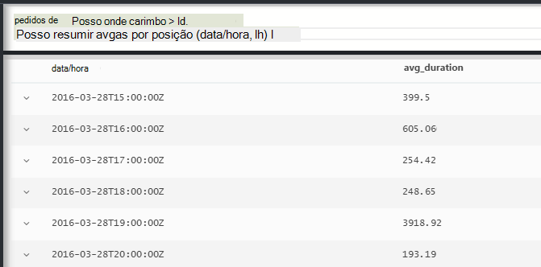
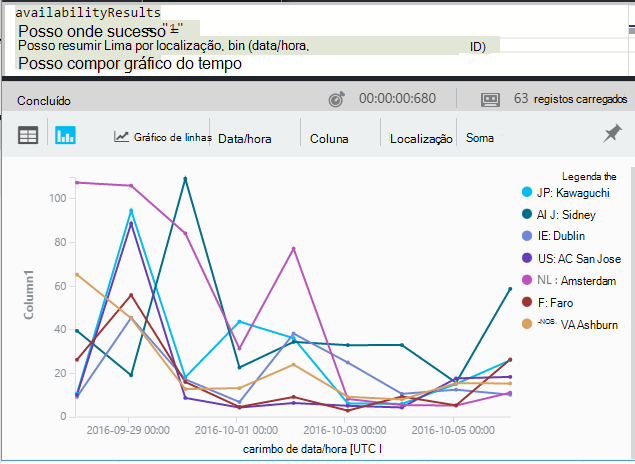

<properties 
    pageTitle="Uma visita guiada através de análise na aplicação informações | Microsoft Azure" 
    description="Breves amostras de todas as consultas principais Analytics, a ferramenta de pesquisa avançada de informações da aplicação." 
    services="application-insights" 
    documentationCenter=""
    authors="alancameronwills" 
    manager="douge"/>

<tags 
    ms.service="application-insights" 
    ms.workload="tbd" 
    ms.tgt_pltfrm="ibiza" 
    ms.devlang="na" 
    ms.topic="article" 
    ms.date="10/15/2016" 
    ms.author="awills"/>


 
# <a name="a-tour-of-analytics-in-application-insights"></a>Como funciona a análise na aplicação de informações


[Análise](app-insights-analytics.md) é a funcionalidade de pesquisa avançada do [Informações de aplicação](app-insights-overview.md). Estas páginas descrevem lanquage de consulta a análise.


* **[Veja o vídeo introdutório](https://applicationanalytics-media.azureedge.net/home_page_video.mp4)**.
* **[Unidade de teste Analytics nos nossos dados simulados](https://analytics.applicationinsights.io/demo)** se a sua aplicação não está a enviar dados para informações de aplicação ainda.


Vamos obter instruções algumas consultas básicas para começar a utilizar.

## <a name="connect-to-your-application-insights-data"></a>Ligar aos seus dados de informações de aplicação

Abra a análise da sua aplicação [pá de descrição geral](app-insights-dashboards.md) de informações da aplicação:


    
## <a name="takeapp-insights-analytics-referencemdtake-operator-show-me-n-rows"></a>[Tomar](app-insights-analytics-reference.md#take-operator): Mostrar-me linhas n

Pontos de dados que o registo de operações de utilizador (normalmente pedidos HTTP recebidas pela aplicação web do) são armazenados numa tabela denominada `requests`. Cada linha é um ponto de dados de telemetria recebido a partir do SDK de informações da aplicação na sua aplicação.

Vamos começar por examinar algumas linhas de exemplo da tabela:


> [AZURE.NOTE] Coloque o cursor num local na instrução antes de clicar em Ir. Pode dividir uma instrução através de mais do que uma linha, mas não coloque linhas em branco numa instrução. Linhas em branco são uma forma conveniente para manter várias consultas em separado na janela.


Selecionar colunas, arraste-os, agrupar por colunas e filtrar: 


Expanda qualquer item para ver os detalhes:
 


> [AZURE.NOTE] Clique na parte superior de uma coluna para reordenar os resultados disponíveis no browser. Mas, tenha em atenção que, para um conjunto de resultados de grandes dimensões, o número de linhas são transferidas para o browser é limitado. Ordenação desta forma não sempre mostra-lhe os itens mais altos ou mais baixos reais. Para ordenar itens sujeito, utilize o `top` ou `sort` operador. 

## <a name="topapp-insights-analytics-referencemdtop-operator-and-sortapp-insights-analytics-referencemdsort-operator"></a>[Superior](app-insights-analytics-reference.md#top-operator) e [Ordenar](app-insights-analytics-reference.md#sort-operator)

`take`é útil para obter uma amostra rápida de um resultado, mas que apresenta as linhas de nenhuma ordem particular. Para obter uma vista ordenada, utilize `top` (para uma amostra) ou `sort` (ao longo de toda a tabela).

Mostre-me as primeiras linhas n, ordenadas por uma determinada coluna:

```AIQL

    requests | top 10 by timestamp desc 
```

* *Sintaxe:* A maior parte dos operadores tem parâmetros de palavra-chave, tais como `by`.
* `desc`= por ordem descendente, `asc` = por ordem ascendente.


`top...`é uma forma de performant mais de dizer `sort ... | take...`. Vamos poderia ter escrito:

```AIQL

    requests | sort by timestamp desc | take 10
```

O resultado seria a mesma, mas -seria lentamente um pouco mais. (Também poderia escrever `order`, que é um alias de `sort`.)

Os cabeçalhos de coluna na vista de tabela podem também ser utilizados para ordenar os resultados no ecrã. Mas curso, caso tenha utilizado `take` ou `top` para recuperar apenas para parte de uma tabela, irá apenas reorganizar os registos que tenha recuperou.


## <a name="projectapp-insights-analytics-referencemdproject-operator-select-rename-and-compute-columns"></a>[Projeto](app-insights-analytics-reference.md#project-operator): selecione, mudar o nome e calcular colunas

Utilizar [`project`](app-insights-analytics-reference.md#project-operator) para destacar apenas as colunas que pretende:

```AIQL

    requests | top 10 by timestamp desc
             | project timestamp, name, resultCode
```


Também pode mudar o nome de colunas e definir novos:

```AIQL

    requests 
  	| top 10 by timestamp desc 
  	| project  
            name, 
            response = resultCode,
            timestamp, 
            ['time of day'] = floor(timestamp % 1d, 1s)
```


* [Os nomes das colunas](app-insights-analytics-reference.md#names) pode incluir espaços ou símbolos se estes estão entre parênteses da seguinte forma: `['...']` ou`["..."]`
* `%`é habitual operador de módulo. 
* `1d`(que é um dígito uma, em seguida, um tinha ') timespan literal que significa um dia. Aqui estão algumas literais timespan mais: `12h`, `30m`, `10s`, `0.01s`.
* `floor`(alias `bin`) arredonda por um valor para o múltiplo ao valor base da fornecidos. Por isso, `floor(aTime, 1s)` Arredonda por uma hora para baixo para a segunda mais próxima.

[Expressões](app-insights-analytics-reference.md#scalars) podem incluir todos os operadores habituais (`+`, `-`;...), e não existe uma variedade de funções úteis.

    

## <a name="extendapp-insights-analytics-referencemdextend-operator-compute-columns"></a>[Expandir](app-insights-analytics-reference.md#extend-operator): calcular colunas

Se apenas quiser adicionar colunas a já existentes, utilize [`extend`](app-insights-analytics-reference.md#extend-operator):

```AIQL

    requests 
  	| top 10 by timestamp desc
  	| extend timeOfDay = floor(timestamp % 1d, 1s)
```

Utilizar [`extend`](app-insights-analytics-reference.md#extend-operator) é menos verboso que [`project`](app-insights-analytics-reference.md#project-operator) se pretender manter todas as colunas existentes.


## <a name="summarizeapp-insights-analytics-referencemdsummarize-operator-aggregate-groups-of-rows"></a>[Resumir](app-insights-analytics-reference.md#summarize-operator): Agregar grupos de linhas

`Summarize`aplica-se uma *função de agregação* de especificado sobre grupos de linhas. 

Por exemplo, o tempo a aplicação web do demora a responder a um pedido é comunicado no campo `duration`. Vamos ver o tempo de resposta média para todos os pedidos de:


Ou podemos poderia separar o resultado em pedidos de nomes diferentes:


`Summarize`recolhe os pontos de dados na sequência em grupos para o qual o `by` cláusula avalia uniforme. Cada valor na `by` expressão - cada nome de operação no exemplo acima - resulta numa linha na tabela resultado. 

Ou podemos poderia agrupar os resultados por hora do dia:



Repare como estamos a utilizar o `bin` função (também conhecidos por `floor`). Se apenas utilizámos `by timestamp`, todas as linhas de entrada seriam terminem seu próprio pequeno grupo. Para qualquer escalar contínua como horas ou números, temos interromper o intervalo contínuo num número de valores descontínuos, fácil e `bin` -que é realmente apenas a familiar arredondamento descendente `floor` função - é a forma mais fácil para o fazer.

Vamos pode utilizar a mesma técnica para reduzir intervalos de cadeias:


Repare que pode utilizar `name=` para definir o nome de uma coluna de resultado, tanto nas expressões de agregação a-cláusula por.

## <a name="counting-sampled-data"></a>Contagem de amostra dados

`sum(itemCount)`é a agregação recomendada para contar o número de eventos. Em muitos casos, itemCount = = 1, para que a função conta simplesmente o o número de linhas no grupo. Mas quando [amostragem](app-insights-sampling.md) estiver numa operação, apenas uma fração dos eventos originais será retida como pontos de dados numa aplicação de informações, para que para cada ponto de dados que vê, existem `itemCount` eventos. 

Por exemplo, se amostragem rejeita 75% dos eventos originais, em seguida, itemCount = = 4 nos registos retidos - ou seja, para cada registo retido, que ocorreram quatro registos originais. 

Amostragem ajustável faz com que itemCount deve ser superior durante a períodos quando a aplicação está a ser mais utilizada.

Por conseguinte, resumir as itemCount dá uma boa estimativa do número de eventos original.


Também existe uma `count()` agregação (e uma operação de contagem), para casos em que realmente pretende contar o número de linhas num grupo.


Existe um intervalo de [funções de agregação](app-insights-analytics-reference.md#aggregations).


## <a name="charting-the-results"></a>Os resultados de gráficos


```AIQL

    exceptions 
       | summarize count()  
         by bin(timestamp, 1d)
```

Por predefinição, os resultados são apresentados como uma tabela:


Podemos fazer melhor do que a vista de tabela. Vamos ver os resultados na vista de gráfico com vertical barra opção:


Repare que, apesar de não podemos não ordenar os resultados por hora (como pode ver na apresentação da tabela), a apresentação de gráfico mostra sempre DataHora na ordem correta.


## <a name="whereapp-insights-analytics-referencemdwhere-operator-filtering-on-a-condition"></a>[Onde](app-insights-analytics-reference.md#where-operator): filtragem numa condição

Se configurou a monitorização de informações de aplicação para o [cliente](app-insights-javascript.md) e o servidor lados da sua aplicação, algumas das telemetria na base de dados provém browsers.

Vamos ver apenas exceções comunicadas a browsers:

```AIQL

    exceptions 
  	| where client_Type == "Browser" 
  	|  summarize count() 
       by client_Browser, outerMessage 
```


O `where` o operador assume uma expressão booleana. Seguem-se alguns pontos chave sobre os mesmos:

 * `and`, `or`: Operadores booleanos
 * `==`, `<>` : iguais e não são iguais
 * `=~`, `!=` : maiúsculas e minúsculas cadeia diferente e igual. Existem muitas mais operadores de comparação de cadeia.

Ler todas as informações sobre [expressões escalares](app-insights-analytics-reference.md#scalars).

### <a name="filtering-events"></a>Filtrar eventos

Localize tentativas de pedidos de:

```AIQL

    requests 
  	| where isnotempty(resultCode) and toint(resultCode) >= 400
```

`responseCode`tem tipo cadeia, pelo podemos tem de [convertê-la](app-insights-analytics-reference.md#casts) para uma comparação numérica.

Resuma as respostas diferentes:

```AIQL

    requests
  	| where isnotempty(resultCode) and toint(resultCode) >= 400
  	| summarize count() 
      by resultCode
```

## <a name="timecharts"></a>Timecharts

Mostrar quantos eventos aí é cada dia:

```AIQL

    requests
      | summarize event_count=count()
        by bin(timestamp, 1d)
```

Selecione a opção de visualização de gráfico:


## <a name="multiple-series"></a>Várias séries 

Várias expressões a `summarize` cria várias colunas.

Várias expressões a `by` cláusula cria várias linhas, uma para cada combinação de valores.


```AIQL

    requests
  	| summarize count(), avg(duration) 
      by bin(timestamp, 1d), client_StateOrProvince, client_City 
  	| order by timestamp asc, client_StateOrProvince, client_City
```


### <a name="segment-a-chart-by-dimensions"></a>Segmento, um gráfico por dimensões

Se o gráfico uma tabela que tem uma coluna de cadeia e uma coluna numérica, a cadeia pode ser utilizada para dividir os dados numéricos em separado série de pontos de. Se existir mais do que uma coluna de cadeia, pode escolher qual a coluna para utilizar como o discriminador. 


### <a name="display-multiple-metrics"></a>Apresentar várias métricas

Se o gráfico uma tabela nessa mais do que uma coluna numérica, para além do carimbo de data/hora, pode apresentar qualquer combinação dos mesmos.


Dividir não tem de selecionar antes de poder selecionar várias colunas numéricas que não é possível dividir por uma coluna de cadeia em simultâneo como apresentar mais do que uma coluna numérica. 


## <a name="daily-average-cycle"></a>Ciclo de média diário

Como é que a utilização variam ao longo do dia média?

Pedidos de contagem por hora módulo um dia, binned em horas:

```AIQL

    requests
  	| extend hour = floor(timestamp % 1d , 1h) 
          + datetime("2016-01-01")
  	| summarize event_count=count() by hour
```


>[AZURE.NOTE] Repare que temos atualmente converter as durações de tempo DataHora para apresentar a um gráfico.


## <a name="compare-multiple-daily-series"></a>Comparar várias séries de diárias

Como é que a utilização variam ao longo do tempo de dia em países/regiões diferentes?

```AIQL

 requests  | where tostring(operation_SyntheticSource)
     | extend hour= floor( timestamp % 1d , 1h)
           + datetime("2001-01-01")
     | summarize event_count=count() 
       by hour, client_CountryOrRegion 
     | render timechart
```


## <a name="plot-a-distribution"></a>Desenhar uma distribuição

Existem quantas sessões de comprimentos diferentes?

```AIQL

    requests 
  	| where isnotnull(session_Id) and isnotempty(session_Id) 
  	| summarize min(timestamp), max(timestamp) 
      by session_Id 
  	| extend sessionDuration = max_timestamp - min_timestamp 
  	| where sessionDuration > 1s and sessionDuration < 3m 
  	| summarize count() by floor(sessionDuration, 3s) 
  	| project d = sessionDuration + datetime("2016-01-01"), count_
```

A última linha é necessária para converter datetime. Atualmente, o eixo x de um gráfico é apresentado como um escalar apenas se for uma data/hora.

O `where` cláusula exclui sessões one-shot (sessionDuration = = 0) e define o comprimento do eixo x.


## <a name="percentilesapp-insights-analytics-referencemdpercentiles"></a>[Percentis](app-insights-analytics-reference.md#percentiles)

O que intervalos de durações de folha de rosto percentagens diferentes de sessões?

Utilizar a consulta acima, mas substitua a última linha:

```AIQL

    requests 
  	| where isnotnull(session_Id) and isnotempty(session_Id) 
  	| summarize min(timestamp), max(timestamp) 
      by session_Id 
  	| extend sesh = max_timestamp - min_timestamp 
  	| where sesh > 1s
  	| summarize count() by floor(sesh, 3s) 
  	| summarize percentiles(sesh, 5, 20, 50, 80, 95)
```

Recomendamos também tenha removido o limite superior na onde cláusula, publicados para obter ilustrações corretas, incluindo todas as sessões com mais do que um pedido:


A partir do qual pode Vemos que:

* 5% de sessões têm uma duração inferior a 3 minutos 34s; 
* 50% de sessões última minnutes menos de 36;
* 5% de sessões últimos mais de 7 dias

Para obter uma explicação detalhada separada para cada país, podemos simplesmente têm que colocar a coluna client_CountryOrRegion separadamente através de ambos resumir operadores:

```AIQL

    requests 
  	| where isnotnull(session_Id) and isnotempty(session_Id) 
  	| summarize min(timestamp), max(timestamp) 
      by session_Id, client_CountryOrRegion
  	| extend sesh = max_timestamp - min_timestamp 
  	| where sesh > 1s
  	| summarize count() by floor(sesh, 3s), client_CountryOrRegion
  	| summarize percentiles(sesh, 5, 20, 50, 80, 95)
      by client_CountryOrRegion
```


## <a name="joinapp-insights-analytics-referencemdjoin"></a>[Associação](app-insights-analytics-reference.md#join)

Temos acesso a várias tabelas, incluindo os pedidos e exceções.

Para localizar as exceções relacionados com a um pedido que devolvido uma resposta de falha, podemos pode associar as tabelas no `session_Id`:

```AIQL

    requests 
  	| where toint(responseCode) >= 500 
  	| join (exceptions) on operation_Id 
  	| take 30
```


É aconselhável utilizar `project` para selecionar apenas as colunas precisamos antes de executar a associação.
Nas mesmas cláusulas, podemos mudar o nome da coluna de data/hora.


## <a name="letapp-insights-analytics-referencemdlet-clause-assign-a-result-to-a-variable"></a>[Permitir que](app-insights-analytics-reference.md#let-clause): atribuir um resultado a uma variável

Utilize a opção [Permitir que](./app-insights-analytics-reference.md#let-statements) para separar as partes da expressão anterior. Os resultados são inalterados:

```AIQL

    let bad_requests = 
      requests
        | where  toint(resultCode) >= 500  ;
    bad_requests
  	| join (exceptions) on session_Id 
  	| take 30
```

> Sugestão: No cliente de análise, não coloca linhas em branco entre as partes do presente. Certifique-se executar tudo da mesma.


## <a name="accessing-nested-objects"></a>Aceder a objectos aninhados

Objectos aninhados podem ser acedidos facilmente. Por exemplo, na sequência exceções verá objetos estruturados da seguinte forma:


Pode aplaná-lo ao selecionar as propriedades que lhe interessa:

```AIQL

    exceptions | take 10
  	| extend method1 = tostring(details[0].parsedStack[1].method)
```

Tenha em atenção que tem de utilizar uma [cast](app-insights-analytics-reference.md#casts) com o tipo de adequado.

## <a name="custom-properties-and-measurements"></a>Propriedades personalizadas e medidas

Se a aplicação anexa [dimensões personalizadas (propriedades) e medidas personalizadas](app-insights-api-custom-events-metrics.md#properties) eventos, em seguida, irá vê-los na `customDimensions` e `customMeasurements` objetos.


Por exemplo, se a sua aplicação inclui:

```C#

    var dimensions = new Dictionary<string, string> 
                     {{"p1", "v1"},{"p2", "v2"}};
    var measurements = new Dictionary<string, double>
                     {{"m1", 42.0}, {"m2", 43.2}};
    telemetryClient.TrackEvent("myEvent", dimensions, measurements);
```

Para extrair estes valores em Analytics:

```AIQL

    customEvents
  	| extend p1 = customDimensions.p1, 
      m1 = todouble(customMeasurements.m1) // cast to expected type

``` 

## <a name="tables"></a>Tabelas

A sequência de telemetria recebida a partir da sua aplicação está acessível através de várias tabelas. O esquema das propriedades disponíveis para cada tabela está visível no lado esquerdo da janela.

### <a name="requests-table"></a>Tabela de pedidos

Pedidos de contagem HTTP ao seu web app e o segmento por nome de página:


Localize os pedidos de falharem maioria:


### <a name="custom-events-table"></a>Tabela de eventos personalizados

Se utilizar [TrackEvent()](app-insights-api-custom-events-metrics.md#track-event) para enviar o seus próprio eventos, pode lê-los a partir desta tabela. 

Vamos dar um exemplo onde o seu código de aplicação contém destas linhas:

```C#

    telemetry.TrackEvent("Query", 
       new Dictionary<string,string> {{"query", sqlCmd}},
       new Dictionary<string,double> {
           {"retry", retryCount},
           {"querytime", totalTime}})
```

Apresente a frequência das seguintes eventos:
 


Extrai medidas e as dimensões dos eventos:


### <a name="custom-metrics-table"></a>Tabela de métricas personalizado

Se estiver a utilizar [TrackMetric()](app-insights-api-custom-events-metrics.md#track-metric) para enviar o seus próprio métricos valores, vai encontrar os seus resultados na sequência **customMetrics** . Por exemplo:  


> [AZURE.NOTE] No [Explorador de métricas](app-insights-metrics-explorer.md), todas as medições personalizadas anexadas a qualquer tipo de telemetria que apareçam juntos na pá métricas juntamente com métricas enviadas utilizando `TrackMetric()`. Mas em análise, medidas personalizadas ainda estão ligadas a independentemente tipo de telemetria foram efectuadas - eventos ou pedidos e assim sucessivamente - enquanto métricas enviadas por TrackMetric aparecem na sua própria sequência.

### <a name="performance-counters-table"></a>Tabela de contadores de desempenho

[Contadores de desempenho](app-insights-performance-counters.md) mostrar-lhe métricas de sistema básico para a sua aplicação, tais como CPU, a memória e a utilização da rede. Pode configurar o SDK para enviar contadores adicionais, incluindo o seus próprio contadores personalizados.

Esquema de **performanceCounters** expõe o `category`, `counter` nome, e `instance` nome de cada contador de desempenho. Contador instância nomes só são aplicáveis para alguns contadores de desempenho e indicam normalmente o nome do processo a que se refere a contagem. Telemetria para cada aplicação, verá apenas os contadores para essa aplicação. Por exemplo, para ver quais são os contadores estão disponíveis: 


Para obter um gráfico de memória disponível durante o período recente: 


Como outras telemetria, **performanceCounters** também tem uma coluna `cloud_RoleInstance` que indica a identidade do computador anfitrião no qual a aplicação está a ser executado. Por exemplo, para comparar o desempenho da sua aplicação nos computadores diferentes: 


### <a name="exceptions-table"></a>Tabela de exceções

[Exceções comunicado por sua aplicação](app-insights-asp-net-exceptions.md) estão disponíveis nesta tabela. 

Para localizar o pedido de HTTP a aplicação foi processamento quando a exceção foi elevada, participar no operation_Id:


### <a name="browser-timings-table"></a>Tabela de temporizações do browser

`browserTimings`Mostra a página carregar dados recolhidas nos browsers dos seus utilizadores.

[Configurar a sua aplicação de telemetria do lado do cliente](app-insights-javascript.md) para poder ver estas métricas. 

Esquema de inclui [métricas que indica os comprimentos dos diferentes fases da página processo de carregamento](app-insights-javascript.md#page-load-performance). (Não indicam o comprimento do tempo que os utilizadores ler uma página.)  

Mostrar popularities de páginas diferentes e carregar horas para cada página:


### <a name="availbility-results-table"></a>Tabela de resultados de Availbility

`availabilityResults`Mostra os resultados dos seus [testes web](app-insights-monitor-web-app-availability.md). Cada execução dos testes de cada localização de teste é comunicada em separado. 




### <a name="dependencies-table"></a>Tabela de dependências

Contém resultados das chamadas de que a aplicação faz com que para bases de dados e os REST APIs e outras chamadas para TrackDependency().

### <a name="traces-table"></a>Tabela de rastreios

Contém telemetria enviada por sua aplicação utilizando TrackTrace() ou [outros quadros de registo](app-insights-asp-net-trace-logs.md).

## <a name="dashboards"></a>Dashboards

Pode afixar os resultados de um dashboard para poder reúnem todas as suas mais importantes gráficos e tabelas.

* [Dashboard partilhada Azure](app-insights-dashboards.md#share-dashboards): clique no ícone de alfinete. Antes de fazer isto, tem de ter um dashboard partilhado. No portal do Azure, abra ou crie um dashboard e clique em partilhar.
* [Dashboard do Power BI](app-insights-export-power-bi.md): clique em exportar, a consulta do Power BI. Uma vantagem desta alternativa é que pode apresentar a sua consulta juntamente com um outros resultados a partir de uma muito grande variedade de origens de.


## <a name="next-steps"></a>Próximos passos

* [Referência da linguagem Analytics](app-insights-analytics-reference.md)

[AZURE.INCLUDE [app-insights-analytics-footer](../../includes/app-insights-analytics-footer.md)]


