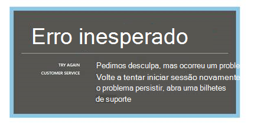
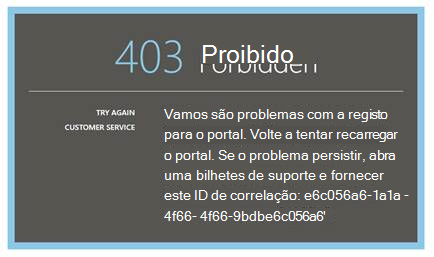
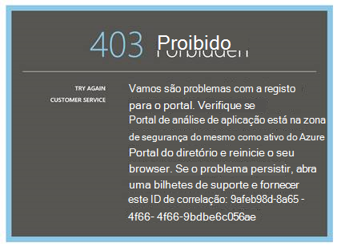
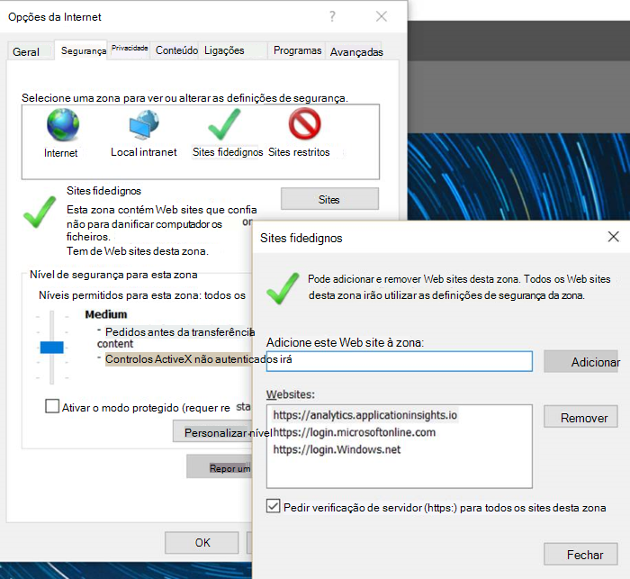
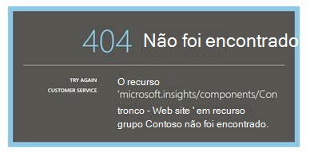
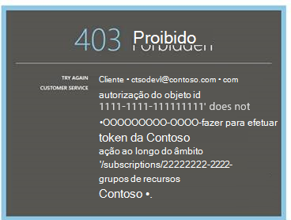
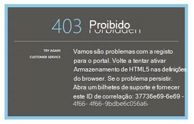
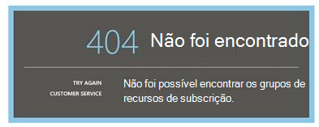
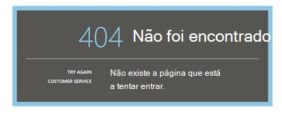

<properties 
    pageTitle="Resolução de problemas de análise - a ferramenta de pesquisa avançada de informações da aplicação | Microsoft Azure" 
    description="Problemas com a análise de informações da aplicação? Comece aqui. " 
    services="application-insights" 
    documentationCenter=""
    authors="alancameronwills" 
    manager="douge"/>

<tags 
    ms.service="application-insights" 
    ms.workload="tbd" 
    ms.tgt_pltfrm="ibiza" 
    ms.devlang="na" 
    ms.topic="article" 
    ms.date="07/11/2016" 
    ms.author="awills"/>

# Resolver problemas de análise na aplicação informações

Problemas com a [análise de informações da aplicação](app-insights-analytics.md)? Comece aqui. Análise é a ferramenta de pesquisa avançada do Visual Studio aplicação informações.

## Limites

* Em apresentar, os resultados da consulta são limitados ao apenas através de uma semana dos últimos dados.
* Browsers que recomendamos testar nas: edições mais recentes do Chrome, limite e Internet Explorer.

## Extensões do browser incompatível conhecidos

* Ghostery

Desativar a extensão ou utilize um browser diferente.

##"Erro inesperado"

Erro interno durante runtime portal – exceção não processada.

* Limpe a cache do browser. 

## 403... Experimente recarregar

Uma autenticação relacionado com o erro (durante a autenticação ou durante a geração token de acesso). O portal não poderá ter nenhuma forma de recuperar sem alterar as definições do browser.

* Verifique se [cookies de terceiros estão ativados](#cookies) no browser. 

## 403... Certifique-se de zona de segurança

Uma autenticação relacionado com o erro (durante a autenticação ou durante a geração token de acesso). O portal não poderá ter nenhuma forma de recuperar sem alterar as definições do browser.

1. Verifique se [cookies de terceiros estão ativados](#cookies) no browser. 

2. Utilizou um favorito, marcador ou uma ligação guardada para abrir o portal de análise? Tem sessão iniciada com as credenciais diferentes que utilizou quando guardado a ligação?

2. Experimente utilizar uma janela do browser no-privado/janela (depois de fechar todos os essas janelas). Terá de fornecer as suas credenciais. 

2. Abrir outra janela do browser (normal) e aceda ao [Azure](https://portal.azure.com). Terminar sessão. Em seguida, abra a sua ligação e inicie sessão com as credenciais corretas.

2. Os utilizadores de limite e Internet Explorer também podem obter este erro quando zona fidedignos definições não são suportadas.

    Verifique se o [portal de análise](https://analytics.applicationinsights.io) e o [portal do Azure Active Directory](https://portal.azure.com) estão na mesma zona de segurança:

 * No Internet Explorer, abra **Opções da Internet**, **segurança**, **os sites fidedignos**, **Sites**:

    

    Na lista de Web sites, se qualquer um dos seguintes URLs são incluídas, certifique-se de que as outras são incluídas também:

    https://Analytics.applicationinsights.IO 
   https://login.microsoftonline.com 
   https://login.Windows.NET

## 404... Recurso não encontrado

Recurso de aplicação foi eliminado a partir de informações da aplicação e não já está disponível. Isto pode acontecer se tiver guardado o URL para a página de análise.

## 403... Sem autorização

Não tem permissão para abrir esta aplicação na análise.

* Obteve a ligação a partir de outra pessoa? Peça-lhes para se certificar de que está a [leitores ou contribuintes para este grupo de recursos](app-insights-resources-roles-access-control.md).
* Tiver guardado a ligação através de credenciais diferentes? Abra o [Azure portal](https://portal.azure.com), terminar sessão e, em seguida, experimente esta ligação novamente, fornecer as credenciais corretas.

## 403... Armazenamento em HTML5

Nosso portal utiliza localStorage em HTML5 e sessionStorage.

* Chrome: Definições de privacidade, definições de conteúdo.
* Internet Explorer: Opções da Internet, separador Avançadas, segurança, ativar armazenamento DOM

## 404... Subscrição não encontrada

O URL é inválido. 

* Abra o recurso de aplicação no [portal de informações da aplicação](https://portal.azure.com). Em seguida, utilize o botão de análise.

## 404... não existe a página

O URL é inválido.

* Abra o recurso de aplicação no [portal de informações da aplicação](https://portal.azure.com). Em seguida, utilize o botão de análise.

## Ativar cookies de terceiros

  Veja [como desativar cookies de terceiros](http://www.digitalcitizen.life/how-disable-third-party-cookies-all-major-browsers), mas repare que precisamos de **ativá** -los.

## Se tudo o resto falhar    

[Contacte-nos](app-insights-get-dev-support.md).
 
[AZURE.INCLUDE [app-insights-analytics-footer](../../includes/app-insights-analytics-footer.md)]

