<properties 
    pageTitle="Utilizar a análise - a ferramenta de pesquisa avançada de informações da aplicação | Microsoft Azure" 
    description="Utilizar a análise, a ferramenta de pesquisa de diagnóstico poderosas de informações da aplicação. " 
    services="application-insights" 
    documentationCenter=""
    authors="danhadari" 
    manager="douge"/>

<tags 
    ms.service="application-insights" 
    ms.workload="tbd" 
    ms.tgt_pltfrm="ibiza" 
    ms.devlang="na" 
    ms.topic="article" 
    ms.date="10/21/2016" 
    ms.author="awills"/>

# Utilizar a análise na aplicação informações

[Análise](app-insights-analytics.md) é a funcionalidade de pesquisa avançada do [Informações de aplicação](app-insights-overview.md). Estas páginas descrevem a linguagem de consulta de análise.

* **[Veja o vídeo introdutório](https://applicationanalytics-media.azureedge.net/home_page_video.mp4)**.
* **[Unidade de teste Analytics nos nossos dados simulados](https://analytics.applicationinsights.io/demo)** se a sua aplicação não está a enviar dados para informações de aplicação ainda.

## Abrir a análise

A partir da casa recurso sua aplicação informações de aplicação, clique em análise.

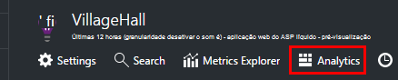

O tutorial inline dá-lhe algumas ideias sobre o que pode fazer.

Existe uma [visita guiada mais extensa aqui](app-insights-analytics-tour.md).

## Consultar o seu telemetria

### Escrever uma consulta

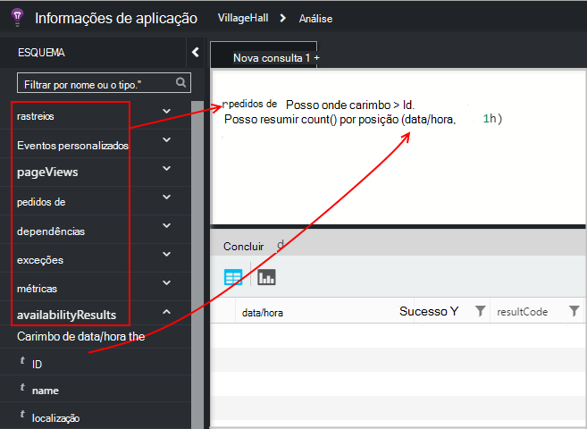

Começar com os nomes de qualquer uma das tabelas de listadas à esquerda (ou os operadores [intervalo](app-insights-analytics-reference.md#range-operator) ou [União](app-insights-analytics-reference.md#union-operator) ). Utilizar `|` para criar uma tubagem de [operadores](app-insights-analytics-reference.md#queries-and-operators). IntelliSense pede-lhe com os operadores e alguns dos elementos de expressão que pode utilizar.

Consulte a [Descrição geral do idioma de análise](app-insights-analytics-tour.md) e a [referência de idioma](app-insights-analytics-reference.md).

### Executar uma consulta

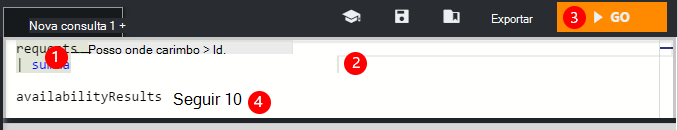

1. Pode utilizar quebras de linha única numa consulta.
2. Coloque o cursor no interior ou no final da consulta que pretende executar.
3. Clique em Ir para executar a consulta.
4. Não coloque linhas em branco na sua consulta. Pode manter várias consultas separados por um separador de consulta, separando-os com linhas em branco. É executado apenas aquela com o cursor.

### Guardar uma consulta

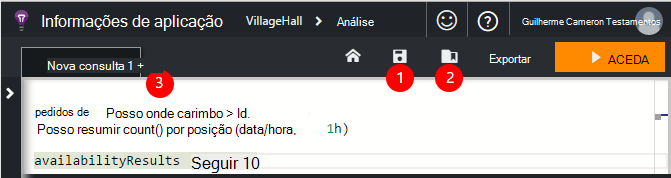

1. Guarde o ficheiro de consulta atual.
2. Abra um ficheiro de consulta guardada.
3. Crie um novo ficheiro de consulta.

## Ver os detalhes

Expanda qualquer linha nos resultados para ver a sua lista completa de propriedades. Pode expandir ainda mais qualquer propriedade que é um valor estruturado - por exemplo, dimensões personalizadas ou na pilha listar numa exceção.

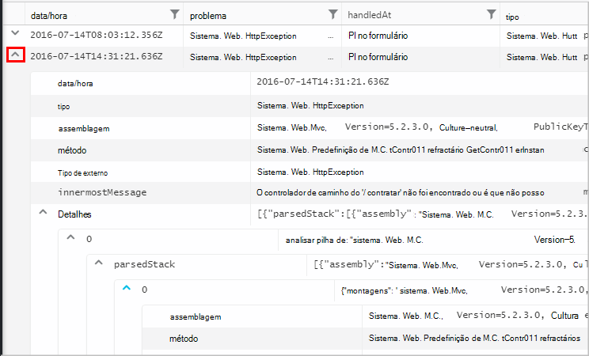

 

## Dispor os resultados

Pode ordenar, filtrar, paginar e agrupar os resultados devolvidos da sua consulta.

> [AZURE.NOTE] Ordenar, agrupar e filtrar no browser não executar novamente a sua consulta. Estes apenas reorganizar os resultados que foram devolvidos pela sua última consulta. 
> 
> Para efetuar estas tarefas no servidor antes dos resultados são devolvidos, escreva a sua consulta com os operadores [Ordenar](app-insights-analytics-reference.md#sort-operator), [Resumir](app-insights-analytics-reference.md#summarize-operator) e [onde](app-insights-analytics-reference.md#where-operator) .

Selecione as colunas que pretende ver, arraste os cabeçalhos de coluna para reordená-los e redimensionar as colunas ao arrastar os respetivos limites.

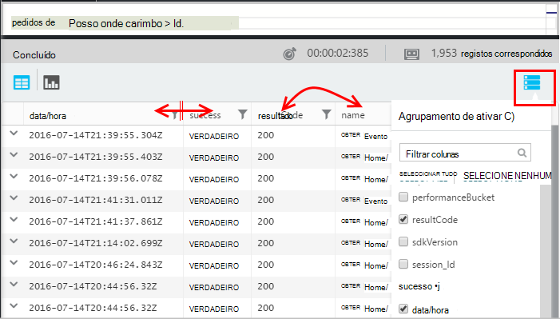

### Ordenar e filtrar itens

Ordene os resultados ao clicar em cabeçalho de uma coluna. Clique novamente para ordenar a outra forma e, clique numa terceira tempo para reverter para a ordenação original devolvidos pela consulta.

Utilize o ícone de filtro para refinar a sua pesquisa.

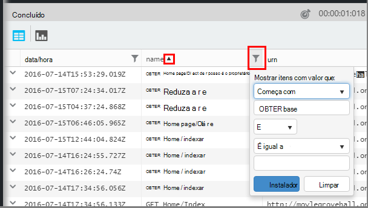

### Agrupar itens

Para ordenar por mais do que uma coluna, utilize o agrupamento. Ativá-la primeiro e, em seguida, arraste os cabeçalhos de coluna para o espaço acima da tabela.

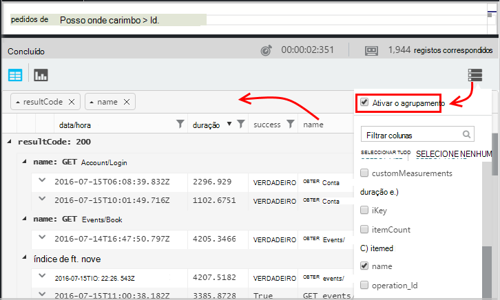

### Em falta alguns resultados?

Existe um limite de linhas n cerca de 10 os resultados devolvidos a partir do portal. Um aviso mostra se abordar o limite. Se o que acontece, ordenar os seus resultados na tabela não sempre mostrar-lhe todos os reais primeiros ou últimos resultados. 

É aconselhável para evitar atingir o limite. Utilize operadores como:

* [onde carimbo data/hora > ago(3d)](app-insights-analytics-reference.md#where-operator)
* [início 100 por data/hora](app-insights-analytics-reference.md#top-operator) 
* [tomar 100](app-insights-analytics-reference.md#take-operator)
* [resumir](app-insights-analytics-reference.md#summarize-operator) 

## Diagramas

Selecione o tipo de diagrama que pretende utilizar:

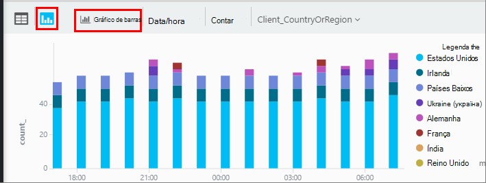

Se tiver várias colunas dos tipos de à direita, pode escolher o x e y eixos e uma coluna de dimensões para dividir os resultados por.

Por predefinição, os resultados são apresentados inicialmente como uma tabela e selecione o diagrama manualmente. Mas pode utilizar a [Compor directiva](app-insights-analytics-reference.md#render-directive) no final de uma consulta para selecionar um diagrama.

## Afixar o dashboard

Pode afixar um diagrama ou tabela para um dos [dashboards partilhados](app-insights-dashboards.md) - basta clicar no pin. (Poderá ter a [sua aplicação do preços pacote de atualização](app-insights-pricing.md) ativar esta funcionalidade.) 

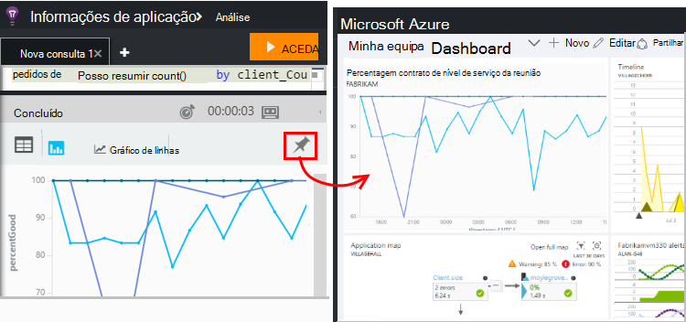

Isto significa que, quando introduz em conjunto num dashboard para ajudá-lo a monitorizar o desempenho ou utilização dos seus serviços web, pode incluir análise bastante complexa juntamente com as outras métricas. 

Pode afixar uma tabela para o dashboard, se tiver colunas de quatro ou menos. São apresentadas apenas sete linhas superiores.

#### Atualização do dashboard

O gráfico afixado ao dashboard é atualizado automaticamente executando novamente a consulta aproximadamente cada meia hora.

#### Simplificações automáticas

Em alguns casos, determinadas simplificações são aplicadas a um gráfico quando afixa a um dashboard.

Quando afixar um gráfico que apresenta muitas posições descontínuos (normalmente, um gráfico de barras), as posições menos preenchidas automaticamente estão agrupadas num único agrupamento "outros". Por exemplo, esta consulta:

    requests | summarize count_search = count() by client_CountryOrRegion

aspeto em Analytics:

mas quando afixa a um dashboard, tem a seguinte apresentação:

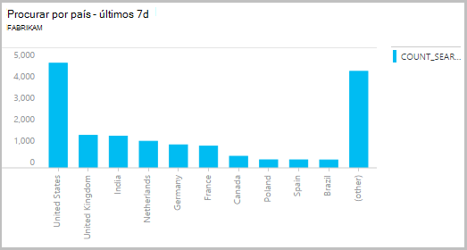

## Exportar para o Excel

Depois de ter executado numa consulta, pode transferir um ficheiro. csv. Clique em **Exportar para o Excel**.

## Exportar para o Power BI

Coloque o cursor numa consulta e selecione **Exportar para o Power BI**.

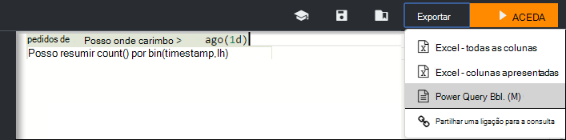

Executar a consulta no Power BI. Pode definir para atualizar uma agenda.

Com o Power BI, pode criar dashboards reúnem os dados a partir de uma grande variedade de origens.

[Saiba mais sobre exportar para o Power BI](app-insights-export-power-bi.md)

[AZURE.INCLUDE [app-insights-analytics-footer](../../includes/app-insights-analytics-footer.md)]

